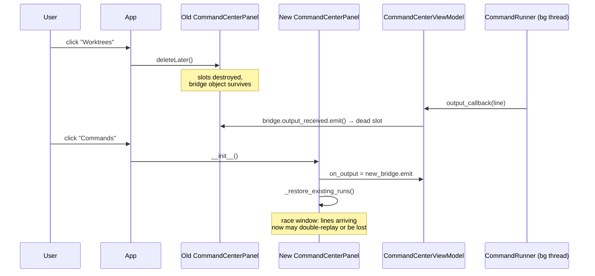
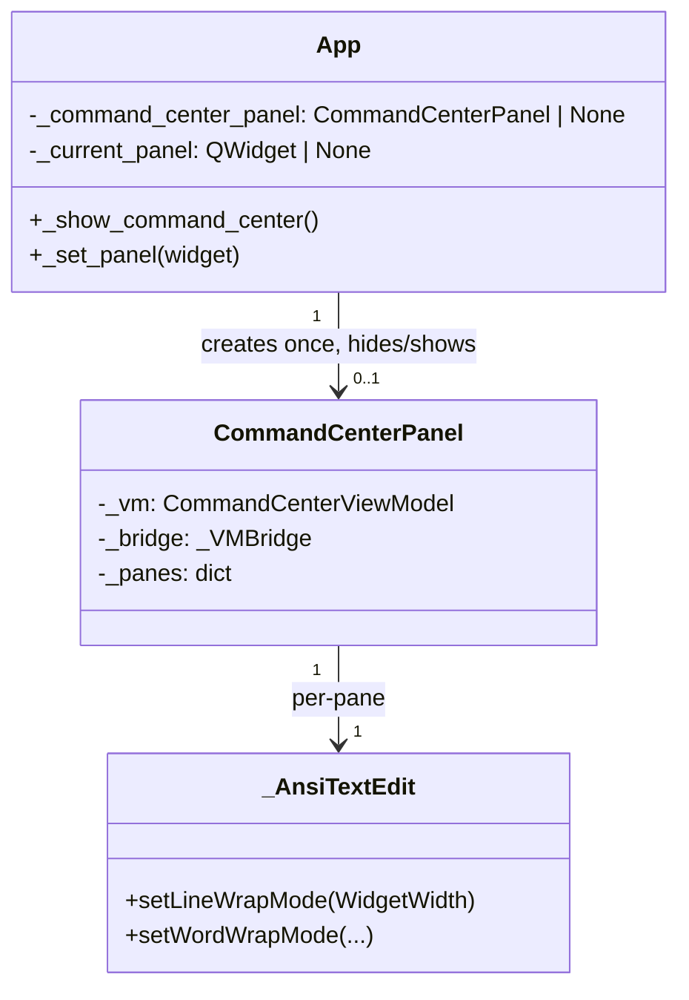

# Command Pane Display Fixes

## Overview

Three related display bugs affect Command Center panes. First, panes stop updating after the user switches to another sidebar tab and comes back — new output lines are lost until the panel is next recreated. Second, long output lines cause horizontal scrolling, pushing the view to the right. Third, there is no line wrapping for long lines, making them hard to read. All three bugs are in the `CommandPane` / `CommandCenterPanel` layer.

## UI / Flow

### Normal state (output streaming)
```
┌─────────────────────────────────────────────────────┐
│ Command Center                        🔔  + Launch  ×│
│ Filter running commands by name or repo…             │
├─────────────────────────────────────────────────────┤
│ ● dev-server · my-repo : main   ↗  ↺  ■  Copy Find ×│
│ ┌─────────────────────────────────────────────────┐ │
│ │$ npm run dev                                    │ │
│ │> vite                                           │ │
│ │                                                 │ │
│ │  VITE v5.0.0  ready in 423 ms                  │ │
│ │                                                 │ │
│ │  ➜  Local:   http://localhost:5173/             │ │
│ │  ➜  Network: use --host to expose               │ │
│ └─────────────────────────────────────────────────┘ │
│ stdin › [                              ] [Send]      │
└─────────────────────────────────────────────────────┘
```

### After fix — long lines wrap instead of extending right
```
│ ┌─────────────────────────────────────────────────┐ │
│ │$ npm run dev                                    │ │
│ │error: this is a very long error message that    │ │
│ │wraps onto the next line without horizontal      │ │
│ │scrolling                                        │ │
│ └─────────────────────────────────────────────────┘ │
```

### Bug: panes stop updating (before fix)
```
User on Command Center tab → launches "dev-server" → output streams in ✓
User clicks "Worktrees" tab → panel destroyed, VM callbacks point at deleted bridge
User clicks "Commands" tab → new panel created, old lines replayed ✓
                            → NEW lines from ongoing process: NOT shown ✗
                            (VM on_output pointed to dead bridge during tab-away period)
```

### After fix: panel is reused, not recreated
```
User on Command Center tab → launches "dev-server" → output streams in ✓
User clicks "Worktrees" tab → panel is HIDDEN, VM callbacks unchanged ✓
User clicks "Commands" tab → panel is SHOWN, all accumulated output present ✓
                            → new output continues to arrive ✓
```

## Architecture

### Bug 1 — Panes stop updating after tab switch

`App._show_command_center()` in [worktree_manager/cli.py:818-825](worktree-manager/worktree_manager/cli.py#L818-L825) constructs a **new** [CommandCenterPanel](worktree-manager/worktree_manager/ui/command_center_panel.py) on every visit. The previous panel is torn down via `_set_panel()` ([cli.py:647-652](worktree-manager/worktree_manager/cli.py#L647-L652)), which calls `deleteLater()` on the old widget.

Two failure modes follow:

1. **Dangling bridge signal connections.** Each panel owns a `_VMBridge` ([command_center_panel.py:12-18](worktree-manager/worktree_manager/ui/command_center_panel.py#L12-L18)). The bridge is a `QObject` with no Qt parent, so its Python reference is held by the panel only. When the panel is `deleteLater()`'d, the panel's Qt slots are destroyed but the bridge is *not* — yet its signals are still connected to those dead slots. The `CommandCenterViewModel`'s `on_output` callback keeps emitting on whichever bridge `_wire_vm()` most recently assigned, which is the *new* panel's bridge — but during the window between `_set_panel()` and the new panel finishing construction, output emissions cross deleted slots.

2. **Replay misses live lines during reconstruction.** When the new panel runs `_restore_existing_runs()` ([command_center_panel.py:105-107](worktree-manager/worktree_manager/ui/command_center_panel.py#L105-L107)) it replays `handle.output_lines` (which `CommandRunner._stream()` buffers regardless of UI state, [command_runner.py:113-117](worktree-manager/worktree_manager/command_runner.py#L113-L117)). However any line produced *between* `_wire_vm()` reassigning the VM callback and the replay loop finishing can be appended twice or skipped entirely depending on thread interleaving.



**Fix:** make `CommandCenterPanel` a persistent widget owned by `App`, created lazily on first access and reused thereafter. `_set_panel()` learns to *hide* the command center instead of destroying it; `_show_command_center()` shows the cached instance. VM wiring happens exactly once.

### Bug 2 & 3 — Horizontal scroll on long lines / no line wrap

[command_pane.py:114](worktree-manager/worktree_manager/ui/command_pane.py#L114) sets `self.setLineWrapMode(QTextEdit.NoWrap)` on the output `_AnsiTextEdit`. Long lines extend rightward; `append_ansi_line()` then scrolls the *vertical* bar to the bottom but Qt may also shift the horizontal viewport to follow the inserted cursor, anchoring the view to the right. Switching to `QTextEdit.WidgetWidth` (with appropriate `QTextOption` wrap policy) eliminates the horizontal scrollbar entirely — there is no rightward content to scroll to, and wrap reflows long lines onto the next visual row.

### Design after fix



### Files involved

- [worktree_manager/cli.py](worktree-manager/worktree_manager/cli.py) — `App.__init__`, `_set_panel`, `_show_command_center`, `_on_command_center_close`: cache the panel, hide instead of destroy
- [worktree_manager/ui/command_center_panel.py](worktree-manager/worktree_manager/ui/command_center_panel.py) — likely no changes; may need a `reset()` if the user wants to clear panes on close
- [worktree_manager/ui/command_pane.py](worktree-manager/worktree_manager/ui/command_pane.py) — `_AnsiTextEdit.__init__` wrap mode change

## Decisions

1. **Scope of persistence.** All four sidebar panels persist: `WorkspaceProjectsPanel`, `CommandCenterPanel`, `WorktreeManagementPanel`, `BranchManagementPanel`. Each is created lazily on first access and reused thereafter. Scroll position, selection, and view-model wiring survive tab switches.

2. **Wrap mode.** `QTextOption.WrapAnywhere` — breaks mid-token so long file paths, URLs, and stack traces wrap cleanly instead of overflowing.

3. **Maximized pane across tab switches.** Preserve. With panel persistence this falls out for free: the maximize state lives on the `CommandCenterPanel` instance.

4. **Close button (×) semantics.** Hide only. Runs and pane state are preserved (matches today's run-survival behaviour, adds visual state preservation). Closing the *app* still kills running commands — that is unchanged.

## Iteration Plan

### Iteration 0 — Walking Skeleton (line wrapping in command output)
**Delivers:** Long lines in any command pane wrap at the widget edge instead of overflowing to the right; no horizontal scrollbar appears.
**Scope:**
- Change `_AnsiTextEdit.__init__` in [worktree_manager/ui/command_pane.py:111-117](worktree-manager/worktree_manager/ui/command_pane.py#L111-L117) to use `QTextEdit.WidgetWidth` line wrap mode and `QTextOption.WrapAnywhere` word wrap mode.
- Add a unit test asserting the wrap modes are set on a fresh `_AnsiTextEdit`.
- Add a behavioural test asserting that after appending a long single-token line, the horizontal scrollbar maximum is 0 (no horizontal scroll).
**Explicitly out of scope:**
- Panel persistence (Iterations 1 and 2)
- Any change to scroll-anchoring behaviour beyond what wrap mode gives us for free
- Changes to the find bar, stdin bar, or any other `CommandPane` chrome

### Iteration 1 — Persistent Command Center panel
**Delivers:** Switching from the Commands tab to any other sidebar tab and back preserves all `CommandCenterPanel` state — running panes keep streaming, scroll position holds, maximized panes stay maximized, find bar text survives. No race window where output is lost.
**Scope:**
- Introduce a panel cache on `App` ([worktree_manager/cli.py:60-103](worktree-manager/worktree_manager/cli.py#L60-L103)). `_command_center_panel` field, lazily created in `_show_command_center` ([cli.py:818-825](worktree-manager/worktree_manager/cli.py#L818-L825)).
- Change `_set_panel` ([cli.py:647-652](worktree-manager/worktree_manager/cli.py#L647-L652)) to *hide* a cached panel rather than `deleteLater()` it. Non-cached panels still get destroyed.
- `_on_command_center_close` ([cli.py:827-828](worktree-manager/worktree_manager/cli.py#L827-L828)) hides the panel and shows the empty main view — runs and visual state survive.
- Tests: cover (a) `_show_command_center` returns the same instance on repeated calls, (b) switching panels hides the cached one without calling `deleteLater`, (c) output streamed during the "tab-away" interval appears in the pane after returning.
**Builds on:** Iteration 0.

## ✋ Manual Testing Gate — Iteration 0

> STOP. Do not proceed to Iteration 1 until every item below is checked off by the user.

- [ ] Launch the app and open the Command Center (click "Commands" in the sidebar).
- [ ] Launch any command (e.g. `echo "a very long line that goes on and on and on and is definitely longer than the pane width to force wrapping behavior"`) and confirm output lines wrap onto multiple visual rows instead of overflowing to the right.
- [ ] Confirm there is no horizontal scrollbar visible on the output area.
- [ ] Confirm the view does not scroll right when a long line is appended — the left edge of the output stays anchored.
- [ ] Confirm short lines (normal output) still display correctly with no visible change.

**How to confirm:** Run the app, perform each action above, and check off each item manually.
Reply "Iteration 0 confirmed" (or describe any failures) before I write the plan for Iteration 1.

## ✋ Manual Testing Gate — Iteration 1

> STOP. Do not proceed to Iteration 2 until every item below is checked off by the user.

- [ ] Launch the app and open the Command Center (sidebar → "Commands"). Launch a command that produces continuous output (e.g. `while true; do echo "tick $(date)"; sleep 1; done`).
- [ ] While the command is running, click a different sidebar tab (e.g. "Worktrees"). Wait 3–5 seconds so new output lines accumulate.
- [ ] Click "Commands" to return to the Command Center. Confirm the pane is still there, all output lines are visible (including those that arrived while you were away), and new lines keep streaming in.
- [ ] Confirm the scroll position and any maximized pane state are preserved exactly as you left them.
- [ ] Click the × (close) button on the Command Center toolbar. Confirm the view clears (e.g. landing screen appears). Click "Commands" again — confirm the same pane is restored with all output intact.
- [ ] Regression: wrap-anywhere still works — long lines still wrap and no horizontal scrollbar appears.

**How to confirm:** Run the app, perform each action above, and check off each item manually.
Reply "Iteration 1 confirmed" (or describe any failures) before I write the plan for Iteration 2.

### Iteration 2 — Persist remaining sidebar panels
**Delivers:** Projects, Worktrees, and Branches panels also persist across tab switches — scroll position, selection, and any in-panel state survive. Sidebar navigation feels stateful, not "reset on every click."
**Scope:**
- Generalise the caching mechanism on `App`: replace the single `_command_center_panel` field with a `_panel_cache: dict[str, QWidget]` keyed by panel kind (`"workspace_projects"`, `"command_center"`, `"worktree_management"`, `"branch_management"`).
- Update `_show_worktree_management` ([cli.py:712-723](worktree-manager/worktree_manager/cli.py#L712-L723)), `_show_branch_management` ([cli.py:725-728](worktree-manager/worktree_manager/cli.py#L725-L728)), `_show_workspace_projects` ([cli.py:830-841](worktree-manager/worktree_manager/cli.py#L830-L841)) to reuse cached instances.
- `_set_panel` hides any cached panel rather than destroying it; non-cached panels (dialogs etc. — none currently flow through this path) keep today's destroy behaviour.
- Tests: assert each of the four panel-show methods returns the same instance on repeated calls, and that switching between any two preserves both instances in the cache.
**Builds on:** Iteration 1.

## ✋ Manual Testing Gate — Iteration 2

> STOP. Do not declare the feature complete until every item below is checked off.

- [ ] Launch the app. Open the Workspace Projects panel (sidebar → "Projects"). Scroll down if there are projects, or note the empty state.
- [ ] Click "Worktrees". Then click "Projects" again — confirm you are returned to the exact same scroll position and state you left (not a freshly constructed panel).
- [ ] Open the Worktrees panel. Navigate to a repo, scroll the worktree list partway down.
- [ ] Click "Commands", then click "Worktrees" again — confirm the scroll position and repo selection are preserved.
- [ ] Open the Branches panel (sidebar → "Branches"). Expand or interact with it.
- [ ] Click "Worktrees", then click "Branches" again — confirm the panel state is preserved, not reset.
- [ ] Cycle through all four tabs in order (Projects → Worktrees → Branches → Commands → Projects) and confirm each returns to the state it was left in.
- [ ] Regression: Command Center still preserves running panes and streaming output across tab switches (Iteration 1 behaviour still works).
- [ ] Regression: Long lines in command output still wrap and no horizontal scrollbar appears (Iteration 0 behaviour still works).

**How to confirm:** Run the app, perform each action above, and check off each item manually.
Reply "Iteration 2 confirmed" (or describe any failures) before declaring the feature done.
