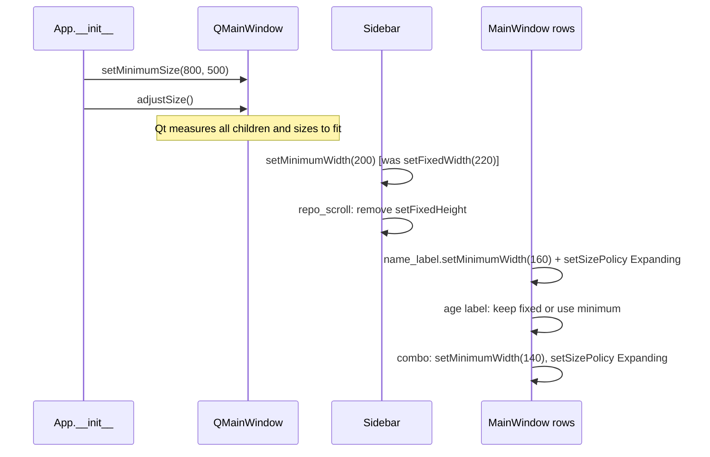

# Content-Scaling UI

## Overview

The app's windows and dialogs are pinned to hard-coded pixel dimensions (e.g. `resize(1400, 900)`, `resize(440, 520)`, `setFixedWidth(220)` for the sidebar, `setFixedWidth(200)` for worktree name labels). This means the UI doesn't adapt to content — long repo names get clipped, dialogs are either too big or too small on different displays, and the main window feels oversized on smaller screens. The feature replaces hard-coded sizes with content-driven sizing: windows call `adjustSize()` after construction so Qt measures the actual content and picks the right initial dimensions; fixed-width column labels in worktree rows switch to `setMinimumWidth` + stretch so text is never clipped; and dialogs lose their `resize()` hard-coding so they grow or shrink to fit what's in them.

## UI / Flow

### Empty state (landing screen — no repo selected)

```
┌──────────────────────────────────────────────────────────┐
│ [⊞ Command Center] [⊞ Workspace Projects]  ◀─ sidebar   │
│ ▼ REPOS                                                  │
│  (empty)                                                 │
│  [+ Add Repo]   [↻ Refresh]                              │
├──────────────────────────────────────────────────────────┤
│       No repo selected.                                  │
│  Pick one from the sidebar or click + Add Repo.          │
└──────────────────────────────────────────────────────────┘

Window auto-sizes to content; sidebar wraps its buttons.
```

### Main window — repo loaded

```
┌────────────────────────────────────────────────────────────────────────┐
│  Git Worktree Manager — my-long-repo-name-here       [🧹] [⚙]         │
├──────────────────────────────────────────────────────────────────────── │
│  Worktrees                                              [+ New]         │
│  ● (main)     2d ago          [main ▾]                                 │
│  ○ feature/very-long-name  5h ago  ⚠ stale  [feature/branch ▾]  [✕]  │
│  ○ fix/short  10m ago           [fix/another ▾]              [✕]       │
└────────────────────────────────────────────────────────────────────────┘

Name column: min-width set, stretches to fill space — no clipping.
Window: no hard-coded size; initial size comes from adjustSize().
```

### Dialog — launch dialog

```
┌─────────────────────────────────┐
│  Launch Command                 │
│  Repo: [my-repo ▾]             │
│  Worktree: [feature ▾]         │
│  Command: [─────────────────]  │
│           [────────────────────]│
│                    [Cancel][Run]│
└─────────────────────────────────┘

No hard-coded resize(440, 520) — dialog auto-sizes to its fields.
```

### Sidebar — expanded repos

```
┌──────────────────────┐
│ [⊞ Command Center]   │
│ [⊞ Workspace Projs]  │
│ ▼ REPOS              │
│  ● my-repo      [✕]  │
│  ○ another-repo [✕]  │
│  ○ a-very-long-repo-name [✕] │
│                      │
│ [+ Add Repo]         │
│ [↻ Refresh]          │
└──────────────────────┘

setFixedWidth(220) → setMinimumWidth(200), no max; repo scroll
setFixedHeight(220) → removed so sidebar stretches vertically.
```

## Architecture

```mermaid
graph TD
    A[cli.py App] -->|resize + setMinimumSize| B[Main Window sizing]
    C[sidebar.py Sidebar] -->|setFixedWidth| D[Sidebar width]
    E[main_window.py MainWindow] -->|setFixedWidth on labels/combo| F[Row column widths]
    G[Dialogs: launch, cleanup, spotlight, etc.] -->|resize()| H[Dialog sizing]

    B -->|Replace with adjustSize + setMinimumSize| B2[Content-driven main window]
    D -->|Replace with setMinimumWidth| D2[Flexible sidebar width]
    F -->|Replace fixed with setMinimumWidth + stretch| F2[Non-clipping row columns]
    H -->|Remove resize() calls| H2[Content-driven dialogs]
```



## Open Questions

(none)

## Iteration Plan

### Iteration 0 — Walking Skeleton
**Delivers:** The main window and sidebar stop using hard-coded fixed sizes and instead size themselves from their content, with worktree name labels no longer clipping on long names.
**Scope:**
- `cli.py`: replace `resize(1400, 900)` + `setMinimumSize(1000, 650)` with `setMinimumSize(800, 500)` + `adjustSize()`
- `sidebar.py`: replace `setFixedWidth(220)` with `setMinimumWidth(200)`; remove `setFixedHeight(220)` from repo scroll area
- `main_window.py`: replace `setFixedWidth(200)` on `name_label` with `setMinimumWidth(160)` + `setSizePolicy(QSizePolicy.Expanding, QSizePolicy.Preferred)`; give the branch combo the same treatment (`setMinimumWidth(140)` + Expanding policy instead of `setFixedWidth(160)`)

**Explicitly out of scope:**
- Dialogs (launch, cleanup, spotlight, manage commands, etc.) — deferred to Iteration 1
- Fine-tuning of age/stale column widths
- Any visual style changes

### Iteration 1 — Dialog Content Sizing
**Delivers:** All hard-coded `resize()` calls in dialogs are removed so every dialog opens at a size driven by its own content.
**Scope:**
- Remove `self.resize(440, 520)` from `launch_dialog.py`
- Remove `self.resize(520, 520)` from `cleanup_wizard.py`
- Remove `self.resize(520, 320)` from `spotlight_overlay.py`
- Remove `self.resize(520, 480)` from `manage_commands_dialog.py`
- Remove `self.resize(480, 360)` from `manage_nicknames_dialog.py`
- Remove `self.resize(460, 460)` from `project_operations_dialog.py`
- Remove `self.resize(460, 140)` from `quick_launch_dialog.py`
- Remove `self.resize(900, 600)` from `command_popout.py`
- Add `adjustSize()` after layout construction in each dialog where Qt needs a nudge
**Builds on:** Iteration 0.

## ✋ Manual Testing Gate — Iteration 1

> STOP. Do not proceed until every item below is checked off by the user.

- [ ] Open the Launch Command dialog — confirm it sizes to its content, not a fixed 440×520
- [ ] Open the Cleanup Wizard — confirm it sizes to its content, not a fixed 520×520
- [ ] Open the Spotlight overlay (Ctrl+K) — confirm it sizes to its content, not a fixed 520×320
- [ ] Open Manage Commands — confirm it sizes to its content, not a fixed 520×480
- [ ] Open Manage Nicknames — confirm it sizes to its content, not a fixed 480×360
- [ ] Open a Project Operations dialog (new or edit) — confirm it sizes to its content, not a fixed 460×460
- [ ] Open Quick Launch — confirm it sizes to its content, not a fixed 460×140
- [ ] Open Command Popout — confirm it sizes to its content, not a fixed 900×600
- [ ] Regression: worktree name labels still show short names with tooltip on hover
- [ ] Regression: projects view still shows short names with tooltip on hover

**How to confirm:** Run the app, open each dialog, and check off each item manually.
Reply "Iteration 1 confirmed" (or describe any failures) before I declare the feature complete.

## ✋ Manual Testing Gate — Iteration 0

> STOP. Do not proceed to Iteration 1 until every item below is checked off by the user.

- [ ] Launch the app — confirm the window opens at a reasonable size (not 1400×900)
- [ ] Resize the window smaller — confirm it can go down to ~800px wide without breaking layout
- [ ] Load a repo with a long name — confirm the worktree name label is not clipped
- [ ] Expand the sidebar repos section — confirm the repo scroll area stretches vertically instead of being capped at 220px
- [ ] Load a repo with many worktrees — confirm worktree rows lay out without horizontal overflow or clipping
- [ ] Confirm the branch combo box in each worktree row expands to fill available space rather than being pinned at 160px wide

**How to confirm:** Run the app, perform each action above, and check off each item manually.
Reply "Iteration 0 confirmed" (or describe any failures) before I write the plan for Iteration 1.
