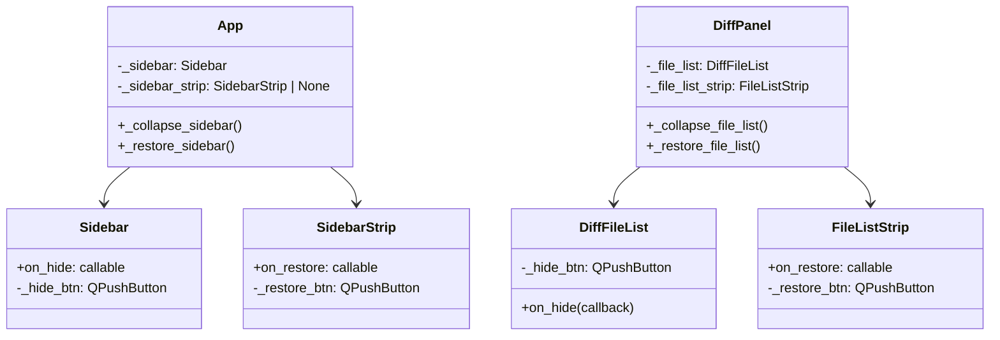

# Diff Fullscreen Mode

## Overview

Two independent hide toggles let the user reclaim screen space while reviewing diffs:

1. **Sidebar collapse** — a "◀" button at the bottom of the sidebar (near Settings) collapses it to a thin `▶` restore strip at the left edge. Independent of everything else.
2. **File list collapse** — a "‹" button in the top-right of the file list header collapses that pane; a thin `›` restore strip remains in its place. Works whether or not the sidebar is hidden.

Both toggles are independent — the user can collapse either one, both, or neither.

## UI / Flow

### Normal state

```
┌────────────────────────────────────────────────────────────────────────┐
│ ┌──────────┐ ┌─────────────────────────────────────────────────────┐  │
│ │ Projects │ │  ⇄ Diff                                             │  │
│ │ Commands │ │  Repo: [ my-app ▼ ]   Worktree: [ main ▼ ]          │  │
│ │ ⇄ Diff   │ │  FROM: main  →  TO: Working tree   [← Change]       │  │
│ │ Worktrees│ │  ──────────────────────────────────────────────────  │  │
│ │ Branches │ │  ┌─────────────────┬──────────────────────────────┐ │  │
│ │          │ │  │ Files (12)      │  src/auth/login.py [M]        │ │  │
│ │──────────│ │  │ ✦ login.py  [M] │  @@ -10,7 +10,9 @@           │ │  │
│ │ ↻ Refresh│ │  │   utils.py  [M] │  - validate(user)             │ │  │
│ │ ⚙Settings│ │  │   [‹ Hide]      │                               │ │  │
│ │ [◀ Hide] │ │  └─────────────────┴──────────────────────────────┘ │  │
│ └──────────┘ └─────────────────────────────────────────────────────┘  │
└────────────────────────────────────────────────────────────────────────┘
```

### Sidebar collapsed (thin strip at left edge)

```
┌────────────────────────────────────────────────────────────────────────┐
│ [▶]┌──────────────────────────────────────────────────────────────┐   │
│    │  ⇄ Diff                                                       │   │
│    │  Repo: [ my-app ▼ ]   Worktree: [ main ▼ ]                   │   │
│    │  FROM: main  →  TO: Working tree   [← Change]                 │   │
│    │  ────────────────────────────────────────────────────────     │   │
│    │  ┌──────────────[‹]┬──────────────────────────────────────┐  │   │
│    │  │ Files (12)      │  src/auth/login.py [M]                │  │   │
│    │  │ ✦ login.py  [M] │  @@ -10,7 +10,9 @@                   │  │   │
│    │  └─────────────────┴──────────────────────────────────────┘  │   │
│    └──────────────────────────────────────────────────────────────┘   │
└────────────────────────────────────────────────────────────────────────┘
```

The `[▶]` strip is a narrow (24px wide) clickable widget pinned to the left. Clicking it restores the sidebar.

### File list collapsed (thin strip replaces it in the splitter)

```
┌────────────────────────────────────────────────────────────────────────┐
│ ┌──────────┐ ┌─────────────────────────────────────────────────────┐  │
│ │ Projects │ │  ⇄ Diff                                             │  │
│ │ Commands │ │  Repo: [ my-app ▼ ]                                  │  │
│ │ ⇄ Diff   │ │  ──────────────────────────────────────────────     │  │
│ │ Worktrees│ │  ┌──┬─────────────────────────────────────────────┐ │  │
│ │ Branches │ │  │▶ │  src/auth/login.py [M]      [↗ Open File]   │ │  │
│ │──────────│ │  │  │  @@ -10,7 +10,9 @@                          │ │  │
│ │ ↻ Refresh│ │  │  │  - validate(user)                           │ │  │
│ │ ⚙Settings│ │  │  │  + validate_v2(user)                        │ │  │
│ │ [◀ Hide] │ │  └──┴─────────────────────────────────────────────┘ │  │
│ └──────────┘ └─────────────────────────────────────────────────────┘  │
└────────────────────────────────────────────────────────────────────────┘
```

The `▶` strip is a narrow (24px wide) vertical bar at the left of the hunk view area. Clicking it restores the file list.

### Both collapsed — maximum hunk real estate

```
┌────────────────────────────────────────────────────────────────────────┐
│ [▶] ┌──┬──────────────────────────────────────────────────────────┐   │
│     │▶ │  src/auth/login.py [M]                   [↗ Open File]   │   │
│     │  │  @@ -10,7 +10,9 @@                                       │   │
│     │  │  - validate(user)                                        │   │
│     │  │  + validate_v2(user)                                     │   │
│     │  │  + audit_log(user)                                       │   │
│     └──┴──────────────────────────────────────────────────────────┘   │
└────────────────────────────────────────────────────────────────────────┘
```

## Architecture

### Sidebar collapse

The sidebar collapse is entirely self-contained within the `App` + `Sidebar` boundary:

- [worktree-manager/worktree_manager/ui/sidebar.py](worktree-manager/worktree_manager/ui/sidebar.py) — add a "◀ Hide" button at the bottom (same style as Settings/Refresh); clicking fires an `on_hide` callback
- [worktree-manager/worktree_manager/cli.py](worktree-manager/worktree_manager/cli.py) — implement `_collapse_sidebar()`: replace `self._sidebar` in `_central_layout` with a narrow `SidebarStrip` restore widget; implement `_restore_sidebar()`: remove strip, re-insert `self._sidebar`
- New `worktree_manager/ui/sidebar_strip.py` — `SidebarStrip`: a 24px-wide `QWidget` with a vertical "▶" `QPushButton` that calls `on_restore` callback

### File list collapse

Contained within `DiffPanel` + `DiffFileList`:

- [worktree-manager/worktree_manager/ui/diff_file_list.py](worktree-manager/worktree_manager/ui/diff_file_list.py) — add a "‹" `QPushButton` in the top-right of the layout header; clicking fires `on_hide` callback
- [worktree-manager/worktree_manager/ui/diff_panel.py](worktree-manager/worktree_manager/ui/diff_panel.py) — wire `DiffFileList.on_hide` → `_collapse_file_list()`: hide `self._file_list`, show a new `FileListStrip` (`›` button) in the splitter's left slot; `_restore_file_list()`: show `self._file_list`, hide strip
- New `worktree_manager/ui/file_list_strip.py` — `FileListStrip`: a 24px-wide `QWidget` with a vertical "›" button that calls `on_restore`



## Open Questions

_(none)_

---

## Iteration Plan

### Iteration 0 — Sidebar Collapse
**Delivers:** A "◀ Hide" button at the bottom of the sidebar collapses it to a narrow `▶` strip; clicking the strip restores it.

**Scope:**
- Add `on_hide` callback arg + "◀ Hide" button at the bottom of [worktree-manager/worktree_manager/ui/sidebar.py](worktree-manager/worktree_manager/ui/sidebar.py) (same style/size as the Settings button)
- New `worktree_manager/ui/sidebar_strip.py` — `SidebarStrip`: 24px-wide `QWidget`, a rotated or vertical "▶" `QPushButton` that fires `on_restore`; fixed width 24px, expands vertically
- Add `_collapse_sidebar()` and `_restore_sidebar()` to [worktree-manager/worktree_manager/cli.py](worktree-manager/worktree_manager/cli.py): remove/add `self._sidebar` from `_central_layout`, insert/remove `SidebarStrip` in its place
- Pass `on_hide=self._collapse_sidebar` when constructing `Sidebar` in `App.__init__`

**Explicitly out of scope:** file list collapse, keyboard shortcut, persisting collapse state

---

### Iteration 1 — File List Collapse
**Delivers:** A "‹ Hide" button at the bottom of the file list pane collapses it to a narrow `▶` strip inside the diff splitter; clicking restores it.

**Scope:**
- Add a "‹ Hide" `QPushButton` at the **bottom** of [worktree-manager/worktree_manager/ui/diff_file_list.py](worktree-manager/worktree_manager/ui/diff_file_list.py) (below the list widget, mirroring the sidebar's bottom Hide button); fire `on_hide` callback; expose `on_hide(callback)` method
- New `worktree_manager/ui/file_list_strip.py` — `FileListStrip`: 24px-wide `QWidget`, vertical "▶" button, fires `on_restore`
- Add `_collapse_file_list()` and `_restore_file_list()` to [worktree-manager/worktree_manager/ui/diff_panel.py](worktree-manager/worktree_manager/ui/diff_panel.py): hide `self._file_list` and show `FileListStrip` as the splitter's left widget (or swap via `QSplitter`); restore reverses this
- Wire in `DiffPanel.__init__`: `self._file_list.on_hide(self._collapse_file_list)`
- Make the `QSplitter` handle between file list and hunk view visually distinct and draggable: set `handleWidth` to 6px and add a simple style so the handle is grabbable
- Style the `QListWidget` in [worktree-manager/worktree_manager/ui/diff_file_list.py](worktree-manager/worktree_manager/ui/diff_file_list.py) so the selected row is clearly highlighted (e.g. blue background + white text via `QListWidget::item:selected` stylesheet); ensure `SingleSelection` mode is set

**Builds on:** Iteration 0

**Explicitly out of scope:** keyboard shortcut, persisting collapse state, persisting splitter position

---

## ✋ Manual Testing Gate — Iteration 0

> STOP. Do not proceed to Iteration 1 until every item below is checked off by the user.

- [ ] Launch the app (`python3.14 run.py` in `worktree-manager/`) — the sidebar has a "◀ Hide" button at the bottom (below Settings)
- [ ] Click "◀ Hide" — the sidebar disappears and a narrow vertical strip with a "▶" button appears at the left edge
- [ ] Click the "▶" strip — the full sidebar reappears; the strip disappears
- [ ] Collapse and restore the sidebar several times — no crash, no layout glitch
- [ ] **Regression:** All sidebar tab buttons (Projects, Commands, Diff, Worktrees, Branches) still work normally after restore
- [ ] **Regression:** The diff tab still works end-to-end (pick repo/FROM/TO → Compare → file list → hunks)

**How to confirm:** Run the app, perform each action above, and check off each item manually.
Reply "Iteration 0 confirmed" (or describe any failures) before I write the plan for Iteration 1.

---

## ✋ Manual Testing Gate — Iteration 1

> STOP. Do not proceed until every item below is checked off by the user.

- [ ] Navigate to the Diff tab, pick a repo/FROM/TO, click Compare — the file list pane shows a "‹ Hide" button at the bottom of the file list (below the file entries)
- [ ] Click "‹" — the file list pane collapses to a narrow vertical strip with a "›" button; the hunk view fills the remaining width
- [ ] Click the "›" strip — the file list pane restores to its normal width
- [ ] Collapse the file list and collapse the sidebar — both are hidden simultaneously; hunk view fills the entire window
- [ ] Restore both (sidebar strip "▶" first, then file list strip "›") — layout returns to normal
- [ ] Click a file in the file list — the selected row is visibly highlighted (distinct background + text colour); clicking a different file moves the highlight to the new row
- [ ] Drag the splitter handle between the file list and hunk view — both panes resize smoothly; the handle is wide enough to grab easily
- [ ] **Regression:** File selection still works after restore — clicking a file in the restored list shows its hunks
- [ ] **Regression:** Sidebar collapse/restore (Iteration 0) still works independently
- [ ] **Regression:** Restore + Open File behaviour unchanged in live mode

**How to confirm:** Run the app, perform each action above, and check off each item manually.
Reply "Iteration 1 confirmed" (or describe any failures).
