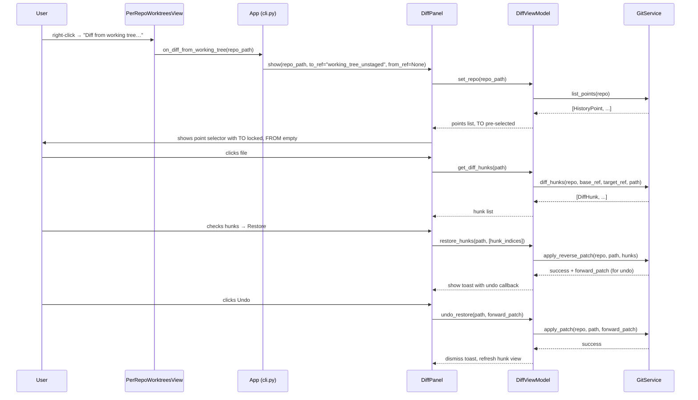
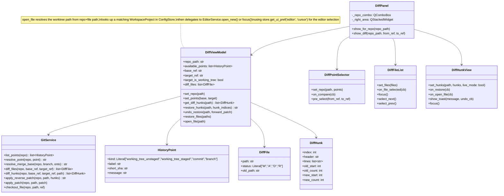

# DiffSelector — Integrated into Worktree Manager

## Overview

Instead of a standalone tool, DiffSelector becomes a native panel inside Worktree Manager. The worktree list is already the user's primary mental model for "what's going on in this repo" — adding a **Diff** tab alongside Worktrees / Branches / Commands puts history exploration exactly where the user already lives.

Two entry points cover all use cases with minimal clicks:

1. **Quick path (2 clicks):** right-click any worktree row → "Diff from working tree…" → lands on point selector with TO pre-set to "Working tree (unstaged)", user picks FROM → Compare.
2. **Full path (Diff tab):** open the Diff tab → repo dropdown → pick FROM and TO from inline listboxes → Compare.

Config is unified into Worktree Manager's existing `~/.config/worktree-manager/config.json` (no separate diffselector config file).

### Decisions recorded
- **Entry point A:** context menu on worktree row in `PerRepoWorktreesView` → "Diff from working tree…" → opens DiffPanel with repo + TO pre-set to "Working tree (unstaged)", FROM unpopulated; lands on point selector with TO already locked so user only needs to pick FROM
- **Entry point B:** sidebar "⇄ Diff" tab → repo dropdown at top → inline point selector; user picks FROM/TO → Compare
- **Restore + Open File availability:** only when **TO is a working tree point** ("Working tree (unstaged)" or "Working tree (staged)") — these operate on live files on disk. When TO is a commit or branch, both buttons are hidden and the hunk view is read-only.
- **Restore confirmation:** toast-with-undo — non-blocking toast at bottom of the hunk pane with an Undo button, good for rapid hunk-by-hunk restores
- **Restore direction:** always restores to FROM (base/older) — same as standalone design
- **Restore granularity:** hunk-level with whole-file shortcut — same as standalone design
- **Open File button:** opens the selected file in the editor; if a workspace project exists whose entries include the worktree path, open that project's editor window; otherwise open the file directly via `EditorService`
- **Config:** unified into Worktree Manager's `ConfigStore` (`~/.config/worktree-manager/config.json`)
- **Repo scope:** Both the Diff panel and the Worktrees panel use a compact repo **dropdown** at the top of the panel body — no left-pane column. This is a refactor of `WorktreeManagementPanel` as part of this feature.
- **Framework:** PyQt6 / PySide6, matching the rest of Worktree Manager (not customtkinter as in the original diffselector design)
- **Point selector layout:** two stacked listboxes (FROM on top, TO below)
- **Keyboard navigation (diff view):** fully keyboard-driven once the diff is loaded — see "Keyboard Navigation" section below
- **Default editor:** user-configurable in Settings (Cursor or VS Code); stored in `ConfigStore` under `settings.editor`; `EditorService` reads this setting to resolve the CLI command
- **Projects panel diff entry point:** "Diff from working tree…" and "Compare branches…" also appear in the right-click context menu on worktree entry rows in `WorkspaceProjectsPanel` — identical behaviour to Entry Point A
- **Project operations dialog branch switch:** the plain `worktree_name: branch_name` label in `ProjectOperationsDialog._render_worktree_rows` becomes a `QComboBox`; switching calls `vm.switch_branch_in_project` inline; blocked if target branch is already checked out elsewhere

## UI / Flow

### Entry Point A — Right-click on Worktree Row (fastest path)

The worktree row context menu gains two new items:

```
┌──────────────────────────────────────────────────────────────┐
│  Worktrees — my-app                                          │
│  ┌─────────────────────────────────────────────────────────┐ │
│  │ ● main           3h ago  [main        ▼]  [Delete]      │ │
│  │ ○ feature/login  1d ago  [feature/… ▼]  [Delete]  ←right-click│
│  │           ┌──────────────────────────────────────────┐   │ │
│  │           │ Generate Project                         │   │ │
│  │           │ Run Command                              │   │ │
│  │           │ ──────────────────────────────────────── │   │ │
│  │           │ Diff from working tree…                  │   │ │
│  │           │ Compare branches…                        │   │ │
│  │           └──────────────────────────────────────────┘   │ │
│  └─────────────────────────────────────────────────────────┘ │
└──────────────────────────────────────────────────────────────┘
```

**"Diff from working tree…":**
- Switches to Diff tab
- Pre-selects this repo + TO = "Working tree (unstaged)", FROM = unpopulated
- Lands on the point selector (Screen 2) with TO already chosen — user picks FROM (merge-base, a previous commit, a branch, etc.) then hits Compare

**"Compare branches…":**
- Switches to Diff tab
- Pre-selects this repo but leaves FROM/TO empty — user picks both (restore + open file will only activate if the user picks a working tree point as TO)

This same context menu is also available on worktree entry rows in the **Projects panel** (right-click on any `worktree_name: branch` row). The "Diff from working tree…" item maps the worktree path to its repo and fires the same entry point.

### Entry Point A2 — Right-click on Worktree Row in Projects Panel

The Projects panel's worktree entry rows (`worktree_name: branch`) already have a context menu with "Generate Project" and "Run Command…". This feature extends that menu with the same two diff actions:

```
┌──────────────────────────────────────────────────────────────────┐
│  Workspace Projects                                              │
│  ──────────────────────────────────────────────────────────────  │
│  ▼ my-app                               [Open] [Edit] [✕]       │
│      feature-login:  [main          ▼]  ← right-click here      │
│              ┌─────────────────────────────────────────────┐     │
│              │ Generate Project                             │     │
│              │ Run Command…                                 │     │
│              │ ─────────────────────────────────────────── │     │
│              │ Diff from working tree…                      │     │
│              │ Compare branches…                            │     │
│              └─────────────────────────────────────────────┘     │
│      main:           [feature/auth ▼]                           │
└──────────────────────────────────────────────────────────────────┘
```

The worktree path is already known from the entry row — it's passed to `on_diff_from_working_tree` the same way as in the Worktrees tab.

### Project Operations Dialog — Branch Switch

The "Add worktrees" section of `ProjectOperationsDialog` currently shows each worktree as a plain text label `worktree_name: branch_name`. This becomes a branch dropdown, matching the live panel behavior:

```
┌──────────────────────────────────────────────────────────────────┐
│  New Workspace Project / Edit Project                            │
│  ──────────────────────────────────────────────────────────────  │
│  Repo:  [ my-app ▼ ]                                             │
│                                                                  │
│  Worktrees:                          [+ Create new worktree ▾]   │
│  ┌──────────────────────────────────────────────────────────┐    │
│  │  (main):     [ main          ▼ ]  [Add]  [New branch…]   │    │
│  │  fix-auth:   [ fix/auth-v2   ▼ ]  [Add]  [New branch…]   │  ← branch is a dropdown now
│  │  feature-x:  [ feature/x     ▼ ] ⚠dirty [Add] [New branch…] │  │
│  └──────────────────────────────────────────────────────────┘    │
│                                                                  │
│  Entries:                                                        │
│  (none)                                                          │
└──────────────────────────────────────────────────────────────────┘
```

Switching the dropdown in the dialog calls `vm.switch_branch_in_project(worktree_path, new_branch)` inline (same VM method used by the live panel). The dirty warning (`⚠ dirty`) still appears when the worktree has uncommitted changes. Branch switching is blocked (combo reverts + error shown) if the selected branch is already checked out in another worktree.

### Entry Point B — "⇄ Diff" Sidebar Tab

A new tab is added to the sidebar between Commands and Worktrees:

```
[📁 Projects]  [⊞ Commands]  [⇄ Diff]  [🌳 Worktrees]  [🌿 Branches]
```

The Diff panel (and the refactored Worktrees panel) use a **repo dropdown** at the top instead of a left-pane column:

```
┌──────────────────────────────────────────────────────────────────┐
│  ⇄ Diff                                                          │
│  ──────────────────────────────────────────────────────────────  │
│                                                                  │
│  Repo:  [ my-app                                              ▼] │
│                                                                  │
│  FROM (base — restore destination)                              │
│  ┌────────────────────────────────────────────────────────────┐  │
│  │ [🔍 Search...                                            ] │  │
│  │ ○ Working tree (unstaged)                                  │  │
│  │ ○ Working tree (staged)                                    │  │
│  │ ──────────────────────────────────────────────────────     │  │
│  │ ● main              abc1234  "Merge PR #42"                │  │
│  │ ○ feature/login     def5678  "Add auth flow"               │  │
│  │ ○ HEAD~1            ghi9012  "Fix tests"                   │  │
│  └────────────────────────────────────────────────────────────┘  │
│                                                                  │
│  TO (target — what to diff against)                             │
│  ┌────────────────────────────────────────────────────────────┐  │
│  │ [🔍 Search...                                            ] │  │
│  │ ● Working tree (unstaged)                                  │  │
│  │ ○ Working tree (staged)                                    │  │
│  │ ──────────────────────────────────────────────────────     │  │
│  │ ○ main              abc1234  "Merge PR #42"                │  │
│  │ ○ feature/login     def5678  "Add auth flow"               │  │
│  └────────────────────────────────────────────────────────────┘  │
│                                                                  │
│  ⚠ "feature/login" resolved to merge-base def5678              │
│                                                                  │
│                                        [ Compare → ]            │
└──────────────────────────────────────────────────────────────────┘
```

### Screen 3 — File Diff List + Hunk Restore

After Compare is clicked (or triggered via Entry Point A), the point selectors collapse to a compact one-line summary bar and the panel body shows the diff.

**Live mode — TO is a working tree point** (restore + open file enabled):

```
┌──────────────────────────────────────────────────────────────────┐
│  ⇄ Diff                                                          │
│  ──────────────────────────────────────────────────────────────  │
│                                                                  │
│  Repo:  [ my-app                                              ▼] │
│  FROM: main (abc1234)  →  TO: Working tree     [← Change]       │
│  ──────────────────────────────────────────────────────────────  │
│                                                                  │
│  ┌──────────────────┬───────────────────────────────────────┐    │
│  │ Files (12)       │  src/auth/login.py [M]  [↗ Open File] │    │
│  │ [🔍 Filter...  ] │  ────────────────────────────────────  │    │
│  │ [focused: ↑↓→O] │  [focused: ↑↓←O]                       │    │
│  │                  │                                        │    │
│  │ ✦ login.py   [M] │  ☐  Hunk 1/2  @@ -10,7 +10,9 @@      │    │
│  │   utils.py   [M] │  ──────────────────────────────────   │    │
│  │   test_login     │     def login(user, pwd):             │    │
│  │   docs/auth  [A] │  -      validate(user)                │    │
│  │   config/set [D] │  +      validate_v2(user)             │    │
│  │   ...          ▓ │  +      audit_log(user)               │    │
│  │                  │         return token(...)             │    │
│  │                  │                                        │    │
│  │                  │  ☑  Hunk 2/2  @@ -25,4 +27,4 @@      │    │
│  │                  │  ──────────────────────────────────   │    │
│  │                  │     def logout(user):                 │    │
│  │                  │  -      old_cleanup(user)             │    │
│  │                  │  +      new_cleanup(user)             │    │
│  │                  │                                        │    │
│  │                  │  ──────────────────────────────────   │    │
│  │                  │  [☑ All] [☐ None]                     │    │
│  │                  │  [ Restore 1 hunk → FROM ]            │    │
│  └──────────────────┴───────────────────────────────────────┘    │
│                                                                  │
│  ✓ Restored 1 hunk in src/auth/login.py   [ Undo ]   ← toast   │
└──────────────────────────────────────────────────────────────────┘
```

**Read-only mode — TO is a commit or branch** (restore + open file hidden):

```
┌──────────────────────────────────────────────────────────────────┐
│  Repo:  [ my-app                                              ▼] │
│  FROM: main (abc1234)  →  TO: feature/login (def5678) [← Change]│
│  ──────────────────────────────────────────────────────────────  │
│                                                                  │
│  ┌──────────────────┬───────────────────────────────────────┐    │
│  │ Files (5)        │  src/auth/login.py [M]                 │    │
│  │ [🔍 Filter...  ] │  ────────────────────────────────────  │    │
│  │ ↕ scrollable     │  ↕ scrollable           (read-only)   │    │
│  │                  │                                        │    │
│  │ ✦ login.py   [M] │     Hunk 1/2  @@ -10,7 +10,9 @@      │    │
│  │   utils.py   [M] │  ──────────────────────────────────   │    │
│  │   ...          ▓ │     def login(user, pwd):             │    │
│  │                  │  -      validate(user)                │    │
│  │                  │  +      validate_v2(user)             │    │
│  │                  │                                        │    │
│  │                  │     Hunk 2/2  @@ -25,4 +27,4 @@      │    │
│  │                  │  ──────────────────────────────────   │    │
│  │                  │  -      old_cleanup(user)             │    │
│  │                  │  +      new_cleanup(user)             │    │
│  └──────────────────┴───────────────────────────────────────┘    │
└──────────────────────────────────────────────────────────────────┘
```

No checkboxes, no restore button, no open file button in read-only mode — hunks are displayed for browsing only.

"[← Change]" collapses back to the point selector. Changing the repo dropdown resets to the point selector for the newly selected repo.

### Toast-with-undo

After a restore, a non-blocking toast appears at the bottom of the right pane:

```
┌────────────────────────────────────────────────────────┐
│  ✓ Restored 1 hunk in src/auth/login.py   [ Undo ]    │
└────────────────────────────────────────────────────────┘
```

Auto-dismisses after 8 seconds. Undo calls `git apply` with the original forward patch to reverse the reverse.

### Keyboard Navigation (diff view)

The diff view (Screen 3) is fully keyboard-driven. Focus starts on the file list when the diff first loads.

**Focus model — two zones:**
- **File list** (left pane): has focus indicator (highlighted row)
- **Hunk content** (right pane): has focus indicator (scrollable)

```
┌──────────────────────────────────────────────────────────────────┐
│  [File list focused]          [Hunk content focused]             │
│                                                                  │
│  ↑ / ↓  → move between files   ↑ / ↓  → scroll hunk content    │
│  →       → move focus to hunk  ←       → move focus to files    │
│  ←       → (no-op at leftmost) →       → (no-op at rightmost)  │
│  O       → open current file   O       → open current file      │
└──────────────────────────────────────────────────────────────────┘
```

**Key bindings summary:**

| Key | File list focused | Hunk content focused |
|-----|------------------|---------------------|
| `↑` | Select previous file (wraps to last) | Scroll hunk content up |
| `↓` | Select next file (wraps to first) | Scroll hunk content down |
| `→` | Move focus to hunk content pane | (no-op) |
| `←` | (no-op) | Move focus back to file list |
| `O` | Open current file in editor | Open current file in editor |

Switching files via `↑`/`↓` automatically loads the hunks for that file in the right pane. Focus moves together: selecting a new file keeps focus in the file list; only `→` shifts it to the hunk pane.

`O` is a shortcut for the `[↗ Open File]` button. It is only active in live mode (TO is a working tree point).

### Spotlight integration

Two new spotlight actions registered in `cli.py`:
- `diff <worktree-name>` → opens Diff tab, pre-selects repo + TO = "Working tree (unstaged)" for that worktree, lands on point selector with TO locked so user picks FROM
- `diff branches` → opens Diff tab with the repo's point selector, both sides unpopulated

### Settings — Default Editor

A new "Default editor" row is added to the existing `SettingsDialog`:

```
┌─────────────────────────────────────────────────────────┐
│  Settings                                               │
│                                                         │
│  Worktree storage:  [ ~/repos/worktrees       ] [Browse]│
│  Stale threshold:   [ 30 ] days                         │
│  Shell:             [ zsh ▼ ]                           │
│  Default editor:    [ Cursor ▼ ]   ← new row            │
│                          Cursor                         │
│                          VS Code                        │
│                                                         │
│                          [ Cancel ]  [ Save ]           │
└─────────────────────────────────────────────────────────┘
```

Saved as `"cursor"` or `"vscode"` via `store.set_ui_pref("editor", value)`. Defaults to `"cursor"` if unset. `DiffViewModel.open_file()` reads this via `store.get_ui_pref("editor", "cursor")` and passes it to `EditorService`.

## Architecture

### New components

```
worktree-manager/
  worktree_manager/
    diff_vm.py                     ← new: DiffViewModel
    ui/
      diff_panel.py                ← new: DiffPanel (left repo pane + right content area)
      diff_point_selector.py       ← new: inline FROM/TO listboxes + Compare button
      diff_file_list.py            ← new: left inner pane, file list with filter
      diff_hunk_view.py            ← new: right inner pane, hunk checkboxes + restore + toast
```

### How it plugs into the existing app



### Class diagram



### Existing files modified

- [worktree-manager/worktree_manager/git_service.py](worktree-manager/worktree_manager/git_service.py) — add `list_points`, `resolve_point`, `resolve_merge_base`, `diff_files`, `diff_hunks`, `apply_reverse_patch`, `apply_patch`, `checkout_file`
- [worktree-manager/worktree_manager/cli.py](worktree-manager/worktree_manager/cli.py) — add "⇄ Diff" sidebar tab, wire `on_diff_from_working_tree` callback, register spotlight actions
- [worktree-manager/worktree_manager/ui/per_repo_worktrees_view.py](worktree-manager/worktree_manager/ui/per_repo_worktrees_view.py) — add "Diff from working tree…" and "Compare branches…" context menu items
- [worktree-manager/worktree_manager/ui/worktree_management_panel.py](worktree-manager/worktree_manager/ui/worktree_management_panel.py) — replace left-pane repo button list with a `QComboBox` repo dropdown at the top; remove the `QSplitter` and left `QWidget` column
- [worktree-manager/worktree_manager/ui/sidebar.py](worktree-manager/worktree_manager/ui/sidebar.py) — add `("diff", "⇄  Diff")` entry to `_TAB_DEFS`
- [worktree-manager/worktree_manager/config_store.py](worktree-manager/worktree_manager/config_store.py) — add `get_diff_pref()` / `set_diff_pref()` for persisting last-used FROM/TO refs per repo (stored under `ui.diff.<repo_path>`)
- [worktree-manager/worktree_manager/ui/settings_panel.py](worktree-manager/worktree_manager/ui/settings_panel.py) — add "Default editor" row: `QComboBox` with `["Cursor", "VS Code"]`, saved as `"cursor"` or `"vscode"` via `store.set_ui_pref("editor", ...)`
- [worktree-manager/worktree_manager/editor_service.py](worktree-manager/worktree_manager/editor_service.py) — `EditorService` already supports `"cursor"` and `"vscode"` strings; no changes needed to the service itself
- [worktree-manager/worktree_manager/ui/workspace_projects_panel.py](worktree-manager/worktree_manager/ui/workspace_projects_panel.py) — extend `_build_entry_context_menu` with "Diff from working tree…" and "Compare branches…" items that fire `on_diff_from_working_tree` / `on_diff_compare_branches`
- [worktree-manager/worktree_manager/ui/project_operations_dialog.py](worktree-manager/worktree_manager/ui/project_operations_dialog.py) — in `_render_worktree_rows`, replace the plain-text `worktree_name: branch_name` label with `worktree_name:` label + `QComboBox` of branches; switching calls `vm.switch_branch_in_project` inline with conflict guard

## Open Questions

_(none — all resolved)_

---

## Iteration Plan

### Iteration 0 — Walking Skeleton
**Delivers:** A clickable "⇄ Diff" tab appears in the sidebar; selecting a repo from a dropdown and choosing FROM/TO from two listboxes then pressing Compare shows a plain list of changed file paths.

**Scope:**
- Add `("diff", "⇄  Diff")` to `_TAB_DEFS` in [worktree-manager/worktree_manager/ui/sidebar.py](worktree-manager/worktree_manager/ui/sidebar.py)
- Wire the Diff tab in [worktree-manager/worktree_manager/cli.py](worktree-manager/worktree_manager/cli.py) — create `DiffPanel` and swap it into the content area on tab click
- New `worktree_manager/diff_vm.py` — `DiffViewModel` with `set_repo`, `set_points`, `load_points` (returns list of `HistoryPoint`), `load_diff_files` (returns list of `DiffFile`)
- New `worktree_manager/ui/diff_panel.py` — `DiffPanel`: repo `QComboBox` at top, `QStackedWidget` body; starts on point selector screen, switches to file list screen after Compare
- New `worktree_manager/ui/diff_point_selector.py` — `DiffPointSelector`: two `QListWidget`s (FROM / TO) populated with `HistoryPoint` labels, search filter `QLineEdit` per list, Compare button
- New `worktree_manager/ui/diff_file_list.py` — `DiffFileList`: left pane showing `path [status]` rows, filter `QLineEdit`, no hunk view yet (right pane is an empty placeholder)
- Add `list_points`, `resolve_point`, `diff_files` to [worktree-manager/worktree_manager/git_service.py](worktree-manager/worktree_manager/git_service.py)
- `list_points` returns working-tree entries first, then branches, then recent commits (last 20)
- `diff_files` runs `git diff --name-status <base> <target>` (for commit refs) or `git diff --name-status <base>` (for working tree)

**Explicitly out of scope:** hunk view, restore, open file, keyboard nav, entry points from Worktrees/Projects tabs, worktrees panel refactor, project operations dialog, settings editor row, toast, merge-base resolution, config persistence

---

### Iteration 1 — Worktrees Panel Dropdown + Entry Points
**Delivers:** The Worktrees tab uses a repo dropdown instead of a left-pane column; right-clicking a worktree row in either the Worktrees or Projects tab offers "Diff from working tree…" which opens the Diff panel with TO pre-set.

**Scope:**
- Refactor [worktree-manager/worktree_manager/ui/worktree_management_panel.py](worktree-manager/worktree_manager/ui/worktree_management_panel.py) — remove `QSplitter` + left column, add `QComboBox` repo dropdown at top, show `PerRepoWorktreesView` below it
- Extend `_build_context_menu` in [worktree-manager/worktree_manager/ui/per_repo_worktrees_view.py](worktree-manager/worktree_manager/ui/per_repo_worktrees_view.py) with "Diff from working tree…" and "Compare branches…" items; fire `on_diff_from_working_tree(repo_path)` / `on_diff_compare_branches(repo_path)` callbacks
- Extend `_build_entry_context_menu` in [worktree-manager/worktree_manager/ui/workspace_projects_panel.py](worktree-manager/worktree_manager/ui/workspace_projects_panel.py) — same two items, passing worktree path → derive repo path via `_vm._git.repo_root(worktree_path)`
- Wire callbacks in [worktree-manager/worktree_manager/cli.py](worktree-manager/worktree_manager/cli.py): `on_diff_from_working_tree` → switch to Diff tab + call `DiffPanel.show_diff(repo_path, to_ref="working_tree_unstaged", from_ref=None)`; `on_diff_compare_branches` → switch to Diff tab + call `DiffPanel.show_for_repo(repo_path)`
- Add `DiffPanel.show_diff(repo_path, to_ref, from_ref)` and `DiffPanel.show_for_repo(repo_path)` to [worktree_manager/ui/diff_panel.py](worktree_manager/ui/diff_panel.py)
- Add `pre_select(from_ref, to_ref)` to `DiffPointSelector` so TO can be locked when `from_ref=None`

**Builds on:** Iteration 0

**Explicitly out of scope:** hunk view, restore, keyboard nav, settings editor row, project operations dialog, merge-base resolution

---

### Iteration 2 — Hunk View (Read-only)
**Delivers:** Clicking a file in the diff file list shows its unified diff hunks in a right pane; works in both read-only mode (commits/branches) and live mode (working tree) but with no checkboxes or restore yet.

**Scope:**
- New `worktree_manager/ui/diff_hunk_view.py` — `DiffHunkView`: scrollable widget rendering hunk headers + coloured diff lines (red/green), `set_hunks(path, hunks, live_mode)` API; in this iteration `live_mode` is always `False` (no checkboxes yet)
- Wire file-selection callback in `DiffFileList` → `DiffPanel` loads hunks via `DiffViewModel.get_diff_hunks(path)` and passes to `DiffHunkView`
- Add `diff_hunks(repo, base_ref, target_ref, path)` to [worktree-manager/worktree_manager/git_service.py](worktree-manager/worktree_manager/git_service.py) — runs `git diff <base> <target> -- <path>` and parses hunk headers + lines
- Add `get_diff_hunks(path)` to `DiffViewModel`
- `DiffPanel`: split right area into `QSplitter` — `DiffFileList` on left, `DiffHunkView` on right
- File header shows `path [status]` with `[↗ Open File]` button visible but disabled in this iteration

**Builds on:** Iteration 1

**Explicitly out of scope:** checkboxes, restore, open file functionality, keyboard nav, toast, merge-base resolution

---

### Iteration 3 — Live Mode: Restore + Open File + Toast
**Delivers:** When TO is a working tree point, hunk checkboxes appear; selecting hunks and pressing Restore applies them; a toast with Undo appears; pressing `[↗ Open File]` (or `O`) opens the file in the configured editor.

**Scope:**
- `DiffHunkView`: add per-hunk `QCheckBox` widgets and `[☑ All] [☐ None]` shortcuts when `live_mode=True`; add `[ Restore N hunks → FROM ]` action bar button; add `on_restore(cb)` and `on_open_file(cb)` hooks
- `DiffHunkView.show_toast(message, undo_cb)` — `QLabel` toast at bottom of pane, auto-dismisses after 8s, Undo button calls `undo_cb`
- `DiffViewModel.restore_hunks(path, hunk_indices)` — calls `GitService.apply_reverse_patch`; returns forward patch string for undo; refreshes diff after restore
- `DiffViewModel.undo_restore(path, forward_patch)` — calls `GitService.apply_patch`; refreshes diff
- `DiffViewModel.open_file(path)` — resolves editor via `store.get_ui_pref("editor", "cursor")`; looks up matching `WorkspaceProject` in `ConfigStore` for worktree path; delegates to `EditorService`
- Add `apply_reverse_patch`, `apply_patch`, `checkout_file` to [worktree-manager/worktree_manager/git_service.py](worktree-manager/worktree_manager/git_service.py)
- `[↗ Open File]` button enabled in live mode only; hidden in read-only mode
- Add "Default editor" `QComboBox` row to [worktree-manager/worktree_manager/ui/settings_panel.py](worktree-manager/worktree_manager/ui/settings_panel.py), saved via `store.set_ui_pref("editor", ...)`

**Builds on:** Iteration 2

**Explicitly out of scope:** keyboard nav, merge-base resolution, config persistence for diff prefs, project operations dialog branch switch

---

### Iteration 4 — Keyboard Navigation + Polish
**Delivers:** The diff view is fully keyboard-navigable (↑/↓ between files, ←/→ between panes, O to open); the project operations dialog shows branch dropdowns; merge-base resolution is annotated in the UI; last-used FROM/TO refs are persisted per repo.

**Scope:**
- Keyboard nav in `DiffFileList` and `DiffHunkView`: install `keyPressEvent` on both; `DiffPanel` coordinates focus transfer between them via `→` / `←`; `↑`/`↓` in file list calls `select_next`/`select_prev`; `↑`/`↓` in hunk view scrolls; `O` fires open-file in live mode
- Add `resolve_merge_base(repo, branch, onto)` to [worktree-manager/worktree_manager/git_service.py](worktree-manager/worktree_manager/git_service.py); surface merge-base info as a note below the point selector (`⚠ "feature/login" resolved to merge-base def5678`)
- Project operations dialog: in `_render_worktree_rows` in [worktree-manager/worktree_manager/ui/project_operations_dialog.py](worktree-manager/worktree_manager/ui/project_operations_dialog.py) — replace plain label `worktree_name: branch_name` with label + `QComboBox`; on change call `vm.switch_branch_in_project` with conflict guard (revert + `QMessageBox.critical` if target branch already checked out)
- Add `get_diff_pref(repo_path)` / `set_diff_pref(repo_path, from_ref, to_ref)` to [worktree-manager/worktree_manager/config_store.py](worktree-manager/worktree_manager/config_store.py); `DiffPanel` reads on repo select, writes on Compare

**Builds on:** Iteration 3

---

## ✋ Manual Testing Gate — Iteration 0

> STOP. Do not proceed to Iteration 1 until every item below is checked off by the user.

- [ ] Launch the app (`python3.14 run.py` in `worktree-manager/`) — the sidebar shows a "⇄ Diff" tab between "Commands" and "Worktrees"
- [ ] Click the "⇄ Diff" tab — the main content area switches to the Diff panel (no crash, no blank screen)
- [ ] The Diff panel shows a repo dropdown at the top — it is populated with the repos known to the app
- [ ] Select a repo from the dropdown — the FROM and TO listboxes both populate with history points (working tree entries at top, then branches, then up to 20 recent commits)
- [ ] Each listbox has a search/filter text field — typing a string narrows the visible items in that list
- [ ] Select a FROM point and a TO point, then click Compare — the panel switches to the file list view showing changed file paths with status labels (e.g. `src/foo.py [M]`)
- [ ] Click "← Change" in the file list view — the panel returns to the point selector with the repo still selected
- [ ] Switch to another tab (e.g. Worktrees) and back to Diff — the panel state is preserved (same repo selected, same screen)
- [ ] With no repo in the dropdown (fresh install scenario): the FROM/TO lists are empty and Compare is disabled/hidden

**How to confirm:** Run the app, perform each action above, and check off each item manually.
Reply "Iteration 0 confirmed" (or describe any failures) before I write the plan for Iteration 1.

---

## ✋ Manual Testing Gate — Iteration 1

> STOP. Do not proceed to Iteration 2 until every item below is checked off by the user.

- [ ] The Worktrees tab no longer has a left-pane repo button column — it shows a repo dropdown at the top instead
- [ ] Selecting a repo from the Worktrees dropdown shows that repo's worktree list below the dropdown
- [ ] Right-click on a worktree row in the Worktrees tab — the context menu shows "Diff from working tree…" and "Compare branches…" items
- [ ] Click "Diff from working tree…" — the app switches to the Diff tab, the correct repo is selected, and the TO list has "Working tree (unstaged)" pre-selected; FROM is empty
- [ ] Click "Compare branches…" — the app switches to the Diff tab, the correct repo is selected, and both FROM and TO are empty (user must pick both)
- [ ] Right-click on a worktree entry row in the Projects tab — the context menu shows "Diff from working tree…" and "Compare branches…"
- [ ] Click "Diff from working tree…" from the Projects tab — same behaviour as from Worktrees tab (Diff tab, correct repo, TO pre-set)
- [ ] **Regression:** Diff tab still works end-to-end: pick FROM/TO → Compare → file list appears
- [ ] **Regression:** Worktrees tab still allows creating, deleting, and switching branches normally
- [ ] **Regression:** Projects tab still shows projects and allows opening them

**How to confirm:** Run the app, perform each action above, and check off each item manually.
Reply "Iteration 1 confirmed" (or describe any failures) before I write the plan for Iteration 2.

---

## ✋ Manual Testing Gate — Iteration 2

> STOP. Do not proceed to Iteration 3 until every item below is checked off by the user.

- [ ] Launch the app and navigate to the Diff tab; pick a repo, pick FROM/TO, click Compare — the file list appears (regression)
- [ ] Click on any file in the file list — the right pane shows hunk headers (e.g. `@@ -10,7 +10,9 @@`) and diff lines, not a blank area
- [ ] Removed lines are shown in red, added lines in green — visually distinct from context lines
- [ ] Hunk headers are shown between hunks (e.g. `@@ -25,4 +27,4 @@`)
- [ ] Click a second file in the list — the right pane updates to show that file's hunks
- [ ] For a commit-to-commit diff (both FROM and TO are branches/commits): there are no checkboxes, no Restore button — read-only mode
- [ ] The `[↗ Open File]` button is visible in the header area but appears disabled (grayed out) in this iteration
- [ ] **Regression:** "← Change" button still returns to the point selector
- [ ] **Regression:** Worktrees context menu entry points still work (Diff from working tree…, Compare branches…)

**How to confirm:** Run the app, perform each action above, and check off each item manually.
Reply "Iteration 2 confirmed" (or describe any failures) before I write the plan for Iteration 3.
