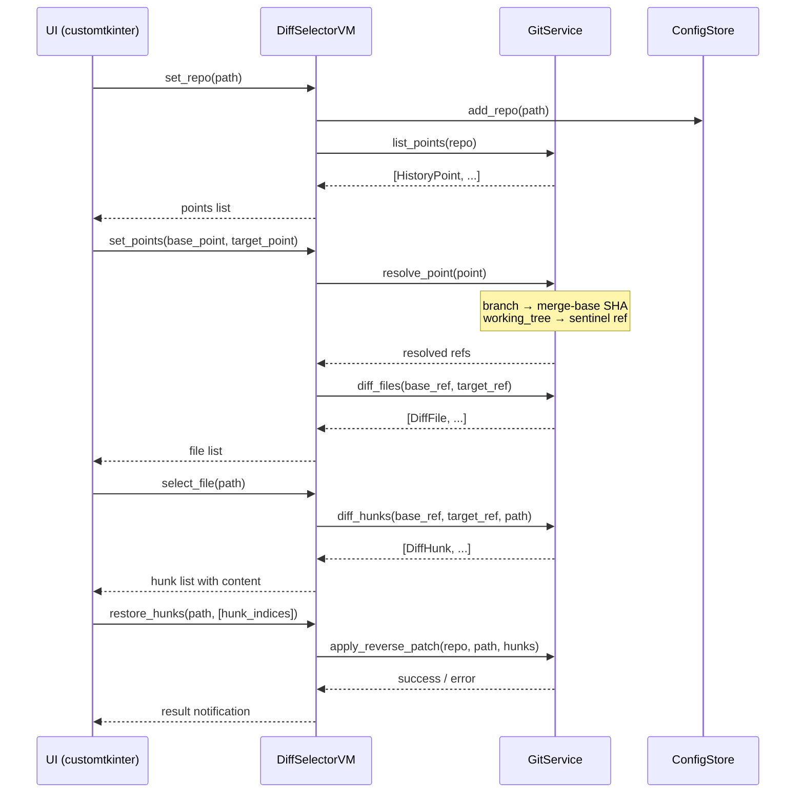
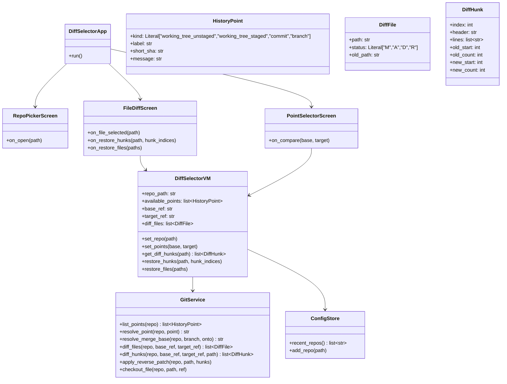

# DiffSelector

## Overview

DiffSelector is a standalone GUI tool (in `diffselector/`) for visually exploring and selectively reverting file changes between any two points in a git repository's history. A user picks a **FROM (base)** and a **TO (target)** point — where a "point" can be the current working tree (including staged, unstaged, and untracked changes as separate selectable states), any commit, or any branch (auto-resolved to its merge-base to avoid commits that have moved on) — then browses a per-file diff list and restores individual **hunks** (contiguous changed sections) back to the FROM (older) state. Built with Python 3.14 and customtkinter. Keeps its own config at `~/.config/diffselector/config.json`.

### Decisions recorded
- **Restore direction:** always restores to the FROM (base/older) point
- **Restore granularity:** hunk-level — individual diff hunks get checkboxes; whole-file restore is a convenience shortcut that selects all hunks
- **Untracked files:** shown as `[A]` (added) entries in the diff list when working tree is a point
- **Staged changes:** "Working tree" is split into two selectable points: "Working tree (staged)" and "Working tree (unstaged+untracked)"
- **Config:** own `~/.config/diffselector/config.json`, independent from worktree-manager
- **Worktree awareness:** not included; worktrees can be added as individual repos via the repo picker

## UI / Flow

### Screen 1 — Repo Picker (landing)

```
┌──────────────────────────────────────────────────────┐
│  DiffSelector                                        │
├──────────────────────────────────────────────────────┤
│                                                      │
│  Repository path:  [/path/to/repo          ] [Browse]│
│                                                      │
│  Recent repos:                          ↕ scrollable │
│  ┌────────────────────────────────────────────────┐  │
│  │ /Users/ahmed/repos/my-app                      │  │
│  │ /Users/ahmed/repos/other-project               │  │
│  │ /Users/ahmed/repos/third-project               │  │
│  │ ...                                            │▓ │
│  └────────────────────────────────────────────────┘  │
│                                                      │
│                             [ Open → ]               │
└──────────────────────────────────────────────────────┘
```

### Screen 2 — Point Selector

```
┌──────────────────────────────────────────────────────────────┐
│  DiffSelector  /Users/ahmed/repos/my-app            [← Back] │
├──────────────────────────────────────────────────────────────┤
│                                                              │
│  FROM (base — restore destination)  TO (target — current)   │
│  ┌───────────────────────────────┐  ┌─────────────────────┐  │
│  │ [Search...                  ] │  │ [Search...         ] │  │
│  │ ↕ scrollable                  │  │ ↕ scrollable         │  │
│  │ ○ Working tree (unstaged)     │  │ ○ Working tree (un…) │  │
│  │ ○ Working tree (staged)       │  │ ○ Working tree (st…) │  │
│  │                               │  │                      │  │
│  │ ── Commits / Branches ──────  │  │ ── Commits/Branches  │  │
│  │ ● main              abc1234   │▓ │ ○ main      abc1234  │▓ │
│  │ ○ feature/login     def5678   │  │ ● feature/login      │  │
│  │ ○ abc1234  "Fix bug"          │  │ ○ abc1234  "Fix bug" │  │
│  │ ○ def5678  "Add tests"        │  │ ○ def5678  "Add…"    │  │
│  │ ○ ghi9012  "Refactor"         │  │ ○ ghi9012  "Refact…" │  │
│  │ ...                           │  │ ...                  │  │
│  └───────────────────────────────┘  └─────────────────────┘  │
│                                                              │
│  ⚠ Branch "feature/login" → merge-base def5678              │
│    (avoids unrelated commits that diverged after branch-off) │
│                                                              │
│                              [ Compare → ]                   │
└──────────────────────────────────────────────────────────────┘
```

### Screen 3 — File Diff List + Hunk Restore

```
┌──────────────────────────────────────────────────────────────────────┐
│  DiffSelector  FROM: main (abc1234)  TO: feature/login    [← Back]   │
├─────────────────────────────┬────────────────────────────────────────┤
│  Changed files  (12 files)  │  src/auth/login.py  [M]  (2 hunks)     │
│  [🔍 Filter...    ]         │  ──────────────────────────────────────  │
│  ↕ scrollable               │  ↕ scrollable                           │
│  ┌───────────────────────┐  │  ☐  Hunk 1 of 2  @@ -10,7 +10,9 @@    │
│  │ ✦ src/auth/login.py[M]│  │  ─────────────────────────────────────  │
│  │   src/auth/utils.py[M]│  │     def login(user, pwd):               │
│  │   src/models/user.py  │  │  -      validate(user)                  │
│  │   tests/test_login.py │▓ │  +      validate_v2(user)               │
│  │   docs/auth.md    [A] │  │  +      audit_log(user)                 │
│  │   config/settings [D] │  │         return token(...)               │
│  │   ...                 │  │                                         │
│  └───────────────────────┘  │  ☑  Hunk 2 of 2  @@ -25,4 +27,4 @@   │
│                             │  ─────────────────────────────────────  │
│  Legend:                    │     def logout(user):                   │
│  [M] modified [A] added     │  -      old_cleanup(user)              │▓│
│  [D] deleted  [R] renamed   │  +      new_cleanup(user)               │
│                             │                                         │
│                             │  ─────────────────────────────────────  │
│                             │  [☑ Select All Hunks] [☐ Deselect All]  │
│                             │  [ Restore 1 Selected Hunk → FROM ]     │
└─────────────────────────────┴────────────────────────────────────────┘
```

File list supports multi-select (checkboxes on hover). When multiple files are checked, the right pane shows a bulk summary instead of per-hunk view:

```
┌─────────────────────────────┬────────────────────────────────────────┐
│  Changed files (3 sel / 12) │  3 files selected                      │
│  ↕ scrollable               │  ↕ scrollable                          │
│  ┌───────────────────────┐  │  ────────────────────────────────────── │
│  │ ☑ src/auth/login.py   │  │  ☑ src/auth/login.py       2 hunks     │
│  │ ☑ src/auth/utils.py   │  │  ☑ src/auth/utils.py       1 hunk      │
│  │ ☐ src/models/user.py  │▓ │  ☑ tests/test_login.py     3 hunks    │▓│
│  │ ☑ tests/test_login.py │  │                                         │
│  └───────────────────────┘  │  All hunks in selected files will be    │
│  [☑ All] [☐ None]           │  restored to FROM point.               │
│                             │                                         │
│                             │  [ Restore All Hunks in 3 Files → FROM ]│
└─────────────────────────────┴────────────────────────────────────────┘
```

### Confirm Restore Dialog

```
┌──────────────────────────────────────────┐
│  Confirm Restore                         │
│                                          │
│  Restore 1 hunk in src/auth/login.py     │
│  to state at FROM: main (abc1234)        │
│                                          │
│  ⚠ This will modify your working tree.  │
│    The change can be undone via git.     │
│                                          │
│           [ Cancel ]  [ Restore ]        │
└──────────────────────────────────────────┘
```

## Architecture





### Hunk-level restore implementation note

`GitService.apply_reverse_patch` constructs a reverse unified-diff patch from the selected `DiffHunk` objects (swapping `+`/`-` lines and adjusting headers) and pipes it to `git apply --reverse` (or `patch -R`). This targets only the chosen hunks without touching the rest of the file, and is undoable via `git checkout -- <file>` or `git restore`.
