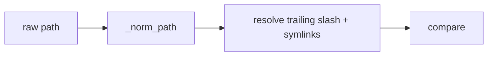
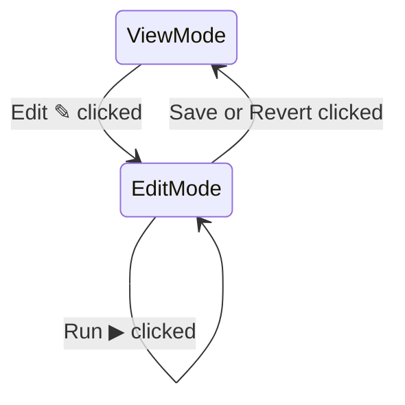
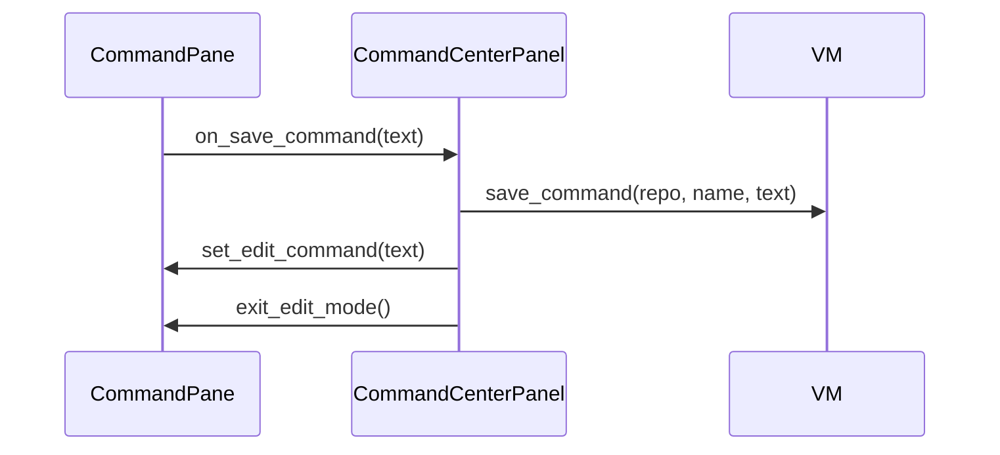

<!-- autobot-status
stage: 7
iteration: 1
gate: confirmed
mode: autonomous
updated: 2026-06-05
completed: 2026-06-05
-->

📄 [autobot-edit-commands-and-pane-bug.md](autobot-edit-commands-and-pane-bug.md)

# Autobot — Edit Commands in Commands Pane + Duplicate Pane Bug Fix

## Feature Description

Two related tasks:
1. **Edit commands directly from the command pane** — each running pane should expose a way to edit its saved command (name, command string, startup pattern) without having to open the Launch dialog.
2. **Bug fix: re-running a command sometimes creates a new pane** instead of reusing the existing one.

---

## Frontend Design

### Command Pane — Viewing mode (default)

```
┌─────────────────────────────────────────────────────────────────────┐
│ ● build · proj :  [worktree ▾]  [⤢] [↺] [■] [Copy] [Find] [×]      │
├─────────────────────────────────────────────────────────────────────┤
│ npm run dev                                               [Edit ✎]  │
├╌╌╌╌╌╌╌╌╌╌╌╌╌╌╌╌╌╌╌╌╌╌╌╌╌╌╌╌╌╌╌╌╌╌╌╌╌╌╌╌╌╌╌╌╌╌╌╌╌╌╌╌╌╌╌╌╌╌╌╌╌╌╌╌╌╌╌╌╌┤
│ (output area)                                                       │
├─────────────────────────────────────────────────────────────────────┤
│ stdin ›  [_________________________________]  [Send]                │
└─────────────────────────────────────────────────────────────────────┘
```

### Command Pane — Editing mode (single line)

```
┌─────────────────────────────────────────────────────────────────────┐
│ ● build · proj :  [worktree ▾]  [⤢] [↺] [■] [Copy] [Find] [×]      │
│                                     (greyed out)                    │
├─────────────────────────────────────────────────────────────────────┤
│ [npm run dev --watch                                              ]  │
│                                        [Run ▶]  [Save]  [Revert]    │
├╌╌╌╌╌╌╌╌╌╌╌╌╌╌╌╌╌╌╌╌╌╌╌╌╌╌╌╌╌╌╌╌╌╌╌╌╌╌╌╌╌╌╌╌╌╌╌╌╌╌╌╌╌╌╌╌╌╌╌╌╌╌╌╌╌╌╌╌╌┤
│ (output area — unchanged, still live)                               │
├─────────────────────────────────────────────────────────────────────┤
│ stdin ›  [_________________________________]  [Send]                │
└─────────────────────────────────────────────────────────────────────┘
```

### Command Pane — Editing mode (grown to multiple lines)

```
┌─────────────────────────────────────────────────────────────────────┐
│ ● build · proj :  [worktree ▾]  [⤢] [↺] [■] [Copy] [Find] [×]      │
│                                     (greyed out)                    │
├─────────────────────────────────────────────────────────────────────┤
│ [npm run dev --watch \                                            ]  │
│ [  --port 3001 \                                                  ]  │
│ [  --host 0.0.0.0                                                 ]  │
│                                        [Run ▶]  [Save]  [Revert]    │
├╌╌╌╌╌╌╌╌╌╌╌╌╌╌╌╌╌╌╌╌╌╌╌╌╌╌╌╌╌╌╌╌╌╌╌╌╌╌╌╌╌╌╌╌╌╌╌╌╌╌╌╌╌╌╌╌╌╌╌╌╌╌╌╌╌╌╌╌╌┤
│ (output area — unchanged, still live)                               │
├─────────────────────────────────────────────────────────────────────┤
│ stdin ›  [_________________________________]  [Send]                │
└─────────────────────────────────────────────────────────────────────┘
```

**Behaviour:**
- The command string sits in a slim bar between the header and output, read-only by default
- **Edit ✎** enters edit mode — the bar becomes an editable `QPlainTextEdit`, starts at 1 line height, grows line-by-line up to 5 lines, then scrolls internally
- **↺** is greyed out for the entire duration of edit mode
- **Run ▶** — restarts with whatever is currently typed; edit mode stays open for further tweaks
- **Save** — persists to config, closes edit mode, **↺** re-enables; hidden for one-off commands
- **Revert** — discards edits, restores last saved text, closes edit mode, **↺** re-enables
- Edit mode only closes via **Save** or **Revert** — **Run ▶** never closes it

---

## Backend Design

### Edit bar — state in CommandPane

```
CommandPane gains:
  _edit_command: str        # current live command (what's running)
  _editing: bool            # whether edit mode is active

enter_edit_mode():
  _edit_snapshot = current command text  # snapshot for Revert
  show QPlainTextEdit with _edit_snapshot text
  show Run ▶, Save, Revert buttons
  hide Edit ✎ button
  disable ↺ button

exit_edit_mode():
  hide QPlainTextEdit and action buttons
  show Edit ✎ button
  re-enable ↺ button

on Run ▶ clicked:
  call on_run_with_command(new_text)   # new callback, does NOT exit edit mode

on Save clicked:
  call on_save_command(new_text)       # new callback, persists then exits edit mode

on Revert clicked:
  restore QPlainTextEdit text to _edit_snapshot  # text captured when Edit ✎ was clicked
  exit edit mode
```

### Edit bar — QPlainTextEdit auto-height

```
on contentsChanged:
  line_height = fontMetrics().lineSpacing()
  lines = min(document().lineCount(), 5)
  new_height = lines * line_height + margins
  setFixedHeight(new_height)
  # beyond 5 lines: height stays fixed, internal scrollbar appears automatically
```

### Run ▶ from pane — data flow

```
User clicks Run ▶ (edit mode open)
  ↓
CommandPane.on_run_with_command(new_text)
  ↓
CommandCenterPanel._do_run_with_command(run_id, new_text)
  updates _run_meta[run_id]["command_str"] = new_text
  calls _do_restart(run_id)           # existing method: clear output + vm.restart()
  [edit mode stays open in pane]
```

`vm.restart()` reads `command_str` from `_run_meta`, so updating it before calling restart is sufficient — no VM changes needed.

### Save from pane — data flow

```
User clicks Save (edit mode open)
  ↓
CommandPane.on_save_command(new_text)
  ↓
CommandCenterPanel._do_save_command(run_id, new_text)
  repo_path = handle.repo_path
  cmd_name  = handle.cmd_name
  vm.save_command(repo_path, cmd_name, new_text, startup_pattern)
  [_sync_run_meta updates _run_meta for this run automatically]
  pane.set_edit_command(new_text)     # update pane's _edit_command so next Edit ✎ snapshots the new text
  pane.exit_edit_mode()
```

`vm.save_command()` already calls [`_sync_run_meta()`](worktree-manager/worktree_manager/command_center_vm.py#L41) which patches `_run_meta` for any live run matching `repo_path + cmd_name`. No new VM logic needed.

### Duplicate pane bug — root cause

[`LaunchDialog.trigger_run()`](worktree-manager/worktree_manager/ui/launch_dialog.py#L469) only checks [`find_existing_run()`](worktree-manager/worktree_manager/command_center_vm.py#L125) when `saved and cmd_text == saved.command`. When a match is found and the run is STOPPED it shows a "Restart it?" banner. The user clicks Restart → `vm.restart()` → `on_run_id_changed` → panel renames the pane. That path is correct.

**The actual bug**: the worktree path comparison in `find_existing_run` and in `launch()`'s duplicate guard is a raw string compare. If the stored `worktree_path` and the combo's current path differ by a trailing slash or symlink resolution, no match is found, `vm.launch()` proceeds, `on_run_added` fires, and `add_pane` adds a second pane (the old stopped one is still there).

```
fix: normalise all worktree paths before comparing

in find_existing_run():
  compare str(Path(handle.worktree_path)) == str(Path(worktree_path))

in launch() duplicate guard:
  same normalisation
```

No model or config changes — purely a comparison fix in [`command_center_vm.py`](worktree-manager/worktree_manager/command_center_vm.py).

---

## Iteration Plan

- Iteration 0 — Duplicate pane bug fix (path normalisation)
- Iteration 1 — Edit command bar: full UI, edit mode, run/save/revert wired end-to-end

---

### Iteration 0 — Duplicate pane bug fix (path normalisation)

**Tests:**
- `find_existing_run` matches when stored path has trailing slash and lookup path does not
- `find_existing_run` matches when paths differ only by symlink resolution (use `os.path.realpath`)
- `launch()` raises `DuplicateRunError` when a RUNNING process exists with a trailing-slash-differing worktree path
- `launch()` does not create a duplicate when a STOPPED run exists with a path that normalises to the same value

**Files:**
- [`worktree-manager/worktree_manager/command_center_vm.py`](worktree-manager/worktree_manager/command_center_vm.py) (existing)
- [`worktree-manager/tests/test_command_center_vm.py`](worktree-manager/tests/test_command_center_vm.py) (existing)

---

#### `worktree-manager/worktree_manager/command_center_vm.py`

```
Add helper at module level:
  def _norm_path(p: str) -> str:
      return str(Path(p).resolve())

In find_existing_run():
  replace raw string compare of worktree_path with:
    _norm_path(handle.worktree_path) == _norm_path(worktree_path)

In launch() duplicate guard (existing DuplicateRunError check):
  same _norm_path() normalisation on both sides
```



---

### Iteration 1 — Edit command bar: full UI, edit mode, run/save/revert wired end-to-end

**Tests:**
- Command bar shows command text and Edit button in view mode
- Clicking Edit enters edit mode: text becomes editable, Run/Save/Revert appear, Edit button hides, restart button disables
- Save is hidden for one-off commands (`cmd_name == "[one-off]"`)
- Auto-height grows one line at a time up to 5, then stays fixed
- Clicking Revert restores original text and exits edit mode
- Clicking Save calls `on_save_command` with new text and exits edit mode
- Clicking Run calls `on_run_with_command` with new text and stays in edit mode
- `_do_run_with_command` in panel updates `_run_meta[run_id]["command_str"]` then calls `_do_restart`
- `_do_save_command` in panel calls `vm.save_command`, then `pane.set_edit_command` and `pane.exit_edit_mode`

**Files:**
- [`worktree-manager/worktree_manager/ui/command_pane.py`](worktree-manager/worktree_manager/ui/command_pane.py) (existing)
- [`worktree-manager/worktree_manager/ui/command_center_panel.py`](worktree-manager/worktree_manager/ui/command_center_panel.py) (existing)
- [`worktree-manager/tests/test_command_pane_qt.py`](worktree-manager/tests/test_command_pane_qt.py) (existing)
- [`worktree-manager/tests/test_command_center_panel_qt.py`](worktree-manager/tests/test_command_center_panel_qt.py) (existing)

---

#### `worktree-manager/worktree_manager/ui/command_pane.py`

```
CommandPane.__init__ gains new params:
  on_run_with_command: Callable[[str], None] | None = None
  on_save_command:     Callable[[str], None] | None = None
  is_one_off: bool = False   # hides Save button

New widgets (created in __init__, inserted between header and output):
  _cmd_label:   QLabel        # read-only display strip
  _cmd_edit:    QPlainTextEdit (hidden initially, single-line height)
  _btn_edit:    QPushButton "Edit ✎"
  _btn_run:     QPushButton "Run ▶"  (hidden initially)
  _btn_save:    QPushButton "Save"   (hidden initially; hidden always if is_one_off)
  _btn_revert:  QPushButton "Revert" (hidden initially)

New state:
  _edit_command: str    # current saved command text
  _edit_snapshot: str   # snapshot taken when Edit ✎ clicked

set_edit_command(text):
  _edit_command = text
  _cmd_label.setText(text)

enter_edit_mode():
  _edit_snapshot = _edit_command
  _cmd_edit.setPlainText(_edit_snapshot)
  _cmd_label.hide(); _btn_edit.hide()
  _cmd_edit.show(); _btn_run.show(); _btn_revert.show()
  if not is_one_off: _btn_save.show()
  restart_btn.setEnabled(False)

exit_edit_mode():
  _cmd_edit.hide(); _btn_run.hide(); _btn_save.hide(); _btn_revert.hide()
  _cmd_label.show(); _btn_edit.show()
  restart_btn.setEnabled(True)

_on_cmd_edit_changed():
  line_height = _cmd_edit.fontMetrics().lineSpacing()
  lines = min(_cmd_edit.document().lineCount(), 5)
  _cmd_edit.setFixedHeight(lines * line_height + top_margin + bottom_margin)

_on_revert_clicked():
  set_edit_command(_edit_snapshot)
  exit_edit_mode()

_on_run_clicked():
  if on_run_with_command: on_run_with_command(_cmd_edit.toPlainText())
  # stays in edit mode

_on_save_clicked():
  if on_save_command: on_save_command(_cmd_edit.toPlainText())
  # panel handler calls set_edit_command + exit_edit_mode
```



---

#### `worktree-manager/worktree_manager/ui/command_center_panel.py`

```
add_pane() passes two new callbacks to CommandPane:
  on_run_with_command = lambda text: self._do_run_with_command(run_id, text)
  on_save_command     = lambda text: self._do_save_command(run_id, text)
  is_one_off = (handle.cmd_name == "[one-off]")

Also pass the initial command text:
  pane.set_edit_command(meta["command_str"])

New method _do_run_with_command(run_id, new_text):
  self._vm._run_meta[run_id]["command_str"] = new_text
  self._do_restart(run_id)

New method _do_save_command(run_id, new_text):
  meta   = self._vm._run_meta[run_id]
  handle = self._vm._runner.get_handle(run_id)
  startup_pattern = meta.get("startup_pattern")
  self._vm.save_command(meta["repo_path"], meta["cmd_name"], new_text, startup_pattern)
  pane = self._panes.get(run_id)
  if pane:
      pane.set_edit_command(new_text)
      pane.exit_edit_mode()
```



---

### Implementation Ledger — Iteration 1

- Command bar shows command text and Edit button in view mode: red → green ✓
- Edit mode shows edit widgets, hides label and Edit button: red → green ✓
- Edit mode populates `QPlainTextEdit` with current command: red → green ✓
- Edit mode disables restart button: red → green ✓
- Exit edit mode restores view mode and re-enables restart button: red → green ✓
- Revert restores original text and exits edit mode: red → green ✓
- Save hidden for one-off commands: red → green ✓
- Save visible for saved commands: red → green ✓
- Run ▶ calls `on_run_with_command` and stays in edit mode: red → green ✓
- Save calls `on_save_command`: red → green ✓
- Auto-height grows with line count: red → green ✓
- Auto-height capped at 5 lines: red → green ✓
- `add_pane` sets initial command text on pane: red → green ✓
- `add_pane` marks one-off panes correctly: red → green ✓
- `_do_run_with_command` updates meta and calls restart: red → green ✓
- `_do_save_command` calls `vm.save_command`: red → green ✓
- `_do_save_command` updates pane label and exits edit mode: red → green ✓

---

### Implementation Ledger — Iteration 0

- `find_existing_run` matches with trailing slash on lookup: red → green ✓
- `find_existing_run` matches with trailing slash on stored path: red → green ✓
- `launch()` raises `DuplicateRunError` with trailing-slash-differing path: red → green ✓

---

## ✋ Manual Testing Gate — Iteration 0

> STOP. Do not proceed to Iteration 1 until every item is confirmed.

- [ ] Open the app and launch a command in a worktree (e.g. `npm run dev`)
- [ ] Close the pane (stop it), then open the Launch dialog again for the **same command and worktree** — confirm only one pane exists, no duplicate appears
- [ ] With a command running, open the Launch dialog for the same command — confirm you see the "already running" conflict banner rather than a new pane being added
- [ ] Launch a command in one worktree, then launch the same command name in a **different** worktree — confirm a second pane is created (different worktrees should not be blocked)

**Confirmed by user:** 2026-06-05

---

## ✋ Manual Testing Gate — Iteration 1

> STOP. Do not proceed until every item is confirmed.

- [ ] Open a running command pane — confirm a greyed command string is visible below the header with an **Edit ✎** button
- [ ] Click **Edit ✎** — confirm the bar becomes an editable text field, Run ▶ / Revert appear, and the restart button (↺) goes grey
- [ ] Type a different command in the editor — confirm the field grows line by line (try 2, 3, 4, 5 lines) and stays fixed at 5 lines when you add a 6th
- [ ] Click **Revert** — confirm the original command text is restored and edit mode closes, ↺ re-enables
- [ ] Click **Edit ✎** again, change the text, click **Run ▶** — confirm the pane restarts with the new command text and edit mode stays open
- [ ] Click **Save** — confirm the command is persisted (reopen the app / relaunch dialog and verify the saved command reflects the new text), and edit mode closes
- [ ] Open a one-off pane (launch a command without saving it) — enter edit mode and confirm **Save** is not present, only Run ▶ and Revert
- [ ] **Regression:** duplicate pane protection still works — re-run a saved command for the same worktree and confirm no second pane appears

**Confirmed by user:** 2026-06-05
**How to confirm:** Check every box, then reply "Iteration 1 confirmed" or describe what failed.
**How to confirm:** Check every box, then reply "Iteration 0 confirmed" or describe what failed.
