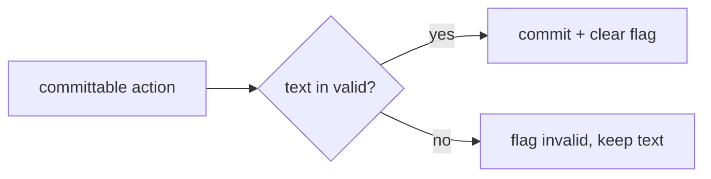
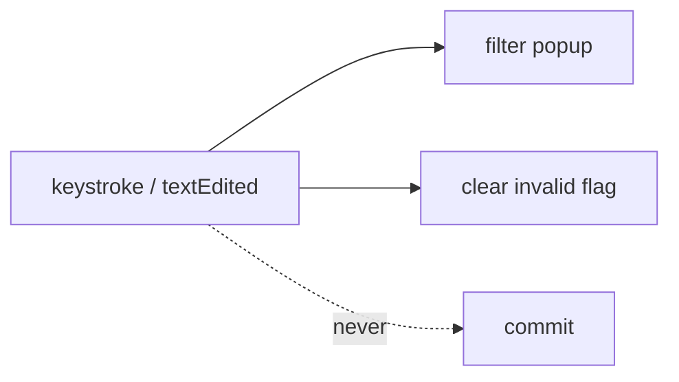

<!-- autobot-status
stage: 5
iteration: 0
gate: pending
updated: 2026-06-11
-->

# Autobot — FilterableComboBox commit-model refactor

## Premise

Rewrite [filterable_combo.py](worktree-manager/worktree_manager/ui/filterable_combo.py) around an explicit
**commit-only-on-committable-action** model. The widget keeps a set of valid entries and a single
*committed* value. Transient line-edit text never mutates the committed value. The committed value
changes only on an explicit **committable action**, and only after the typed text is validated against
the valid set.

This removes the current `blockSignals` / `_in_edit` / `_index_before_edit` / manual-re-emit machinery
([lines 33–69](worktree-manager/worktree_manager/ui/filterable_combo.py#L33-L69)) that produced the
"signal loss" bug class (commits `4c6caca`, `fc8c1fa`). Because signals are never blocked and nothing is
committed on a keystroke, there is no lost signal to recover.

**Committable actions:**
1. Selecting an item from the dropdown/completer → commits unconditionally (always valid by construction).
2. Pressing Enter → validate typed text; commit if valid.
3. Blur (focus-out / editingFinished) → validate typed text; commit if valid.

**Unhappy path (decided):** Enter/blur with **invalid** text → **keep the typed text and flag it invalid**
(do *not* revert, do *not* commit). This is a deliberate change from the old "revert on blur" behavior.

## Scope

Refactor only. Public API (`addItem(s)`, `setCurrentIndex`, `setCurrentText`, `currentText`,
`currentIndex`, `currentIndexChanged`, `currentTextChanged`) stays. Behavior-preserving on the happy path;
the one intentional behavior change is invalid blur/Enter (revert → flag).

## Frontend Design

The only genuinely new UI state is the **invalid flag**. Everything else matches today's widget.

### Collapsed / committed state (unchanged)
```
┌─ Base branch ───────────────┐
│ feature/login             ▾ │
└─────────────────────────────┘
```

### Filtering state (unchanged)
```
┌─ Base branch ───────────────┐
│ ea▌                       ▾ │
├─────────────────────────────┤
│ feature/login               │
│ feature/search-combo        │
│ refactor/feature-flags      │
└─────────────────────────────┘
```

### Committed via dropdown / valid Enter / valid blur (unchanged)
```
┌─ Base branch ───────────────┐
│ feature/search-combo      ▾ │   ← committed; currentIndexChanged fires once
└─────────────────────────────┘
```

### NEW — invalid Enter/blur → keep text, flag invalid
```
typed:  ┌─────────────────────┐    on Enter/blur:  ┌─────────────────────┐
        │ zzzqqq            ▾ │   ──────────────▶   │ zzzqqq            ▾ │  ⚠ red border
        └─────────────────────┘                     └─────────────────────┘
          (no item matches)                           text kept, NOT committed,
                                                       committed value still "feature/login",
                                                       currentIndexChanged NOT fired
```

### Invalid → corrected → committed (flag clears)
```
┌─────────────────────┐   user edits to a valid item, Enter   ┌─────────────────────┐
│ zzzqqq  ⚠         ▾ │   ──────────────────────────────────▶ │ main              ▾ │  flag cleared
└─────────────────────┘                                       └─────────────────────┘
```

### Frontend decisions (locked)
- **Flag visual: red border via dynamic stylesheet property.** The line edit gets a dynamic Qt property
  `invalid="true"`; a stylesheet rule `QLineEdit[invalid="true"] { border: 1px solid red }` renders the
  border. Themeable, no layout shift. Setting/clearing the property must be followed by a style repolish
  (`unpolish`/`polish`) so Qt re-evaluates the selector.
- **Flag clears on any edit AND on successful commit.** `textEdited` clears it (the user is fixing it);
  a valid commit clears it.

## Backend Design

### State model
Two pieces of state, cleanly separated:

```
valid: set[str]              # every committable entry (the combo's item texts)
committed_text: str          # the last successfully committed value (source of truth)
```

`valid` is derived from the combo's item model (kept in sync on addItem/addItems/clear), so we never
hand-maintain a parallel list that can drift. `committed_text` is the only thing the public
`currentIndex`/`currentText`-for-listeners contract reflects.

### Commit decision (the whole algorithm)
```
def attempt_commit(text):           # called by Enter / blur / completer-activated
    if text in valid:               # membership check (normalized — see below)
        clear_invalid_flag()
        if text != committed_text:
            committed_text = text
            set index to item(text)     # fires currentIndexChanged exactly once, signals NOT blocked
    else:
        set_invalid_flag()          # keep typed text, no commit, no signal
```

Dropdown/completer activation passes a string drawn from `valid`, so it always takes the `if` branch —
no special-casing needed.



### Why no blockSignals
Keystrokes (`textEdited`) only filter the completer popup and optionally clear the invalid flag — they
never call `attempt_commit`, never touch `committed_text`, never change the index. So the change signal
is emitted exactly once, naturally, by the single `setCurrentIndex` inside `attempt_commit`. Nothing to
block, nothing to re-emit.



### Normalization
Membership is exact-match today (`findText(..., MatchExactly)`). Keep exact-match for committed values to
preserve the contract, but the *valid set lookup* should normalize identically on both sides if we ever
want trimming/case-folding. For this refactor: **no normalization change** — `valid` holds item texts
verbatim, lookup is verbatim. (Noted so it's a conscious non-change, not an accident.)

### Public-API consequence to audit
After invalid blur/Enter, the line edit shows junk while `committed_text` holds the real value. Callers
that read `.currentText()` expecting a real item could get junk. There are 14 call sites
(`grep -rln FilterableComboBox`). **Decided:** `currentText()` returns the *committed* value
(`committed_text`), never the raw line edit. Raw typed text is read only via `lineEdit().text()`. This
preserves every existing caller automatically — no call-site audit/changes needed.

### Existing tests: keep vs. rewrite
- **Keep green:** membership, no-stray-signal-on-keystroke, valid-blur-commits-once, setCurrentText
  non-member no-op, completer sync, NoInsert policy.
- **Rewrite:** [test_blur_with_invalid_text_reverts_to_last_committed](worktree-manager/tests/test_filterable_combo_qt.py#L66)
  → becomes "keeps text and flags invalid".
- **Survives as-is (good invariant):** [test_blur_with_invalid_text_does_not_fire_current_index_changed](worktree-manager/tests/test_filterable_combo_qt.py#L75).

## Iteration Plan

- Iteration 0 — Refactor FilterableComboBox to the commit-only model with invalid-flag

### Iteration 0 — Refactor FilterableComboBox to the commit-only model with invalid-flag
**Context file:** [Iteration 0 context](autobot-filterable-combo-refactor-ctx-iter-0-refactor-commit-model-2026-06-11.md)

## ✋ Manual Testing Gate — Iteration 0

> STOP. Do not declare the feature done until every item is confirmed.

- [ ] Open a screen with a FilterableComboBox (e.g. base-branch picker in the create dialog); type a partial string → popup filters; pick an item → it commits and downstream behaviour fires as before.
- [ ] Type a full valid item name and press Enter → commits; press Tab/click away with a valid name → commits.
- [ ] Type junk and press Enter (or click away) → the junk text stays, the field shows a red border, and the previously selected value is what downstream logic still sees.
- [ ] After the red border shows, type one more character → the red border clears; then type/select a valid item → commits cleanly.
- [ ] Exercise a couple of other dropdowns (branch combo, project ops) → no regressions vs. before.

**Confirmed by user:** —
**How to confirm:** Check every box, then reply "Iteration 0 confirmed" or describe what failed.

### Implementation Ledger — Iteration 0
- `test_filterable_combo_is_qcombobox`: kept → green ✓
- `test_filterable_combo_is_editable`: kept → green ✓
- `test_filterable_combo_has_completer`: kept → green ✓
- `test_completer_uses_contains_filter`: kept → green ✓
- `test_completer_is_case_insensitive`: kept → green ✓
- `test_typing_does_not_fire_current_index_changed`: kept → green ✓
- `test_typing_does_not_fire_current_text_changed`: kept → green ✓
- `test_committing_valid_item_updates_current_index`: updated call site → green ✓
- `test_committing_valid_item_fires_current_index_changed_once`: updated call site → green ✓
- `test_blur_with_invalid_text_keeps_text_and_flags_invalid`: **rewritten** (was `_reverts_to_last_committed`) → green ✓
- `test_blur_with_invalid_text_does_not_fire_current_index_changed`: kept → green ✓
- `test_blur_with_valid_text_commits_without_extra_signal`: kept → green ✓
- `test_addItems_keeps_completer_in_sync`: kept → green ✓
- `test_insert_policy_prevents_free_text_entry`: kept → green ✓
- `test_set_current_text_with_valid_item_changes_index`: kept → green ✓
- `test_set_current_text_with_invalid_item_does_not_change_index`: kept → green ✓
- `test_enter_with_valid_text_commits_exactly_once`: **new** → green ✓
- `test_enter_with_invalid_text_keeps_text_and_flags_invalid`: **new** → green ✓
- `test_current_text_returns_committed_value_when_line_edit_shows_junk`: **new** → green ✓
- `test_invalid_commit_sets_invalid_property_on_line_edit`: **new** → green ✓
- `test_editing_after_invalid_commit_clears_flag`: **new** → green ✓
- `test_successful_commit_clears_previously_set_invalid_flag`: **new** → green ✓
- `test_completer_selection_commits_and_clears_invalid_flag`: **new** → green ✓
- `test_completer_activated_while_filter_text_shown_emits_once`: **rewritten** (removed blockSignals setup) → green ✓
- `test_completer_activated_with_different_item_emits_once`: **rewritten** (removed blockSignals setup) → green ✓
- `test_completer_activated_with_already_committed_item_emits_nothing`: **rewritten** (removed blockSignals setup) → green ✓
- `test_typing_filter_text_without_committing_emits_nothing`: kept → green ✓
