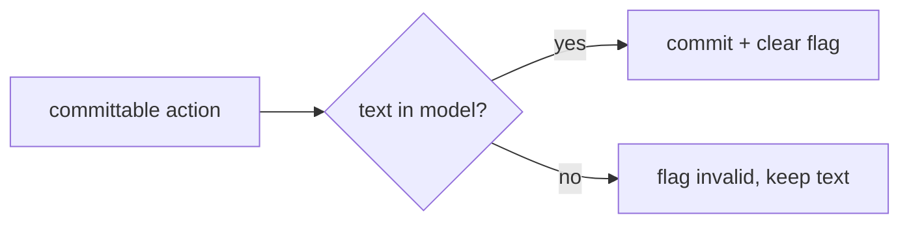

# Context: Iteration 0 — Refactor FilterableComboBox to the commit-only model with invalid-flag

## Goal
Rewrite [filterable_combo.py](../worktree-manager/worktree_manager/ui/filterable_combo.py) so the committed
value changes **only** on an explicit committable action (dropdown-select, Enter, blur), and only when the
typed text is a valid item. Delete the `blockSignals`/`_in_edit`/`_index_before_edit`/manual-re-emit
machinery — the signal-loss bug class disappears because signals are never blocked and keystrokes never
commit. Invalid Enter/blur keeps the typed text and flags it with a red border instead of reverting.

## Tests to write
Keep these existing tests green (behavior unchanged):
- `is_qcombobox`, `is_editable`, `has_completer`, `uses_contains_filter`, `is_case_insensitive` — construction.
- `typing_does_not_fire_current_index_changed` / `..._current_text_changed` — keystrokes commit nothing.
- `committing_valid_item_updates_current_index` / `..._fires_current_index_changed_once` — dropdown commit.
- `blur_with_valid_text_commits_without_extra_signal` — valid blur commits exactly once.
- `blur_with_invalid_text_does_not_fire_current_index_changed` — invalid blur fires no commit signal.
- `addItems_keeps_completer_in_sync`, `insert_policy_prevents_free_text_entry`.
- `set_current_text_with_valid_item_changes_index`, `set_current_text_with_invalid_item_does_not_change_index`.

Rewrite this existing test (behavior changes revert → flag):
- `blur_with_invalid_text_reverts_to_last_committed` → **keeps text and flags invalid**: after invalid
  blur, `lineEdit().text()` is still the typed junk, `currentIndex()`/`currentText()` are still the last
  committed item, and the invalid flag is set.

New tests:
- enter with valid text commits exactly once: simulate Enter on a full valid item → `currentText()` updates, `currentIndexChanged` fires once.
- enter with invalid text keeps text and flags invalid, fires no commit signal.
- committed value is exposed by currentText even when line edit shows junk: after invalid blur, `currentText()` == last committed item, `lineEdit().text()` == junk.
- invalid flag sets the invalid property on the line edit: after invalid commit, `lineEdit().property("invalid")` is truthy.
- editing after an invalid commit clears the flag: invalid commit sets flag, then `textEdited` → property cleared.
- a successful commit clears a previously set invalid flag: set flag, then commit valid → property cleared.
- selecting from the completer commits unconditionally and clears any flag.

## Files to touch
- [filterable_combo.py](../worktree-manager/worktree_manager/ui/filterable_combo.py) — full rewrite of the class internals; same public surface.
- [test_filterable_combo_qt.py](../worktree-manager/tests/test_filterable_combo_qt.py) — rewrite the one revert test; add the new tests above.

## Design / pseudocode

#### `worktree_manager/ui/filterable_combo.py`
```
class FilterableComboBox(QComboBox):
    __init__:
        setEditable(True); setInsertPolicy(NoInsert)
        _committed_index = 0            # source of truth (index form)
        build QCompleter (MatchContains, CaseInsensitive, PopupCompletion) on self.model()
        comp.activated[str]      -> _on_completer_activated   # dropdown/completer pick
        lineEdit().returnPressed -> _on_return_pressed        # Enter
        lineEdit().editingFinished -> _on_editing_finished    # blur
        lineEdit().textEdited    -> _on_text_edited           # keystroke: filter + clear flag

    # --- membership: derive from the model, never a parallel set (no drift) ---
    _index_of(text) -> int:  return self.findText(text, MatchExactly)
    _is_valid(text) -> bool: return self._index_of(text) >= 0

    # --- the whole algorithm ---
    _attempt_commit(text):
        idx = _index_of(text)
        if idx >= 0:                      # valid -> commit
            _set_invalid(False)
            if idx != self._committed_index:
                self.setCurrentIndex(idx) # fires currentIndexChanged ONCE; signals never blocked
            else:
                # already on it; make sure line edit shows the canonical item text
                self.lineEdit().setText(self.itemText(idx))
        else:                             # invalid -> keep text, flag, no commit, no signal
            _set_invalid(True)

    _on_completer_activated(text): _attempt_commit(text)
    _on_return_pressed():          _attempt_commit(self.lineEdit().text())
    _on_editing_finished():        _attempt_commit(self.lineEdit().text())
    _on_text_edited(_):            _set_invalid(False)   # any edit clears the flag

    # --- invalid flag (red border via dynamic stylesheet property) ---
    _set_invalid(flag):
        le = self.lineEdit()
        if le.property("invalid") == flag: return
        le.setProperty("invalid", flag)
        le.style().unpolish(le); le.style().polish(le)   # repolish so selector re-evaluates

    # --- public contract ---
    currentText() -> str:
        # committed value, NOT the raw line edit
        return self.itemText(self._committed_index)

    setCurrentIndex(index):
        super().setCurrentIndex(index)
        self._committed_index = index
        _set_invalid(False)

    setCurrentText(text):            # selection-only: select matching item, ignore non-matches
        idx = _index_of(text)
        if idx >= 0: self.setCurrentIndex(idx)

    addItems(texts):  super().addItems(texts);  _sync_completer()
    addItem(*a,**k):  super().addItem(*a,**k);   _sync_completer()
    clear():          super().clear(); self._committed_index = 0; _sync_completer()

    _sync_completer():
        comp = self.completer()
        if comp is not None: comp.setModel(self.model())
```

## Diagrams


## Relevant existing code
Current implementation being replaced — note the machinery that goes away:
```python
# filterable_combo.py (current) — _in_edit / blockSignals / _index_before_edit / manual re-emit
def _on_text_edited(self, _text):
    if not self._in_edit:
        self._in_edit = True
        self._index_before_edit = self.currentIndex()
        self.blockSignals(True)            # <-- source of the signal-loss bug class; removed

def _commit_from_completer(self, text):    # renamed to _on_completer_activated; logic simplified
    idx = self.findText(text, Qt.MatchExactly)
    before = self._index_before_edit
    self._end_edit()
    if idx >= 0:
        self._committed_index = idx
        if self.currentIndex() == idx:
            if idx != before:
                self.currentIndexChanged.emit(idx)   # <-- manual re-emit; removed
        else:
            self.setCurrentIndex(idx)
```
Existing test fixture (reuse it):
```python
@pytest.fixture
def combo(qtbot):
    c = FilterableComboBox()
    c.addItems(["feature/login", "feature/search", "refactor/flags", "main"])
    qtbot.addWidget(c)
    return c
```

## Constraints / invariants
- **Strict TDD** — failing test before production code. Test names are plain behavioural English, no phase/iter numbers.
- **No `blockSignals`, no `_in_edit`, no `_index_before_edit`, no manual `.emit()`.** If the rewrite needs any of these, the design is wrong.
- **Membership is derived from the model** via `findText(MatchExactly)` — do NOT maintain a parallel `set` that can drift.
- **`currentText()` returns the committed item text**, never the raw line edit. Raw text is read only via `lineEdit().text()`.
- Keystrokes (`textEdited`) must never commit, never change index, never fire `currentIndexChanged`/`currentTextChanged`.
- A valid commit fires `currentIndexChanged` **exactly once**, naturally, via the single `setCurrentIndex` — not via manual emit, and only when the index actually changes.
- Invalid flag uses dynamic property `invalid` + style repolish; no normalization change (verbatim match, as today).
- Run only the filterable-combo test files during TDD; the full suite is run once at the gate.
- Project test command: `python3.14 -m pytest` (run from `worktree-manager/`).

## Done when (gate items)
- [ ] All previously-green filterable-combo tests still pass; the revert test is rewritten to assert flag-not-revert.
- [ ] Dropdown-select, valid Enter, valid blur each commit and fire `currentIndexChanged` exactly once.
- [ ] Invalid Enter/blur keeps the typed text, sets the red-border flag, and fires no commit signal.
- [ ] `currentText()` returns the committed value even when the line edit shows invalid text.
- [ ] The flag clears on the next keystroke and on a successful commit.
- [ ] No `blockSignals`/`_in_edit`/`_index_before_edit`/manual `.emit()` remain in the file.
- [ ] Full suite passes (`python3.14 -m pytest`) with no regressions in the broader combo tests.

## TDD mode: Autonomous
TDD directly. Keep the ledger below as you go.
