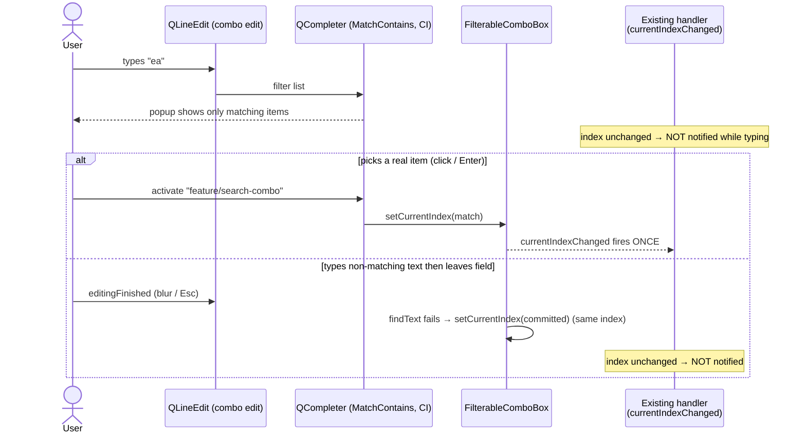

# Filterable / Searchable Dropdowns

## Overview
Every dropdown in the worktree-manager app is currently a plain, non-editable `QComboBox`.
For dropdowns with many entries (branch pickers, repo pickers, worktree pickers) finding the
right item means scrolling a long popup. This feature replaces every `QComboBox` with a single
reusable drop-in widget, `FilterableComboBox`, that lets the user **type to filter** the list
inline (case-insensitive, matching anywhere in the text) while still behaving exactly like a
normal combo box for selection: the value can only ever be one of the existing items, and if the
user types something that doesn't match, the box reverts to its previous selection. Because it is
a behaviour-preserving drop-in, every existing dropdown becomes searchable with no change to the
code that populates it or listens to it.

## UI / Flow

**Default (collapsed) state — looks like today's dropdown:**
```
┌─ Base branch ───────────────┐
│ feature/login             ▾ │
└─────────────────────────────┘
```

**Filtering state — user clicks/focuses and types; popup shows only matches:**
```
┌─ Base branch ───────────────┐
│ ea▌                       ▾ │   ← user typed "ea" (matches anywhere, case-insensitive)
├─────────────────────────────┤
│ feature/login               │
│ feature/search-combo        │
│ refactor/feature-flags      │
└─────────────────────────────┘
```

**Committed state — user picks a match (click / Enter):**
```
┌─ Base branch ───────────────┐
│ feature/search-combo      ▾ │   ← value committed; listeners notified once
└─────────────────────────────┘
```

**No-match / revert state — user types junk then leaves the field (focus out / Esc):**
```
typed:  ┌─────────────────────┐        on blur:  ┌─────────────────────┐
        │ zzzqqq            ▾ │   ───────────▶   │ feature/login     ▾ │
        └─────────────────────┘                  └─────────────────────┘
          (no item matches)                        (reverts to last valid selection;
                                                     listeners NOT notified)
```

## Architecture

A new module introduces one widget, `FilterableComboBox`, that subclasses `QComboBox`. Every site
that constructs a `QComboBox` swaps in `FilterableComboBox` — `addItems`, `setCurrentText`,
`setCurrentIndex`, `findText`, `findData`, `itemData`, `currentData`, and `currentIndexChanged`
all keep their existing meaning.

**Signal choice — `currentIndexChanged`, not `currentTextChanged`.** On an editable combo,
`currentTextChanged` fires on every keystroke, whereas `currentIndexChanged` fires *only* on a
real index change (whether user- or programmatically-driven) and never while typing. So instead
of adding signal-suppression machinery inside the widget to tame keystroke noise, the few call
sites that currently listen to `currentTextChanged` are refactored to `currentIndexChanged`
(reading `currentText()` / `currentData()` in the slot where they need the value). This keeps the
widget tiny — just *editable + completer + revert-on-invalid-blur*, with **no signal suppression
code** — and is a true behavioural match: those handlers still fire on programmatic selection
during setup exactly as before. (`activated`/`textActivated` were rejected because they don't fire
on programmatic changes, which would break initial-population side effects such as auto-loading a
repo's branches.)

### Component view — one widget, many call sites

```mermaid
graph TD
    FCB["FilterableComboBox(QComboBox)<br/>worktree_manager/ui/filterable_combo.py<br/>(new)"]
    subgraph Panels
      MW["main_window.py:146"]
      PRW["per_repo_worktrees_view.py:199"]
      WPP["workspace_projects_panel.py:215"]
      WMP["worktree_management_panel.py:48"]
      BMP["branch_management_panel.py:477"]
      CP["command_pane.py:236"]
      DP["diff_panel.py:33, 41"]
    end
    subgraph Dialogs
      ACD["add_command_dialog.py:45"]
      LD["launch_dialog.py:159, 172"]
      POD["project_operations_dialog.py:59,193,206,517,615"]
      SP["settings_panel.py:48, 59"]
      CD["create_dialog.py:114, 130"]
    end
    MW --> FCB
    PRW --> FCB
    WPP --> FCB
    WMP --> FCB
    BMP --> FCB
    CP --> FCB
    DP --> FCB
    ACD --> FCB
    LD --> FCB
    POD --> FCB
    SP --> FCB
    CD --> FCB
```



### Behavioural contract — what the widget must guarantee



### Key facts established up front (PySide6 6.11 / Qt 6.11)
- An editable `QComboBox` emits `currentTextChanged` **on every keystroke**; `currentIndexChanged`
  only fires on a real index change. So the `currentTextChanged` handlers below are refactored to
  `currentIndexChanged`, which is keystroke-safe with no suppression code. The sites to refactor:
  [main_window.py:170](worktree-manager/worktree_manager/ui/main_window.py#L170),
  [per_repo_worktrees_view.py:222](worktree-manager/worktree_manager/ui/per_repo_worktrees_view.py#L222),
  [workspace_projects_panel.py:220](worktree-manager/worktree_manager/ui/workspace_projects_panel.py#L220),
  [launch_dialog.py:163](worktree-manager/worktree_manager/ui/launch_dialog.py#L163),
  [project_operations_dialog.py:63](worktree-manager/worktree_manager/ui/project_operations_dialog.py#L63),
  [project_operations_dialog.py:536](worktree-manager/worktree_manager/ui/project_operations_dialog.py#L536),
  [create_dialog.py:117](worktree-manager/worktree_manager/ui/create_dialog.py#L117), and
  [create_dialog.py:135](worktree-manager/worktree_manager/ui/create_dialog.py#L135). Each slot
  reads `currentText()` / `currentData()` for the value it needs. Sites already on
  `currentIndexChanged` (diff_panel, worktree/branch mgmt, command_pane, launch wt combo) are
  unchanged.
- `findData` / `currentData` / `itemData` / `setItemData` operate on the model and are unaffected
  by making the combo editable, so the userData-carrying combos
  ([diff_panel.py:33-43](worktree-manager/worktree_manager/ui/diff_panel.py#L33-L43),
  [worktree_management_panel.py:48](worktree-manager/worktree_manager/ui/worktree_management_panel.py#L48),
  [branch_management_panel.py:477](worktree-manager/worktree_manager/ui/branch_management_panel.py#L477),
  [command_pane.py:236](worktree-manager/worktree_manager/ui/command_pane.py#L236),
  [settings_panel.py:59](worktree-manager/worktree_manager/ui/settings_panel.py#L59)) keep working.
- `QCompleter` with `setFilterMode(Qt.MatchContains)`, `setCaseSensitivity(Qt.CaseInsensitive)`,
  `setCompletionMode(QCompleter.PopupCompletion)` gives the inline type-to-filter behaviour and
  must be re-pointed at the combo's model whenever items change.

### Existing files touched (replace `QComboBox()` → `FilterableComboBox()`, add import; plus refactor `currentTextChanged` → `currentIndexChanged` in the 8 sites listed above)
- [worktree-manager/worktree_manager/ui/main_window.py](worktree-manager/worktree_manager/ui/main_window.py)
- [worktree-manager/worktree_manager/ui/per_repo_worktrees_view.py](worktree-manager/worktree_manager/ui/per_repo_worktrees_view.py)
- [worktree-manager/worktree_manager/ui/workspace_projects_panel.py](worktree-manager/worktree_manager/ui/workspace_projects_panel.py)
- [worktree-manager/worktree_manager/ui/worktree_management_panel.py](worktree-manager/worktree_manager/ui/worktree_management_panel.py)
- [worktree-manager/worktree_manager/ui/branch_management_panel.py](worktree-manager/worktree_manager/ui/branch_management_panel.py)
- [worktree-manager/worktree_manager/ui/command_pane.py](worktree-manager/worktree_manager/ui/command_pane.py)
- [worktree-manager/worktree_manager/ui/diff_panel.py](worktree-manager/worktree_manager/ui/diff_panel.py)
- [worktree-manager/worktree_manager/ui/add_command_dialog.py](worktree-manager/worktree_manager/ui/add_command_dialog.py)
- [worktree-manager/worktree_manager/ui/launch_dialog.py](worktree-manager/worktree_manager/ui/launch_dialog.py)
- [worktree-manager/worktree_manager/ui/project_operations_dialog.py](worktree-manager/worktree_manager/ui/project_operations_dialog.py)
- [worktree-manager/worktree_manager/ui/settings_panel.py](worktree-manager/worktree_manager/ui/settings_panel.py)
- [worktree-manager/worktree_manager/ui/create_dialog.py](worktree-manager/worktree_manager/ui/create_dialog.py)

### New file
- `worktree-manager/worktree_manager/ui/filterable_combo.py` — the `FilterableComboBox` widget.

## Open Questions
_All resolved with the user before planning:_
- **Interaction style** → inline type-to-filter (editable combo + completer).
- **Free text** → selection-only; non-matching text reverts to the previous valid selection.
- **Scope** → every dropdown, via the uniform drop-in (small fixed-option combos such as the
  shell and editor pickers also become editable — harmless and consistent).

_Design notes (decided, not blocking):_
- Pressing **Esc** while filtering reverts the edit text and closes the popup (standard combo
  behaviour, preserved).
- Tiny fixed-option combos will now show a text cursor when focused; this is the accepted cost of
  applying the drop-in uniformly.

## Iteration Plan

### Iteration 0 — Walking Skeleton
**Delivers:** A `FilterableComboBox` exists, and the **Create Worktree → Base branch** dropdown is
searchable: the user can open that dialog, type to filter the branch list inline, pick a match,
and see junk text revert to the prior selection.
**Scope:**
- New widget `worktree-manager/worktree_manager/ui/filterable_combo.py` —
  `FilterableComboBox(QComboBox)`: editable + `QCompleter` (MatchContains, case-insensitive,
  popup); selection-only revert to the last committed item on `editingFinished`; completer model
  kept in sync when items change.
- Wire it into the base-branch combo at
  [create_dialog.py:114](worktree-manager/worktree_manager/ui/create_dialog.py#L114) (replace
  `QComboBox()` → `FilterableComboBox()`).
- Refactor that combo's signal at
  [create_dialog.py:117](worktree-manager/worktree_manager/ui/create_dialog.py#L117) from
  `currentTextChanged` → `currentIndexChanged`, with the slot reading `currentText()` to keep the
  existing `_base_var` two-way binding intact.
**Explicitly out of scope:** Every other dropdown in the app (still plain `QComboBox`); the
existing-branch combo in the same dialog; styling polish.

### Iteration 1 — Roll out to text-keyed dropdowns
**Delivers:** Every dropdown whose value is its display text becomes searchable, with their
`currentTextChanged` handlers moved to `currentIndexChanged`.
**Scope:**
- Branch combo at [main_window.py:146](worktree-manager/worktree_manager/ui/main_window.py#L146)
  (signal at [main_window.py:170](worktree-manager/worktree_manager/ui/main_window.py#L170)).
- [per_repo_worktrees_view.py:199](worktree-manager/worktree_manager/ui/per_repo_worktrees_view.py#L199)
  (signal at [:222](worktree-manager/worktree_manager/ui/per_repo_worktrees_view.py#L222)).
- [workspace_projects_panel.py:215](worktree-manager/worktree_manager/ui/workspace_projects_panel.py#L215)
  (signal at [:220](worktree-manager/worktree_manager/ui/workspace_projects_panel.py#L220)).
- [add_command_dialog.py:45](worktree-manager/worktree_manager/ui/add_command_dialog.py#L45)
  repo combo.
- [launch_dialog.py:159](worktree-manager/worktree_manager/ui/launch_dialog.py#L159) repo combo
  (signal at [:163](worktree-manager/worktree_manager/ui/launch_dialog.py#L163)).
- [project_operations_dialog.py:59](worktree-manager/worktree_manager/ui/project_operations_dialog.py#L59)
  repo combo (signal at [:63](worktree-manager/worktree_manager/ui/project_operations_dialog.py#L63)),
  the new-base / existing-branch combos at
  [:193](worktree-manager/worktree_manager/ui/project_operations_dialog.py#L193) and
  [:206](worktree-manager/worktree_manager/ui/project_operations_dialog.py#L206), and the per-row
  branch / base combos at
  [:517](worktree-manager/worktree_manager/ui/project_operations_dialog.py#L517) (signal at
  [:536](worktree-manager/worktree_manager/ui/project_operations_dialog.py#L536)) and
  [:615](worktree-manager/worktree_manager/ui/project_operations_dialog.py#L615).
- Shell combo at [settings_panel.py:48](worktree-manager/worktree_manager/ui/settings_panel.py#L48).
- Existing-branch combo at [create_dialog.py:130](worktree-manager/worktree_manager/ui/create_dialog.py#L130)
  (signal at [:135](worktree-manager/worktree_manager/ui/create_dialog.py#L135)).
**Builds on:** Iteration 0.

### Iteration 2 — Roll out to userData-keyed dropdowns
**Delivers:** The remaining dropdowns — those that carry `userData` (repo/worktree paths, editor
keys) and already use `currentIndexChanged` — become searchable, with `findData` / `currentData` /
`itemData` selection still working.
**Scope:**
- [diff_panel.py:33](worktree-manager/worktree_manager/ui/diff_panel.py#L33) repo combo and
  [:41](worktree-manager/worktree_manager/ui/diff_panel.py#L41) worktree combo.
- [worktree_management_panel.py:48](worktree-manager/worktree_manager/ui/worktree_management_panel.py#L48)
  repo combo.
- [branch_management_panel.py:477](worktree-manager/worktree_manager/ui/branch_management_panel.py#L477)
  repo combo.
- [command_pane.py:236](worktree-manager/worktree_manager/ui/command_pane.py#L236) worktree combo.
- [launch_dialog.py:172](worktree-manager/worktree_manager/ui/launch_dialog.py#L172) worktree combo.
- Editor combo at [settings_panel.py:59](worktree-manager/worktree_manager/ui/settings_panel.py#L59).
**Builds on:** Iterations 0 and 1.

## ✋ Manual Testing Gate — Iteration 0

> STOP. Do not proceed to Iteration 1 until every item below is checked off by the user.

- [ ] Launch the app and open the **Create Worktree** dialog.
- [ ] Click the **Base branch** dropdown — confirm it is now editable (a text cursor appears).
- [ ] Type a partial string (e.g. `fea` or `main`) — confirm a filtered popup appears showing only matching branches.
- [ ] Select a match from the popup — confirm the combo shows the chosen branch and no spurious errors appear.
- [ ] Type a string that matches nothing (e.g. `zzzzzzz`) then press Tab or click away — confirm the combo reverts to the previously selected branch.
- [ ] Proceed to create a worktree using the filtered selection — confirm the worktree is created on the correct branch (the widget did not pass bad data downstream).

**How to confirm:** Run `python3.14 run.py` from `worktree-manager/`, perform each action above, and check off each item manually.
Reply "Iteration 0 confirmed" (or describe any failures) before I write the plan for Iteration 1.

## ✋ Manual Testing Gate — Iteration 1

> STOP. Do not proceed to Iteration 2 until every item below is checked off by the user.

**Per-worktree branch switcher (main window):**
- [ ] In the main window, click a worktree's **branch dropdown** — confirm a text cursor appears (it is now editable).
- [ ] Type a partial branch name — confirm the popup filters to only matching branches.
- [ ] Pick a match — confirm the worktree actually switches to that branch (no error, the new branch is shown).
- [ ] Type junk (e.g. `zzzzzzz`) then click away — confirm the dropdown reverts to the current branch and **no branch switch is attempted**.
- [ ] Select a branch already checked out in another worktree — confirm the "Cannot switch" error appears and the dropdown reverts to the original branch.

**Per-repo worktrees view:**
- [ ] Open the per-repo worktrees view and repeat the type-to-filter / pick / revert checks on a branch dropdown there.

**Workspace projects panel:**
- [ ] In the workspace projects panel, type to filter a project's branch dropdown and pick a match — confirm the selection commits without spurious side effects while typing.

**Repo pickers (dialogs):**
- [ ] Open the **Add Command** dialog — confirm its repo dropdown is filterable; type to filter and pick a repo.
- [ ] Open the **Launch** dialog — type to filter the repo dropdown; confirm picking a repo loads that repo's worktrees, and that merely *typing* does not reload worktrees until a match is committed.
- [ ] Open the **Project Operations** dialog — type to filter the repo dropdown and pick a repo; confirm typing alone does not trigger a worktree reload.

**Project Operations branch/base combos:**
- [ ] In the Project Operations dialog, type to filter a per-row **branch** dropdown and pick a match — confirm the branch switches and that typing alone does not switch branches.
- [ ] Verify the **new-base** and **existing-branch** combos in that dialog are also filterable.

**Settings shell picker:**
- [ ] Open **Settings** — confirm the **Shell** dropdown is filterable; pick a shell and confirm the choice persists after closing/reopening Settings.

**Create Worktree existing-branch combo:**
- [ ] Open the **Create Worktree** dialog, switch to the existing-branch mode, and type to filter the **existing branch** dropdown; pick a match and confirm it commits.
- [ ] Type junk in that existing-branch combo then click away — confirm it reverts to the prior valid selection.

**Regression — Iteration 0:**
- [ ] Re-confirm the **Create Worktree → Base branch** dropdown still filters, commits a picked match, reverts junk on blur, and creates a worktree on the correct branch.

**How to confirm:** Run `python3.14 run.py` from `worktree-manager/`, perform each action above, and check off each item manually.
Reply "Iteration 1 confirmed" (or describe any failures) before I write the plan for Iteration 2.

## ✋ Manual Testing Gate — Iteration 2

> STOP. This is the final iteration. Confirm every item below before declaring the feature complete.

**Diff panel:**
- [ ] Open the **Diff** panel — confirm the **Repo** dropdown is editable (text cursor appears); type to filter and pick a repo by partial match.
- [ ] Confirm the **Worktree** dropdown is also filterable; type to filter and pick a worktree — confirm the diff view loads for the selected worktree.

**Worktree management panel:**
- [ ] Open the **Worktree Management** panel — confirm the **Repo** dropdown is filterable; type to filter by partial repo name and pick a match — confirm the worktree list refreshes to that repo.

**Branch management panel (cleanup section):**
- [ ] Open **Branch Management → Cleanup** — confirm the **Repo** dropdown is filterable; type to filter and pick a specific repo — confirm the cleanup list scopes to that repo.

**Command pane worktree switcher:**
- [ ] Open a running command pane — confirm the **worktree** combo in the header is filterable; type to filter by partial worktree name and pick a match — confirm the command pane switches to that worktree.

**Launch dialog worktree combo:**
- [ ] Open the **Launch** dialog, select a repo — confirm the **Worktree** dropdown is filterable; type to filter and pick a worktree, then launch — confirm the command runs in the correct worktree.

**Settings editor combo:**
- [ ] Open **Settings** — confirm the **Default editor** dropdown is filterable; type `cur` and confirm only "Cursor" shows; pick it and save — confirm the editor preference persists after reopening Settings.
- [ ] Confirm `currentData()` works: pick "VS Code", save, reopen Settings — confirm "VS Code" is selected (not just the display text, but the correct `vscode` key is saved).

**Regression — Iterations 0 and 1:**
- [ ] Spot-check one Iteration 1 dropdown (e.g. **Launch → Repo** or **Create Worktree → Base branch**) to confirm it still filters and reverts correctly.

**How to confirm:** Run `python3.14 run.py` from `worktree-manager/`, perform each action above, and check off each item manually.
Reply "Iteration 2 confirmed" (or describe any failures) to complete the feature.
