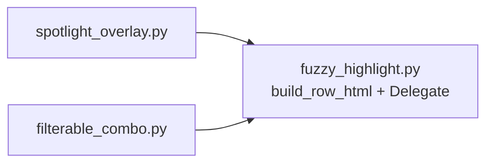
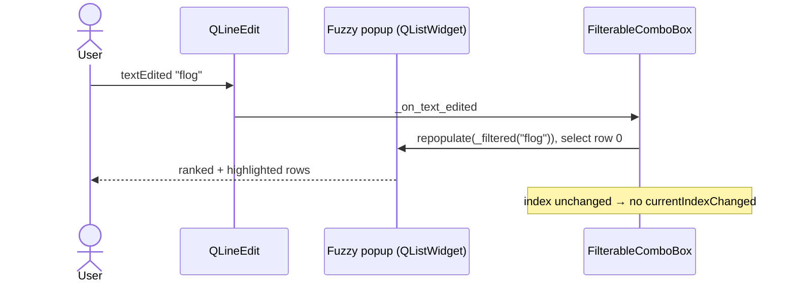
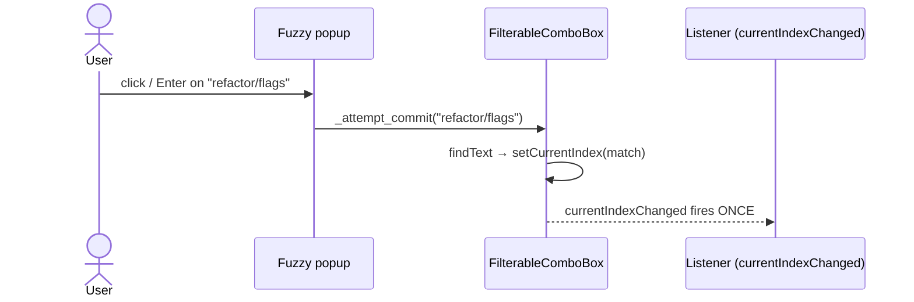

<!-- autobot-status
stage: 6
iteration: 1
gate: none
updated: 2026-06-18
-->

# Autobot — Fuzzy search + highlighting in FilterableComboBox

## Feature

Make [FilterableComboBox](worktree-manager/worktree_manager/ui/filterable_combo.py) filter and
highlight exactly the way [spotlight_overlay.py](worktree-manager/worktree_manager/ui/spotlight_overlay.py)
does:

- **Fuzzy (subsequence) matching with relevance ranking**, replacing the current `QCompleter`
  `MatchContains` substring filter. Reuses [fuzzy_filter / fuzzy_match_indices](worktree-manager/worktree_manager/spotlight/fuzzy.py).
- **Per-character highlighting** of the matched chars in each popup row, via a rich-text
  `QStyledItemDelegate` mirroring spotlight's `_HighlightDelegate`.
- **Custom popup list** replacing `QCompleter` — a `QListView`/`QListWidget` we filter and render
  ourselves.
- The shared highlight helper (`build_row_html`) is **extracted into a shared UI module** that both
  the spotlight overlay and the combo import — no logic duplication.

The combo's existing **selection-only behavioural contract is preserved exactly**: value is always
one of the existing items; junk text flags invalid (red border) and does not change the committed
selection; `currentIndexChanged` fires once on a real commit and never while typing; `currentText()`
returns the committed item; arrow-key navigation moves the line edit without committing; Esc restores
the committed text.

### Decisions (locked with user before design)
- Match scope → **full fuzzy + ranking** (best-first, like spotlight).
- Popup → **custom popup list**, dropping `QCompleter`.
- Code reuse → **reuse `spotlight.fuzzy`** + extract `build_row_html` into a shared UI helper.

### Consequence to flag
The current test suite hard-codes the `QCompleter` contract
([test_filterable_combo_qt.py](worktree-manager/tests/test_filterable_combo_qt.py):
`test_filterable_combo_has_completer`, `test_completer_uses_contains_filter`,
`test_completer_is_case_insensitive`, `test_addItems_keeps_completer_in_sync`; and
[test_filterable_combo_completer_emit_qt.py](worktree-manager/tests/test_filterable_combo_completer_emit_qt.py)
which drives commits through `_on_completer_activated`). Dropping `QCompleter` means these
completer-specific tests are **migrated** to the new custom-popup contract while keeping every
*behavioural* guarantee (commit-once, revert-on-junk, no-signal-while-typing, arrow nav, Esc
restore). New behaviour (fuzzy ranking, highlight HTML) gets new tests.

## Frontend Design

The widget still *looks* like a normal combo box when collapsed. The change is visible only when the
popup is open: rows are fuzzy-matched, ranked best-first, and the matched characters are highlighted
in the accent colour (the same `#4da3ff` bold spans spotlight uses).

### Collapsed (resting) state — unchanged from today
```
┌─ Base branch ───────────────┐
│ feature/login             ▾ │
└─────────────────────────────┘
```

### Filtering — user types "flog"; fuzzy popup with highlighting
```
┌─ Base branch ───────────────┐
│ flog▌                     ▾ │   ← typed "flog" (fuzzy subsequence, case-insensitive)
├─────────────────────────────┤
│ [f][l]ist-pages             │   ← matched chars f,l,o,g highlighted in accent bold
│ [f]eature/[log]in           │   ← ranked best-first by fuzzy_score
│ re[f]actor/f[l]a[g]s        │
└─────────────────────────────┘
   (only fuzzy matches shown; non-matches like "main" hidden)
   [x] = highlighted (accent #4da3ff, bold) matched character
```

### Keyboard navigation — Down highlights next row, line edit previews it (no commit)
```
┌─ Base branch ───────────────┐
│ feature/login             ▾ │   ← Down pressed: line edit previews highlighted row
├─────────────────────────────┤
│   [f]eature/[log]in         │
│ ▶ re[f]actor/f[l]a[g]s      │   ← current row (selected); not committed yet
└─────────────────────────────┘
   Enter commits this row · Esc restores committed text · index unchanged until commit
```

### Committed — user picks a row (click / Enter)
```
┌─ Base branch ───────────────┐
│ refactor/flags            ▾ │   ← value committed; currentIndexChanged fires ONCE
└─────────────────────────────┘
```

### No-match / invalid — typed junk that fuzzy-matches nothing, then blur/Enter
```
typed:  ┌─────────────────────┐        on blur:  ┌─────────────────────┐
        │ zzqqww            ▾ │   ───────────▶   │ zzqqww            ▾ │
        ├─────────────────────┤                  └─────────────────────┘
        │  (no matches)       │                    (red invalid border;
        └─────────────────────┘                     committed selection UNCHANGED,
          empty fuzzy result                         listeners NOT notified)
```

### Empty needle — popup shows all items in model order (no ranking, no highlight)
```
┌─ Base branch ───────────────┐
│ ▌                         ▾ │   ← field cleared / just focused
├─────────────────────────────┤
│ feature/login               │   ← all items, original order, no highlight
│ feature/search              │
│ refactor/flags              │
│ main                        │
└─────────────────────────────┘
```

### Clarifying questions — all resolved with user
1. **Popup trigger when collapsed** → **opens on focus/click showing all items** (empty-needle,
   model order), narrowing as the user types. Same feel as a normal combo.
2. **Highlight colour** → **reuse spotlight's exact `#4da3ff`** via the shared `HIGHLIGHT_COLOR`
   constant, so spotlight and combo stay visually identical.
3. **Ranking** → **rank best-first by `fuzzy_score`**, reordering rows as the user types (spotlight
   behaviour). Model-order alternative rejected.

## Backend Design

The widget keeps the same public contract; only its *internals* change: the `QCompleter` substring
machine is replaced by (a) a fuzzy filter over the combo's items and (b) a custom popup that renders
the matches with highlight spans. Everything in the commit/revert/keyboard layer is re-pointed at the
new popup but otherwise behaves identically.

### Concept 1 — Shared highlight helper (extract from spotlight)

`build_row_html(text, needle)` and the `HIGHLIGHT_COLOR` constant move out of
[spotlight_overlay.py](worktree-manager/worktree_manager/ui/spotlight_overlay.py) into a new shared
UI module `worktree_manager/ui/fuzzy_highlight.py`. Spotlight imports them from there (its current
local copies are deleted and replaced by the import); the combo imports the same helper. The
`_HighlightDelegate` rich-text rendering is generalised so both the spotlight list and the combo
popup use one delegate class.

```
# worktree_manager/ui/fuzzy_highlight.py  (new)
HIGHLIGHT_COLOR = "#4da3ff"

def build_row_html(text, needle) -> str:
    # identical to spotlight's current implementation:
    #   matched = fuzzy_match_indices(needle, text) if needle else None
    #   wrap each matched char in bold accent span, escape the rest
    ...

class FuzzyHighlightDelegate(QStyledItemDelegate):
    # paint each row as a QTextDocument of build_row_html(text, needle_provider())
    # needle_provider: a zero-arg callable returning the current filter text,
    #   so rows re-highlight live as the filter changes (same trick spotlight uses
    #   via overlay._filter_text)
    def __init__(self, parent, needle_provider): ...
    def paint(...): ...      # same draw-background-then-rich-text logic
    def sizeHint(...): ...
```



### Concept 2 — Fuzzy filtering of the combo's items

On every keystroke the combo computes the visible, ranked subset of its items from the model using
[fuzzy_filter](worktree-manager/worktree_manager/spotlight/fuzzy.py). Empty needle → all items in
model order (no ranking). The popup is rebuilt from this list; the line edit text is **not** touched
(typing never commits).

```
def _current_items() -> list[str]:
    return [itemText(i) for i in range(count())]

def _filtered(needle) -> list[str]:
    return fuzzy_filter(_current_items(), needle)   # empty needle => all, model order
```

### Concept 3 — Custom popup (replaces QCompleter)

A `QListWidget`-based popup owned by the combo, shown as a `Qt.Popup` anchored under the line edit.
It holds the fuzzy-filtered rows, uses `FuzzyHighlightDelegate` for rendering, and reports the
chosen row back to the combo's existing commit path.

- **Open:** on focus-in / mouse-press on the line edit (and on text edit), populate with
  `_filtered(needle)`, size/anchor under the field, select row 0.
- **Filter:** `textEdited` → recompute `_filtered`, repopulate, keep selection at row 0; popup hides
  if there are zero matches (and the field shows the invalid flag only on commit, not while typing).
- **Navigate:** Up/Down move the popup's current row; the line edit *previews* the current row text
  (no commit, no `currentIndexChanged`) — mirrors today's `_nav_index` preview behaviour but driven
  by the popup selection.
- **Choose:** click or Enter on a row → call the existing `_attempt_commit(rowText)` (which does the
  `findText` → `setCurrentIndex` once, or sets invalid). Popup closes.
- **Esc:** close popup, restore committed text, clear invalid — unchanged.
- **Blur (editingFinished):** `_attempt_commit(lineEdit.text())` — junk → invalid + no signal;
  exact item → commit once — unchanged.





### Concept 4 — Commit / signal contract (preserved, re-pointed)

The commit core is **unchanged** — `_attempt_commit`, `_set_invalid`, `currentText()` override,
`setCurrentIndex` override all stay. What changes:
- `_on_completer_activated(text)` is replaced by `_on_popup_chosen(text)` calling the same
  `_attempt_commit`. (The completer-coupled tests are migrated to drive `_on_popup_chosen` /
  the popup instead.)
- `keyPressEvent` Up/Down: when the popup is open, route arrows to the popup's row selection +
  line-edit preview; when closed, the existing wrap-around `_nav_index` line-edit navigation is
  retained as a fallback (so behaviour with a closed popup is identical to today).
- `addItems` / `addItem` / `clear`: instead of `_sync_completer`, they refresh the popup's backing
  list lazily (popup is rebuilt from the model each time it opens, so item changes are picked up with
  no parallel completer model to keep in sync).

### Concept 5 — Highlighting wiring

The combo stores `self._filter_text` (the active needle, set on each `textEdited`), exactly like
spotlight's `overlay._filter_text`. The popup's `FuzzyHighlightDelegate` is constructed with
`needle_provider=lambda: self._filter_text`, so rows highlight live against the current input —
identical to spotlight's `_HighlightDelegate` reading `overlay._filter_text` at paint time.

### Files touched
- `worktree-manager/worktree_manager/ui/fuzzy_highlight.py` (new) — shared `HIGHLIGHT_COLOR`,
  `build_row_html`, `FuzzyHighlightDelegate`.
- [worktree-manager/worktree_manager/ui/spotlight_overlay.py](worktree-manager/worktree_manager/ui/spotlight_overlay.py)
  — delete local `HIGHLIGHT_COLOR` / `build_row_html` / `_HighlightDelegate`; import the shared ones;
  construct the delegate with `needle_provider=lambda: self._filter_text`.
- [worktree-manager/worktree_manager/ui/filterable_combo.py](worktree-manager/worktree_manager/ui/filterable_combo.py)
  — drop `QCompleter`; add the fuzzy popup + delegate + `_filter_text`; re-point commit/keyboard
  paths.
- [worktree-manager/tests/test_filterable_combo_qt.py](worktree-manager/tests/test_filterable_combo_qt.py)
  and [test_filterable_combo_completer_emit_qt.py](worktree-manager/tests/test_filterable_combo_completer_emit_qt.py)
  — migrate completer-specific assertions to the new popup contract (behavioural guarantees kept).

### Reuse note (no API verification needed)
`fuzzy_filter`, `fuzzy_match_indices`, `fuzzy_score` are local, already-tested project code — no
external API. The `QStyledItemDelegate` rich-text rendering is a verbatim lift of spotlight's
working `_HighlightDelegate`, so the paint logic is already proven in-app.

## Iteration Plan

- Iteration 0 — Shared fuzzy-highlight module (walking skeleton)
- Iteration 1 — Fuzzy-ranked filtering + highlighted popup in FilterableComboBox

### Iteration 0 — Shared fuzzy-highlight module (walking skeleton)
**Context file:** [Iteration 0 context](autobot-fuzzy-filterable-combo-ctx-iter-0-shared-fuzzy-highlight-module-2026-06-18.md)

## ✋ Manual Testing Gate — Iteration 0

> STOP. Do not proceed to Iteration 1 until every item is confirmed.

- [x] Launch the app (`python3.14 run.py` from `worktree-manager/`) and open Spotlight.
- [x] Type a partial command/needle — confirm the matched characters in the suggestion rows are
      highlighted in accent blue (bold), exactly as before the change.
- [x] Pick a highlighted suggestion — confirm it commits/executes as before.
- [x] Confirm no visual regression in the Spotlight suggestion list (spacing, selection background).

**Confirmed by user:** 2026-06-18
**How to confirm:** Check every box, then reply "Iteration 0 confirmed" or describe what failed.

### Implementation Ledger — Iteration 0
- `test_build_row_html_empty_needle_returns_escaped_text`: red → green ✓
- `test_build_row_html_wraps_fuzzy_matched_chars_in_accent_spans`: red → green ✓
- `test_build_row_html_escapes_html_special_characters_in_text`: red → green ✓
- `test_build_row_html_returns_escaped_plain_text_when_needle_does_not_match`: red → green ✓
- `test_fuzzy_highlight_delegate_reads_live_needle_from_provider`: red → green ✓
- `test_fuzzy_highlight_delegate_changing_provider_output_changes_html`: red → green ✓
- `test_spotlight_overlay_still_highlights_rows_after_import_move`: red → green ✓

### Iteration 1 — Fuzzy-ranked filtering + highlighted popup in FilterableComboBox
**Context file:** [Iteration 1 context](autobot-fuzzy-filterable-combo-ctx-iter-1-fuzzy-popup-combo-2026-06-18.md)

## ✋ Manual Testing Gate — Iteration 1

> STOP. Do not proceed past this iteration until every item is confirmed.

- [ ] Open the **Create Worktree** dialog and click the **Base branch** dropdown — confirm it opens
      showing all branches.
- [ ] Type a **fuzzy, non-contiguous** string (e.g. `flog` for `feature/login`) — confirm the popup
      shows only fuzzy matches, ranked best-match-first, with the matched characters highlighted in
      accent blue (bold).
- [ ] Pick a highlighted match — confirm the combo shows the chosen branch with no spurious errors.
- [ ] Type a string matching nothing (e.g. `zzqq`) then press Tab / click away — confirm the combo
      flags invalid (red border) and the committed selection is unchanged.
- [ ] Use arrow Down/Up — confirm rows preview in the field without committing; press Enter to commit
      the previewed row; press Esc to restore the prior selection.
- [ ] Create a worktree using a fuzzy-picked base branch — confirm the worktree is created on the
      correct branch (no bad data passed downstream).
- [ ] Regression (Iteration 0): re-open Spotlight, confirm it still fuzzy-filters and highlights
      suggestions exactly as before.

**Confirmed by user:** —
**How to confirm:** Check every box, then reply "Iteration 1 confirmed" or describe what failed.
