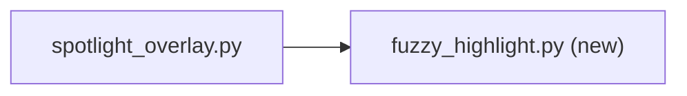

# Context: Iteration 0 — Shared fuzzy-highlight module (walking skeleton)

## Goal
Extract spotlight's highlighting code (`HIGHLIGHT_COLOR`, `build_row_html`, and the rich-text row
delegate) into a new shared module `worktree_manager/ui/fuzzy_highlight.py`, and repoint
[spotlight_overlay.py](../worktree-manager/worktree_manager/ui/spotlight_overlay.py) to import from
it. This is the walking skeleton: the shared helper exists, is independently tested, and a real
consumer (the spotlight overlay) runs on it unchanged in behaviour. Iteration 1 then reuses the same
module in the combo.

## Tests to write
- `build_row_html escapes plain text when needle is empty`: empty needle returns the HTML-escaped
  text with no spans.
- `build_row_html wraps fuzzy-matched chars in accent spans`: for needle "fl" in "feature/login",
  the f and l characters are wrapped in a bold `#4da3ff` span and the rest is escaped plain text.
- `build_row_html escapes HTML-special characters in the text`: text containing `<` / `&` is escaped
  in both matched and unmatched runs (no raw markup leaks).
- `build_row_html returns escaped plain text when needle does not match`: a non-subsequence needle
  yields no spans.
- `FuzzyHighlightDelegate reads the live needle from its provider`: the delegate built with a
  provider returning "fl" produces a document whose HTML contains a highlight span; changing what the
  provider returns changes the rendered HTML (proves live re-highlight).
- `spotlight overlay still highlights rows after the import move`: an existing spotlight highlight
  behaviour (a row's HTML for an active filter) is unchanged when sourced from the shared module.

## Files to touch
- `worktree-manager/worktree_manager/ui/fuzzy_highlight.py` (new) — shared `HIGHLIGHT_COLOR`,
  `build_row_html`, `FuzzyHighlightDelegate`.
- [spotlight_overlay.py](../worktree-manager/worktree_manager/ui/spotlight_overlay.py) — delete the
  local `HIGHLIGHT_COLOR`, `build_row_html`, and `_HighlightDelegate`; import them from the shared
  module; construct the delegate with `needle_provider=lambda: self._filter_text`.
- `worktree-manager/tests/test_fuzzy_highlight.py` (new) — unit tests for the shared helper.

## Design / pseudocode

#### `worktree_manager/ui/fuzzy_highlight.py`
```
from html import escape
from PySide6.QtGui import QTextDocument
from PySide6.QtWidgets import QStyle, QStyledItemDelegate, QStyleOptionViewItem
from worktree_manager.spotlight.fuzzy import fuzzy_match_indices

HIGHLIGHT_COLOR = "#4da3ff"

def build_row_html(text, needle):
    # verbatim from spotlight: matched = fuzzy_match_indices(needle, text) if needle else None
    # if not matched: return escape(text)
    # else wrap each matched-index char in bold accent span, escape the rest

class FuzzyHighlightDelegate(QStyledItemDelegate):
    # generalised from spotlight's _HighlightDelegate
    def __init__(self, parent, needle_provider):
        super().__init__(parent)
        self._needle_provider = needle_provider   # zero-arg callable -> current needle str
    def _document(self, option, text):
        doc = QTextDocument(); doc.setDefaultFont(option.font)
        doc.setHtml(build_row_html(text, self._needle_provider()))
        return doc
    def paint(...):   # same as spotlight: draw row bg via style, then draw rich text at +4,top
    def sizeHint(...): # same as spotlight: max(default height, doc height)
```

#### `spotlight_overlay.py` (edits only)
```
from worktree_manager.ui.fuzzy_highlight import (
    HIGHLIGHT_COLOR, build_row_html, FuzzyHighlightDelegate,
)
# delete local HIGHLIGHT_COLOR constant, build_row_html func, _HighlightDelegate class
# in __init__: self._list.setItemDelegate(
#     FuzzyHighlightDelegate(self, needle_provider=lambda: self._filter_text)
# )
# _row_html stays, now calling the imported build_row_html
```

## Diagrams


## Relevant existing code

Spotlight's current helper + delegate (the code being lifted) —
[spotlight_overlay.py:109-174](../worktree-manager/worktree_manager/ui/spotlight_overlay.py#L109-L174):
```python
HIGHLIGHT_COLOR = "#4da3ff"

def build_row_html(text: str, needle: str) -> str:
    matched = fuzzy_match_indices(needle, text) if needle else None
    if not matched:
        return escape(text)
    matched_set = set(matched)
    parts = []
    for i, ch in enumerate(text):
        if i in matched_set:
            parts.append(f'<span style="color: {HIGHLIGHT_COLOR}; font-weight: bold;">{escape(ch)}</span>')
        else:
            parts.append(escape(ch))
    return "".join(parts)

class _HighlightDelegate(QStyledItemDelegate):
    def __init__(self, overlay): super().__init__(overlay); self._overlay = overlay
    def _document(self, option, text):
        doc = QTextDocument(); doc.setDefaultFont(option.font)
        doc.setHtml(build_row_html(text, self._overlay._filter_text)); return doc
    def paint(self, painter, option, index): ...   # draw bg via style, then rich text at +4,top
    def sizeHint(self, option, index): ...          # max(default, doc height)
```

Where spotlight installs the delegate today —
[spotlight_overlay.py:210](../worktree-manager/worktree_manager/ui/spotlight_overlay.py#L210):
```python
self._list.setItemDelegate(_HighlightDelegate(self))
```

`fuzzy_match_indices` signature —
[fuzzy.py:12](../worktree-manager/worktree_manager/spotlight/fuzzy.py#L12):
```python
def fuzzy_match_indices(needle: str, candidate: str) -> list[int] | None: ...
```

## Constraints / invariants
- The extraction must be **behaviour-preserving** for spotlight — the rendered HTML for any
  (text, needle) pair is byte-identical to today. The delegate generalisation only swaps
  `self._overlay._filter_text` for `self._needle_provider()`.
- No silent exceptions.
- The new module must not import from `spotlight_overlay` (avoid a cycle) — it depends only on
  `spotlight.fuzzy` + PySide6.

## Done when (gate items)
- [ ] Spotlight overlay still opens and, while typing a filter, highlights matched characters in the
      suggestion rows exactly as before (accent-blue bold chars).
- [ ] Picking a highlighted suggestion still commits/executes as before.
- [ ] The new shared-module unit tests pass.

## TDD mode: <set at Stage 3>
