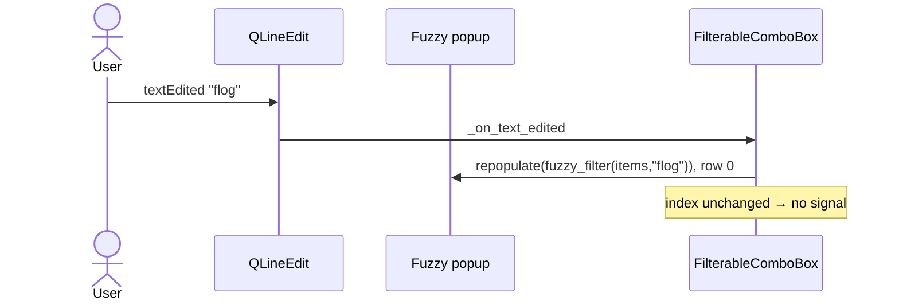
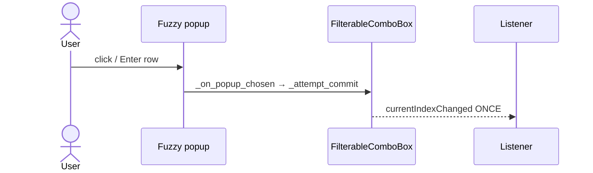

# Context: Iteration 1 — Fuzzy-ranked filtering + highlighted popup in FilterableComboBox

## Goal
Replace the `QCompleter` substring filter in
[FilterableComboBox](../worktree-manager/worktree_manager/ui/filterable_combo.py) with a custom
fuzzy-ranked popup that highlights matched characters, reusing the shared `fuzzy_highlight` module
(Iteration 0) and [fuzzy_filter](../worktree-manager/worktree_manager/spotlight/fuzzy.py). The combo's
selection-only contract — commit-once, revert-on-junk, no-signal-while-typing, arrow nav, Esc restore
— is preserved exactly; only the filtering engine and popup rendering change.

## Tests to write

**New fuzzy-popup behaviour:**
- `popup lists all items in model order for empty needle`: with no filter text the popup model holds
  every item in original order.
- `popup lists only fuzzy matches ranked best-first`: typing "flog" yields only fuzzy-subsequence
  matches, ordered by `fuzzy_score` (best first), excluding non-matches like "main".
- `popup rows are highlighted against the active filter`: the popup's delegate renders a matched row
  with an accent highlight span for the current needle.
- `empty fuzzy result hides the popup`: a needle matching nothing leaves the popup with zero rows /
  hidden, and does not flag invalid while still typing.
- `choosing a popup row commits that item once`: selecting a popup row drives `_attempt_commit` and
  fires `currentIndexChanged` exactly once for a real index change.
- `choosing the already-committed row fires nothing`: re-picking the current item emits no signal.

**Preserved behavioural contract (migrated from the completer tests):**
- `typing does not fire currentIndexChanged or currentTextChanged`.
- `committing a valid item via the popup updates index and fires once`.
- `blur with invalid text keeps the typed text, flags invalid, fires nothing`.
- `blur with a valid full item commits once`.
- `Enter with valid text commits once; Enter with junk flags invalid and fires nothing`.
- `setCurrentText with valid item changes index once; with invalid does nothing`.
- `currentText returns the committed value even when the line edit shows junk`.
- `invalid flag is set on bad commit, cleared on next edit / successful commit / popup pick`.
- `arrow Down/Up previews a row in the line edit without committing` (popup-driven; wraps).
- `arrow navigation then Enter commits the previewed row`.
- `Esc during navigation restores the committed text`.
- `typing resets navigation context`.
- `addItems / addItem / clear keep the popup's backing list correct` (replaces the old
  "completer in sync" test).
- `the widget no longer exposes a QCompleter` (replaces the completer-presence assertions).

## Files to touch
- [filterable_combo.py](../worktree-manager/worktree_manager/ui/filterable_combo.py) — drop
  `QCompleter`; add the fuzzy popup (`QListWidget`), the `FuzzyHighlightDelegate`, `self._filter_text`;
  re-point commit/keyboard/lifecycle paths.
- [test_filterable_combo_qt.py](../worktree-manager/tests/test_filterable_combo_qt.py) — migrate the
  four completer-specific assertions and `_on_completer_activated` calls to the popup contract; keep
  every behavioural test.
- [test_filterable_combo_completer_emit_qt.py](../worktree-manager/tests/test_filterable_combo_completer_emit_qt.py)
  — migrate its `_on_completer_activated`-driven commit tests to `_on_popup_chosen` / popup pick.
- `worktree-manager/tests/test_filterable_combo_fuzzy_qt.py` (new) — the new fuzzy-popup behaviour
  tests.

## Design / pseudocode

#### `worktree_manager/ui/filterable_combo.py`
```
from worktree_manager.spotlight.fuzzy import fuzzy_filter
from worktree_manager.ui.fuzzy_highlight import FuzzyHighlightDelegate

class FilterableComboBox(QComboBox):
    def __init__(self, parent=None):
        setEditable(True); setInsertPolicy(NoInsert)
        self._committed_index = 0
        self._nav_index = None
        self._filter_text = ""           # active needle, drives highlight + filter

        # custom popup (no QCompleter)
        self._popup = QListWidget(self)          # Qt.Popup window flag, frameless
        self._popup.setItemDelegate(
            FuzzyHighlightDelegate(self._popup, needle_provider=lambda: self._filter_text)
        )
        self._popup.itemClicked.connect(self._on_popup_item_clicked)

        lineEdit().textEdited.connect(self._on_text_edited)
        lineEdit().returnPressed.connect(self._on_return_pressed)
        lineEdit().editingFinished.connect(self._on_editing_finished)
        # focus-in / mouse-press on the field opens the popup (showing all)

    # --- membership (unchanged) ---
    _index_of(text) = findText(text, MatchExactly)

    # --- commit core (UNCHANGED) ---
    def _attempt_commit(text):
        idx = _index_of(text)
        if idx >= 0: _set_invalid(False); setCurrentIndex(idx) if idx != committed else restore text
        else: _set_invalid(True)

    # --- popup engine (NEW, replaces completer) ---
    def _current_items(): return [itemText(i) for i in range(count())]

    def _open_popup():
        self._filter_text = ""                 # opening shows all
        _repopulate(_current_items())
        anchor under line edit, show, select row 0

    def _repopulate(rows):
        self._popup.clear(); addItems(rows)
        select row 0 if rows else hide popup

    def _on_text_edited(text):
        self._nav_index = None
        _set_invalid(False)
        self._filter_text = text
        _repopulate(fuzzy_filter(_current_items(), text))   # empty => all, model order

    def _on_popup_chosen(text):                # was _on_completer_activated
        _attempt_commit(text); _popup.hide()
    def _on_popup_item_clicked(item): _on_popup_chosen(item.text())

    def _on_return_pressed(): 
        if popup visible and has current row: _on_popup_chosen(current row text)
        else: _attempt_commit(lineEdit().text())
    def _on_editing_finished(): _attempt_commit(lineEdit().text())   # UNCHANGED

    # --- keyboard (re-pointed) ---
    def keyPressEvent(event):
        Up/Down:
            if popup visible: move popup current row; lineEdit previews row text (NO commit)
            else: existing _nav_index wrap-around line-edit navigation (UNCHANGED fallback)
        Escape: hide popup; restore committed text; clear invalid; _nav_index=None
        else: super()

    # --- lifecycle (re-pointed: no _sync_completer) ---
    addItem/addItems/clear: super(); if popup open, _repopulate(fuzzy_filter(...))
    # popup rebuilds from the model on each open, so no parallel model to sync

    # --- public contract (UNCHANGED) ---
    currentText() -> itemText(_committed_index)
    setCurrentIndex(index): _committed_index=index; _set_invalid(False); super()
    setCurrentText(text): idx=_index_of(text); if idx>=0 setCurrentIndex(idx)
    _set_invalid(flag): dynamic 'invalid' property + unpolish/polish   # UNCHANGED
```

## Diagrams



## Relevant existing code

Current commit core to preserve —
[filterable_combo.py:46-65](../worktree-manager/worktree_manager/ui/filterable_combo.py#L46-L65):
```python
def _attempt_commit(self, text):
    idx = self._index_of(text)
    if idx >= 0:
        self._set_invalid(False)
        if idx != self._committed_index:
            self.setCurrentIndex(idx)
        else:
            self.lineEdit().setText(self.itemText(idx))
    else:
        self._set_invalid(True)
```

Current keyboard nav fallback to keep when popup is closed —
[filterable_combo.py:71-92](../worktree-manager/worktree_manager/ui/filterable_combo.py#L71-L92):
```python
def keyPressEvent(self, event):
    key = event.key()
    if key in (Qt.Key_Up, Qt.Key_Down) and not self.view().isVisible():
        ...  # _nav_index wrap-around, lineEdit().setText(itemText(...)), no super()
    if key == Qt.Key_Escape:
        self._nav_index = None
        self.lineEdit().setText(self.itemText(self._committed_index)); self._set_invalid(False)
        return
    super().keyPressEvent(event)
```

`fuzzy_filter` signature —
[fuzzy.py:83](../worktree-manager/worktree_manager/spotlight/fuzzy.py#L83):
```python
def fuzzy_filter(items: list[str], needle: str) -> list[str]:
    # empty needle returns items in original order (all kept); else best-first by fuzzy_score
```

## Constraints / invariants
- **Do not change** `_attempt_commit`, `_set_invalid`, `currentText()`, `setCurrentIndex`,
  `setCurrentText`, or the signal semantics. The whole point is a behaviour-preserving internal swap.
- `currentIndexChanged` must fire **once** on a real commit and **never** while typing.
- Empty needle → all items in **model order** (no ranking). Non-empty → `fuzzy_filter` ranking.
- No silent exceptions.
- The widget must no longer construct a `QCompleter`; tests asserting completer presence are
  replaced, not kept.
- Reuse the shared `fuzzy_highlight` module from Iteration 0 — do not re-copy the highlight code.

## Done when (gate items)
- [ ] Open the **Create Worktree → Base branch** dropdown; it shows all branches on focus.
- [ ] Type a fuzzy (non-contiguous) string (e.g. `flog`) — the popup shows only fuzzy matches,
      best-match first, with the matched characters highlighted in accent blue.
- [ ] Pick a highlighted match — the combo commits it; no spurious errors.
- [ ] Type junk that matches nothing (e.g. `zzqq`) then Tab/click away — the combo flags invalid
      (red border) and the committed selection is unchanged.
- [ ] Arrow Down/Up previews rows in the field without committing; Enter commits the previewed row;
      Esc restores the prior selection.
- [ ] Create a worktree using a fuzzy-picked base branch — it is created on the correct branch
      (no bad data passed downstream).
- [ ] Regression: spotlight overlay still fuzzy-filters and highlights as before.

## TDD mode: Autonomous. TDD directly. Keep the ledger below as you go.
