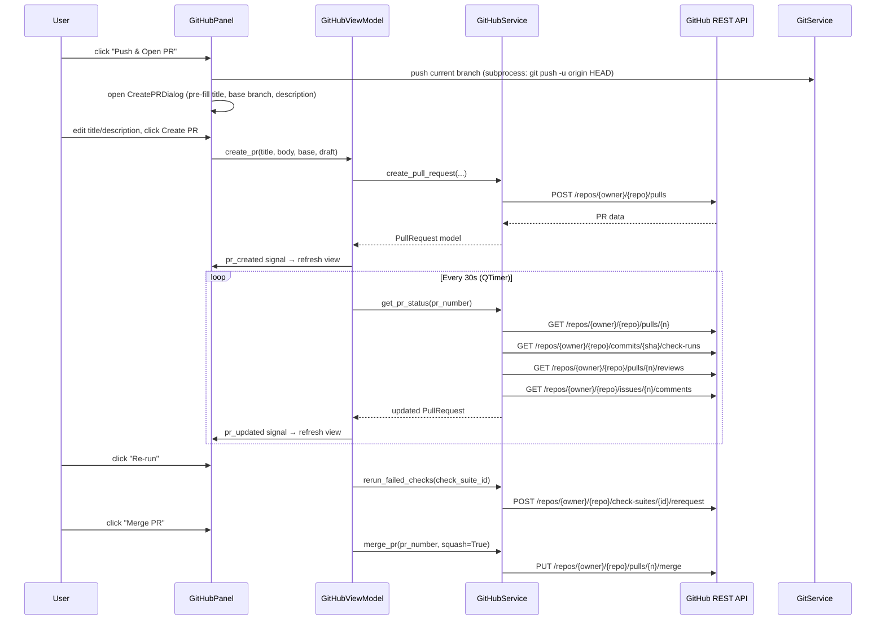
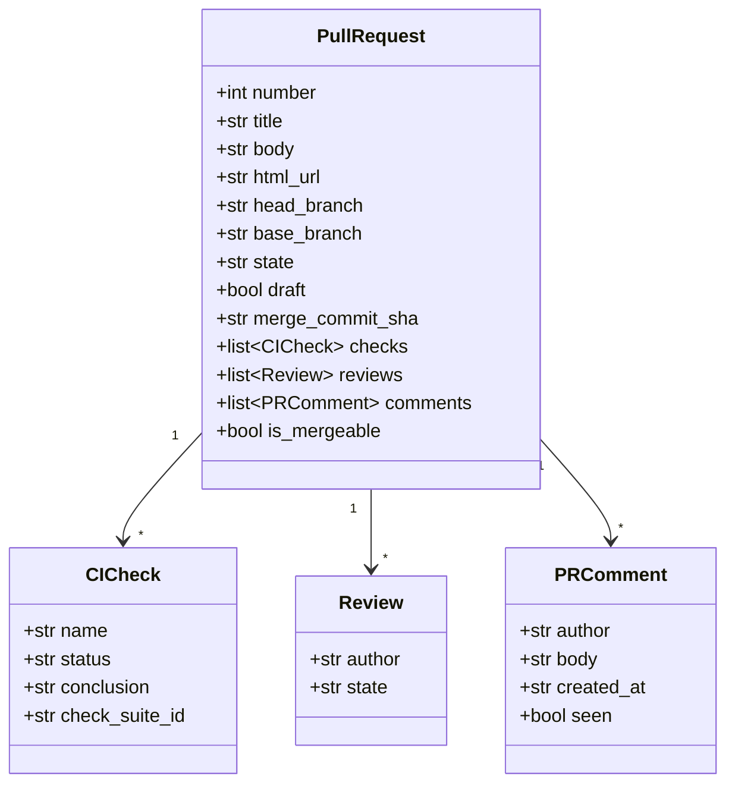

# GitHub Integration

## Overview

Adds a GitHub Pull Request panel to the worktree manager, giving you the full PR lifecycle without leaving the app: push a branch and open a PR with one click, monitor CI checks and review status in real time, copy/open the PR URL, re-run failed checks, see new comments, and merge with squash when it's green. A `GitHubService` wraps the GitHub REST API (authenticated with a PAT stored in config) and a `GitHubViewModel` drives a new "Pull Requests" sidebar panel.

---

## UI / Flow

The panel has two tabs: **My PRs** (list of all your open PRs — read-only monitor) and **Open PR** (push + create a new PR for the current branch). Tabs sit directly under the panel header. `[⚿ Token]` is always accessible in the top-right corner.

---

### Tab 1 — My PRs

#### My PRs — list, current branch has an open PR

```
┌──────────────────────┬──────────────────────────────────────────────────────────────────┐
│  📁  Projects        │  ⬡  Pull Requests          [🔔 On]  [↻ 30s]  [⚿ Token]          │
│  ⊞  Commands        │  [ My PRs ◀ ]  [ Open PR ]                                       │
│  ⇄  Diff            │──────────────────────────────────────────────────────────────────│
│  ⬡  Pull Requests ◀ │  #142  My Work                              ⏳ checks running     │
│  🌳  Worktrees       │  feature/my-work → main                         ← current branch │
│  🌿  Branches        │                                                                  │
│                      │  #138  Fix login timeout                    ✅ ready to merge    │
│                      │  fix/login-timeout → main                                        │
│                      │                                                                  │
│  ────────────────    │  #131  Refactor auth layer                  ❌ checks failed     │
│  ↻  Refresh          │  refactor/auth → main                                            │
│  ⚙  Settings         │                                                                  │
│  ◀  Hide             │                                                                  │
└──────────────────────┴──────────────────────────────────────────────────────────────────┘
```

#### My PRs — row selected (CI running)

Clicking a row replaces the list with that PR's detail. Back arrow returns to the list.

```
┌──────────────────────┬──────────────────────────────────────────────────────────────────┐
│  📁  Projects        │  ⬡  Pull Requests          [🔔 On]  [↻ 30s]  [⚿ Token]          │
│  ⊞  Commands        │  [ My PRs ◀ ]  [ Open PR ]                                       │
│  ⇄  Diff            │──────────────────────────────────────────────────────────────────│
│  ⬡  Pull Requests ◀ │  ← Back                                                          │
│  🌳  Worktrees       │  #142  My Work                    [⧉ Copy URL]  [↗ Open]         │
│  🌿  Branches        │  feature/my-work → main                                          │
│                      │──────────────────────────────────────────────────────────────────│
│                      │  CI Checks                                                       │
│                      │  ● build (ubuntu)              ⏳ running...                     │
│  ────────────────    │  ● lint                         ✅ passed                         │
│  ↻  Refresh          │  ● test (py3.12)                ✅ passed                         │
│  ⚙  Settings         │                                                                  │
│  ◀  Hide             │  Reviews                                                         │
│                      │  No reviews yet.                                                 │
│                      │                                                                  │
│                      │  Comments                                                        │
│                      │  No comments.                                                    │
│                      │──────────────────────────────────────────────────────────────────│
│                      │  ⏳ Checks running — not ready to merge                          │
└──────────────────────┴──────────────────────────────────────────────────────────────────┘
```

#### My PRs — row selected (CI failed)

```
┌──────────────────────┬──────────────────────────────────────────────────────────────────┐
│  📁  Projects        │  ⬡  Pull Requests          [🔔 On]  [↻ 30s]  [⚿ Token]          │
│  ⊞  Commands        │  [ My PRs ◀ ]  [ Open PR ]                                       │
│  ⇄  Diff            │──────────────────────────────────────────────────────────────────│
│  ⬡  Pull Requests ◀ │  ← Back                                                          │
│  🌳  Worktrees       │  #142  My Work                    [⧉ Copy URL]  [↗ Open]         │
│  🌿  Branches        │  feature/my-work → main                                          │
│                      │──────────────────────────────────────────────────────────────────│
│                      │  CI Checks                                         [↺ Re-run]    │
│                      │  ● build (ubuntu)              ❌ failed                          │
│  ────────────────    │  ● lint                         ✅ passed                         │
│  ↻  Refresh          │  ● test (py3.12)                ✅ passed                         │
│  ⚙  Settings         │                                                                  │
│  ◀  Hide             │  Reviews                                                         │
│                      │  No reviews yet.                                                 │
│                      │                                                                  │
│                      │  Comments                               🔴 2 new                 │
│                      │  alice: "Can you fix the timeout?"                               │
│                      │  bob: "Looks good otherwise"                                     │
│                      │──────────────────────────────────────────────────────────────────│
│                      │  ❌ Checks failed                                                │
└──────────────────────┴──────────────────────────────────────────────────────────────────┘
```

#### My PRs — row selected (ready to merge)

```
┌──────────────────────┬──────────────────────────────────────────────────────────────────┐
│  📁  Projects        │  ⬡  Pull Requests          [🔔 On]  [↻ 30s]  [⚿ Token]          │
│  ⊞  Commands        │  [ My PRs ◀ ]  [ Open PR ]                                       │
│  ⇄  Diff            │──────────────────────────────────────────────────────────────────│
│  ⬡  Pull Requests ◀ │  ← Back                                                          │
│  🌳  Worktrees       │  #142  My Work                    [⧉ Copy URL]  [↗ Open]         │
│  🌿  Branches        │  feature/my-work → main                                          │
│                      │──────────────────────────────────────────────────────────────────│
│                      │  CI Checks                                                       │
│                      │  ● build (ubuntu)              ✅ passed                          │
│  ────────────────    │  ● lint                         ✅ passed                         │
│  ↻  Refresh          │  ● test (py3.12)                ✅ passed                         │
│  ⚙  Settings         │                                                                  │
│  ◀  Hide             │  Reviews                                                         │
│                      │  ✅ alice approved                                                │
│                      │                                                                  │
│                      │  Comments                                                        │
│                      │  alice: "LGTM!"                                                  │
│                      │──────────────────────────────────────────────────────────────────│
│                      │  ✅ Ready to merge                                               │
│                      │  [✓] Squash and merge          [  Merge PR  ]                    │
└──────────────────────┴──────────────────────────────────────────────────────────────────┘
```

---

### Tab 2 — Open PR

#### Open PR — current branch has no PR yet

```
┌──────────────────────┬──────────────────────────────────────────────────────────────────┐
│  📁  Projects        │  ⬡  Pull Requests          [🔔 On]  [↻ 30s]  [⚿ Token]          │
│  ⊞  Commands        │  [ My PRs ]  [ Open PR ◀ ]                                       │
│  ⇄  Diff            │──────────────────────────────────────────────────────────────────│
│  ⬡  Pull Requests ◀ │  Current branch: feature/my-work                                 │
│  🌳  Worktrees       │                                                                  │
│  🌿  Branches        │  Title:                                                          │
│                      │  [My Work                                                      ] │
│                      │                                                                  │
│                      │  Base branch:                                                    │
│  ────────────────    │  [★ main (suggested)                                       ▼]   │
│  ↻  Refresh          │                                                                  │
│  ⚙  Settings         │  Description:                                                    │
│  ◀  Hide             │  ┌────────────────────────────────────────────────────────────┐  │
│                      │  │                                                            │  │
│                      │  │                                                            │  │
│                      │  └────────────────────────────────────────────────────────────┘  │
│                      │  [✓] Draft PR                                                    │
│                      │                                                                  │
│                      │  [  Push & Open PR  ]                                            │
└──────────────────────┴──────────────────────────────────────────────────────────────────┘
```

#### Open PR — current branch already has a PR

Tab still navigable; shows the existing PR summary and a link to view it in My PRs tab.

```
┌──────────────────────┬──────────────────────────────────────────────────────────────────┐
│  📁  Projects        │  ⬡  Pull Requests          [🔔 On]  [↻ 30s]  [⚿ Token]          │
│  ⊞  Commands        │  [ My PRs ]  [ Open PR ◀ ]                                       │
│  ⇄  Diff            │──────────────────────────────────────────────────────────────────│
│  ⬡  Pull Requests ◀ │  Current branch: feature/my-work                                 │
│  🌳  Worktrees       │                                                                  │
│  🌿  Branches        │  PR already open:                                                │
│                      │  #142  My Work  ⏳ checks running                                │
│                      │                                                                  │
│  ────────────────    │  [  View in My PRs  ]                                            │
│  ↻  Refresh          │                                                                  │
│  ⚙  Settings         │                                                                  │
│  ◀  Hide             │                                                                  │
└──────────────────────┴──────────────────────────────────────────────────────────────────┘
```

---

### Token states (any tab)

#### Token not configured (first visit)

Polling not yet started — no header controls shown.

```
┌──────────────────────┬──────────────────────────────────────────────────────────────────┐
│  📁  Projects        │  ⬡  Pull Requests                                                │
│  ⊞  Commands        │  [ My PRs ]  [ Open PR ]                                         │
│  ⇄  Diff            │──────────────────────────────────────────────────────────────────│
│  ⬡  Pull Requests ◀ │  GitHub token not configured.                                    │
│  🌳  Worktrees       │                                                                  │
│  🌿  Branches        │  [GitHub Personal Access Token ____________________________]     │
│                      │  Needs: repo, read:org scopes                                    │
│  ────────────────    │                                                                  │
│  ↻  Refresh          │  [  Save Token  ]                                                │
│  ⚙  Settings         │                                                                  │
│  ◀  Hide             │                                                                  │
└──────────────────────┴──────────────────────────────────────────────────────────────────┘
```

#### Token expired (API returned 401)

Polling stops on 401 — header controls hidden until token is saved.

```
┌──────────────────────┬──────────────────────────────────────────────────────────────────┐
│  📁  Projects        │  ⬡  Pull Requests                                                │
│  ⊞  Commands        │  [ My PRs ]  [ Open PR ]                                         │
│  ⇄  Diff            │──────────────────────────────────────────────────────────────────│
│  ⬡  Pull Requests ◀ │  ⚠ Token expired or invalid.                                    │
│  🌳  Worktrees       │                                                                  │
│  🌿  Branches        │  [GitHub Personal Access Token ____________________________]     │
│                      │  Needs: repo, read:org scopes                                    │
│  ────────────────    │                                                                  │
│  ↻  Refresh          │  [  Update Token  ]                                              │
│  ⚙  Settings         │                                                                  │
│  ◀  Hide             │                                                                  │
└──────────────────────┴──────────────────────────────────────────────────────────────────┘
```

#### Token rotation (inline dropdown from `[⚿ Token]` button)

Clicking `[⚿ Token]` when already configured drops a compact inline form above the tab content. Does not navigate away.

```
┌──────────────────────┬──────────────────────────────────────────────────────────────────┐
│  📁  Projects        │  ⬡  Pull Requests          [🔔 On]  [↻ 30s]  [⚿ Token ▲]        │
│  ⊞  Commands        │  [ My PRs ◀ ]  [ Open PR ]                                       │
│  ⇄  Diff            │  ┌──────────────────────────────────────────────────────────────┐ │
│  ⬡  Pull Requests ◀ │  │ [New token _____________________________]  [Save]  [Cancel] │ │
│  🌳  Worktrees       │  └──────────────────────────────────────────────────────────────┘ │
│  🌿  Branches        │──────────────────────────────────────────────────────────────────│
│                      │  #142  My Work                              ⏳ checks running     │
│                      │  feature/my-work → main                         ← current branch │
│                      │                                                                  │
│  ────────────────    │  #138  Fix login timeout                    ✅ ready to merge    │
│  ↻  Refresh          │  fix/login-timeout → main                                        │
│  ⚙  Settings         │                                                                  │
│  ◀  Hide             │                                                                  │
└──────────────────────┴──────────────────────────────────────────────────────────────────┘
```

---

### Settings dialog — GitHub polling interval

The existing Settings dialog gains a "GitHub polling interval" row (row 6, between Branch diff mode and the Cancel/Save buttons).

```
┌──────────────────────────────────────────────────────┐
│  Settings                                            │
│                                                      │
│  Stale threshold:   [14] days                        │
│  Shell:             [zsh              ▼]             │
│  Default editor:    [Cursor           ▼]             │
│  Branch diff mode:  [Merge base (default) ▼]         │
│  GitHub polling:    [30] seconds                     │
│                                                      │
│                          [Cancel]  [Save]            │
└──────────────────────────────────────────────────────┘
```

`[30]` is a `QSpinBox` (range 5–3600). Saving updates `ui.github_poll_interval_seconds` in config. The `[↻ Ns]` button label in the GitHub panel header reflects the new value on next panel open.

---

### Notifications

The polling loop runs whether or not the GitHub panel is visible. When a PR's state changes between polls, a macOS system notification fires (same `osascript` mechanism as the Command Center). A mute toggle in the panel header suppresses them.

#### macOS system notification (any panel open — fires in background)

```
┌──────────────────────────────────────┐
│  🔔  Pull Requests            now    │
│  ❌ "My Work" — build failed         │
└──────────────────────────────────────┘

┌──────────────────────────────────────┐
│  🔔  Pull Requests            now    │
│  💬 alice commented on "My Work"     │
└──────────────────────────────────────┘

┌──────────────────────────────────────┐
│  🔔  Pull Requests            now    │
│  ✅ alice approved "My Work"         │
└──────────────────────────────────────┘

┌──────────────────────────────────────┐
│  🔔  Pull Requests            now    │
│  ✅ "My Work" — all checks passed    │
└──────────────────────────────────────┘
```

#### Panel header — notifications mute toggle (mirrors Command Center)

```
┌──────────────────────┬──────────────────────────────────────────────────────────────────┐
│  📁  Projects        │  ⬡  Pull Requests          [🔔 On]  [↻ 30s]  [⚿ Token]          │
│  ⊞  Commands        │  [ My PRs ◀ ]  [ Open PR ]                                       │
│  ⇄  Diff            │──────────────────────────────────────────────────────────────────│
│  ⬡  Pull Requests ◀ │  ...                                                             │
└──────────────────────┴──────────────────────────────────────────────────────────────────┘

  — click [🔔 On] to mute —

┌──────────────────────┬──────────────────────────────────────────────────────────────────┐
│  📁  Projects        │  ⬡  Pull Requests         [🔕 Off]  [↻ 30s]  [⚿ Token]          │
│  ⊞  Commands        │  [ My PRs ◀ ]  [ Open PR ]                                       │
│  ⇄  Diff            │──────────────────────────────────────────────────────────────────│
│  ⬡  Pull Requests ◀ │  ...                                                             │
└──────────────────────┴──────────────────────────────────────────────────────────────────┘
```

#### My PRs list — unread comment badge

```
┌──────────────────────┬──────────────────────────────────────────────────────────────────┐
│  📁  Projects        │  ⬡  Pull Requests          [🔔 On]  [↻ 30s]  [⚿ Token]          │
│  ⊞  Commands        │  [ My PRs ◀ ]  [ Open PR ]                                       │
│  ⇄  Diff            │──────────────────────────────────────────────────────────────────│
│  ⬡  Pull Requests ◀ │  #142  My Work                    🔴 2 new  ❌ checks failed      │
│  🌳  Worktrees       │  feature/my-work → main                         ← current branch │
│  🌿  Branches        │                                                                  │
│                      │  #138  Fix login timeout                    ✅ ready to merge    │
│                      │  fix/login-timeout → main                                        │
│  ────────────────    │                                                                  │
│  ↻  Refresh          │                                                                  │
│  ⚙  Settings         │                                                                  │
│  ◀  Hide             │                                                                  │
└──────────────────────┴──────────────────────────────────────────────────────────────────┘
```

---

## Architecture

### New components

```
worktree_manager/
  github_service.py          # GitHub REST API calls (PAT auth, requests lib)
  github_models.py           # PullRequest, CICheck, Review, PRComment dataclasses
  github_vm.py               # GitHubViewModel — state, polling timer, signals
  ui/
    github_panel.py          # PR panel (new sidebar entry)
    create_pr_dialog.py      # Create PR modal
    token_setup_widget.py    # Inline token prompt (shown inside github_panel)
```

### Data flow



### Models



### Key existing files referenced

- [worktree_manager/git_service.py](worktree_manager/git_service.py) — `infer_branch_suggestions()` reused for base-branch suggestion
- [worktree_manager/diff_vm.py](worktree_manager/diff_vm.py) — `suggested_older_refs()` pattern mirrored in `GitHubViewModel`
- [worktree_manager/config_store.py](worktree_manager/config_store.py) — extended to store GitHub token and polling interval
- [worktree_manager/models.py](worktree_manager/models.py) — `RepoConfig` extended with `github_token` field
- [worktree_manager/ui/sidebar.py](worktree_manager/ui/sidebar.py) — `_TAB_DEFS` list extended with `"github"` entry
- [worktree_manager/cli.py](worktree_manager/cli.py) — `App._panel_cache` and `_set_panel()` pattern followed for new panel
- [worktree_manager/ui/diff_point_selector.py](worktree_manager/ui/diff_point_selector.py) — suggested-ref UI pattern mirrored in base-branch dropdown

### Auth & config

GitHub token stored in `~/.config/worktree-manager/config.json` under `ui.github_token`. Polling interval stored under `ui.github_poll_interval_seconds` (default 30). Remote org/repo auto-detected from `git remote get-url origin` at panel load time — no manual config needed (suggestion E).

The polling interval is configurable in the app's Settings dialog ([`worktree_manager/ui/settings_panel.py`](worktree_manager/ui/settings_panel.py) `SettingsDialog`) as a new "GitHub polling interval" numeric field (seconds). [`worktree_manager/config_store.py`](worktree_manager/config_store.py) gains `save_github_poll_interval(seconds: int)` alongside `get_github_poll_interval()`. The `[↻ Ns]` button in the panel header always reflects the current configured value; if the user changes it in Settings the label updates on next panel open.

PR description pre-filled from `.github/pull_request_template.md` in the repo root if it exists (suggestion G).

---

## Open Questions

None — all scope decisions resolved in conversation.

---

## Iteration Plan

### Iteration 0 — Walking Skeleton

**Delivers:** A "Pull Requests" sidebar entry opens a two-tab panel; token can be saved; the app detects the GitHub remote; My PRs tab fetches and lists your open PRs by title and status badge; clicking a PR row shows a detail view with CI checks, reviews, and comments; the Open PR tab shows the create-PR form pre-filled from branch name and suggested base branch, and submits a real PR to GitHub after pushing.

**Scope:**
- New files: `worktree_manager/github_service.py`, `worktree_manager/github_models.py`, `worktree_manager/github_vm.py`, `worktree_manager/ui/github_panel.py`
- Extend [`worktree_manager/ui/sidebar.py`](worktree_manager/ui/sidebar.py) `_TAB_DEFS` with `("github", "⬡  Pull Requests")` and add `on_github` callback
- Extend [`worktree_manager/cli.py`](worktree_manager/cli.py) with `_show_github_panel()` and wire into `App.__init__`
- Extend [`worktree_manager/config_store.py`](worktree_manager/config_store.py) with `get_github_token()` / `save_github_token()` / `get_github_poll_interval()`
- `GitHubService`: auto-detect remote from `git remote get-url origin`; `list_my_open_prs()`, `get_pr_detail()` (checks, reviews, comments), `push_branch()`, `create_pull_request()`
- `GitHubViewModel`: holds PR list, selected PR, token state; `QTimer` polling (default 30s); signals: `prs_updated`, `pr_detail_updated`, `token_state_changed`
- `GitHubPanel`: two-tab layout (`QTabWidget`); token-setup/expired state replaces tab content; My PRs list → detail navigation with explicit `← Back` button; PR list rows show `← current branch` label when the row matches the active branch; Open PR form with title, base branch dropdown (suggested via [`worktree_manager/git_service.py`](worktree_manager/git_service.py) `infer_branch_suggestions()`), description textarea, Draft checkbox, Push & Open PR button; `[⚿ Token]` inline dropdown in header; `[↻ 30s]` is a toggle button: clicking it pauses the polling loop and changes the label to `[⏸ 30s]`; clicking again resumes polling and restores `[↻ 30s]`; the interval value shown is always the configured `github_poll_interval_seconds`; the polling rate itself is config-file-only and not editable from the UI
- Pre-fill PR description from `.github/pull_request_template.md` if present
- "Open PR" tab shows existing-PR summary + "View in My PRs" button that switches to the My PRs tab when clicked
- Extend [`worktree_manager/ui/settings_panel.py`](worktree_manager/ui/settings_panel.py) `SettingsDialog` with a "GitHub polling interval" `QSpinBox` row (range 5–3600 seconds, default 30); extend [`worktree_manager/config_store.py`](worktree_manager/config_store.py) with `save_github_poll_interval(seconds: int)`; the `[↻ Ns]` header button label reads the configured value at panel open time

**Explicitly out of scope:**
- Copy URL button / Open in browser button (Iteration 1)
- Re-run CI button (Iteration 1)
- New-comment notification badge (Iteration 1)
- Merge PR button (Iteration 2)

---

### Iteration 1 — Actions, Notifications & Badges

**Delivers:** macOS system notifications fire when any of your open PRs has a meaningful status change (CI failed, CI passed, new comment, review approved/rejected) — even when the panel is not open. Copy URL, Open in browser, and Re-run CI are also added. Unread comment badge appears on list rows.

**Scope:**
- `[⧉ Copy URL]` button on PR detail — writes `html_url` to clipboard via `QClipboard`
- `[↗ Open]` button on PR detail — calls `QDesktopServices.openUrl()`
- `[↺ Re-run]` button on PR detail CI section — visible only when at least one check has `conclusion == "failure"`, hidden otherwise; calls `GitHubService.rerun_failed_checks(check_suite_id)` → `POST /check-suites/{id}/rerequest`
- `GitHubViewModel` compares each poll result against the previous snapshot and emits a `pr_event(pr_number, event_type, message)` signal for: `ci_failed`, `ci_passed`, `new_comment`, `review_approved`, `review_changes_requested`
- [`worktree_manager/cli.py`](worktree_manager/cli.py) `App` connects to `pr_event` signal and calls existing `_show_notification(title, body)` (same macOS `osascript` path used by Command Center) — fires regardless of which panel is visible
- `QApplication.alert(self, 0)` called alongside notification to flash the dock icon, mirroring Command Center behaviour
- Notification gated by a new `github_notifications_enabled` config pref (default `True`); toggle button in the `GitHubPanel` header (same pattern as Command Center's mute button in [`worktree_manager/ui/command_center_panel.py`](worktree_manager/ui/command_center_panel.py))
- Unread comment tracking: `PRComment.seen` flag; new comments since last poll show a `🔴 N new` badge on the list row alongside the existing status badge (both rendered on the same row simultaneously, e.g. `🔴 2 new  ❌ checks failed`); badge cleared when detail view is opened
- Extend [`worktree_manager/github_models.py`](worktree_manager/github_models.py) `PRComment` with `seen` field; `GitHubViewModel` tracks seen comment IDs in memory

**Notification events and messages:**

| Event | Title | Body |
|---|---|---|
| CI failed | Pull Requests | ❌ "My Work" — build failed |
| CI passed | Pull Requests | ✅ "My Work" — all checks passed |
| New comment | Pull Requests | 💬 alice commented on "My Work" |
| Review approved | Pull Requests | ✅ alice approved "My Work" |
| Changes requested | Pull Requests | 🔄 alice requested changes on "My Work" |

**Builds on:** Iteration 0

---

### Iteration 2 — Merge

**Delivers:** A "Merge PR" button with a "Squash and merge" checkbox (default on) appears on the PR detail view when the PR is approved and all checks pass; clicking it merges the PR via the GitHub API.

**Scope:**
- `GitHubService.merge_pr(pr_number, squash: bool)` → `PUT /repos/{owner}/{repo}/pulls/{n}/merge`
- `GitHubViewModel` computes `is_ready_to_merge`: all checks `success` and at least one review `APPROVED` and `mergeable` true
- Merge button + squash checkbox rendered at the bottom of the PR detail view, visible only when `is_ready_to_merge`
- On success: remove PR from list, switch My PRs tab to list view, show brief "Merged!" inline message; fire macOS notification "✅ 'My Work' merged"
- On failure (merge conflict, branch protection): show inline error message

**Builds on:** Iteration 1

---

## ✋ Manual Testing Gate — Iteration 0

> STOP. Do not proceed to Iteration 1 until every item below is checked off by the user.

- [ ] Launch the app — a "⬡  Pull Requests" entry appears in the sidebar
- [ ] Click "⬡  Pull Requests" — the panel opens showing the token-not-configured state with a PAT input field and "Save Token" button
- [ ] Enter a valid GitHub PAT and click "Save Token" — the panel switches to the two-tab My PRs / Open PR layout with `[↻ 30s]` and `[⚿ Token]` buttons in the header
- [ ] My PRs tab loads — your open PRs appear as rows showing title, `head → base`, and a CI status badge (⏳ / ✅ / ❌)
- [ ] The PR row for the currently checked-out branch shows a `← current branch` label
- [ ] Click a PR row — the detail view appears with CI check rows, Reviews section, and Comments section; a `← Back` button is visible
- [ ] Click `← Back` — returns to the PR list
- [ ] Wait ~30 seconds — the PR list refreshes automatically (status badges may update if CI state changed)
- [ ] Click `[↻ 30s]` — label changes to `[⏸ 30s]` and polling stops; click again — label returns to `[↻ 30s]` and polling resumes
- [ ] Click `[⚿ Token]` — an inline token input appears above the tabs; enter a new token and click Save — the dropdown closes
- [ ] Switch to the Open PR tab — shows "Current branch: <branch>" with pre-filled Title, a Base branch dropdown with a suggested branch, a Description textarea, and a Draft checkbox
- [ ] If `.github/pull_request_template.md` exists in the repo: the Description textarea is pre-filled with its contents
- [ ] Switch to Open PR tab on a branch that already has an open PR — shows "PR already open: #N  Title  <status>" and a "View in My PRs" button; clicking it switches to the My PRs tab
- [ ] Open Settings (⚙) — "GitHub polling:" spinbox is visible with the current interval (default 30); change it and Save — reopen the GitHub panel and confirm `[↻ Ns]` shows the new value
- [ ] Enter an invalid PAT (or let one expire) — the panel shows "⚠ Token expired or invalid." with an input and "Update Token" button; header controls are hidden

**How to confirm:** Run the app, perform each action above, and check off each item manually.
Reply "Iteration 0 confirmed" (or describe any failures) before I write the plan for Iteration 1.

---

## Iteration 1 — Actions, Notifications & Badges

### Phase 1.1 — Copy URL and Open in Browser buttons

**What it covers:** Add `[⧉ Copy URL]` and `[↗ Open]` buttons to the PR detail header in `GitHubPanel`.

**Files touched:**
- [worktree_manager/ui/github_panel.py](worktree-manager/worktree_manager/ui/github_panel.py)

**Tests (Red) — write these first:**
```python
# tests/test_github_panel_iter1_qt.py
import pytest
from unittest.mock import MagicMock, patch
from PySide6.QtWidgets import QApplication
from PySide6.QtGui import QClipboard
from worktree_manager.github_vm import GitHubViewModel, TokenState
from worktree_manager.github_models import PullRequest, CICheck, Review, PRComment
from worktree_manager.ui.github_panel import GitHubPanel


def _make_pr(number=1, head="feat", base="main", checks=None, reviews=None, comments=None, html_url=None):
    return PullRequest(
        number=number, title=f"PR {number}", body="", html_url=html_url or f"https://github.com/o/r/pull/{number}",
        head_branch=head, base_branch=base, state="open", draft=False, mergeable=True,
        checks=checks or [], reviews=reviews or [], comments=comments or [],
    )


@pytest.fixture
def vm(tmp_path):
    from worktree_manager.config_store import ConfigStore
    store = ConfigStore(path=tmp_path / "config.json")
    with patch("worktree_manager.github_vm.GitHubService"), \
         patch("worktree_manager.github_vm.subprocess.run") as mock_run:
        mock_run.return_value = MagicMock(returncode=0, stdout="")
        v = GitHubViewModel(store=store, repo_path="/tmp/repo")
    return v


@pytest.fixture
def configured_vm(tmp_path):
    from worktree_manager.config_store import ConfigStore
    store = ConfigStore(path=tmp_path / "config.json")
    store.save_github_token("ghp_test")
    with patch("worktree_manager.github_vm.GitHubService") as MockSvc, \
         patch("worktree_manager.github_vm.subprocess.run") as mock_run:
        mock_run.return_value = MagicMock(returncode=0, stdout="https://github.com/o/r.git")
        MockSvc.from_remote_url.return_value = MagicMock()
        v = GitHubViewModel(store=store, repo_path="/tmp/repo")
    return v


@pytest.fixture
def panel(vm, qtbot):
    p = GitHubPanel(vm=vm)
    qtbot.addWidget(p)
    p.show()
    return p


@pytest.fixture
def configured_panel(configured_vm, qtbot):
    p = GitHubPanel(vm=configured_vm)
    qtbot.addWidget(p)
    p.show()
    return p


def _show_detail(panel, vm, pr):
    vm.selected_pr = pr
    vm.pr_detail_updated.emit()


def test_copy_url_button_exists_on_detail_view(configured_panel, configured_vm, qtbot):
    pr = _make_pr(42, html_url="https://github.com/o/r/pull/42")
    _show_detail(configured_panel, configured_vm, pr)
    assert hasattr(configured_panel, "_copy_url_btn")
    assert configured_panel._copy_url_btn is not None


def test_open_url_button_exists_on_detail_view(configured_panel, configured_vm, qtbot):
    pr = _make_pr(42, html_url="https://github.com/o/r/pull/42")
    _show_detail(configured_panel, configured_vm, pr)
    assert hasattr(configured_panel, "_open_url_btn")
    assert configured_panel._open_url_btn is not None


def test_copy_url_writes_to_clipboard(configured_panel, configured_vm, qtbot):
    pr = _make_pr(42, html_url="https://github.com/o/r/pull/42")
    _show_detail(configured_panel, configured_vm, pr)
    configured_panel._copy_url_btn.click()
    clipboard = QApplication.clipboard()
    assert clipboard.text() == "https://github.com/o/r/pull/42"


def test_open_url_calls_desktop_services(configured_panel, configured_vm, qtbot):
    pr = _make_pr(42, html_url="https://github.com/o/r/pull/42")
    _show_detail(configured_panel, configured_vm, pr)
    with patch("worktree_manager.ui.github_panel.QDesktopServices.openUrl") as mock_open:
        configured_panel._open_url_btn.click()
    mock_open.assert_called_once()
    called_url = mock_open.call_args[0][0]
    assert "pull/42" in called_url.toString()
```

**Production code (Green):**

In [worktree_manager/ui/github_panel.py](worktree-manager/worktree_manager/ui/github_panel.py):

1. Add `QDesktopServices` to imports from `PySide6.QtGui`, and `QUrl` from `PySide6.QtCore`.
2. Add `_copy_url_btn` and `_open_url_btn` to the detail header row (alongside `_detail_title_label`).
3. In `_on_pr_detail_updated`, update button callbacks to use the current PR's `html_url`.

```python
# In imports, add:
from PySide6.QtCore import Qt, QUrl
from PySide6.QtGui import QDesktopServices

# In __init__, replace the detail_title_label block with:
detail_header = QHBoxLayout()
self._detail_title_label = QLabel()
self._detail_title_label.setStyleSheet("font-weight: bold;")
self._detail_title_label.setWordWrap(True)
detail_header.addWidget(self._detail_title_label, 1)
self._copy_url_btn = QPushButton("⧉ Copy URL")
self._copy_url_btn.setFixedWidth(90)
detail_header.addWidget(self._copy_url_btn)
self._open_url_btn = QPushButton("↗ Open")
self._open_url_btn.setFixedWidth(70)
detail_header.addWidget(self._open_url_btn)
detail_layout.addLayout(detail_header)

# In _on_pr_detail_updated, after setting detail_title_label text:
self._copy_url_btn.clicked.disconnect()
self._copy_url_btn.clicked.connect(
    lambda: QApplication.clipboard().setText(pr.html_url)
)
self._open_url_btn.clicked.disconnect()
self._open_url_btn.clicked.connect(
    lambda: QDesktopServices.openUrl(QUrl(pr.html_url))
)
```

**Done when:** PR detail view shows `⧉ Copy URL` and `↗ Open` buttons; clicking Copy URL puts the URL in the clipboard; clicking Open fires `QDesktopServices.openUrl` with the correct URL.

---

### Phase 1.2 — Re-run CI button

**What it covers:** Add a `[↺ Re-run]` button to the CI Checks section of the PR detail; it appears only when at least one check has `conclusion == "failure"`, calls `GitHubService.rerun_failed_checks`, and is hidden otherwise.

**Files touched:**
- [worktree_manager/github_service.py](worktree-manager/worktree_manager/github_service.py)
- [worktree_manager/ui/github_panel.py](worktree-manager/worktree_manager/ui/github_panel.py)

**Tests (Red) — write these first:**
```python
# Append to tests/test_github_panel_iter1_qt.py

def test_rerun_button_hidden_when_no_failures(configured_panel, configured_vm, qtbot):
    pr = _make_pr(42, checks=[CICheck("build", "completed", "success", "suite-1")])
    _show_detail(configured_panel, configured_vm, pr)
    assert not configured_panel._rerun_btn.isVisible()


def test_rerun_button_visible_when_check_failed(configured_panel, configured_vm, qtbot):
    pr = _make_pr(42, checks=[CICheck("build", "completed", "failure", "suite-1")])
    _show_detail(configured_panel, configured_vm, pr)
    assert configured_panel._rerun_btn.isVisible()


def test_rerun_button_calls_service(configured_panel, configured_vm, qtbot):
    failed_check = CICheck("build", "completed", "failure", "suite-99")
    pr = _make_pr(42, checks=[failed_check])
    _show_detail(configured_panel, configured_vm, pr)
    configured_vm._svc = MagicMock()
    configured_panel._rerun_btn.click()
    configured_vm._svc.rerun_failed_checks.assert_called_once_with("suite-99")


# tests/test_github_service_rerun.py
import pytest
from unittest.mock import MagicMock, patch
import requests
from worktree_manager.github_service import GitHubService


@pytest.fixture
def svc():
    return GitHubService(token="ghp_test", owner="myorg", repo="myrepo")


def test_rerun_failed_checks_calls_correct_endpoint(svc):
    with patch("worktree_manager.github_service.requests.post") as mock_post:
        mock_post.return_value = MagicMock(status_code=201)
        svc.rerun_failed_checks("suite-42")
    mock_post.assert_called_once()
    url = mock_post.call_args[0][0]
    assert "check-suites/suite-42/rerequest" in url


def test_rerun_failed_checks_raises_on_error(svc):
    with patch("worktree_manager.github_service.requests.post") as mock_post:
        mock_post.return_value = MagicMock(status_code=403, ok=False)
        mock_post.return_value.raise_for_status.side_effect = requests.HTTPError("403")
        with pytest.raises(requests.HTTPError):
            svc.rerun_failed_checks("suite-42")
```

**Production code (Green):**

In [worktree_manager/github_service.py](worktree-manager/worktree_manager/github_service.py), add:
```python
def rerun_failed_checks(self, check_suite_id: str) -> None:
    resp = requests.post(
        f"{self._base}/check-suites/{check_suite_id}/rerequest",
        headers=self._headers,
    )
    resp.raise_for_status()
```

In [worktree_manager/ui/github_panel.py](worktree-manager/worktree_manager/ui/github_panel.py):

1. Add `_rerun_btn` to the CI checks section header row.
2. In `_on_pr_detail_updated`, show/hide `_rerun_btn` based on whether any check has `conclusion == "failure"`, and wire it to `rerun_failed_checks` on the first failed check's `check_suite_id`.

```python
# In __init__, replace "detail_layout.addWidget(QLabel('CI Checks'))" with:
checks_header = QHBoxLayout()
checks_header.addWidget(QLabel("CI Checks"))
checks_header.addStretch(1)
self._rerun_btn = QPushButton("↺ Re-run")
self._rerun_btn.setFixedWidth(80)
self._rerun_btn.hide()
checks_header.addWidget(self._rerun_btn)
detail_layout.addLayout(checks_header)

# In _on_pr_detail_updated, after populating _checks_list:
failed_checks = [c for c in pr.checks if c.conclusion == "failure"]
if failed_checks:
    self._rerun_btn.show()
    suite_id = failed_checks[0].check_suite_id
    self._rerun_btn.clicked.disconnect()
    self._rerun_btn.clicked.connect(
        lambda: self._vm._svc.rerun_failed_checks(suite_id) if self._vm._svc else None
    )
else:
    self._rerun_btn.hide()
```

**Done when:** Re-run button is hidden when all checks pass; visible and clickable when any check failed; clicking it calls `rerun_failed_checks` with the correct suite ID.

---

### Phase 1.3 — PR event detection in GitHubViewModel

**What it covers:** After each poll, `GitHubViewModel` compares the new PR state to the previous snapshot and emits a `pr_event(pr_number, event_type, message)` signal for `ci_failed`, `ci_passed`, `new_comment`, `review_approved`, `review_changes_requested`.

**Files touched:**
- [worktree_manager/github_vm.py](worktree-manager/worktree_manager/github_vm.py)

**Tests (Red) — write these first:**
```python
# tests/test_github_vm_events.py
import pytest
from unittest.mock import MagicMock, patch
from worktree_manager.github_models import PullRequest, CICheck, Review, PRComment
from worktree_manager.github_vm import GitHubViewModel, TokenState


def _make_pr(number=1, head="feat", base="main", checks=None, reviews=None, comments=None):
    return PullRequest(
        number=number, title=f"My Work", body="", html_url=f"http://x/{number}",
        head_branch=head, base_branch=base, state="open", draft=False, mergeable=True,
        checks=checks or [], reviews=reviews or [], comments=comments or [],
    )


@pytest.fixture
def vm(tmp_path):
    from worktree_manager.config_store import ConfigStore
    store = ConfigStore(path=tmp_path / "config.json")
    store.save_github_token("ghp_test")
    with patch("worktree_manager.github_vm.GitHubService") as MockSvc, \
         patch("worktree_manager.github_vm.subprocess.run") as mock_run:
        mock_run.return_value = MagicMock(returncode=0, stdout="https://github.com/o/r.git")
        MockSvc.from_remote_url.return_value = MagicMock()
        v = GitHubViewModel(store=store, repo_path="/tmp/repo")
    return v


def test_ci_failed_event_emitted_when_checks_transition_to_failed(vm, qtbot):
    pr_before = _make_pr(1, checks=[CICheck("build", "in_progress", None)])
    pr_after  = _make_pr(1, checks=[CICheck("build", "completed", "failure")])
    vm._pr_snapshots = {1: pr_before}

    events = []
    vm.pr_event.connect(lambda num, evt, msg: events.append((num, evt, msg)))
    vm._emit_pr_events([pr_after])

    assert any(e[1] == "ci_failed" for e in events)
    assert any("My Work" in e[2] for e in events)


def test_ci_passed_event_emitted_when_all_checks_pass(vm, qtbot):
    pr_before = _make_pr(1, checks=[CICheck("build", "in_progress", None)])
    pr_after  = _make_pr(1, checks=[CICheck("build", "completed", "success")])
    vm._pr_snapshots = {1: pr_before}

    events = []
    vm.pr_event.connect(lambda num, evt, msg: events.append((num, evt, msg)))
    vm._emit_pr_events([pr_after])

    assert any(e[1] == "ci_passed" for e in events)


def test_new_comment_event_emitted_when_comment_count_grows(vm, qtbot):
    pr_before = _make_pr(1, comments=[PRComment(id=1, author="alice", body="hi", created_at="2024-01-01")])
    pr_after  = _make_pr(1, comments=[
        PRComment(id=1, author="alice", body="hi", created_at="2024-01-01"),
        PRComment(id=2, author="bob",   body="yo", created_at="2024-01-02"),
    ])
    vm._pr_snapshots = {1: pr_before}

    events = []
    vm.pr_event.connect(lambda num, evt, msg: events.append((num, evt, msg)))
    vm._emit_pr_events([pr_after])

    assert any(e[1] == "new_comment" for e in events)
    assert any("bob" in e[2] for e in events)


def test_review_approved_event_emitted(vm, qtbot):
    pr_before = _make_pr(1, reviews=[])
    pr_after  = _make_pr(1, reviews=[Review(author="alice", state="APPROVED")])
    vm._pr_snapshots = {1: pr_before}

    events = []
    vm.pr_event.connect(lambda num, evt, msg: events.append((num, evt, msg)))
    vm._emit_pr_events([pr_after])

    assert any(e[1] == "review_approved" for e in events)
    assert any("alice" in e[2] for e in events)


def test_review_changes_requested_event_emitted(vm, qtbot):
    pr_before = _make_pr(1, reviews=[])
    pr_after  = _make_pr(1, reviews=[Review(author="bob", state="CHANGES_REQUESTED")])
    vm._pr_snapshots = {1: pr_before}

    events = []
    vm.pr_event.connect(lambda num, evt, msg: events.append((num, evt, msg)))
    vm._emit_pr_events([pr_after])

    assert any(e[1] == "review_changes_requested" for e in events)


def test_no_events_when_nothing_changed(vm, qtbot):
    pr = _make_pr(1, checks=[CICheck("build", "completed", "success")])
    vm._pr_snapshots = {1: pr}

    events = []
    vm.pr_event.connect(lambda num, evt, msg: events.append((num, evt, msg)))
    vm._emit_pr_events([pr])

    assert events == []


def test_new_pr_does_not_emit_events_on_first_seen(vm, qtbot):
    pr = _make_pr(1, checks=[CICheck("build", "completed", "failure")])
    vm._pr_snapshots = {}

    events = []
    vm.pr_event.connect(lambda num, evt, msg: events.append((num, evt, msg)))
    vm._emit_pr_events([pr])

    assert events == []


def test_snapshots_updated_after_emit(vm, qtbot):
    pr = _make_pr(1, checks=[CICheck("build", "completed", "success")])
    vm._pr_snapshots = {}
    vm._emit_pr_events([pr])
    assert 1 in vm._pr_snapshots
```

**Production code (Green):**

In [worktree_manager/github_vm.py](worktree-manager/worktree_manager/github_vm.py):

```python
# Add to class signals:
pr_event = Signal(int, str, str)  # (pr_number, event_type, message)

# Add to __init__:
self._pr_snapshots: dict[int, PullRequest] = {}

# Add new method:
def _emit_pr_events(self, new_prs: list[PullRequest]) -> None:
    for pr in new_prs:
        prev = self._pr_snapshots.get(pr.number)
        if prev is None:
            self._pr_snapshots[pr.number] = pr
            continue

        prev_ci = prev.ci_status()
        curr_ci = pr.ci_status()
        if prev_ci != "failed" and curr_ci == "failed":
            self.pr_event.emit(pr.number, "ci_failed", f'❌ "{pr.title}" — checks failed')
        elif prev_ci != "passed" and curr_ci == "passed":
            self.pr_event.emit(pr.number, "ci_passed", f'✅ "{pr.title}" — all checks passed')

        prev_comment_ids = {c.id for c in prev.comments}
        for comment in pr.comments:
            if comment.id not in prev_comment_ids:
                self.pr_event.emit(pr.number, "new_comment", f'💬 {comment.author} commented on "{pr.title}"')

        prev_review_authors = {(r.author, r.state) for r in prev.reviews}
        for review in pr.reviews:
            if (review.author, review.state) not in prev_review_authors:
                if review.state == "APPROVED":
                    self.pr_event.emit(pr.number, "review_approved", f'✅ {review.author} approved "{pr.title}"')
                elif review.state == "CHANGES_REQUESTED":
                    self.pr_event.emit(pr.number, "review_changes_requested", f'🔄 {review.author} requested changes on "{pr.title}"')

        self._pr_snapshots[pr.number] = pr

# In refresh_prs, after self.prs = self._svc.list_my_open_prs():
# Add: self._emit_pr_events(self.prs)
```

**Done when:** `pr_event` signal fires with correct event type and message when PR state changes between polls; no events fire for unchanged PRs or first-seen PRs.

---

### Phase 1.4 — macOS notifications wired in App + mute toggle

**What it covers:** Wire `GitHubViewModel.pr_event` signal into `App._on_pr_event` in [worktree_manager/cli.py](worktree-manager/worktree_manager/cli.py), which calls `_show_notification("Pull Requests", message)` and `QApplication.alert(self, 0)`. Gate on a new `github_notifications_enabled` pref (default `True`). Add a mute toggle button (`[🔔 On]` / `[🔕 Off]`) to `GitHubPanel` header.

**Files touched:**
- [worktree_manager/cli.py](worktree-manager/worktree_manager/cli.py)
- [worktree_manager/ui/github_panel.py](worktree-manager/worktree_manager/ui/github_panel.py)
- [worktree_manager/config_store.py](worktree-manager/worktree_manager/config_store.py)

**Tests (Red) — write these first:**
```python
# tests/test_github_notifications_qt.py
import pytest
from unittest.mock import MagicMock, patch
from worktree_manager.cli import App


def _make_app(qtbot, monkeypatch):
    store = MagicMock()
    store.get_ui_pref.side_effect = lambda key, default=None: default
    store.all_repos.return_value = {}
    store.all_projects.return_value = []
    store.get_github_token.return_value = None
    store.get_github_poll_interval.return_value = 30
    monkeypatch.setattr("worktree_manager.cli.ConfigStore", lambda *a, **kw: store)
    monkeypatch.setattr("worktree_manager.cli.GitService", lambda *a, **kw: MagicMock())
    with patch("worktree_manager.main_window_vm.MainWindowViewModel") as MockVM:
        MockVM.return_value.load_worktrees.return_value = []
        MockVM.return_value.list_branches_with_checkout_status.return_value = []
        app = App()
        qtbot.addWidget(app)
    return app, store


def test_pr_event_notification_fires_when_enabled(qtbot, monkeypatch):
    app, store = _make_app(qtbot, monkeypatch)
    store.get_ui_pref.side_effect = lambda key, default=None: True if key == "github_notifications_enabled" else default

    shown = []
    with patch.object(app, "_show_notification", side_effect=lambda t, b: shown.append((t, b))):
        app._on_pr_event(1, "ci_failed", '❌ "My Work" — checks failed')

    assert len(shown) == 1
    assert shown[0][0] == "Pull Requests"
    assert "My Work" in shown[0][1]


def test_pr_event_notification_suppressed_when_disabled(qtbot, monkeypatch):
    app, store = _make_app(qtbot, monkeypatch)
    store.get_ui_pref.side_effect = lambda key, default=None: False if key == "github_notifications_enabled" else default

    shown = []
    with patch.object(app, "_show_notification", side_effect=lambda t, b: shown.append((t, b))):
        app._on_pr_event(1, "ci_passed", '✅ "My Work" — all checks passed')

    assert shown == []


def test_pr_event_alert_fires_with_notification(qtbot, monkeypatch):
    app, store = _make_app(qtbot, monkeypatch)
    store.get_ui_pref.side_effect = lambda key, default=None: True if key == "github_notifications_enabled" else default

    with patch.object(app, "_show_notification"), \
         patch("worktree_manager.cli.QApplication.alert") as mock_alert:
        app._on_pr_event(1, "ci_failed", '❌ "My Work" — checks failed')

    mock_alert.assert_called_once()


# tests/test_github_panel_mute_qt.py
import pytest
from unittest.mock import MagicMock, patch
from worktree_manager.ui.github_panel import GitHubPanel
from worktree_manager.github_vm import GitHubViewModel


@pytest.fixture
def configured_panel(tmp_path, qtbot):
    from worktree_manager.config_store import ConfigStore
    store = ConfigStore(path=tmp_path / "config.json")
    store.save_github_token("ghp_test")
    with patch("worktree_manager.github_vm.GitHubService") as MockSvc, \
         patch("worktree_manager.github_vm.subprocess.run") as mock_run:
        mock_run.return_value = MagicMock(returncode=0, stdout="https://github.com/o/r.git")
        MockSvc.from_remote_url.return_value = MagicMock()
        vm = GitHubViewModel(store=store, repo_path="/tmp/repo")
    p = GitHubPanel(vm=vm)
    qtbot.addWidget(p)
    p.show()
    return p, vm._store


def test_mute_button_exists_in_header(configured_panel, qtbot):
    panel, store = configured_panel
    assert hasattr(panel, "_notif_btn")


def test_mute_button_initial_state_is_on(configured_panel, qtbot):
    panel, store = configured_panel
    assert "🔔" in panel._notif_btn.text() or panel._notif_btn.isChecked()


def test_mute_button_toggle_saves_pref(configured_panel, qtbot):
    panel, store = configured_panel
    initial = store.get_ui_pref("github_notifications_enabled", True)
    panel._notif_btn.click()
    after = store.get_ui_pref("github_notifications_enabled", True)
    assert after != initial


def test_mute_button_text_updates_on_toggle(configured_panel, qtbot):
    panel, store = configured_panel
    panel._notif_btn.setChecked(True)
    panel._update_notif_btn()
    assert "🔔" in panel._notif_btn.text()
    panel._notif_btn.setChecked(False)
    panel._update_notif_btn()
    assert "🔕" in panel._notif_btn.text()
```

**Production code (Green):**

In [worktree_manager/config_store.py](worktree-manager/worktree_manager/config_store.py), add:
```python
def get_github_notifications_enabled(self) -> bool:
    return bool(self.get_ui_pref("github_notifications_enabled", True))

def save_github_notifications_enabled(self, enabled: bool) -> None:
    self.set_ui_pref("github_notifications_enabled", enabled)
```

In [worktree_manager/ui/github_panel.py](worktree-manager/worktree_manager/ui/github_panel.py), add to the header controls (before the poll button):
```python
self._notif_btn = QPushButton()
self._notif_btn.setCheckable(True)
self._notif_btn.setFixedWidth(36)
enabled = bool(vm._store.get_ui_pref("github_notifications_enabled", True))
self._notif_btn.setChecked(enabled)
self._update_notif_btn()
self._notif_btn.toggled.connect(self._on_notif_toggled)
ctrl_layout.addWidget(self._notif_btn)

# Add methods:
def _on_notif_toggled(self, checked: bool) -> None:
    self._vm._store.set_ui_pref("github_notifications_enabled", bool(checked))
    self._update_notif_btn()

def _update_notif_btn(self) -> None:
    on = self._notif_btn.isChecked()
    self._notif_btn.setText("🔔" if on else "🔕")
    self._notif_btn.setToolTip(
        "Notifications: On — click to mute" if on
        else "Notifications: Off — click to enable"
    )
```

In [worktree_manager/cli.py](worktree-manager/worktree_manager/cli.py), add `_on_pr_event` and wire it when creating the GitHub VM:
```python
def _on_pr_event(self, pr_number: int, event_type: str, message: str) -> None:
    if self._store.get_ui_pref("github_notifications_enabled", True):
        self._show_notification("Pull Requests", message)
        if not self.isActiveWindow():
            QApplication.alert(self, 0)

# In _show_github_panel, after creating self._github_vm:
self._github_vm.pr_event.connect(self._on_pr_event)
```

**Done when:** `[🔔 On]` / `[🔕 Off]` button appears in panel header; toggling it saves the pref; macOS notification fires via `_show_notification("Pull Requests", …)` when enabled; alert+notification suppressed when disabled.

---

### Phase 1.5 — Unread comment badge on PR list rows

**What it covers:** Track which comment IDs have been seen in `GitHubViewModel`; show a `🔴 N new` badge on list rows for PRs with unseen comments; clear the badge when the detail view is opened for that PR.

**Files touched:**
- [worktree_manager/github_vm.py](worktree-manager/worktree_manager/github_vm.py)
- [worktree_manager/ui/github_panel.py](worktree-manager/worktree_manager/ui/github_panel.py)

**Tests (Red) — write these first:**
```python
# tests/test_github_unread_badges_qt.py
import pytest
from unittest.mock import MagicMock, patch
from PySide6.QtCore import Qt
from worktree_manager.github_models import PullRequest, CICheck, PRComment
from worktree_manager.github_vm import GitHubViewModel
from worktree_manager.ui.github_panel import GitHubPanel


def _make_pr(number=1, comments=None):
    return PullRequest(
        number=number, title=f"PR {number}", body="",
        html_url=f"https://github.com/o/r/pull/{number}",
        head_branch="feat", base_branch="main",
        state="open", draft=False, mergeable=True,
        checks=[], reviews=[], comments=comments or [],
    )


def _make_comment(cid, author="alice"):
    return PRComment(id=cid, author=author, body="hi", created_at="2024-01-01")


@pytest.fixture
def vm(tmp_path):
    from worktree_manager.config_store import ConfigStore
    store = ConfigStore(path=tmp_path / "config.json")
    store.save_github_token("ghp_test")
    with patch("worktree_manager.github_vm.GitHubService") as MockSvc, \
         patch("worktree_manager.github_vm.subprocess.run") as mock_run:
        mock_run.return_value = MagicMock(returncode=0, stdout="https://github.com/o/r.git")
        MockSvc.from_remote_url.return_value = MagicMock()
        v = GitHubViewModel(store=store, repo_path="/tmp/repo")
    return v


@pytest.fixture
def panel(vm, qtbot):
    p = GitHubPanel(vm=vm)
    qtbot.addWidget(p)
    p.show()
    return p


def test_unread_count_zero_initially(vm):
    assert vm.unread_comment_count(1) == 0


def test_unread_count_increases_on_new_comments(vm):
    old_pr = _make_pr(1, comments=[_make_comment(1)])
    new_pr = _make_pr(1, comments=[_make_comment(1), _make_comment(2)])
    vm._pr_snapshots = {1: old_pr}
    vm._seen_comment_ids = {1}
    vm._emit_pr_events([new_pr])
    assert vm.unread_comment_count(1) == 1


def test_mark_pr_comments_seen_clears_unread(vm):
    vm._unseen_comment_ids_by_pr = {1: {10, 11}}
    vm.mark_pr_comments_seen(1)
    assert vm.unread_comment_count(1) == 0


def test_list_row_shows_badge_for_unread_comments(vm, panel, qtbot):
    pr = _make_pr(1, comments=[_make_comment(1), _make_comment(2)])
    vm._unseen_comment_ids_by_pr = {1: {2}}
    vm.prs = [pr]
    vm.prs_updated.emit()

    items = [panel._pr_list.item(i).text() for i in range(panel._pr_list.count())]
    assert any("🔴" in text and "new" in text for text in items)


def test_list_row_no_badge_when_no_unread(vm, panel, qtbot):
    pr = _make_pr(1, comments=[_make_comment(1)])
    vm._unseen_comment_ids_by_pr = {}
    vm.prs = [pr]
    vm.prs_updated.emit()

    items = [panel._pr_list.item(i).text() for i in range(panel._pr_list.count())]
    assert not any("🔴" in text for text in items)


def test_opening_detail_clears_badge(vm, panel, qtbot):
    pr = _make_pr(1, comments=[_make_comment(1)])
    vm._unseen_comment_ids_by_pr = {1: {1}}
    vm.selected_pr = pr
    vm.pr_detail_updated.emit()
    assert vm.unread_comment_count(1) == 0
```

**Production code (Green):**

In [worktree_manager/github_vm.py](worktree-manager/worktree_manager/github_vm.py), add to `__init__`:
```python
self._seen_comment_ids: set[int] = set()
self._unseen_comment_ids_by_pr: dict[int, set[int]] = {}
```

Add methods:
```python
def unread_comment_count(self, pr_number: int) -> int:
    return len(self._unseen_comment_ids_by_pr.get(pr_number, set()))

def mark_pr_comments_seen(self, pr_number: int) -> None:
    self._unseen_comment_ids_by_pr.pop(pr_number, None)
```

In `_emit_pr_events`, when a new comment is detected:
```python
# After emitting the new_comment pr_event:
self._unseen_comment_ids_by_pr.setdefault(pr.number, set()).add(comment.id)
self._seen_comment_ids.add(comment.id)
```

In `select_pr`, after `self.pr_detail_updated.emit()`:
```python
self.mark_pr_comments_seen(pr_number)
```

In [worktree_manager/ui/github_panel.py](worktree-manager/worktree_manager/ui/github_panel.py), update `_on_prs_updated` to include the badge:
```python
def _on_prs_updated(self):
    self._pr_error_label.hide()
    self._pr_list.clear()
    current_branch = _current_git_branch(getattr(self._vm, "_repo_path", ""))
    for pr in self._vm.prs:
        status = self._ci_badge(pr)
        unread = self._vm.unread_comment_count(pr.number)
        badge = f"🔴 {unread} new  " if unread > 0 else ""
        label = f"#{pr.number}  {pr.title}   {badge}{status}"
        if pr.head_branch == current_branch:
            label += "   ← current branch"
        item = QListWidgetItem(label)
        item.setData(Qt.UserRole, pr.number)
        self._pr_list.addItem(item)
    self._check_open_pr_tab()
```

**Done when:** `🔴 N new` badge appears in the list row for PRs with unseen comments; the badge disappears after opening the detail view for that PR.

---

## ✋ Manual Testing Gate — Iteration 1

> STOP. Do not proceed to Iteration 2 until every item below is checked off by the user.

- [ ] Open the PR detail view — `[⧉ Copy URL]` and `[↗ Open]` buttons appear in the detail header next to the PR title
- [ ] Click `[⧉ Copy URL]` — paste somewhere and confirm the PR's GitHub URL is in the clipboard
- [ ] Click `[↗ Open]` — the PR opens in your browser
- [ ] Open a PR detail where at least one CI check has failed — `[↺ Re-run]` button is visible in the CI Checks section header
- [ ] Open a PR detail where all CI checks passed — `[↺ Re-run]` button is NOT visible
- [ ] (If safe to do so) Click `[↺ Re-run]` on a failed PR — no crash occurs; GitHub re-queues the check suite
- [ ] Wait for a PR's CI status to change between polls (or manually trigger a change) — a macOS system notification fires with title "Pull Requests" and the appropriate message
- [ ] Click `[🔔 On]` in the panel header — button changes to `[🔕 Off]`; subsequent CI/review/comment changes produce no notifications
- [ ] Click `[🔕 Off]` — button returns to `[🔔 On]`; notifications resume
- [ ] After a new comment appears on a PR during polling — the list row for that PR shows `🔴 N new` alongside the CI status badge
- [ ] Click that PR row to open the detail view — the `🔴 N new` badge disappears from the list row on returning to the list
- [ ] Regression: My PRs tab still lists PRs with correct title, `head → base`, and CI badge
- [ ] Regression: PR detail still shows CI checks, Reviews, and Comments sections with `← Back` button
- [ ] Regression: `[↻ 30s]` polling toggle and `[⚿ Token]` inline form still work correctly
- [ ] Regression: Open PR tab still shows the create-PR form with pre-filled title and base branch dropdown

**How to confirm:** Run the app, perform each action above, and check off each item manually.
Reply "Iteration 1 confirmed" (or describe any failures) before I write the plan for Iteration 2.

---

## Iteration 2 — Merge

### Phase 2.1 — `GitHubService.merge_pr` + `is_ready_to_merge` computation

**What it covers:** Add `merge_pr(pr_number, squash)` to [worktree-manager/worktree_manager/github_service.py](worktree-manager/worktree_manager/github_service.py) and update `PullRequest.is_ready_to_merge()` in [worktree-manager/worktree_manager/github_models.py](worktree-manager/worktree_manager/github_models.py) to require all checks passing, at least one `APPROVED` review, and `mergeable == True`.

**Files touched:**
- [worktree-manager/worktree_manager/github_service.py](worktree-manager/worktree_manager/github_service.py)
- [worktree-manager/worktree_manager/github_models.py](worktree-manager/worktree_manager/github_models.py)

**Tests (Red) — write these first:**
```python
# tests/test_github_service_merge.py
import pytest
from unittest.mock import MagicMock, patch
import requests
from worktree_manager.github_service import GitHubService
from worktree_manager.github_models import PullRequest, CICheck, Review


@pytest.fixture
def svc():
    return GitHubService(token="ghp_test", owner="myorg", repo="myrepo")


def test_merge_pr_calls_correct_endpoint_squash(svc):
    with patch("worktree_manager.github_service.requests.put") as mock_put:
        mock_put.return_value = MagicMock(status_code=200, ok=True)
        mock_put.return_value.raise_for_status = MagicMock()
        svc.merge_pr(42, squash=True)
    mock_put.assert_called_once()
    url = mock_put.call_args[0][0]
    assert "pulls/42/merge" in url
    payload = mock_put.call_args[1]["json"]
    assert payload["merge_method"] == "squash"


def test_merge_pr_calls_correct_endpoint_merge(svc):
    with patch("worktree_manager.github_service.requests.put") as mock_put:
        mock_put.return_value = MagicMock(status_code=200, ok=True)
        mock_put.return_value.raise_for_status = MagicMock()
        svc.merge_pr(42, squash=False)
    payload = mock_put.call_args[1]["json"]
    assert payload["merge_method"] == "merge"


def test_merge_pr_raises_on_conflict(svc):
    with patch("worktree_manager.github_service.requests.put") as mock_put:
        mock_put.return_value = MagicMock(status_code=405, ok=False)
        mock_put.return_value.raise_for_status.side_effect = requests.HTTPError("405")
        mock_put.return_value.json.return_value = {"message": "Merge conflict"}
        with pytest.raises(RuntimeError, match="Merge conflict"):
            svc.merge_pr(42, squash=True)


def test_merge_pr_raises_on_branch_protection(svc):
    with patch("worktree_manager.github_service.requests.put") as mock_put:
        mock_put.return_value = MagicMock(status_code=405, ok=False)
        mock_put.return_value.raise_for_status.side_effect = requests.HTTPError("405")
        mock_put.return_value.json.return_value = {"message": "Branch protection rule"}
        with pytest.raises(RuntimeError, match="Branch protection rule"):
            svc.merge_pr(42, squash=True)


# tests/test_github_models_ready_to_merge.py
import pytest
from worktree_manager.github_models import PullRequest, CICheck, Review


def _make_pr(checks=None, reviews=None, mergeable=True):
    return PullRequest(
        number=1, title="My Work", body="",
        html_url="https://github.com/o/r/pull/1",
        head_branch="feat", base_branch="main",
        state="open", draft=False,
        mergeable=mergeable,
        checks=checks or [],
        reviews=reviews or [],
    )


def test_ready_to_merge_when_all_checks_pass_and_approved(capsys):
    pr = _make_pr(
        checks=[CICheck("build", "completed", "success")],
        reviews=[Review("alice", "APPROVED")],
        mergeable=True,
    )
    assert pr.is_ready_to_merge() is True


def test_not_ready_when_checks_failed():
    pr = _make_pr(
        checks=[CICheck("build", "completed", "failure")],
        reviews=[Review("alice", "APPROVED")],
        mergeable=True,
    )
    assert pr.is_ready_to_merge() is False


def test_not_ready_when_checks_running():
    pr = _make_pr(
        checks=[CICheck("build", "in_progress", None)],
        reviews=[Review("alice", "APPROVED")],
        mergeable=True,
    )
    assert pr.is_ready_to_merge() is False


def test_not_ready_when_no_approved_review():
    pr = _make_pr(
        checks=[CICheck("build", "completed", "success")],
        reviews=[Review("alice", "COMMENTED")],
        mergeable=True,
    )
    assert pr.is_ready_to_merge() is False


def test_not_ready_when_no_reviews_at_all():
    pr = _make_pr(
        checks=[CICheck("build", "completed", "success")],
        reviews=[],
        mergeable=True,
    )
    assert pr.is_ready_to_merge() is False


def test_not_ready_when_not_mergeable():
    pr = _make_pr(
        checks=[CICheck("build", "completed", "success")],
        reviews=[Review("alice", "APPROVED")],
        mergeable=False,
    )
    assert pr.is_ready_to_merge() is False


def test_not_ready_when_mergeable_is_none():
    pr = _make_pr(
        checks=[CICheck("build", "completed", "success")],
        reviews=[Review("alice", "APPROVED")],
        mergeable=None,
    )
    assert pr.is_ready_to_merge() is False


def test_not_ready_when_no_checks():
    pr = _make_pr(
        checks=[],
        reviews=[Review("alice", "APPROVED")],
        mergeable=True,
    )
    assert pr.is_ready_to_merge() is False
```

**Production code (Green):**

In [worktree-manager/worktree_manager/github_models.py](worktree-manager/worktree_manager/github_models.py), replace `is_ready_to_merge`:
```python
def is_ready_to_merge(self) -> bool:
    if self.mergeable is not True:
        return False
    if not self.checks:
        return False
    if self.ci_status() != "passed":
        return False
    return any(r.state == "APPROVED" for r in self.reviews)
```

In [worktree-manager/worktree_manager/github_service.py](worktree-manager/worktree_manager/github_service.py), add:
```python
def merge_pr(self, pr_number: int, squash: bool = True) -> None:
    resp = requests.put(
        f"{self._base}/pulls/{pr_number}/merge",
        headers=self._headers,
        json={"merge_method": "squash" if squash else "merge"},
    )
    if not resp.ok:
        msg = resp.json().get("message", f"HTTP {resp.status_code}")
        raise RuntimeError(msg)
```

**Done when:** `merge_pr` hits `PUT /repos/…/pulls/{n}/merge` with the correct method; raises `RuntimeError` with the API's message on failure; `is_ready_to_merge()` returns `True` only when checks all pass, at least one review is `APPROVED`, and `mergeable` is `True`.

---

### Phase 2.2 — Merge button + squash checkbox in PR detail view

**What it covers:** Add a squash checkbox and "Merge PR" button to the bottom of the PR detail view in [worktree-manager/worktree_manager/ui/github_panel.py](worktree-manager/worktree_manager/ui/github_panel.py). The button and checkbox are visible only when `pr.is_ready_to_merge()` is `True`; hidden otherwise.

**Files touched:**
- [worktree-manager/worktree_manager/ui/github_panel.py](worktree-manager/worktree_manager/ui/github_panel.py)

**Tests (Red) — write these first:**
```python
# tests/test_github_panel_merge_qt.py
import pytest
from unittest.mock import MagicMock, patch
from worktree_manager.github_vm import GitHubViewModel
from worktree_manager.github_models import PullRequest, CICheck, Review
from worktree_manager.ui.github_panel import GitHubPanel


def _make_pr(number=1, checks=None, reviews=None, mergeable=True, state="open"):
    return PullRequest(
        number=number, title="My Work", body="",
        html_url=f"https://github.com/o/r/pull/{number}",
        head_branch="feat", base_branch="main",
        state=state, draft=False, mergeable=mergeable,
        checks=checks or [], reviews=reviews or [],
    )


@pytest.fixture
def configured_vm(tmp_path):
    from worktree_manager.config_store import ConfigStore
    store = ConfigStore(path=tmp_path / "config.json")
    store.save_github_token("ghp_test")
    with patch("worktree_manager.github_vm.GitHubService") as MockSvc, \
         patch("worktree_manager.github_vm.subprocess.run") as mock_run:
        mock_run.return_value = MagicMock(returncode=0, stdout="https://github.com/o/r.git")
        MockSvc.from_remote_url.return_value = MagicMock()
        v = GitHubViewModel(store=store, repo_path="/tmp/repo")
    return v


@pytest.fixture
def panel(configured_vm, qtbot):
    p = GitHubPanel(vm=configured_vm)
    qtbot.addWidget(p)
    p.show()
    return p


def _show_detail(panel, vm, pr):
    vm.selected_pr = pr
    vm.pr_detail_updated.emit()


def test_merge_button_exists(panel):
    assert hasattr(panel, "_merge_btn")


def test_squash_checkbox_exists(panel):
    assert hasattr(panel, "_squash_checkbox")


def test_merge_button_hidden_when_not_ready(panel, configured_vm, qtbot):
    pr = _make_pr(
        checks=[CICheck("build", "completed", "failure")],
        reviews=[Review("alice", "APPROVED")],
        mergeable=True,
    )
    _show_detail(panel, configured_vm, pr)
    assert not panel._merge_btn.isVisible()
    assert not panel._squash_checkbox.isVisible()


def test_merge_button_hidden_when_no_approval(panel, configured_vm, qtbot):
    pr = _make_pr(
        checks=[CICheck("build", "completed", "success")],
        reviews=[],
        mergeable=True,
    )
    _show_detail(panel, configured_vm, pr)
    assert not panel._merge_btn.isVisible()


def test_merge_button_visible_when_ready(panel, configured_vm, qtbot):
    pr = _make_pr(
        checks=[CICheck("build", "completed", "success")],
        reviews=[Review("alice", "APPROVED")],
        mergeable=True,
    )
    _show_detail(panel, configured_vm, pr)
    assert panel._merge_btn.isVisible()
    assert panel._squash_checkbox.isVisible()


def test_squash_checkbox_checked_by_default(panel, configured_vm, qtbot):
    pr = _make_pr(
        checks=[CICheck("build", "completed", "success")],
        reviews=[Review("alice", "APPROVED")],
        mergeable=True,
    )
    _show_detail(panel, configured_vm, pr)
    assert panel._squash_checkbox.isChecked()


def test_merge_button_calls_service_with_squash(panel, configured_vm, qtbot):
    pr = _make_pr(
        checks=[CICheck("build", "completed", "success")],
        reviews=[Review("alice", "APPROVED")],
        mergeable=True,
    )
    _show_detail(panel, configured_vm, pr)
    configured_vm._svc = MagicMock()
    configured_vm._svc.merge_pr.return_value = None
    panel._squash_checkbox.setChecked(True)
    panel._merge_btn.click()
    configured_vm._svc.merge_pr.assert_called_once_with(1, squash=True)


def test_merge_button_calls_service_without_squash(panel, configured_vm, qtbot):
    pr = _make_pr(
        checks=[CICheck("build", "completed", "success")],
        reviews=[Review("alice", "APPROVED")],
        mergeable=True,
    )
    _show_detail(panel, configured_vm, pr)
    configured_vm._svc = MagicMock()
    configured_vm._svc.merge_pr.return_value = None
    panel._squash_checkbox.setChecked(False)
    panel._merge_btn.click()
    configured_vm._svc.merge_pr.assert_called_once_with(1, squash=False)
```

**Production code (Green):**

In [worktree-manager/worktree_manager/ui/github_panel.py](worktree-manager/worktree_manager/ui/github_panel.py), in `__init__` replace the `detail_layout.addStretch(1)` block at the bottom of the detail widget with:
```python
merge_row = QHBoxLayout()
self._squash_checkbox = QCheckBox("Squash and merge")
self._squash_checkbox.setChecked(True)
self._squash_checkbox.hide()
merge_row.addWidget(self._squash_checkbox)
merge_row.addStretch(1)
self._merge_btn = QPushButton("Merge PR")
self._merge_btn.hide()
merge_row.addWidget(self._merge_btn)
detail_layout.addLayout(merge_row)

self._merge_error_label = QLabel()
self._merge_error_label.setStyleSheet("color: red;")
self._merge_error_label.setWordWrap(True)
self._merge_error_label.hide()
detail_layout.addWidget(self._merge_error_label)

detail_layout.addStretch(1)
```

In `_on_pr_detail_updated`, replace the merge status label block at the end with:
```python
s = pr.ci_status()
if s == "running":
    self._merge_status_label.setText("⏳ Checks running — not ready to merge")
elif s == "failed":
    self._merge_status_label.setText("❌ Checks failed")
else:
    self._merge_status_label.setText("")

self._merge_error_label.hide()
if pr.is_ready_to_merge():
    self._merge_status_label.setText("✅ Ready to merge")
    self._squash_checkbox.show()
    self._merge_btn.show()
    try:
        self._merge_btn.clicked.disconnect()
    except RuntimeError:
        pass
    self._merge_btn.clicked.connect(lambda checked=False, p=pr: self._on_merge_pr(p))
else:
    self._squash_checkbox.hide()
    self._merge_btn.hide()
```

Add the `_on_merge_pr` method:
```python
def _on_merge_pr(self, pr: PullRequest) -> None:
    svc = self._vm._svc
    if svc is None:
        return
    squash = self._squash_checkbox.isChecked()
    self._merge_btn.setEnabled(False)
    self._merge_btn.setText("Merging…")
    self._merge_error_label.hide()
    try:
        svc.merge_pr(pr.number, squash=squash)
        self._vm.refresh_prs()
        self._on_back()
    except Exception as exc:
        self._merge_error_label.setText(str(exc))
        self._merge_error_label.show()
    finally:
        self._merge_btn.setEnabled(True)
        self._merge_btn.setText("Merge PR")
```

**Done when:** Squash checkbox and Merge PR button appear only when `pr.is_ready_to_merge()` is `True`; checkbox is checked by default; clicking the button calls `svc.merge_pr` with the correct squash flag.

---

### Phase 2.3 — Post-merge UX: remove PR from list, show toast, fire notification

**What it covers:** After a successful merge, the PR is removed from the list view, the panel returns to the list, and `App._show_notification` fires with "✅ 'My Work' merged". A `pr_merged` event is emitted from `GitHubViewModel` so `App` can intercept it.

**Files touched:**
- [worktree-manager/worktree_manager/github_vm.py](worktree-manager/worktree_manager/github_vm.py)
- [worktree-manager/worktree_manager/ui/github_panel.py](worktree-manager/worktree_manager/ui/github_panel.py)
- [worktree-manager/worktree_manager/cli.py](worktree-manager/worktree_manager/cli.py)

**Tests (Red) — write these first:**
```python
# tests/test_github_panel_merge_success_qt.py
import pytest
from unittest.mock import MagicMock, patch
from worktree_manager.github_vm import GitHubViewModel
from worktree_manager.github_models import PullRequest, CICheck, Review
from worktree_manager.ui.github_panel import GitHubPanel


def _make_pr(number=1, checks=None, reviews=None, mergeable=True):
    return PullRequest(
        number=number, title="My Work", body="",
        html_url=f"https://github.com/o/r/pull/{number}",
        head_branch="feat", base_branch="main",
        state="open", draft=False, mergeable=mergeable,
        checks=checks or [], reviews=reviews or [],
    )


@pytest.fixture
def configured_vm(tmp_path):
    from worktree_manager.config_store import ConfigStore
    store = ConfigStore(path=tmp_path / "config.json")
    store.save_github_token("ghp_test")
    with patch("worktree_manager.github_vm.GitHubService") as MockSvc, \
         patch("worktree_manager.github_vm.subprocess.run") as mock_run:
        mock_run.return_value = MagicMock(returncode=0, stdout="https://github.com/o/r.git")
        MockSvc.from_remote_url.return_value = MagicMock()
        v = GitHubViewModel(store=store, repo_path="/tmp/repo")
    return v


@pytest.fixture
def panel(configured_vm, qtbot):
    p = GitHubPanel(vm=configured_vm)
    qtbot.addWidget(p)
    p.show()
    return p


def _show_detail(panel, vm, pr):
    vm.selected_pr = pr
    vm.pr_detail_updated.emit()


def test_merge_success_navigates_back_to_list(panel, configured_vm, qtbot):
    pr = _make_pr(
        checks=[CICheck("build", "completed", "success")],
        reviews=[Review("alice", "APPROVED")],
        mergeable=True,
    )
    _show_detail(panel, configured_vm, pr)
    configured_vm._svc = MagicMock()
    configured_vm._svc.merge_pr.return_value = None
    configured_vm._svc.list_my_open_prs.return_value = []

    panel._merge_btn.click()

    assert panel._my_prs_stack.currentWidget() is panel._pr_list_widget


def test_merge_failure_shows_error_label(panel, configured_vm, qtbot):
    pr = _make_pr(
        checks=[CICheck("build", "completed", "success")],
        reviews=[Review("alice", "APPROVED")],
        mergeable=True,
    )
    _show_detail(panel, configured_vm, pr)
    configured_vm._svc = MagicMock()
    configured_vm._svc.merge_pr.side_effect = RuntimeError("Merge conflict")

    panel._merge_btn.click()

    assert panel._merge_error_label.isVisible()
    assert "Merge conflict" in panel._merge_error_label.text()


def test_merge_failure_does_not_navigate_back(panel, configured_vm, qtbot):
    pr = _make_pr(
        checks=[CICheck("build", "completed", "success")],
        reviews=[Review("alice", "APPROVED")],
        mergeable=True,
    )
    _show_detail(panel, configured_vm, pr)
    configured_vm._svc = MagicMock()
    configured_vm._svc.merge_pr.side_effect = RuntimeError("Branch protection rule")

    panel._merge_btn.click()

    assert panel._my_prs_stack.currentWidget() is panel._pr_detail_widget


def test_vm_emits_pr_merged_event_on_successful_merge(configured_vm, qtbot):
    merged_events = []
    configured_vm.pr_event.connect(lambda num, evt, msg: merged_events.append((num, evt, msg)))
    configured_vm._svc = MagicMock()
    configured_vm._svc.merge_pr.return_value = None
    configured_vm._svc.list_my_open_prs.return_value = []

    pr = _make_pr(1)
    configured_vm.prs = [pr]
    configured_vm.merge_pr(1, squash=True)

    assert any(e[1] == "pr_merged" for e in merged_events)
    assert any("My Work" in e[2] for e in merged_events)


# tests/test_github_merge_notification.py
import pytest
from unittest.mock import MagicMock, patch
from worktree_manager.cli import App


def _make_app(qtbot, monkeypatch):
    store = MagicMock()
    store.get_ui_pref.side_effect = lambda key, default=None: default
    store.all_repos.return_value = {}
    store.all_projects.return_value = []
    store.get_github_token.return_value = None
    store.get_github_poll_interval.return_value = 30
    monkeypatch.setattr("worktree_manager.cli.ConfigStore", lambda *a, **kw: store)
    monkeypatch.setattr("worktree_manager.cli.GitService", lambda *a, **kw: MagicMock())
    with patch("worktree_manager.main_window_vm.MainWindowViewModel") as MockVM:
        MockVM.return_value.load_worktrees.return_value = []
        MockVM.return_value.list_branches_with_checkout_status.return_value = []
        app = App()
        qtbot.addWidget(app)
    return app, store


def test_merge_notification_fires_when_enabled(qtbot, monkeypatch):
    app, store = _make_app(qtbot, monkeypatch)
    store.get_ui_pref.side_effect = lambda key, default=None: True if key == "github_notifications_enabled" else default

    shown = []
    with patch.object(app, "_show_notification", side_effect=lambda t, b: shown.append((t, b))):
        app._on_pr_event(1, "pr_merged", '✅ "My Work" merged')

    assert len(shown) == 1
    assert "My Work" in shown[0][1]
    assert "merged" in shown[0][1]
```

**Production code (Green):**

In [worktree-manager/worktree_manager/github_vm.py](worktree-manager/worktree_manager/github_vm.py), add a `merge_pr` method:
```python
def merge_pr(self, pr_number: int, squash: bool = True) -> None:
    if self._svc is None:
        return
    pr = next((p for p in self.prs if p.number == pr_number), None)
    title = pr.title if pr else f"#{pr_number}"
    self._svc.merge_pr(pr_number, squash=squash)
    self.pr_event.emit(pr_number, "pr_merged", f'✅ "{title}" merged')
    self.refresh_prs()
```

In [worktree-manager/worktree_manager/ui/github_panel.py](worktree-manager/worktree_manager/ui/github_panel.py), update `_on_merge_pr` to delegate to the VM:
```python
def _on_merge_pr(self, pr: PullRequest) -> None:
    squash = self._squash_checkbox.isChecked()
    self._merge_btn.setEnabled(False)
    self._merge_btn.setText("Merging…")
    self._merge_error_label.hide()
    try:
        self._vm.merge_pr(pr.number, squash=squash)
        self._on_back()
    except Exception as exc:
        self._merge_error_label.setText(str(exc))
        self._merge_error_label.show()
    finally:
        self._merge_btn.setEnabled(True)
        self._merge_btn.setText("Merge PR")
```

No changes needed in [worktree-manager/worktree_manager/cli.py](worktree-manager/worktree_manager/cli.py) — `_on_pr_event` already handles any event type including `"pr_merged"` when `github_notifications_enabled` is `True`.

**Done when:** Successful merge navigates back to the PR list and fires a macOS notification "✅ 'My Work' merged" (when notifications enabled); merge failure shows an inline error in the detail view without navigating away.

---

## ✋ Manual Testing Gate — Iteration 2

> STOP. Do not proceed until every item below is checked off by the user.

- [ ] Open the PR detail for a PR where all CI checks have passed AND at least one reviewer has approved AND `mergeable` is true — the "Squash and merge" checkbox and "Merge PR" button appear at the bottom of the detail view
- [ ] "Squash and merge" checkbox is checked by default
- [ ] Open the PR detail for a PR where CI is still running or failed — the merge button and checkbox are NOT visible
- [ ] Open the PR detail for a PR with no approvals — the merge button and checkbox are NOT visible
- [ ] (If safe to do so on a test repo) Click "Merge PR" with "Squash and merge" checked — the PR is merged via squash; the panel returns to the PR list; the merged PR no longer appears in the list
- [ ] A macOS notification fires with title "Pull Requests" and body containing the PR title and "merged"
- [ ] Uncheck "Squash and merge" and click "Merge PR" — the PR is merged without squashing (regular merge)
- [ ] Trigger a merge that fails (e.g. merge conflict or branch protection) — an inline error message appears in the detail view; the panel does NOT navigate back to the list
- [ ] Regression: Copy URL and Open in browser buttons still work in PR detail
- [ ] Regression: Re-run CI button still appears only when a check has failed
- [ ] Regression: macOS notifications still fire for CI status changes and new comments when notifications are enabled
- [ ] Regression: `🔴 N new` badge still appears on list rows with unseen comments and clears on opening the detail

**How to confirm:** Run the app, perform each action above, and check off each item manually.
Reply "Iteration 2 confirmed" (or describe any failures).
