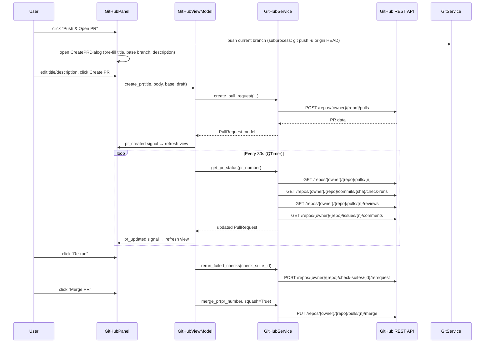
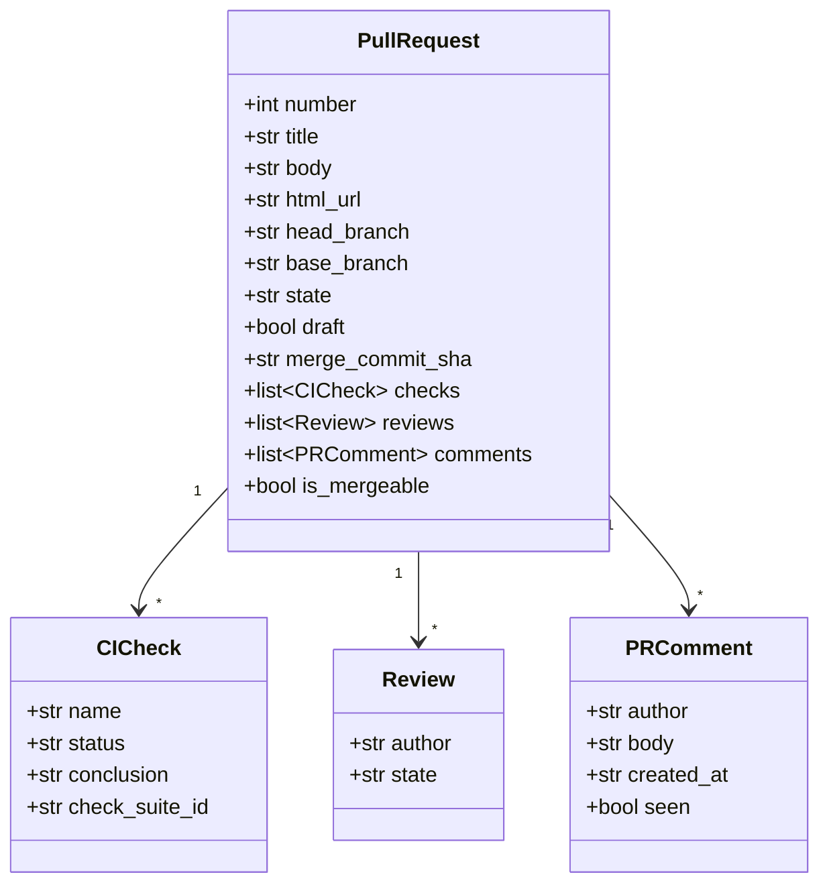

# GitHub Integration

## Overview

Adds a GitHub Pull Request panel to the worktree manager, giving you the full PR lifecycle without leaving the app: push a branch and open a PR with one click, monitor CI checks and review status in real time, copy/open the PR URL, re-run failed checks, see new comments, and merge with squash when it's green. A `GitHubService` wraps the GitHub REST API (authenticated with a PAT stored in config) and a `GitHubViewModel` drives a new "Pull Requests" sidebar panel.

---

## UI / Flow

The panel has two tabs: **My PRs** (list of all your open PRs — read-only monitor) and **Open PR** (push + create a new PR for the current branch). Tabs sit directly under the panel header. `[⚿ Token]` is always accessible in the top-right corner.

---

### Tab 1 — My PRs

#### My PRs — list, current branch has an open PR

```
┌──────────────────────┬──────────────────────────────────────────────────────────────────┐
│  📁  Projects        │  ⬡  Pull Requests          [🔔 On]  [↻ 30s]  [⚿ Token]          │
│  ⊞  Commands        │  [ My PRs ◀ ]  [ Open PR ]                                       │
│  ⇄  Diff            │──────────────────────────────────────────────────────────────────│
│  ⬡  Pull Requests ◀ │  #142  My Work                              ⏳ checks running     │
│  🌳  Worktrees       │  feature/my-work → main                         ← current branch │
│  🌿  Branches        │                                                                  │
│                      │  #138  Fix login timeout                    ✅ ready to merge    │
│                      │  fix/login-timeout → main                                        │
│                      │                                                                  │
│  ────────────────    │  #131  Refactor auth layer                  ❌ checks failed     │
│  ↻  Refresh          │  refactor/auth → main                                            │
│  ⚙  Settings         │                                                                  │
│  ◀  Hide             │                                                                  │
└──────────────────────┴──────────────────────────────────────────────────────────────────┘
```

#### My PRs — row selected (CI running)

Clicking a row replaces the list with that PR's detail. Back arrow returns to the list.

```
┌──────────────────────┬──────────────────────────────────────────────────────────────────┐
│  📁  Projects        │  ⬡  Pull Requests          [🔔 On]  [↻ 30s]  [⚿ Token]          │
│  ⊞  Commands        │  [ My PRs ◀ ]  [ Open PR ]                                       │
│  ⇄  Diff            │──────────────────────────────────────────────────────────────────│
│  ⬡  Pull Requests ◀ │  ← Back                                                          │
│  🌳  Worktrees       │  #142  My Work                    [⧉ Copy URL]  [↗ Open]         │
│  🌿  Branches        │  feature/my-work → main                                          │
│                      │──────────────────────────────────────────────────────────────────│
│                      │  CI Checks                                                       │
│                      │  ● build (ubuntu)              ⏳ running...                     │
│  ────────────────    │  ● lint                         ✅ passed                         │
│  ↻  Refresh          │  ● test (py3.12)                ✅ passed                         │
│  ⚙  Settings         │                                                                  │
│  ◀  Hide             │  Reviews                                                         │
│                      │  No reviews yet.                                                 │
│                      │                                                                  │
│                      │  Comments                                                        │
│                      │  No comments.                                                    │
│                      │──────────────────────────────────────────────────────────────────│
│                      │  ⏳ Checks running — not ready to merge                          │
└──────────────────────┴──────────────────────────────────────────────────────────────────┘
```

#### My PRs — row selected (CI failed)

```
┌──────────────────────┬──────────────────────────────────────────────────────────────────┐
│  📁  Projects        │  ⬡  Pull Requests          [🔔 On]  [↻ 30s]  [⚿ Token]          │
│  ⊞  Commands        │  [ My PRs ◀ ]  [ Open PR ]                                       │
│  ⇄  Diff            │──────────────────────────────────────────────────────────────────│
│  ⬡  Pull Requests ◀ │  ← Back                                                          │
│  🌳  Worktrees       │  #142  My Work                    [⧉ Copy URL]  [↗ Open]         │
│  🌿  Branches        │  feature/my-work → main                                          │
│                      │──────────────────────────────────────────────────────────────────│
│                      │  CI Checks                                         [↺ Re-run]    │
│                      │  ● build (ubuntu)              ❌ failed                          │
│  ────────────────    │  ● lint                         ✅ passed                         │
│  ↻  Refresh          │  ● test (py3.12)                ✅ passed                         │
│  ⚙  Settings         │                                                                  │
│  ◀  Hide             │  Reviews                                                         │
│                      │  No reviews yet.                                                 │
│                      │                                                                  │
│                      │  Comments                               🔴 2 new                 │
│                      │  alice: "Can you fix the timeout?"                               │
│                      │  bob: "Looks good otherwise"                                     │
│                      │──────────────────────────────────────────────────────────────────│
│                      │  ❌ Checks failed                                                │
└──────────────────────┴──────────────────────────────────────────────────────────────────┘
```

#### My PRs — row selected (ready to merge)

```
┌──────────────────────┬──────────────────────────────────────────────────────────────────┐
│  📁  Projects        │  ⬡  Pull Requests          [🔔 On]  [↻ 30s]  [⚿ Token]          │
│  ⊞  Commands        │  [ My PRs ◀ ]  [ Open PR ]                                       │
│  ⇄  Diff            │──────────────────────────────────────────────────────────────────│
│  ⬡  Pull Requests ◀ │  ← Back                                                          │
│  🌳  Worktrees       │  #142  My Work                    [⧉ Copy URL]  [↗ Open]         │
│  🌿  Branches        │  feature/my-work → main                                          │
│                      │──────────────────────────────────────────────────────────────────│
│                      │  CI Checks                                                       │
│                      │  ● build (ubuntu)              ✅ passed                          │
│  ────────────────    │  ● lint                         ✅ passed                         │
│  ↻  Refresh          │  ● test (py3.12)                ✅ passed                         │
│  ⚙  Settings         │                                                                  │
│  ◀  Hide             │  Reviews                                                         │
│                      │  ✅ alice approved                                                │
│                      │                                                                  │
│                      │  Comments                                                        │
│                      │  alice: "LGTM!"                                                  │
│                      │──────────────────────────────────────────────────────────────────│
│                      │  ✅ Ready to merge                                               │
│                      │  [✓] Squash and merge          [  Merge PR  ]                    │
└──────────────────────┴──────────────────────────────────────────────────────────────────┘
```

---

### Tab 2 — Open PR

#### Open PR — current branch has no PR yet

```
┌──────────────────────┬──────────────────────────────────────────────────────────────────┐
│  📁  Projects        │  ⬡  Pull Requests          [🔔 On]  [↻ 30s]  [⚿ Token]          │
│  ⊞  Commands        │  [ My PRs ]  [ Open PR ◀ ]                                       │
│  ⇄  Diff            │──────────────────────────────────────────────────────────────────│
│  ⬡  Pull Requests ◀ │  Current branch: feature/my-work                                 │
│  🌳  Worktrees       │                                                                  │
│  🌿  Branches        │  Title:                                                          │
│                      │  [My Work                                                      ] │
│                      │                                                                  │
│                      │  Base branch:                                                    │
│  ────────────────    │  [★ main (suggested)                                       ▼]   │
│  ↻  Refresh          │                                                                  │
│  ⚙  Settings         │  Description:                                                    │
│  ◀  Hide             │  ┌────────────────────────────────────────────────────────────┐  │
│                      │  │                                                            │  │
│                      │  │                                                            │  │
│                      │  └────────────────────────────────────────────────────────────┘  │
│                      │  [✓] Draft PR                                                    │
│                      │                                                                  │
│                      │  [  Push & Open PR  ]                                            │
└──────────────────────┴──────────────────────────────────────────────────────────────────┘
```

#### Open PR — current branch already has a PR

Tab still navigable; shows the existing PR summary and a link to view it in My PRs tab.

```
┌──────────────────────┬──────────────────────────────────────────────────────────────────┐
│  📁  Projects        │  ⬡  Pull Requests          [🔔 On]  [↻ 30s]  [⚿ Token]          │
│  ⊞  Commands        │  [ My PRs ]  [ Open PR ◀ ]                                       │
│  ⇄  Diff            │──────────────────────────────────────────────────────────────────│
│  ⬡  Pull Requests ◀ │  Current branch: feature/my-work                                 │
│  🌳  Worktrees       │                                                                  │
│  🌿  Branches        │  PR already open:                                                │
│                      │  #142  My Work  ⏳ checks running                                │
│                      │                                                                  │
│  ────────────────    │  [  View in My PRs  ]                                            │
│  ↻  Refresh          │                                                                  │
│  ⚙  Settings         │                                                                  │
│  ◀  Hide             │                                                                  │
└──────────────────────┴──────────────────────────────────────────────────────────────────┘
```

---

### Token states (any tab)

#### Token not configured (first visit)

Polling not yet started — no header controls shown.

```
┌──────────────────────┬──────────────────────────────────────────────────────────────────┐
│  📁  Projects        │  ⬡  Pull Requests                                                │
│  ⊞  Commands        │  [ My PRs ]  [ Open PR ]                                         │
│  ⇄  Diff            │──────────────────────────────────────────────────────────────────│
│  ⬡  Pull Requests ◀ │  GitHub token not configured.                                    │
│  🌳  Worktrees       │                                                                  │
│  🌿  Branches        │  [GitHub Personal Access Token ____________________________]     │
│                      │  Needs: repo, read:org scopes                                    │
│  ────────────────    │                                                                  │
│  ↻  Refresh          │  [  Save Token  ]                                                │
│  ⚙  Settings         │                                                                  │
│  ◀  Hide             │                                                                  │
└──────────────────────┴──────────────────────────────────────────────────────────────────┘
```

#### Token expired (API returned 401)

Polling stops on 401 — header controls hidden until token is saved.

```
┌──────────────────────┬──────────────────────────────────────────────────────────────────┐
│  📁  Projects        │  ⬡  Pull Requests                                                │
│  ⊞  Commands        │  [ My PRs ]  [ Open PR ]                                         │
│  ⇄  Diff            │──────────────────────────────────────────────────────────────────│
│  ⬡  Pull Requests ◀ │  ⚠ Token expired or invalid.                                    │
│  🌳  Worktrees       │                                                                  │
│  🌿  Branches        │  [GitHub Personal Access Token ____________________________]     │
│                      │  Needs: repo, read:org scopes                                    │
│  ────────────────    │                                                                  │
│  ↻  Refresh          │  [  Update Token  ]                                              │
│  ⚙  Settings         │                                                                  │
│  ◀  Hide             │                                                                  │
└──────────────────────┴──────────────────────────────────────────────────────────────────┘
```

#### Token rotation (inline dropdown from `[⚿ Token]` button)

Clicking `[⚿ Token]` when already configured drops a compact inline form above the tab content. Does not navigate away.

```
┌──────────────────────┬──────────────────────────────────────────────────────────────────┐
│  📁  Projects        │  ⬡  Pull Requests          [🔔 On]  [↻ 30s]  [⚿ Token ▲]        │
│  ⊞  Commands        │  [ My PRs ◀ ]  [ Open PR ]                                       │
│  ⇄  Diff            │  ┌──────────────────────────────────────────────────────────────┐ │
│  ⬡  Pull Requests ◀ │  │ [New token _____________________________]  [Save]  [Cancel] │ │
│  🌳  Worktrees       │  └──────────────────────────────────────────────────────────────┘ │
│  🌿  Branches        │──────────────────────────────────────────────────────────────────│
│                      │  #142  My Work                              ⏳ checks running     │
│                      │  feature/my-work → main                         ← current branch │
│                      │                                                                  │
│  ────────────────    │  #138  Fix login timeout                    ✅ ready to merge    │
│  ↻  Refresh          │  fix/login-timeout → main                                        │
│  ⚙  Settings         │                                                                  │
│  ◀  Hide             │                                                                  │
└──────────────────────┴──────────────────────────────────────────────────────────────────┘
```

---

### Settings dialog — GitHub polling interval

The existing Settings dialog gains a "GitHub polling interval" row (row 6, between Branch diff mode and the Cancel/Save buttons).

```
┌──────────────────────────────────────────────────────┐
│  Settings                                            │
│                                                      │
│  Stale threshold:   [14] days                        │
│  Shell:             [zsh              ▼]             │
│  Default editor:    [Cursor           ▼]             │
│  Branch diff mode:  [Merge base (default) ▼]         │
│  GitHub polling:    [30] seconds                     │
│                                                      │
│                          [Cancel]  [Save]            │
└──────────────────────────────────────────────────────┘
```

`[30]` is a `QSpinBox` (range 5–3600). Saving updates `ui.github_poll_interval_seconds` in config. The `[↻ Ns]` button label in the GitHub panel header reflects the new value on next panel open.

---

### Notifications

The polling loop runs whether or not the GitHub panel is visible. When a PR's state changes between polls, a macOS system notification fires (same `osascript` mechanism as the Command Center). A mute toggle in the panel header suppresses them.

#### macOS system notification (any panel open — fires in background)

```
┌──────────────────────────────────────┐
│  🔔  Pull Requests            now    │
│  ❌ "My Work" — build failed         │
└──────────────────────────────────────┘

┌──────────────────────────────────────┐
│  🔔  Pull Requests            now    │
│  💬 alice commented on "My Work"     │
└──────────────────────────────────────┘

┌──────────────────────────────────────┐
│  🔔  Pull Requests            now    │
│  ✅ alice approved "My Work"         │
└──────────────────────────────────────┘

┌──────────────────────────────────────┐
│  🔔  Pull Requests            now    │
│  ✅ "My Work" — all checks passed    │
└──────────────────────────────────────┘
```

#### Panel header — notifications mute toggle (mirrors Command Center)

```
┌──────────────────────┬──────────────────────────────────────────────────────────────────┐
│  📁  Projects        │  ⬡  Pull Requests          [🔔 On]  [↻ 30s]  [⚿ Token]          │
│  ⊞  Commands        │  [ My PRs ◀ ]  [ Open PR ]                                       │
│  ⇄  Diff            │──────────────────────────────────────────────────────────────────│
│  ⬡  Pull Requests ◀ │  ...                                                             │
└──────────────────────┴──────────────────────────────────────────────────────────────────┘

  — click [🔔 On] to mute —

┌──────────────────────┬──────────────────────────────────────────────────────────────────┐
│  📁  Projects        │  ⬡  Pull Requests         [🔕 Off]  [↻ 30s]  [⚿ Token]          │
│  ⊞  Commands        │  [ My PRs ◀ ]  [ Open PR ]                                       │
│  ⇄  Diff            │──────────────────────────────────────────────────────────────────│
│  ⬡  Pull Requests ◀ │  ...                                                             │
└──────────────────────┴──────────────────────────────────────────────────────────────────┘
```

#### My PRs list — unread comment badge

```
┌──────────────────────┬──────────────────────────────────────────────────────────────────┐
│  📁  Projects        │  ⬡  Pull Requests          [🔔 On]  [↻ 30s]  [⚿ Token]          │
│  ⊞  Commands        │  [ My PRs ◀ ]  [ Open PR ]                                       │
│  ⇄  Diff            │──────────────────────────────────────────────────────────────────│
│  ⬡  Pull Requests ◀ │  #142  My Work                    🔴 2 new  ❌ checks failed      │
│  🌳  Worktrees       │  feature/my-work → main                         ← current branch │
│  🌿  Branches        │                                                                  │
│                      │  #138  Fix login timeout                    ✅ ready to merge    │
│                      │  fix/login-timeout → main                                        │
│  ────────────────    │                                                                  │
│  ↻  Refresh          │                                                                  │
│  ⚙  Settings         │                                                                  │
│  ◀  Hide             │                                                                  │
└──────────────────────┴──────────────────────────────────────────────────────────────────┘
```

---

## Architecture

### New components

```
worktree_manager/
  github_service.py          # GitHub REST API calls (PAT auth, requests lib)
  github_models.py           # PullRequest, CICheck, Review, PRComment dataclasses
  github_vm.py               # GitHubViewModel — state, polling timer, signals
  ui/
    github_panel.py          # PR panel (new sidebar entry)
    create_pr_dialog.py      # Create PR modal
    token_setup_widget.py    # Inline token prompt (shown inside github_panel)
```

### Data flow



### Models



### Key existing files referenced

- [worktree_manager/git_service.py](worktree_manager/git_service.py) — `infer_branch_suggestions()` reused for base-branch suggestion
- [worktree_manager/diff_vm.py](worktree_manager/diff_vm.py) — `suggested_older_refs()` pattern mirrored in `GitHubViewModel`
- [worktree_manager/config_store.py](worktree_manager/config_store.py) — extended to store GitHub token and polling interval
- [worktree_manager/models.py](worktree_manager/models.py) — `RepoConfig` extended with `github_token` field
- [worktree_manager/ui/sidebar.py](worktree_manager/ui/sidebar.py) — `_TAB_DEFS` list extended with `"github"` entry
- [worktree_manager/cli.py](worktree_manager/cli.py) — `App._panel_cache` and `_set_panel()` pattern followed for new panel
- [worktree_manager/ui/diff_point_selector.py](worktree_manager/ui/diff_point_selector.py) — suggested-ref UI pattern mirrored in base-branch dropdown

### Auth & config

GitHub token stored in `~/.config/worktree-manager/config.json` under `ui.github_token`. Polling interval stored under `ui.github_poll_interval_seconds` (default 30). Remote org/repo auto-detected from `git remote get-url origin` at panel load time — no manual config needed (suggestion E).

The polling interval is configurable in the app's Settings dialog ([`worktree_manager/ui/settings_panel.py`](worktree_manager/ui/settings_panel.py) `SettingsDialog`) as a new "GitHub polling interval" numeric field (seconds). [`worktree_manager/config_store.py`](worktree_manager/config_store.py) gains `save_github_poll_interval(seconds: int)` alongside `get_github_poll_interval()`. The `[↻ Ns]` button in the panel header always reflects the current configured value; if the user changes it in Settings the label updates on next panel open.

PR description pre-filled from `.github/pull_request_template.md` in the repo root if it exists (suggestion G).

---

## Open Questions

None — all scope decisions resolved in conversation.

---

## Iteration Plan

### Iteration 0 — Walking Skeleton

**Delivers:** A "Pull Requests" sidebar entry opens a two-tab panel; token can be saved; the app detects the GitHub remote; My PRs tab fetches and lists your open PRs by title and status badge; clicking a PR row shows a detail view with CI checks, reviews, and comments; the Open PR tab shows the create-PR form pre-filled from branch name and suggested base branch, and submits a real PR to GitHub after pushing.

**Scope:**
- New files: `worktree_manager/github_service.py`, `worktree_manager/github_models.py`, `worktree_manager/github_vm.py`, `worktree_manager/ui/github_panel.py`
- Extend [`worktree_manager/ui/sidebar.py`](worktree_manager/ui/sidebar.py) `_TAB_DEFS` with `("github", "⬡  Pull Requests")` and add `on_github` callback
- Extend [`worktree_manager/cli.py`](worktree_manager/cli.py) with `_show_github_panel()` and wire into `App.__init__`
- Extend [`worktree_manager/config_store.py`](worktree_manager/config_store.py) with `get_github_token()` / `save_github_token()` / `get_github_poll_interval()`
- `GitHubService`: auto-detect remote from `git remote get-url origin`; `list_my_open_prs()`, `get_pr_detail()` (checks, reviews, comments), `push_branch()`, `create_pull_request()`
- `GitHubViewModel`: holds PR list, selected PR, token state; `QTimer` polling (default 30s); signals: `prs_updated`, `pr_detail_updated`, `token_state_changed`
- `GitHubPanel`: two-tab layout (`QTabWidget`); token-setup/expired state replaces tab content; My PRs list → detail navigation with explicit `← Back` button; PR list rows show `← current branch` label when the row matches the active branch; Open PR form with title, base branch dropdown (suggested via [`worktree_manager/git_service.py`](worktree_manager/git_service.py) `infer_branch_suggestions()`), description textarea, Draft checkbox, Push & Open PR button; `[⚿ Token]` inline dropdown in header; `[↻ 30s]` is a toggle button: clicking it pauses the polling loop and changes the label to `[⏸ 30s]`; clicking again resumes polling and restores `[↻ 30s]`; the interval value shown is always the configured `github_poll_interval_seconds`; the polling rate itself is config-file-only and not editable from the UI
- Pre-fill PR description from `.github/pull_request_template.md` if present
- "Open PR" tab shows existing-PR summary + "View in My PRs" button that switches to the My PRs tab when clicked
- Extend [`worktree_manager/ui/settings_panel.py`](worktree_manager/ui/settings_panel.py) `SettingsDialog` with a "GitHub polling interval" `QSpinBox` row (range 5–3600 seconds, default 30); extend [`worktree_manager/config_store.py`](worktree_manager/config_store.py) with `save_github_poll_interval(seconds: int)`; the `[↻ Ns]` header button label reads the configured value at panel open time

**Explicitly out of scope:**
- Copy URL button / Open in browser button (Iteration 1)
- Re-run CI button (Iteration 1)
- New-comment notification badge (Iteration 1)
- Merge PR button (Iteration 2)

---

### Iteration 1 — Actions, Notifications & Badges

**Delivers:** macOS system notifications fire when any of your open PRs has a meaningful status change (CI failed, CI passed, new comment, review approved/rejected) — even when the panel is not open. Copy URL, Open in browser, and Re-run CI are also added. Unread comment badge appears on list rows.

**Scope:**
- `[⧉ Copy URL]` button on PR detail — writes `html_url` to clipboard via `QClipboard`
- `[↗ Open]` button on PR detail — calls `QDesktopServices.openUrl()`
- `[↺ Re-run]` button on PR detail CI section — visible only when at least one check has `conclusion == "failure"`, hidden otherwise; calls `GitHubService.rerun_failed_checks(check_suite_id)` → `POST /check-suites/{id}/rerequest`
- `GitHubViewModel` compares each poll result against the previous snapshot and emits a `pr_event(pr_number, event_type, message)` signal for: `ci_failed`, `ci_passed`, `new_comment`, `review_approved`, `review_changes_requested`
- [`worktree_manager/cli.py`](worktree_manager/cli.py) `App` connects to `pr_event` signal and calls existing `_show_notification(title, body)` (same macOS `osascript` path used by Command Center) — fires regardless of which panel is visible
- `QApplication.alert(self, 0)` called alongside notification to flash the dock icon, mirroring Command Center behaviour
- Notification gated by a new `github_notifications_enabled` config pref (default `True`); toggle button in the `GitHubPanel` header (same pattern as Command Center's mute button in [`worktree_manager/ui/command_center_panel.py`](worktree_manager/ui/command_center_panel.py))
- Unread comment tracking: `PRComment.seen` flag; new comments since last poll show a `🔴 N new` badge on the list row alongside the existing status badge (both rendered on the same row simultaneously, e.g. `🔴 2 new  ❌ checks failed`); badge cleared when detail view is opened
- Extend [`worktree_manager/github_models.py`](worktree_manager/github_models.py) `PRComment` with `seen` field; `GitHubViewModel` tracks seen comment IDs in memory

**Notification events and messages:**

| Event | Title | Body |
|---|---|---|
| CI failed | Pull Requests | ❌ "My Work" — build failed |
| CI passed | Pull Requests | ✅ "My Work" — all checks passed |
| New comment | Pull Requests | 💬 alice commented on "My Work" |
| Review approved | Pull Requests | ✅ alice approved "My Work" |
| Changes requested | Pull Requests | 🔄 alice requested changes on "My Work" |

**Builds on:** Iteration 0

---

### Iteration 2 — Merge

**Delivers:** A "Merge PR" button with a "Squash and merge" checkbox (default on) appears on the PR detail view when the PR is approved and all checks pass; clicking it merges the PR via the GitHub API.

**Scope:**
- `GitHubService.merge_pr(pr_number, squash: bool)` → `PUT /repos/{owner}/{repo}/pulls/{n}/merge`
- `GitHubViewModel` computes `is_ready_to_merge`: all checks `success` and at least one review `APPROVED` and `mergeable` true
- Merge button + squash checkbox rendered at the bottom of the PR detail view, visible only when `is_ready_to_merge`
- On success: remove PR from list, switch My PRs tab to list view, show brief "Merged!" inline message; fire macOS notification "✅ 'My Work' merged"
- On failure (merge conflict, branch protection): show inline error message

**Builds on:** Iteration 1

---

## ✋ Manual Testing Gate — Iteration 0

> STOP. Do not proceed to Iteration 1 until every item below is checked off by the user.

- [ ] Launch the app — a "⬡  Pull Requests" entry appears in the sidebar
- [ ] Click "⬡  Pull Requests" — the panel opens showing the token-not-configured state with a PAT input field and "Save Token" button
- [ ] Enter a valid GitHub PAT and click "Save Token" — the panel switches to the two-tab My PRs / Open PR layout with `[↻ 30s]` and `[⚿ Token]` buttons in the header
- [ ] My PRs tab loads — your open PRs appear as rows showing title, `head → base`, and a CI status badge (⏳ / ✅ / ❌)
- [ ] The PR row for the currently checked-out branch shows a `← current branch` label
- [ ] Click a PR row — the detail view appears with CI check rows, Reviews section, and Comments section; a `← Back` button is visible
- [ ] Click `← Back` — returns to the PR list
- [ ] Wait ~30 seconds — the PR list refreshes automatically (status badges may update if CI state changed)
- [ ] Click `[↻ 30s]` — label changes to `[⏸ 30s]` and polling stops; click again — label returns to `[↻ 30s]` and polling resumes
- [ ] Click `[⚿ Token]` — an inline token input appears above the tabs; enter a new token and click Save — the dropdown closes
- [ ] Switch to the Open PR tab — shows "Current branch: <branch>" with pre-filled Title, a Base branch dropdown with a suggested branch, a Description textarea, and a Draft checkbox
- [ ] If `.github/pull_request_template.md` exists in the repo: the Description textarea is pre-filled with its contents
- [ ] Switch to Open PR tab on a branch that already has an open PR — shows "PR already open: #N  Title  <status>" and a "View in My PRs" button; clicking it switches to the My PRs tab
- [ ] Open Settings (⚙) — "GitHub polling:" spinbox is visible with the current interval (default 30); change it and Save — reopen the GitHub panel and confirm `[↻ Ns]` shows the new value
- [ ] Enter an invalid PAT (or let one expire) — the panel shows "⚠ Token expired or invalid." with an input and "Update Token" button; header controls are hidden

**How to confirm:** Run the app, perform each action above, and check off each item manually.
Reply "Iteration 0 confirmed" (or describe any failures) before I write the plan for Iteration 1.
