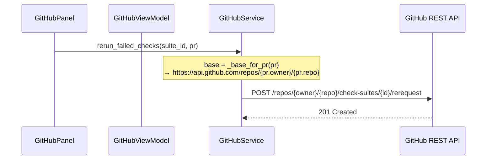
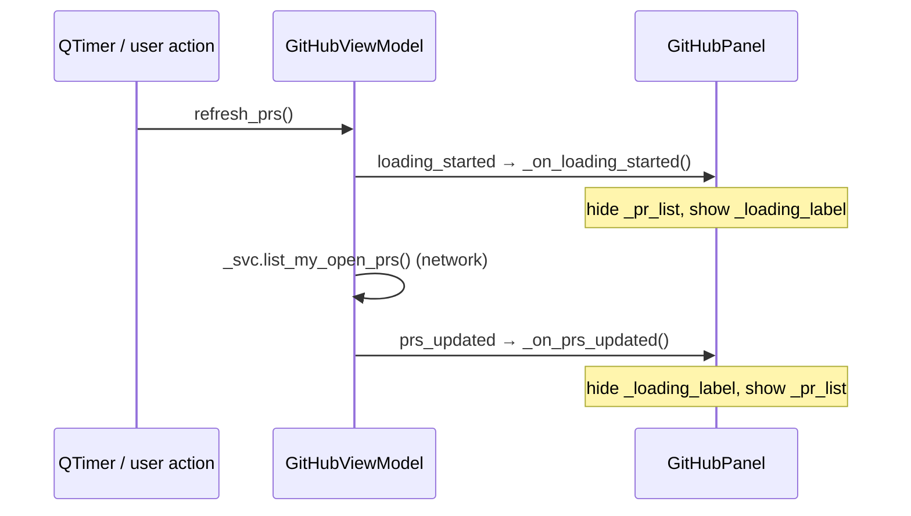

# GitHub Panel Fixes

## Overview

Three related fixes to the GitHub panel, plus a loading screen:

1. **Owner/repo stored on every PR** — `_pr_from_search_result` currently leaves `head_branch`, `base_branch`, `owner`, and `repo` empty. Every PR object should carry its owner and repo, parsed from `html_url` at construction time, so any downstream call can derive the correct API base URL without relying on `GitHubService.owner`/`.repo`.

2. **Empty owner/repo in API calls** — `GitHubService` uses `self._base` (e.g. `https://api.github.com/repos///`) for `rerun_failed_checks` and `create_pull_request`. These must derive owner/repo from the PR's `html_url` when `self.owner`/`self.repo` are empty. The existing `_base_for_pr` helper already does this for `get_pr_detail` — it should be applied everywhere.

3. **Re-run bug fix** — `rerun_failed_checks` takes a bare `check_suite_id` string and uses `self._base`, producing a 404 when owner/repo are empty. It must accept the `PullRequest` and use `_base_for_pr` to build the correct URL.

4. **Loading screen** — While `refresh_prs()` is in flight the My PRs list shows nothing. A `loading_started` signal should be emitted before the network call, showing a "⏳ Loading pull requests…" label and hiding the list; `prs_updated` and `refresh_error` hide the label again.

---

## UI / Flow

### My PRs — loading state

```
┌──────────────────────┬──────────────────────────────────────────────────────────────────┐
│  📁  Projects        │  ⬡  Pull Requests          [🔔 On]  [↻ 30s]  [⚿ Token]          │
│  ⊞  Commands        │  [ My PRs ◀ ]  [ Open PR ]                                       │
│  ⇄  Diff            │──────────────────────────────────────────────────────────────────│
│  ⬡  Pull Requests ◀ │                                                                  │
│  🌳  Worktrees       │          ⏳ Loading pull requests…                               │
│  🌿  Branches        │                                                                  │
└──────────────────────┴──────────────────────────────────────────────────────────────────┘
```

### My PRs — loaded (unchanged)

```
┌──────────────────────┬──────────────────────────────────────────────────────────────────┐
│  📁  Projects        │  ⬡  Pull Requests          [🔔 On]  [↻ 30s]  [⚿ Token]          │
│  ⊞  Commands        │  [ My PRs ◀ ]  [ Open PR ]                                       │
│  ⇄  Diff            │──────────────────────────────────────────────────────────────────│
│  ⬡  Pull Requests ◀ │  #142  My Work                              ⏳ checks running     │
│  🌳  Worktrees       │  feature/my-work → main                         ← current branch │
└──────────────────────┴──────────────────────────────────────────────────────────────────┘
```

---

## Architecture

### Changes to existing files

**[worktree_manager/github_models.py](worktree_manager/github_models.py)**
- Add `owner: str` and `repo: str` fields to `PullRequest` (default `""`).
- Add `__post_init__` that parses both from `html_url` using `urlparse` when they are empty — `https://github.com/{owner}/{repo}/pull/{n}`.

**[worktree_manager/github_service.py](worktree_manager/github_service.py)**
- `_pr_from_search_result`: The search API does not return `head`/`base` refs — these stay empty strings. `owner`/`repo` will be populated by `PullRequest.__post_init__` from `html_url`, so no extra code needed here.
- `_base_for_pr(pr)`: already exists and parses from `html_url` as fallback. No change needed.
- `rerun_failed_checks(check_suite_id, pr)`: change signature to accept `pr: PullRequest`; use `_base_for_pr(pr)` instead of `self._base`.
- `create_pull_request`: already uses `self._base` — valid because this always operates on the current configured repo. No change needed.

**[worktree_manager/ui/github_panel.py](worktree_manager/ui/github_panel.py)**
- Update the `_rerun_btn` click handler in `_on_pr_detail_updated` to pass the current `pr` to `rerun_failed_checks(suite_id, pr)`.
- Add `_loading_label` (centred QLabel, hidden by default) to the PR list page of `_my_prs_stack`.
- Connect `vm.loading_started` → `_on_loading_started`: show `_loading_label`, hide `_pr_list`.
- `_on_prs_updated`: hide `_loading_label`, show `_pr_list`.
- `_on_refresh_error`: hide `_loading_label`, show `_pr_list`.

**[worktree_manager/github_vm.py](worktree_manager/github_vm.py)**
- Add `loading_started = Signal()`.
- Emit `loading_started` at the top of `refresh_prs()` before the service call.

### Data flow — rerun fix



### Data flow — loading screen



---

## Open Questions

None.

---

## Iteration Plan

### Iteration 0 — Walking Skeleton

**Delivers:** PRs always carry their owner/repo; re-run no longer 404s; a loading label appears while fetching.

**Scope:**
- Add `owner: str` and `repo: str` fields with `__post_init__` parser to [`PullRequest`](worktree_manager/github_models.py) in `worktree_manager/github_models.py`
- Change [`rerun_failed_checks`](worktree_manager/github_service.py) in `worktree_manager/github_service.py` to accept `pr: PullRequest` and use `_base_for_pr(pr)` instead of `self._base`
- Update the `_rerun_btn` click handler in [`worktree_manager/ui/github_panel.py`](worktree_manager/ui/github_panel.py) to pass `pr` to `rerun_failed_checks`
- Add `loading_started = Signal()` to [`GitHubViewModel`](worktree_manager/github_vm.py) in `worktree_manager/github_vm.py`; emit at the top of `refresh_prs()`
- Add `_loading_label` to [`GitHubPanel`](worktree_manager/ui/github_panel.py) in `worktree_manager/ui/github_panel.py`; connect `vm.loading_started` → `_on_loading_started`; hide/show correctly in `_on_prs_updated` and `_on_refresh_error`

**Explicitly out of scope:**
- Animated spinners
- Loading state for PR detail fetch (`select_pr`)
- Loading state for Push & Open PR (already has inline button-text feedback)
- `create_pull_request` owner/repo fix (operates on current repo, always configured)

---

## ✋ Manual Testing Gate — Iteration 0

> STOP. Do not proceed until every item below is checked off.

- [ ] Open the PR panel — "⏳ Loading pull requests…" label appears briefly while the initial fetch runs, then disappears and the list renders
- [ ] Wait for the poll interval — the loading label reappears briefly on each poll cycle
- [ ] On a PR where at least one CI check has failed, click `[↺ Re-run]` — no 404 error; GitHub re-queues the check suite (confirm no crash in the terminal logs)
- [ ] Confirm the terminal log shows the correct URL: `https://api.github.com/repos/{owner}/{repo}/check-suites/…/rerequest` (not `repos///`)
- [ ] Regression: My PRs list still populates correctly after loading
- [ ] Regression: PR detail view still shows CI checks, reviews, and comments

**How to confirm:** Run the app, perform each action above, and check off each item manually.
Reply "Iteration 0 confirmed" (or describe any failures) before I write the plan for Iteration 1.
