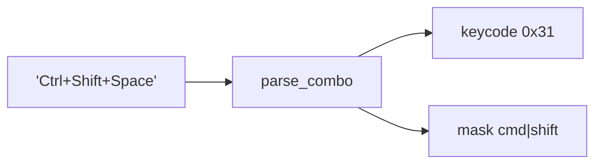
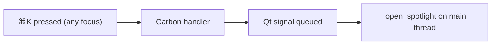

<!-- autobot-status
stage: 7
iteration: 0
gate: confirmed
updated: 2026-06-13
-->

# Autobot — Global, customizable Spotlight shortcut

Make the Spotlight overlay openable via a **global** keyboard shortcut (works even when the app is minimized or backgrounded) on macOS, and let the user **customize** that shortcut from the in-app Settings dialog. Falls back to the existing in-process (focused-only) shortcut when macOS Accessibility permission has not been granted, with a prompt that deep-links to System Settings.

## Decisions captured
- **Global impl:** to be decided during design (user asked to walk through tradeoffs).
- **Permission UX:** prompt + deep-link to System Settings Accessibility pane; in-focus fallback until granted.
- **Platform:** macOS for the global hotkey; in-process customizable shortcut stays cross-platform.

## Frontend Design

### Settings dialog — new "Spotlight shortcut" row (permission granted)
```
│  Spotlight shortcut: [  ⌘K            ]  [ Record ]        │
│                      Global ●  (works when minimized)      │
```

### Recording state
```
│  Spotlight shortcut: [  Press keys…   ]  [ Stop  ]        │
│                      Press a combo, or Esc to cancel       │
```
Captured combo (e.g. `⌘⇧Space`) is shown; persisted only on **Save**.

### Permission NOT granted (global disabled)
```
│  Spotlight shortcut: [  ⌘K            ]  [ Record ]        │
│                      Local only ⚠  — global needs          │
│                      Accessibility permission              │
│                                            [ Grant access ]│
```

### Permission prompt dialog
```
┌─────────────────────────────────────────────────────────┐
│  Enable global shortcut                                   │
│  To trigger Spotlight while minimized, macOS needs        │
│  Accessibility permission for this app.                   │
│  Until then, ⌘K only works when the app is focused.       │
│              [ Not now ]      [ Open System Settings ]    │
└─────────────────────────────────────────────────────────┘
```

### Invalid combo (inline validation)
```
│                      ⚠ Needs a modifier (⌘/⌥/⌃/⇧)         │
```
Bare keys with no modifier are rejected; previous valid value kept.

### Registration failure (Carbon returns non-noErr — no silent swallow)
```
│  Spotlight shortcut: [  ⌘⇧Space      ]  [ Record ]        │
│                      ⚠ Could not register globally         │
│                      (combo may be in use). Local only.    │
```
Carbon's status is surfaced; the in-process QShortcut still works. No permission dialog (Carbon hotkeys don't require Accessibility).

### Decisions
- Default shortcut stays `⌘K` (stored as `Ctrl+K` / `Meta+K` Qt sequence).
- New shortcut applies **immediately on Save** (re-register global hotkey, no restart).
- Status line + dot (Global ● / Local only ⚠) is sufficient.

## Backend Design

### Decision: Carbon `RegisterEventHotKey` (no Accessibility permission)
Verified on this machine (2026-06-13): `RegisterEventHotKey`, `InstallEventHandler`, `UnregisterEventHotKey` all return `noErr` with no permission prompt. A registered Carbon hotkey is OS-owned and does **not** require Accessibility (unlike a pynput key tap). Permission dialog / "Grant access" UI is **dropped**; only a registration-failure surface remains.

### Concept 1 — Shortcut persistence (ConfigStore)
Store the combo as a Qt-portable sequence string under `ui.spotlight_shortcut`. Default `"Ctrl+K"` (Qt maps `Ctrl`→⌘ on macOS).
```
get_spotlight_shortcut() -> str        # default "Ctrl+K"
set_spotlight_shortcut(seq: str)       # set_ui_pref("spotlight_shortcut", seq)
```
Follows the existing `get_ui_pref`/`set_ui_pref` pattern in [config_store.py](worktree-manager/worktree_manager/config_store.py).

### Concept 2 — Combo translation (Qt sequence → Carbon keycode + modifier mask)
A pure function maps a `QKeySequence`-style string to `(carbon_keycode, carbon_modifier_mask)`.
```
parse_combo(seq: str) -> (keycode:int, modmask:int)
    split on '+'
    modifiers → mask:  Cmd/Meta→cmdKey(0x100), Shift→shiftKey(0x200),
                        Alt/Option→optionKey(0x800), Ctrl→controlKey(0x1000)
    key char → kVK_* keycode via a static ANSI keycode table (A=0x00…K=0x28, Space=0x31, etc.)
    raise ValueError if no modifier present, or key not in table  (no silent except)
```
This is the only fiddly part; it's pure and fully unit-testable with no Qt/Carbon.



### Concept 3 — GlobalHotkey (Carbon binding, macOS only)
A small class wrapping the ctypes calls. Holds the installed handler + current registration; re-registration is unregister-then-register.
```
class GlobalHotkey:
    register(keycode, modmask) -> bool      # True on noErr; False surfaces to UI
    unregister()
    set_callback(fn)                        # fn invoked (on Qt thread) when hotkey fires
```
The Carbon C-callback runs on the app event target; it emits a Qt signal so the actual `_open_spotlight()` runs on the Qt main thread (queued connection). On non-macOS, `register()` is a no-op returning `False` (caller keeps the in-process QShortcut).



### Concept 4 — Wiring in MainWindow
[_setup_spotlight](worktree-manager/worktree_manager/cli.py#L116) keeps the existing `QShortcut` (in-focus path, also the non-macOS path) AND, on macOS, creates a `GlobalHotkey`, parses the stored combo, registers it, and routes its callback to `_open_spotlight`. A new `apply_spotlight_shortcut(seq)` re-reads the combo, rebinds the QShortcut's `QKeySequence`, and re-registers the Carbon hotkey — called immediately when Settings saves a new combo.

### Concept 5 — Settings dialog integration
[SettingsDialog](worktree-manager/worktree_manager/ui/settings_panel.py) gains a shortcut row: a read-only display field, a Record button (captures the next modifier+key via a key event filter), inline validation (reject bare keys), and on Save: persist via `set_spotlight_shortcut` then call back into the window's `apply_spotlight_shortcut`. Registration failure flips the status line to the "Local only" warning.

## Iteration Plan

- Iteration 0 — Customizable, global Spotlight shortcut

### Iteration 0 — Customizable, global Spotlight shortcut
**Context file:** [Iteration 0 context](autobot-global-spotlight-shortcut-ctx-iter-0-customizable-global-shortcut-2026-06-13.md)

## ✋ Manual Testing Gate — Iteration 0

> STOP. Do not proceed until every item is confirmed.

- [x] Open Settings; the "Spotlight shortcut" row shows the current combo (⌘K by default) with a Record button and a "Global ●" status line.
- [x] Click Record, press a new combo (e.g. ⌘⇧Space); the field updates to show it. Press Esc while recording cancels and keeps the old value.
- [x] Record a bare key with no modifier (e.g. just "A"); it is rejected with "⚠ Needs a modifier" and the old value is kept.
- [x] Save the new combo, then press it **while the app is focused** — Spotlight opens. (Regression: the old combo no longer opens it.)
- [x] Minimize / background the app, press the saved combo — Spotlight opens and the app comes forward. (Core global behavior.)
- [x] Restart the app — the saved combo persists and still works (focused and global).
- [x] If registration fails (e.g. a combo already owned by the OS like ⌘Space), the status line shows "⚠ Could not register globally … Local only" and the in-focus shortcut still works.

**Confirmed by user:** 2026-06-13
**How to confirm:** Check every box, then reply "Iteration 0 confirmed" or describe what failed.

### Implementation Ledger — Iteration 0
- `test_default_spotlight_shortcut_is_ctrl_k`: red → green ✓
- `test_saved_spotlight_shortcut_round_trips`: red → green ✓
- `test_parse_combo_maps_cmd_k`: red → green ✓
- `test_parse_combo_maps_multiple_modifiers`: red → green ✓
- `test_parse_combo_rejects_bare_key`: red → green ✓
- `test_parse_combo_rejects_unknown_key`: red → green ✓
- `test_global_hotkey_register_returns_false_off_macos`: red → green ✓
- `test_global_hotkey_register_succeeds_on_macos`: red → green ✓
- `test_settings_dialog_shows_current_shortcut`: red → green ✓
- `test_settings_dialog_rejects_bare_key_capture`: red → green ✓
- `test_saving_new_shortcut_persists_and_calls_apply`: red → green ✓
- `test_apply_spotlight_shortcut_rebinds_qshortcut`: red → green ✓

Full suite: 1901 passed, 0 failed.
