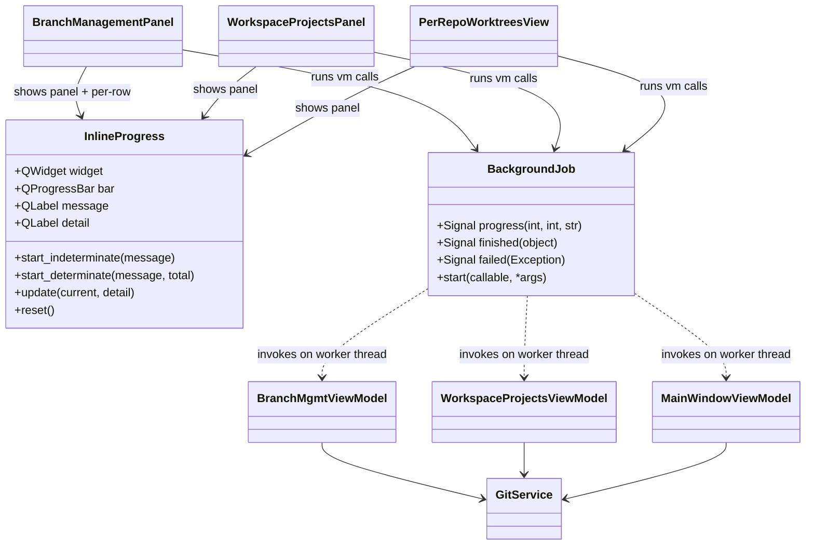
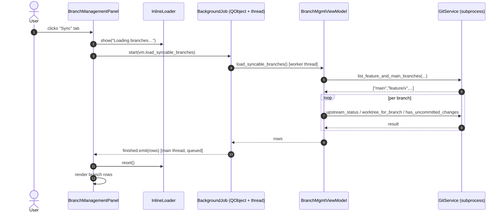

# Loading Screens / UX Polish

## Overview
Today the worktree-manager UI (PySide6) calls `git` and filesystem operations synchronously on the main thread from button handlers and panel refreshes. When the user clicks "Fetch all", opens the Sync panel, opens the Workspace Projects panel, or switches to the Cleanup tab, the window freezes for one to many seconds — no spinner, no disabled controls, just an unresponsive UI. This feature introduces a consistent inline loading pattern (spinner + status text + disabled controls) for every known git / workspace-scan hotspot so the app feels responsive even when underlying work is slow.

This work is **scoped to the worktree-manager subproject** ([worktree-manager/](worktree-manager/)). `diffselector/` and `test_app/` are out of scope. Only **git operations** (fetch, branch list, upstream status, dirty checks) and **workspace/project scanning** (per-entry branch lookups) are in scope — command execution and editor launches are deliberately deferred.

## Hotspot audit

The following call sites currently block the UI thread:

| # | Panel / Action | Entry point | Underlying blocking work |
|---|---|---|---|
| 1 | Sync panel — initial render | [_render_sync_rows](worktree-manager/worktree_manager/ui/branch_management_panel.py#L166) → [load_syncable_branches](worktree-manager/worktree_manager/branch_mgmt_vm.py#L103) | per repo: `git branch`; per branch: `git rev-list ahead/behind`, `git worktree list`, `git status --porcelain` |
| 2 | Sync panel — "↻ Fetch all" | [_trigger_fetch_all](worktree-manager/worktree_manager/ui/branch_management_panel.py#L240) → [fetch_all](worktree-manager/worktree_manager/branch_mgmt_vm.py#L129) | per repo: `git fetch origin` (network) |
| 3 | Sync panel — "⏬ Sync all" | [_trigger_sync_all](worktree-manager/worktree_manager/ui/branch_management_panel.py#L249) → [sync_included](worktree-manager/worktree_manager/branch_mgmt_vm.py#L155) | per repo: `git fetch`; per branch: `git status`, `git pull --ff-only` or `git fetch origin ref:ref` |
| 4 | Sync panel — single row "Sync" | [_trigger_sync_one](worktree-manager/worktree_manager/ui/branch_management_panel.py#L255) → [sync_one](worktree-manager/worktree_manager/branch_mgmt_vm.py#L136) | `git fetch` + `git status` + `git pull --ff-only` |
| 5 | Cleanup panel (embedded) — initial render | [_load_and_render](worktree-manager/worktree_manager/ui/branch_management_panel.py#L396) → [load_cleanup_candidates](worktree-manager/worktree_manager/branch_mgmt_vm.py#L56) → per repo: [all_cleanup_candidates](worktree-manager/worktree_manager/main_window_vm.py#L91) | per repo: `git branch`, `git branch --merged` × targets, `git log -1` per branch, `git status` per worktree |
| 6 | Workspace Projects panel — render | [_add_entry_row](worktree-manager/worktree_manager/ui/workspace_projects_panel.py#L142) → [checked_out_branch](worktree-manager/worktree_manager/git_service.py#L112) + [list_branches_for_worktree](worktree-manager/worktree_manager/workspace_projects_vm.py#L108) | per entry: `git rev-parse HEAD` + `git rev-parse --show-toplevel` + `git branch` |
| 7 | Per-repo worktrees view — refresh | [refresh](worktree-manager/worktree_manager/ui/per_repo_worktrees_view.py#L96) → [load_worktrees](worktree-manager/worktree_manager/main_window_vm.py#L20) + [list_branches_with_checkout_status](worktree-manager/worktree_manager/main_window_vm.py#L179) + per-row [has_uncommitted_changes](worktree-manager/worktree_manager/main_window_vm.py#L45) | `git worktree list` + per-worktree `git log -1` + `git branch --merged main` + `git branch` + per-row `git status` |

The standalone modal **Cleanup Wizard** ([cleanup_wizard.py](worktree-manager/worktree_manager/ui/cleanup_wizard.py)) is **already** async — it uses a `_CleanupLoadBridge` ([cli.py:34](worktree-manager/worktree_manager/cli.py#L34)) + `threading.Thread` ([cli.py:780](worktree-manager/worktree_manager/cli.py#L780)) — so it is the model for the rest of the work, not a target.

## UI / Flow

The loading indicator is always **inline** — it replaces the content area (or status cell) of whatever was about to render. Surrounding chrome (sidebar, tabs) stays visible; action buttons that would trigger more blocking work are **disabled** for the duration. No full-window modal overlay.

Every loader uses a `QProgressBar`. Where the underlying work iterates a known set (branches, repos, project entries) we run the bar in **determinate** mode and update it as items complete; for opaque blocking calls (`git fetch origin`, single-row sync) we use **indeterminate** mode (`setRange(0, 0)`) which Qt renders as a continuously animated marquee stripe — no GIFs, no Unicode fakery, native Qt animation.

| Hotspot | Bar mode | Reason |
|---|---|---|
| Sync panel render (`load_syncable_branches`) | determinate | iterates repos × branches; can emit progress |
| "↻ Fetch all" (toolbar) | determinate | iterates repos; can emit per-repo progress |
| "⏬ Sync all" (toolbar) | determinate | iterates included branches; can emit per-branch progress |
| Single-row "Sync" | indeterminate | one opaque `git fetch`+`pull` per click |
| Cleanup panel render | determinate | per-repo `all_cleanup_candidates` already supports `on_progress` ([main_window_vm.py:91](worktree-manager/worktree_manager/main_window_vm.py#L91)) |
| Workspace Projects render | determinate | iterates project entries; can emit per-entry progress |
| Per-repo worktrees refresh | determinate | iterates worktrees for dirty-check progress |

### Panel-level loading — determinate

```
┌─ Sync from origin ──────────── [↻ Fetch all] [⏬ Sync all] ─┐
│                                                              │
│                                                              │
│           Loading branches…   (4 / 12)                       │
│           feature/billing-redesign                           │
│           ████████████░░░░░░░░░░░░░░░░░░░  33 %              │
│                                                              │
│                                                              │
│ Last fetch: never                                            │
└──────────────────────────────────────────────────────────────┘
```
*Toolbar buttons remain visible but disabled. Status line shows the current item.*

### Panel-level loading — indeterminate

```
┌─ Workspace Projects ─────────────────────────────────┐
│                                                      │
│           Loading project entries…                   │
│           ▒▒▒▒████▒▒▒▒▒▒▒▒▒▒▒▒▒▒▒▒▒▒▒▒▒▒            │
│              ↑ marquee stripe slides L→R             │
│                                                      │
└──────────────────────────────────────────────────────┘
```
*Qt's built-in marquee animation runs continuously until `finished` fires.*

### Action-level loading — per-row sync

The clicked row's status cell shows a mini indeterminate bar; only the clicked button is disabled, other rows stay interactive:

```
┌─ Sync from origin ────────────── [↻ Fetch all] [⏬ Sync all] ─┐
│ ▼ repo-a                                                       │
│   ☐ main          ▒▒██▒▒▒▒▒▒  syncing…                         │
│   ☐ feature/foo   3 behind                       [Sync]        │
│ ▼ repo-b                                                       │
│   ☐ main          up to date                     [Sync]        │
│   ☐ feature/bar   up to date                     [Sync]        │
└────────────────────────────────────────────────────────────────┘
```

### Action-level loading — toolbar "Fetch all" (determinate, repo-by-repo)

```
┌─ Sync from origin ──── [▒▒██▒▒▒▒▒▒ Fetching repo-b… 2/4] ─┐
│ ▼ repo-a                                                   │
│   ☐ main          up to date                     [Sync]    │
│ ▼ repo-b                                                   │
│   ☐ main          3 behind                       [Sync]    │
└────────────────────────────────────────────────────────────┘
```
*Toolbar button itself is replaced by a mini progress bar + count while the operation runs. Both "Fetch all" and "Sync all" are disabled until completion.*

### Projects panel — initial render

```
┌─ Workspace Projects ─────────────────────────────────┐
│         Loading project entries…  (3 / 7)            │
│         repo-b-wt                                    │
│         ████████████░░░░░░░░░░░░░░░░░░░  43 %        │
└──────────────────────────────────────────────────────┘
```

After load (unchanged from today):

```
┌─ Workspace Projects ─────────────────────────────────┐
│ ▼ my-project                            [Open][Edit] │
│     repo-a-wt   [ main           ▾ ]                 │
│     repo-b-wt   [ feature/x      ▾ ]                 │
└──────────────────────────────────────────────────────┘
```

### Empty state (unchanged)

```
┌─ Workspace Projects ─────────────────────────────────┐
│                                                      │
│                  No projects yet.                    │
│              Click [+ New] to create one.            │
│                                                      │
└──────────────────────────────────────────────────────┘
```

### Error state (when background work raises)

```
┌─ Sync from origin ──────────────────────────────────┐
│  ⚠ Couldn't load branches.                          │
│    git: fatal: not a git repository                 │
│                                                     │
│                       [ Retry ]                     │
└─────────────────────────────────────────────────────┘
```

## Architecture

We introduce one small reusable widget — `InlineProgress` — and one small reusable helper — `BackgroundJob` — that together give every panel the same three-state pattern (loading → loaded | error) without each panel inventing its own threading code. Existing services are **not changed**. VMs get optional `on_progress` callback parameters added to a handful of batch methods so determinate bars can show real counts; the existing pattern from [main_window_vm.py:91](worktree-manager/worktree_manager/main_window_vm.py#L91) is the template. The UI layer becomes responsible for calling VMs off-thread.



### Sequence — typical panel load



### `InlineProgress` (new — `worktree-manager/worktree_manager/ui/inline_progress.py`)

A `QWidget` that lays out, vertically centred:
- a `QLabel` for the headline message (e.g. "Loading branches…")
- a `QLabel` for the current item detail (e.g. "feature/billing-redesign") — hidden in indeterminate mode
- a `QProgressBar`

API:
- `start_indeterminate(message: str)` — sets the message and calls `bar.setRange(0, 0)` so Qt animates the marquee stripe natively
- `start_determinate(message: str, total: int)` — `bar.setRange(0, total)` and `bar.setValue(0)`
- `update(current: int, detail: str)` — sets `bar.setValue(current)` and the detail label; safe to call only on the UI thread (`BackgroundJob.progress` ensures this)
- `reset()` — clears everything; the widget is then discarded by its parent

A second compact variant — `InlineProgress.mini()` factory — returns a horizontal layout (label + thin `QProgressBar`, fixed height ~14 px) used for per-row sync and toolbar Fetch/Sync-all status.

No GIFs, no external assets — Qt's built-in `QProgressBar` marquee animation provides the motion in indeterminate mode.

### `BackgroundJob` (new — `worktree-manager/worktree_manager/ui/background_job.py`)

A `QObject` subclass exposing three signals: `progress(int, int, str)` (current, total, detail), `finished(object)`, `failed(Exception)`. Its `start(fn, *args, **kwargs)` method spawns a `threading.Thread(daemon=True)` that calls `fn(*args, **kwargs)`. If the callee accepts an `on_progress` kwarg, `BackgroundJob` injects a callback that re-emits via the `progress` signal — so the worker thread's progress callbacks reach the UI thread through Qt's queued-connection delivery and can safely touch widgets. On return the worker emits `finished` with the return value (or `failed` with the exception).

This mirrors the existing `_CleanupLoadBridge` pattern ([cli.py:34](worktree-manager/worktree_manager/cli.py#L34)) but is generic, supports progress, and lives in `ui/` for reuse.

### VM additions for determinate progress

Three batch methods need an optional `on_progress(current, total, label)` parameter (matching the signature already used by [all_cleanup_candidates](worktree-manager/worktree_manager/main_window_vm.py#L91)):

- [BranchMgmtViewModel.load_syncable_branches](worktree-manager/worktree_manager/branch_mgmt_vm.py#L103) — emits per branch
- [BranchMgmtViewModel.fetch_all](worktree-manager/worktree_manager/branch_mgmt_vm.py#L129) — emits per repo
- [BranchMgmtViewModel.sync_included](worktree-manager/worktree_manager/branch_mgmt_vm.py#L155) — emits per branch
- [BranchMgmtViewModel.load_cleanup_candidates](worktree-manager/worktree_manager/branch_mgmt_vm.py#L56) — emits per repo, passes through to the per-repo `on_progress` already there

The Workspace Projects per-entry lookup currently lives in the panel itself ([_add_entry_row](worktree-manager/worktree_manager/ui/workspace_projects_panel.py#L142)); we lift it into a new `WorkspaceProjectsViewModel.load_project_entries(projects, on_progress=None) -> list[EntryStatus]` so it can run off-thread with progress.

The Per-repo worktrees view's `refresh` currently calls [load_worktrees](worktree-manager/worktree_manager/main_window_vm.py#L20) + [list_branches_with_checkout_status](worktree-manager/worktree_manager/main_window_vm.py#L179) + per-row `has_uncommitted_changes`; we add `MainWindowViewModel.load_worktree_view_data(on_progress=None) -> WorktreeViewData` that bundles the work and emits per-worktree progress.

### Per-panel wiring

Each in-scope panel keeps its current synchronous "render rows" code; we wrap entry points in a small `_run_async` method that:

1. clears the content area
2. inserts an `InlineLoader` with a panel-specific message
3. disables action buttons that would trigger more work
4. constructs a `BackgroundJob`, connects `finished` / `failed`, then `start`s it
5. on `finished`: removes the loader, re-enables buttons, calls the existing render code
6. on `failed`: removes the loader, shows the inline error widget with a Retry button

For per-row actions in the Sync panel (single-row Sync, Fetch all, Sync all) the loader is swapped into the **status cell** of the affected row(s) rather than the whole panel, and only the affected button(s) are disabled.

## Open Questions

(none — all clarified up-front: PySide6 worktree-manager only; inline progress bar (animated, determinate where counts exist); git ops + workspace scanning; audit-first approach.)

## Iteration Plan

### Iteration 0 — Walking Skeleton
**Delivers:** Opening the Sync from origin tab shows an animated determinate progress bar ("Loading branches… 4 / 12 — feature/x") that fills as each branch is scanned, then renders the existing branch list. The two reusable helpers (`InlineProgress`, `BackgroundJob`) exist and are exercised end-to-end through this one panel.

**Scope:**
- New `InlineProgress` widget at `worktree-manager/worktree_manager/ui/inline_progress.py` (full-panel variant with `start_indeterminate` + `start_determinate` + `update` + `reset` — `mini()` factory deferred to Iteration 1).
- New `BackgroundJob` helper at `worktree-manager/worktree_manager/ui/background_job.py` (signals: `progress`, `finished`, `failed`; injects `on_progress` kwarg when the callee accepts one).
- Add `on_progress` parameter to [BranchMgmtViewModel.load_syncable_branches](worktree-manager/worktree_manager/branch_mgmt_vm.py#L103) — emit per branch with branch label.
- Rewire [_render_sync_rows](worktree-manager/worktree_manager/ui/branch_management_panel.py#L166) (and the part of [_build_sync_ui](worktree-manager/worktree_manager/ui/branch_management_panel.py#L128) that triggers it) to: clear content → show `InlineProgress` (determinate) → run via `BackgroundJob` → on `finished`, swap to the existing row rendering.
- Disable the toolbar "↻ Fetch all" and "⏬ Sync all" buttons while the load is in flight; re-enable on `finished`/`failed`.
- Show the inline error widget (message + Retry button) on `failed`.

**Explicitly out of scope:**
- Toolbar action loading (Fetch all / Sync all / single-row Sync) — Iteration 1.
- The `InlineProgress.mini()` factory variant.
- Cleanup panel, Workspace Projects panel, Per-repo worktrees view.

### Iteration 1 — Sync Panel Actions
**Delivers:** Every action on the Sync panel (Fetch all, Sync all, single-row Sync) shows live progress while it runs; toolbar buttons morph into mini bars with per-repo / per-branch labels; per-row Sync shows a mini indeterminate marquee in the row's status cell. UI never freezes during any sync action.

**Scope:**
- Add `InlineProgress.mini()` factory — compact horizontal layout (label + thin `QProgressBar`).
- Add `on_progress` to [BranchMgmtViewModel.fetch_all](worktree-manager/worktree_manager/branch_mgmt_vm.py#L129) (per repo) and [BranchMgmtViewModel.sync_included](worktree-manager/worktree_manager/branch_mgmt_vm.py#L155) (per branch).
- Rewire [_trigger_fetch_all](worktree-manager/worktree_manager/ui/branch_management_panel.py#L240), [_trigger_sync_all](worktree-manager/worktree_manager/ui/branch_management_panel.py#L249), [_trigger_sync_one](worktree-manager/worktree_manager/ui/branch_management_panel.py#L255) to use `BackgroundJob`.
- Toolbar Fetch all / Sync all: replace the button with a `InlineProgress.mini()` during the run (determinate); disable the sibling button.
- Single-row Sync: replace the row's status cell with `InlineProgress.mini()` (indeterminate) and disable that row's Sync button; other rows remain interactive.

**Builds on:** Iteration 0 (`InlineProgress`, `BackgroundJob`).

### Iteration 2 — Cleanup Panel
**Delivers:** Switching to the Cleanup tab (or changing the repo dropdown) shows an animated determinate progress bar with the same look-and-feel as Sync, then renders the candidate list. Pass-through progress from per-repo `all_cleanup_candidates` already-supported callback drives the bar.

**Scope:**
- Add `on_progress` to [BranchMgmtViewModel.load_cleanup_candidates](worktree-manager/worktree_manager/branch_mgmt_vm.py#L56) — passes through to the existing per-repo [all_cleanup_candidates(on_progress)](worktree-manager/worktree_manager/main_window_vm.py#L91) and aggregates current/total across repos.
- Rewire [_load_and_render](worktree-manager/worktree_manager/ui/branch_management_panel.py#L396) to: clear list → show `InlineProgress` (determinate) → run via `BackgroundJob` → render on `finished`.
- Disable Delete / Select All / Cancel buttons while loading.

**Builds on:** Iterations 0–1.

### Iteration 3 — Workspace Projects & Per-Repo Worktrees
**Delivers:** Opening the Workspace Projects panel shows a determinate progress bar while per-entry branch info is fetched (no more per-row freezes); the Per-repo worktrees view shows the same pattern when refreshing.

**Scope:**
- New VM method `WorkspaceProjectsViewModel.load_project_entries(projects, on_progress=None) -> list[EntryStatus]` that batches the per-entry `checked_out_branch` + `list_branches_for_worktree` calls currently inlined in [_add_entry_row](worktree-manager/worktree_manager/ui/workspace_projects_panel.py#L142).
- Rewire [refresh](worktree-manager/worktree_manager/ui/workspace_projects_panel.py#L71) to: show `InlineProgress` → run new VM method via `BackgroundJob` → on `finished`, render rows from the precomputed `EntryStatus` list (no further git calls).
- New VM method `MainWindowViewModel.load_worktree_view_data(on_progress=None) -> WorktreeViewData` bundling [load_worktrees](worktree-manager/worktree_manager/main_window_vm.py#L20), [list_branches_with_checkout_status](worktree-manager/worktree_manager/main_window_vm.py#L179), and per-worktree dirty checks (via `ThreadPoolExecutor`, mirroring the existing pattern at [main_window_vm.py:119](worktree-manager/worktree_manager/main_window_vm.py#L119)).
- Rewire [PerRepoWorktreesView.refresh](worktree-manager/worktree_manager/ui/per_repo_worktrees_view.py#L96) to use `InlineProgress` + `BackgroundJob` + the new bundle method.

**Builds on:** Iterations 0–2.

## ✋ Manual Testing Gate — Iteration 0

> STOP. Do not proceed to Iteration 1 until every item below is checked off by the user.

- [ ] Launch the app (`python3.14 -m worktree_manager` or `python3.14 run.py`), navigate to the Branch Management panel, and click the "Sync from origin" tab — confirm a progress bar appears immediately (not a frozen blank panel) while branches load.
- [ ] Watch the progress bar label update with the current branch name and the counter (e.g. "4 / 12") as scanning proceeds, and confirm the bar fills left-to-right.
- [ ] After scanning completes, confirm the progress bar disappears and the branch list renders correctly (rows per repo, ahead/behind badges, Sync buttons).
- [ ] Confirm the "↻ Fetch all" and "⏬ Sync all" toolbar buttons are visibly disabled/greyed out during the load, and re-enable once the list appears.
- [ ] Navigate away to another panel and back to "Sync from origin" — confirm the progress bar appears again for the fresh load (not a stale cached view).
- [ ] If you have a repo path configured that no longer exists or is unreachable, confirm an error message and a Retry button appear instead of a crash or blank panel.

**How to confirm:** Run the app, perform each action above, and check off each item manually.
Reply "Iteration 0 confirmed" (or describe any failures) before I write the plan for Iteration 1.

## Iteration 1 — Sync Panel Actions

### Phase 1.1 — InlineProgress.mini() factory
**What it covers:** Compact horizontal progress widget (label + thin bar) usable inside rows and toolbars.

**Files touched:**
- [worktree_manager/ui/inline_progress.py](worktree-manager/worktree_manager/ui/inline_progress.py) — added `mini()` static factory returning an `InlineProgress` configured with a horizontal `QHBoxLayout`

### Phase 1.2 — on_progress for fetch_all and sync_included
**What it covers:** Both VM methods now accept an optional `on_progress(current, total, label)` callback so the panel can show determinate progress.

**Files touched:**
- [worktree_manager/branch_mgmt_vm.py](worktree-manager/worktree_manager/branch_mgmt_vm.py) — `fetch_all(on_progress=None)` emits per-repo; `sync_included(on_progress=None)` emits per-branch

### Phase 1.3 — Async toolbar actions and per-row Sync
**What it covers:** All three action triggers (`_trigger_fetch_all`, `_trigger_sync_all`, `_trigger_sync_one`) now run via `BackgroundJob`. Both toolbar buttons are disabled while any action is in flight. Per-row Sync shows a mini indeterminate bar in the status cell and re-enables when done.

**Files touched:**
- [worktree_manager/ui/branch_management_panel.py](worktree-manager/worktree_manager/ui/branch_management_panel.py) — added `_action_running` state; rewired all three triggers; added `_on_fetch_done`, `_on_sync_all_done`, `_on_sync_one_done`, `_on_action_error` handlers; stores per-row buttons in `_sync_row_btns`

## ✋ Manual Testing Gate — Iteration 1

> STOP. Do not proceed to Iteration 2 until every item below is checked off by the user.

- [ ] Open the app, navigate to Branch Management → "Sync from origin" tab and confirm branches load with the progress bar as before (regression: Iteration 0 behaviour intact).
- [ ] Click "↻ Fetch all" — confirm both "Fetch all" and "Sync all" buttons immediately grey out while the fetch runs, then re-enable when done.
- [ ] After "Fetch all" completes, confirm the "Last fetch: just now" label appears at the bottom of the panel.
- [ ] Click "⏬ Sync all" — confirm both toolbar buttons grey out during the sync, then re-enable when done, and status badges on each row update (e.g. "✓ up to date", "✓ pulled (N new)").
- [ ] Click the "Sync" button on an individual branch row — confirm only that row's Sync button disables and a small progress bar appears in the status cell while syncing; other rows' Sync buttons remain clickable. After completion the mini bar disappears and the status badge updates.
- [ ] Confirm Fetch all / Sync all cannot be double-clicked into a second concurrent run (clicking while one is in flight has no effect).

**How to confirm:** Run the app, perform each action above, and check off each item manually.
Reply "Iteration 1 confirmed" (or describe any failures) before I write the plan for Iteration 2.

## Iteration 2 — Cleanup Panel

### Phase 2.1 — on_progress for load_cleanup_candidates
**What it covers:** VM method now accepts `on_progress(current, total, label)` and forwards it through to each repo's `all_cleanup_candidates` call.

**Files touched:**
- [worktree_manager/branch_mgmt_vm.py](worktree-manager/worktree_manager/branch_mgmt_vm.py) — `load_cleanup_candidates(repo_path, on_progress=None)` propagates progress per repo

### Phase 2.2 — Async Cleanup panel loading
**What it covers:** Switching to the Cleanup tab (or changing the repo dropdown, or after delete) shows an animated determinate progress bar instead of freezing. Delete / Select All / Cancel buttons are disabled during load.

**Files touched:**
- [worktree_manager/ui/branch_management_panel.py](worktree-manager/worktree_manager/ui/branch_management_panel.py) — added `_cleanup_loading`, `_cleanup_job`, `_cleanup_action_btns`; `_load_and_render` now uses `BackgroundJob`; added `_on_cleanup_loaded`, `_on_cleanup_failed`, `_clear_cleanup_list`, `_set_cleanup_action_buttons_enabled`

## ✋ Manual Testing Gate — Iteration 2

> STOP. Do not proceed to Iteration 3 until every item below is checked off by the user.

- [ ] Open the app, navigate to Branch Management → "Cleanup" tab — confirm an animated progress bar appears while candidates load (no freeze).
- [ ] After load completes, confirm the progress bar disappears and the candidate list renders correctly (Merged / Stale / Healthy sections, checkboxes).
- [ ] Confirm the "Delete", "Select All", and "Cancel" buttons are visibly greyed out during loading, and re-enable once the list appears.
- [ ] Change the repo dropdown to a different repo — confirm the progress bar reappears for the fresh load and the list updates.
- [ ] Click Delete with some candidates checked — confirm the list reloads (with progress bar) after deletion.
- [ ] Regression: Switch to "Sync from origin" tab and confirm it still loads with its own progress bar (Iteration 0/1 behaviour intact).
- [ ] Regression: Fetch all, Sync all, and per-row Sync still work as before (Iteration 1 behaviour intact).

**How to confirm:** Run the app, perform each action above, and check off each item manually.
Reply "Iteration 2 confirmed" (or describe any failures) before I write the plan for Iteration 3.

