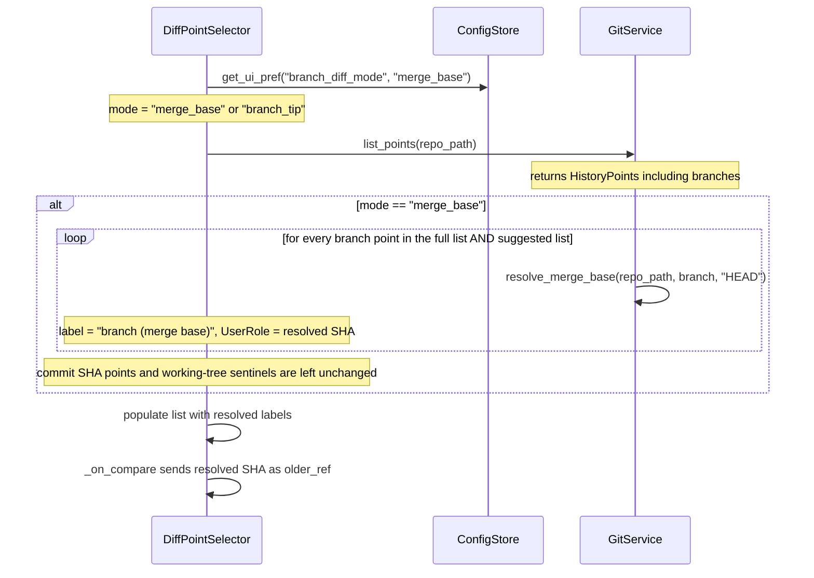

# Auto Merge-Base Selection

## Overview
When a branch is selected as the "older" (base) diff point, the app should automatically resolve it to the
merge base of that branch against HEAD instead of comparing against the branch tip. This behaviour is on by
default and can be toggled off in Settings. The UI shows the resolved label (e.g. `main (merge base)`) in
the diff-point list, the summary bar, and wherever the selection is displayed — so the user always knows
exactly what they are comparing against without having to think about it.

## UI / Flow

### DiffPointSelector — branch row (merge-base mode ON)
```
OLDER POINT  ─── compare against ───
┌──────────────────────────────────────────────────────┐
│ 🔍 Search...                                         │
├──────────────────────────────────────────────────────┤
│ ★ Suggested                                          │
│   main (merge base)        a1b2c3  "Merge feat/foo"  │  ← ALL branches resolved
│   feature/foo (merge base) d4e5f6  "Add auth"        │  ← ALL branches resolved
│ ─────────────────────────────────────────────────────│
│   HEAD                                               │
│   main (merge base)        a1b2c3  "Merge feat/foo"  │  ← every branch in full list too
│   feature/foo (merge base) d4e5f6  "Add auth"        │
│   feature/bar (merge base) 7a8b9c  "WIP bar"         │
│   abc1234  "Old fix"                                 │  ← commits unchanged (no branch)
│   ...                                                │
└──────────────────────────────────────────────────────┘
```
Every branch entry — in the suggested section and the full list — is resolved to its merge base
against HEAD. Commit SHAs and working-tree sentinels are left unchanged.
No separate warning note shown — the label itself communicates the resolution.

### DiffPointSelector — branch row (merge-base mode OFF)
```
OLDER POINT  ─── compare against ───
┌──────────────────────────────────────────────────────┐
│   main                a9b8c7  "tip commit msg"        │  ← raw branch tip, no change
│   ⚠ main resolved to merge-base a1b2c3               │  ← warning note still shown
└──────────────────────────────────────────────────────┘
```

### Summary bar (merge-base mode ON)
```
OLDER: main (merge base)  →  NEWER: working_tree_unstaged      [← Change]
```

### Settings dialog — new row
```
┌─────────────────────────────────────────────────────────────┐
│  Settings                                                   │
│                                                             │
│  Worktree storage:  /Users/foo/worktrees        [Browse]    │
│  Stale threshold:   [30] days                               │
│  Shell:             [zsh ▾]                                 │
│  Default editor:    [Cursor ▾]                              │
│  Branch diff mode:  [Merge base (default) ▾]                │  ← new row
│                                                             │
│                              [Cancel]   [Save]              │
└─────────────────────────────────────────────────────────────┘
```
Dropdown options: `Merge base (default)` / `Branch tip`

## Architecture



**Key files and classes:**

- [`worktree_manager/ui/diff_point_selector.py`](worktree_manager/ui/diff_point_selector.py) — where branch
  items are rendered and the older-changed callback fires; this is where merge-base resolution and label
  rewriting happen.
- [`worktree_manager/git_service.py`](worktree_manager/git_service.py) — contains
  [`resolve_merge_base`](worktree_manager/git_service.py#L464) which runs `git merge-base HEAD <branch>`.
- [`worktree_manager/config_store.py`](worktree_manager/config_store.py) — persists settings via
  [`get_ui_pref`](worktree_manager/config_store.py#L81) / [`set_ui_pref`](worktree_manager/config_store.py#L85).
- [`worktree_manager/ui/settings_panel.py`](worktree_manager/ui/settings_panel.py) — `SettingsDialog` where
  the new "Branch diff mode" row will be added.
- [`worktree_manager/ui/diff_panel.py`](worktree_manager/ui/diff_panel.py) — `_on_compare` builds the
  summary label; needs to use the display label, not the raw ref.

**New data flow for merge-base mode:**

Each `HistoryPoint` for a branch gets a parallel `merge_base_sha` attribute resolved at load time.
`DiffPointSelector` stores both the display label and the actual ref (the SHA or sentinel) in
`Qt.UserRole` on each list item. When merge-base mode is on, the `UserRole` data for a branch item
is the resolved merge-base SHA, so `_on_compare_clicked` naturally sends the right value without
any special-casing downstream.

**HistoryPoint model** — [`worktree_manager/git_service.py`](worktree_manager/git_service.py) currently has:
```
HistoryPoint(kind, label, short_sha, message)
```
No new field is needed: the resolved SHA replaces `short_sha` and the mutated label carries `(merge base)`.
Instead of mutating the shared list, `DiffPointSelector` creates local resolved copies when populating.

## Open Questions
_(none)_

---

## Iteration Plan

### Iteration 0 — Full Feature
**Delivers:** Merge-base mode is on by default; every branch in the older list renders as
`branch (merge base)` with its resolved SHA; Compare runs the diff against the true merge base;
the Settings dialog has a "Branch diff mode" toggle; saved prefs restore correctly.

**Scope:**
- Add `get_branch_diff_mode` / `set_branch_diff_mode` helpers to [`config_store.py`](worktree_manager/config_store.py) (key `"branch_diff_mode"`, default `"merge_base"`)
- In [`diff_point_selector.py`](worktree_manager/ui/diff_point_selector.py) `_populate_list`, when mode is `"merge_base"`, resolve every `kind == "branch"` point via `git_service.resolve_merge_base`, rewrite the label to `"branch (merge base)"`, and store the resolved SHA as `Qt.UserRole` so `_on_compare_clicked` sends it unchanged
- Remove the yellow warning note when mode is `"merge_base"`; retain it only for `"branch_tip"` mode
- Pass `config_store` into `DiffPointSelector.set_repo` (currently it receives only `git_service`)
- Update [`diff_panel.py`](worktree_manager/ui/diff_panel.py) `_on_compare` summary label to use the display label (not the raw SHA)
- Add "Branch diff mode" combo row to [`settings_panel.py`](worktree_manager/ui/settings_panel.py) `SettingsDialog`, wired to `store.get/set_branch_diff_mode`
- `DiffPanel._load_worktree` re-reads the setting on each load so the list reflects the current preference
- When restoring a saved `from_ref` that is a branch name and mode is `"merge_base"`, resolve it to the merge-base SHA before calling `pre_select`; update `set_diff_pref` to store the display label so prefs round-trip cleanly

**Explicitly out of scope:** nothing — this is the complete feature.

---

## ✋ Manual Testing Gate — Iteration 0

> STOP. Do not proceed until every item below is checked off by the user.

- [ ] Open the app and navigate to the Diff panel. Confirm the "Branch diff mode" row exists in Settings (open via the settings button), showing "Merge base (default)" selected.
- [ ] In the Diff panel older list, confirm every branch entry shows `branch (merge base)` with a short SHA — not just `main`, but all branches.
- [ ] Select a branch (e.g. `main (merge base)`) as older and `working_tree_unstaged` as newer, click Compare. Confirm the summary bar reads `OLDER: main (merge base)  →  NEWER: working_tree_unstaged` (not a raw SHA).
- [ ] Confirm the diff files shown are changes since the merge base, not since the branch tip.
- [ ] In Settings, switch "Branch diff mode" to "Branch tip" and save. Re-open the Diff panel older list — confirm branch entries now show without `(merge base)` and the yellow warning note appears when a branch is selected.
- [ ] Switch back to "Merge base (default)" in Settings. Confirm branch entries revert to `branch (merge base)` labels.
- [ ] Close and reopen the app. Confirm the mode preference is persisted and branch entries still show `(merge base)`.

**How to confirm:** Run the app, perform each action above, and check off each item manually.
Reply "Iteration 0 confirmed" (or describe any failures) before I mark the feature complete.
