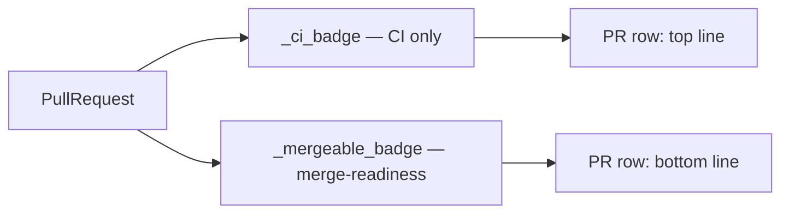

<!-- autobot-status
stage: 5
iteration: 0
gate: pending
mode: contract
updated: 2026-05-31
-->

# Remove Deprecated Duplicate PR Status

## Overview
Each pull-request row in the GitHub panel currently shows two independent status strings that can contradict each other: a CI badge that says "✅ ready to merge", and a separate mergeability badge that can say "🔒 Blocked" (or Conflicts / Behind base). A single PR can therefore display "ready to merge" on the top line and "Blocked" on the bottom line simultaneously. The "ready to merge" verdict is the older, deprecated status — merge-readiness now has its own dedicated mergeability badge. This change makes the CI badge report only CI state, eliminating the contradiction.

## UI / Flow

PR list row — **before** (contradiction possible):
```
#42  Add caching layer        ✅ ready to merge      <- CI badge (top line)
feature/cache → main          🔒 Blocked             <- mergeability badge (bottom line)
```

PR list row — **after** (CI badge reports only CI):
```
#42  Add caching layer        ✅ checks passed       <- CI badge (top line)
feature/cache → main          🔒 Blocked             <- mergeability badge (bottom line)
```

Other CI states (unchanged):
```
... ⏳ checks running    ... ❌ checks failed    ... – no checks
```

## Architecture

The only behavioural change is in [`_ci_badge`](worktree-manager/worktree_manager/ui/github_panel.py#L446-L454). Its "passed" branch currently picks between "ready to merge" and "checks passed" based on `pr.is_ready_to_merge()`; after the change it always returns "✅ checks passed".

- [`is_ready_to_merge()`](worktree-manager/worktree_manager/github_models.py#L86-L89) is **not** changed (the model carries a "DON'T CHANGE THIS METHOD" comment). It simply stops being consulted by the CI badge.
- [`_mergeable_badge`](worktree-manager/worktree_manager/ui/github_panel.py#L437-L444) (the bottom-line status) is unchanged — it remains the single source of merge-readiness.



## API Surface
No API calls are touched. This is a pure UI string change.

## Open Questions
(none)

## Iteration Plan

### Iteration 0 — Walking Skeleton
**Delivers:** A PR with passing checks shows "✅ checks passed" (never "ready to merge") on its CI badge line, so the CI badge no longer contradicts the mergeability badge.
**Scope:**
- Change the "passed" branch of [`_ci_badge`](worktree-manager/worktree_manager/ui/github_panel.py#L452-L453) to always return `"✅ checks passed"`.
- Update the existing list-row tests in [test_github_panel_pr_list_rows_qt.py](worktree-manager/tests/test_github_panel_pr_list_rows_qt.py#L119-L133): the row must show "checks passed" and must **not** show "ready to merge", even when `mergeable=True`.
**Out of scope:**
- Any change to [`is_ready_to_merge()`](worktree-manager/worktree_manager/github_models.py#L86-L89) or its model tests.
- The mergeability badge / detail-view labels.

This feature is a single-iteration fix; there are no further iterations.

### Behavioral Contract — Iteration 0

These tests assert observable row text: the CI badge reports CI state only and never the "ready to merge" verdict, regardless of mergeability. Located in [test_github_panel_pr_list_rows_qt.py](worktree-manager/tests/test_github_panel_pr_list_rows_qt.py#L119-L138).

```python
def test_ci_badge_reports_only_ci_never_merge_verdict_when_mergeable(vm, panel, qtbot):
    # A mergeable PR with passing checks must show CI state ("checks passed"),
    # not the deprecated "ready to merge" verdict — merge-readiness is the
    # mergeability badge's job, not the CI badge's.
    vm.prs = [_make_pr(
        1,
        checks=[CICheck("build", "completed", "success")],
        reviews=[Review("alice", "APPROVED")],
        mergeable=True,
    )]
    vm.prs_updated.emit()
    text = _row_label_text(panel, 0)
    assert "checks passed" in text
    assert "ready to merge" not in text


def test_badge_shows_checks_passed_when_not_mergeable(vm, panel, qtbot):
    vm.prs = [_make_pr(1, checks=[CICheck("build", "completed", "success")], mergeable=False)]
    vm.prs_updated.emit()
    text = _row_label_text(panel, 0)
    assert "checks passed" in text
    assert "ready to merge" not in text
```

The unchanged sibling tests (`test_badge_shows_checks_running`, `test_badge_shows_checks_failed`, `test_badge_shows_no_checks`) remain the contract for the other CI states.

## ✋ Manual Testing Gate — Iteration 0

> STOP. Do not consider this feature done until every item is confirmed by the user.

- [ ] Open the GitHub panel and view your list of open PRs.
- [ ] Find a PR that previously showed "✅ ready to merge" on its top line — confirm it now shows "✅ checks passed" instead.
- [ ] Confirm no PR row shows both "ready to merge" (top) and "Blocked"/"Conflicts"/"Behind base" (bottom) at the same time.
- [ ] Confirm a PR with a blocked/conflicting mergeability still shows its mergeability badge ("🔒 Blocked" etc.) on the bottom line, unchanged.
- [ ] Confirm the other CI states still render correctly: running (⏳), failed (❌), no checks (–).

**Confirmed by user:** —
**How to confirm:** Perform each action, check each box. Reply "Iteration 0 confirmed" (or describe failures).
