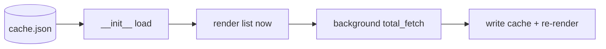
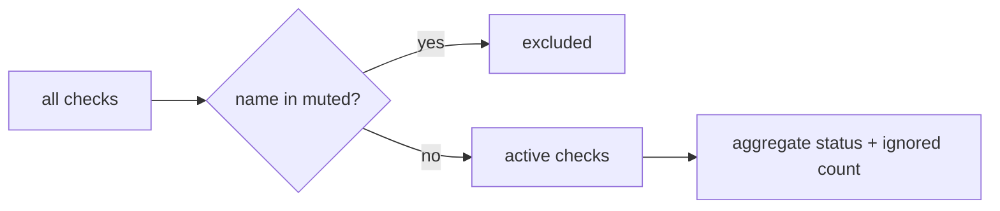
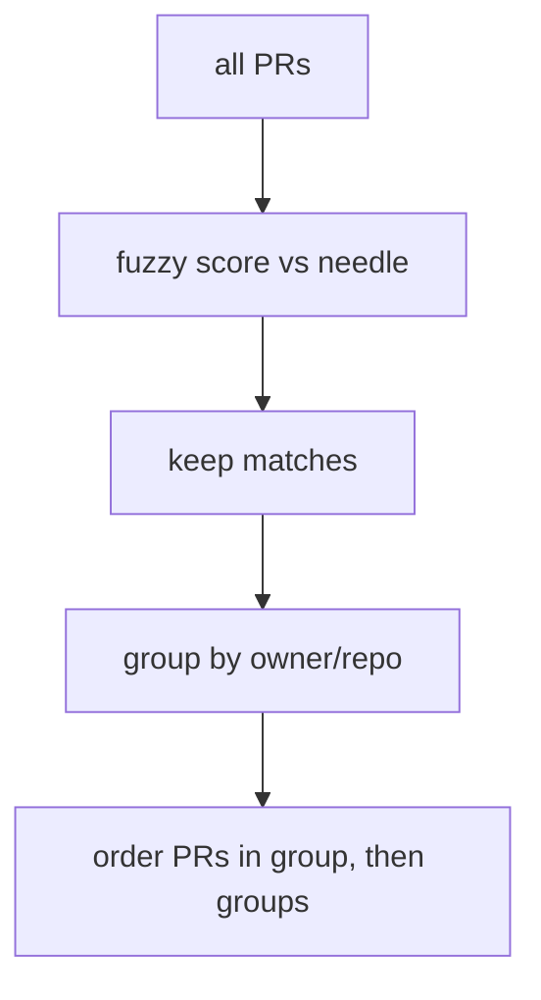
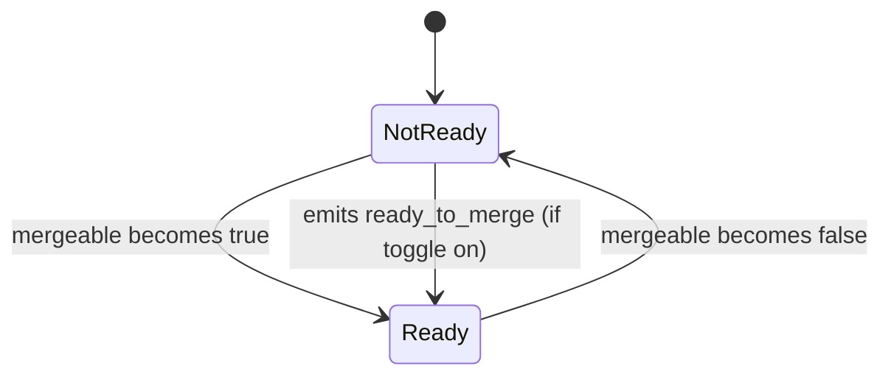

<!-- autobot-status
stage: 6
iteration: 3
gate: none
updated: 2026-06-13
-->

# Autobot — PR ignored checks + repo grouping & search

Two related improvements to the Pull Requests panel ([github_panel.py](worktree-manager/worktree_manager/ui/github_panel.py)):

1. **Per-repo, per-pipeline check muting.** Some repos have permanently-broken pipelines whose failure makes every PR show "❌ checks failed" at the list level. Let the user mute specific check names per repo so those checks no longer drive the aggregate CI status. Muted-but-failing checks are recomputed out; the list badge shows e.g. `✅ passed · 1 ignored`.
2. **Group PRs by repo + fuzzy search.** Visually group the flat PR list under per-repo headers, and add a search bar that fuzzy-filters PRs (reusing spotlight's [fuzzy.py](worktree-manager/worktree_manager/spotlight/fuzzy.py)) across title, number, branches, and repo.

## Frontend Design

### My PRs list — grouped by repo, with search bar (loaded state)

The flat list in [_on_prs_updated](worktree-manager/worktree_manager/ui/github_panel.py#L405) gains a search field above it and repo header rows between groups. The existing global header controls in [github_panel.py:76-101](worktree-manager/worktree_manager/ui/github_panel.py#L76-L101) are unchanged except the global 🔔 stays as a **master switch**. Each repo's own settings live behind a **`⚙` gear on its header row** (right edge).

```
┌──────────────────────────────────────────────────────────────────────┐
│ ⬡  Pull Requests                       🔔    ↻ 30s    ⚿ Token         │
├──────────────────────────────────────────────────────────────────────┤
│ 🔍 [ Search PRs…                                               ] ✕     │
├──────────────────────────────────────────────────────────────────────┤
│ ▾ acme/web-app  (3)                                              ⚙    │
│   #482  Fix login redirect          ✅ checks passed         [↗ View] │
│        feature/login → main         🟢 Mergeable                      │
│   #479  Add dark mode      🔴 2 new  ✅ passed · 1 ignored   [↗ View] │
│        feature/theme → main         🟢 Mergeable                      │
│   #471  Refactor api client         ❌ checks failed         [↗ View] │
│        chore/api → main             🟠 Behind base                    │
│ ▸ acme/payments  (1)    ← collapsed; its PRs hidden             ⚙    │
├──────────────────────────────────────────────────────────────────────┤
│ Tracking: acme/web-app  acme/payments               [↺ Rescan]       │
└──────────────────────────────────────────────────────────────────────┘
```

Notes:
- Repo header rows show `▸/▾ owner/repo  (count)` on the left and a `⚙` gear on the right.
- **Clicking the name/glyph** collapses/expands that repo's PRs. Collapsed state persists per repo across refreshes and restarts. `▾` = expanded, `▸` = collapsed.
- **Clicking the `⚙` gear** opens that repo's settings page (see below) — muted checks + per-repo notification toggles. Each repo has its own page.
- `#479` shows the muted-check annotation: its only failing check was muted for this repo, so the aggregate is recomputed to passed with `· 1 ignored` appended.
- `#471` has a real (non-muted) failure, so it still shows `❌ checks failed`.

### My PRs list — right-click context menu

The existing list-row context menu in [_show_pr_context_menu](worktree-manager/worktree_manager/ui/github_panel.py#L463) gains an **`↗ Open in browser`** action that opens the PR's `html_url` in the default browser (via `QDesktopServices.openUrl`, same as the detail view's `↗ Open` button). It sits at the top, above the in-app `↗ View details`.

```
        #471  Refactor api client    ❌ checks failed   [↗ View]
              ┌───────────────────────────┐
              │ ↗ Open in browser     NEW  │
              │ ↗ View details             │
              │ ✓ Merge (squash)           │   ← only if ready to merge
              │ ⧉ Copy URL                 │
              └───────────────────────────┘
```

### My PRs list — search active (filtered)

Typing fuzzy-filters PRs across number / title / branches / repo. Empty repo groups disappear. Result order is best-match-first within each repo; repo groups are ordered by their best member match.

```
┌─────────────────────────────────────────────────────────────────────┐
│ 🔍 [ login                                                    ] ✕    │
├─────────────────────────────────────────────────────────────────────┤
│ ▸ acme/web-app  (1)                                                   │
│   #482  Fix login redirect          ✅ checks passed         [↗ View] │
│        feature/login → main         🟢 Mergeable                      │
├─────────────────────────────────────────────────────────────────────┤
│ Tracking: acme/web-app  acme/payments               [↺ Rescan]       │
└─────────────────────────────────────────────────────────────────────┘
```

### My PRs list — search matches nothing

```
├─────────────────────────────────────────────────────────────────────┤
│ 🔍 [ zzzzz                                                    ] ✕    │
├─────────────────────────────────────────────────────────────────────┤
│                                                                       │
│            No pull requests match “zzzzz”.                            │
│                                                                       │
```

### My PRs list — empty (no open PRs)

Search bar hidden when there are no PRs at all; existing empty behaviour preserved.

```
├─────────────────────────────────────────────────────────────────────┤
│            (no rows — Tracking: no open PRs found)                    │
```

### Per-repo Settings page (launched from a repo header's ⚙ gear)

Each repo gets **its own settings page**, scoped to that one `owner/repo`. It opens as a modal titled with the repo name and has two sections: **muted checks** and **per-repo notifications**. All settings persist per repo.

```
┌────────────────────────────────────────────────────┐
│  ⚙  acme/web-app  settings                          │
│                                                     │
│  ── Muted checks ──────────────────────────────     │
│  Muted checks no longer affect this repo's PRs'     │
│  overall CI status in the list.                     │
│    [✓] flaky-e2e             (muted)                │
│    [ ] unit-tests                                   │
│    [ ] lint                                         │
│    + Add check name manually…                       │
│      [ check name             ] [ Add & mute ]      │
│                                                     │
│  ── Notifications (for this repo) ─────────────      │
│  Only fire when the global 🔔 is on.                │
│    [✓] CI failed                                    │
│    [✓] CI passed                                    │
│    [✓] New comments                                 │
│    [✓] Ready to merge                               │
│    [✓] Review approved / changes requested          │
│    [✓] Merge conflicts                              │
│                                                     │
│                              [ Close ]              │
└────────────────────────────────────────────────────┘
```

Notes:
- **Muted checks**: check names are discovered from this repo's currently-fetched PRs' [CICheck](worktree-manager/worktree_manager/github_models.py#L5) lists. Toggling mutes/unmutes immediately and persists; closing refreshes the list so badges update. The manual-add row lets the user mute a check name not yet seen on a fetched PR (e.g. a pipeline failing so early no check run is recorded).
- **Notifications**: six per-event-type toggles, default all-on. These gate `pr_event` emission in [_emit_pr_events](worktree-manager/worktree_manager/github_vm.py#L247) for this repo. They only matter when the global 🔔 master switch is on — if the global switch is off, nothing fires regardless. "Ready to merge" is a **new** event type added by this feature.

### Resolved decisions

1. **All repo settings are repo-level.** Muted checks AND notification toggles are stored per `owner/repo`. There is no per-PR setting — per-PR badges/notifications only *reflect* the repo-level config.
2. **Each repo has its own settings page**, opened from a `⚙` gear on that repo's header row. Two sections: muted checks (lists real check names seen on that repo's PRs + manual add) and per-repo notification toggles.
3. **Notification model**: the global 🔔 header button is a **master switch** — off = nothing fires. When on, each repo's six per-event toggles (CI failed, CI passed, new comments, ready-to-merge, reviews, conflicts) decide what fires for that repo. Per-repo defaults are all-on. **Ready-to-merge is a new event type** added by this feature.
4. **Repo groups are collapsible** → click the name/glyph to collapse/expand; collapsed state persists per repo. The `⚙` gear is separate, on the right edge.
5. **Search bar** → "My PRs" tab only.
6. **Right-click `↗ Open in browser`** added to list-row context menu.

## Backend Design

All logic is local — no GitHub API behaviour changes. The four concerns: per-repo config persistence, CI status recompute with muted checks, fuzzy search + grouping, and per-repo notification gating.

### Per-repo config persistence (ConfigStore)

A single per-repo settings blob keyed by `owner/repo`, stored under `ui.github_repo_settings` in [config.json](worktree-manager/worktree_manager/config_store.py). Reuses the existing `get_ui_pref`/`set_ui_pref` plumbing in [config_store.py:81-88](worktree-manager/worktree_manager/config_store.py#L81-L88).

```
ui.github_repo_settings = {
  "acme/web-app": {
    "muted_checks": ["flaky-e2e"],
    "notifications": {            # absent key = default True
      "ci_failed": true, "ci_passed": true, "new_comment": true,
      "ready_to_merge": true, "review": true, "pr_conflicts": true
    },
    "collapsed": false
  },
  ...
}
```

New ConfigStore methods (all take an `owner/repo` string):
- `get_repo_muted_checks(repo) -> list[str]`
- `set_repo_muted_checks(repo, names: list[str])`
- `get_repo_notification_pref(repo, event_type) -> bool` (default True when unset)
- `set_repo_notification_pref(repo, event_type, enabled)`
- `get_repo_collapsed(repo) -> bool` / `set_repo_collapsed(repo, collapsed)`

The `owner/repo` key derives from a PR's existing `pr.owner`/`pr.repo` fields ([github_models.py:43-44](worktree-manager/worktree_manager/github_models.py#L43-L44)).

### PR list cache (permanent storage for efficiency)

Today `vm.prs` (with each PR's `checks`) lives **only in RAM** and is fully rebuilt every fetch; the only thing on disk is the aggregate `ci` string in [github_pr_state.json](worktree-manager/worktree_manager/github_vm.py#L42) for notification dedup. Startup therefore shows the loading spinner until the first network round-trip completes.

Add a **list-view cache** so startup renders instantly from disk, then refreshes in the background.

- **File:** `github_pr_cache.json`, next to the existing state file (`store._path.parent`).
- **Written:** after every successful `_fetch_known_prs` (i.e. on every successful total/quick fetch), via a `_save_pr_cache()` call right where `self.prs` is assigned in [github_vm.py:181](worktree-manager/worktree_manager/github_vm.py#L181).
- **Read:** once in `__init__`, before timers start — populate `self.prs` from cache and emit `prs_updated` so the panel paints immediately, *then* `total_fetch()` refreshes over the network.
- **Scope — list-view fields only:** `number, title, html_url, head_branch, base_branch, state, draft, mergeable, mergeable_state, owner, repo`, plus each `CICheck` (`name, status, conclusion, check_suite_id`). Reviews and comments are **not** cached — the detail view always re-fetches them via [select_pr](worktree-manager/worktree_manager/github_vm.py#L296).
- **Staleness:** cached rows render immediately and are replaced wholesale by the next live fetch. A small "⏳ refreshing…" hint may show in the footer until the first live fetch returns (reuse `fetch_status_changed`).



New ConfigStore-adjacent persistence (lives on the VM next to `_load_pr_state`/`_save_pr_state`, same JSON-roundtrip pattern):
- `_load_pr_cache() -> list[PullRequest]`
- `_save_pr_cache()` — serialises `self.prs` list-view fields.

### CI status recompute with muted checks

[PullRequest.ci_status()](worktree-manager/worktree_manager/github_models.py#L58) currently aggregates over *all* checks. It gains an optional `muted: set[str]` parameter; muted check names are excluded before aggregating. A companion `ci_status_summary(muted)` returns both the status and the count of muted checks that *would have been* failing, so the badge can show `· N ignored`.

```
def ci_status(self, muted=frozenset()):
    active = [c for c in self.checks if c.name not in muted]
    if not active: return "unknown"
    conclusions = [c.conclusion for c in active]
    if any(c == "failure"): return "failed"
    if any(c is None):      return "running"
    return "passed"

def ci_status_summary(self, muted=frozenset()):
    # ignored_failures = muted checks whose conclusion == "failure"
    status = self.ci_status(muted)
    ignored = count(c for c in self.checks if c.name in muted and c.conclusion == "failure")
    return (status, ignored)
```

`is_ready_to_merge()` is NOT touched (the in-code guard says don't). The mute only affects the *displayed list badge* and `pr_event` CI notifications — it does not change GitHub's mergeability.

**Dedup consistency.** The persisted `ci` value in [_pr_state](worktree-manager/worktree_manager/github_vm.py#L247) (used to decide when to fire `ci_failed`/`ci_passed`) must be computed with the repo's muted set too. Otherwise a repo whose only failure is a muted pipeline would store `ci="failed"` forever and never notify on a real subsequent pass. Both the stored value and the comparison in `_emit_pr_events` use `pr.ci_status(muted_for_repo)`.



### Fuzzy search + grouping (panel-side model)

A pure helper builds the grouped, filtered, ordered structure the list renders. Reuses [fuzzy_score](worktree-manager/worktree_manager/spotlight/fuzzy.py#L39) — a PR matches if `fuzzy_score(needle, searchable) is not None`.

```
searchable(pr) = f"#{pr.number} {pr.title} {pr.head_branch} {pr.base_branch} {pr.owner}/{pr.repo}"

def group_and_filter(prs, needle, collapsed_repos):
    # 1. score each PR; keep matches (empty needle keeps all, score 0)
    # 2. group surviving PRs by "owner/repo"
    # 3. within a group, sort PRs by score desc (stable for empty needle → keep pr_key order)
    # 4. order groups by their best member score desc; ties → repo name asc
    # 5. attach per-group: collapsed flag, total count
    returns [ RepoGroup(repo, count, collapsed, prs=[...]) , ... ]
```

- Empty needle → all PRs kept, groups in repo-name order, PR order = existing `pr_key` sort.
- A group whose every PR is filtered out disappears.
- `count` is the **post-filter** count shown in the header `(N)`.



### Per-repo notification gating

[_emit_pr_events](worktree-manager/worktree_manager/github_vm.py#L247) currently calls `self.pr_event.emit(...)` unconditionally. Each emit is gated through a single helper that checks the per-repo toggle for that event type. The global 🔔 master switch is already enforced downstream (the panel reads `github_notifications_enabled` before surfacing a notification) — per-repo gating is an *additional* filter at emit time.

```
def _should_notify(pr, event_type) -> bool:
    repo = f"{pr.owner}/{pr.repo}"
    return self._store.get_repo_notification_pref(repo, event_type)

# every emit becomes:
if self._should_notify(pr, "ci_failed"):
    self.pr_event.emit(pk, "ci_failed", ...)
```

Event-type mapping for the six toggles:
- `ci_failed` → `ci_failed`; `ci_passed` → `ci_passed`
- `new_comment` → `new_comment`
- `review_approved` & `review_changes_requested` → both gated by the single `review` toggle
- `pr_conflicts` → `pr_conflicts`
- **NEW** `ready_to_merge` → emitted when a PR transitions into a mergeable state (tracked alongside the existing `ci`/`mergeable_state` in `_pr_state`); gated by `ready_to_merge`.

State-tracking for the new event mirrors the existing dedup in `_emit_pr_events`: store prior `ready` boolean in `_pr_state[pk]`, emit `ready_to_merge` only on the False→True transition.



### API verification

Not applicable — no external API params change. Muted-check recompute, grouping, search, and notification gating are all local transformations over already-fetched data.

## Iteration Plan

- Iteration 0 — Fuzzy search bar
- Iteration 1 — Right-click "Open in browser"
- Iteration 2 — PR list cache for fast startup
- Iteration 3 — Mute pipelines, per-repo settings page, repo grouping, collapsible groups & per-repo notifications

### Iteration 0 — Fuzzy search bar
**Context file:** [Iteration 0 context](autobot-pr-ignore-checks-and-grouping-ctx-iter-0-fuzzy-search-2026-06-13.md)

### Implementation Ledger — Iteration 0
- `test_searchable_text_covers_number_title_branches_and_owner_repo`: red → green ✓
- `test_keeps_pr_when_query_fuzzy_matches`: red → green ✓
- `test_drops_pr_when_query_does_not_match`: red → green ✓
- `test_orders_surviving_prs_best_match_first`: red → green ✓
- `test_empty_query_keeps_all_prs_in_original_order`: red → green ✓
- `test_matches_by_pr_number_fragment`: red → green ✓
- `test_matches_by_branch_name_fragment`: red → green ✓
- `test_matches_by_owner_repo_fragment`: red → green ✓

## ✋ Manual Testing Gate — Iteration 0

> STOP. Do not proceed to Iteration 1 until every item is confirmed.

- [x] With PRs loaded, a search field appears above the PR list.
- [x] Typing a fragment of a PR title narrows the list to matching PRs, best match first.
- [x] Typing a PR number (e.g. `482`) matches that PR.
- [x] Typing part of a branch name or `owner/repo` matches the right PRs.
- [x] Clearing the field (or ✕) restores the full list in original order.
- [x] A non-matching query shows a "No pull requests match …" message.
- [x] When there are no PRs at all, the search field is hidden and existing empty behaviour is unchanged.

**Confirmed by user:** 2026-06-13
**How to confirm:** Check every box, then reply "Iteration 0 confirmed" or describe what failed.

### Iteration 1 — Right-click "Open in browser"
**Context file:** [Iteration 1 context](autobot-pr-ignore-checks-and-grouping-ctx-iter-1-open-in-browser-2026-06-13.md)

### Implementation Ledger — Iteration 1
- `test_context_menu_includes_open_in_browser`: red → green ✓
- `test_open_in_browser_is_first_action`: red → green ✓
- `test_open_in_browser_calls_desktop_services`: red → green ✓
- `test_existing_actions_still_present`: red → green ✓
- `test_merge_squash_present_when_ready_to_merge`: red → green ✓

## ✋ Manual Testing Gate — Iteration 1

> STOP. Do not proceed to Iteration 2 until every item is confirmed.

- [x] Right-clicking a PR row shows a context menu with "↗ Open in browser" at the top.
- [x] Clicking it opens the PR's URL in the default browser.
- [x] The existing "↗ View details", "✓ Merge (squash)" (when ready), and "⧉ Copy URL" actions still work.
- [x] Regression: search bar from Iteration 0 still filters and clears correctly.

**Confirmed by user:** 2026-06-13
**How to confirm:** Check every box, then reply "Iteration 1 confirmed" or describe what failed.

### Iteration 2 — PR list cache for fast startup
**Context file:** [Iteration 2 context](autobot-pr-ignore-checks-and-grouping-ctx-iter-2-pr-cache-2026-06-13.md)

### Implementation Ledger — Iteration 2
- `test_save_pr_cache_writes_list_view_fields`: red → green ✓
- `test_load_pr_cache_round_trip`: red → green ✓
- `test_load_pr_cache_missing_file_returns_empty`: red → green ✓
- `test_load_pr_cache_corrupt_file_returns_empty_and_logs`: red → green ✓
- `test_loaded_prs_have_empty_reviews_and_comments`: red → green ✓
- `test_startup_populates_prs_from_cache_before_live_fetch`: red → green ✓

## ✋ Manual Testing Gate — Iteration 2

> STOP. Do not proceed to Iteration 3 until every item is confirmed.

- [x] After PRs have loaded once, fully quit and relaunch the app: the PR list paints immediately from cache (no long loading spinner before the first rows appear).
- [x] A `github_pr_cache.json` file exists next to the config and contains the list-view fields for the tracked PRs.
- [x] After the cached list paints, a live refresh runs and replaces the rows with current data.
- [x] Opening a PR's detail view still re-fetches reviews and comments (they are not served stale from cache).
- [x] First run ever (no cache file) behaves exactly as before — loading state then live list.
- [x] Regression: search (Iter 0) and right-click Open in browser (Iter 1) still work on the cached and refreshed lists.

**Confirmed by user:** 2026-06-13
**How to confirm:** Check every box, then reply "Iteration 2 confirmed" or describe what failed.

### Iteration 3 — Mute pipelines, per-repo settings page, repo grouping, collapsible groups & per-repo notifications
**Context file:** [Iteration 3 context](autobot-pr-ignore-checks-and-grouping-ctx-iter-3-mute-and-grouping-2026-06-13.md)

### Implementation Ledger — Iteration 3
- `test_muted_failing_check_no_longer_yields_failed`: red → green ✓
- `test_ci_status_summary_reports_ignored_count`: red → green ✓
- `test_real_failure_still_yields_failed_with_another_muted`: red → green ✓
- `test_muting_only_check_yields_unknown`: red → green ✓
- `test_muted_checks_round_trip`: red → green ✓
- `test_notification_pref_defaults_to_true_when_unset`: red → green ✓
- `test_notification_pref_round_trips`: red → green ✓
- `test_collapsed_defaults_to_false`: red → green ✓
- `test_collapsed_round_trips`: red → green ✓
- `test_settings_for_one_repo_do_not_bleed_into_another`: red → green ✓
- `test_groups_prs_by_owner_repo`: red → green ✓
- `test_empty_needle_groups_in_repo_name_order`: red → green ✓
- `test_empty_needle_prs_within_group_preserve_original_order`: red → green ✓
- `test_search_needle_drops_nonmatching_prs_and_removes_empty_groups`: red → green ✓
- `test_groups_ordered_by_best_member_score`: red → green ✓
- `test_prs_within_group_ordered_by_score_desc`: red → green ✓
- `test_group_count_reflects_post_filter_visible_prs`: red → green ✓
- `test_emit_suppressed_when_repo_toggle_is_off`: red → green ✓
- `test_emit_fires_when_repo_toggle_is_on`: red → green ✓
- `test_review_approved_suppressed_when_review_toggle_off`: red → green ✓
- `test_review_changes_requested_suppressed_when_review_toggle_off`: red → green ✓
- `test_ready_to_merge_fires_on_not_ready_to_ready_transition`: red → green ✓
- `test_ready_to_merge_fires_only_once`: red → green ✓
- `test_ready_to_merge_suppressed_when_toggle_off`: red → green ✓
- `test_muted_failure_repo_still_notifies_on_genuine_pass`: red → green ✓

## ✋ Manual Testing Gate — Iteration 3

> STOP. Feature complete when every item is confirmed.

Grouping & collapse:
- [ ] PRs are grouped under `owner/repo (count)` header rows.
- [ ] Each header row has a `⚙` gear on the right and a `▾`/`▸` collapse glyph on the left.
- [ ] Clicking a header name/glyph collapses and expands that repo's PRs; the `(count)` stays correct.
- [ ] Collapsed state persists after a refresh and after an app restart.
- [ ] Search still works with grouping: empty groups disappear, groups order by best match.

Muting:
- [ ] Clicking a repo's `⚙` opens a settings page scoped to that `owner/repo`.
- [ ] The muted-checks section lists check names seen on that repo's PRs; toggling one mutes/unmutes and persists.
- [ ] A PR whose only failing check is muted shows `✅ passed · 1 ignored` in the list; a PR with a real failure still shows `❌ checks failed`.
- [ ] The manual-add row lets you mute a check name not currently listed.
- [ ] Muting persists across app restart.

Notifications:
- [ ] The settings page has six per-repo notification toggles (CI failed, CI passed, new comments, ready to merge, reviews, conflicts), default all on.
- [ ] Turning off a toggle for a repo stops that notification type for that repo (verify at least one, e.g. CI failed).
- [ ] The global 🔔 master switch still mutes everything when off.
- [ ] A PR transitioning into "ready to merge" fires a ready-to-merge notification (when the toggle and global switch are on), and only once per transition.
- [ ] Regression: a repo with a muted permanently-failing pipeline still notifies on a genuine subsequent pass.
- [ ] Regression: search (Iter 0), right-click Open (Iter 1), and fast-startup cache (Iter 2) all still work.

**Confirmed by user:** —
**How to confirm:** Check every box, then reply "Iteration 3 confirmed" or describe what failed.

