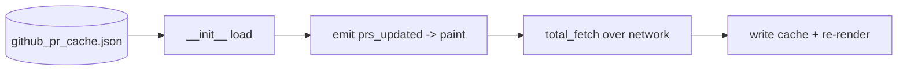

# Context: Iteration 2 — PR list cache for fast startup

## Goal
Persist the list-view fields of `vm.prs` to disk on every successful fetch, and load them at startup so the PR list paints instantly before any network round-trip, then refresh live in the background.

## Tests to write
- saving the PR cache writes list-view fields to disk: serialise `prs` and read them back.
- loading the PR cache reconstructs PullRequest objects with checks: round-trip preserves number/title/branches/mergeable + each CICheck.
- loading a missing cache file returns an empty list (no crash): first-run behaviour.
- loading a corrupt cache file returns empty and logs (no crash, no silent pass): surface via log, not `except: pass`.
- reviews and comments are NOT cached: loaded PRs have empty reviews/comments lists.
- startup populates prs from cache before the first live fetch: VM exposes cached prs immediately.

## Files to touch
- [github_vm.py](../worktree-manager/worktree_manager/github_vm.py) — add `_pr_cache_path`, `_load_pr_cache()`, `_save_pr_cache()`; call save in `_fetch_known_prs` after `self.prs = results`; call load in `__init__` and emit `prs_updated` before timers/`total_fetch`.
- `worktree-manager/tests/test_github_pr_cache.py` (new) — round-trip + edge-case tests for the cache helpers.

## Files (new)
- `github_pr_cache.json` — created at runtime next to config (not a source file).

## Design / pseudocode

#### `github_vm.py`
```
# __init__ (after _pr_state setup, before timers):
self._pr_cache_path = store._path.parent / "github_pr_cache.json"
self.prs = self._load_pr_cache()
if self.prs:
    self._initial_load_done = True
    self.prs_updated.emit()        # paint immediately from cache
# ...existing: start timers, QTimer.singleShot(0, self.total_fetch)

def _save_pr_cache(self):
    rows = [{
        "number": p.number, "title": p.title, "html_url": p.html_url,
        "head_branch": p.head_branch, "base_branch": p.base_branch,
        "state": p.state, "draft": p.draft,
        "mergeable": p.mergeable, "mergeable_state": p.mergeable_state,
        "owner": p.owner, "repo": p.repo,
        "checks": [{"name": c.name, "status": c.status,
                    "conclusion": c.conclusion, "check_suite_id": c.check_suite_id}
                   for c in p.checks],
    } for p in self.prs]
    try: write json to self._pr_cache_path (mkdir parents)
    except Exception: log.warning(..., exc_info=True)   # never silent-pass

def _load_pr_cache(self) -> list[PullRequest]:
    if not path.exists(): return []
    try:
        raw = json.loads(path.read_text())
        return [PullRequest(... fields ..., checks=[CICheck(**c) for c in row["checks"]])
                for row in raw]
    except Exception:
        log.warning("Failed to load PR cache; starting empty", exc_info=True)
        return []

# in _fetch_known_prs, right after `self.prs = results`:
self._save_pr_cache()
```

## Diagrams


## Relevant existing code

`__init__` tail — [github_vm.py:50-64](../worktree-manager/worktree_manager/github_vm.py#L50):
```
token = store.get_github_token()
if token: self._token_state = CONFIGURED; self._init_service(token)
else: self._token_state = MISSING
self._quick_timer = QTimer(self); ...
self._total_timer = QTimer(self); ...
if self._token_state == CONFIGURED:
    self._start_timers()
    QTimer.singleShot(0, self.total_fetch)
```

`_fetch_known_prs` assignment point — [github_vm.py:176-184](../worktree-manager/worktree_manager/github_vm.py#L176):
```
results.sort(key=lambda p: p.pr_key)
self.prs = results                 # <-- _save_pr_cache() goes right here
self._emit_pr_events(self.prs)
self._initial_load_done = True
self.prs_updated.emit()
```

Existing on-disk pattern to mirror — `_load_pr_state`/`_save_pr_state` ([github_vm.py:206-245](../worktree-manager/worktree_manager/github_vm.py#L206)) already do JSON read/write with `log.warning(..., exc_info=True)` on failure. Mirror that style exactly.

`CICheck` / `PullRequest` constructors — github_models.py:
```
@dataclass
class CICheck: name; status; conclusion: str|None; check_suite_id: str|None = None
@dataclass
class PullRequest: number; title; body; html_url; head_branch; base_branch;
    state; draft; mergeable: bool|None; checks=[]; reviews=[]; comments=[];
    head_sha=""; owner=""; repo=""; mergeable_state=""
    # __post_init__ derives owner/repo from html_url if absent
```
Note `body` is required positionally — pass `body=""` for cached rows (body isn't a list-view field).

## Constraints / invariants
- **List-view fields only.** Do NOT cache reviews or comments — detail view re-fetches them in [select_pr](../worktree-manager/worktree_manager/github_vm.py#L296).
- First run (no cache) must behave exactly as today: spinner then live list.
- No silent exceptions — corrupt/missing cache logs and returns `[]` (mirror `_load_pr_state`).
- Cache is replaced wholesale by each live fetch; no merge logic needed.
- `__post_init__` will re-derive owner/repo from html_url, but we also persist them explicitly — both must agree.

## Done when (gate items)
- [ ] After PRs have loaded once, fully quit and relaunch: the list paints immediately from cache (no long spinner before first rows).
- [ ] `github_pr_cache.json` exists next to config with list-view fields for tracked PRs.
- [ ] After the cached list paints, a live refresh replaces the rows with current data.
- [ ] Opening a PR's detail still re-fetches reviews and comments (not served stale).
- [ ] First run ever (no cache file) behaves exactly as before.
- [ ] Regression: search (Iter 0) and right-click Open (Iter 1) work on cached and refreshed lists.

## TDD mode: Autonomous
TDD directly. Keep the ledger below as you go.
