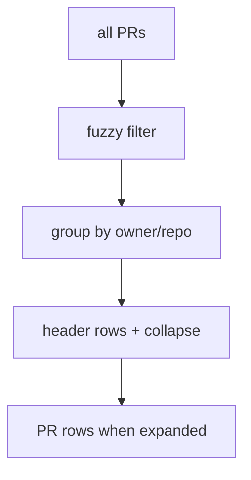
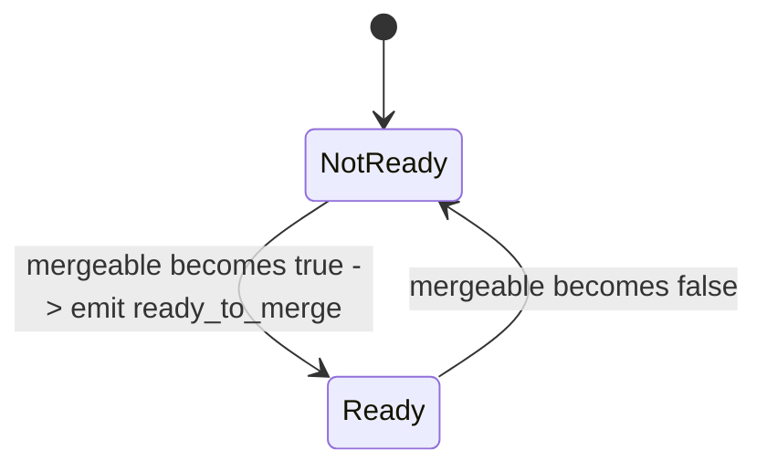

# Context: Iteration 3 — Mute pipelines, per-repo settings page, repo grouping, collapsible groups & per-repo notifications

> Large iteration. Suggest building in the order below; each block is independently testable.

## Goal
Deliver the per-repo control surface: mute specific check names per repo (recompute CI badge), group the PR list by repo with collapsible headers, expose a per-repo settings page (muted checks + notification toggles) from each header's ⚙ gear, and gate notifications per repo per event type — including a new "ready to merge" event.

## Build order (recommended phases)
1. **Mute logic** — `ci_status(muted)` + `ci_status_summary(muted)` on PullRequest (pure, no UI).
2. **Per-repo persistence** — ConfigStore getters/setters for muted_checks, notifications, collapsed.
3. **Grouping + filter helper** — `group_and_filter` producing ordered RepoGroups (reuses Iter 0's filter).
4. **Grouped rendering + collapsible headers** — panel renders groups; header click collapses; ⚙ gear.
5. **Per-repo settings page** — dialog scoped to one repo: muted-checks section + notifications section.
6. **Badge recompute wiring** — list badge uses muted set; shows `· N ignored`.
7. **Notification gating + ready_to_merge** — gate every `pr_event` emit per repo per type; add new event.

## Tests to write
Mute logic:
- ci_status excludes muted checks before aggregating: a failing-but-muted check no longer makes status "failed".
- ci_status_summary reports the count of muted failing checks: returns (status, ignored_count).
- a real (non-muted) failure still yields "failed" even with another check muted.
- muting the only check yields "unknown" (no active checks).

Persistence:
- muted checks round-trip per repo: set then get returns the list.
- notification pref defaults to True when unset, and round-trips when set.
- collapsed state defaults False, round-trips per repo.
- settings for one repo don't bleed into another repo.

Grouping/filter:
- group_and_filter groups PRs by owner/repo.
- empty needle keeps all groups in repo-name order, PRs in pr_key order.
- a search needle drops non-matching PRs and removes emptied groups.
- groups order by best member score; PRs within a group order by score.
- group count reflects post-filter visible PRs.

Notifications:
- emit is suppressed when the repo's toggle for that event type is off.
- emit fires when the toggle is on.
- review_approved and review_changes_requested are both gated by the single "review" toggle.
- ready_to_merge fires only on the not-ready -> ready transition, once.
- ci dedup uses the muted-recomputed status (muted-failure repo still notifies on a genuine pass).

## Files to touch
- [github_models.py](../worktree-manager/worktree_manager/github_models.py) — add `muted` param to `ci_status`; add `ci_status_summary`.
- [config_store.py](../worktree-manager/worktree_manager/config_store.py) — per-repo settings getters/setters under `ui.github_repo_settings`.
- `worktree-manager/worktree_manager/github_search.py` (from Iter 0) — add `group_and_filter`.
- [github_vm.py](../worktree-manager/worktree_manager/github_vm.py) — `_should_notify`; gate emits in `_emit_pr_events`; add `ready` tracking + `ready_to_merge`; use muted status for ci dedup; expose `muted_checks_for(repo)`.
- [github_panel.py](../worktree-manager/worktree_manager/ui/github_panel.py) — grouped rendering, collapsible headers, ⚙ gear, badge `· N ignored`.
- `worktree-manager/worktree_manager/ui/repo_settings_dialog.py` (new) — the per-repo settings page.
- Tests (new): `test_github_models_muted_status.py`, `test_config_store_repo_settings.py`, `test_github_search_grouping.py`, `test_github_vm_notification_gating_qt.py` (or non-qt where possible), `test_repo_settings_dialog_qt.py`, `test_github_panel_grouping_qt.py`.

## Design / pseudocode

#### `github_models.py`
```
def ci_status(self, muted=frozenset()):
    active = [c for c in self.checks if c.name not in muted]
    if not active: return "unknown"
    cs = [c.conclusion for c in active]
    if any(c == "failure" for c in cs): return "failed"
    if any(c is None for c in cs): return "running"
    return "passed"

def ci_status_summary(self, muted=frozenset()):
    status = self.ci_status(muted)
    ignored = sum(1 for c in self.checks if c.name in muted and c.conclusion == "failure")
    return (status, ignored)
```
`ci_status()` keeps its no-arg default behaviour (muted defaults to empty). Do NOT touch `is_ready_to_merge()`.

#### `config_store.py`
```
def _repo_settings(self, data):           # helper on raw dict
    return data.setdefault("ui", {}).setdefault("github_repo_settings", {})

def get_repo_muted_checks(self, repo) -> list[str]:
    return self.get_ui_pref("github_repo_settings", {}).get(repo, {}).get("muted_checks", [])
def set_repo_muted_checks(self, repo, names):
    data=self._load_raw(); s=self._repo_settings(data).setdefault(repo, {})
    s["muted_checks"]=list(names); self._save_raw(data)

def get_repo_notification_pref(self, repo, event_type) -> bool:
    return self.get_ui_pref("github_repo_settings", {}).get(repo, {}).get("notifications", {}).get(event_type, True)
def set_repo_notification_pref(self, repo, event_type, enabled):
    data=...; s=self._repo_settings(data).setdefault(repo, {}); s.setdefault("notifications", {})[event_type]=bool(enabled); save

def get_repo_collapsed(self, repo) -> bool:
    return bool(self.get_ui_pref("github_repo_settings", {}).get(repo, {}).get("collapsed", False))
def set_repo_collapsed(self, repo, collapsed):
    data=...; s=self._repo_settings(data).setdefault(repo, {}); s["collapsed"]=bool(collapsed); save
```

#### `github_search.py` (add)
```
@dataclass
class RepoGroup: repo: str; count: int; collapsed: bool; prs: list

def group_and_filter(prs, needle, collapsed_repos=frozenset()):
    # score+keep via existing filter_prs logic, remembering each pr's score
    # group survivors by f"{pr.owner}/{pr.repo}"
    # within group: sort by score desc (empty needle -> keep pr_key order)
    # groups: sort by best-member-score desc, tie -> repo name asc (empty needle -> repo name asc)
    # RepoGroup.count = len(visible prs in group); collapsed = repo in collapsed_repos
```

#### `github_vm.py`
```
def muted_checks_for(self, repo) -> set[str]:
    return set(self._store.get_repo_muted_checks(repo))

def _should_notify(self, pr, event_type) -> bool:
    return self._store.get_repo_notification_pref(f"{pr.owner}/{pr.repo}", event_type)

# in _emit_pr_events, replace each emit with a gated emit, and use muted status for ci:
muted = self.muted_checks_for(f"{pr.owner}/{pr.repo}")
curr_ci = pr.ci_status(muted)                 # was pr.ci_status()
# ci_failed/ci_passed -> guard with _should_notify(pr, "ci_failed"/"ci_passed")
# new_comment -> _should_notify(pr, "new_comment")
# review_approved/review_changes_requested -> _should_notify(pr, "review")
# pr_conflicts -> _should_notify(pr, "pr_conflicts")

# NEW ready_to_merge: track prior "ready" bool in _pr_state[pk]
curr_ready = pr.is_ready_to_merge()
if state.get("ready") is False and curr_ready and self._should_notify(pr, "ready_to_merge"):
    self.pr_event.emit(pk, "ready_to_merge", f'🟢 "{pr.title}" is ready to merge')
state["ready"] = curr_ready
# include "ready": curr_ready in the initial state dict for new PRs, and in _load/_save_pr_state.
```

#### `ui/repo_settings_dialog.py` (new)
```
class RepoSettingsDialog(QDialog):
    def __init__(self, repo: str, store, discovered_check_names: list[str], parent=None):
        # title: f"⚙  {repo}  settings"
        # Muted checks section:
        #   muted = set(store.get_repo_muted_checks(repo))
        #   for name in sorted(set(discovered_check_names) | muted):
        #       checkbox checked if name in muted; toggle -> add/remove + set_repo_muted_checks
        #   manual-add row: QLineEdit + "Add & mute" -> append name, set, add checkbox
        # Notifications section (default True via get_repo_notification_pref):
        #   for (event_type, label) in [("ci_failed","CI failed"),("ci_passed","CI passed"),
        #       ("new_comment","New comments"),("ready_to_merge","Ready to merge"),
        #       ("review","Review approved / changes requested"),("pr_conflicts","Merge conflicts")]:
        #       checkbox; toggled -> set_repo_notification_pref(repo, event_type, checked)
        # Close button
```

#### `ui/github_panel.py` (grouped rendering)
```
# _render_pr_list (from Iter 0) becomes group-aware:
collapsed = {repo for repo in tracked if store.get_repo_collapsed(repo)}
groups = group_and_filter(self._vm.prs, needle, collapsed)
clear list
for g in groups:
    add a header row item: "▾/▸ {g.repo}  ({g.count})" + ⚙ gear button (right)
        header click (name/glyph) -> toggle store.set_repo_collapsed(g.repo, not g.collapsed); re-render
        gear click -> open RepoSettingsDialog(g.repo, store, discovered names for repo); on close re-render
        header items are non-selectable (Qt.NoItemFlags except enabled) 
    if not g.collapsed:
        for pr in g.prs: build existing PR row (badge uses muted recompute below)

# badge with ignored count:
status, ignored = pr.ci_status_summary(self._vm.muted_checks_for(f"{pr.owner}/{pr.repo}"))
base = {"running":"⏳ checks running","failed":"❌ checks failed",
        "passed":"✅ checks passed","unknown":"– no checks"}[status]
badge = base + (f" · {ignored} ignored" if ignored and status != "failed" else "")
```
Discovered check names for a repo = unique `c.name` across that repo's PRs in `self._vm.prs`.

## Diagrams



## Relevant existing code

`_emit_pr_events` (the emit sites to gate) — [github_vm.py:247-292](../worktree-manager/worktree_manager/github_vm.py#L247): emits `ci_failed`, `ci_passed`, `pr_conflicts`, `new_comment`, `review_approved`, `review_changes_requested`; maintains `_pr_state[pk]` with `ci`, `mergeable_state`, `comment_ids`, `review_keys`. Add `ready` to that dict and to `_load_pr_state`/`_save_pr_state` ([github_vm.py:206-245](../worktree-manager/worktree_manager/github_vm.py#L206)).

Current badge code — [_ci_badge](../worktree-manager/worktree_manager/ui/github_panel.py#L446) and the list builder [_on_prs_updated](../worktree-manager/worktree_manager/ui/github_panel.py#L405) (now `_render_pr_list` after Iter 0).

Context-menu lookup uses `pr_key` stored on each item ([github_panel.py:430](../worktree-manager/worktree_manager/ui/github_panel.py#L430)) — header rows must NOT carry a pr_key (skip them in the context-menu handler).

`ConfigStore.get_ui_pref/set_ui_pref` — [config_store.py:81-88](../worktree-manager/worktree_manager/config_store.py#L81).

Existing Qt dialog to mirror for structure — [ui/settings_panel.py](../worktree-manager/worktree_manager/ui/settings_panel.py).

## Constraints / invariants
- `is_ready_to_merge()` must not change (in-code guard at [github_models.py:86](../worktree-manager/worktree_manager/github_models.py#L86)).
- Notifications are repo-level only; global 🔔 (`github_notifications_enabled`) remains the master switch enforced in the panel — per-repo gating is additional at emit time.
- ci notification dedup MUST use the muted-recomputed status (else muted-failure repos never notify on real passes).
- Header rows are visual/interactive separators, not selectable PR items, and carry no `pr_key`.
- Grouping reuses Iter 0's filter — do not duplicate scoring logic.
- No silent exceptions.

## Done when (gate items)
- [ ] PRs grouped under `owner/repo (count)` headers; each header has ⚙ gear + ▾/▸ glyph.
- [ ] Header click collapses/expands; count stays correct; collapse persists across refresh and restart.
- [ ] Search works with grouping (empty groups vanish; groups order by best match).
- [ ] ⚙ opens a settings page scoped to that repo.
- [ ] Muted-checks section lists that repo's seen check names; toggling persists.
- [ ] A PR whose only failing check is muted shows `✅ passed · 1 ignored`; a real failure still shows `❌ checks failed`.
- [ ] Manual-add row mutes a not-yet-listed check name; persists across restart.
- [ ] Six per-repo notification toggles (default on); turning one off stops that type for that repo.
- [ ] Global 🔔 still mutes everything when off.
- [ ] Ready-to-merge transition fires once per transition (toggle + global on).
- [ ] Muted permanently-failing repo still notifies on a genuine subsequent pass.
- [ ] Regression: search (Iter 0), right-click Open (Iter 1), cache (Iter 2) all still work.

## TDD mode: Autonomous
TDD directly. Keep the ledger below as you go.
