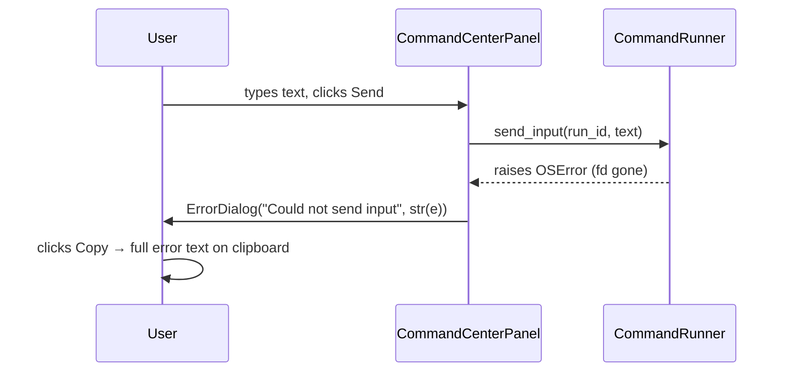

# Silent Exception Fixes

## Overview

Three `except <Error>: pass` blocks exist in [`worktree_manager/command_runner.py`](worktree_manager/command_runner.py). Each one silently discards an error that may indicate a real problem — dropped user input or a leaked file descriptor. This feature replaces every silent pass with a visible error surfaced to the user via a reusable `ErrorDialog`.

The app currently uses `QMessageBox.critical(...)` in ~10 places. All of these are replaced with a new `ErrorDialog` that includes a one-click **Copy** button so the user can capture and share the full error text. The `ErrorDialog` becomes the single standard way to show errors across the app.

A fourth issue is also addressed: `BackgroundJob` crashes with `RuntimeError: Signal source has been deleted` when a `refresh()` call replaces the job while the old thread is still running. The old `BackgroundJob` QObject gets garbage-collected but its thread still holds `self` and tries to emit signals. Fix: `per_repo_worktrees_view.py` keeps a strong reference to the old job in a list until the thread finishes, preventing the C++ QObject from being deleted mid-flight. The `failed` signal then fires normally → `ErrorDialog` shows on the main thread.

Note: `window_registry.py` previously contained two additional silent passes but was identified as dead code (superseded by the "UI redesign" refactor, May 2026) and deleted along with its test file and the unused `live_window` scaffolding in `DeleteDialog`.

## UI / Flow

### ErrorDialog — new reusable component

Replaces all `QMessageBox.critical(...)` calls. Shows the error title and full message, with a Copy button that writes the full text to the clipboard.

```
┌──────────────────────────────────────────┐
│  ✕  Error                                │
│  ────────────────────────────────────── │
│  Could not send input                    │
│                                          │
│  [Errno 9] Bad file descriptor           │
│                                          │
│                           [Copy] [Close] │
└──────────────────────────────────────────┘
```

- **Title** — short description passed by the caller (e.g. "Could not send input")
- **Body** — full `str(exception)` so nothing is truncated
- **Copy** — writes `"{title}\n\n{body}"` to the system clipboard
- **Close** — dismisses the dialog

### All existing `QMessageBox.critical` call sites

All ~10 existing `QMessageBox.critical(parent, title, message)` calls across the app are replaced with `ErrorDialog(parent, title, message).exec()`.

## Architecture

### New file

`worktree_manager/ui/error_dialog.py` — `ErrorDialog(QDialog)` with title, message body, Copy-to-clipboard button, and Close button.

### Files modified

- [`worktree_manager/command_runner.py`](worktree_manager/command_runner.py) — 3 silent passes removed (re-raise)
- [`worktree_manager/ui/background_job.py`](worktree_manager/ui/background_job.py) — no change needed here; fix is in the caller
- [`worktree_manager/ui/per_repo_worktrees_view.py`](worktree_manager/ui/per_repo_worktrees_view.py) — keep strong reference to retiring jobs until thread exits, preventing premature QObject deletion
- [`worktree_manager/ui/command_center_panel.py`](worktree_manager/ui/command_center_panel.py) — `send_input` lambda catches OSError → `ErrorDialog`
- [`worktree_manager/ui/main_window.py`](worktree_manager/ui/main_window.py) — `QMessageBox.critical` → `ErrorDialog`
- [`worktree_manager/ui/per_repo_worktrees_view.py`](worktree_manager/ui/per_repo_worktrees_view.py) — same
- [`worktree_manager/ui/workspace_projects_panel.py`](worktree_manager/ui/workspace_projects_panel.py) — same
- [`worktree_manager/ui/delete_dialog.py`](worktree_manager/ui/delete_dialog.py) — same
- [`worktree_manager/cli.py`](worktree_manager/cli.py) — same

### Proposed fix per site

```
command_runner.py:123  finally: os.close(master_fd)
  → remove try/except; re-raise propagates out of background thread
  → BackgroundJob.failed signal fires → UI shows ErrorDialog

command_runner.py:156  forget(): os.close(fd)
  → remove try/except; re-raise; caller wraps in ErrorDialog

command_runner.py:166  send_input(): os.write(fd, ...)
  → remove try/except; re-raise; caller lambda in command_center_panel.py
    catches OSError → ErrorDialog("Could not send input", str(e))

All existing QMessageBox.critical(...) call sites
  → replaced with ErrorDialog(parent, title, message).exec()
```

### Data flow for `send_input` fix



## Open Questions

None.
