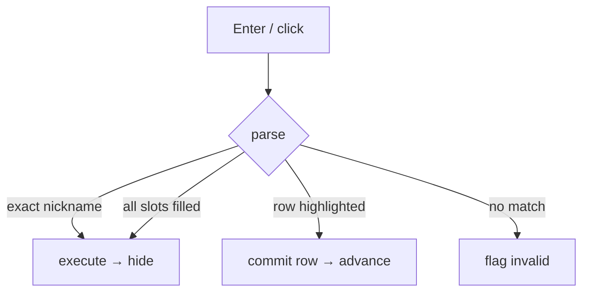

<!-- autobot-status
stage: 3
iteration: 0
gate: pending
updated: 2026-06-11
-->

# Autobot — Spotlight commit-model rebuild

## Premise

Rebuild the spotlight overlay ([spotlight_overlay.py](worktree-manager/worktree_manager/ui/spotlight_overlay.py))
around the **explicit commit-on-committable-action** model that
[filterable_combo.py](worktree-manager/worktree_manager/ui/filterable_combo.py) uses, replacing the
ghost-text / Tab-cycle machinery. Two problems today:

1. **Nickname execution intermittently shows "Unknown command".** Ghost-text makes Enter ambiguous — it
   sometimes commits a ghost suffix, sometimes executes, keyed off live ghost/MRU state. Parser + registry
   are sound (`projo1 → open_project → dev-tools` resolves in isolation); the bug is in the overlay's Enter
   dispatch.
2. **No mouse/keyboard parity.** You can't click a suggestion, and Up/Down navigates but never commits.

**The model (mirrors filterable_combo).** Up/Down or hover moves a highlight without committing. A
**committable action** — click or Enter — commits the highlighted suggestion as one token and advances to the
next slot. When the input fully resolves (all slots filled, a zero-slot keyword command, or an exact
nickname), **Enter executes** instead. Invalid free-typed text is flagged, never reverted. Ghost-text and
Tab-cycling are removed.

## Scope

- Rewrite overlay input handling: [_GhostLineEdit](worktree-manager/worktree_manager/ui/spotlight_overlay.py#L24),
  [_refresh](worktree-manager/worktree_manager/ui/spotlight_overlay.py#L107),
  [_commit_ghost](worktree-manager/worktree_manager/ui/spotlight_overlay.py#L131),
  [_handle_tab](worktree-manager/worktree_manager/ui/spotlight_overlay.py#L146),
  [_maybe_execute](worktree-manager/worktree_manager/ui/spotlight_overlay.py#L210),
  [eventFilter](worktree-manager/worktree_manager/ui/spotlight_overlay.py#L254).
- **Parser unchanged** — [action_parser.py](worktree-manager/worktree_manager/spotlight/action_parser.py)
  already returns everything needed (`suggestions`, `filter_text`, `slot_index`, `committed_args`,
  `executable`, `completion_kind`, `nickname_action_name`, `nickname_args`).
- **Registry/store unchanged** — [action_registry.py](worktree-manager/worktree_manager/spotlight/action_registry.py),
  [nickname_store.py](worktree-manager/worktree_manager/spotlight/nickname_store.py).

## Frontend Design

Frameless overlay, **two panes** (kept deliberately compact):

1. **Token input** — a single tag-input row holding the committed chips *and* the active-token cursor
   together. Chips sit inline; the editable tail after the last chip is the active token. This is the only
   input; there is no separate line edit below the chips.
2. **Suggestion list**, with the **caption folded onto the divider** above it (a right-aligned label on the
   separator line, not its own row).

So the whole overlay is: `[ chips… active▌ ]` / divider-with-caption / list / error label. That's two content
rows of chrome before the list, versus the four-row stack (chip bar + line edit + caption + list) a naive
layout would use.

**List caption** (on the divider). Names what you're picking, derived from the active slot of
`parse(input_string)` — root stage reads `COMMANDS`, a slot stage reads its friendly plural. Hidden when the
list is empty. Map (slot names grounded in [cli.py](worktree-manager/worktree_manager/cli.py)):

| slot name | caption |   | slot name | caption |
|-----------|---------|---|-----------|---------|
| (root keywords) / `cmd` | COMMANDS |   | `branch` | BRANCHES |
| `repo` | REPOS |   | `name` | PROJECTS |
| `worktree` | WORKTREES |   | `editor` | EDITORS |
| _(unmapped)_ | slot name uppercased |   | | |

**Chips** (inline in the input row). Committed tokens render as chips — `[command] [repo: dev-tools] [wt:
main] active▌` (keyword chip unlabelled, slot chips carry their name). **Click a chip to truncate the path
back to it**: later chips drop, that slot goes active, the list re-populates. The "linked-list of commands"
view.

**Overflow — the typing spot is never hidden.** When chips fill the width, the input row uses a **flow
layout that wraps chips onto additional lines**, and the **active-token cursor is always on the last line**,
never clipped. The row grows downward up to a cap (**3 lines**); past that it scrolls internally, keeping the
last line (cursor) in view. The suggestion list shrinks to give the input row that room, so the overlay's
total height stays bounded. Invariant: **the editable tail is always visible** — no chain length can push the
place you type off-screen.

**Source of truth.** The command is the parser input string (keyword + committed args, space-joined). Chips
and caption are *renders* of `parse()`; the editable tail of the input row holds only the active token.
Committing appends to the string; clicking chip *k* truncates to its first *k* tokens.

Legend: `▌` cursor (the active token's editable tail) · `▸` highlighted row (Up/Down/hover) · `[..]`
committed chip. Empty input row = no committed tokens yet.

> **All mocks depict the final two-pane state** (input row with inline chips, then caption-on-divider + list).
> Until the chip iteration ships (see Sequencing decision), early iterations render committed tokens as plain
> grey text in the input row instead of chips; content, caption, list, and Enter behaviour are otherwise
> identical. The caption rides the divider line, right-aligned.

### Empty — just opened (Ctrl+K)
No committed tokens; cursor at the start of the input row. List shows MRU labels first, then root keywords;
row 0 highlighted; caption reads COMMANDS.
```
┌──────────────────────────────── COMMANDS ──┐
│ ▌                                           │  ← input row (chips + active token)
│ ▸ project dev-tools                         │     MRU (most-recent first)
│   command HomeLog main build                │
│   project                                   │     root keywords
│   command                                   │
│   switch branch                             │
│   …                                         │
└─────────────────────────────────────────────┘
```

### Typing filters the active token
Contains-match, case-insensitive (same as filterable_combo's completer). No commit on keystroke; highlight
snaps to row 0 of the filtered set.
```
┌──────────────────────────────── COMMANDS ──┐
│ comm▌                                       │  ← active token: "comm"
│ ▸ command                                   │
│   command HomeLog main build                │     MRU rows that still match
└─────────────────────────────────────────────┘
```

### Up/Down or hover moves the highlight (no commit)
```
┌──────────────────────────────── COMMANDS ──┐
│ comm▌                                       │  ← input row unchanged
│   command                                   │
│ ▸ command HomeLog main build                │  ← Down moved highlight only
└─────────────────────────────────────────────┘
```

### Committable action → commit the highlighted token, advance
Enter/click on `command` commits it as the first chip inline; the cursor moves to the new active token; the
list shows the next slot (`repo`) and the caption switches to REPOS.
```
┌─────────────────────────────────── REPOS ──┐
│ [command] ▌                                 │  ← first chip + active token (repo)
│ ▸ dev-tools                                 │
│   HomeLog                                   │
│   Proj1                                     │
└─────────────────────────────────────────────┘
```

### Walking through the slots
Each Enter/click commits the highlighted candidate as an inline chip and advances. Here the 3rd slot (`cmd`)
is active after `command`, `dev-tools`, `main` were committed.
```
┌─────────────────────────────── COMMANDS ──┐
│ [command] [repo: dev-tools] [wt: main] ▌   │  ← three chips + active token (cmd)
│ ▸ build                                    │
│   test                                     │
│   lint                                     │
└────────────────────────────────────────────┘
  click [repo: dev-tools] → drop wt+cmd chips, re-pick repo
```

### Long chain → chips wrap, cursor stays visible
When chips fill the width they wrap onto more lines (flow layout); the active-token cursor is always on the
last line. The input row grows down to a 3-line cap, then scrolls internally; the list shrinks to fit. The
typing spot can never be pushed off-screen.
```
┌─────────────────────────────── COMMANDS ──┐
│ [command] [repo: dev-tools]                │  ← chips wrap to a 2nd line…
│ [worktree: feature-branch] buil▌           │  ← …cursor always on the last line
│ ▸ build                                    │     (list shrinks to make room)
│   test                                     │
└────────────────────────────────────────────┘
```

### Complete command → Enter executes
Every slot committed, list empty, caption hidden (no list), input runnable. Enter executes and closes. (A
zero-slot keyword command — e.g. `manage_nicknames` via `nicknames` — is complete the moment its keyword chip
is committed.)
```
┌────────────────────────────────────────────────┐
│ [command] [repo: dev-tools] [wt: main] [cmd: build] ▌ │  ← all chips committed
│ (list empty — caption hidden)                  │
└────────────────────────────────────────────────┘
        Enter → execute → overlay hides
```

### Exact nickname → Enter executes immediately
A single typed token exactly matching a saved nickname is complete on its own — no chip is committed, the
token stays in the input row. **This is the path that was broken.**
```
┌──────────────────────────────── COMMANDS ──┐
│ projo1▌                                     │  ← active token = exact nickname
│ ▸ projo1                                    │  ← exact nickname (open_project · dev-tools)
└─────────────────────────────────────────────┘
        Enter → run open_project{name: dev-tools} → hide
```

### Invalid free-typed text → flag, don't revert
Active token matches no candidate; Enter (or blur) flags the active token (red border via `invalid` style
property), keeps the text, does not execute — mirroring filterable_combo. Caption hidden (empty list).
```
┌────────────────────────────────────────────┐
│ [command] [repo: dev-tools] nonsuch▌        │  ← chips intact; red border on active token
│ (no matching option)                        │
└─────────────────────────────────────────────┘
  "No matching option" — pick from the list or fix the text
```

### Escape
Escape = close (unchanged). No ghost/nav state remains to cancel, so it no longer has filterable_combo's
"restore committed text" meaning.

---

**Resolved interaction rules** (answered with user):

1. **Backspace across a committed token** re-edits it: Backspace on an empty active token removes the trailing
   space, the previous token becomes active/editable, the list re-populates. *Mechanically just normal
   QLineEdit backspace — the prior token becomes the active partial and the next `_refresh` re-parses it; no
   special handling.*
2. **Single-click commits** a row immediately (same as Enter on it) — mirrors filterable_combo's `activated`.
3. **Tab removed** — does nothing. Enter and single-click are the only commit paths.

---

## Backend Design

The parser ([action_parser.py](worktree-manager/worktree_manager/spotlight/action_parser.py)) is the
business logic and is **unchanged**. What's redesigned is the overlay's **interaction state machine**: how
keystroke / Enter / click map onto the input string, and how that string renders. No new data model.

### State: one string is the truth

The overlay's only mutable state is the **input string** (keyword + committed args, space-joined, trailing
space iff the active token is empty). Everything visible is a pure function of `parse(input_string)`:

```
input_string ──parse()──▶ ParseResult
                            ├─ committed tokens  → inline chips (in the input row)
                            ├─ filter_text       → input row's active-token tail
                            ├─ slot_index/kind   → divider caption
                            ├─ suggestions       → list rows
                            └─ executable/kind    → Enter behaviour
```

The input row's editable tail holds only the active token, not the whole command — that conflation is what
made Enter ambiguous today. Committed tokens render as inline chips in the same row.

### The commit-vs-execute decision (the bug fix)

Single rule replacing all ghost/Tab/`_maybe_execute` branching. On **Enter** or **click**, `parse` and
branch — deterministic, driven only by the parser, never ghost/MRU side-state:

```
on_commit_or_execute(highlighted_row):
    r = parse(input_string)

    # 1. Exact nickname → execute stored action. (THE PATH THAT WAS BROKEN.)
    if r.completion_kind == "nickname" and r.nickname_action_name:
        run nickname → hide;  return

    # 2. Complete command → execute.  (action resolved AND no slots OR all slots committed)
    if r.action and r.executable and (not r.action.slots or r.slot_index == len(r.action.slots)):
        run r.action with r.committed_args → hide;  return

    # 3. Incomplete but a row is highlighted → COMMIT that row, advance.
    if r.suggestions and highlighted_row is not None:
        input_string = commit(highlighted_row);  refresh();  return

    # 4. Nothing to commit → flag invalid, keep text, do not run.
    set invalid; show "No matching option";  return
```



### `commit(row)` — append a token, advance a slot

Replace the active partial with the full row value, append a trailing space so the next slot goes active:

```
commit(row):
    base = input_string without its trailing filter_text   # strip active partial
    return base + row + " "
```

`refresh()` then re-parses: a new inline chip appears, the active-token tail clears, the list shows the next
slot's candidates (or empties when complete).

### Inline chip render — committed tokens → chips in the input row

Rebuilt on every `refresh()`. Keyword tokens → plain chips; committed slot args → `slot_name: value` chips,
each tagged with its token index. They paint *inline at the head of the input row*, with the active-token
editable tail after the last chip (one widget/row, not a separate chip bar):

```
render_chips(r):
    chips = [Chip(label=kw)                                     for kw in r.action.keywords]      # consumed keyword tokens
    chips += [Chip(label=f"{slot_name}: {value}", token_index=i) for slot_name, value in r.committed_args]  # in slot order
    input_row.set_chips(chips)          # chips sit before the editable active-token tail

on_chip_click(k):                       # click-to-jump-back
    input_string = first k tokens of input_string, space-joined, + trailing space
    refresh()                           # slot k goes active, list re-populates
```

Backspace on an empty active token does the same truncation mechanically (delete trailing space → previous
token becomes active partial → re-parse), so no special Backspace code is needed.

**Overflow.** The input row is a flow layout: chips wrap onto extra lines and the editable active-token tail
is always the last element, so it sits on the final line and is never clipped. The row's height grows to a
3-line cap, then scrolls internally to keep the last line visible; the list is given the remaining height.
**Invariant: the active-token tail is always visible regardless of chain length.**

### Divider caption render — "what am I picking?"

Rebuilt on every `refresh()` from the same parse result, no parser change. Painted as a right-aligned label
*on the divider line* between the input row and the list (not its own row). Friendly labels live in one
static map; an unmapped slot falls back to its name uppercased (never unlabelled — no silent gap):

```
SLOT_CAPTIONS = {repo: REPOS, worktree: WORKTREES, branch: BRANCHES,
                 cmd: COMMANDS, name: PROJECTS, editor: EDITORS}

caption(r):
    if r.suggestions is empty:                    hide caption;  return
    if r.action is None:                          return "COMMANDS"       # root keyword stage
    if r.slot_index < len(r.action.slots):
        return SLOT_CAPTIONS.get(slot_name, slot_name.upper())            # slot_name = active slot's name
    return "COMMANDS"                                                     # multi-keyword chain, no slot yet
```

### What is removed

Ghost/Tab/MRU-side-state machinery, deleted outright:

- [_GhostLineEdit](worktree-manager/worktree_manager/ui/spotlight_overlay.py#L24) (`paintEvent` ghost render,
  `set_ghost_text`/`ghost_text`) → plain `QLineEdit`.
- [_commit_ghost](worktree-manager/worktree_manager/ui/spotlight_overlay.py#L131),
  [_handle_tab](worktree-manager/worktree_manager/ui/spotlight_overlay.py#L146),
  [_tab_suffix](worktree-manager/worktree_manager/ui/spotlight_overlay.py#L202), the `_tab_cycle` field,
  `_longest_common_prefix`.
- The ghost branches inside [_refresh](worktree-manager/worktree_manager/ui/spotlight_overlay.py#L107) and
  [_maybe_execute](worktree-manager/worktree_manager/ui/spotlight_overlay.py#L210).

### Test impact (for iteration planning)

[test_spotlight_overlay_qt.py](worktree-manager/tests/test_spotlight_overlay_qt.py) is built on the
ghost/Tab model and gets **deleted or rewritten**: `test_enter_with_ghost_commits_only_does_not_execute`,
every `test_tab_*`, every `test_ghost_text_*`, `test_non_tab_key_does_not_commit_ghost`. Survivors (filter,
highlight, Escape, Enter-executes-complete, invalid-flag) are re-expressed against the commit model.
Iteration 0 establishes the new test file; later iterations layer caption, chips, click-to-jump.

### Sequencing decision

Neither inline chips nor the caption is in the walking skeleton. The commit/execute model + nickname fix ship
and are proven first, with committed tokens shown as plain grey text in the input row (today's look), so a
render issue can't block validating the core fix. **Caption** depends only on the list (exists from
Iteration 0) and can ship as its own small iteration. **Inline chips + click-to-jump-back** is a later
self-contained iteration changing only the *render* of already-committed tokens, not the state model.

### Invariants

- Enter is decided only by `parse(input_string)` — never ghost/MRU side-state.
- The input string is the sole source of truth; inline chips, caption, and active-token content all derive
  from it.
- The active-token tail is always visible: chips wrap (flow layout) with the cursor on the last line, the row
  caps at 3 lines then scrolls, and the list shrinks — no chain length hides the typing spot.
- No silent excepts: a failed `runner` or unknown action surfaces the error label, never a swallowed
  exception (per [[feedback_no_silent_exceptions]]).

---

## Iteration Plan

- Iteration 0 — Commit/execute overlay with nickname fix, mouse, invalid-flag & caption
- Iteration 1 — Inline chips + click-to-jump-back

### Iteration 0 — Commit/execute overlay with nickname fix, mouse, invalid-flag & caption
**Context file:** [Iteration 0 context](autobot-spotlight-commit-model-ctx-iter-0-commit-execute-2026-06-11.md)

## ✋ Manual Testing Gate — Iteration 0

> STOP. Do not proceed to Iteration 1 until every item is confirmed.

- [ ] Open the spotlight (Ctrl+K); the list shows MRU labels then root keywords, row 0 highlighted, with a
      caption above the list reading `COMMANDS`.
- [ ] Type to filter; Up/Down (and mouse hover) move the highlight without changing the typed text or
      committing.
- [ ] Press Enter on a highlighted keyword/slot row → it commits as a token (plain text, trailing space) and
      the list + caption advance to the next slot (e.g. caption `REPOS`, then `WORKTREES`).
- [ ] Walk a full multi-slot command (e.g. `command` → repo → worktree → cmd); when the last slot is committed
      the list empties and Enter executes the command, then the overlay closes.
- [ ] A zero-slot keyword command (e.g. `nicknames` → `manage_nicknames`) executes on Enter the moment its
      keyword is complete.
- [ ] **Nickname fix:** type an exact saved nickname (e.g. `projo1`) and press Enter → it runs the stored
      action with stored args and closes — no "Unknown command".
- [ ] **Mouse:** single-click a list row → it commits (or executes, if that completes the command) exactly as
      Enter would.
- [ ] **Invalid text:** type a token matching no candidate and press Enter → the input shows the red `invalid`
      border, the text is kept (not reverted), nothing executes, and an error line explains.
- [ ] Escape closes the overlay outright.
- [ ] Tab does nothing (no ghost, no cycle).

**Confirmed by user:** —
**How to confirm:** Check every box, then reply "Iteration 0 confirmed" or describe what failed.

### Implementation Ledger — Iteration 0
- `test_empty_input_shows_mru_then_keywords_row0_highlighted_caption_commands`: red → green ✓
- `test_typing_filters_active_token_line_edit_text_unchanged`: red → green ✓
- `test_up_down_moves_highlight_does_not_change_text`: red → green ✓
- `test_enter_on_keyword_row_commits_plain_text_with_trailing_space`: red → green ✓
- `test_enter_walks_every_slot_then_executes`: red → green ✓
- `test_enter_on_complete_zero_slot_keyword_executes_and_hides`: red → green ✓
- `test_enter_on_exact_nickname_runs_stored_action_and_hides`: red → green ✓
- `test_single_click_commits_like_enter`: red → green ✓
- `test_single_click_on_completing_row_executes`: red → green ✓
- `test_enter_on_unmatched_text_flags_invalid_keeps_text_shows_error`: red → green ✓
- `test_typing_after_error_clears_error`: red → green ✓
- `test_tab_does_nothing`: red → green ✓
- `test_caption_commands_at_root_stage`: red → green ✓
- `test_caption_slot_plural_at_slot_stage`: red → green ✓
- `test_caption_hidden_when_list_is_empty`: red → green ✓

### Iteration 1 — Inline chips + click-to-jump-back
**Context file:** [Iteration 1 context](autobot-spotlight-commit-model-ctx-iter-1-inline-chips-2026-06-11.md)

## ✋ Manual Testing Gate — Iteration 1

> STOP. Feature is complete when every item is confirmed.

- [ ] Committed tokens render as inline chips in the input row (keyword chip unlabelled; slot chips read
      `slot: value`), with the editable active-token cursor after the last chip.
- [ ] Clicking a chip truncates the path back to that point — later chips drop, that slot becomes active, and
      the list + caption re-populate for it.
- [ ] Backspace on an empty active token re-edits the previous token (it becomes the active partial and the
      list re-populates), matching the click-to-jump behaviour.
- [ ] **Overflow:** build a long chain so chips exceed one row → chips wrap onto more lines, the cursor stays
      on the last line and is always visible, the row caps at 3 lines then scrolls, and the list shrinks.
- [ ] **Regression — Enter dispatch still works:** commit/advance through slots, execute a complete command,
      and execute an exact nickname all still behave exactly as in Iteration 0.
- [ ] **Regression — mouse/invalid/caption still work:** single-click commits a row, invalid text flags the
      red border without reverting, the caption still names the active slot, and Escape still closes.

**Confirmed by user:** —
**How to confirm:** Check every box, then reply "Iteration 1 confirmed" or describe what failed.
