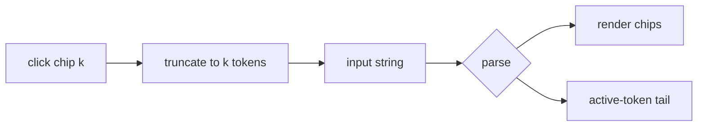

# Context: Iteration 1 — Inline chips + click-to-jump-back

## Goal
Replace the plain-text committed tokens from Iteration 0 with **inline chips** rendered at the head of the
input row, the editable active-token tail after the last chip. Clicking a chip truncates the path back to
that point. When chips overflow the width they wrap, with the cursor always on the last line — the typing
spot is never hidden. This changes only the *render* of already-committed tokens and adds click-to-jump; the
state model (the input string) and the Enter/click dispatch from Iteration 0 are untouched.

## Tests to write
- committed tokens render as inline chips: a keyword chip (unlabelled) and slot chips labelled `slot: value`, in order.
- the active-token text sits after the last chip and stays editable.
- clicking chip k truncates the input string to its first k tokens (+ trailing space) and re-parses: later chips drop, slot k goes active, list + caption re-populate.
- backspace on an empty active token truncates the last committed token the same way (it becomes the active partial).
- committing a row adds exactly one new chip and clears the active-token tail.
- overflow: a long chain wraps chips onto multiple lines and the active-token tail remains on the last line (assert the editable widget is the last child / is visible).
- the input row height is capped (does not grow unbounded); beyond the cap it scrolls rather than growing.

## Files to touch
- [spotlight_overlay.py](worktree-manager/worktree_manager/ui/spotlight_overlay.py) — replace the plain
  `QLineEdit` with a chip-input row widget: a flow/horizontal container holding chip widgets followed by an
  editable tail (`QLineEdit`). Render chips from the parse result on every refresh; wire chip clicks to
  truncate; cap height + wrap + scroll.
- [test_spotlight_overlay_qt.py](worktree-manager/tests/test_spotlight_overlay_qt.py) — add the chip /
  click-to-jump / overflow tests; keep all Iteration 0 behavioural tests green (regression).

## Design / pseudocode

#### `worktree_manager/ui/spotlight_overlay.py`
```
# The input row becomes: [chip][chip]… <editable tail>.  The input STRING is still the source of truth;
# the tail's text is the active token; chips are a render of the committed tokens.

render_input_row(r, text):
    chips = []
    consumed = len(r.action.keywords) if r.action else 0     # keyword tokens consumed
    for kw in (r.action.keywords if r.action else []):  chips += [Chip(label=kw, token_index=<kw idx>)]
    for i, (slot_name, value) in enumerate(r.committed_args.items()):
        chips += [Chip(label=f"{slot_name}: {value}", token_index=consumed + i)]
    input_row.set_chips(chips)             # tail keeps r.filter_text as the active token
    # tail is always the last widget -> always on the last wrapped line, never clipped

on_chip_click(token_index k):
    toks = text.split()
    text = " ".join(toks[:k]) + " "        # truncate to first k tokens + trailing space
    refresh(text); focus tail

# Overflow: flow layout wraps chips; tail is last. Row height = min(content, 3 lines); past that the row
# scrolls so the last line (tail) stays visible. List height = remaining space (it shrinks).

# Backspace handling: on an empty active tail, let the keystroke remove the trailing space so the previous
# token becomes the active partial, then refresh — same effect as clicking the last committed chip.
```

## Diagrams


## Relevant existing code
After Iteration 0, the overlay already has: `parse`-driven `commit_or_execute()`, `commit(text,row)` that
appends `row + " "`, `refresh(text)`, `render_caption(r)`, `set_invalid(flag)`, single-click handling, and
the `SLOT_CAPTIONS` map. **Reuse them unchanged.** This iteration only swaps the plain `QLineEdit` for the
chip-input row and adds `render_input_row` + `on_chip_click`.

Parser fields used here (UNCHANGED —
[action_parser.py](worktree-manager/worktree_manager/spotlight/action_parser.py)):
`r.action.keywords` (consumed keyword tokens), `r.committed_args` (ordered slot args), `r.filter_text`
(active token). `ActionSpec.keywords` / `ArgSlot.name` from
[action_registry.py](worktree-manager/worktree_manager/spotlight/action_registry.py).

## Constraints / invariants
- The input string stays the sole source of truth; chips + tail + caption all derive from `parse(text)`.
- **The active-token tail is always visible** regardless of chain length: chips wrap (flow layout) with the
  tail last, the row caps at 3 lines then scrolls, and the list shrinks. This is the hard invariant for this
  iteration.
- Clicking chip k and Backspace-on-empty-tail produce the *same* truncation — keep one shared code path.
- Do not touch the parser/registry/store, and do not change the Enter/click dispatch from Iteration 0.
- No silent excepts (see [[feedback_no_silent_exceptions]]).
- Tk 9 / macOS scroll note: if a scrollable container is used for overflow, this is PySide6/Qt (not
  Tkinter), so the `attach_scroll_fix` guidance does not apply here.

## Done when (gate items)
- [ ] Committed tokens render as inline chips (keyword unlabelled; slots `slot: value`) with the editable tail after the last chip.
- [ ] Clicking a chip truncates the path back to it; later chips drop, that slot goes active, list + caption re-populate.
- [ ] Backspace on an empty active token re-edits the previous token (matches click-to-jump).
- [ ] Long chain: chips wrap, cursor stays on the last line and always visible, row caps at 3 lines then scrolls, list shrinks.
- [ ] Regression: commit/advance, execute-complete, and exact-nickname execution still behave as Iteration 0.
- [ ] Regression: single-click commit, invalid red-border (no revert), caption naming, and Escape-closes still work.

## TDD mode: <set when built>
