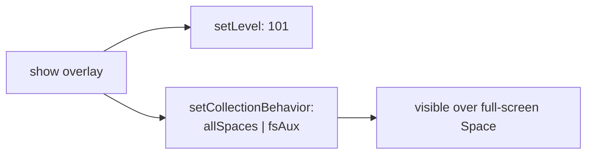
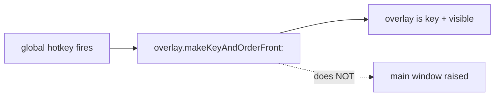

<!-- autobot-status
stage: 7
iteration: 1
gate: confirmed
updated: 2026-06-13
-->

# Autobot — Spotlight as a true floating overlay (no app raise, visible everywhere)

The global Spotlight shortcut works, but two behaviors are wrong vs. real macOS Spotlight:

1. **Main window gets raised.** Opening Spotlight via the global shortcut brings the worktree-manager **main window** to the front in front of other apps. Spotlight should be a *totally separate floating window* — opening it must not surface the main window.
2. **Not visible over full-screen apps / not everywhere.** When you're in a full-screen app (its own Space), the overlay does not appear. Real Spotlight floats above *every* Space, including full-screen apps.

## Decisions captured
- **Activation:** Overlay only — show the floating overlay over whatever is focused **without** activating the app or raising the main window. (Like real Spotlight.)
- **On dismiss / after running a command:** Stay out of the way — just hide the overlay, do **not** raise the main window; the previously-focused app stays focused.
- **Platform:** macOS for the all-Spaces / full-screen behavior (collection behavior + window level). Non-macOS is a graceful no-op (existing behavior).

## Root-cause analysis (grounding the design)

Current overlay: [spotlight_overlay.py](worktree-manager/worktree_manager/ui/spotlight_overlay.py) is created `parent=None` with `Qt.FramelessWindowHint | Qt.Tool | Qt.WindowStaysOnTopHint`, and `show_centered_over` sets `NSStatusWindowLevel` (101) then calls `self.activateWindow()` + `self.raise_()`. Wiring: [_open_spotlight](worktree-manager/worktree_manager/cli.py#L642) calls [show_centered_over](worktree-manager/worktree_manager/ui/spotlight_overlay.py#L171).

- **Why the main window raises (Issue 1):** For a Qt window to take key focus on macOS when the app is in the background, the *application* must activate. Qt's `activateWindow()`/`show()` on a background app triggers app activation (`NSApp activateIgnoringOtherApps:`), and **app activation raises all ordered app windows**, including the main window. So the act of giving the overlay focus drags the main window forward. The fix is to make the overlay key/focused **without** a full app activation that re-orders the main window — i.e. order the overlay's `NSWindow` front as a key window directly, and keep the main window out of that ordering.

- **Why it's not visible over full-screen apps (Issue 2):** Window *level* 101 alone is not enough. macOS keeps a window on its origin Space unless its `NSWindow.collectionBehavior` includes `canJoinAllSpaces` (so it appears on every Space) and `fullScreenAuxiliary` (so it may float over a window that is in full-screen mode). Without these, the overlay only shows on the Space where the app lives, never over a full-screen app's Space.

## Frontend Design

This feature changes *behavior*, not layout — the overlay UI is unchanged. The states below describe the observable behavior across contexts.

### State A — Triggered from another app (windowed), app in background
```
 ┌─ Some other app (stays focused underneath) ─────────────┐
 │                                                          │
 │            ┌────────────────────────────────┐           │
 │            │ > _                             │  ← Spotlight overlay
 │            │ ──────────────────────────────  │    (floats, has key focus)
 │            │  COMMANDS                        │           │
 │            │  new worktree …                  │           │
 │            └────────────────────────────────┘           │
 └──────────────────────────────────────────────────────────┘
   main worktree-manager window: NOT raised, stays where it was
```

### State B — Triggered while inside a FULL-SCREEN app
```
 ╔═ Full-screen app (its own Space) ═══════════════════════╗
 ║                                                          ║
 ║            ┌────────────────────────────────┐           ║
 ║            │ > _                             │  ← overlay appears
 ║            │  COMMANDS                        │    OVER the full-screen Space
 ║            └────────────────────────────────┘           ║
 ╚══════════════════════════════════════════════════════════╝
   real-Spotlight behavior: overlay visible on every Space
```

### State C — After running a command, or pressing Esc
```
 ┌─ Previously-focused app regains focus ──────────────────┐
 │  (overlay hidden; main window NOT raised)                │
 └──────────────────────────────────────────────────────────┘
```

### State D — Triggered while the main window IS the focused/front app
```
 ┌─ Main worktree-manager window (already front) ──────────┐
 │            ┌────────────────────────────────┐           │
 │            │ > _                             │  ← overlay over its own window
 │            └────────────────────────────────┘           │
 └──────────────────────────────────────────────────────────┘
   unchanged from today; overlay centers over the main window
```

## Backend Design

### Concept 1 — All-Spaces / full-screen collection behavior (the Issue 2 fix)

Extend the existing macOS objc bridge in [spotlight_overlay.py](worktree-manager/worktree_manager/ui/spotlight_overlay.py#L23) (it already calls `objc_msgSend` for `setLevel:`) with a sibling that sets the overlay `NSWindow`'s collection behavior so it joins all Spaces and may float over full-screen apps.

```
NSWindowCollectionBehaviorCanJoinAllSpaces    = 1 << 0   # 0x1
NSWindowCollectionBehaviorFullScreenAuxiliary = 1 << 8   # 0x100

set_collection_behavior(widget, mask):       # macOS only, no-op elsewhere
    ns_window = NSView(widget.winId()).window
    objc_msgSend(ns_window, "setCollectionBehavior:", mask)   # takes NSUInteger
```

Apply `canJoinAllSpaces | fullScreenAuxiliary` to the overlay every time it is shown, right next to the existing `setLevel:` call. Keep level 101 (`NSStatusWindowLevel`/popup) — level + collection behavior together produce real-Spotlight visibility.



### Concept 2 — Focus the overlay without raising the main window (the Issue 1 fix)

Today `show_centered_over` calls `self.activateWindow()` (Qt) which, for a background app, provokes a full app activation that re-orders **all** app windows. Replace that with an objc path that makes **only the overlay's `NSWindow`** the key+front window:

```
order_front_as_key(widget):                  # macOS only, no-op elsewhere
    ns_window = NSView(widget.winId()).window
    objc_msgSend(ns_window, "makeKeyAndOrderFront:", nil)
```

`makeKeyAndOrderFront:` on the single overlay window orders **only that window** front and makes it key — it does **not** raise sibling windows (the main window). On macOS this is what real accessory panels do. We still keep the Qt `self.show()` + `self._edit.setFocus()` so the line-edit receives typing.

- Because the overlay is `Qt.Tool` + `WindowStaysOnTopHint` + level 101 + all-Spaces, ordering just it front is sufficient for it to be visible and typeable.
- We **drop** `self.activateWindow()` and `self.raise_()` from the show path on macOS (they are what dragged the main window forward). On non-macOS we keep `activateWindow()`/`raise_()` (unchanged behavior).



### Concept 3 — Dismiss stays out of the way

The overlay already only calls `self.hide()` on Esc / after executing an action (see [_execute_result](worktree-manager/worktree_manager/ui/spotlight_overlay.py#L262) and the `eventFilter` Esc branch at [spotlight_overlay.py:347](worktree-manager/worktree_manager/ui/spotlight_overlay.py#L347)). It does **not** raise the main window — so dismiss behavior is already correct and we add no main-window raise. We only verify (regression gate) that nothing we add raises it. macOS returns focus to the previously-key app automatically when the overlay hides.

### API verification (macOS objc / collection behavior) — VERIFIED 2026-06-13

- Selectors `setCollectionBehavior:`, `makeKeyAndOrderFront:`, `setLevel:`, `window` all resolve via `sel_registerName` on this machine. ✓
- Constants confirmed directly from the SDK header `MacOSX.sdk/.../AppKit.framework/Headers/NSWindow.h`:
  - `NSWindowCollectionBehaviorCanJoinAllSpaces = 1 << 0` → **0x1** ✓
  - `NSWindowCollectionBehaviorFullScreenAuxiliary = 1 << 8` → **0x100** ✓
  - Combined mask for the overlay = **0x101**.
  - Header note: `FullScreenAuxiliary` windows "can be shown with the fullscreen window" — exactly the Issue 2 requirement.

Remaining checks live in the manual gate (actual Space/full-screen visibility is OS-level). Unit tests assert the objc bridge is **invoked with the right selector + arguments** (e.g. `setCollectionBehavior:` with `0x101`; `makeKeyAndOrderFront:` on the overlay) — the only deterministically testable surface.

## Iteration Plan

- Iteration 0 — Stop raising the main window (overlay-only focus)
- Iteration 1 — Visible over all Spaces and full-screen apps

### Iteration 0 — Stop raising the main window (overlay-only focus)
**Context file:** [Iteration 0 context](autobot-spotlight-floating-overlay-ctx-iter-0-overlay-only-focus-2026-06-13.md)

## ✋ Manual Testing Gate — Iteration 0

> STOP. Do not proceed to Iteration 1 until every item is confirmed.

- [x] Focus a different app (e.g. browser), with the worktree-manager main window visible but behind. Press the global Spotlight shortcut: the overlay appears and accepts typing, and the **main window does NOT come to the front** (it stays behind the other app).
- [x] Minimize the main window, switch to another app, press the shortcut: the overlay appears; the main window stays minimized (is not un-minimized/raised).
- [x] Type a command and run it (or press Esc): the overlay hides and the **main window is still not raised** — the previously-focused app stays in front.
- [x] Regression: with the main worktree-manager window already focused/front, press the shortcut — the overlay still centers over it and works exactly as before.
- [x] Regression: the in-focus `QShortcut` path and the existing Spotlight typing/commands all still work.

**Confirmed by user:** 2026-06-13
**How to confirm:** Check every box, then reply "Iteration 0 confirmed" or describe what failed.

### Implementation Ledger — Iteration 0
- `test_make_key_and_order_front_calls_objc_with_overlay_window`: red → green ✓
- `test_show_does_not_call_qt_activate_on_macos`: red → green ✓
- `test_show_uses_qt_activate_off_macos`: red → green ✓
- `test_show_still_focuses_line_edit`: red → green ✓
- (revision — non-activating panel) `test_overlay_marked_nonactivating_panel_on_macos`: red → green ✓
- (revision — non-activating panel) `test_panel_style_not_set_off_macos`: red → green ✓
- (revision 2 — TimeControl recipe) consolidated into `_configure_macos_overlay_window`; tests renamed:
  - `test_configure_macos_overlay_window_called_on_macos`: green ✓
  - `test_show_does_not_call_qt_activate_on_macos`: green ✓
  - `test_show_uses_qt_activate_off_macos`: green ✓
  - `test_show_still_focuses_line_edit`: green ✓
- (revision 3 — ROOT CAUSE) `setHidesOnDeactivate: NO`. Qt.Tool panels default
  `hidesOnDeactivate=YES`, so AppKit auto-hid the overlay the instant the app was not
  frontmost — exactly the "works minimized, fails in background" asymmetry. Verified
  empirically: panel stays `visible=True` after app deactivation. 55 spotlight tests green.

**Iteration 0 + Iteration 1 both confirmed by user 2026-06-13. Final full suite: 1905 passed, 0 failed.**

### Iteration 1 — Visible over all Spaces and full-screen apps
**Context file:** [Iteration 1 context](autobot-spotlight-floating-overlay-ctx-iter-1-all-spaces-fullscreen-2026-06-13.md)

## ✋ Manual Testing Gate — Iteration 1

> STOP. Do not proceed until every item is confirmed.

- [x] Enter a full-screen app (e.g. a browser or editor in macOS full-screen, on its own Space). Press the global Spotlight shortcut: the overlay **appears over the full-screen app** and accepts typing (like real Spotlight).
- [x] Run a command or press Esc from within the full-screen Space: the overlay hides and you remain in the full-screen app.
- [x] Switch to a different Space (e.g. a second desktop) and press the shortcut: the overlay appears there too (joins all Spaces).
- [x] Regression (Iteration 0): triggering over the full-screen app or another Space still does **not** raise the main window.
- [x] Regression: with the main window focused (windowed, not full-screen), the overlay still centers over it and works as before.

> Note: Iteration 1's behavior (`collectionBehavior = canJoinAllSpaces | fullScreenAuxiliary`, `.floating` level) was implemented as part of Iteration 0's consolidated `_configure_macos_overlay_window` (the TimeControl recipe), so no separate code change was needed.

**Confirmed by user:** 2026-06-13
**How to confirm:** Check every box, then reply "Iteration 1 confirmed" or describe what failed.

---
📁 **Autobot files** · [main doc](autobot-spotlight-floating-overlay-2026-06-13.md) · [iter 0 context](autobot-spotlight-floating-overlay-ctx-iter-0-overlay-only-focus-2026-06-13.md) · [iter 1 context](autobot-spotlight-floating-overlay-ctx-iter-1-all-spaces-fullscreen-2026-06-13.md)
