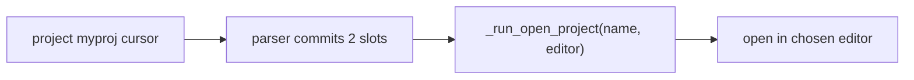

<!-- autobot-status
stage: 7
iteration: 0
gate: confirmed
updated: 2026-06-13
-->

# Autobot — Spotlight `project` editor token

Make the spotlight `project` command take the editor as a required 3rd token
(`project <project_name> <cursor|vscode>`), and remove the separate
`settings project editor <cursor|vscode>` default-editor setting.

## Frontend Design

No UI. This is spotlight command-grammar wiring only — the spotlight overlay
renders slot suggestions generically from each `ActionSpec`'s slots, so adding a
slot needs no UI changes. Skipped per autobot convention.

## Backend Design

### Two affected spotlight actions

Both live in [cli.py `_init_spotlight`](worktree-manager/worktree_manager/cli.py#L133-L161).

```
open_project          keyword "project"   slots: [name]            ← add editor slot
set_project_editor    keywords "settings project editor"  slot: [editor]  ← REMOVE entirely
```

### Change 1 — `open_project` gains a required editor slot

Today `_run_open_project` reads the stored `project_editor` pref:

```
def _run_open_project(args):
    name = args["name"]
    editor = self._store.get_ui_pref("project_editor", "cursor")   # ← remove this line
    self._wp_vm.open_project(name, editor)
```

After: the editor comes from the parsed 2nd slot. The action is not executable
until BOTH slots are committed (editor required — no default fallback).

```
def _run_open_project(args):
    self._wp_vm.open_project(args["name"], args["editor"])

ActionSpec(
    name="open_project",
    keywords=["project"],
    slots=[
        ArgSlot(name="name",   candidates=<existing project names>),
        ArgSlot(name="editor", candidates=lambda prev: ["cursor", "vscode"]),
    ],
    runner=_run_open_project,
    description="Open a workspace project",
)
```

The parser ([action_parser.py](worktree-manager/worktree_manager/spotlight/action_parser.py#L137-L161))
already handles multi-slot actions: it commits slots left-to-right and only sets
`executable=True` once every slot is committed. So `project myproj` (2 tokens)
stays non-executable and keeps suggesting `cursor`/`vscode`; `project myproj cursor`
becomes executable. No parser change needed — only the spec gains a slot.

### Change 2 — remove `set_project_editor`

Delete the entire `_run_set_project_editor` runner and its `ActionSpec`
registration ([cli.py:149-161](worktree-manager/worktree_manager/cli.py#L149-L161)).
This drops the `settings project editor <cursor|vscode>` command from spotlight.

### Stored-data note

The removed setting wrote a `project_editor` key via
[`set_ui_pref`](worktree-manager/worktree_manager/config_store.py#L85). After this
change nothing reads that key. Any value already in a user's config is **orphaned
but harmless** — it is simply ignored. No migration or config rewrite is performed,
so there is no destructive change to persisted data.

> **Three independent editor keys exist — only one is removed:**
>
> | Key | Read by | Written by | Touched? |
> |-----|---------|-----------|----------|
> | `editor` | Diff UI ([diff_vm.py:109](worktree-manager/worktree_manager/diff_vm.py#L109)) | Settings panel ([settings_panel.py:105](worktree-manager/worktree_manager/ui/settings_panel.py#L105)) | No |
> | `projects_editor` | Projects panel radios ([workspace_projects_panel.py:32](worktree-manager/worktree_manager/ui/workspace_projects_panel.py#L32)) | Projects panel ([:80](worktree-manager/worktree_manager/ui/workspace_projects_panel.py#L80)) | No |
> | `project_editor` | spotlight `project` cmd only ([cli.py:135](worktree-manager/worktree_manager/cli.py#L135)) | `set_project_editor` only ([cli.py:150](worktree-manager/worktree_manager/cli.py#L150)) | **Removed** |
>
> The diff UI reads `editor` (set from the Settings panel) — a different key,
> completely untouched. Removing `project_editor` does not affect it.

### Flow after change



## Iteration Plan

- Iteration 0 — `project <name> <editor>` token, default-editor setting removed

### Iteration 0 — `project <name> <editor>` token, default-editor setting removed
**Context file:** [Iteration 0 context](autobot-spotlight-project-editor-token-ctx-iter-0-project-editor-token-2026-06-13.md)

## ✋ Manual Testing Gate — Iteration 0

> STOP. The feature is done when every item is confirmed.

- [x] In spotlight, type `project ` — after picking a project name, the next slot suggests `cursor` and `vscode`.
- [x] `project <name>` alone (2 tokens) is NOT executable — Enter does nothing / no project opens until an editor is chosen.
- [x] `project <name> cursor` opens that project in Cursor; `project <name> vscode` opens it in VS Code.
- [x] Typing `settings project editor` no longer offers/runs a set-default-editor command (the command is gone).
- [x] Regression: typing `settings` still opens the Settings dialog, and its "Default editor" dropdown still controls the diff UI's editor.
- [x] Regression: a project nickname (e.g. `proji`) created before this change still launches the project (in Cursor) instead of doing nothing/erroring.

**Confirmed by user:** 2026-06-13
**How to confirm:** Check every box, then reply "Iteration 0 confirmed" or describe what failed.

### Implementation Ledger — Iteration 0
- opening a project passes the cursor editor token to the vm (`test_enter_invokes_open_project_on_workspace_vm`, updated): red → green ✓
- opening a project passes the vscode editor token to the vm (`test_project_with_vscode_editor_invokes_open_project_with_vscode`): red → green ✓
- a project command with only the name and no editor is not executable (`test_project_name_only_is_not_executable`): red → green ✓
- after committing the project name the editor slot offers cursor and vscode (`test_after_project_name_editor_slot_offers_cursor_and_vscode`): red → green ✓
- the set-default-editor command is no longer registered (`test_set_default_editor_command_is_not_registered`): red → green ✓
- the settings command still opens the settings dialog (`test_settings_alone_still_opens_settings_dialog`): red → green ✓
- a legacy project nickname with no stored editor still opens (defaults to cursor) instead of raising (`test_legacy_nickname_without_editor_opens_in_cursor`): red → green ✓
