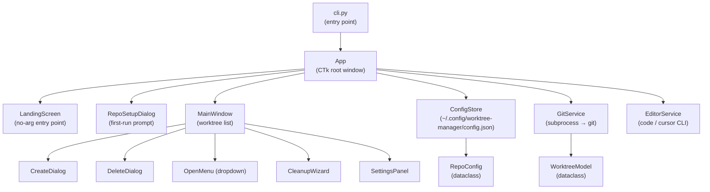
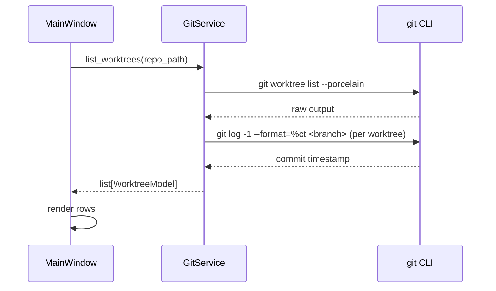
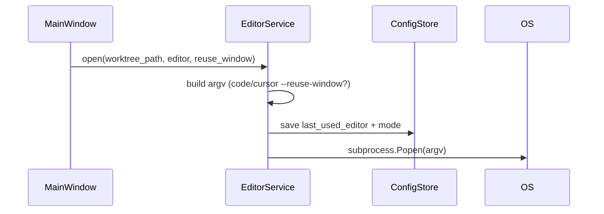

# Git Worktree Manager

## Overview

A macOS desktop app built with Python + customtkinter that provides a minimal-click UI for managing git worktrees. It can be launched from the terminal with an optional path to a main git repo; if no path is given, a landing screen lets the user select one. Once a repo is loaded it lets the user create, open, and delete worktrees and their associated branches, open them in VS Code or Cursor (new window or reuse window), and keep the worktree/branch list tidy through prompted cleanup of merged and stale branches. Per-repo configuration (worktree storage location, editor preferences, stale threshold) is stored in `~/.config/worktree-manager/config.json`.

---

## UI / Flow

### Launch flow — no argument provided

```
┌─────────────────────────────────────────────────┐
│  Git Worktree Manager                           │
│─────────────────────────────────────────────────│
│                                                 │
│         No repo loaded.                         │
│                                                 │
│              [Select Repo…]                     │
│                                                 │
│  Recent repos:                                  │
│  • ~/repos/my-project                    [Open] │
│  • ~/repos/other-project                 [Open] │
│                                                 │
└─────────────────────────────────────────────────┘
```

- [Select Repo…] opens a native folder-picker dialog; the chosen path is validated as a git repo before proceeding
- Recent repos are drawn from previously loaded repos in config, sorted by last opened; clicking [Open] loads that repo directly
- If the path is not a valid git repo an inline error is shown: "Not a git repository — please select a folder that contains a .git directory."

---

### Launch flow — first time seeing a repo

```
┌─────────────────────────────────────────────────┐
│  Git Worktree Manager                           │
│  Repo: ~/repos/my-project                       │
│─────────────────────────────────────────────────│
│                                                 │
│  First time here! Where should worktrees        │
│  for "my-project" be stored?                    │
│                                                 │
│  Storage path:  [~/repos/my-project-worktrees_] │
│                                          [Browse]│
│                                                 │
│                              [Cancel]  [Confirm] │
└─────────────────────────────────────────────────┘
```

Pre-fills `<parent-of-repo>/<repo-name>-worktrees` as the default. User can edit or Browse. Confirm saves to config and opens the main window.

---

### Main window — normal state

```
┌──────────────────────────────────────────────────────────────┐
│  Git Worktree Manager          my-project          [⚙]  [🧹] │
│──────────────────────────────────────────────────────────────│
│  Worktrees                                    [+ New]        │
│──────────────────────────────────────────────────────────────│
│  ● main (main)                          [Open][▾]  [✕]       │
│  ○ feature/auth      2h ago            [Open][▾]  [✕]       │
│  ○ fix/login-bug     3d ago            [Open][▾]  [✕]       │
│  ○ chore/deps        31d ago  ⚠ stale  [Open][▾]  [✕]       │
│──────────────────────────────────────────────────────────────│
│  ● = main worktree (always present, cannot delete)           │
│  ○ = linked worktree                                         │
└──────────────────────────────────────────────────────────────┘
```

- Each row shows: status dot, branch name, last commit age, optional stale warning, split Open button, Delete button
- Clicking `[Open]` directly opens with the last-used editor+mode (one click, no submenu)
- Clicking `[▾]` opens the submenu to pick a different editor or mode
- Main worktree row has no Delete button
- `[+ New]` opens the Create dialog
- `[⚙]` opens Settings
- `[🧹]` opens the Cleanup wizard

---

### Create worktree dialog

```
┌─────────────────────────────────────────────────┐
│  New Worktree                                   │
│─────────────────────────────────────────────────│
│  Branch name:  [feature/____________]           │
│                                                 │
│  Base branch:  [main              ▾]            │
│                                                 │
│  ☑ Open after creating                         │
│    ○ VS Code — new window                       │
│    ○ VS Code — reuse window                     │
│    ○ Cursor  — new window                       │
│    ● Cursor  — reuse window                     │
│                                                 │
│                              [Cancel]  [Create] │
└─────────────────────────────────────────────────┘
```

- Branch name is the only required typed input; folder name is auto-derived (`<storage-path>/<branch-slug>`)
- Base branch defaults to main; dropdown lists local branches
- "Open after creating" defaults to last-used editor+mode (remembered in config)
- [Create] is enabled as soon as branch name is non-empty and unique

---

### Open submenu (dropdown on each row)

```
  ┌─────────────────────────┐
  │ VS Code — new window    │
  │ VS Code — reuse window  │
  │─────────────────────────│
  │ Cursor  — new window    │
  │ Cursor  — reuse window  │
  └─────────────────────────┘
```

Clicking any item launches the editor immediately with no further prompts.

---

### Delete confirmation dialog

```
┌─────────────────────────────────────────────────┐
│  Delete worktree?                               │
│─────────────────────────────────────────────────│
│  Branch:   feature/auth                         │
│  Path:     ~/repos/my-project-worktrees/        │
│            feature-auth                         │
│                                                 │
│  ☑ Also delete branch                          │
│                                                 │
│                              [Cancel]  [Delete] │
└─────────────────────────────────────────────────┘
```

---

### Cleanup wizard

```
┌──────────────────────────────────────────────────────────────┐
│  Cleanup Wizard                                              │
│──────────────────────────────────────────────────────────────│
│  The following worktrees are candidates for removal:         │
│                                                              │
│  ☑  chore/deps      31d, no commits  (stale)                 │
│  ☑  fix/old-bug     merged into main                         │
│  ☐  feature/wip     28d, no commits  (almost stale)          │
│                                                              │
│  ☑ Also delete their branches                               │
│                                                              │
│         [Select All]  [Deselect All]  [Cancel]  [Delete Selected]│
└──────────────────────────────────────────────────────────────┘
```

- Pre-checks clearly stale/merged items; leaves borderline items unchecked
- User must click Delete Selected — nothing is removed automatically

---

### Settings panel

```
┌─────────────────────────────────────────────────┐
│  Settings — my-project                          │
│─────────────────────────────────────────────────│
│  Worktree storage:  [~/repos/my-project-wt_]    │
│                                          [Browse]│
│                                                 │
│  Stale threshold:   [30] days                   │
│                                                 │
│  Default editor:    [Cursor  — reuse window  ▾] │
│                                                 │
│                                          [Save] │
└─────────────────────────────────────────────────┘
```

---

## Architecture

### Component diagram



### Data flow — list worktrees



### Data flow — open in editor



### Key models

```python
@dataclass
class WorktreeModel:
    path: str
    branch: str
    is_main: bool
    last_commit_ts: int   # unix timestamp, 0 if no commits
    is_merged: bool
    is_stale: bool        # last_commit_ts older than threshold

@dataclass
class RepoConfig:
    repo_path: str
    worktree_storage: str
    stale_days: int          # default 30
    last_editor: str         # "vscode" | "cursor"
    last_editor_mode: str    # "new" | "reuse"
    last_opened: str         # ISO 8601 timestamp, for recent repos list
```

### Config file shape

```json
{
  "repos": {
    "/Users/ahmed/repos/my-project": {
      "worktree_storage": "/Users/ahmed/repos/my-project-worktrees",
      "stale_days": 30,
      "last_editor": "cursor",
      "last_editor_mode": "reuse",
      "last_opened": "2026-05-19T10:00:00"
    }
  }
}
```

---

## Open Questions

_(none — all resolved)_

---

## High-Level Steps

1. Scaffold project structure: `cli.py` entry point, package layout, `pyproject.toml` with customtkinter dependency
2. Implement `ConfigStore` — read/write `~/.config/worktree-manager/config.json`, `RepoConfig` dataclass
3. Implement `GitService` — `list_worktrees`, `create_worktree`, `delete_worktree`, `delete_branch`, `is_merged`, `last_commit_ts`
4. Implement `EditorService` — `open(path, editor, mode)` for VS Code and Cursor, saves last-used to config
5. Build `LandingScreen` — no-arg entry, [Select Repo…] folder picker, recent repos list, git repo validation
6. Build `RepoSetupDialog` — first-run worktree storage prompt with pre-filled default and Browse button
7. Build `MainWindow` — scrollable worktree list rows with split [Open][▾] button, [✕] delete, stale warning badge
8. Build `CreateDialog` — branch name input, base branch dropdown, open-after-creating options
9. Build `DeleteDialog` — confirmation with "also delete branch" checkbox
10. Build `CleanupWizard` — candidate list with pre-checked stale/merged items, delete selected action
11. Build `SettingsPanel` — storage path, stale threshold, default editor dropdowns
12. Wire `App` — route CLI arg vs no-arg to correct first screen, thread repo loading to keep UI responsive

---

## Implementation Phases

### Phase 1 — Project Scaffold & Models
**What it covers:** Package layout, pyproject.toml, and the core dataclasses with no external dependencies.

**Tests (Red) — write these first:**
```python
# tests/test_models.py
import pytest
from worktree_manager.models import WorktreeModel, RepoConfig


def test_worktree_model_fields():
    wt = WorktreeModel(
        path="/repos/proj-wt/feature-auth",
        branch="feature/auth",
        is_main=False,
        last_commit_ts=1_700_000_000,
        is_merged=False,
        is_stale=False,
    )
    assert wt.path == "/repos/proj-wt/feature-auth"
    assert wt.branch == "feature/auth"
    assert not wt.is_main
    assert not wt.is_merged
    assert not wt.is_stale


def test_worktree_model_main_flag():
    wt = WorktreeModel(
        path="/repos/proj",
        branch="main",
        is_main=True,
        last_commit_ts=1_700_000_000,
        is_merged=False,
        is_stale=False,
    )
    assert wt.is_main


def test_repo_config_defaults():
    cfg = RepoConfig(
        repo_path="/repos/proj",
        worktree_storage="/repos/proj-worktrees",
        stale_days=30,
        last_editor="cursor",
        last_editor_mode="reuse",
        last_opened="2026-05-19T10:00:00",
    )
    assert cfg.stale_days == 30
    assert cfg.last_editor == "cursor"
    assert cfg.last_editor_mode == "reuse"


def test_repo_config_vscode_editor():
    cfg = RepoConfig(
        repo_path="/repos/proj",
        worktree_storage="/repos/proj-worktrees",
        stale_days=14,
        last_editor="vscode",
        last_editor_mode="new",
        last_opened="2026-05-19T10:00:00",
    )
    assert cfg.last_editor == "vscode"
    assert cfg.last_editor_mode == "new"
```

**Production code (Green):**
```python
# worktree_manager/__init__.py
# (empty)

# worktree_manager/models.py
from dataclasses import dataclass


@dataclass
class WorktreeModel:
    path: str
    branch: str
    is_main: bool
    last_commit_ts: int
    is_merged: bool
    is_stale: bool


@dataclass
class RepoConfig:
    repo_path: str
    worktree_storage: str
    stale_days: int
    last_editor: str
    last_editor_mode: str
    last_opened: str
```

```toml
# pyproject.toml
[build-system]
requires = ["setuptools>=68"]
build-backend = "setuptools.backends.legacy:build"

[project]
name = "worktree-manager"
version = "0.1.0"
requires-python = ">=3.11"
dependencies = ["customtkinter>=5.2"]

[project.scripts]
worktree-manager = "worktree_manager.cli:main"

[tool.setuptools.packages.find]
where = ["."]
include = ["worktree_manager*"]
```

```
# Directory layout after this phase (all under dev-tools/worktree-manager/):
dev-tools/
└── worktree-manager/
    ├── pyproject.toml
    ├── worktree_manager/
    │   ├── __init__.py
    │   └── models.py
    └── tests/
        ├── __init__.py
        └── test_models.py
```

**Done when:** `pytest tests/test_models.py` passes with 4 tests green; `pip install -e .` succeeds.

---

### Phase 2 — ConfigStore
**What it covers:** Reading and writing the JSON config file, including round-trip serialisation and default creation.

**Tests (Red) — write these first:**
```python
# tests/test_config_store.py
import json
import pytest
from pathlib import Path
from worktree_manager.config_store import ConfigStore
from worktree_manager.models import RepoConfig


@pytest.fixture
def config_path(tmp_path):
    return tmp_path / "config.json"


@pytest.fixture
def store(config_path):
    return ConfigStore(config_path)


def test_load_returns_empty_when_file_missing(store):
    assert store.all_repos() == {}


def test_save_and_load_repo(store):
    cfg = RepoConfig(
        repo_path="/repos/proj",
        worktree_storage="/repos/proj-wt",
        stale_days=30,
        last_editor="cursor",
        last_editor_mode="reuse",
        last_opened="2026-05-19T10:00:00",
    )
    store.save_repo(cfg)
    loaded = store.get_repo("/repos/proj")
    assert loaded is not None
    assert loaded.worktree_storage == "/repos/proj-wt"
    assert loaded.stale_days == 30
    assert loaded.last_editor == "cursor"


def test_save_persists_to_disk(store, config_path):
    cfg = RepoConfig(
        repo_path="/repos/proj",
        worktree_storage="/repos/proj-wt",
        stale_days=30,
        last_editor="vscode",
        last_editor_mode="new",
        last_opened="2026-05-19T10:00:00",
    )
    store.save_repo(cfg)
    raw = json.loads(config_path.read_text())
    assert "/repos/proj" in raw["repos"]
    assert raw["repos"]["/repos/proj"]["last_editor"] == "vscode"


def test_get_repo_returns_none_for_unknown(store):
    assert store.get_repo("/repos/nonexistent") is None


def test_all_repos_sorted_by_last_opened(store):
    for path, ts in [
        ("/repos/a", "2026-01-01T00:00:00"),
        ("/repos/b", "2026-03-01T00:00:00"),
        ("/repos/c", "2026-02-01T00:00:00"),
    ]:
        store.save_repo(RepoConfig(
            repo_path=path,
            worktree_storage=path + "-wt",
            stale_days=30,
            last_editor="cursor",
            last_editor_mode="reuse",
            last_opened=ts,
        ))
    repos = list(store.all_repos().values())
    assert repos[0].repo_path == "/repos/b"
    assert repos[1].repo_path == "/repos/c"
    assert repos[2].repo_path == "/repos/a"


def test_update_existing_repo(store):
    cfg = RepoConfig(
        repo_path="/repos/proj",
        worktree_storage="/repos/proj-wt",
        stale_days=30,
        last_editor="cursor",
        last_editor_mode="reuse",
        last_opened="2026-05-19T10:00:00",
    )
    store.save_repo(cfg)
    cfg.stale_days = 60
    store.save_repo(cfg)
    assert store.get_repo("/repos/proj").stale_days == 60
```

**Production code (Green):**
```python
# worktree_manager/config_store.py
import json
from pathlib import Path
from worktree_manager.models import RepoConfig


class ConfigStore:
    def __init__(self, path: Path | None = None):
        if path is None:
            path = Path.home() / ".config" / "worktree-manager" / "config.json"
        self._path = path

    def _load_raw(self) -> dict:
        if not self._path.exists():
            return {"repos": {}}
        return json.loads(self._path.read_text())

    def _save_raw(self, data: dict) -> None:
        self._path.parent.mkdir(parents=True, exist_ok=True)
        self._path.write_text(json.dumps(data, indent=2))

    def get_repo(self, repo_path: str) -> RepoConfig | None:
        data = self._load_raw()
        entry = data["repos"].get(repo_path)
        if entry is None:
            return None
        return RepoConfig(repo_path=repo_path, **entry)

    def save_repo(self, cfg: RepoConfig) -> None:
        data = self._load_raw()
        data["repos"][cfg.repo_path] = {
            "worktree_storage": cfg.worktree_storage,
            "stale_days": cfg.stale_days,
            "last_editor": cfg.last_editor,
            "last_editor_mode": cfg.last_editor_mode,
            "last_opened": cfg.last_opened,
        }
        self._save_raw(data)

    def all_repos(self) -> dict[str, RepoConfig]:
        data = self._load_raw()
        repos = {
            path: RepoConfig(repo_path=path, **entry)
            for path, entry in data["repos"].items()
        }
        return dict(
            sorted(repos.items(), key=lambda kv: kv[1].last_opened, reverse=True)
        )
```

**Done when:** `pytest tests/test_config_store.py` passes with 6 tests green; config file is created on first save.

---

### Phase 3 — GitService
**What it covers:** All git subprocess calls — listing worktrees, checking merge status, last commit timestamp, creating and deleting worktrees and branches.

**Tests (Red) — write these first:**
```python
# tests/test_git_service.py
import subprocess
import pytest
from pathlib import Path
from unittest.mock import patch, MagicMock
from worktree_manager.git_service import GitService
from worktree_manager.models import WorktreeModel


@pytest.fixture
def svc():
    return GitService()


PORCELAIN_OUTPUT = """\
worktree /repos/proj
HEAD abc123
branch refs/heads/main

worktree /repos/proj-wt/feature-auth
HEAD def456
branch refs/heads/feature/auth

"""


def test_parse_worktree_list(svc):
    with patch.object(svc, "_run", return_value=PORCELAIN_OUTPUT):
        with patch.object(svc, "last_commit_ts", return_value=1_700_000_000):
            with patch.object(svc, "is_merged", return_value=False):
                results = svc.list_worktrees("/repos/proj", stale_days=30)
    assert len(results) == 2
    assert results[0].branch == "main"
    assert results[0].is_main is True
    assert results[1].branch == "feature/auth"
    assert results[1].is_main is False


def test_list_worktrees_marks_stale(svc):
    import time
    old_ts = int(time.time()) - (35 * 86400)
    with patch.object(svc, "_run", return_value=PORCELAIN_OUTPUT):
        with patch.object(svc, "last_commit_ts", return_value=old_ts):
            with patch.object(svc, "is_merged", return_value=False):
                results = svc.list_worktrees("/repos/proj", stale_days=30)
    assert all(wt.is_stale for wt in results)


def test_list_worktrees_marks_not_stale(svc):
    import time
    recent_ts = int(time.time()) - (5 * 86400)
    with patch.object(svc, "_run", return_value=PORCELAIN_OUTPUT):
        with patch.object(svc, "last_commit_ts", return_value=recent_ts):
            with patch.object(svc, "is_merged", return_value=False):
                results = svc.list_worktrees("/repos/proj", stale_days=30)
    assert all(not wt.is_stale for wt in results)


def test_is_valid_repo_true(svc, tmp_path):
    repo = tmp_path / "myrepo"
    repo.mkdir()
    (repo / ".git").mkdir()
    assert svc.is_valid_repo(str(repo)) is True


def test_is_valid_repo_false(svc, tmp_path):
    assert svc.is_valid_repo(str(tmp_path)) is False


def test_create_worktree_calls_git(svc):
    with patch.object(svc, "_run") as mock_run:
        svc.create_worktree(
            repo_path="/repos/proj",
            worktree_path="/repos/proj-wt/feat",
            branch="feature/new",
            base_branch="main",
        )
    mock_run.assert_called_once_with(
        ["git", "worktree", "add", "-b", "feature/new",
         "/repos/proj-wt/feat", "main"],
        cwd="/repos/proj",
    )


def test_delete_worktree_calls_git(svc):
    with patch.object(svc, "_run") as mock_run:
        svc.delete_worktree(repo_path="/repos/proj", worktree_path="/repos/proj-wt/feat")
    mock_run.assert_called_once_with(
        ["git", "worktree", "remove", "--force", "/repos/proj-wt/feat"],
        cwd="/repos/proj",
    )


def test_delete_branch_calls_git(svc):
    with patch.object(svc, "_run") as mock_run:
        svc.delete_branch(repo_path="/repos/proj", branch="feature/old")
    mock_run.assert_called_once_with(
        ["git", "branch", "-D", "feature/old"],
        cwd="/repos/proj",
    )


def test_list_local_branches(svc):
    with patch.object(svc, "_run", return_value="main\nfeature/auth\nfix/bug\n"):
        branches = svc.list_local_branches("/repos/proj")
    assert branches == ["main", "feature/auth", "fix/bug"]


def test_is_merged_true(svc):
    with patch.object(svc, "_run", return_value="feature/auth\n"):
        assert svc.is_merged("/repos/proj", "feature/auth", "main") is True


def test_is_merged_false(svc):
    with patch.object(svc, "_run", return_value="fix/wip\n"):
        assert svc.is_merged("/repos/proj", "feature/unmerged", "main") is False
```

**Production code (Green):**
```python
# worktree_manager/git_service.py
import subprocess
import time
from worktree_manager.models import WorktreeModel


class GitService:
    def _run(self, cmd: list[str], cwd: str | None = None) -> str:
        result = subprocess.run(
            cmd, cwd=cwd, capture_output=True, text=True, check=True
        )
        return result.stdout

    def is_valid_repo(self, path: str) -> bool:
        import os
        return os.path.isdir(os.path.join(path, ".git"))

    def last_commit_ts(self, repo_path: str, branch: str) -> int:
        try:
            out = self._run(
                ["git", "log", "-1", "--format=%ct", branch], cwd=repo_path
            ).strip()
            return int(out) if out else 0
        except subprocess.CalledProcessError:
            return 0

    def is_merged(self, repo_path: str, branch: str, main_branch: str) -> bool:
        out = self._run(
            ["git", "branch", "--merged", main_branch], cwd=repo_path
        )
        merged = [b.strip().lstrip("* ") for b in out.splitlines()]
        return branch in merged

    def list_local_branches(self, repo_path: str) -> list[str]:
        out = self._run(["git", "branch", "--format=%(refname:short)"], cwd=repo_path)
        return [b for b in out.splitlines() if b]

    def list_worktrees(self, repo_path: str, stale_days: int) -> list[WorktreeModel]:
        out = self._run(["git", "worktree", "list", "--porcelain"], cwd=repo_path)
        blocks = [b.strip() for b in out.strip().split("\n\n") if b.strip()]
        stale_threshold = int(time.time()) - stale_days * 86400
        worktrees = []
        for i, block in enumerate(blocks):
            lines = {
                k: v
                for k, v in (
                    line.split(" ", 1) for line in block.splitlines() if " " in line
                )
            }
            path = lines.get("worktree", "")
            branch_ref = lines.get("branch", "")
            branch = branch_ref.removeprefix("refs/heads/") if branch_ref else "(detached)"
            is_main = i == 0
            ts = self.last_commit_ts(repo_path, branch)
            merged = self.is_merged(repo_path, branch, "main") if not is_main else False
            stale = ts > 0 and ts < stale_threshold
            worktrees.append(WorktreeModel(
                path=path,
                branch=branch,
                is_main=is_main,
                last_commit_ts=ts,
                is_merged=merged,
                is_stale=stale,
            ))
        return worktrees

    def create_worktree(
        self, repo_path: str, worktree_path: str, branch: str, base_branch: str
    ) -> None:
        self._run(
            ["git", "worktree", "add", "-b", branch, worktree_path, base_branch],
            cwd=repo_path,
        )

    def delete_worktree(self, repo_path: str, worktree_path: str) -> None:
        self._run(
            ["git", "worktree", "remove", "--force", worktree_path],
            cwd=repo_path,
        )

    def delete_branch(self, repo_path: str, branch: str) -> None:
        self._run(["git", "branch", "-D", branch], cwd=repo_path)
```

**Done when:** `pytest tests/test_git_service.py` passes with 10 tests green; no real git processes are spawned during tests.

---

### Phase 4 — EditorService
**What it covers:** Launching VS Code or Cursor with the correct flags, and persisting the last-used editor+mode to config.

**Tests (Red) — write these first:**
```python
# tests/test_editor_service.py
import pytest
from unittest.mock import patch, MagicMock, call
from pathlib import Path
from worktree_manager.editor_service import EditorService
from worktree_manager.config_store import ConfigStore
from worktree_manager.models import RepoConfig


@pytest.fixture
def config_path(tmp_path):
    return tmp_path / "config.json"


@pytest.fixture
def store(config_path):
    s = ConfigStore(config_path)
    s.save_repo(RepoConfig(
        repo_path="/repos/proj",
        worktree_storage="/repos/proj-wt",
        stale_days=30,
        last_editor="cursor",
        last_editor_mode="reuse",
        last_opened="2026-05-19T10:00:00",
    ))
    return s


@pytest.fixture
def svc(store):
    return EditorService(store)


def test_open_vscode_new_window(svc):
    with patch("subprocess.Popen") as mock_popen:
        svc.open("/repos/proj-wt/feat", editor="vscode", reuse_window=False, repo_path="/repos/proj")
    mock_popen.assert_called_once_with(["code", "--new-window", "/repos/proj-wt/feat"])


def test_open_vscode_reuse_window(svc):
    with patch("subprocess.Popen") as mock_popen:
        svc.open("/repos/proj-wt/feat", editor="vscode", reuse_window=True, repo_path="/repos/proj")
    mock_popen.assert_called_once_with(["code", "--reuse-window", "/repos/proj-wt/feat"])


def test_open_cursor_new_window(svc):
    with patch("subprocess.Popen") as mock_popen:
        svc.open("/repos/proj-wt/feat", editor="cursor", reuse_window=False, repo_path="/repos/proj")
    mock_popen.assert_called_once_with(["cursor", "--new-window", "/repos/proj-wt/feat"])


def test_open_cursor_reuse_window(svc):
    with patch("subprocess.Popen") as mock_popen:
        svc.open("/repos/proj-wt/feat", editor="cursor", reuse_window=True, repo_path="/repos/proj")
    mock_popen.assert_called_once_with(["cursor", "--reuse-window", "/repos/proj-wt/feat"])


def test_open_persists_last_editor(svc, store):
    with patch("subprocess.Popen"):
        svc.open("/repos/proj-wt/feat", editor="vscode", reuse_window=True, repo_path="/repos/proj")
    cfg = store.get_repo("/repos/proj")
    assert cfg.last_editor == "vscode"
    assert cfg.last_editor_mode == "reuse"


def test_open_persists_new_mode(svc, store):
    with patch("subprocess.Popen"):
        svc.open("/repos/proj-wt/feat", editor="cursor", reuse_window=False, repo_path="/repos/proj")
    cfg = store.get_repo("/repos/proj")
    assert cfg.last_editor_mode == "new"
```

**Production code (Green):**
```python
# worktree_manager/editor_service.py
import subprocess
from worktree_manager.config_store import ConfigStore


class EditorService:
    def __init__(self, config_store: ConfigStore):
        self._store = config_store

    def open(self, path: str, editor: str, reuse_window: bool, repo_path: str) -> None:
        cmd = editor if editor == "cursor" else "code"
        window_flag = "--reuse-window" if reuse_window else "--new-window"
        subprocess.Popen([cmd, window_flag, path])

        cfg = self._store.get_repo(repo_path)
        if cfg is not None:
            cfg.last_editor = editor
            cfg.last_editor_mode = "reuse" if reuse_window else "new"
            self._store.save_repo(cfg)
```

**Done when:** `pytest tests/test_editor_service.py` passes with 6 tests green; no real editor processes are launched during tests.

---

### Phase 5 — LandingScreen
**What it covers:** The no-argument entry UI — [Select Repo…] button, recent repos list, and git repo path validation — all as a testable plain class (no CTk window created in tests).

**Tests (Red) — write these first:**
```python
# tests/test_landing_screen.py
import pytest
from unittest.mock import MagicMock, patch
from worktree_manager.config_store import ConfigStore
from worktree_manager.git_service import GitService
from worktree_manager.models import RepoConfig
from worktree_manager.landing_screen import LandingScreenViewModel


@pytest.fixture
def store(tmp_path):
    s = ConfigStore(tmp_path / "config.json")
    for path, ts in [
        ("/repos/alpha", "2026-04-01T00:00:00"),
        ("/repos/beta",  "2026-05-01T00:00:00"),
    ]:
        s.save_repo(RepoConfig(
            repo_path=path,
            worktree_storage=path + "-wt",
            stale_days=30,
            last_editor="cursor",
            last_editor_mode="reuse",
            last_opened=ts,
        ))
    return s


@pytest.fixture
def git():
    svc = MagicMock(spec=GitService)
    return svc


@pytest.fixture
def vm(store, git):
    return LandingScreenViewModel(config_store=store, git_service=git)


def test_recent_repos_sorted_newest_first(vm):
    repos = vm.recent_repos()
    assert repos[0].repo_path == "/repos/beta"
    assert repos[1].repo_path == "/repos/alpha"


def test_validate_repo_valid(vm, git):
    git.is_valid_repo.return_value = True
    ok, err = vm.validate_repo("/repos/valid")
    assert ok is True
    assert err == ""


def test_validate_repo_invalid(vm, git):
    git.is_valid_repo.return_value = False
    ok, err = vm.validate_repo("/repos/not-a-repo")
    assert ok is False
    assert "not a git repository" in err.lower()


def test_validate_repo_empty_path(vm, git):
    ok, err = vm.validate_repo("")
    assert ok is False
    assert err != ""


def test_on_repo_selected_calls_callback(vm, git):
    git.is_valid_repo.return_value = True
    callback = MagicMock()
    vm.on_repo_selected("/repos/valid", callback)
    callback.assert_called_once_with("/repos/valid")


def test_on_repo_selected_does_not_call_callback_on_invalid(vm, git):
    git.is_valid_repo.return_value = False
    callback = MagicMock()
    vm.on_repo_selected("/repos/bad", callback)
    callback.assert_not_called()
```

**Production code (Green):**
```python
# worktree_manager/landing_screen.py
from worktree_manager.config_store import ConfigStore
from worktree_manager.git_service import GitService
from worktree_manager.models import RepoConfig


class LandingScreenViewModel:
    def __init__(self, config_store: ConfigStore, git_service: GitService):
        self._store = config_store
        self._git = git_service

    def recent_repos(self) -> list[RepoConfig]:
        return list(self._store.all_repos().values())

    def validate_repo(self, path: str) -> tuple[bool, str]:
        if not path:
            return False, "Please select a folder."
        if not self._git.is_valid_repo(path):
            return False, "Not a git repository — please select a folder that contains a .git directory."
        return True, ""

    def on_repo_selected(self, path: str, callback) -> None:
        ok, _ = self.validate_repo(path)
        if ok:
            callback(path)
```

**Done when:** `pytest tests/test_landing_screen.py` passes with 6 tests green.

---

### Phase 6 — RepoSetupDialog & SettingsPanel ViewModels
**What it covers:** The logic behind the first-run storage prompt and settings panel — path defaulting, validation, and saving — as testable ViewModels separate from CTk widgets.

**Tests (Red) — write these first:**
```python
# tests/test_setup_settings_vm.py
import pytest
from unittest.mock import MagicMock
from pathlib import Path
from worktree_manager.config_store import ConfigStore
from worktree_manager.models import RepoConfig
from worktree_manager.setup_settings_vm import RepoSetupViewModel, SettingsViewModel


@pytest.fixture
def store(tmp_path):
    return ConfigStore(tmp_path / "config.json")


# --- RepoSetupViewModel ---

def test_default_storage_path(store):
    vm = RepoSetupViewModel(repo_path="/Users/ahmed/repos/my-project", config_store=store)
    assert vm.default_storage_path() == "/Users/ahmed/repos/my-project-worktrees"


def test_confirm_saves_config(store):
    vm = RepoSetupViewModel(repo_path="/repos/proj", config_store=store)
    vm.confirm(storage_path="/repos/proj-wt")
    cfg = store.get_repo("/repos/proj")
    assert cfg is not None
    assert cfg.worktree_storage == "/repos/proj-wt"
    assert cfg.stale_days == 30
    assert cfg.last_editor == "cursor"
    assert cfg.last_editor_mode == "reuse"


def test_confirm_callback_called(store):
    vm = RepoSetupViewModel(repo_path="/repos/proj", config_store=store)
    cb = MagicMock()
    vm.confirm(storage_path="/repos/proj-wt", callback=cb)
    cb.assert_called_once()


# --- SettingsViewModel ---

@pytest.fixture
def settings_store(tmp_path):
    s = ConfigStore(tmp_path / "config.json")
    s.save_repo(RepoConfig(
        repo_path="/repos/proj",
        worktree_storage="/repos/proj-wt",
        stale_days=30,
        last_editor="cursor",
        last_editor_mode="reuse",
        last_opened="2026-05-19T10:00:00",
    ))
    return s


def test_settings_loads_current_values(settings_store):
    vm = SettingsViewModel(repo_path="/repos/proj", config_store=settings_store)
    assert vm.worktree_storage == "/repos/proj-wt"
    assert vm.stale_days == 30
    assert vm.last_editor == "cursor"
    assert vm.last_editor_mode == "reuse"


def test_settings_save_persists(settings_store):
    vm = SettingsViewModel(repo_path="/repos/proj", config_store=settings_store)
    vm.save(worktree_storage="/repos/proj-new-wt", stale_days=60,
            last_editor="vscode", last_editor_mode="new")
    cfg = settings_store.get_repo("/repos/proj")
    assert cfg.worktree_storage == "/repos/proj-new-wt"
    assert cfg.stale_days == 60
    assert cfg.last_editor == "vscode"
```

**Production code (Green):**
```python
# worktree_manager/setup_settings_vm.py
from pathlib import Path
from datetime import datetime, timezone
from worktree_manager.config_store import ConfigStore
from worktree_manager.models import RepoConfig


class RepoSetupViewModel:
    def __init__(self, repo_path: str, config_store: ConfigStore):
        self._repo_path = repo_path
        self._store = config_store

    def default_storage_path(self) -> str:
        p = Path(self._repo_path)
        return str(p.parent / (p.name + "-worktrees"))

    def confirm(self, storage_path: str, callback=None) -> None:
        cfg = RepoConfig(
            repo_path=self._repo_path,
            worktree_storage=storage_path,
            stale_days=30,
            last_editor="cursor",
            last_editor_mode="reuse",
            last_opened=datetime.now(timezone.utc).isoformat(),
        )
        self._store.save_repo(cfg)
        if callback:
            callback()


class SettingsViewModel:
    def __init__(self, repo_path: str, config_store: ConfigStore):
        self._repo_path = repo_path
        self._store = config_store
        cfg = config_store.get_repo(repo_path)
        self.worktree_storage = cfg.worktree_storage
        self.stale_days = cfg.stale_days
        self.last_editor = cfg.last_editor
        self.last_editor_mode = cfg.last_editor_mode

    def save(self, worktree_storage: str, stale_days: int,
             last_editor: str, last_editor_mode: str) -> None:
        cfg = self._store.get_repo(self._repo_path)
        cfg.worktree_storage = worktree_storage
        cfg.stale_days = stale_days
        cfg.last_editor = last_editor
        cfg.last_editor_mode = last_editor_mode
        self._store.save_repo(cfg)
```

**Done when:** `pytest tests/test_setup_settings_vm.py` passes with 7 tests green.

---

### Phase 7 — MainWindow ViewModel
**What it covers:** The logic powering the main worktree list — loading, branch slug derivation, and the cleanup candidate computation — all without touching CTk.

**Tests (Red) — write these first:**
```python
# tests/test_main_window_vm.py
import pytest
import time
from unittest.mock import MagicMock, patch
from worktree_manager.config_store import ConfigStore
from worktree_manager.git_service import GitService
from worktree_manager.editor_service import EditorService
from worktree_manager.models import RepoConfig, WorktreeModel
from worktree_manager.main_window_vm import MainWindowViewModel


@pytest.fixture
def store(tmp_path):
    s = ConfigStore(tmp_path / "config.json")
    s.save_repo(RepoConfig(
        repo_path="/repos/proj",
        worktree_storage="/repos/proj-wt",
        stale_days=30,
        last_editor="cursor",
        last_editor_mode="reuse",
        last_opened="2026-05-19T10:00:00",
    ))
    return s


@pytest.fixture
def git():
    return MagicMock(spec=GitService)


@pytest.fixture
def editor():
    return MagicMock(spec=EditorService)


@pytest.fixture
def worktrees():
    now = int(time.time())
    return [
        WorktreeModel("/repos/proj", "main", True, now, False, False),
        WorktreeModel("/repos/proj-wt/feature-auth", "feature/auth", False, now - 3600, False, False),
        WorktreeModel("/repos/proj-wt/chore-deps", "chore/deps", False, now - 35 * 86400, False, True),
        WorktreeModel("/repos/proj-wt/fix-old", "fix/old-bug", False, now - 40 * 86400, True, True),
    ]


@pytest.fixture
def vm(store, git, editor, worktrees):
    git.list_worktrees.return_value = worktrees
    return MainWindowViewModel(
        repo_path="/repos/proj",
        config_store=store,
        git_service=git,
        editor_service=editor,
    )


def test_load_worktrees(vm, git):
    wts = vm.load_worktrees()
    git.list_worktrees.assert_called_once_with("/repos/proj", stale_days=30)
    assert len(wts) == 4


def test_cleanup_candidates_excludes_main(vm):
    candidates = vm.cleanup_candidates()
    assert all(not c.is_main for c in candidates)


def test_cleanup_candidates_includes_stale_and_merged(vm):
    candidates = vm.cleanup_candidates()
    branches = [c.branch for c in candidates]
    assert "chore/deps" in branches
    assert "fix/old-bug" in branches


def test_cleanup_candidates_excludes_healthy(vm):
    candidates = vm.cleanup_candidates()
    branches = [c.branch for c in candidates]
    assert "feature/auth" not in branches


def test_branch_slug_simple(vm):
    assert vm.branch_to_folder_name("feature/auth") == "feature-auth"


def test_branch_slug_multiple_slashes(vm):
    assert vm.branch_to_folder_name("fix/foo/bar") == "fix-foo-bar"


def test_worktree_path_for_branch(vm):
    path = vm.worktree_path_for_branch("feature/auth")
    assert path == "/repos/proj-wt/feature-auth"


def test_open_worktree_delegates_to_editor(vm, editor):
    vm.open_worktree("/repos/proj-wt/feat", editor="vscode", reuse_window=True)
    editor.open.assert_called_once_with(
        "/repos/proj-wt/feat", editor="vscode", reuse_window=True, repo_path="/repos/proj"
    )


def test_default_editor_from_config(vm):
    ed, mode = vm.default_editor()
    assert ed == "cursor"
    assert mode == "reuse"
```

**Production code (Green):**
```python
# worktree_manager/main_window_vm.py
from worktree_manager.config_store import ConfigStore
from worktree_manager.git_service import GitService
from worktree_manager.editor_service import EditorService
from worktree_manager.models import WorktreeModel


class MainWindowViewModel:
    def __init__(
        self,
        repo_path: str,
        config_store: ConfigStore,
        git_service: GitService,
        editor_service: EditorService,
    ):
        self._repo_path = repo_path
        self._store = config_store
        self._git = git_service
        self._editor = editor_service
        self._worktrees: list[WorktreeModel] = []

    def load_worktrees(self) -> list[WorktreeModel]:
        cfg = self._store.get_repo(self._repo_path)
        self._worktrees = self._git.list_worktrees(self._repo_path, stale_days=cfg.stale_days)
        return self._worktrees

    def cleanup_candidates(self) -> list[WorktreeModel]:
        return [wt for wt in self._worktrees if not wt.is_main and (wt.is_stale or wt.is_merged)]

    def branch_to_folder_name(self, branch: str) -> str:
        return branch.replace("/", "-")

    def worktree_path_for_branch(self, branch: str) -> str:
        cfg = self._store.get_repo(self._repo_path)
        return cfg.worktree_storage + "/" + self.branch_to_folder_name(branch)

    def open_worktree(self, path: str, editor: str, reuse_window: bool) -> None:
        self._editor.open(path, editor=editor, reuse_window=reuse_window, repo_path=self._repo_path)

    def default_editor(self) -> tuple[str, str]:
        cfg = self._store.get_repo(self._repo_path)
        return cfg.last_editor, cfg.last_editor_mode
```

**Done when:** `pytest tests/test_main_window_vm.py` passes with 10 tests green.

---

### Phase 8 — CTk UI: LandingScreen, RepoSetupDialog, SettingsPanel
**What it covers:** Wiring the Phase 5 & 6 ViewModels to actual customtkinter widgets. These are integration-style smoke tests that instantiate widgets without displaying a window.

**Tests (Red) — write these first:**
```python
# tests/test_ui_smoke.py
import pytest
import tkinter
from unittest.mock import MagicMock, patch


def _ctk_available():
    try:
        import customtkinter
        return True
    except ImportError:
        return False


pytestmark = pytest.mark.skipif(not _ctk_available(), reason="customtkinter not installed")


@pytest.fixture(autouse=True)
def no_display(monkeypatch):
    """Prevent CTk from trying to open a display during tests."""
    with patch("customtkinter.CTk.mainloop"):
        yield


def test_landing_screen_instantiates():
    from unittest.mock import MagicMock
    from worktree_manager.config_store import ConfigStore
    from worktree_manager.git_service import GitService
    from worktree_manager.landing_screen import LandingScreenViewModel

    store = MagicMock(spec=ConfigStore)
    store.all_repos.return_value = {}
    git = MagicMock(spec=GitService)
    vm = LandingScreenViewModel(config_store=store, git_service=git)
    assert vm.recent_repos() == []


def test_repo_setup_vm_default_path():
    from worktree_manager.config_store import ConfigStore
    from worktree_manager.setup_settings_vm import RepoSetupViewModel
    store = MagicMock(spec=ConfigStore)
    vm = RepoSetupViewModel(repo_path="/Users/ahmed/repos/myrepo", config_store=store)
    assert vm.default_storage_path().endswith("myrepo-worktrees")


def test_settings_vm_save_called():
    from worktree_manager.config_store import ConfigStore
    from worktree_manager.models import RepoConfig
    from worktree_manager.setup_settings_vm import SettingsViewModel
    store = MagicMock(spec=ConfigStore)
    store.get_repo.return_value = RepoConfig(
        repo_path="/repos/proj",
        worktree_storage="/repos/proj-wt",
        stale_days=30,
        last_editor="cursor",
        last_editor_mode="reuse",
        last_opened="2026-05-19T10:00:00",
    )
    vm = SettingsViewModel(repo_path="/repos/proj", config_store=store)
    vm.save(worktree_storage="/new", stale_days=14, last_editor="vscode", last_editor_mode="new")
    store.save_repo.assert_called_once()
```

**Production code (Green):**
```python
# worktree_manager/ui/__init__.py
# (empty)

# worktree_manager/ui/landing_screen.py
import customtkinter as ctk
from tkinter import filedialog
from worktree_manager.landing_screen import LandingScreenViewModel


class LandingScreen(ctk.CTkFrame):
    def __init__(self, master, vm: LandingScreenViewModel, on_repo_chosen):
        super().__init__(master)
        self._vm = vm
        self._on_repo_chosen = on_repo_chosen
        self._error_label = None
        self._build()

    def _build(self):
        ctk.CTkLabel(self, text="Git Worktree Manager", font=ctk.CTkFont(size=20, weight="bold")).pack(pady=(24, 4))
        ctk.CTkLabel(self, text="No repo loaded.", text_color="gray").pack(pady=4)
        ctk.CTkButton(self, text="Select Repo…", command=self._pick_folder).pack(pady=12)
        self._error_label = ctk.CTkLabel(self, text="", text_color="red")
        self._error_label.pack()
        recent = self._vm.recent_repos()
        if recent:
            ctk.CTkLabel(self, text="Recent repos:", anchor="w").pack(fill="x", padx=24, pady=(12, 2))
            for cfg in recent:
                row = ctk.CTkFrame(self)
                row.pack(fill="x", padx=24, pady=2)
                ctk.CTkLabel(row, text=cfg.repo_path, anchor="w").pack(side="left", fill="x", expand=True)
                ctk.CTkButton(row, text="Open", width=60,
                              command=lambda p=cfg.repo_path: self._select(p)).pack(side="right")

    def _pick_folder(self):
        path = filedialog.askdirectory(title="Select git repo")
        if path:
            self._select(path)

    def _select(self, path: str):
        ok, err = self._vm.validate_repo(path)
        if not ok:
            self._error_label.configure(text=err)
            return
        self._error_label.configure(text="")
        self._vm.on_repo_selected(path, self._on_repo_chosen)


# worktree_manager/ui/repo_setup_dialog.py
import customtkinter as ctk
from tkinter import filedialog
from worktree_manager.setup_settings_vm import RepoSetupViewModel


class RepoSetupDialog(ctk.CTkToplevel):
    def __init__(self, master, vm: RepoSetupViewModel, on_confirm):
        super().__init__(master)
        self.title("Worktree Storage")
        self.resizable(False, False)
        self._vm = vm
        self._on_confirm = on_confirm
        self._build()

    def _build(self):
        ctk.CTkLabel(self, text='Where should worktrees be stored?',
                     font=ctk.CTkFont(weight="bold")).pack(padx=24, pady=(20, 8))
        row = ctk.CTkFrame(self)
        row.pack(fill="x", padx=24)
        self._entry = ctk.CTkEntry(row, width=300)
        self._entry.insert(0, self._vm.default_storage_path())
        self._entry.pack(side="left", fill="x", expand=True)
        ctk.CTkButton(row, text="Browse", width=70, command=self._browse).pack(side="right", padx=(8, 0))
        btns = ctk.CTkFrame(self)
        btns.pack(fill="x", padx=24, pady=16)
        ctk.CTkButton(btns, text="Cancel", fg_color="gray", command=self.destroy).pack(side="left")
        ctk.CTkButton(btns, text="Confirm", command=self._confirm).pack(side="right")

    def _browse(self):
        path = filedialog.askdirectory(title="Choose worktree storage folder")
        if path:
            self._entry.delete(0, "end")
            self._entry.insert(0, path)

    def _confirm(self):
        self._vm.confirm(storage_path=self._entry.get(), callback=self._on_confirm)
        self.destroy()


# worktree_manager/ui/settings_panel.py
import customtkinter as ctk
from tkinter import filedialog
from worktree_manager.setup_settings_vm import SettingsViewModel

EDITOR_OPTIONS = ["cursor — reuse window", "cursor — new window",
                  "vscode — reuse window", "vscode — new window"]


class SettingsPanel(ctk.CTkToplevel):
    def __init__(self, master, vm: SettingsViewModel):
        super().__init__(master)
        self.title("Settings")
        self.resizable(False, False)
        self._vm = vm
        self._build()

    def _build(self):
        ctk.CTkLabel(self, text="Settings", font=ctk.CTkFont(size=16, weight="bold")).pack(pady=(20, 8))
        row = ctk.CTkFrame(self)
        row.pack(fill="x", padx=24, pady=4)
        ctk.CTkLabel(row, text="Worktree storage:", width=140, anchor="w").pack(side="left")
        self._storage_entry = ctk.CTkEntry(row, width=220)
        self._storage_entry.insert(0, self._vm.worktree_storage)
        self._storage_entry.pack(side="left")
        ctk.CTkButton(row, text="Browse", width=70, command=self._browse).pack(side="left", padx=4)
        row2 = ctk.CTkFrame(self)
        row2.pack(fill="x", padx=24, pady=4)
        ctk.CTkLabel(row2, text="Stale threshold:", width=140, anchor="w").pack(side="left")
        self._stale_entry = ctk.CTkEntry(row2, width=60)
        self._stale_entry.insert(0, str(self._vm.stale_days))
        self._stale_entry.pack(side="left")
        ctk.CTkLabel(row2, text="days").pack(side="left", padx=4)
        row3 = ctk.CTkFrame(self)
        row3.pack(fill="x", padx=24, pady=4)
        ctk.CTkLabel(row3, text="Default editor:", width=140, anchor="w").pack(side="left")
        current = f"{self._vm.last_editor} — {self._vm.last_editor_mode} window"
        self._editor_var = ctk.StringVar(value=current)
        ctk.CTkOptionMenu(row3, variable=self._editor_var, values=EDITOR_OPTIONS).pack(side="left")
        ctk.CTkButton(self, text="Save", command=self._save).pack(pady=16)

    def _browse(self):
        path = filedialog.askdirectory()
        if path:
            self._storage_entry.delete(0, "end")
            self._storage_entry.insert(0, path)

    def _save(self):
        parts = self._editor_var.get().split(" — ")
        editor = parts[0].strip()
        mode = "reuse" if "reuse" in parts[1] else "new"
        try:
            stale_days = int(self._stale_entry.get())
        except ValueError:
            stale_days = 30
        self._vm.save(worktree_storage=self._storage_entry.get(),
                      stale_days=stale_days, last_editor=editor, last_editor_mode=mode)
        self.destroy()
```

**Done when:** `pytest tests/test_ui_smoke.py` passes with 3 tests green; no windows open during test run.

---

### Phase 9 — CTk UI: MainWindow, CreateDialog, DeleteDialog, CleanupWizard
**What it covers:** The main worktree list UI with the split Open button and all action dialogs, wired to the Phase 7 ViewModel.

**Tests (Red) — write these first:**
```python
# tests/test_main_window_vm_actions.py
import pytest
import time
from unittest.mock import MagicMock, call
from worktree_manager.config_store import ConfigStore
from worktree_manager.git_service import GitService
from worktree_manager.editor_service import EditorService
from worktree_manager.models import RepoConfig, WorktreeModel
from worktree_manager.main_window_vm import MainWindowViewModel


@pytest.fixture
def store(tmp_path):
    s = ConfigStore(tmp_path / "config.json")
    s.save_repo(RepoConfig(
        repo_path="/repos/proj",
        worktree_storage="/repos/proj-wt",
        stale_days=30,
        last_editor="cursor",
        last_editor_mode="reuse",
        last_opened="2026-05-19T10:00:00",
    ))
    return s


@pytest.fixture
def git():
    return MagicMock(spec=GitService)


@pytest.fixture
def editor():
    return MagicMock(spec=EditorService)


@pytest.fixture
def vm(store, git, editor):
    now = int(time.time())
    git.list_worktrees.return_value = [
        WorktreeModel("/repos/proj", "main", True, now, False, False),
        WorktreeModel("/repos/proj-wt/feature-auth", "feature/auth", False, now - 3600, False, False),
    ]
    git.list_local_branches.return_value = ["main", "feature/auth"]
    m = MainWindowViewModel(
        repo_path="/repos/proj",
        config_store=store,
        git_service=git,
        editor_service=editor,
    )
    m.load_worktrees()
    return m


def test_create_worktree(vm, git):
    vm.create_worktree(branch="feature/new", base_branch="main")
    git.create_worktree.assert_called_once_with(
        repo_path="/repos/proj",
        worktree_path="/repos/proj-wt/feature-new",
        branch="feature/new",
        base_branch="main",
    )


def test_delete_worktree_without_branch(vm, git):
    vm.delete_worktree(path="/repos/proj-wt/feature-auth", branch="feature/auth", also_delete_branch=False)
    git.delete_worktree.assert_called_once_with(
        repo_path="/repos/proj", worktree_path="/repos/proj-wt/feature-auth"
    )
    git.delete_branch.assert_not_called()


def test_delete_worktree_with_branch(vm, git):
    vm.delete_worktree(path="/repos/proj-wt/feature-auth", branch="feature/auth", also_delete_branch=True)
    git.delete_worktree.assert_called_once()
    git.delete_branch.assert_called_once_with(repo_path="/repos/proj", branch="feature/auth")


def test_list_local_branches(vm, git):
    branches = vm.list_local_branches()
    assert "main" in branches
    assert "feature/auth" in branches


def test_cleanup_deletes_selected(vm, git):
    now = int(time.time())
    stale_wt = WorktreeModel("/repos/proj-wt/chore-deps", "chore/deps", False, now - 35 * 86400, False, True)
    vm.delete_cleanup_candidates([stale_wt], also_delete_branches=True)
    git.delete_worktree.assert_called_once_with(
        repo_path="/repos/proj", worktree_path="/repos/proj-wt/chore-deps"
    )
    git.delete_branch.assert_called_once_with(repo_path="/repos/proj", branch="chore/deps")
```

**Production code (Green):**

Add these methods to `MainWindowViewModel` in [worktree_manager/main_window_vm.py](worktree_manager/main_window_vm.py):
```python
    def create_worktree(self, branch: str, base_branch: str) -> None:
        path = self.worktree_path_for_branch(branch)
        self._git.create_worktree(
            repo_path=self._repo_path,
            worktree_path=path,
            branch=branch,
            base_branch=base_branch,
        )

    def delete_worktree(self, path: str, branch: str, also_delete_branch: bool) -> None:
        self._git.delete_worktree(repo_path=self._repo_path, worktree_path=path)
        if also_delete_branch:
            self._git.delete_branch(repo_path=self._repo_path, branch=branch)

    def list_local_branches(self) -> list[str]:
        return self._git.list_local_branches(self._repo_path)

    def delete_cleanup_candidates(self, candidates: list, also_delete_branches: bool) -> None:
        for wt in candidates:
            self._git.delete_worktree(repo_path=self._repo_path, worktree_path=wt.path)
            if also_delete_branches:
                self._git.delete_branch(repo_path=self._repo_path, branch=wt.branch)
```

```python
# worktree_manager/ui/main_window.py
import customtkinter as ctk
import tkinter as tk
from worktree_manager.main_window_vm import MainWindowViewModel
from worktree_manager.models import WorktreeModel
import time


def _fmt_age(ts: int) -> str:
    if ts == 0:
        return "no commits"
    diff = int(time.time()) - ts
    if diff < 3600:
        return f"{diff // 60}m ago"
    if diff < 86400:
        return f"{diff // 3600}h ago"
    return f"{diff // 86400}d ago"


class MainWindow(ctk.CTkFrame):
    def __init__(self, master, vm: MainWindowViewModel, repo_name: str,
                 on_settings, on_cleanup):
        super().__init__(master)
        self._vm = vm
        self._repo_name = repo_name
        self._on_settings = on_settings
        self._on_cleanup = on_cleanup
        self._build()
        self.refresh()

    def _build(self):
        header = ctk.CTkFrame(self)
        header.pack(fill="x", padx=16, pady=(16, 4))
        ctk.CTkLabel(header, text=f"Git Worktree Manager — {self._repo_name}",
                     font=ctk.CTkFont(size=16, weight="bold")).pack(side="left")
        ctk.CTkButton(header, text="🧹", width=36, command=self._on_cleanup).pack(side="right", padx=2)
        ctk.CTkButton(header, text="⚙", width=36, command=self._on_settings).pack(side="right", padx=2)

        sub = ctk.CTkFrame(self)
        sub.pack(fill="x", padx=16, pady=4)
        ctk.CTkLabel(sub, text="Worktrees", font=ctk.CTkFont(weight="bold")).pack(side="left")
        ctk.CTkButton(sub, text="+ New", width=70, command=self._open_create).pack(side="right")

        self._list_frame = ctk.CTkScrollableFrame(self)
        self._list_frame.pack(fill="both", expand=True, padx=16, pady=8)

    def refresh(self):
        for w in self._list_frame.winfo_children():
            w.destroy()
        worktrees = self._vm.load_worktrees()
        for wt in worktrees:
            self._add_row(wt)

    def _add_row(self, wt: WorktreeModel):
        row = ctk.CTkFrame(self._list_frame)
        row.pack(fill="x", pady=2)
        dot = "●" if wt.is_main else "○"
        ctk.CTkLabel(row, text=dot, width=20).pack(side="left")
        ctk.CTkLabel(row, text=wt.branch, anchor="w", width=180).pack(side="left")
        ctk.CTkLabel(row, text=_fmt_age(wt.last_commit_ts), text_color="gray", width=80).pack(side="left")
        if wt.is_stale:
            ctk.CTkLabel(row, text="⚠ stale", text_color="orange", width=70).pack(side="left")
        else:
            ctk.CTkLabel(row, text="", width=70).pack(side="left")

        ed, mode = self._vm.default_editor()
        reuse = mode == "reuse"
        open_btn = ctk.CTkButton(row, text="Open", width=55,
                                 command=lambda p=wt.path: self._vm.open_worktree(p, ed, reuse))
        open_btn.pack(side="right", padx=(0, 2))
        arrow_btn = ctk.CTkButton(row, text="▾", width=28,
                                  command=lambda w=wt, b=open_btn: self._show_open_menu(w, b))
        arrow_btn.pack(side="right", padx=(0, 2))

        if not wt.is_main:
            ctk.CTkButton(row, text="✕", width=28, fg_color="#c0392b",
                          command=lambda w=wt: self._open_delete(w)).pack(side="right", padx=(0, 4))

    def _show_open_menu(self, wt: WorktreeModel, anchor_widget):
        menu = tk.Menu(self, tearoff=0)
        menu.add_command(label="VS Code — new window",
                         command=lambda: self._vm.open_worktree(wt.path, "vscode", False))
        menu.add_command(label="VS Code — reuse window",
                         command=lambda: self._vm.open_worktree(wt.path, "vscode", True))
        menu.add_separator()
        menu.add_command(label="Cursor — new window",
                         command=lambda: self._vm.open_worktree(wt.path, "cursor", False))
        menu.add_command(label="Cursor — reuse window",
                         command=lambda: self._vm.open_worktree(wt.path, "cursor", True))
        x = anchor_widget.winfo_rootx()
        y = anchor_widget.winfo_rooty() + anchor_widget.winfo_height()
        menu.tk_popup(x, y)

    def _open_create(self):
        from worktree_manager.ui.create_dialog import CreateDialog
        branches = self._vm.list_local_branches()
        ed, mode = self._vm.default_editor()
        CreateDialog(self, branches=branches, default_editor=ed, default_mode=mode,
                     on_create=self._handle_create)

    def _handle_create(self, branch, base_branch, open_after, editor, reuse_window):
        self._vm.create_worktree(branch=branch, base_branch=base_branch)
        if open_after:
            path = self._vm.worktree_path_for_branch(branch)
            self._vm.open_worktree(path, editor, reuse_window)
        self.refresh()

    def _open_delete(self, wt: WorktreeModel):
        from worktree_manager.ui.delete_dialog import DeleteDialog
        DeleteDialog(self, wt=wt, on_delete=self._handle_delete)

    def _handle_delete(self, wt, also_delete_branch):
        self._vm.delete_worktree(path=wt.path, branch=wt.branch,
                                 also_delete_branch=also_delete_branch)
        self.refresh()


# worktree_manager/ui/create_dialog.py
import customtkinter as ctk

EDITOR_CHOICES = [
    ("VS Code — new window",   "vscode", False),
    ("VS Code — reuse window", "vscode", True),
    ("Cursor — new window",    "cursor", False),
    ("Cursor — reuse window",  "cursor", True),
]


class CreateDialog(ctk.CTkToplevel):
    def __init__(self, master, branches: list[str], default_editor: str,
                 default_mode: str, on_create):
        super().__init__(master)
        self.title("New Worktree")
        self.resizable(False, False)
        self._branches = branches
        self._on_create = on_create
        self._default_editor = default_editor
        self._default_mode = default_mode
        self._build()

    def _build(self):
        ctk.CTkLabel(self, text="Branch name:").pack(anchor="w", padx=24, pady=(20, 2))
        self._branch_entry = ctk.CTkEntry(self, width=300, placeholder_text="feature/")
        self._branch_entry.pack(padx=24)

        ctk.CTkLabel(self, text="Base branch:").pack(anchor="w", padx=24, pady=(12, 2))
        self._base_var = ctk.StringVar(value=self._branches[0] if self._branches else "main")
        ctk.CTkOptionMenu(self, variable=self._base_var, values=self._branches).pack(padx=24, anchor="w")

        self._open_var = ctk.BooleanVar(value=True)
        ctk.CTkCheckBox(self, text="Open after creating", variable=self._open_var).pack(
            anchor="w", padx=24, pady=(16, 4))

        default_label = f"{self._default_editor} — {'reuse' if self._default_mode == 'reuse' else 'new'} window"
        self._editor_var = ctk.StringVar(value=default_label)
        labels = [c[0] for c in EDITOR_CHOICES]
        ctk.CTkOptionMenu(self, variable=self._editor_var, values=labels).pack(padx=40, anchor="w")

        btns = ctk.CTkFrame(self)
        btns.pack(fill="x", padx=24, pady=16)
        ctk.CTkButton(btns, text="Cancel", fg_color="gray", command=self.destroy).pack(side="left")
        ctk.CTkButton(btns, text="Create", command=self._create).pack(side="right")

    def _create(self):
        branch = self._branch_entry.get().strip()
        if not branch:
            return
        label = self._editor_var.get()
        choice = next((c for c in EDITOR_CHOICES if c[0] == label), EDITOR_CHOICES[0])
        self._on_create(branch, self._base_var.get(), self._open_var.get(),
                        choice[1], choice[2])
        self.destroy()


# worktree_manager/ui/delete_dialog.py
import customtkinter as ctk
from worktree_manager.models import WorktreeModel


class DeleteDialog(ctk.CTkToplevel):
    def __init__(self, master, wt: WorktreeModel, on_delete):
        super().__init__(master)
        self.title("Delete worktree?")
        self.resizable(False, False)
        self._wt = wt
        self._on_delete = on_delete
        self._build()

    def _build(self):
        ctk.CTkLabel(self, text="Delete worktree?",
                     font=ctk.CTkFont(weight="bold")).pack(padx=24, pady=(20, 8))
        ctk.CTkLabel(self, text=f"Branch:  {self._wt.branch}", anchor="w").pack(fill="x", padx=24)
        ctk.CTkLabel(self, text=f"Path:    {self._wt.path}", anchor="w",
                     wraplength=340).pack(fill="x", padx=24, pady=(0, 12))
        self._also_branch = ctk.BooleanVar(value=True)
        ctk.CTkCheckBox(self, text="Also delete branch", variable=self._also_branch).pack(
            anchor="w", padx=24, pady=4)
        btns = ctk.CTkFrame(self)
        btns.pack(fill="x", padx=24, pady=16)
        ctk.CTkButton(btns, text="Cancel", fg_color="gray", command=self.destroy).pack(side="left")
        ctk.CTkButton(btns, text="Delete", fg_color="#c0392b",
                      command=self._delete).pack(side="right")

    def _delete(self):
        self._on_delete(self._wt, self._also_branch.get())
        self.destroy()


# worktree_manager/ui/cleanup_wizard.py
import customtkinter as ctk
from worktree_manager.models import WorktreeModel
import time


def _fmt_age(ts: int) -> str:
    if ts == 0:
        return "no commits"
    diff = int(time.time()) - ts
    return f"{diff // 86400}d"


class CleanupWizard(ctk.CTkToplevel):
    def __init__(self, master, candidates: list[WorktreeModel], on_delete_selected):
        super().__init__(master)
        self.title("Cleanup Wizard")
        self.resizable(False, False)
        self._candidates = candidates
        self._on_delete_selected = on_delete_selected
        self._vars: list[ctk.BooleanVar] = []
        self._build()

    def _build(self):
        ctk.CTkLabel(self, text="Cleanup Wizard",
                     font=ctk.CTkFont(size=16, weight="bold")).pack(pady=(20, 4))
        ctk.CTkLabel(self, text="Select worktrees to remove:", anchor="w").pack(
            fill="x", padx=24, pady=(0, 8))

        for wt in self._candidates:
            var = ctk.BooleanVar(value=wt.is_stale or wt.is_merged)
            self._vars.append(var)
            reason = "merged" if wt.is_merged else f"{_fmt_age(wt.last_commit_ts)}, stale"
            ctk.CTkCheckBox(self, text=f"{wt.branch}  ({reason})", variable=var).pack(
                anchor="w", padx=24, pady=2)

        self._also_branches = ctk.BooleanVar(value=True)
        ctk.CTkCheckBox(self, text="Also delete their branches",
                        variable=self._also_branches).pack(anchor="w", padx=24, pady=(12, 4))

        btns = ctk.CTkFrame(self)
        btns.pack(fill="x", padx=24, pady=16)
        ctk.CTkButton(btns, text="Select All", fg_color="gray",
                      command=self._select_all).pack(side="left", padx=(0, 4))
        ctk.CTkButton(btns, text="Deselect All", fg_color="gray",
                      command=self._deselect_all).pack(side="left")
        ctk.CTkButton(btns, text="Cancel", fg_color="gray",
                      command=self.destroy).pack(side="left", padx=8)
        ctk.CTkButton(btns, text="Delete Selected", fg_color="#c0392b",
                      command=self._delete_selected).pack(side="right")

    def _select_all(self):
        for v in self._vars:
            v.set(True)

    def _deselect_all(self):
        for v in self._vars:
            v.set(False)

    def _delete_selected(self):
        selected = [wt for wt, v in zip(self._candidates, self._vars) if v.get()]
        self._on_delete_selected(selected, self._also_branches.get())
        self.destroy()
```

**Done when:** `pytest tests/test_main_window_vm_actions.py` passes with 5 tests green; UI classes import without error.

---

### Phase 10 — CLI Entry Point & App Wiring
**What it covers:** `cli.py` parsing the optional repo path argument and wiring all screens together through the `App` class.

**Tests (Red) — write these first:**
```python
# tests/test_cli.py
import pytest
import sys
from unittest.mock import patch, MagicMock
from worktree_manager.cli import parse_args, resolve_repo_path
from worktree_manager.git_service import GitService


def test_parse_args_no_argument():
    args = parse_args([])
    assert args.repo_path is None


def test_parse_args_with_path():
    args = parse_args(["/repos/proj"])
    assert args.repo_path == "/repos/proj"


def test_resolve_repo_path_valid(tmp_path):
    git = MagicMock(spec=GitService)
    git.is_valid_repo.return_value = True
    repo = tmp_path / "myrepo"
    repo.mkdir()
    result = resolve_repo_path(str(repo), git)
    assert result == str(repo)


def test_resolve_repo_path_invalid(tmp_path, capsys):
    git = MagicMock(spec=GitService)
    git.is_valid_repo.return_value = False
    with pytest.raises(SystemExit):
        resolve_repo_path(str(tmp_path / "notarepo"), git)
    captured = capsys.readouterr()
    assert "not a git repository" in captured.err.lower()


def test_resolve_repo_path_none_returns_none():
    git = MagicMock(spec=GitService)
    result = resolve_repo_path(None, git)
    assert result is None
```

**Production code (Green):**
```python
# worktree_manager/cli.py
import argparse
import sys
from pathlib import Path
import customtkinter as ctk
from worktree_manager.config_store import ConfigStore
from worktree_manager.git_service import GitService
from worktree_manager.editor_service import EditorService
from worktree_manager.main_window_vm import MainWindowViewModel
from worktree_manager.landing_screen import LandingScreenViewModel
from worktree_manager.setup_settings_vm import RepoSetupViewModel, SettingsViewModel


def parse_args(argv: list[str]) -> argparse.Namespace:
    parser = argparse.ArgumentParser(description="Git Worktree Manager")
    parser.add_argument("repo_path", nargs="?", default=None,
                        help="Path to the main git worktree")
    return parser.parse_args(argv)


def resolve_repo_path(path: str | None, git: GitService) -> str | None:
    if path is None:
        return None
    if not git.is_valid_repo(path):
        print(f"Error: '{path}' is not a git repository.", file=sys.stderr)
        sys.exit(1)
    return path


class App(ctk.CTk):
    def __init__(self, repo_path: str | None):
        super().__init__()
        self.title("Git Worktree Manager")
        self.geometry("680x480")
        self._store = ConfigStore()
        self._git = GitService()
        self._editor = EditorService(self._store)
        self._current_frame = None
        if repo_path:
            self._load_repo(repo_path)
        else:
            self._show_landing()

    def _clear(self):
        if self._current_frame:
            self._current_frame.destroy()

    def _show_landing(self):
        self._clear()
        from worktree_manager.ui.landing_screen import LandingScreen
        vm = LandingScreenViewModel(config_store=self._store, git_service=self._git)
        self._current_frame = LandingScreen(self, vm=vm, on_repo_chosen=self._load_repo)
        self._current_frame.pack(fill="both", expand=True)

    def _load_repo(self, repo_path: str):
        cfg = self._store.get_repo(repo_path)
        if cfg is None:
            self._show_setup(repo_path)
        else:
            self._show_main(repo_path)

    def _show_setup(self, repo_path: str):
        self._clear()
        from worktree_manager.ui.repo_setup_dialog import RepoSetupDialog
        vm = RepoSetupViewModel(repo_path=repo_path, config_store=self._store)
        self._current_frame = ctk.CTkFrame(self)
        self._current_frame.pack(fill="both", expand=True)
        RepoSetupDialog(self, vm=vm, on_confirm=lambda: self._show_main(repo_path))

    def _show_main(self, repo_path: str):
        from datetime import datetime, timezone
        cfg = self._store.get_repo(repo_path)
        cfg.last_opened = datetime.now(timezone.utc).isoformat()
        self._store.save_repo(cfg)
        self._clear()
        from worktree_manager.ui.main_window import MainWindow
        vm = MainWindowViewModel(
            repo_path=repo_path,
            config_store=self._store,
            git_service=self._git,
            editor_service=self._editor,
        )
        repo_name = Path(repo_path).name
        self._current_frame = MainWindow(
            self, vm=vm, repo_name=repo_name,
            on_settings=lambda: self._show_settings(repo_path, vm),
            on_cleanup=lambda: self._show_cleanup(vm),
        )
        self._current_frame.pack(fill="both", expand=True)

    def _show_settings(self, repo_path: str, main_vm: MainWindowViewModel):
        from worktree_manager.ui.settings_panel import SettingsPanel
        vm = SettingsViewModel(repo_path=repo_path, config_store=self._store)
        SettingsPanel(self, vm=vm)

    def _show_cleanup(self, main_vm: MainWindowViewModel):
        from worktree_manager.ui.cleanup_wizard import CleanupWizard
        candidates = main_vm.cleanup_candidates()
        if not candidates:
            return
        CleanupWizard(self, candidates=candidates,
                      on_delete_selected=lambda sel, also: (
                          main_vm.delete_cleanup_candidates(sel, also),
                          self._current_frame.refresh() if hasattr(self._current_frame, "refresh") else None,
                      ))


def main():
    args = parse_args(sys.argv[1:])
    git = GitService()
    repo_path = resolve_repo_path(args.repo_path, git)
    ctk.set_appearance_mode("system")
    ctk.set_default_color_theme("blue")
    app = App(repo_path)
    app.mainloop()


if __name__ == "__main__":
    main()
```

**Done when:** `pytest tests/test_cli.py` passes with 5 tests green; running `worktree-manager` (after `pip install -e .`) opens the app.

---

## Feature Acceptance Checklist

- [ ] Launching with a valid repo path goes directly to the main worktree list
- [ ] Launching with no argument shows the landing screen with a Select Repo button
- [ ] Launching with an invalid path prints a clear error and exits
- [ ] First time a repo is seen, the storage setup prompt appears with a sensible default path
- [ ] Returning to a known repo skips setup and goes straight to the main window
- [ ] Recent repos list on the landing screen is sorted newest-first
- [ ] Main window lists all worktrees with branch name, last commit age, and stale badge
- [ ] Stale badge appears for any worktree with no commits in the last 30 days (configurable)
- [ ] Clicking Open fires the last-used editor+mode without further prompts
- [ ] Clicking the arrow opens the editor submenu with all four options
- [ ] Creating a worktree requires only a branch name; folder path is auto-derived
- [ ] Delete confirmation shows branch and path; "also delete branch" is checked by default
- [ ] Main worktree row has no delete button
- [ ] Cleanup wizard pre-checks stale and merged items; borderline items are unchecked
- [ ] Nothing is deleted without the user clicking Delete Selected
- [ ] Settings panel saves storage path, stale threshold, and default editor correctly
- [ ] All editor launches update last_used_editor and last_used_mode in config
