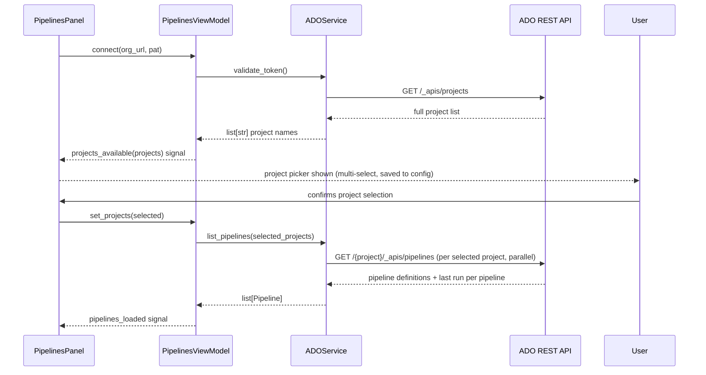
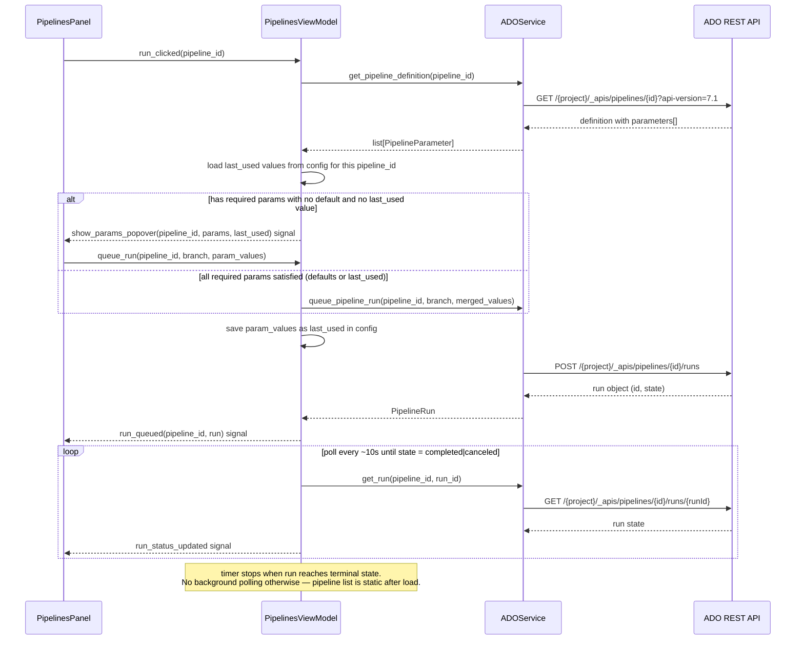
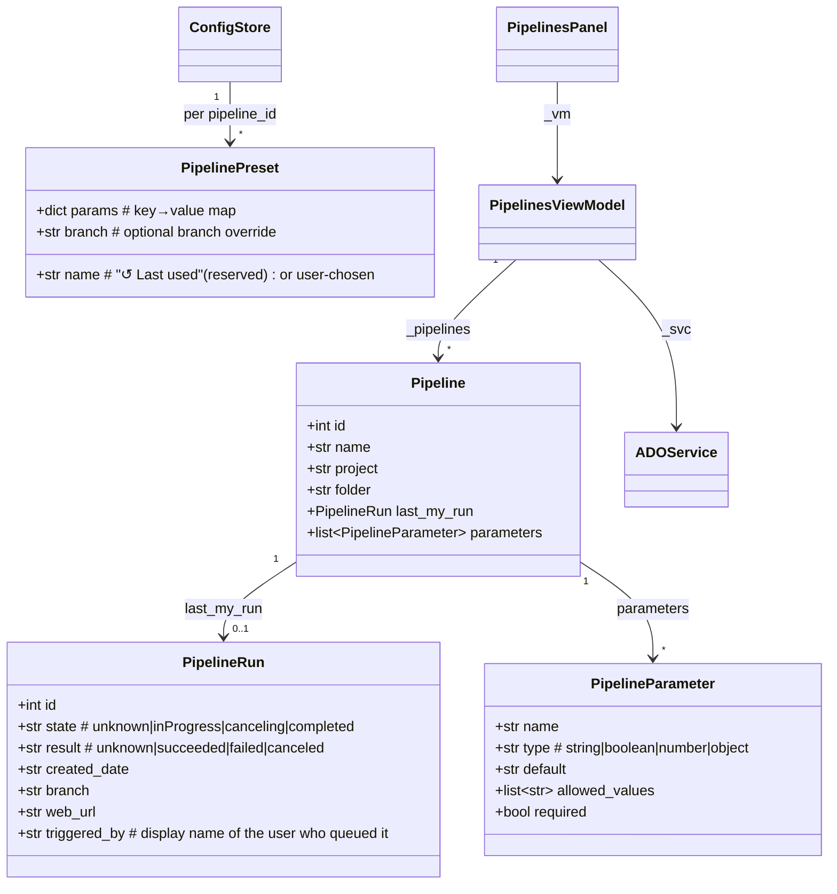

# ADO Pipelines — Run Azure DevOps Pipelines from the App

## Overview

Adds a new **Pipelines** panel to the worktree-manager sidebar that lets users browse and trigger Azure DevOps pipelines they have access to run, without leaving the app. The panel auto-discovers pipelines from the user's ADO organization, shows each pipeline's **last run triggered by the authenticated user** at a glance, and lets them queue a new run with a single button click. No branch selection, no forms — one click fires the default branch with no variables. For power users who need branch or variable overrides, a minimal popover handles that inline. Runs by other people are not shown.

## UI / Flow

### Overall app layout — before (6 sidebar tabs)

```
┌────────────────────┬──────────────────────────────────────────────┐
│ 📁  Projects       │                                              │
│ ⊞  Commands       │                                              │
│ ⇄  Diff           │         (active panel content)               │
│ ⬡  Pull Requests  │                                              │
│ 🌳  Worktrees      │                                              │
│ 🌿  Branches       │                                              │
│                    │                                              │
│ ↻  Refresh        │                                              │
│ ⚙  Settings       │                                              │
└────────────────────┴──────────────────────────────────────────────┘
```

### Overall app layout — after (7 sidebar tabs, Pipelines added)

```
┌────────────────────┬──────────────────────────────────────────────┐
│ 📁  Projects       │                                              │
│ ⊞  Commands       │                                              │
│ ⇄  Diff           │         (active panel content)               │
│ ⬡  Pull Requests  │                                              │
│ ▷  Pipelines      │  ← new                                       │
│ 🌳  Worktrees      │                                              │
│ 🌿  Branches       │                                              │
│                    │                                              │
│ ↻  Refresh        │                                              │
│ ⚙  Settings       │                                              │
└────────────────────┴──────────────────────────────────────────────┘
```

The Pipelines tab sits between Pull Requests and Worktrees — grouped with the other service-integration panels (GitHub) and above the local git management panels.

---

### Pipelines panel — empty state (no ADO token configured)

```
┌────────────────────┬──────────────────────────────────────────────┐
│ 📁  Projects       │ ▷  Pipelines                                 │
│ ⊞  Commands       ├──────────────────────────────────────────────┤
│ ⇄  Diff           │                                              │
│ ⬡  Pull Requests  │                                              │
│ ▷  Pipelines ◀   │    🔒  Connect Azure DevOps                   │
│ 🌳  Worktrees      │                                              │
│ 🌿  Branches       │    Organisation URL                          │
│                    │    ┌──────────────────────────────────┐      │
│ ↻  Refresh        │    │ https://dev.azure.com/myorg      │      │
│ ⚙  Settings       │    └──────────────────────────────────┘      │
└────────────────────│                                              │
                     │    Personal Access Token                     │
                     │    (Pipelines: Read & Run)                   │
                     │    ┌──────────────────────────────────┐      │
                     │    │ ••••••••••••••••••••••••••••     │      │
                     │    └──────────────────────────────────┘      │
                     │                                              │
                     │    [ Connect ]                               │
                     │                                              │
                     └──────────────────────────────────────────────┘
```

### Pipelines panel — project picker (first connect, or "Change projects")

```
┌────────────────────┬──────────────────────────────────────────────┐
│ 📁  Projects       │ ▷  Pipelines                                 │
│ ⊞  Commands       ├──────────────────────────────────────────────┤
│ ⇄  Diff           │  Which projects should we scan for pipelines? │
│ ⬡  Pull Requests  │                                              │
│ ▷  Pipelines ◀   │  ☑  MyApp                                    │
│ 🌳  Worktrees      │  ☑  PlatformLib                              │
│ 🌿  Branches       │  ☐  InternalTools                            │
│                    │  ☑  Infra                                    │
│ ↻  Refresh        │  ☐  Archive                                   │
│ ⚙  Settings       │                                              │
└────────────────────│  [ Confirm ]                                 │
                     │                                              │
                     └──────────────────────────────────────────────┘
```
Shown once on first connect. Selection is saved; subsequent launches skip straight to the loaded state.

### Pipelines panel — loading state

```
┌────────────────────┬──────────────────────────────────────────────┐
│ 📁  Projects       │ ▷  Pipelines                  ↻ Loading…    │
│ ⊞  Commands       ├──────────────────────────────────────────────┤
│ ⇄  Diff           │                                              │
│ ⬡  Pull Requests  │   ⠸  Fetching pipelines from 3 projects…     │
│ ▷  Pipelines ◀   │                                              │
│ 🌳  Worktrees      │                                              │
│ 🌿  Branches       │                                              │
│                    │                                              │
│ ↻  Refresh        │                                              │
│ ⚙  Settings       │                                              │
└────────────────────┴──────────────────────────────────────────────┘
```

### Pipelines panel — loaded state

```
┌────────────────────┬──────────────────────────────────────────────┐
│ 📁  Projects       │ ▷  Pipelines   [Change projects]      ⚿ PAT │
│ ⊞  Commands       ├──────────────────────────────────────────────┤
│ ⇄  Diff           │ 🔍 Filter pipelines…                         │
│ ⬡  Pull Requests  ├──────────────────────────────────────────────┤
│ ▷  Pipelines ◀   │ MyApp / CI Build         ✅ 2m ago  [ ▷ Run ]│
│ 🌳  Worktrees      │ MyApp / Deploy Staging   🟡 running [ ▷ Run ]│
│ 🌿  Branches       │ PlatformLib / Tests      ❌ 1h ago  [ ▷ Run ]│
│                    │ PlatformLib / Publish    ✅ 3d ago  [ ▷ Run ]│
│ ↻  Refresh        │ Infra / Apply TF         ✅ 1d ago  [ ▷ Run ]│
│ ⚙  Settings       │                                              │
└────────────────────┴──────────────────────────────────────────────┘
```
Each row: `<project> / <pipeline name>` · your last-run status badge · age · **Run** button. "Change projects" reopens the project picker inline.

### One-click run — happy path (no required params, or last used covers all)

```
┌────────────────────┬──────────────────────────────────────────────┐
│ 📁  Projects       │ ▷  Pipelines   [Change projects]      ⚿ PAT │
│ ⊞  Commands       ├──────────────────────────────────────────────┤
│ ⇄  Diff           │ 🔍 Filter pipelines…                         │
│ ⬡  Pull Requests  ├──────────────────────────────────────────────┤
│ ▷  Pipelines ◀   │ MyApp / CI Build         🟡 queued  [  ···  ]│
│ 🌳  Worktrees      │ MyApp / Deploy Staging   🟡 running [ ▷ Run ]│
│ 🌿  Branches       │ PlatformLib / Tests      ❌ 1h ago  [ ▷ Run ]│
│                    │ PlatformLib / Publish    ✅ 3d ago  [ ▷ Run ]│
│ ↻  Refresh        │ Infra / Apply TF         ✅ 1d ago  [ ▷ Run ]│
│ ⚙  Settings       │                                              │
└────────────────────┴──────────────────────────────────────────────┘
```
Button becomes a spinner inline; status badge updates to "queued" then "running". No popover, no dialog, list stays visible.

### Popover — first ever run (no last used yet, required params unfilled)

```
┌────────────────────┬──────────────────────────────────────────────┐
│ 📁  Projects       │ ▷  Pipelines   [Change projects]      ⚿ PAT │
│ ⊞  Commands       ├──────────────────────────────────────────────┤
│ ⇄  Diff           │ 🔍 Filter pipelines…                         │
│ ⬡  Pull Requests  ├──────────────────────────────────────────────┤
│ ▷  Pipelines ◀   │ MyApp / CI Build         ✅ 2m ago  [ ▷ Run ]│
│ 🌳  Worktrees      │ MyApp / Deploy Staging   🟡 running [ ▷ Run ]│
│ 🌿  Branches       │ PlatformLib / Tests      ❌ 1h ago  [ ▷ Run ]│
│                    │ Infra / Apply TF         ✅ 1d ago  [▷ Run▾]│
│ ↻  Refresh        │                    ┌───────────────────────── ┤
│ ⚙  Settings       │                    │ Preset: [ None      ▾][+]│
└────────────────────┘                    │ Branch: main         [✎]│
                                          │ ─ Required ─────────────│
                                          │ environment *           │
                                          │ [                    ▾] │
                                          │ region      *           │
                                          │ [                    ▾] │
                                          │ ─ Optional ─────────────│
                                          │ dry_run                 │
                                          │ [ false              ▾] │
                                          │ [💾 Save] [▷ Run] (off) │
                                          └─────────────────────────┘
```
First time: no preset, required fields empty, Run button disabled until filled.

### Popover — subsequent runs (last used pre-fills everything, one click away)

```
┌────────────────────┬──────────────────────────────────────────────┐
│ 📁  Projects       │ ▷  Pipelines   [Change projects]      ⚿ PAT │
│ ⊞  Commands       ├──────────────────────────────────────────────┤
│ ⇄  Diff           │ 🔍 Filter pipelines…                         │
│ ⬡  Pull Requests  ├──────────────────────────────────────────────┤
│ ▷  Pipelines ◀   │ MyApp / CI Build         ✅ 2m ago  [ ▷ Run ]│
│ 🌳  Worktrees      │ MyApp / Deploy Staging   🟡 running [ ▷ Run ]│
│ 🌿  Branches       │ PlatformLib / Tests      ❌ 1h ago  [ ▷ Run ]│
│                    │ Infra / Apply TF         ✅ 1d ago  [▷ Run▾]│
│ ↻  Refresh        │                    ┌───────────────────────── ┤
│ ⚙  Settings       │                    │ Preset:[↺ Last used ▾][+]│
└────────────────────┘                    │ Branch: main         [✎]│
                                          │ ─ Required ─────────────│
                                          │ environment *           │
                                          │ [ production         ▾] │
                                          │ region      *           │
                                          │ [ us-east-1          ▾] │
                                          │ ─ Optional ─────────────│
                                          │ dry_run                 │
                                          │ [ false              ▾] │
                                          │ [💾 Save]    [▷ Run]    │
                                          └─────────────────────────┘
```
Fields pre-filled from last used. Run button is enabled — one click fires immediately.

Note: if all required params are covered by last used, the popover is **skipped entirely** and the run queues on the very first click with no popover shown.

### Popover — with named presets saved (preset dropdown expanded)

```
┌────────────────────┬──────────────────────────────────────────────┐
│ 📁  Projects       │ ▷  Pipelines   [Change projects]      ⚿ PAT │
│ ⊞  Commands       ├──────────────────────────────────────────────┤
│ ⇄  Diff           │ 🔍 Filter pipelines…                         │
│ ⬡  Pull Requests  ├──────────────────────────────────────────────┤
│ ▷  Pipelines ◀   │ MyApp / CI Build         ✅ 2m ago  [ ▷ Run ]│
│ 🌳  Worktrees      │ MyApp / Deploy Staging   🟡 running [ ▷ Run ]│
│ 🌿  Branches       │ PlatformLib / Tests      ❌ 1h ago  [ ▷ Run ]│
│                    │ Infra / Apply TF         ✅ 1d ago  [▷ Run▾]│
│ ↻  Refresh        │                    ┌───────────────────────── ┤
│ ⚙  Settings       │                    │ Preset:[↺ Last used ▾][+]│
└────────────────────┘                    │        ┌────────────────│
                                          │        │ ↺ Last used    │
                                          │        │ ─────────────  │
                                          │        │ Deploy staging  │
                                          │        │ Deploy prod     │
                                          │        └────────────────│
                                          │ Branch: main         [✎]│
                                          │ ─ Required ─────────────│
                                          │ environment *           │
                                          │ [ production         ▾] │
                                          │ region      *           │
                                          │ [ us-east-1          ▾] │
                                          │ ─ Optional ─────────────│
                                          │ dry_run                 │
                                          │ [ false              ▾] │
                                          │ [💾 Save]    [▷ Run]    │
                                          └─────────────────────────┘
```
Selecting a preset instantly loads its saved values into all fields.

### Error state — inline, no navigation disruption

```
┌────────────────────┬──────────────────────────────────────────────┐
│ 📁  Projects       │ ▷  Pipelines   [Change projects]      ⚿ PAT │
│ ⊞  Commands       ├──────────────────────────────────────────────┤
│ ⇄  Diff           │ 🔍 Filter pipelines…                         │
│ ⬡  Pull Requests  ├──────────────────────────────────────────────┤
│ ▷  Pipelines ◀   │ MyApp / CI Build         ✅ 2m ago  [ ▷ Run ]│
│ 🌳  Worktrees      │ Infra / Apply TF   🔴 Insufficient perms     │
│ 🌿  Branches       │ PlatformLib / Tests      ❌ 1h ago  [ ▷ Run ]│
│                    │ PlatformLib / Publish    ✅ 3d ago  [ ▷ Run ]│
│ ↻  Refresh        │                                              │
│ ⚙  Settings       │                                              │
└────────────────────┴──────────────────────────────────────────────┘
```
Error replaces the status+button area inline for 8 seconds, then fades back to the last known state. No toast, no modal.

### Settings panel — ADO section added below GitHub

```
┌────────────────────┬──────────────────────────────────────────────┐
│ 📁  Projects       │ ⚙  Settings                                  │
│ ⊞  Commands       ├──────────────────────────────────────────────┤
│ ⇄  Diff           │  GitHub                                      │
│ ⬡  Pull Requests  │  ──────────────────────────────────────────  │
│ ▷  Pipelines      │  Token   [ ghp_•••••••••••••••••••     ]     │
│ 🌳  Worktrees      │  Poll    [ 30 ] seconds                      │
│ 🌿  Branches       │                                              │
│                    │  Azure DevOps                    ← new       │
│ ↻  Refresh        │  ──────────────────────────────────────────  │
│ ⚙  Settings ◀    │  Org URL [ https://dev.azure.com/myorg ]     │
└────────────────────│  PAT     [ ••••••••••••••••••        🗑 ]   │
                     │  Projects  MyApp, PlatformLib, Infra  [Edit] │
                     │                                              │
                     └──────────────────────────────────────────────┘
```

## Architecture

### Data flow — initial connect



On subsequent app launches the saved project selection is used directly — the project picker is skipped and pipelines load immediately. The user can re-open the picker at any time via a "Change projects" link in the panel header.

### Data flow — queue a run



### New components

| Component | File | Role |
|-----------|------|------|
| `Pipeline` dataclass | `worktree_manager/ado_models.py` | Pipeline definition + last run |
| `PipelineRun` dataclass | `worktree_manager/ado_models.py` | A single run's state |
| `PipelineParameter` dataclass | `worktree_manager/ado_models.py` | A parameter definition (name, type, default, allowed values, required) |
| `PipelinePreset` dataclass | `worktree_manager/ado_models.py` | A named preset: name + param key/value dict |
| `ADOService` class | `worktree_manager/ado_service.py` | REST wrapper for ADO API |
| `PipelinesViewModel` class | `worktree_manager/pipelines_vm.py` | Discovery, polling, run queueing, preset management |
| `PipelinesPanel` widget | `worktree_manager/ui/pipelines_panel.py` | Full UI panel |
| ADO config methods | [`worktree_manager/config_store.py`](worktree_manager/config_store.py) | Persist org URL, PAT, selected project list, last-used params, and named presets per pipeline |
| ADO settings UI | [`worktree_manager/ui/settings_panel.py`](worktree_manager/ui/settings_panel.py) | Token management UI |
| New sidebar tab | [`worktree_manager/ui/sidebar.py`](worktree_manager/ui/sidebar.py) | `▷  Pipelines` tab |
| Panel wiring | [`worktree_manager/cli.py`](worktree_manager/cli.py) | Instantiate + show panel |

### ADO REST API surface used

- `GET /{org}/_apis/projects?api-version=7.1` — enumerate all accessible projects
- `GET /{org}/{project}/_apis/pipelines?api-version=7.1` — list pipeline definitions in a project
- `GET /{org}/{project}/_apis/pipelines/{id}?api-version=7.1` — fetch pipeline definition including `configuration.variables` and YAML `parameters` (name, type, default, allowedValues, required)
- `GET /{org}/{project}/_apis/pipelines/{id}/runs?$top=10&api-version=7.1` — recent runs; filtered client-side to those triggered by the authenticated user
- `POST /{org}/{project}/_apis/pipelines/{id}/runs?api-version=7.1` — queue a new run (body includes `resources.repositories.self.refName` for branch, `templateParameters` for YAML params)
- `GET /{org}/{project}/_apis/pipelines/{id}/runs/{runId}?api-version=7.1` — poll run state
- Auth: `Authorization: Basic <base64(":" + PAT)>`

### Model relationships



## Open Questions

_None — all questions resolved._

_Resolved:_
- **Project scope** — On first connect, fetch all accessible projects and show a multi-select picker. Save the selection to config. Subsequent launches use the saved list directly. "Change projects" in the panel header and an [Edit] link in Settings both reopen the picker.
- **Polling** — No background polling of the pipeline list after initial load (definitions don't change). Only actively-queued runs are polled (~10s interval) until they reach a terminal state (`completed` or `canceled`). Timer stops automatically; no continuous polling.
- **Required parameters** — One-click Run fetches the pipeline definition first; if any required parameter has no default, the popover opens automatically with those fields highlighted. Pipelines with all-defaulted params queue immediately on one click.
- **Parameter types** — Dropdown parameters (`allowedValues` in the definition) render as dropdowns in the popover; all others are text fields.
- **Whose runs are shown** — Only runs triggered by the authenticated user are tracked and displayed (filtered client-side by `triggeredBy.uniqueName` matching the authenticated identity).
- **Variables vs parameters** — Scope is YAML `templateParameters` only. Classic pipeline variables settable at queue time are deferred to a future iteration.
- **Parameter caching** — Option C: auto-save last-used param values per pipeline after every run; also support named presets. Popover always opens pre-filled with "↺ Last used" selected. Preset dropdown includes `↺ Last used` at top followed by any named presets. "💾 Save preset" button saves current field values under a user-chosen name. Config shape: `ado_presets[pipeline_id] = {last_used: {params, branch}, presets: [{name, params, branch}, ...]}`. If a pipeline has required params but `last_used` covers them all, it queues directly on one click without opening the popover.
