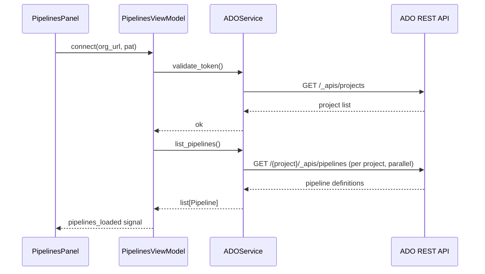
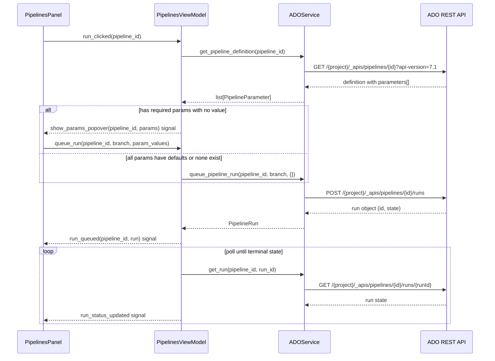
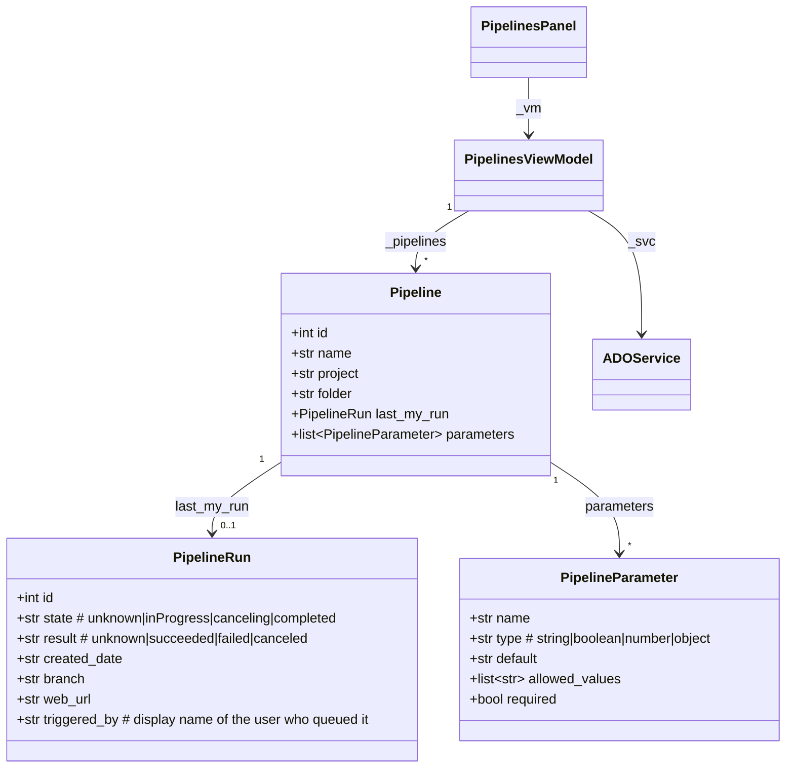

# ADO Pipelines — Run Azure DevOps Pipelines from the App

## Overview

Adds a new **Pipelines** panel to the worktree-manager sidebar that lets users browse and trigger Azure DevOps pipelines they have access to run, without leaving the app. The panel auto-discovers pipelines from the user's ADO organization, shows each pipeline's **last run triggered by the authenticated user** at a glance, and lets them queue a new run with a single button click. No branch selection, no forms — one click fires the default branch with no variables. For power users who need branch or variable overrides, a minimal popover handles that inline. Runs by other people are not shown.

## UI / Flow

### Overall app layout — before (6 sidebar tabs)

```
┌────────────────────┬──────────────────────────────────────────────┐
│ 📁  Projects       │                                              │
│ ⊞  Commands       │                                              │
│ ⇄  Diff           │         (active panel content)               │
│ ⬡  Pull Requests  │                                              │
│ 🌳  Worktrees      │                                              │
│ 🌿  Branches       │                                              │
│                    │                                              │
│ ↻  Refresh        │                                              │
│ ⚙  Settings       │                                              │
└────────────────────┴──────────────────────────────────────────────┘
```

### Overall app layout — after (7 sidebar tabs, Pipelines added)

```
┌────────────────────┬──────────────────────────────────────────────┐
│ 📁  Projects       │                                              │
│ ⊞  Commands       │                                              │
│ ⇄  Diff           │         (active panel content)               │
│ ⬡  Pull Requests  │                                              │
│ ▷  Pipelines      │  ← new                                       │
│ 🌳  Worktrees      │                                              │
│ 🌿  Branches       │                                              │
│                    │                                              │
│ ↻  Refresh        │                                              │
│ ⚙  Settings       │                                              │
└────────────────────┴──────────────────────────────────────────────┘
```

The Pipelines tab sits between Pull Requests and Worktrees — grouped with the other service-integration panels (GitHub) and above the local git management panels.

---

### Pipelines panel — empty state (no ADO token configured)

```
┌────────────────────┬──────────────────────────────────────────────┐
│ 📁  Projects       │ ▷  Pipelines                                 │
│ ⊞  Commands       ├──────────────────────────────────────────────┤
│ ⇄  Diff           │                                              │
│ ⬡  Pull Requests  │                                              │
│ ▷  Pipelines ◀   │    🔒  Connect Azure DevOps                   │
│ 🌳  Worktrees      │                                              │
│ 🌿  Branches       │    Organisation URL                          │
│                    │    ┌──────────────────────────────────┐      │
│ ↻  Refresh        │    │ https://dev.azure.com/myorg      │      │
│ ⚙  Settings       │    └──────────────────────────────────┘      │
└────────────────────│                                              │
                     │    Personal Access Token                     │
                     │    (Pipelines: Read & Run)                   │
                     │    ┌──────────────────────────────────┐      │
                     │    │ ••••••••••••••••••••••••••••     │      │
                     │    └──────────────────────────────────┘      │
                     │                                              │
                     │    [ Connect ]                               │
                     │                                              │
                     └──────────────────────────────────────────────┘
```

### Pipelines panel — loading state

```
┌────────────────────┬──────────────────────────────────────────────┐
│ 📁  Projects       │ ▷  Pipelines                  ↻ Refreshing… │
│ ⊞  Commands       ├──────────────────────────────────────────────┤
│ ⇄  Diff           │                                              │
│ ⬡  Pull Requests  │   ⠸  Discovering pipelines…                  │
│ ▷  Pipelines ◀   │                                              │
│ 🌳  Worktrees      │                                              │
│ 🌿  Branches       │                                              │
│                    │                                              │
│ ↻  Refresh        │                                              │
│ ⚙  Settings       │                                              │
└────────────────────┴──────────────────────────────────────────────┘
```

### Pipelines panel — loaded state

```
┌────────────────────┬──────────────────────────────────────────────┐
│ 📁  Projects       │ ▷  Pipelines              [ Refresh ]  ⚿ PAT│
│ ⊞  Commands       ├──────────────────────────────────────────────┤
│ ⇄  Diff           │ 🔍 Filter pipelines…                         │
│ ⬡  Pull Requests  ├──────────────────────────────────────────────┤
│ ▷  Pipelines ◀   │ MyApp / CI Build         ✅ 2m ago  [ ▷ Run ]│
│ 🌳  Worktrees      │ MyApp / Deploy Staging   🟡 running [ ▷ Run ]│
│ 🌿  Branches       │ PlatformLib / Tests      ❌ 1h ago  [ ▷ Run ]│
│                    │ PlatformLib / Publish    ✅ 3d ago  [ ▷ Run ]│
│ ↻  Refresh        │ Infra / Apply TF         ✅ 1d ago  [ ▷ Run ]│
│ ⚙  Settings       │                                              │
└────────────────────┴──────────────────────────────────────────────┘
```
Each row: `<project> / <pipeline name>` · your last-run status badge · age · **Run** button.

### One-click run — happy path (no required params)

```
┌────────────────────┬──────────────────────────────────────────────┐
│ 📁  Projects       │ ▷  Pipelines              [ Refresh ]  ⚿ PAT│
│ ⊞  Commands       ├──────────────────────────────────────────────┤
│ ⇄  Diff           │ 🔍 Filter pipelines…                         │
│ ⬡  Pull Requests  ├──────────────────────────────────────────────┤
│ ▷  Pipelines ◀   │ MyApp / CI Build         🟡 queued  [  ···  ]│
│ 🌳  Worktrees      │ MyApp / Deploy Staging   🟡 running [ ▷ Run ]│
│ 🌿  Branches       │ PlatformLib / Tests      ❌ 1h ago  [ ▷ Run ]│
│                    │ PlatformLib / Publish    ✅ 3d ago  [ ▷ Run ]│
│ ↻  Refresh        │ Infra / Apply TF         ✅ 1d ago  [ ▷ Run ]│
│ ⚙  Settings       │                                              │
└────────────────────┴──────────────────────────────────────────────┘
```
Button becomes a spinner inline; status badge updates to "queued" then "running". No modal, no dialog, list stays visible.

### One-click run — required parameters intercepted (popover opens automatically)

```
┌────────────────────┬──────────────────────────────────────────────┐
│ 📁  Projects       │ ▷  Pipelines              [ Refresh ]  ⚿ PAT│
│ ⊞  Commands       ├──────────────────────────────────────────────┤
│ ⇄  Diff           │ 🔍 Filter pipelines…                         │
│ ⬡  Pull Requests  ├──────────────────────────────────────────────┤
│ ▷  Pipelines ◀   │ MyApp / CI Build         ✅ 2m ago  [ ▷ Run ]│
│ 🌳  Worktrees      │ MyApp / Deploy Staging   🟡 running [ ▷ Run ]│
│ 🌿  Branches       │ PlatformLib / Tests      ❌ 1h ago  [ ▷ Run ]│
│                    │ Infra / Apply TF         ✅ 1d ago  [▷ Run▾]│
│ ↻  Refresh        │                         ┌────────────────────┤
│ ⚙  Settings       │                         │ Branch: main    [✎]│
└────────────────────┘                         │ ─ Required ────────│
                                               │ environment *      │
                                               │ [ production     ▾]│
                                               │ region      *      │
                                               │ [ us-east-1      ▾]│
                                               │ ─ Optional ────────│
                                               │ dry_run            │
                                               │ [ false          ▾]│
                                               │ [▷ Run with options]│
                                               └────────────────────┘
```
Popover anchors below the Run button. Required fields `*` are highlighted; Run button inside the popover is disabled until all are filled. Click outside to dismiss.

### Error state — inline, no navigation disruption

```
┌────────────────────┬──────────────────────────────────────────────┐
│ 📁  Projects       │ ▷  Pipelines              [ Refresh ]  ⚿ PAT│
│ ⊞  Commands       ├──────────────────────────────────────────────┤
│ ⇄  Diff           │ 🔍 Filter pipelines…                         │
│ ⬡  Pull Requests  ├──────────────────────────────────────────────┤
│ ▷  Pipelines ◀   │ MyApp / CI Build         ✅ 2m ago  [ ▷ Run ]│
│ 🌳  Worktrees      │ Infra / Apply TF   🔴 Insufficient perms     │
│ 🌿  Branches       │ PlatformLib / Tests      ❌ 1h ago  [ ▷ Run ]│
│                    │ PlatformLib / Publish    ✅ 3d ago  [ ▷ Run ]│
│ ↻  Refresh        │                                              │
│ ⚙  Settings       │                                              │
└────────────────────┴──────────────────────────────────────────────┘
```
Error replaces the status+button area inline for 8 seconds, then fades back to the last known state. No toast, no modal.

### Settings panel — ADO section added below GitHub

```
┌────────────────────┬──────────────────────────────────────────────┐
│ 📁  Projects       │ ⚙  Settings                                  │
│ ⊞  Commands       ├──────────────────────────────────────────────┤
│ ⇄  Diff           │  GitHub                                      │
│ ⬡  Pull Requests  │  ──────────────────────────────────────────  │
│ ▷  Pipelines      │  Token   [ ghp_•••••••••••••••••••     ]     │
│ 🌳  Worktrees      │  Poll    [ 30 ] seconds                      │
│ 🌿  Branches       │                                              │
│                    │  Azure DevOps                    ← new       │
│ ↻  Refresh        │  ──────────────────────────────────────────  │
│ ⚙  Settings ◀    │  Org URL [ https://dev.azure.com/myorg ]     │
└────────────────────│  PAT     [ ••••••••••••••••••        🗑 ]   │
                     │  Poll    [ 60 ] seconds                      │
                     │                                              │
                     └──────────────────────────────────────────────┘
```

## Architecture

### Data flow — initial load



### Data flow — queue a run



### New components

| Component | File | Role |
|-----------|------|------|
| `Pipeline` dataclass | `worktree_manager/ado_models.py` | Pipeline definition + last run |
| `PipelineRun` dataclass | `worktree_manager/ado_models.py` | A single run's state |
| `PipelineParameter` dataclass | `worktree_manager/ado_models.py` | A parameter definition (name, type, default, allowed values, required) |
| `ADOService` class | `worktree_manager/ado_service.py` | REST wrapper for ADO API |
| `PipelinesViewModel` class | `worktree_manager/pipelines_vm.py` | Discovery, polling, run queueing |
| `PipelinesPanel` widget | `worktree_manager/ui/pipelines_panel.py` | Full UI panel |
| ADO config methods | [`worktree_manager/config_store.py`](worktree_manager/config_store.py) | Persist org URL + PAT |
| ADO settings UI | [`worktree_manager/ui/settings_panel.py`](worktree_manager/ui/settings_panel.py) | Token management UI |
| New sidebar tab | [`worktree_manager/ui/sidebar.py`](worktree_manager/ui/sidebar.py) | `▷  Pipelines` tab |
| Panel wiring | [`worktree_manager/cli.py`](worktree_manager/cli.py) | Instantiate + show panel |

### ADO REST API surface used

- `GET /{org}/_apis/projects?api-version=7.1` — enumerate all accessible projects
- `GET /{org}/{project}/_apis/pipelines?api-version=7.1` — list pipeline definitions in a project
- `GET /{org}/{project}/_apis/pipelines/{id}?api-version=7.1` — fetch pipeline definition including `configuration.variables` and YAML `parameters` (name, type, default, allowedValues, required)
- `GET /{org}/{project}/_apis/pipelines/{id}/runs?$top=10&api-version=7.1` — recent runs; filtered client-side to those triggered by the authenticated user
- `POST /{org}/{project}/_apis/pipelines/{id}/runs?api-version=7.1` — queue a new run (body includes `resources.repositories.self.refName` for branch, `templateParameters` for YAML params)
- `GET /{org}/{project}/_apis/pipelines/{id}/runs/{runId}?api-version=7.1` — poll run state
- Auth: `Authorization: Basic <base64(":" + PAT)>`

### Model relationships



## Open Questions

- **Which projects to include?** ADO organisations can have many projects. Should we discover pipelines from ALL accessible projects automatically, or let the user pick a project subset to scan?
- **Polling granularity** — Should the app poll only your active (in-progress) runs frequently (e.g. every 10s) while refreshing the full pipeline list less often (e.g. every 5 min), or poll everything on a single interval?

_Resolved:_
- **Required parameters** — One-click Run fetches the pipeline definition first; if any required parameter has no default, the popover opens automatically with those fields highlighted. Pipelines with all-defaulted params queue immediately on one click.
- **Parameter types** — Dropdown parameters (`allowedValues` in the definition) render as dropdowns in the popover; all others are text fields.
- **Whose runs are shown** — Only runs triggered by the authenticated user are tracked and displayed (filtered client-side by `triggeredBy.uniqueName` or display name matching the authenticated identity).
- **Variables vs parameters** — Scope is YAML `templateParameters` only (the typed, named inputs). Classic pipeline variables settable at queue time are deferred to a future iteration.
