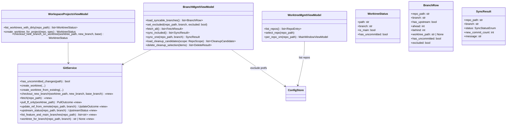
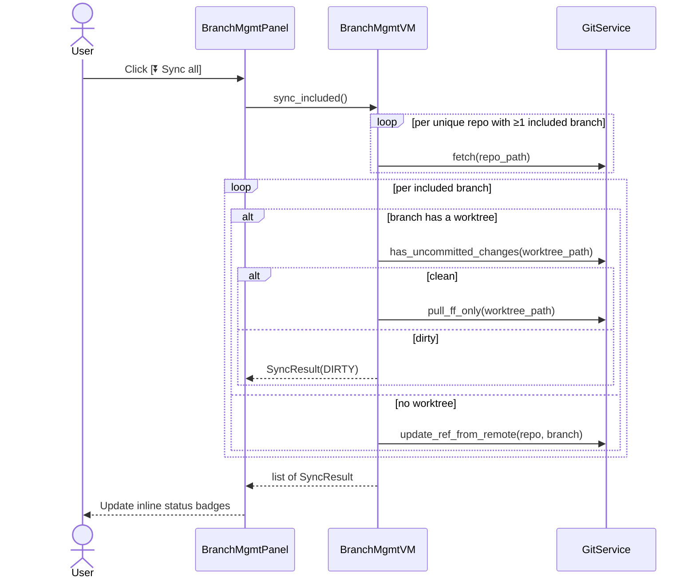
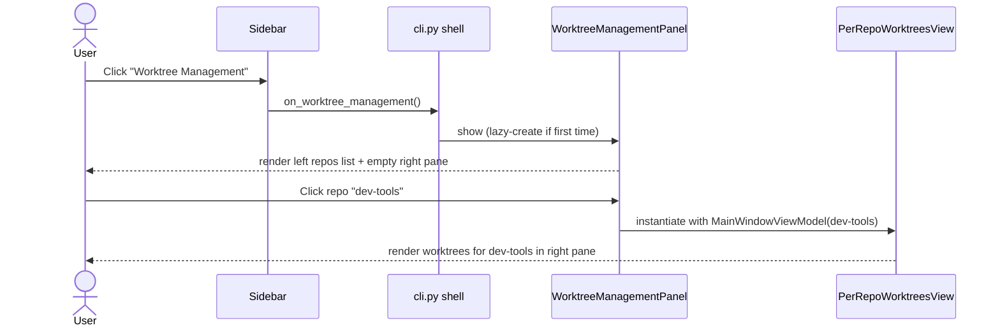

# Project Tab Independence + Branch Management Tab

## Overview
Four related changes that reorganize the app so worktrees no longer dominate the sidebar and so branch + project + worktree work each have their own first-class tab:

1. **Project create/edit dialog gains inline worktree + branch creation.** Without leaving the dialog ([worktree_manager/ui/project_operations_dialog.py](worktree_manager/ui/project_operations_dialog.py)), the user can (a) create a brand-new worktree (new branch or existing branch) and immediately add it to the project, and (b) create a new branch on an existing worktree (i.e. `git checkout -b` inside an existing worktree) — with a clear warning if that worktree has uncommitted changes, still allowing the user to proceed.

2. **A new "Branch Management" sidebar tab** that contains two sections:
   - **Sync from origin** — list each repo's `main` and `feature/*` branches and pull them all from origin in one click, with persisted per-branch exclude toggles.
   - **Cleanup** — the existing Cleanup Wizard ([worktree_manager/ui/cleanup_wizard.py](worktree_manager/ui/cleanup_wizard.py)), relocated here so all branch-level operations live in one place. The per-repo 🧹 button is replaced by a deep-link that opens the Branch Management tab scoped to the active repo's cleanup view.

3. **A new "Worktree Management" sidebar tab** that takes over the role currently played by the sidebar's REPOS list ([worktree_manager/ui/sidebar.py:77](worktree_manager/ui/sidebar.py#L77)) + the per-repo [`MainWindow`](worktree_manager/ui/main_window.py#L26). The REPOS list becomes a left-hand widget *inside* this tab, with the selected repo's worktree view on the right. The sidebar's top-level buttons become a flat, equal set: Command Center / Workspace Projects / Branch Management / Worktree Management — worktrees no longer get the sole spotlight position.

4. **Settings icon promoted to a global location.** The ⚙ icon is removed from the per-repo Worktrees header ([worktree_manager/ui/main_window.py:55-59](worktree_manager/ui/main_window.py#L55-L59)) and lives in the sidebar so it is reachable from every tab.

## UI / Flow

### A. Project Create/Edit Dialog — full layout
The dialog is [`ProjectOperationsDialog`](worktree_manager/ui/project_operations_dialog.py#L11). The picker logic (repo + worktree dropdowns + `+ Add` button) at [worktree_manager/ui/project_operations_dialog.py:50-65](worktree_manager/ui/project_operations_dialog.py#L50-L65) is preserved but augmented as shown below.

```
┌─────────────────────────────────────────────────────────────────────────────┐
│ New Workspace Project                                                       │
│                                                                             │
│ Project name: [____________________________________________]                │
│                                                                             │
│ ── Add to project ──────────────────────────────────────────────────────    │
│ Repo: [dev-tools                ▼]                                          │
│                                                                             │
│ Worktrees in dev-tools:                  [+ Create new worktree ▾]          │
│  ┌────────────────────────────────────────────────────────────────────┐    │
│  │ (main): main                          [Add]   [New branch here…]   │    │
│  │ fix-login: fix/login      ⚠ dirty     [Add]   [New branch here…]   │    │
│  │ feat-x: feature/x                     [Add]   [New branch here…]   │    │
│  └────────────────────────────────────────────────────────────────────┘    │
│                                                                             │
│ Entries in this project:                                                    │
│  ┌────────────────────────────────────────────────────────────────────┐    │
│  │ /Users/me/wts/main           main                          [✕]     │    │
│  │ /Users/me/wts/fix-login   ⚠  fix/login                     [✕]     │    │
│  └────────────────────────────────────────────────────────────────────┘    │
│  ⚠ 1 entry has uncommitted changes. You can still save the project.        │
│                                                                             │
│                                                  [Cancel]  [Create Project] │
└─────────────────────────────────────────────────────────────────────────────┘
```
The dirty marker is computed by calling [`GitService.has_uncommitted_changes`](worktree_manager/git_service.py#L83) for each worktree path returned by [`WorkspaceProjectsViewModel.list_worktrees_for_repo`](worktree_manager/workspace_projects_vm.py#L45).

### B. "+ Create new worktree" — inline expanded panel
Clicking **[+ Create new worktree ▾]** flips an inline panel open just below the picker. The user does not leave the dialog. This is functionally what the standalone [`CreateDialog`](worktree_manager/ui/create_dialog.py#L44) does today, embedded inline.

```
│  ╭── Create new worktree in dev-tools ────────────────────────────────╮    │
│  │  (•) New branch          ( ) Existing branch                       │    │
│  │                                                                    │    │
│  │  Worktree name:  [fix-auth__________________]                      │    │
│  │  Branch name:    [fix/auth__________________]                      │    │
│  │  Base branch:    [main ▼]                                          │    │
│  │                                                                    │    │
│  │                                       [Cancel]  [Create + Add]     │    │
│  ╰────────────────────────────────────────────────────────────────────╯    │
```
On **[Create + Add]**: creates the worktree via [`GitService.create_worktree`](worktree_manager/git_service.py#L66) (new branch) or [`GitService.create_worktree_from_existing`](worktree_manager/git_service.py#L102) (existing branch), appends it to the Entries list, collapses the inline panel. Errors are rendered inline in red below the form (no popup).

### C. "New branch here…" — inline checkout-new-branch on an existing worktree
Clicking **[New branch here…]** on an existing worktree row flips a small inline form open under *that row*. This is the action you described: create a new branch ON that worktree (`git checkout -b <new> [base]` within the worktree). The single-branch checkout that already exists is [`GitService.checkout_branch`](worktree_manager/git_service.py#L99); the new method `GitService.checkout_new_branch` introduced by this feature wraps `git checkout -b`.

```
│  fix-login: fix/login      ⚠ dirty     [Add]   [New branch here… ▴]        │
│   ╭── New branch on worktree fix-login ─────────────────────────────╮      │
│   │  ⚠ This worktree has uncommitted changes. To avoid merge        │      │
│   │    conflicts you must branch from the current HEAD (fix/login). │      │
│   │    Your uncommitted changes will carry onto the new branch.     │      │
│   │                                                                 │      │
│   │  New branch name: [fix/login-v2_______________]                 │      │
│   │  Base from:       [current HEAD (fix/login) ▼]  ← locked, dirty │      │
│   │                                                                 │      │
│   │                          [Cancel]  [Create branch & checkout]   │      │
│   ╰─────────────────────────────────────────────────────────────────╯      │
```
- If the worktree is **clean**: the warning banner is omitted, the **Base from** picker is freely editable (lists all local branches plus "current HEAD"), and **[Create branch & checkout]** is always enabled.
- If the worktree is **dirty** (per [`GitService.has_uncommitted_changes`](worktree_manager/git_service.py#L83)): the warning banner is shown, the **Base from** picker is **locked to current HEAD** (other choices disabled in the dropdown), and the action is allowed because `git checkout -b <new>` against current HEAD does not move files and carries the uncommitted changes onto the new branch without conflict.
- On success: the row's branch label updates to the new branch (the worktree itself is unchanged at the path level).

### D. Sidebar — new flat layout
The sidebar ([worktree_manager/ui/sidebar.py](worktree_manager/ui/sidebar.py)) is reduced to four equal tab entries plus a global Settings button. The REPOS list ([worktree_manager/ui/sidebar.py:77](worktree_manager/ui/sidebar.py#L77)), `+ Add Repo` ([worktree_manager/ui/sidebar.py:67-69](worktree_manager/ui/sidebar.py#L67-L69)), and `↻ Refresh` ([worktree_manager/ui/sidebar.py:71-73](worktree_manager/ui/sidebar.py#L71-L73)) controls move *out* of the sidebar and into the new Worktree Management tab.

```
┌───────────────────────┐
│ ⊞ Command Center      │
│ ⊞ Workspace Projects  │
│ ⊞ Branch Management   │  ← new
│ ⊞ Worktree Management │  ← new (replaces the REPOS section)
│                       │
│                       │
│                       │
│                       │
│ [⚙ Settings]          │  ← global, no longer in per-repo header
└───────────────────────┘
```
The active tab is highlighted (e.g. left accent border + bold label). The per-repo Worktrees view ([`MainWindow`](worktree_manager/ui/main_window.py#L26)) is no longer reached by clicking a repo in the sidebar — it is now the right-pane content of the Worktree Management tab. The wiring change happens in [worktree_manager/cli.py:79-92](worktree_manager/cli.py#L79-L92) (`Sidebar(...)` constructor and central layout setup).

### E. Branch Management Panel — Sync from origin section
The panel is split into two sections, **Sync from origin** and **Cleanup**, with section tabs at the top for fast switching. The panel widget will be a new file: `worktree_manager/ui/branch_management_panel.py`.

```
┌─────────────────────────────────────────────────────────────────────────────┐
│ Branch Management                                                       [×] │
│ [ Sync from origin ]  [ Cleanup ]                                           │
│ ─────────────────────────────────────────────────────────────────────────── │
│ SYNC FROM ORIGIN                          [↻ Fetch all]  [⏬ Sync all]      │
│                                                                             │
│ Pull main + feature/* branches from origin. Toggle ✓ to include in sync.    │
│                                                                             │
│ ▼ dev-tools                                                                 │
│   ✓  main                origin/main          ⬇ 3 behind          ↻        │
│   ✓  feature/x           origin/feature/x     ✓ up to date        ↻        │
│   ✓  feature/y           origin/feature/y     ⚠ dirty — skipped   ↻        │
│   ☐  feature/z           origin/feature/z     ⬇ 1 behind          ↻        │
│                                                                             │
│ ▼ other-repo                                                                │
│   ✓  main                origin/main          ✗ no upstream       ↻        │
│   ✓  feature/login       origin/feature/login ⬇ 12 behind         ↻        │
│                                                                             │
│ Last fetch: 2m ago.   Include: 5 / 6 branches                               │
└─────────────────────────────────────────────────────────────────────────────┘
```
- **`[⏬ Sync all]`** is the one-click action: runs over every row whose checkbox is ✓ — fetches each repo once (de-duped), then fast-forwards each included branch from its tracking branch.
- **`[↻ Fetch all]`** does fetch only (no merge) so the user can see ahead/behind counts without changing any branch state.
- **Per-row `↻`** runs sync for that one branch (fetch repo + ff-pull that branch).
- A branch row only renders the **`↻`** action and "behind" status if it has an upstream; otherwise shows `✗ no upstream`.
- **Branches that belong to a worktree are pulled in that worktree;** branches that exist only as refs (no worktree) are fast-forwarded via `git fetch origin <branch>:<branch>` so we never need to check them out anywhere.
- Per-row status badge after sync:
  - `✓ up to date` — was already current
  - `✓ pulled (n new)` — fast-forwarded n commits
  - `⚠ dirty — skipped` — the worktree backing this branch has uncommitted changes; not attempted
  - `✗ no upstream` — branch has no remote tracking branch
  - `✗ non-ff — manual fix` — would not fast-forward; user must intervene

The user's exclude choices (the ☐/✓ state per branch) persist across sessions in [`ConfigStore`](worktree_manager/config_store.py#L7)'s UI prefs ([`get_ui_pref`](worktree_manager/config_store.py#L81) / [`set_ui_pref`](worktree_manager/config_store.py#L85)) under key `branch_sync_excluded`.

### F. Branch Management Panel — Cleanup section
The existing [`CleanupWizard`](worktree_manager/ui/cleanup_wizard.py#L48) dialog content is moved into this section verbatim — same five-section grouping (Merged → subgrouped by merge target / Stale / Healthy / Protected / Cannot delete), same default-check rules, same Admin Mode toggle, same per-section Select-all buttons. The `CleanupWizard` class is kept only as a thin shim that the deep-link from the per-repo view uses to scope the section to a single repo; otherwise the panel section is the canonical home.

```
┌─────────────────────────────────────────────────────────────────────────────┐
│ Branch Management                                                       [×] │
│ [ Sync from origin ]  [ Cleanup ]                                           │
│ ─────────────────────────────────────────────────────────────────────────── │
│ CLEANUP                              Repo: [dev-tools ▼]  [all repos]       │
│                                                                             │
│ ⚠ Admin Mode: Protected branches can be deleted.                            │  ← only when Admin Mode is on
│    Double-check your selection before deleting.                             │
│                                                                             │
│ Merged:                                                                     │
│   → into main                                                  [Select all] │
│     ☑ fix/old-bug              (merged into main)                           │
│     ☑ feature/x                (merged into main)                           │
│   → into develop                                               [Select all] │
│     ☑ feature/y                (merged into develop)                        │
│ ─────────────────────────────────────────────────────────────────────────── │
│ Stale:                                                         [Select all] │
│   ☑ feature/abandoned          (90d, stale)                                 │
│   ☑ feature/old-thing          (45d, stale)                                 │
│ ─────────────────────────────────────────────────────────────────────────── │
│ Healthy:                                                                    │
│   ☐ feature/active             (3d ago)                                     │
│ ─────────────────────────────────────────────────────────────────────────── │
│ Protected:                                                                  │
│   ☐ main                       (no commits)               ⚠ main            │  ← disabled unless Admin Mode
│   ☐ feature/keep               (12d ago)                  ⚠ feature         │
│ ─────────────────────────────────────────────────────────────────────────── │
│ Cannot delete:                                                              │
│   —  fix/in-progress           (2d ago)                   ⚠ uncommitted     │
│   —  feature/current           (1d ago)                   ⚠ checked out     │
│                                                                             │
│ ☐ Admin Mode    ⚠ Enable only if you know what you're doing                 │
│ [Select All]                                       [Cancel]      [Delete]   │  ← Delete is red
└─────────────────────────────────────────────────────────────────────────────┘
```
- **Repo selector** at the top defaults to whatever was active when the panel was opened. **"all repos"** aggregates candidates across every configured repo — a new capability not present in today's per-repo wizard (the existing wizard is constructed for a single repo by [`MainWindow`](worktree_manager/ui/main_window.py#L26)).
- **Section grouping is identical to the existing wizard's `_group_candidates`** at [worktree_manager/ui/cleanup_wizard.py:25](worktree_manager/ui/cleanup_wizard.py#L25):
  - **Merged** — `is_merged` candidates, sub-grouped by `merged_into` (each subgroup has its own `[Select all]` button), default checked.
  - **Stale** — `is_stale and not is_merged`, single `[Select all]` button, default checked.
  - **Healthy** — neither stale nor merged, default **unchecked**.
  - **Protected** — `is_protected`, disabled checkboxes; tag is `⚠ main` for the main branch, `⚠ feature` otherwise. Enabling **Admin Mode** un-disables these and reveals the orange warning banner at the top.
  - **Cannot delete** — `has_uncommitted` or `is_checked_out`, rendered as `—  <branch>  (<reason>)` with the tag `⚠ uncommitted` / `⚠ checked out`; no checkbox at all.
- Reason text formatting matches `_reason()` at [worktree_manager/ui/cleanup_wizard.py:17](worktree_manager/ui/cleanup_wizard.py#L17): `merged into <target>` / `<Xd>, stale` / `<Xd> ago`.
- Bottom bar matches the current wizard: a global `[Select All]` ↔ `[Deselect All]` toggle (label updates live based on whether everything is checked), `[Cancel]`, and a red `[Delete]` button. Delete deletes all checked candidates including protected ones when Admin Mode is on (per `trigger_delete` at [worktree_manager/ui/cleanup_wizard.py:341](worktree_manager/ui/cleanup_wizard.py#L341)).
- Underlying behavior — merged-detection via [`GitService.is_merged`](worktree_manager/git_service.py#L26) / [`is_merged_into_any`](worktree_manager/git_service.py#L119), stale rules in [`GitService.list_worktrees`](worktree_manager/git_service.py#L37), protected-branch rules in [`MainWindowViewModel.is_protected_branch`](worktree_manager/main_window_vm.py#L35), and the also-delete-branch behavior — is preserved unchanged; only the container changes and the new "all repos" aggregation is layered on top.

### G. Per-repo Worktrees view — simplified header (now embedded)
The current header in [`MainWindow.__init__`](worktree_manager/ui/main_window.py#L27) at [worktree_manager/ui/main_window.py:47-60](worktree_manager/ui/main_window.py#L47-L60) is:
```
Git Worktree Manager — <repo>                   [🧹] [⚙]
```
After this change it is embedded inside the Worktree Management tab's right pane and its header becomes:
```
Worktrees — <repo>                              [🧹 → Cleanup tab]
```
- ⚙ is gone (moved to the sidebar as a global control); the `on_settings` callback parameter at [worktree_manager/ui/main_window.py:28](worktree_manager/ui/main_window.py#L28) is dropped.
- 🧹 still exists but its click handler now opens **Branch Management → Cleanup** with the repo selector pre-set to the current repo. This is a deep-link, not a duplicate UI.
- The "Git Worktree Manager" app title is dropped from this header because the tab itself already identifies the context.

### H. Worktree Management tab — full layout
Two-pane: a left list of repos (the widget that used to live in the sidebar) and a right pane that shows the selected repo's worktree view (the body of [`MainWindow`](worktree_manager/ui/main_window.py#L26)). The `+ Add Repo` and `↻ Refresh` buttons move into the left pane's footer. The new tab widget will live at `worktree_manager/ui/worktree_management_panel.py`.

```
┌─────────────────────────────────────────────────────────────────────────────┐
│ Worktree Management                                                     [×] │
│ ─────────────────────────────────────────────────────────────────────────── │
│ ┌── Repos ─────────────────┐ ┌── Worktrees — dev-tools ──────────────────┐ │
│ │ ● dev-tools          [✕] │ │                                [+ New WT] │ │
│ │ ○ other-repo         [✕] │ │ ● (main)        main          14d ago    │ │
│ │ ○ scratch            [✕] │ │ ○ fix-login     fix/login   ⚠ 2h ago [✕] │ │
│ │                          │ │ ○ feat-x        feature/x     6d ago [✕] │ │
│ │                          │ │ ○ feat-stale-y  feature/y  ⚠ stale  [✕] │ │
│ │                          │ │                                           │ │
│ │                          │ │                                           │ │
│ │                          │ │                                           │ │
│ │ [+ Add Repo]             │ │ [🧹 Cleanup this repo →]                  │ │
│ │ [↻ Refresh]              │ │                                           │ │
│ └──────────────────────────┘ └───────────────────────────────────────────┘ │
└─────────────────────────────────────────────────────────────────────────────┘
```
- Clicking a repo in the left list switches the right pane to that repo's worktree view (the same view the top-level [`MainWindow`](worktree_manager/ui/main_window.py#L26) renders today). The current `on_repo_selected` callback at [worktree_manager/ui/sidebar.py:16](worktree_manager/ui/sidebar.py#L16), wired to `_switch_repo` in [worktree_manager/cli.py:85](worktree_manager/cli.py#L85), is moved into this tab's local state.
- The right pane is the body of [`MainWindow`](worktree_manager/ui/main_window.py#L26), refactored into a reusable widget (new class `PerRepoWorktreesView` in a new file `worktree_manager/ui/per_repo_worktrees_view.py`) that no longer owns a top-level window. Existing helpers like [`_add_row`](worktree_manager/ui/main_window.py#L107) and [`_open_delete`](worktree_manager/ui/main_window.py#L245) move with it.
- The "active repo" concept that used to live at the app level (`_active_repo_path` in [worktree_manager/cli.py:89](worktree_manager/cli.py#L89)) becomes local state of this tab. Other tabs ([`WorkspaceProjectsPanel`](worktree_manager/ui/workspace_projects_panel.py#L13), Branch Management) keep working independently of which repo is selected here.
- The right pane shows an empty-state ("Select a repo on the left, or click + Add Repo to register one") when no repos exist or none is selected.
- Repo-row context menu (Add Nickname for 'repo' / 'cleanup' / 'delete repo'), implemented in [`Sidebar._show_repo_nickname_menu`](worktree_manager/ui/sidebar.py#L122), is preserved verbatim in the new tab.

## Architecture

### Files referenced by the diagrams
- Existing classes the diagrams touch: [`WorkspaceProjectsViewModel`](worktree_manager/workspace_projects_vm.py#L8), [`GitService`](worktree_manager/git_service.py#L7), [`ConfigStore`](worktree_manager/config_store.py#L7), [`ProjectOperationsDialog`](worktree_manager/ui/project_operations_dialog.py#L11), [`WorkspaceProjectsPanel`](worktree_manager/ui/workspace_projects_panel.py#L13), [`MainWindow`](worktree_manager/ui/main_window.py#L26), [`Sidebar`](worktree_manager/ui/sidebar.py#L8), [`CleanupWizard`](worktree_manager/ui/cleanup_wizard.py#L48), [`CreateDialog`](worktree_manager/ui/create_dialog.py#L44), [`MainWindowViewModel`](worktree_manager/main_window_vm.py#L8).
- New classes introduced (not linked — files do not exist yet): `BranchMgmtViewModel`, `WorktreeMgmtViewModel`, `BranchManagementPanel`, `WorktreeManagementPanel`, `PerRepoWorktreesView`, `BranchRow`, `SyncResult`, `WorktreeStatus`.



**Sequence: "New branch here…" on an existing worktree.**
The dialog ([`ProjectOperationsDialog`](worktree_manager/ui/project_operations_dialog.py#L11)) calls into [`WorkspaceProjectsViewModel`](worktree_manager/workspace_projects_vm.py#L8); the VM consults [`GitService.has_uncommitted_changes`](worktree_manager/git_service.py#L83) and then invokes the new `GitService.checkout_new_branch`.

```mermaid
sequenceDiagram
    actor User
    participant Dlg as ProjectOperationsDialog
    participant VM as WorkspaceProjectsVM
    participant Git as GitService
    User->>Dlg: Click "New branch here…" on a worktree row
    Dlg->>VM: has_uncommitted_changes(path)
    VM->>Git: has_uncommitted_changes
    Git-->>VM: bool
    VM-->>Dlg: bool
    alt dirty
      Dlg-->>User: Show warning banner; lock Base from = current HEAD
    else clean
      Dlg-->>User: Base from picker fully enabled
    end
    User->>Dlg: Submit new branch name + base
    Dlg->>VM: checkout_new_branch_on_worktree(path, name, base)
    VM->>Git: checkout_new_branch(path, name, base)
    Note over VM,Git: VM rejects if dirty AND base != current HEAD
    Git-->>VM: ok
    VM-->>Dlg: updated WorktreeStatus
    Dlg->>Dlg: Update row label + collapse inline form
```

**Sequence: `[⏬ Sync all]` in Branch Management.**
The new `BranchManagementPanel` calls into the new `BranchMgmtViewModel`, which uses the new `GitService.fetch`, `pull_ff_only`, and `update_ref_from_remote` methods. `has_uncommitted_changes` reuses the existing implementation at [worktree_manager/git_service.py:83](worktree_manager/git_service.py#L83).



**Sequence: Tab switching + repo selection in Worktree Management.**
The new `WorktreeManagementPanel` owns repo-selection state that used to live in the app shell ([worktree_manager/cli.py:85-89](worktree_manager/cli.py#L85-L89)).



## Resolved Decisions

All open questions from earlier drafts have been resolved with the user:

1. **Pull strategy:** `git pull --ff-only`. Never creates a merge commit. Non-ff cases surface as "✗ non-ff — manual fix".
2. **Branches with no worktree:** updated via `git fetch origin <branch>:<branch>` (a no-checkout fast-forward of the local ref; git refuses if it would not be a fast-forward).
3. **Exclude-state persistence:** stored per-(repo_path, branch) in the existing UI-prefs map ([`ConfigStore.set_ui_pref`](worktree_manager/config_store.py#L85) / [`get_ui_pref`](worktree_manager/config_store.py#L81)) under key `branch_sync_excluded`. Survives app restart.
4. **"Feature" branch definition:** `main` + branches matching `feature/*`. No `release/*`, `hotfix/*`, etc. Reuses the prefix convention already present in [`GitService.list_feature_branches`](worktree_manager/git_service.py#L115) and [`MainWindowViewModel.is_protected_branch`](worktree_manager/main_window_vm.py#L35).
5. **Branch list scope:** only local branches (per [`GitService.list_local_branches`](worktree_manager/git_service.py#L33)) that have an upstream — keeps the list to what the user actually uses.
6. **"New branch here…" base picker:** default is current HEAD of the worktree. When the worktree is dirty (per [`GitService.has_uncommitted_changes`](worktree_manager/git_service.py#L83)), the picker is locked to current HEAD (other choices disabled in the UI and rejected at the VM level). When clean, the picker is freely editable.
7. **Sidebar entry name:** **"Branch Management"** (chosen because the tab now houses both Sync-from-origin and Cleanup, and is intended to grow with future branch-level operations).

Additional decisions from this round:

- **Cleanup Wizard is absorbed into the new Branch Management tab** as its second section. [`CleanupWizard`](worktree_manager/ui/cleanup_wizard.py#L48) is retired as a primary entry point; the per-repo 🧹 button at [worktree_manager/ui/main_window.py:52-54](worktree_manager/ui/main_window.py#L52-L54) becomes a deep-link that opens the tab scoped to that repo.
- **⚙ Settings is promoted to the sidebar** so every tab can reach it. The per-repo header at [worktree_manager/ui/main_window.py:55-59](worktree_manager/ui/main_window.py#L55-L59) no longer carries the ⚙ button.
- **Worktrees are demoted from sole sidebar focus to a tab.** The REPOS list ([worktree_manager/ui/sidebar.py:77](worktree_manager/ui/sidebar.py#L77)), `+ Add Repo` ([worktree_manager/ui/sidebar.py:67-69](worktree_manager/ui/sidebar.py#L67-L69)), and `↻ Refresh` ([worktree_manager/ui/sidebar.py:71-73](worktree_manager/ui/sidebar.py#L71-L73)) move out of [`Sidebar`](worktree_manager/ui/sidebar.py#L8) into a new **Worktree Management** tab whose left pane lists repos and right pane embeds the existing per-repo worktree view as a reusable widget (`PerRepoWorktreesView`). The sidebar's tab list becomes flat and equal: Command Center / Workspace Projects / Branch Management / Worktree Management.

## Iteration Plan

### Iteration 0 — Walking Skeleton
**Delivers:** A flat 4-tab sidebar (Command Center / Workspace Projects / Branch Management / Worktree Management) with a global ⚙ Settings button. The existing per-repo worktrees experience is reachable inside the new Worktree Management tab — the user can pick a repo on the left, see its worktrees on the right, add a repo, and refresh — exactly like today, just in a new home. The Branch Management tab exists and is clickable but renders a placeholder ("Coming soon"). Nothing else changes behaviorally.

**Scope:**
- Refactor the body of [`MainWindow`](worktree_manager/ui/main_window.py#L26) into a new reusable widget `PerRepoWorktreesView` in a new file `worktree_manager/ui/per_repo_worktrees_view.py`. The class no longer owns a top-level window; it is a frame that can be embedded as a child widget. Helpers like [`_add_row`](worktree_manager/ui/main_window.py#L107) and [`_open_delete`](worktree_manager/ui/main_window.py#L245) move with it. The 🧹 button is preserved but its handler is rewired to a no-op stub for this iteration (deep-link wiring lands in Iteration 1). The ⚙ button is removed from the header per [worktree_manager/ui/main_window.py:55-59](worktree_manager/ui/main_window.py#L55-L59); the `on_settings` callback parameter at [worktree_manager/ui/main_window.py:28](worktree_manager/ui/main_window.py#L28) is dropped. Header text becomes `Worktrees — <repo>`.
- Create a new `WorktreeManagementPanel` widget in `worktree_manager/ui/worktree_management_panel.py` with the two-pane layout from diagram H: left pane lists repos (the widget that used to live in [`Sidebar`](worktree_manager/ui/sidebar.py#L8) at [worktree_manager/ui/sidebar.py:77](worktree_manager/ui/sidebar.py#L77)) with `+ Add Repo` / `↻ Refresh` in its footer; right pane embeds `PerRepoWorktreesView` for the selected repo. Empty-state copy ("Select a repo on the left, or click + Add Repo to register one") when no repo is selected. The repo-row context menu logic from [`Sidebar._show_repo_nickname_menu`](worktree_manager/ui/sidebar.py#L122) moves into this panel verbatim.
- Introduce a minimal `WorktreeMgmtViewModel` in `worktree_manager/worktree_mgmt_vm.py` exposing `list_repos()`, `select_repo(repo_path)`, and `per_repo_vm(repo_path) -> MainWindowViewModel`. Repo-selection state (formerly `_active_repo_path` in [worktree_manager/cli.py:89](worktree_manager/cli.py#L89)) lives here.
- Rewrite [`Sidebar`](worktree_manager/ui/sidebar.py#L8) into a flat 4-entry tab strip: Command Center / Workspace Projects / Branch Management / Worktree Management, with `[⚙ Settings]` pinned at the bottom. The REPOS list, `+ Add Repo`, and `↻ Refresh` UI is fully removed from `Sidebar`. The active-tab highlight (left accent border + bold label) is preserved.
- Wire the new tabs in [worktree_manager/cli.py:79-92](worktree_manager/cli.py#L79-L92): clicking Worktree Management mounts `WorktreeManagementPanel`; clicking Branch Management mounts a placeholder frame with the text "Coming soon — Cleanup and Sync from origin will live here." Settings click handler moves from the per-repo header to the sidebar's `[⚙ Settings]`.
- A new `BranchManagementPanel` stub file (`worktree_manager/ui/branch_management_panel.py`) is created so Iteration 1 can grow it. For this iteration it renders only the placeholder text and the `[ Sync from origin ] [ Cleanup ]` section-tab strip at the top (both tabs are inert).

**Explicitly out of scope:**
- Any Sync-from-origin behavior or new GitService methods (`fetch`, `pull_ff_only`, `update_ref_from_remote`, `upstream_status`, `list_feature_and_main_branches`, `worktree_for_branch`).
- Cleanup section content inside the Branch Management tab — the existing [`CleanupWizard`](worktree_manager/ui/cleanup_wizard.py#L48) dialog still opens via the per-repo 🧹 button being inert/stubbed; cleanup-as-tab-section is Iteration 1.
- The per-repo 🧹 deep-link to Branch Management → Cleanup.
- Project dialog enhancements — inline `[+ Create new worktree ▾]` panel, dirty markers in Entries list, and `[New branch here…]` inline form.
- New `GitService.checkout_new_branch` method.
- Cross-repo "all repos" aggregation in cleanup.

### Iteration 1 — Cleanup Section in Branch Management
**Delivers:** The user can click the Branch Management tab and see a working Cleanup section that lists deletable branches across either one repo or "all repos", grouped exactly like the existing [`CleanupWizard`](worktree_manager/ui/cleanup_wizard.py#L48) (Merged → subgrouped by merge target / Stale / Healthy / Protected / Cannot delete), with the same Admin Mode toggle and the same red `[Delete]` action. The per-repo 🧹 button on the Worktrees view becomes a working deep-link that opens this tab pre-scoped to the active repo.
**Scope:**
- Build the Cleanup section UI in `BranchManagementPanel` per diagram F, replacing the "Coming soon" placeholder for that section tab.
- Add a `Repo: [▼] / [all repos]` selector at the top of the Cleanup section. Default is the deep-link repo if entered via 🧹, otherwise the first repo.
- Introduce `BranchMgmtViewModel` in `worktree_manager/branch_mgmt_vm.py` (cleanup half only) with `load_cleanup_candidates(scope)` and `delete_cleanup_selection(items)`. Section grouping (`_group_candidates` at [worktree_manager/ui/cleanup_wizard.py:25](worktree_manager/ui/cleanup_wizard.py#L25)), reason text formatting (`_reason()` at [worktree_manager/ui/cleanup_wizard.py:17](worktree_manager/ui/cleanup_wizard.py#L17)), default-check rules, Admin Mode behavior, global `[Select All]` ↔ `[Deselect All]` toggle, and the also-delete-branch behavior (`trigger_delete` at [worktree_manager/ui/cleanup_wizard.py:341](worktree_manager/ui/cleanup_wizard.py#L341)) are ported.
- "All repos" aggregates candidates across every configured repo — a new code path not present in today's per-repo wizard (the existing wizard is constructed for a single repo by [`MainWindow`](worktree_manager/ui/main_window.py#L26)).
- Rewire the 🧹 button in `PerRepoWorktreesView` (header becomes `Worktrees — <repo>  [🧹 → Cleanup tab]`) to switch to the Branch Management tab with the Cleanup section active and the repo selector preset.
- Keep [`CleanupWizard`](worktree_manager/ui/cleanup_wizard.py#L48) as a thin shim only if any other entry point still references it; otherwise retire it.

**Builds on:** Iteration 0.

### Iteration 2 — Sync from Origin Section
**Delivers:** The other section of the Branch Management tab — Sync from origin — works end-to-end. The user sees `main + feature/*` branches per repo with ahead/behind counts, per-row include checkboxes (persisted across sessions), and three actions: `[↻ Fetch all]`, `[⏬ Sync all]`, per-row `[↻]`. Branches with a worktree are pulled in that worktree; branches without one are fast-forwarded via no-checkout ref update.
**Scope:**
- Build the Sync section UI per diagram E in `BranchManagementPanel`, replacing the inert section tab.
- Add new methods to [`GitService`](worktree_manager/git_service.py#L7): `fetch(repo_path)`, `pull_ff_only(worktree_path) -> PullOutcome`, `update_ref_from_remote(repo_path, branch) -> UpdateOutcome`, `upstream_status(repo_path, branch) -> UpstreamStatus`, `list_feature_and_main_branches(repo_path) -> list[str]`, `worktree_for_branch(repo_path, branch) -> str | None`.
- Extend `BranchMgmtViewModel` (or split into a sync half) with `load_syncable_branches() -> list[BranchRow]`, `set_excluded(repo_path, branch, excluded)`, `fetch_all() -> list[FetchResult]`, `sync_included() -> list[SyncResult]`, `sync_one(repo_path, branch) -> SyncResult`.
- Persist exclude state per-(repo_path, branch) via [`ConfigStore.set_ui_pref`](worktree_manager/config_store.py#L85) / [`get_ui_pref`](worktree_manager/config_store.py#L81) under key `branch_sync_excluded`.
- Render per-row status badges: `✓ up to date` / `✓ pulled (n new)` / `⚠ dirty — skipped` / `✗ no upstream` / `✗ non-ff — manual fix`, and the "Last fetch: Xm ago" footer.

**Builds on:** Iteration 1.

### Iteration 3 — Project Dialog: Inline Create-Worktree + Dirty Markers
**Delivers:** Inside the Project Create/Edit dialog ([`ProjectOperationsDialog`](worktree_manager/ui/project_operations_dialog.py#L11)), the user can (a) see a per-worktree dirty `⚠` marker in both the "Worktrees in <repo>" picker and the "Entries in this project" list, (b) click `[+ Create new worktree ▾]` to flip open an inline panel that creates a brand-new worktree (new branch or existing branch) and immediately adds it to the project — without leaving the dialog. The standalone [`CreateDialog`](worktree_manager/ui/create_dialog.py#L44) logic is reused inline; errors are rendered inline in red.
**Scope:**
- Refactor [`ProjectOperationsDialog`](worktree_manager/ui/project_operations_dialog.py#L11) per diagrams A and B. The picker at [worktree_manager/ui/project_operations_dialog.py:50-65](worktree_manager/ui/project_operations_dialog.py#L50-L65) is preserved but each row gets a `⚠ dirty` marker (computed via [`GitService.has_uncommitted_changes`](worktree_manager/git_service.py#L83)) and a `[New branch here…]` button placeholder (the button's inline form lands in Iteration 4).
- Add `[+ Create new worktree ▾]` button next to the picker that toggles an inline panel containing the create-worktree form (new branch / existing branch radio, name fields, base branch picker).
- On submit: call [`GitService.create_worktree`](worktree_manager/git_service.py#L66) or [`GitService.create_worktree_from_existing`](worktree_manager/git_service.py#L102), append to the Entries list, collapse the inline panel.
- Add a footer warning in the Entries list ("⚠ N entries have uncommitted changes. You can still save the project.") when any entry is dirty.
- Extend [`WorkspaceProjectsViewModel`](worktree_manager/workspace_projects_vm.py#L8) with `list_worktrees_with_dirty(repo_path) -> list[WorktreeStatus]` and `create_worktree_for_project(repo, spec) -> WorktreeStatus`.

**Builds on:** Iteration 2.

### Iteration 4 — Project Dialog: "New branch here…" on Existing Worktrees
**Delivers:** Clicking `[New branch here…]` on an existing worktree row in the dialog opens an inline form (per diagram C) that runs `git checkout -b <new> [base]` inside that worktree. When the worktree is clean, the Base from picker is freely editable; when dirty, a warning banner appears and the picker is locked to current HEAD (the only safe option). On success, the row's branch label updates inline.
**Scope:**
- Wire the `[New branch here…]` button (placeholder added in Iteration 3) to expand the inline form per diagram C, with dirty-aware behavior described in section C.
- Add `GitService.checkout_new_branch(worktree_path, new_branch, base_branch)` wrapping `git checkout -b`.
- Add `WorkspaceProjectsViewModel.checkout_new_branch_on_worktree(worktree_path, new_branch, base) -> WorktreeStatus`. The VM rejects (returns an error result) if dirty AND base != current HEAD; otherwise delegates to `GitService.checkout_new_branch`.
- Update the row label on success and collapse the form. Errors render inline in red.

**Builds on:** Iteration 3.
