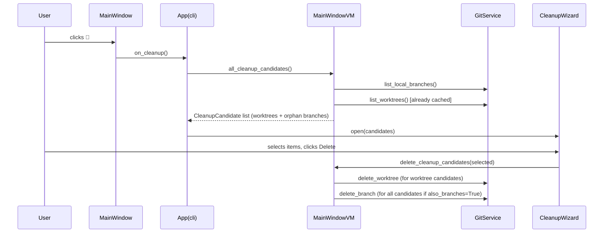

# Branch Cleaner — Extended Cleanup

## Overview

The Cleanup Wizard currently only surfaces worktrees that are stale or merged. This means it silently exits when the repo has only one worktree (main), even if there are many local branches that could be deleted. This feature extends the wizard to also target **orphan branches** — local branches that have no associated worktree but are either merged into main or have not had a commit within the configured `stale_days` window.

## UI / Flow

### Current behaviour (only worktrees)

```
[🧹 button] → cleanup_candidates() returns [] → wizard never opens
```

### New behaviour

```
[🧹 button] → wizard opens with two sections
```

#### Cleanup Wizard — mixed state (worktrees + orphan branches)

```
┌─────────────────────────────────────────────────────┐
│  Cleanup Wizard                                     │
│                                                     │
│  Worktrees                                          │
│  ☑  chore/deps       (35d, stale)                  │
│  ☑  fix/old-bug      (merged)                       │
│  ☑ Also delete their branches                       │
│                                                     │
│  Branches (no worktree)                             │
│  ☑  release/1.0      (merged)                       │
│  ☐  experiment/xyz   (42d, stale)                   │
│                                                     │
│  [Select All]  [Deselect All]  [Cancel]  [Delete]   │
└─────────────────────────────────────────────────────┘
```

#### What Delete does, step by step

For each selected item:

| Selected item type | Also delete branches = ON | Also delete branches = OFF |
|---|---|---|
| Worktree (e.g. `chore/deps`) | `git worktree remove` the folder + `git branch -D chore/deps` | `git worktree remove` the folder only |
| Orphan branch (e.g. `release/1.0`) | `git branch -D release/1.0` | `git branch -D release/1.0` (branch is always deleted — there's no worktree to remove separately) |

> **Note:** For orphan branches, "Also delete their branches" has no effect — the branch *is* the only thing to delete. The checkbox only adds meaning for worktree-backed items.

#### Empty-worktrees state (new — your current situation)

```
┌─────────────────────────────────────────────────────┐
│  Cleanup Wizard                                     │
│                                                     │
│  Worktrees                                          │
│  (none to clean)                                    │
│                                                     │
│  Branches (no worktree)                             │
│  ☑  release/1.0      (merged)                       │
│  ☐  experiment/xyz   (42d, stale)                   │
│                                                     │
│  [Select All]  [Deselect All]  [Cancel]  [Delete]   │
└─────────────────────────────────────────────────────┘
```

#### Nothing to clean state

```
[🧹 button] → dialog with message "Nothing to clean up."  [OK]
```

## Architecture



### New model — `CleanupCandidate`

```
CleanupCandidate
  branch: str           # branch name
  path: str | None      # worktree path — None for orphan branches
  is_merged: bool
  is_stale: bool
  last_commit_ts: int
```

`path is None` distinguishes an orphan branch from a worktree candidate. The deletion logic skips `delete_worktree` when `path is None`.

### Changed components

| Component | Change |
|---|---|
| `models.py` | Add `CleanupCandidate` dataclass |
| `git_service.py` | Add `branch_last_commit_ts(repo, branch)` and `is_merged(repo, branch, main)` already exist; add nothing new |
| `main_window_vm.py` | Add `all_cleanup_candidates()` returning `list[CleanupCandidate]`; update `delete_cleanup_candidates` to accept `CleanupCandidate` |
| `cli.py` | `_show_cleanup` calls `all_cleanup_candidates()` instead of `cleanup_candidates()`; shows a "nothing to clean" messagebox when list is empty |
| `ui/cleanup_wizard.py` | Render two labelled sections; handle `path is None` in display |

## Open Questions

None.

## High-Level Steps

1. Add `CleanupCandidate` dataclass to `models.py` with `branch`, `path: str | None`, `is_merged`, `is_stale`, `last_commit_ts`
2. Add `all_cleanup_candidates()` to `MainWindowViewModel` — merges worktree candidates and orphan branch candidates into a single `list[CleanupCandidate]`
3. Update `delete_cleanup_candidates()` in `MainWindowViewModel` to accept `list[CleanupCandidate]` and skip `delete_worktree` when `path is None`
4. Update `_show_cleanup` in `cli.py` to call `all_cleanup_candidates()` and show a "Nothing to clean up" messagebox when the list is empty
5. Rewrite `CleanupWizard` UI with two labelled sections and conditional "Also delete their branches" checkbox

## Implementation Phases

### Phase 1 — `CleanupCandidate` model

**What it covers:** Add the new dataclass that represents either a worktree-backed candidate (`path` set) or an orphan branch (`path` is `None`).

**Tests (Red) — write these first:**
```python
# tests/test_models.py  — append to existing file

def test_cleanup_candidate_worktree():
    from worktree_manager.models import CleanupCandidate
    c = CleanupCandidate(
        branch="chore/deps",
        path="/repos/proj-wt/chore-deps",
        is_merged=False,
        is_stale=True,
        last_commit_ts=1_700_000_000,
    )
    assert c.branch == "chore/deps"
    assert c.path == "/repos/proj-wt/chore-deps"
    assert c.is_stale is True
    assert c.is_merged is False


def test_cleanup_candidate_orphan_branch():
    from worktree_manager.models import CleanupCandidate
    c = CleanupCandidate(
        branch="release/1.0",
        path=None,
        is_merged=True,
        is_stale=False,
        last_commit_ts=1_700_000_000,
    )
    assert c.path is None
    assert c.is_merged is True
```

**Production code (Green):**
```python
# worktree_manager/models.py  — append after WorktreeModel

@dataclass
class CleanupCandidate:
    branch: str
    path: str | None
    is_merged: bool
    is_stale: bool
    last_commit_ts: int
```

**Done when:** Both new tests pass; existing model tests are unaffected.

---

### Phase 2 — `all_cleanup_candidates()` on the ViewModel

**What it covers:** The VM inspects cached worktrees for stale/merged non-main entries, then fetches all local branches and excludes any already covered by a worktree, producing a unified `list[CleanupCandidate]`.

**Tests (Red) — write these first:**
```python
# tests/test_main_window_vm.py  — append to existing file

def test_all_cleanup_candidates_includes_worktree_candidates(vm):
    vm.load_worktrees()
    vm._git.list_local_branches.return_value = []
    candidates = vm.all_cleanup_candidates()
    branches = [c.branch for c in candidates]
    assert "chore/deps" in branches
    assert "fix/old-bug" in branches


def test_all_cleanup_candidates_excludes_main_worktree(vm):
    vm.load_worktrees()
    vm._git.list_local_branches.return_value = []
    candidates = vm.all_cleanup_candidates()
    assert all(c.branch != "main" for c in candidates)


def test_all_cleanup_candidates_excludes_healthy_worktrees(vm):
    vm.load_worktrees()
    vm._git.list_local_branches.return_value = []
    candidates = vm.all_cleanup_candidates()
    assert all(c.branch != "feature/auth" for c in candidates)


def test_all_cleanup_candidates_worktree_has_path(vm):
    vm.load_worktrees()
    vm._git.list_local_branches.return_value = []
    candidates = vm.all_cleanup_candidates()
    wt_candidates = [c for c in candidates if c.path is not None]
    assert all(c.path for c in wt_candidates)


def test_all_cleanup_candidates_includes_orphan_merged_branch(store, git, editor):
    import time
    now = int(time.time())
    git.list_worktrees.return_value = [
        WorktreeModel("/repos/proj", "main", True, now, False, False),
    ]
    git.list_local_branches.return_value = ["main", "release/1.0"]
    git.is_merged.return_value = True
    git.last_commit_ts.return_value = now - 5 * 86400
    vm = MainWindowViewModel(
        repo_path="/repos/proj",
        config_store=store,
        git_service=git,
        editor_service=editor,
    )
    vm.load_worktrees()
    candidates = vm.all_cleanup_candidates()
    branches = [c.branch for c in candidates]
    assert "release/1.0" in branches


def test_all_cleanup_candidates_includes_orphan_stale_branch(store, git, editor):
    import time
    now = int(time.time())
    git.list_worktrees.return_value = [
        WorktreeModel("/repos/proj", "main", True, now, False, False),
    ]
    git.list_local_branches.return_value = ["main", "experiment/xyz"]
    git.is_merged.return_value = False
    git.last_commit_ts.return_value = now - 40 * 86400
    vm = MainWindowViewModel(
        repo_path="/repos/proj",
        config_store=store,
        git_service=git,
        editor_service=editor,
    )
    vm.load_worktrees()
    candidates = vm.all_cleanup_candidates()
    branches = [c.branch for c in candidates]
    assert "experiment/xyz" in branches


def test_all_cleanup_candidates_excludes_healthy_orphan_branch(store, git, editor):
    import time
    now = int(time.time())
    git.list_worktrees.return_value = [
        WorktreeModel("/repos/proj", "main", True, now, False, False),
    ]
    git.list_local_branches.return_value = ["main", "feature/wip"]
    git.is_merged.return_value = False
    git.last_commit_ts.return_value = now - 2 * 86400
    vm = MainWindowViewModel(
        repo_path="/repos/proj",
        config_store=store,
        git_service=git,
        editor_service=editor,
    )
    vm.load_worktrees()
    candidates = vm.all_cleanup_candidates()
    assert all(c.branch != "feature/wip" for c in candidates)


def test_all_cleanup_candidates_orphan_has_no_path(store, git, editor):
    import time
    now = int(time.time())
    git.list_worktrees.return_value = [
        WorktreeModel("/repos/proj", "main", True, now, False, False),
    ]
    git.list_local_branches.return_value = ["main", "release/1.0"]
    git.is_merged.return_value = True
    git.last_commit_ts.return_value = now - 5 * 86400
    vm = MainWindowViewModel(
        repo_path="/repos/proj",
        config_store=store,
        git_service=git,
        editor_service=editor,
    )
    vm.load_worktrees()
    candidates = vm.all_cleanup_candidates()
    orphans = [c for c in candidates if c.branch == "release/1.0"]
    assert len(orphans) == 1
    assert orphans[0].path is None


def test_all_cleanup_candidates_excludes_branch_already_in_worktree(vm):
    vm.load_worktrees()
    # chore/deps already has a worktree — should not appear twice as an orphan
    vm._git.list_local_branches.return_value = [
        "main", "feature/auth", "chore/deps", "fix/old-bug"
    ]
    candidates = vm.all_cleanup_candidates()
    matching = [c for c in candidates if c.branch == "chore/deps"]
    assert len(matching) == 1
```

**Production code (Green):**
```python
# worktree_manager/main_window_vm.py  — add method to MainWindowViewModel

def all_cleanup_candidates(self) -> list:
    from worktree_manager.models import CleanupCandidate
    cfg = self._store.get_repo(self._repo_path)
    stale_threshold = int(__import__("time").time()) - cfg.stale_days * 86400

    worktree_branches = {wt.branch for wt in self._worktrees}

    candidates = []

    for wt in self._worktrees:
        if not wt.is_main and (wt.is_stale or wt.is_merged):
            candidates.append(CleanupCandidate(
                branch=wt.branch,
                path=wt.path,
                is_merged=wt.is_merged,
                is_stale=wt.is_stale,
                last_commit_ts=wt.last_commit_ts,
            ))

    for branch in self._git.list_local_branches(self._repo_path):
        if branch in worktree_branches:
            continue
        ts = self._git.last_commit_ts(self._repo_path, branch)
        merged = self._git.is_merged(self._repo_path, branch, "main")
        stale = ts > 0 and ts < stale_threshold
        if merged or stale:
            candidates.append(CleanupCandidate(
                branch=branch,
                path=None,
                is_merged=merged,
                is_stale=stale,
                last_commit_ts=ts,
            ))

    return candidates
```

**Done when:** All nine new tests pass; existing `cleanup_candidates` tests are unaffected.

---

### Phase 3 — `delete_cleanup_candidates()` accepts `CleanupCandidate`

**What it covers:** Update the deletion method to work with `CleanupCandidate` — skip `delete_worktree` when `path is None`, always delete the branch when `also_delete_branches=True`, and for orphan branches always delete the branch regardless of the flag.

**Tests (Red) — write these first:**
```python
# tests/test_main_window_vm_actions.py  — append to existing file

def test_delete_cleanup_candidate_worktree_with_branch(store, git, editor):
    import time
    from worktree_manager.models import CleanupCandidate
    now = int(time.time())
    git.list_worktrees.return_value = [
        WorktreeModel("/repos/proj", "main", True, now, False, False),
    ]
    git.list_local_branches.return_value = ["main"]
    vm = MainWindowViewModel(
        repo_path="/repos/proj", config_store=store,
        git_service=git, editor_service=editor,
    )
    vm.load_worktrees()
    candidate = CleanupCandidate(
        branch="chore/deps", path="/repos/proj-wt/chore-deps",
        is_merged=False, is_stale=True, last_commit_ts=now - 35 * 86400,
    )
    vm.delete_cleanup_candidates([candidate], also_delete_branches=True)
    git.delete_worktree.assert_called_once_with(
        repo_path="/repos/proj", worktree_path="/repos/proj-wt/chore-deps"
    )
    git.delete_branch.assert_called_once_with(
        repo_path="/repos/proj", branch="chore/deps"
    )


def test_delete_cleanup_candidate_worktree_without_branch(store, git, editor):
    import time
    from worktree_manager.models import CleanupCandidate
    now = int(time.time())
    git.list_worktrees.return_value = [
        WorktreeModel("/repos/proj", "main", True, now, False, False),
    ]
    git.list_local_branches.return_value = ["main"]
    vm = MainWindowViewModel(
        repo_path="/repos/proj", config_store=store,
        git_service=git, editor_service=editor,
    )
    vm.load_worktrees()
    candidate = CleanupCandidate(
        branch="chore/deps", path="/repos/proj-wt/chore-deps",
        is_merged=False, is_stale=True, last_commit_ts=now - 35 * 86400,
    )
    vm.delete_cleanup_candidates([candidate], also_delete_branches=False)
    git.delete_worktree.assert_called_once_with(
        repo_path="/repos/proj", worktree_path="/repos/proj-wt/chore-deps"
    )
    git.delete_branch.assert_not_called()


def test_delete_cleanup_candidate_orphan_branch_always_deletes_branch(store, git, editor):
    import time
    from worktree_manager.models import CleanupCandidate
    now = int(time.time())
    git.list_worktrees.return_value = [
        WorktreeModel("/repos/proj", "main", True, now, False, False),
    ]
    git.list_local_branches.return_value = ["main"]
    vm = MainWindowViewModel(
        repo_path="/repos/proj", config_store=store,
        git_service=git, editor_service=editor,
    )
    vm.load_worktrees()
    candidate = CleanupCandidate(
        branch="release/1.0", path=None,
        is_merged=True, is_stale=False, last_commit_ts=now - 5 * 86400,
    )
    vm.delete_cleanup_candidates([candidate], also_delete_branches=False)
    git.delete_worktree.assert_not_called()
    git.delete_branch.assert_called_once_with(
        repo_path="/repos/proj", branch="release/1.0"
    )
```

**Production code (Green):**
```python
# worktree_manager/main_window_vm.py  — replace existing delete_cleanup_candidates

def delete_cleanup_candidates(self, candidates: list, also_delete_branches: bool) -> None:
    for c in candidates:
        if c.path is not None:
            self._git.delete_worktree(repo_path=self._repo_path, worktree_path=c.path)
            if also_delete_branches:
                self._git.delete_branch(repo_path=self._repo_path, branch=c.branch)
        else:
            self._git.delete_branch(repo_path=self._repo_path, branch=c.branch)
```

**Done when:** All three new deletion tests pass; existing `test_cleanup_deletes_selected` is updated to pass a `CleanupCandidate` instead of `WorktreeModel` (update that test as part of this phase).

> **Note:** Update `test_cleanup_deletes_selected` in `test_main_window_vm_actions.py`:
> ```python
> def test_cleanup_deletes_selected(vm, git):
>     import time
>     from worktree_manager.models import CleanupCandidate
>     now = int(time.time())
>     stale_candidate = CleanupCandidate(
>         branch="chore/deps", path="/repos/proj-wt/chore-deps",
>         is_merged=False, is_stale=True, last_commit_ts=now - 35 * 86400,
>     )
>     vm.delete_cleanup_candidates([stale_candidate], also_delete_branches=True)
>     git.delete_worktree.assert_called_once_with(
>         repo_path="/repos/proj", worktree_path="/repos/proj-wt/chore-deps"
>     )
>     git.delete_branch.assert_called_once_with(
>         repo_path="/repos/proj", branch="chore/deps"
>     )
> ```

---

### Phase 4 — `_show_cleanup` in `cli.py`

**What it covers:** Wire `all_cleanup_candidates()` into the app shell; show a messagebox when there's nothing to clean rather than silently returning.

**Tests (Red) — write these first:**
```python
# tests/test_cli.py  — append to existing file

from unittest.mock import MagicMock, patch
from worktree_manager.models import CleanupCandidate
import time


def _make_vm(candidates):
    vm = MagicMock()
    vm.all_cleanup_candidates.return_value = candidates
    return vm


def test_show_cleanup_opens_wizard_when_candidates_exist():
    import worktree_manager.cli as cli_mod
    vm = _make_vm([
        CleanupCandidate("chore/deps", "/wt/chore-deps", False, True, 0)
    ])
    with patch.object(cli_mod, "CleanupWizard") as MockWizard:
        with patch("tkinter.messagebox.showinfo") as mock_info:
            app = object.__new__(cli_mod.App)
            app._root = MagicMock()
            app._current_frame = MagicMock()
            app._show_cleanup(vm)
    MockWizard.assert_called_once()
    mock_info.assert_not_called()


def test_show_cleanup_shows_messagebox_when_empty():
    import worktree_manager.cli as cli_mod
    vm = _make_vm([])
    with patch.object(cli_mod, "CleanupWizard") as MockWizard:
        with patch("tkinter.messagebox.showinfo") as mock_info:
            app = object.__new__(cli_mod.App)
            app._root = MagicMock()
            app._current_frame = MagicMock()
            app._show_cleanup(vm)
    MockWizard.assert_not_called()
    mock_info.assert_called_once()
```

**Production code (Green):**
```python
# worktree_manager/cli.py  — replace _show_cleanup method

def _show_cleanup(self, main_vm):
    import tkinter.messagebox as mb
    from worktree_manager.ui.cleanup_wizard import CleanupWizard
    candidates = main_vm.all_cleanup_candidates()
    if not candidates:
        mb.showinfo("Cleanup", "Nothing to clean up.")
        return

    def _on_delete(selected, also_branches):
        main_vm.delete_cleanup_candidates(selected, also_branches)
        if self._current_frame and hasattr(self._current_frame, "refresh"):
            self._current_frame.refresh()

    CleanupWizard(self._root, candidates=candidates, on_delete_selected=_on_delete)
```

**Done when:** Both CLI tests pass; the wizard no longer silently exits when there are only orphan branch candidates.

---

### Phase 5 — `CleanupWizard` UI with two sections

**What it covers:** Rewrite the wizard to render a "Worktrees" section and a "Branches (no worktree)" section, show the "Also delete their branches" checkbox only when worktree candidates are present, and pass `CleanupCandidate` objects to the delete callback.

**Tests (Red) — write these first:**
```python
# tests/test_ui_smoke.py  — append to existing file

def test_cleanup_wizard_smoke_mixed(tmp_path):
    import customtkinter as ctk
    from worktree_manager.models import CleanupCandidate
    from worktree_manager.ui.cleanup_wizard import CleanupWizard
    import time
    now = int(time.time())
    root = ctk.CTk()
    root.withdraw()
    candidates = [
        CleanupCandidate("chore/deps", "/wt/chore-deps", False, True, now - 35 * 86400),
        CleanupCandidate("release/1.0", None, True, False, now - 5 * 86400),
    ]
    called = {}
    def on_delete(selected, also_branches):
        called["selected"] = selected
        called["also_branches"] = also_branches
    wizard = CleanupWizard(root, candidates=candidates, on_delete_selected=on_delete)
    wizard.destroy()
    root.destroy()


def test_cleanup_wizard_smoke_orphans_only(tmp_path):
    import customtkinter as ctk
    from worktree_manager.models import CleanupCandidate
    from worktree_manager.ui.cleanup_wizard import CleanupWizard
    import time
    now = int(time.time())
    root = ctk.CTk()
    root.withdraw()
    candidates = [
        CleanupCandidate("release/1.0", None, True, False, now - 5 * 86400),
    ]
    wizard = CleanupWizard(root, candidates=candidates, on_delete_selected=lambda s, b: None)
    wizard.destroy()
    root.destroy()
```

**Production code (Green):**
```python
# worktree_manager/ui/cleanup_wizard.py  — full replacement

import time
import customtkinter as ctk
from worktree_manager.models import CleanupCandidate


def _fmt_age(ts: int) -> str:
    if ts == 0:
        return "no commits"
    diff = int(time.time()) - ts
    return f"{diff // 86400}d"


class CleanupWizard(ctk.CTkToplevel):
    def __init__(self, master, candidates: list, on_delete_selected):
        super().__init__(master)
        self.title("Cleanup Wizard")
        self.resizable(False, False)
        self._on_delete_selected = on_delete_selected
        self._vars: list = []
        self._candidates: list = []

        self._worktree_candidates = [c for c in candidates if c.path is not None]
        self._branch_candidates = [c for c in candidates if c.path is None]

        self._build()

    def _build(self):
        ctk.CTkLabel(
            self, text="Cleanup Wizard", font=ctk.CTkFont(size=16, weight="bold")
        ).pack(pady=(20, 4))

        # Worktrees section
        ctk.CTkLabel(
            self, text="Worktrees", font=ctk.CTkFont(weight="bold"), anchor="w"
        ).pack(fill="x", padx=24, pady=(8, 2))

        if self._worktree_candidates:
            for c in self._worktree_candidates:
                var = ctk.BooleanVar(value=c.is_stale or c.is_merged)
                self._vars.append(var)
                self._candidates.append(c)
                reason = "merged" if c.is_merged else f"{_fmt_age(c.last_commit_ts)}, stale"
                ctk.CTkCheckBox(
                    self, text=f"{c.branch}  ({reason})", variable=var
                ).pack(anchor="w", padx=24, pady=2)

            self._also_branches = ctk.BooleanVar(value=True)
            ctk.CTkCheckBox(
                self, text="Also delete their branches", variable=self._also_branches
            ).pack(anchor="w", padx=24, pady=(6, 2))
        else:
            self._also_branches = ctk.BooleanVar(value=False)
            ctk.CTkLabel(
                self, text="(none to clean)", text_color="gray", anchor="w"
            ).pack(fill="x", padx=24, pady=2)

        # Branches section
        ctk.CTkLabel(
            self, text="Branches (no worktree)", font=ctk.CTkFont(weight="bold"), anchor="w"
        ).pack(fill="x", padx=24, pady=(12, 2))

        if self._branch_candidates:
            for c in self._branch_candidates:
                var = ctk.BooleanVar(value=c.is_stale or c.is_merged)
                self._vars.append(var)
                self._candidates.append(c)
                reason = "merged" if c.is_merged else f"{_fmt_age(c.last_commit_ts)}, stale"
                ctk.CTkCheckBox(
                    self, text=f"{c.branch}  ({reason})", variable=var
                ).pack(anchor="w", padx=24, pady=2)
        else:
            ctk.CTkLabel(
                self, text="(none to clean)", text_color="gray", anchor="w"
            ).pack(fill="x", padx=24, pady=2)

        btns = ctk.CTkFrame(self)
        btns.pack(fill="x", padx=24, pady=16)
        ctk.CTkButton(
            btns, text="Select All", fg_color="gray", command=self._select_all
        ).pack(side="left", padx=(0, 4))
        ctk.CTkButton(
            btns, text="Deselect All", fg_color="gray", command=self._deselect_all
        ).pack(side="left")
        ctk.CTkButton(
            btns, text="Cancel", fg_color="gray", command=self.destroy
        ).pack(side="left", padx=8)
        ctk.CTkButton(
            btns, text="Delete", fg_color="#c0392b", command=self._delete_selected
        ).pack(side="right")

    def _select_all(self):
        for v in self._vars:
            v.set(True)

    def _deselect_all(self):
        for v in self._vars:
            v.set(False)

    def _delete_selected(self):
        selected = [c for c, v in zip(self._candidates, self._vars) if v.get()]
        self._on_delete_selected(selected, self._also_branches.get())
        self.destroy()
```

**Done when:** Both smoke tests pass; the wizard renders two sections, shows the "Also delete their branches" checkbox only under the Worktrees section, and the Delete button passes `CleanupCandidate` objects to the callback.

---

## Feature Acceptance Checklist

- [ ] Clicking 🧹 when there are only orphan branches (no stale/merged worktrees) opens the wizard and lists those branches
- [ ] Clicking 🧹 when there are both stale worktrees and orphan branches shows both sections
- [ ] "Also delete their branches" checkbox appears only under the Worktrees section
- [ ] Selecting a worktree and deleting with checkbox ON removes both the worktree folder and the branch
- [ ] Selecting a worktree and deleting with checkbox OFF removes only the worktree folder
- [ ] Selecting an orphan branch and deleting always removes the branch regardless of the checkbox
- [ ] Clicking 🧹 when there is truly nothing to clean shows "Nothing to clean up." and no wizard
- [ ] All phases green (tests pass, no regressions)
