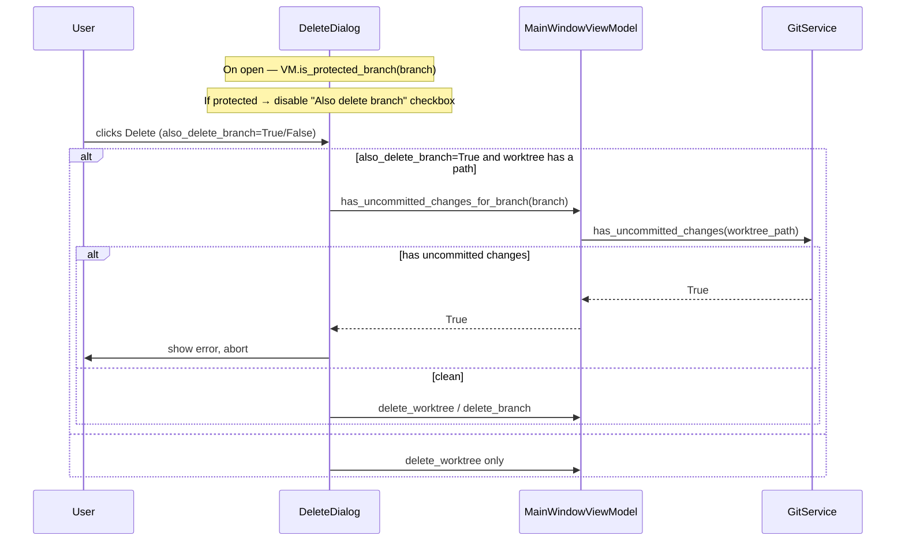

# Branch Safety & UX Improvements

## Overview

A set of targeted safety and usability improvements to the Git Worktree Manager. The changes prevent accidental deletion of protected branches, expand the cleanup wizard to cover all branches (not just stale ones), improve worktree visibility with checked-out branch name display, allow creating worktrees from existing branches, guard against deleting branches with uncommitted work, and wrap unbounded lists in scrollable containers.

## UI / Flow

### 1. Protected branch deletion prevention

`main` and `feature/...` branches are protected. Protection is enforced silently through UI controls — no error dialog is ever shown:

- **Cleanup Wizard** — protected branches are filtered out of `all_cleanup_candidates()` and never appear as candidates.
- **Delete Worktree dialog** — the "Also delete branch" checkbox is disabled and unchecked when the worktree's branch is protected. The worktree folder itself can still be removed; only the branch deletion is blocked.

```
┌────────────────────────────────────────┐
│  Delete Worktree                       │
│                                        │
│  Branch:  feature/payments             │
│  Path:    /repos/proj-wt/feature-...   │
│                                        │
│  ☐ Also delete branch  (protected)     │  ← disabled, tooltip explains why
│                                        │
│  [Cancel]                   [Delete]   │
└────────────────────────────────────────┘
```

### 2. Cleaner allows deleting any branch (not just stale)

The cleanup wizard now shows **all** local branches (except main and feature branches) — merged OR unmerged, stale OR recent — so the user can decide what to remove.

```
┌─────────────────────────────────────────────────────┐
│  Cleanup Wizard                                     │
│                                                     │
│  Worktrees                                          │
│  ☑  chore/deps       (35d, stale)                  │
│  ☑  fix/old-bug      (merged into main)             │
│  ───────────────────────────────────────────────    │
│  Healthy:                                           │
│  ☐  wip/experiment   (2d ago)                       │
│  ☑ Also delete their branches                       │
│                                                     │
│  Branches (no worktree)                             │
│  ☑  release/1.0      (merged into main)             │
│  ───────────────────────────────────────────────    │
│  Healthy:                                           │
│  ☐  hotfix/patch     (1d ago)                       │
│                                                     │
│  [Select All]  [Deselect All]  [Cancel]  [Delete]   │
└─────────────────────────────────────────────────────┘
```

Within each section, stale/merged candidates are sorted to the top and pre-checked. A horizontal separator followed by a "Healthy:" label divides them from the non-stale, non-merged candidates below, which are shown unchecked. If a section has no healthy candidates, no separator or label is drawn.

### 3. Worktree list shows checked-out branch name in worktree column

Each worktree row in the main window now shows the branch that is currently checked out in that worktree directory.

```
●  main              (checked out: main)     just now
○  feature/payments  (checked out: feature/payments)   2h ago
○  fix/auth          (checked out: hotfix/2.1)  ← diverged checkout   5d ago  ⚠ stale
```

The "checked out" label comes from `git -C <worktree_path> rev-parse --abbrev-ref HEAD` — it reflects what's actually checked out in that directory, not just the branch the worktree was created for.

### 4. Create worktree from an existing branch

The Create dialog gains a toggle: **New branch** (current behaviour) vs **Existing branch**.

```
New Worktree
────────────────────────────────────────
Mode:  ○ New branch   ● Existing branch

Existing branch:  [feature/payments    ▾]   ← dropdown of local branches not yet in a worktree

☑ Open after creating
   [VS Code — new window            ▾]

[Cancel]                          [Create]
```

When "Existing branch" is selected, the worktree is created with `git worktree add <path> <branch>` (no `-b`), so it checks out the existing branch rather than creating a new one.

### 5. Uncommitted-changes guard before branch deletion

Before `git branch -D <branch>` is called for any branch, the app checks for uncommitted changes in its worktree (if one exists). If uncommitted changes are found, the deletion is blocked with a warning.

```
┌───────────────────────────────────────────────────┐
│  Cannot delete branch                             │
│                                                   │
│  "fix/auth" has uncommitted changes in:           │
│  /repos/proj-wt/fix-auth                          │
│                                                   │
│  Commit or discard changes before deleting.       │
│                                                   │
│  [                  OK                  ]         │
└───────────────────────────────────────────────────┘
```

This applies in both the Delete dialog (single worktree deletion) and the Cleanup Wizard (batch deletion).

### 6. Scroll wrapping for unbounded lists

The cleanup wizard's two sections (Worktrees and Branches) are each wrapped in a `CTkScrollableFrame` so they don't overflow the window when there are many candidates. The main window worktree list already uses a scrollable frame — no change needed there.

```
┌─────────────────────────────────────────────────────┐
│  Cleanup Wizard                                     │
│                                                     │
│  Worktrees                              ↕ scroll    │
│  ┌─────────────────────────────────────────────┐   │
│  │ ☑  chore/deps    (35d, stale)               │   │
│  │ ☑  fix/old-bug   (merged into main)         │   │
│  │ ─────────────────────────────────────────── │   │
│  │ Healthy:                                    │   │
│  │ ☐  wip/other     (2d ago)                   │   │
│  └─────────────────────────────────────────────┘   │
│  ☑ Also delete their branches                       │
│                                                     │
│  Branches (no worktree)                 ↕ scroll    │
│  ┌─────────────────────────────────────────────┐   │
│  │ ☑  release/1.0   (merged into main)         │   │
│  │ ─────────────────────────────────────────── │   │
│  │ Healthy:                                    │   │
│  │ ☐  hotfix/patch  (1d ago)                   │   │
│  └─────────────────────────────────────────────┘   │
│                                                     │
│  [Select All]  [Deselect All]  [Cancel]  [Delete]   │
└─────────────────────────────────────────────────────┘
```


## Architecture

```mermaid
graph TD
    GitService -->|new| has_uncommitted_changes
    GitService -->|new| checked_out_branch
    GitService -->|new| create_worktree_from_existing

    MainWindowViewModel -->|updated| all_cleanup_candidates
    MainWindowViewModel -->|updated| create_worktree
    MainWindowViewModel -->|new| has_uncommitted_changes_for_branch
    MainWindowViewModel -->|new| is_protected_branch

    CleanupWizard -->|sections wrapped in| CTkScrollableFrame
    CleanupWizard -->|shows all branches| not_just_stale_merged
    CleanupWizard -->|filters out| protected_branches

    CreateDialog -->|new toggle| new_vs_existing_branch
    DeleteDialog -->|disables Also-delete-branch for| protected_branches
    DeleteDialog -->|guard| uncommitted_changes_check
    MainWindow -->|shows| checked_out_branch_label
```





## Open Questions

None.

## High-Level Steps

1. Add `has_uncommitted_changes(worktree_path)`, `checked_out_branch(worktree_path)`, and `create_worktree_from_existing(repo_path, worktree_path, branch)` to `GitService`
2. Add `is_protected_branch(branch)` and `has_uncommitted_changes_for_branch(branch)` to `MainWindowViewModel`; update `create_worktree` to support existing branches
3. Update `all_cleanup_candidates()` in `MainWindowViewModel` to include all non-protected branches (not just merged/stale) and filter out protected branches
4. Update `DeleteDialog` to disable the "Also delete branch" checkbox (with a `(protected)` label) when the branch is protected; add uncommitted-changes guard that blocks deletion and shows an error
5. Update `CleanupWizard` to wrap each section in `CTkScrollableFrame`, sort stale/merged candidates to the top with a separator + "Healthy:" label before the rest, and pre-check only stale/merged items
6. Update `CreateDialog` to add New/Existing branch toggle; wire `create_worktree_from_existing` through the VM
7. Add `checked_out_branch` label to each worktree row in `MainWindow`

## Implementation Phases

### Phase 1 — New `GitService` methods

**What it covers:** Three new git operations needed by later phases: detecting uncommitted changes in a worktree, reading the currently checked-out branch in a worktree directory, and creating a worktree from an existing branch.

**Tests (Red) — write these first:**
```python
# tests/test_git_service.py  (new file)

import subprocess
import pytest
from unittest.mock import patch, MagicMock
from worktree_manager.git_service import GitService


@pytest.fixture
def git():
    return GitService()


def test_has_uncommitted_changes_returns_true_when_dirty(git):
    with patch.object(git, "_run", return_value="M modified_file.py\n"):
        assert git.has_uncommitted_changes("/repos/proj-wt/fix-auth") is True


def test_has_uncommitted_changes_returns_false_when_clean(git):
    with patch.object(git, "_run", return_value=""):
        assert git.has_uncommitted_changes("/repos/proj-wt/fix-auth") is False


def test_has_uncommitted_changes_returns_false_on_error(git):
    with patch.object(git, "_run", side_effect=subprocess.CalledProcessError(1, "git")):
        assert git.has_uncommitted_changes("/repos/proj-wt/fix-auth") is False


def test_checked_out_branch_returns_branch_name(git):
    with patch.object(git, "_run", return_value="hotfix/2.1\n"):
        assert git.checked_out_branch("/repos/proj-wt/fix-auth") == "hotfix/2.1"


def test_checked_out_branch_returns_detached_on_error(git):
    with patch.object(git, "_run", side_effect=subprocess.CalledProcessError(1, "git")):
        assert git.checked_out_branch("/repos/proj-wt/fix-auth") == "(detached)"


def test_create_worktree_from_existing_calls_correct_command(git):
    with patch.object(git, "_run") as mock_run:
        git.create_worktree_from_existing(
            repo_path="/repos/proj",
            worktree_path="/repos/proj-wt/feature-payments",
            branch="feature/payments",
        )
        mock_run.assert_called_once_with(
            ["git", "worktree", "add", "/repos/proj-wt/feature-payments", "feature/payments"],
            cwd="/repos/proj",
        )
```

**Production code (Green):**
```python
# worktree_manager/git_service.py  — add these three methods to GitService

def has_uncommitted_changes(self, worktree_path: str) -> bool:
    try:
        out = self._run(["git", "status", "--porcelain"], cwd=worktree_path)
        return bool(out.strip())
    except subprocess.CalledProcessError:
        return False

def checked_out_branch(self, worktree_path: str) -> str:
    try:
        return self._run(
            ["git", "rev-parse", "--abbrev-ref", "HEAD"], cwd=worktree_path
        ).strip()
    except subprocess.CalledProcessError:
        return "(detached)"

def create_worktree_from_existing(
    self, repo_path: str, worktree_path: str, branch: str
) -> None:
    self._run(
        ["git", "worktree", "add", worktree_path, branch],
        cwd=repo_path,
    )
```

**Done when:** All six new git service tests pass; existing git service behaviour is unaffected.

---

### Phase 2 — VM: `is_protected_branch`, `has_uncommitted_changes_for_branch`, updated `create_worktree`

**What it covers:** Two new predicate methods on the VM plus an updated `create_worktree` that accepts an `existing: bool` flag.

**Tests (Red) — write these first:**
```python
# tests/test_main_window_vm.py  — append to existing file

def test_is_protected_branch_main(vm):
    assert vm.is_protected_branch("main") is True


def test_is_protected_branch_feature(vm):
    assert vm.is_protected_branch("feature/payments") is True


def test_is_protected_branch_regular(vm):
    assert vm.is_protected_branch("chore/deps") is False


def test_is_protected_branch_fix(vm):
    assert vm.is_protected_branch("fix/auth") is False


def test_has_uncommitted_changes_for_branch_true(vm):
    vm._git.has_uncommitted_changes.return_value = True
    result = vm.has_uncommitted_changes_for_branch("chore/deps")
    assert result is True
    vm._git.has_uncommitted_changes.assert_called_once_with(
        "/repos/proj-wt/chore-deps"
    )


def test_has_uncommitted_changes_for_branch_false(vm):
    vm._git.has_uncommitted_changes.return_value = False
    assert vm.has_uncommitted_changes_for_branch("chore/deps") is False


def test_has_uncommitted_changes_for_branch_no_worktree(vm):
    # Branch has no worktree — no path to check, returns False
    assert vm.has_uncommitted_changes_for_branch("orphan/branch") is False


def test_create_worktree_existing_branch_calls_from_existing(vm):
    vm.create_worktree(branch="feature/payments", base_branch=None, existing=True)
    vm._git.create_worktree_from_existing.assert_called_once_with(
        repo_path="/repos/proj",
        worktree_path="/repos/proj-wt/feature-payments",
        branch="feature/payments",
    )


def test_create_worktree_new_branch_calls_create(vm):
    vm.create_worktree(branch="fix/new", base_branch="main", existing=False)
    vm._git.create_worktree.assert_called_once_with(
        repo_path="/repos/proj",
        worktree_path="/repos/proj-wt/fix-new",
        branch="fix/new",
        base_branch="main",
    )
```

**Production code (Green):**
```python
# worktree_manager/main_window_vm.py  — add methods and update create_worktree

def is_protected_branch(self, branch: str) -> bool:
    return branch == "main" or branch.startswith("feature/")

def has_uncommitted_changes_for_branch(self, branch: str) -> bool:
    path = self.worktree_path_for_branch(branch)
    # Only check if the worktree directory actually exists
    import os
    if not os.path.isdir(path):
        return False
    return self._git.has_uncommitted_changes(path)

def create_worktree(self, branch: str, base_branch: str | None, existing: bool = False) -> None:
    path = self.worktree_path_for_branch(branch)
    if existing:
        self._git.create_worktree_from_existing(
            repo_path=self._repo_path,
            worktree_path=path,
            branch=branch,
        )
    else:
        self._git.create_worktree(
            repo_path=self._repo_path,
            worktree_path=path,
            branch=branch,
            base_branch=base_branch,
        )
```

**Done when:** All ten new VM tests pass; existing `create_worktree` callers still work (they omit `existing` and get `False` by default).

---

### Phase 3 — `all_cleanup_candidates()` includes all non-protected branches

**What it covers:** Expand `all_cleanup_candidates()` to include healthy (non-stale, non-merged) branches, while filtering out protected branches (`main` and `feature/...`). The returned list still contains all information needed for sorting/pre-checking in the UI.

**Tests (Red) — write these first:**
```python
# tests/test_main_window_vm.py  — append to existing file

def test_all_cleanup_candidates_excludes_protected_worktree(vm):
    vm.load_worktrees()
    vm._git.list_local_branches.return_value = []
    candidates = vm.all_cleanup_candidates()
    assert all(not c.branch.startswith("feature/") for c in candidates)
    assert all(c.branch != "main" for c in candidates)


def test_all_cleanup_candidates_includes_healthy_worktree(vm):
    # feature/auth is healthy (not stale, not merged) but NOT protected for this test
    # Use a non-feature healthy worktree to verify healthy items are included
    import time
    now = int(time.time())
    from worktree_manager.models import WorktreeModel
    vm._git.list_worktrees.return_value = [
        WorktreeModel("/repos/proj", "main", True, now, False, False),
        WorktreeModel("/repos/proj-wt/wip-thing", "wip/thing", False, now - 2 * 86400, False, False),
    ]
    vm._git.list_local_branches.return_value = []
    vm._git.is_merged_into_any.return_value = (False, None)
    vm.load_worktrees()
    candidates = vm.all_cleanup_candidates()
    assert any(c.branch == "wip/thing" for c in candidates)


def test_all_cleanup_candidates_excludes_protected_orphan(store, git, editor):
    import time
    now = int(time.time())
    from worktree_manager.models import WorktreeModel
    git.list_worktrees.return_value = [
        WorktreeModel("/repos/proj", "main", True, now, False, False),
    ]
    git.list_local_branches.return_value = ["main", "feature/payments", "fix/thing"]
    git.list_feature_branches.return_value = ["feature/payments"]
    git.is_merged_into_any.return_value = (True, "main")
    git.last_commit_ts.return_value = now - 5 * 86400
    vm = MainWindowViewModel(
        repo_path="/repos/proj", config_store=store,
        git_service=git, editor_service=editor,
    )
    vm.load_worktrees()
    candidates = vm.all_cleanup_candidates()
    assert all(c.branch != "feature/payments" for c in candidates)
    assert all(c.branch != "main" for c in candidates)


def test_all_cleanup_candidates_includes_healthy_orphan(store, git, editor):
    import time
    now = int(time.time())
    from worktree_manager.models import WorktreeModel
    git.list_worktrees.return_value = [
        WorktreeModel("/repos/proj", "main", True, now, False, False),
    ]
    git.list_local_branches.return_value = ["main", "hotfix/patch"]
    git.list_feature_branches.return_value = []
    git.is_merged_into_any.return_value = (False, None)
    git.last_commit_ts.return_value = now - 1 * 86400
    vm = MainWindowViewModel(
        repo_path="/repos/proj", config_store=store,
        git_service=git, editor_service=editor,
    )
    vm.load_worktrees()
    candidates = vm.all_cleanup_candidates()
    assert any(c.branch == "hotfix/patch" for c in candidates)
```

**Production code (Green):**
```python
# worktree_manager/main_window_vm.py  — replace all_cleanup_candidates

def all_cleanup_candidates(self) -> list:
    import time
    from worktree_manager.models import CleanupCandidate
    cfg = self._store.get_repo(self._repo_path)
    stale_threshold = int(time.time()) - cfg.stale_days * 86400

    feature_branches = self._git.list_feature_branches(self._repo_path)
    merge_targets = ["main"] + feature_branches

    worktree_branches = {wt.branch for wt in self._worktrees}
    candidates = []

    for wt in self._worktrees:
        if wt.is_main:
            continue
        if self.is_protected_branch(wt.branch):
            continue
        merged, merged_into = self._git.is_merged_into_any(
            self._repo_path, wt.branch, merge_targets
        )
        stale = wt.last_commit_ts > 0 and wt.last_commit_ts < stale_threshold
        candidates.append(CleanupCandidate(
            branch=wt.branch,
            path=wt.path,
            is_merged=merged,
            is_stale=stale,
            last_commit_ts=wt.last_commit_ts,
            merged_into=merged_into,
        ))

    for branch in self._git.list_local_branches(self._repo_path):
        if branch in worktree_branches:
            continue
        if self.is_protected_branch(branch):
            continue
        ts = self._git.last_commit_ts(self._repo_path, branch)
        merged, merged_into = self._git.is_merged_into_any(
            self._repo_path, branch, merge_targets
        )
        stale = ts > 0 and ts < stale_threshold
        candidates.append(CleanupCandidate(
            branch=branch,
            path=None,
            is_merged=merged,
            is_stale=stale,
            last_commit_ts=ts,
            merged_into=merged_into,
        ))

    return candidates
```

**Done when:** All four new tests pass; all existing `all_cleanup_candidates` tests still pass (healthy branches now included, protected filtered).

---

### Phase 4 — `DeleteDialog` protected-branch + uncommitted-changes guards

**What it covers:** When the DeleteDialog opens for a protected branch, the "Also delete branch" checkbox is disabled and labelled `(protected)`. When the user clicks Delete and `also_delete_branch=True`, the VM checks for uncommitted changes; if found, an error messagebox is shown and deletion is aborted.

**Tests (Red) — write these first:**
```python
# tests/test_ui_smoke.py  — append to existing file

def test_delete_dialog_disables_checkbox_for_protected_branch():
    import customtkinter as ctk
    from worktree_manager.models import WorktreeModel
    from worktree_manager.ui.delete_dialog import DeleteDialog
    import time
    now = int(time.time())
    root = ctk.CTk()
    root.withdraw()
    wt = WorktreeModel(
        path="/repos/proj-wt/feature-payments",
        branch="feature/payments",
        is_main=False,
        last_commit_ts=now,
        is_merged=False,
        is_stale=False,
    )
    dialog = DeleteDialog(
        root, wt=wt, on_delete=lambda w, b: None,
        live_window=None, is_protected=True,
    )
    assert dialog._also_branch.get() is False
    dialog.destroy()
    root.destroy()


def test_delete_dialog_allows_checkbox_for_normal_branch():
    import customtkinter as ctk
    from worktree_manager.models import WorktreeModel
    from worktree_manager.ui.delete_dialog import DeleteDialog
    import time
    now = int(time.time())
    root = ctk.CTk()
    root.withdraw()
    wt = WorktreeModel(
        path="/repos/proj-wt/fix-auth",
        branch="fix/auth",
        is_main=False,
        last_commit_ts=now,
        is_merged=False,
        is_stale=False,
    )
    dialog = DeleteDialog(
        root, wt=wt, on_delete=lambda w, b: None,
        live_window=None, is_protected=False,
    )
    assert dialog._also_branch.get() is True
    dialog.destroy()
    root.destroy()
```

**Production code (Green):**
```python
# worktree_manager/ui/delete_dialog.py  — full replacement

import tkinter.messagebox as mb
import customtkinter as ctk
from worktree_manager.models import WorktreeModel


class DeleteDialog(ctk.CTkToplevel):
    def __init__(self, master, wt: WorktreeModel, on_delete,
                 live_window=None, is_protected: bool = False,
                 has_uncommitted: bool = False):
        super().__init__(master)
        self.title("Delete Worktree")
        self.geometry("420x300")
        self.resizable(False, False)
        self._wt = wt
        self._on_delete = on_delete
        self._live_window = live_window
        self._is_protected = is_protected
        self._has_uncommitted = has_uncommitted
        self._also_branch = ctk.BooleanVar(value=False if is_protected else True)
        self._build()

    def _build(self):
        ctk.CTkLabel(
            self, text="Delete worktree?", font=ctk.CTkFont(weight="bold")
        ).pack(padx=24, pady=(20, 8))
        ctk.CTkLabel(
            self, text=f"Branch:  {self._wt.branch}", anchor="w"
        ).pack(fill="x", padx=24)
        ctk.CTkLabel(
            self, text=f"Path:    {self._wt.path}", anchor="w", wraplength=340
        ).pack(fill="x", padx=24, pady=(0, 8))

        if self._live_window is not None:
            editor_name = self._live_window.editor.title()
            ctk.CTkLabel(
                self,
                text=f'⚠ "{self._wt.branch}" is currently open in {editor_name}.\nThe editor window will be closed automatically.',
                text_color="orange",
                justify="center",
            ).pack(pady=(0, 8), padx=24)

        checkbox_text = (
            "Also delete branch  (protected)" if self._is_protected
            else "Also delete branch"
        )
        cb = ctk.CTkCheckBox(
            self, text=checkbox_text, variable=self._also_branch
        )
        cb.pack(anchor="w", padx=24, pady=4)
        if self._is_protected:
            cb.configure(state="disabled")

        btns = ctk.CTkFrame(self)
        btns.pack(fill="x", padx=24, pady=16)
        ctk.CTkButton(
            btns, text="Cancel", fg_color="gray", command=self.destroy
        ).pack(side="left")

        confirm_label = "Delete & Close" if self._live_window is not None else "Delete"
        ctk.CTkButton(
            btns, text=confirm_label, fg_color="#c0392b", command=self._delete
        ).pack(side="right")

    def _delete(self):
        if self._also_branch.get() and self._has_uncommitted:
            mb.showerror(
                "Cannot delete branch",
                f'"{self._wt.branch}" has uncommitted changes.\n\n'
                "Commit or discard changes before deleting.",
            )
            return
        self._on_delete(self._wt, self._also_branch.get())
        self.destroy()
```

Also update the caller in `main_window.py` to pass `is_protected` and `has_uncommitted`:
```python
# worktree_manager/ui/main_window.py  — update _open_delete

def _open_delete(self, wt: WorktreeModel):
    from worktree_manager.ui.delete_dialog import DeleteDialog
    live = self._vm.get_window(wt.path)
    is_protected = self._vm.is_protected_branch(wt.branch)
    has_uncommitted = self._vm.has_uncommitted_changes_for_branch(wt.branch)
    DeleteDialog(
        self, wt=wt, on_delete=self._handle_delete,
        live_window=live, is_protected=is_protected,
        has_uncommitted=has_uncommitted,
    )
```

**Done when:** Both new dialog smoke tests pass; the checkbox is disabled for protected branches and the uncommitted-changes error fires before any git call.

---

### Phase 5 — `CleanupWizard` scrollable sections, sorting, and Healthy label

**What it covers:** Wrap each section's item list in a `CTkScrollableFrame`, sort stale/merged items to the top (pre-checked), add a separator + "Healthy:" label before non-stale, non-merged items (unchecked), and omit the separator if a section has no healthy items.

**Tests (Red) — write these first:**
```python
# tests/test_cleanup_wizard_merged_into.py  — append to existing file

def test_wizard_healthy_items_are_unchecked(root):
    from worktree_manager.ui.cleanup_wizard import CleanupWizard
    from worktree_manager.models import CleanupCandidate
    import time
    now = int(time.time())
    healthy = CleanupCandidate(
        branch="wip/thing", path=None, is_merged=False, is_stale=False,
        last_commit_ts=now - 2 * 86400, merged_into=None,
    )
    stale = CleanupCandidate(
        branch="old/thing", path=None, is_merged=False, is_stale=True,
        last_commit_ts=now - 40 * 86400, merged_into=None,
    )
    called = {}
    def on_delete(selected, also_branches):
        called["selected"] = selected
    wiz = CleanupWizard(root, candidates=[healthy, stale], on_delete_selected=on_delete)
    # Verify stale is pre-checked and healthy is not by inspecting internal vars
    # _candidates order: stale first (sorted to top), then healthy
    stale_idx = next(i for i, c in enumerate(wiz._candidates) if c.branch == "old/thing")
    healthy_idx = next(i for i, c in enumerate(wiz._candidates) if c.branch == "wip/thing")
    assert wiz._vars[stale_idx].get() is True
    assert wiz._vars[healthy_idx].get() is False
    wiz.destroy()


def test_wizard_stale_sorted_before_healthy(root):
    from worktree_manager.ui.cleanup_wizard import CleanupWizard
    from worktree_manager.models import CleanupCandidate
    import time
    now = int(time.time())
    healthy = CleanupCandidate(
        branch="wip/thing", path=None, is_merged=False, is_stale=False,
        last_commit_ts=now - 2 * 86400, merged_into=None,
    )
    stale = CleanupCandidate(
        branch="old/thing", path=None, is_merged=False, is_stale=True,
        last_commit_ts=now - 40 * 86400, merged_into=None,
    )
    wiz = CleanupWizard(root, candidates=[healthy, stale], on_delete_selected=lambda s, b: None)
    branches_in_order = [c.branch for c in wiz._candidates]
    assert branches_in_order.index("old/thing") < branches_in_order.index("wip/thing")
    wiz.destroy()


def test_cleanup_wizard_smoke_with_healthy_and_stale(root):
    from worktree_manager.ui.cleanup_wizard import CleanupWizard
    from worktree_manager.models import CleanupCandidate
    import time
    now = int(time.time())
    candidates = [
        CleanupCandidate("chore/deps", "/wt/chore-deps", False, True, now - 35 * 86400),
        CleanupCandidate("wip/thing", "/wt/wip-thing", False, False, now - 2 * 86400),
        CleanupCandidate("release/1.0", None, True, False, now - 5 * 86400),
        CleanupCandidate("hotfix/patch", None, False, False, now - 1 * 86400),
    ]
    wiz = CleanupWizard(root, candidates=candidates, on_delete_selected=lambda s, b: None)
    wiz.destroy()
```

**Production code (Green):**
```python
# worktree_manager/ui/cleanup_wizard.py  — full replacement

import time
import customtkinter as ctk
from worktree_manager.models import CleanupCandidate


def _fmt_age(ts: int) -> str:
    if ts == 0:
        return "no commits"
    diff = int(time.time()) - ts
    return f"{diff // 86400}d"


def _reason(c) -> str:
    if c.is_merged:
        target = c.merged_into or "main"
        return f"merged into {target}"
    if c.is_stale:
        return f"{_fmt_age(c.last_commit_ts)}, stale"
    return f"{_fmt_age(c.last_commit_ts)} ago"


def _sort_candidates(candidates: list) -> list:
    """Stale/merged first, healthy last."""
    priority = [c for c in candidates if c.is_stale or c.is_merged]
    healthy = [c for c in candidates if not c.is_stale and not c.is_merged]
    return priority + healthy


class CleanupWizard(ctk.CTkToplevel):
    def __init__(self, master, candidates: list, on_delete_selected):
        super().__init__(master)
        self.title("Cleanup Wizard")
        self.resizable(False, False)
        self._on_delete_selected = on_delete_selected
        self._vars: list = []
        self._candidates: list = []

        worktree_candidates = _sort_candidates([c for c in candidates if c.path is not None])
        branch_candidates = _sort_candidates([c for c in candidates if c.path is None])

        self._build(worktree_candidates, branch_candidates)

    def _build(self, worktree_candidates, branch_candidates):
        ctk.CTkLabel(
            self, text="Cleanup Wizard", font=ctk.CTkFont(size=16, weight="bold")
        ).pack(pady=(20, 4))

        self._build_section(
            label="Worktrees",
            candidates=worktree_candidates,
            show_also_branches=True,
        )

        self._build_section(
            label="Branches (no worktree)",
            candidates=branch_candidates,
            show_also_branches=False,
        )

        btns = ctk.CTkFrame(self)
        btns.pack(fill="x", padx=24, pady=16)
        ctk.CTkButton(
            btns, text="Select All", fg_color="gray", command=self._select_all
        ).pack(side="left", padx=(0, 4))
        ctk.CTkButton(
            btns, text="Deselect All", fg_color="gray", command=self._deselect_all
        ).pack(side="left")
        ctk.CTkButton(
            btns, text="Cancel", fg_color="gray", command=self.destroy
        ).pack(side="left", padx=8)
        ctk.CTkButton(
            btns, text="Delete", fg_color="#c0392b", command=self._delete_selected
        ).pack(side="right")

    def _build_section(self, label: str, candidates: list, show_also_branches: bool):
        ctk.CTkLabel(
            self, text=label, font=ctk.CTkFont(weight="bold"), anchor="w"
        ).pack(fill="x", padx=24, pady=(12, 2))

        if not candidates:
            ctk.CTkLabel(
                self, text="(none to clean)", text_color="gray", anchor="w"
            ).pack(fill="x", padx=24, pady=2)
            if show_also_branches:
                self._also_branches = ctk.BooleanVar(value=False)
            return

        scroll = ctk.CTkScrollableFrame(self, height=140)
        scroll.pack(fill="x", padx=24, pady=(0, 4))

        priority = [c for c in candidates if c.is_stale or c.is_merged]
        healthy = [c for c in candidates if not c.is_stale and not c.is_merged]

        for c in priority:
            self._add_item(scroll, c, pre_checked=True)

        if healthy:
            ctk.CTkFrame(scroll, height=1, fg_color="gray50").pack(fill="x", pady=(6, 2))
            ctk.CTkLabel(
                scroll, text="Healthy:", text_color="gray",
                font=ctk.CTkFont(size=11), anchor="w"
            ).pack(fill="x", padx=4, pady=(0, 2))
            for c in healthy:
                self._add_item(scroll, c, pre_checked=False)

        if show_also_branches:
            self._also_branches = ctk.BooleanVar(value=bool(priority))
            ctk.CTkCheckBox(
                self, text="Also delete their branches", variable=self._also_branches
            ).pack(anchor="w", padx=24, pady=(4, 2))

    def _add_item(self, parent, c: CleanupCandidate, pre_checked: bool):
        var = ctk.BooleanVar(value=pre_checked)
        self._vars.append(var)
        self._candidates.append(c)
        ctk.CTkCheckBox(
            parent, text=f"{c.branch}  ({_reason(c)})", variable=var
        ).pack(anchor="w", padx=4, pady=2)

    def _select_all(self):
        for v in self._vars:
            v.set(True)

    def _deselect_all(self):
        for v in self._vars:
            v.set(False)

    def _delete_selected(self):
        selected = [c for c, v in zip(self._candidates, self._vars) if v.get()]
        self._on_delete_selected(selected, self._also_branches.get())
        self.destroy()
```

**Done when:** All three new wizard tests pass; existing wizard smoke and merged-into tests still pass; stale/merged items appear above the separator, healthy items appear below unchecked.

---

### Phase 6 — `CreateDialog` New/Existing branch toggle

**What it covers:** Add a radio-button toggle between "New branch" and "Existing branch" modes. In Existing mode the branch name entry is replaced by a dropdown of local branches not already in a worktree. The VM's updated `create_worktree(existing=True)` is called when Existing is selected.

**Tests (Red) — write these first:**
```python
# tests/test_ui_smoke.py  — append to existing file

def test_create_dialog_smoke_new_branch_mode():
    import customtkinter as ctk
    from worktree_manager.ui.create_dialog import CreateDialog
    root = ctk.CTk()
    root.withdraw()
    dialog = CreateDialog(
        root,
        branches=["main", "feature/payments"],
        existing_branches=[],
        default_editor="cursor",
        default_mode="reuse",
        on_create=lambda *a: None,
    )
    dialog.destroy()
    root.destroy()


def test_create_dialog_smoke_existing_branch_mode():
    import customtkinter as ctk
    from worktree_manager.ui.create_dialog import CreateDialog
    root = ctk.CTk()
    root.withdraw()
    dialog = CreateDialog(
        root,
        branches=["main", "feature/payments"],
        existing_branches=["fix/auth", "chore/deps"],
        default_editor="cursor",
        default_mode="reuse",
        on_create=lambda *a: None,
    )
    dialog.destroy()
    root.destroy()
```

**Production code (Green):**
```python
# worktree_manager/ui/create_dialog.py  — full replacement

import customtkinter as ctk

EDITOR_CHOICES = [
    ("VS Code — new window",   "vscode", False),
    ("VS Code — reuse window", "vscode", True),
    ("Cursor — new window",    "cursor", False),
    ("Cursor — reuse window",  "cursor", True),
]


class CreateDialog(ctk.CTkToplevel):
    def __init__(self, master, branches: list, existing_branches: list,
                 default_editor: str, default_mode: str, on_create):
        super().__init__(master)
        self.title("New Worktree")
        self.resizable(False, False)
        self._branches = branches
        self._existing_branches = existing_branches
        self._on_create = on_create
        self._default_editor = default_editor
        self._default_mode = default_mode
        self._mode_var = ctk.StringVar(value="new")
        self._build()

    def _build(self):
        # Mode toggle
        mode_frame = ctk.CTkFrame(self)
        mode_frame.pack(fill="x", padx=24, pady=(20, 8))
        ctk.CTkRadioButton(
            mode_frame, text="New branch", variable=self._mode_var,
            value="new", command=self._on_mode_change,
        ).pack(side="left", padx=(0, 16))
        ctk.CTkRadioButton(
            mode_frame, text="Existing branch", variable=self._mode_var,
            value="existing", command=self._on_mode_change,
        ).pack(side="left")

        # New branch widgets
        self._new_frame = ctk.CTkFrame(self, fg_color="transparent")
        self._new_frame.pack(fill="x", padx=24)
        ctk.CTkLabel(self._new_frame, text="Branch name:").pack(anchor="w", pady=(0, 2))
        self._branch_entry = ctk.CTkEntry(
            self._new_frame, width=300, placeholder_text="fix/"
        )
        self._branch_entry.pack(anchor="w")

        ctk.CTkLabel(self._new_frame, text="Base branch:").pack(anchor="w", pady=(12, 2))
        self._base_var = ctk.StringVar(
            value=self._branches[0] if self._branches else "main"
        )
        ctk.CTkOptionMenu(
            self._new_frame, variable=self._base_var,
            values=self._branches or ["main"],
        ).pack(anchor="w")

        # Existing branch widgets
        self._existing_frame = ctk.CTkFrame(self, fg_color="transparent")
        ctk.CTkLabel(self._existing_frame, text="Existing branch:").pack(anchor="w", pady=(0, 2))
        self._existing_var = ctk.StringVar(
            value=self._existing_branches[0] if self._existing_branches else ""
        )
        ctk.CTkOptionMenu(
            self._existing_frame, variable=self._existing_var,
            values=self._existing_branches or ["(none available)"],
        ).pack(anchor="w")

        # Shared: open after + editor
        self._open_var = ctk.BooleanVar(value=True)
        ctk.CTkCheckBox(
            self, text="Open after creating", variable=self._open_var
        ).pack(anchor="w", padx=24, pady=(16, 4))

        default_label = (
            f"{self._default_editor} — "
            f"{'reuse' if self._default_mode == 'reuse' else 'new'} window"
        )
        default_label = default_label.replace("vscode", "VS Code").replace("cursor", "Cursor")
        self._editor_var = ctk.StringVar(value=default_label)
        labels = [c[0] for c in EDITOR_CHOICES]
        ctk.CTkOptionMenu(
            self, variable=self._editor_var, values=labels
        ).pack(padx=40, anchor="w")

        btns = ctk.CTkFrame(self)
        btns.pack(fill="x", padx=24, pady=16)
        ctk.CTkButton(
            btns, text="Cancel", fg_color="gray", command=self.destroy
        ).pack(side="left")
        ctk.CTkButton(btns, text="Create", command=self._create).pack(side="right")

        self._on_mode_change()

    def _on_mode_change(self):
        if self._mode_var.get() == "new":
            self._existing_frame.pack_forget()
            self._new_frame.pack(fill="x", padx=24, after=None)
        else:
            self._new_frame.pack_forget()
            self._existing_frame.pack(fill="x", padx=24)

    def _create(self):
        label = self._editor_var.get()
        choice = next((c for c in EDITOR_CHOICES if c[0] == label), EDITOR_CHOICES[0])
        if self._mode_var.get() == "existing":
            branch = self._existing_var.get()
            if not branch or branch == "(none available)":
                return
            self._on_create(
                branch, None, self._open_var.get(),
                choice[1], choice[2], True,
            )
        else:
            branch = self._branch_entry.get().strip()
            if not branch:
                return
            self._on_create(
                branch, self._base_var.get(), self._open_var.get(),
                choice[1], choice[2], False,
            )
        self.destroy()
```

Also update the caller in `main_window.py`:
```python
# worktree_manager/ui/main_window.py  — update _open_create and _handle_create

def _open_create(self):
    from worktree_manager.ui.create_dialog import CreateDialog
    all_branches = self._vm.list_local_branches()
    worktree_branches = {wt.branch for wt in self._vm._worktrees}
    existing_branches = [b for b in all_branches if b not in worktree_branches]
    ed, mode = self._vm.default_editor()
    CreateDialog(
        self, branches=all_branches, existing_branches=existing_branches,
        default_editor=ed, default_mode=mode,
        on_create=self._handle_create,
    )

def _handle_create(self, branch, base_branch, open_after, editor, reuse_window, existing=False):
    self._vm.create_worktree(branch=branch, base_branch=base_branch, existing=existing)
    if open_after:
        path = self._vm.worktree_path_for_branch(branch)
        self._vm.open_worktree(path, editor, reuse_window)
    self.refresh()
```

**Done when:** Both new dialog smoke tests pass; the New/Existing toggle shows the correct input widgets; the existing branch path calls `create_worktree_from_existing` via the VM.

---

### Phase 7 — Checked-out branch label in `MainWindow` rows

**What it covers:** Each worktree row gains a small label showing the branch actually checked out in that directory, obtained from `GitService.checked_out_branch`. This is only visible when the checked-out branch differs from the row's registered branch (to avoid clutter on normal rows).

**Tests (Red) — write these first:**
```python
# tests/test_ui_smoke.py  — append to existing file

def test_main_window_refresh_smoke_with_checked_out_branch():
    import customtkinter as ctk
    import time
    from unittest.mock import MagicMock
    from worktree_manager.models import WorktreeModel, RepoConfig
    from worktree_manager.main_window_vm import MainWindowViewModel
    from worktree_manager.ui.main_window import MainWindow
    from worktree_manager.config_store import ConfigStore
    from worktree_manager.git_service import GitService
    from worktree_manager.editor_service import EditorService

    now = int(time.time())
    root = ctk.CTk()
    root.withdraw()

    store = MagicMock(spec=ConfigStore)
    store.get_repo.return_value = RepoConfig(
        repo_path="/repos/proj",
        worktree_storage="/repos/proj-wt",
        stale_days=30,
        last_editor="cursor",
        last_editor_mode="reuse",
        last_opened="2026-05-19T10:00:00",
    )
    git = MagicMock(spec=GitService)
    git.list_worktrees.return_value = [
        WorktreeModel("/repos/proj", "main", True, now, False, False),
        WorktreeModel("/repos/proj-wt/fix-auth", "fix/auth", False, now - 3600, False, False),
    ]
    git.list_feature_branches.return_value = []
    git.checked_out_branch.return_value = "hotfix/2.1"
    editor = MagicMock(spec=EditorService)

    vm = MainWindowViewModel(
        repo_path="/repos/proj", config_store=store,
        git_service=git, editor_service=editor,
    )
    window = MainWindow(root, vm=vm, repo_name="proj", on_settings=lambda: None, on_cleanup=lambda: None)
    window.destroy()
    root.destroy()
```

**Production code (Green):**
```python
# worktree_manager/ui/main_window.py  — update _add_row to show checked-out branch

def _add_row(self, wt: WorktreeModel):
    row = ctk.CTkFrame(self._list_frame)
    row.pack(fill="x", pady=2)

    dot = "●" if wt.is_main else "○"
    ctk.CTkLabel(row, text=dot, width=20).pack(side="left")
    ctk.CTkLabel(row, text=wt.branch, anchor="w", width=180).pack(side="left")

    checked_out = self._vm._git.checked_out_branch(wt.path)
    if checked_out != wt.branch:
        ctk.CTkLabel(
            row, text=f"↳ {checked_out}", text_color="gray", anchor="w", width=140
        ).pack(side="left")
    else:
        ctk.CTkLabel(row, text="", width=140).pack(side="left")

    ctk.CTkLabel(
        row, text=_fmt_age(wt.last_commit_ts), text_color="gray", width=80
    ).pack(side="left")

    if wt.is_stale:
        ctk.CTkLabel(
            row, text="⚠ stale", text_color="orange", width=70
        ).pack(side="left")
    else:
        ctk.CTkLabel(row, text="", width=70).pack(side="left")

    if self._vm.is_open(wt.path):
        ctk.CTkLabel(
            row, text="[OPEN]", text_color="#2ecc71", width=60
        ).pack(side="left")
        ctk.CTkButton(
            row, text="✕", width=28, fg_color="#7f8c8d",
            command=lambda p=wt.path: self._close_window(p),
        ).pack(side="left", padx=(0, 2))
    else:
        ctk.CTkLabel(row, text="", width=60).pack(side="left")

    if not wt.is_main:
        ctk.CTkButton(
            row, text="✕", width=28, fg_color="#c0392b",
            command=lambda w=wt: self._open_delete(w)
        ).pack(side="right", padx=(0, 4))

    arrow_btn = ctk.CTkButton(
        row, text="▾", width=28,
        command=lambda w=wt: self._show_open_menu(w)
    )
    arrow_btn.pack(side="right", padx=(0, 2))

    ed, mode = self._vm.default_editor()
    reuse = mode == "reuse"
    open_label = "Focus" if self._vm.is_open(wt.path) else "Open"
    ctk.CTkButton(
        row, text=open_label, width=55,
        command=lambda p=wt.path, e=ed, r=reuse: self._open_worktree(p, e, r),
    ).pack(side="right", padx=(0, 2))
```

**Done when:** The smoke test passes; rows where the checked-out branch matches the registered branch show no extra label; rows where they differ show `↳ <branch>` in gray.

---

## Feature Acceptance Checklist

- [ ] `main` and `feature/...` branches never appear in the Cleanup Wizard
- [ ] Delete Worktree dialog disables "Also delete branch" (labelled "protected") for `main` and `feature/...` worktrees; the worktree folder can still be deleted
- [ ] Cleanup Wizard shows all non-protected branches — merged, stale, and healthy
- [ ] Stale/merged items appear above the separator, pre-checked; healthy items appear below "Healthy:" label, unchecked
- [ ] Deleting a branch with uncommitted changes in its worktree shows an error and aborts
- [ ] Create dialog New/Existing toggle works: New creates a fresh branch, Existing checks out an existing one
- [ ] Existing branch dropdown only shows branches not already in a worktree
- [ ] Each worktree row shows the currently checked-out branch when it differs from the registered branch
- [ ] All phases green (tests pass, no regressions)
