<!-- autobot-status
stage: 7
iteration: 1
gate: confirmed
mode: contract
updated: 2026-06-02
-->

# Branch / Sync / Project-Ops UX Improvements

## Overview
Four independent UX fixes to the worktree-manager Qt UI: (1) show the source repo next to each branch in the Cleanup list when "all repos" is selected, so a "Select All" across repos is unambiguous; (2) allow several per-row **Sync** buttons to run at once instead of the current single-in-flight guard that makes extra clicks silently do nothing and leaves the UI un-updated; (3) add "copy branch↔worktree name" buttons in the Project Operations create-worktree panels (matching the New-Worktree dialog); (4) show a loading indicator while a worktree is being created in Project Operations, since git worktree creation currently blocks the UI thread with no feedback.

> **Dropped from scope:** removing the `-`↔`/` conversion in worktree↔branch name copying — the user chose to ignore that request.

## UI / Flow

### 1 — Cleanup list: repo label (only in "all repos")

Single repo selected (unchanged):
```
Repo: [ my-app        ▾]
Merged:
  → into main                                   [Select all]
    [x] fix/login        (merged into main)
    [x] chore/deps       (merged into main)
Stale:                                          [Select all]
    [x] spike/old-idea   (45d, stale)
```

"all repos" selected (NEW — repo name shown per row):
```
Repo: [ all repos      ▾]
Merged:
  → into main                                   [Select all]
    [x] fix/login        (merged into main)   · my-app
    [x] chore/deps       (merged into main)   · my-app
    [x] hotfix/crash     (merged into main)   · billing-svc
Stale:                                          [Select all]
    [x] spike/old-idea   (45d, stale)         · my-app
    [x] legacy/thing     (90d, stale)         · billing-svc
```

### 2 — Sync rows: concurrent syncs

Before (bug): clicking Sync on row B while row A is mid-sync → nothing happens, button stays idle.
```
▼ my-app
  [x] main          ✓ up to date
  [x] fix/login     [syncing…  ▭▭▭ ]   Sync(disabled)
  [x] chore/deps    2 behind             [Sync]   ← click does nothing while above runs
```
After: each row syncs independently; the global "Sync all" / "Fetch all" remain mutually exclusive with each other and disabled while *any* per-row sync runs is NOT required — only the *clicked* row is locked.
```
▼ my-app
  [x] main          ✓ up to date
  [x] fix/login     [syncing…  ▭▭▭ ]   Sync(disabled)
  [x] chore/deps    [syncing…  ▭▭▭ ]   Sync(disabled)   ← both run at once
```

### 3 — Project Operations: copy buttons

New-branch panel (NEW: two copy buttons, mirroring CreateDialog):
```
+ Create new worktree ▾
  ( ) New branch   ( ) Existing branch
  Worktree name: [ fix-auth            ] [← copy from branch]
  Branch name:   [ fix/auth            ] [← copy from worktree]
  Base branch:   [ main             ▾]
```
Existing-branch panel (NEW: copy-from-branch button):
```
  Existing branch: [ fix/auth         ▾]
  Worktree name:   [ fix-auth         ] [← copy from branch]
```

### 4 — Project Operations: create-worktree loading state

While `Create + Add` runs:
```
+ Create new worktree ▾
  Worktree name: [ fix-auth          ]
  Branch name:   [ fix/auth          ]
  Base branch:   [ main           ▾]
  [ Creating worktree…  ▭▭▭▭▭ ]          ← indeterminate bar, fields/buttons disabled
```
Success → panel closes, worktree list refreshes, entry added (current behaviour). Error → bar removed, inline error label shown (current behaviour), fields re-enabled.

## Architecture

```mermaid
flowchart TD
    subgraph Cleanup["1 · Cleanup repo label"]
      CC[CleanupCandidate +repo_path] --> BMV1[BranchMgmtViewModel.load_cleanup_candidates<br/>sets c.repo_path per repo]
      BMV1 --> BMP1[BranchManagementPanel._add_checkbox<br/>appends · repo when all-repos]
    end
    subgraph Sync["2 · Concurrent sync"]
      BMP2[BranchManagementPanel<br/>_inflight_syncs set keyed by repo,branch<br/>replaces single _action_running for per-row]
    end
    subgraph Copy["3 · Copy buttons"]
      POD3[ProjectOperationsDialog._build_create_wt_panel<br/>+ copy buttons → verbatim setText]
    end
    subgraph Load["4 · Create loading"]
      POD4[ProjectOperationsDialog._submit_create_wt<br/>→ BackgroundJob → InlineProgress] --> POVM[WorkspaceProjectsViewModel.create_worktree_for_project]
    end
```



Key relationships:
- [worktree_manager/models.py:15](worktree_manager/models.py#L15) `CleanupCandidate` gains an optional `repo_path: str | None = None` field.
- [worktree_manager/branch_mgmt_vm.py:56](worktree_manager/branch_mgmt_vm.py#L56) `load_cleanup_candidates` already knows each candidate's repo — it sets `c.repo_path` on every candidate. [worktree_manager/branch_mgmt_vm.py:88](worktree_manager/branch_mgmt_vm.py#L88) `delete_cleanup_selection` then routes deletes via `c.repo_path` instead of the brittle `_candidate_repo` branch-name→repo dict, **fixing a routing bug** where two repos sharing a branch name would delete from the wrong repo. The `_candidate_repo` dict is removed.
- [worktree_manager/ui/branch_management_panel.py:649](worktree_manager/ui/branch_management_panel.py#L649) `_add_checkbox` / `_render_protected` / `_render_unoperable` append `· <repo>` when the selector is "all repos" (`self._repo_combo.currentData() is None`).
- [worktree_manager/ui/branch_management_panel.py:369](worktree_manager/ui/branch_management_panel.py#L369) `_trigger_sync_one` / [:400](worktree_manager/ui/branch_management_panel.py#L400) `_on_sync_one_done` / [:410](worktree_manager/ui/branch_management_panel.py#L410) `_on_action_error`: replace the single `self._action_running` gate (for per-row sync) with a per-key in-flight set so multiple rows sync concurrently.
- [worktree_manager/ui/project_operations_dialog.py:155](worktree_manager/ui/project_operations_dialog.py#L155) `_build_create_wt_panel`: add copy buttons to the New-branch worktree/branch rows and the Existing-branch worktree row. They match the existing [worktree_manager/ui/create_dialog.py:186](worktree_manager/ui/create_dialog.py#L186) `_copy_branch_to_wt` convention — `branch→wt` does `replace("/", "-")`, `wt→branch` does `replace("-", "/", 1)` — for consistency with the New-Worktree dialog.
- [worktree_manager/ui/project_operations_dialog.py:434](worktree_manager/ui/project_operations_dialog.py#L434) `_submit_create_wt`: move the blocking `create_worktree_for_project` call onto a `BackgroundJob`, showing an `InlineProgress` indeterminate bar and disabling the panel while it runs.
- Reuse [worktree_manager/ui/background_job.py](worktree_manager/ui/background_job.py) `BackgroundJob` and [worktree_manager/ui/inline_progress.py](worktree_manager/ui/inline_progress.py) `InlineProgress` — already used by the sync/cleanup loaders.

## API Surface
No external or new internal APIs. All changes use existing in-process view-models and git service calls already wired up. (No API verification gate needed.)

## Open Questions
- None. (Conversion-removal dropped; copy buttons → New + Existing panels; repo label → only in "all repos" view.)

## Iteration Plan

User requested **2 iterations**. The four fixes split cleanly by UI surface: Iteration 0 bundles the two **Branch Management panel** changes (concurrent sync + cleanup repo label), Iteration 1 bundles the two **Project Operations dialog** changes (copy buttons + create-worktree loading). Each iteration is a cohesive, self-contained, manually-testable layer within one screen.

### Iteration 0 — Walking Skeleton: Branch Management panel (concurrent sync + cleanup repo label)
**Delivers:** In the Branch Management panel, (a) clicking **Sync** on multiple branch rows runs them concurrently with per-row spinners/status — no click is silently ignored; and (b) the Cleanup list shows `· <repo-name>` on each branch row when the selector is on "all repos".
**Scope:**
- **Concurrent sync:** replace the single per-row `self._action_running` gate in [worktree_manager/ui/branch_management_panel.py:369](worktree_manager/ui/branch_management_panel.py#L369) `_trigger_sync_one` with a per-`(repo_path, branch)` in-flight set; ignore only a repeat click on a row already syncing. Update [worktree_manager/ui/branch_management_panel.py:400](worktree_manager/ui/branch_management_panel.py#L400) `_on_sync_one_done` and [:410](worktree_manager/ui/branch_management_panel.py#L410) `_on_action_error` to clear that row's key and re-enable only that row's button. Keep "Fetch all" / "Sync all" on the existing `_action_running` header gate.
- **Cleanup repo label:** add `repo_path: str | None = None` to [worktree_manager/models.py:15](worktree_manager/models.py#L15) `CleanupCandidate`; set `c.repo_path` per candidate in [worktree_manager/branch_mgmt_vm.py:56](worktree_manager/branch_mgmt_vm.py#L56) `load_cleanup_candidates`; route deletes via `c.repo_path` in [worktree_manager/branch_mgmt_vm.py:88](worktree_manager/branch_mgmt_vm.py#L88) `delete_cleanup_selection` and remove the `_candidate_repo` dict (fixes same-branch-name-in-two-repos routing bug); in [worktree_manager/ui/branch_management_panel.py:649](worktree_manager/ui/branch_management_panel.py#L649) `_add_checkbox` (+ `_render_protected`, `_render_unoperable`) append `· <repo>` when `self._repo_combo.currentData() is None`.
**Out of scope:** All Project Operations dialog changes (copy buttons, create-worktree loading state).

### Iteration 1 — Project Operations dialog (copy buttons + create-worktree loading)
**Delivers:** In Project Operations → "Create new worktree", (a) the New-branch panel has "← copy from branch" / "← copy from worktree" buttons and the Existing-branch panel has "← copy from branch"; and (b) clicking "Create + Add" shows an indeterminate "Creating worktree…" bar with the panel disabled, then closes the panel and refreshes on success or shows the inline error on failure.
**Scope:**
- **Copy buttons:** in [worktree_manager/ui/project_operations_dialog.py:187](worktree_manager/ui/project_operations_dialog.py#L187) (New-branch fields) wrap the worktree-name and branch-name line edits in rows with copy buttons; add a copy button to the Existing-branch worktree-name field at [:214](worktree_manager/ui/project_operations_dialog.py#L214). Handlers mirror [worktree_manager/ui/create_dialog.py:186](worktree_manager/ui/create_dialog.py#L186): `branch→wt` = `replace("/", "-")`, `wt→branch` = `replace("-", "/", 1)`; existing-branch copy reads the dropdown's current text.
- **Create-worktree loading:** in [worktree_manager/ui/project_operations_dialog.py:434](worktree_manager/ui/project_operations_dialog.py#L434) `_submit_create_wt`, move the blocking `self._vm.create_worktree_for_project(repo_path, spec)` call onto a [worktree_manager/ui/background_job.py](worktree_manager/ui/background_job.py) `BackgroundJob` with an [worktree_manager/ui/inline_progress.py](worktree_manager/ui/inline_progress.py) `InlineProgress` indeterminate bar; disable the panel's inputs/buttons while it runs. `finished` → existing success path (`trigger_add_entry`, hide panel, `_refresh_worktrees`); `failed` → remove bar, re-enable inputs, set `_create_wt_error`.
**Builds on:** Iteration 0.

---

## Behavioral Contract — Iteration 0

These end-to-end tests assert observable behaviour through the public surface (clicking buttons, reading visible labels/state, calling the view-model). They are the contract; once approved I implement freely to make them pass.

**Note on existing tests:** the cleanup-repo-label change removes the internal `_candidate_repo` branch→repo dict in favour of `CleanupCandidate.repo_path`. Two existing tests assert on that private dict ([tests/test_branch_mgmt_vm.py:192](tests/test_branch_mgmt_vm.py#L192) `test_load_single_repo_populates_candidate_repo_map`, [:207](tests/test_branch_mgmt_vm.py#L207) `test_load_clears_stale_candidate_repo_map_on_reload`). Implementation will migrate them to assert `candidate.repo_path` instead (same observable intent: a loaded candidate knows its repo). This is a planned, surfaced change — not a silent contract weakening.

```python
"""Behavioral contract — Iteration 0: Branch Management panel.

Concurrent per-row sync + cleanup repo label in 'all repos' view.
Run: python3.14 -m pytest tests/test_branch_mgmt_iter0_contract.py
"""
import threading
from unittest.mock import MagicMock

from PySide6.QtWidgets import QCheckBox, QLabel, QProgressBar, QPushButton

from worktree_manager.branch_mgmt_vm import BranchMgmtViewModel, BranchRow, SyncResult
from worktree_manager.models import CleanupCandidate
from worktree_manager.ui.branch_management_panel import BranchManagementPanel


# ── helpers ───────────────────────────────────────────────────────────────────

def _row(branch="main", repo_path="/repo/a", has_upstream=True, behind=2,
         worktree_path=None, has_uncommitted=False, excluded=False):
    return BranchRow(
        repo_path=repo_path, branch=branch, has_upstream=has_upstream,
        ahead=0, behind=behind, worktree_path=worktree_path,
        has_uncommitted=has_uncommitted, excluded=excluded,
    )


def _candidate(branch, repo_path=None, path=None, is_merged=False, is_stale=False,
               last_commit_ts=100000, merged_into=None, has_uncommitted=False,
               is_checked_out=False, is_protected=False):
    return CleanupCandidate(
        branch=branch, path=path, is_merged=is_merged, is_stale=is_stale,
        last_commit_ts=last_commit_ts, merged_into=merged_into,
        has_uncommitted=has_uncommitted, is_checked_out=is_checked_out,
        is_protected=is_protected, repo_path=repo_path,
    )


def _sync_panel(qtbot, rows):
    mock_vm = MagicMock()
    mock_vm.list_repos.return_value = sorted({r.repo_path for r in rows})
    mock_vm.load_cleanup_candidates.return_value = []
    mock_vm.load_syncable_branches.return_value = rows
    mock_vm.sync_one.return_value = SyncResult(
        repo_path="/repo/a", branch="main", status="up_to_date"
    )
    panel = BranchManagementPanel(vm=mock_vm)
    qtbot.addWidget(panel)
    panel.show_sync()
    qtbot.waitUntil(lambda: not panel._sync_loading, timeout=2000)
    return panel, mock_vm


def _cleanup_panel(qtbot, candidates_by_repo, initial_repo=None):
    mock_vm = MagicMock()
    mock_vm.list_repos.return_value = list(candidates_by_repo.keys())

    def _load(repo_path, on_progress=None):
        if repo_path is None:
            out = []
            for cs in candidates_by_repo.values():
                out.extend(cs)
            return out
        return candidates_by_repo.get(repo_path, [])

    mock_vm.load_cleanup_candidates.side_effect = _load
    panel = BranchManagementPanel(vm=mock_vm)
    qtbot.addWidget(panel)
    panel.show_cleanup(repo_path=initial_repo)
    qtbot.waitUntil(lambda: not panel._cleanup_loading, timeout=2000)
    return panel, mock_vm


def _sync_row_buttons(panel):
    return [b for b in panel.findChildren(QPushButton) if b.text() == "Sync"]


def _label_texts(widget):
    return [lbl.text() for lbl in widget.findChildren(QLabel)]


def _checkbox_texts(widget):
    return [cb.text() for cb in widget.findChildren(QCheckBox)]


# ── 1 · Concurrent per-row sync ────────────────────────────────────────────────

def test_two_rows_can_sync_at_the_same_time(qtbot):
    """Clicking Sync on a second row while the first is mid-sync still calls the
    view-model for the second row — the click is not silently dropped."""
    gate = threading.Event()
    calls = []

    def slow_sync_one(repo_path, branch, worktree_path):
        calls.append(branch)
        gate.wait(timeout=2)
        return SyncResult(repo_path=repo_path, branch=branch, status="up_to_date")

    rows = [_row(branch="fix/login", repo_path="/repo/a"),
            _row(branch="chore/deps", repo_path="/repo/a")]
    panel, mock_vm = _sync_panel(qtbot, rows)
    mock_vm.sync_one.side_effect = slow_sync_one

    btns = _sync_row_buttons(panel)
    assert len(btns) == 2
    btns[0].click()
    btns[1].click()  # second click while first is still blocked on the gate

    # both rows are now in flight — both buttons disabled, both VM calls made
    qtbot.waitUntil(lambda: len(calls) == 2, timeout=2000)
    assert not btns[0].isEnabled()
    assert not btns[1].isEnabled()

    gate.set()
    qtbot.waitUntil(lambda: btns[0].isEnabled() and btns[1].isEnabled(), timeout=3000)


def test_concurrent_sync_updates_each_rows_own_status(qtbot):
    """Each row's status label reflects its own sync result, not a shared one."""
    rows = [_row(branch="fix/login", repo_path="/repo/a"),
            _row(branch="chore/deps", repo_path="/repo/a")]
    panel, mock_vm = _sync_panel(qtbot, rows)

    def result_for(repo_path, branch, worktree_path):
        status = "pulled" if branch == "fix/login" else "up_to_date"
        return SyncResult(repo_path=repo_path, branch=branch, status=status,
                          new_commits=3 if status == "pulled" else 0)

    mock_vm.sync_one.side_effect = result_for
    btns = _sync_row_buttons(panel)
    btns[0].click()
    btns[1].click()
    qtbot.waitUntil(
        lambda: btns[0].isEnabled() and btns[1].isEnabled(), timeout=3000
    )

    texts = _label_texts(panel)
    assert any("pulled" in t.lower() for t in texts)
    assert any("up to date" in t.lower() for t in texts)


def test_clicking_same_row_twice_while_running_calls_vm_once(qtbot):
    """A repeat click on a row that is already syncing is ignored (no double-run)."""
    gate = threading.Event()
    calls = []

    def slow_sync_one(repo_path, branch, worktree_path):
        calls.append(branch)
        gate.wait(timeout=2)
        return SyncResult(repo_path=repo_path, branch=branch, status="up_to_date")

    rows = [_row(branch="fix/login", repo_path="/repo/a")]
    panel, mock_vm = _sync_panel(qtbot, rows)
    mock_vm.sync_one.side_effect = slow_sync_one

    btn = _sync_row_buttons(panel)[0]
    btn.click()
    qtbot.waitUntil(lambda: len(calls) == 1, timeout=2000)
    btn.click()  # second click on the same, already-syncing row

    gate.set()
    qtbot.waitUntil(lambda: btn.isEnabled(), timeout=3000)
    assert len(calls) == 1


def test_sync_all_still_runs_and_updates_status(qtbot):
    """Regression: the header 'Sync all' button still works."""
    rows = [_row(branch="main", repo_path="/repo/a")]
    panel, mock_vm = _sync_panel(qtbot, rows)
    mock_vm.sync_included.return_value = [
        SyncResult(repo_path="/repo/a", branch="main", status="pulled", new_commits=2)
    ]
    sync_all = next(b for b in panel.findChildren(QPushButton) if "Sync all" in b.text())
    sync_all.click()
    qtbot.waitUntil(lambda: not panel._action_running, timeout=3000)
    assert any("pulled" in t.lower() for t in _label_texts(panel))


# ── 2 · Cleanup repo label ──────────────────────────────────────────────────────

def test_all_repos_view_shows_repo_name_on_each_branch_row(qtbot):
    """With 'all repos' selected, each branch row label includes its repo name."""
    by_repo = {
        "/repo/my-app": [_candidate("fix/login", repo_path="/repo/my-app",
                                     is_merged=True, merged_into="main")],
        "/repo/billing-svc": [_candidate("hotfix/crash", repo_path="/repo/billing-svc",
                                          is_merged=True, merged_into="main")],
    }
    panel, _ = _cleanup_panel(qtbot, by_repo, initial_repo=None)

    texts = _checkbox_texts(panel)
    assert any("fix/login" in t and "my-app" in t for t in texts)
    assert any("hotfix/crash" in t and "billing-svc" in t for t in texts)


def test_single_repo_view_does_not_show_repo_name(qtbot):
    """With a single repo selected, rows do NOT carry the repo-name suffix."""
    by_repo = {
        "/repo/my-app": [_candidate("fix/login", repo_path="/repo/my-app",
                                     is_merged=True, merged_into="main")],
    }
    panel, _ = _cleanup_panel(qtbot, by_repo, initial_repo="/repo/my-app")

    texts = _checkbox_texts(panel)
    row = next(t for t in texts if "fix/login" in t)
    assert "my-app" not in row


def test_candidate_carries_repo_path_after_load():
    """Observable on the model: a loaded candidate knows which repo it came from.
    (Replaces the old _candidate_repo private-dict assertion.)"""
    from unittest.mock import patch
    store = MagicMock()
    store.all_repos.return_value = {"/repo/a": MagicMock(stale_days=30)}
    git = MagicMock()
    vm = BranchMgmtViewModel(config_store=store, git_service=git)
    c = _candidate("fix/thing", is_merged=True, merged_into="main")

    with patch("worktree_manager.branch_mgmt_vm.MainWindowViewModel") as MockVM:
        m = MagicMock()
        m.load_worktrees.return_value = []
        m.all_cleanup_candidates.return_value = [c]
        MockVM.return_value = m
        result = vm.load_cleanup_candidates(repo_path="/repo/a")

    assert result[0].repo_path == "/repo/a"


def test_delete_in_all_repos_routes_by_candidate_repo_path():
    """Deletes route to each candidate's own repo via repo_path — correct even when
    two repos share a branch name."""
    from unittest.mock import patch
    store = MagicMock()
    store.all_repos.return_value = {
        "/repo/a": MagicMock(stale_days=30),
        "/repo/b": MagicMock(stale_days=30),
    }
    git = MagicMock()
    vm = BranchMgmtViewModel(config_store=store, git_service=git)

    # SAME branch name in both repos — the bug the old branch-keyed dict had.
    c_a = _candidate("shared/branch", repo_path="/repo/a", is_merged=True, merged_into="main")
    c_b = _candidate("shared/branch", repo_path="/repo/b", is_stale=True)

    repo_vms: dict[str, MagicMock] = {}

    with patch("worktree_manager.branch_mgmt_vm.MainWindowViewModel") as MockVM:
        def _side_effect(repo_path, config_store, git_service):
            m = MagicMock()
            m.load_worktrees.return_value = []
            m.all_cleanup_candidates.return_value = (
                [c_a] if repo_path == "/repo/a" else [c_b]
            )
            repo_vms[repo_path] = m
            return m
        MockVM.side_effect = _side_effect
        vm.load_cleanup_candidates(repo_path=None)
        vm.delete_cleanup_selection(repo_path=None, candidates=[c_a, c_b])

    repo_vms["/repo/a"].delete_cleanup_candidates.assert_called_once_with(
        [c_a], also_delete_branches=True
    )
    repo_vms["/repo/b"].delete_cleanup_candidates.assert_called_once_with(
        [c_b], also_delete_branches=True
    )
```

## ✋ Manual Testing Gate — Iteration 0

> STOP. Do not proceed to Iteration 1 until every item is confirmed by the user.

- [x] Open the app, go to **Branch Management → Sync from origin**. Click **Sync** on two different branch rows in quick succession (before the first finishes). → Both rows show their own "syncing…" bar at the same time and each updates to its own result; the second click is NOT ignored.
- [x] Click **Sync** on one row, then click that *same* row's Sync again while it's still syncing. → The second click does nothing extra (only one sync runs for that row); the row finishes and its button re-enables.
- [x] Click the header **Sync all** button. → It still runs and updates the rows' statuses (regression — toolbar sync unchanged).
- [x] Go to **Branch Management → Cleanup**, set the repo selector to **all repos**. → Every branch row shows its source repo name (e.g. `fix/login (merged into main) · my-app`).
- [x] Switch the selector to a **single repo**. → Branch rows show NO repo-name suffix (it would be redundant).
- [x] In **all repos** view, select branches from two different repos and click **Delete**. → Each branch is deleted from its own repo (verify the correct worktrees/branches are gone), even if two repos happen to share a branch name.

**Confirmed by user:** 2026-06-02
**How to confirm:** Perform each action, check each box. Reply "Iteration 0 confirmed" (or describe failures) before I plan the next iteration.

---

## Behavioral Contract — Iteration 1

Copy buttons in Project Operations + create-worktree loading state.

```python
"""Behavioral contract — Iteration 1: Project Operations dialog.

Copy buttons (New + Existing panels) + create-worktree loading indicator.
Run: python3.14 -m pytest tests/test_project_ops_iter1_contract.py
"""
import threading
from unittest.mock import MagicMock

from PySide6.QtWidgets import QLabel, QLineEdit, QProgressBar, QPushButton, QRadioButton

from worktree_manager.workspace_projects_vm import WorktreeStatus
from worktree_manager.ui.project_operations_dialog import ProjectOperationsDialog


# ── helpers ───────────────────────────────────────────────────────────────────

def _status(path, branch="main", is_main=False, dirty=False):
    return WorktreeStatus(path=path, branch=branch, is_main=is_main,
                          has_uncommitted=dirty)


def _vm(create_result=None, branches=None):
    vm = MagicMock()
    vm.list_worktrees_with_dirty.return_value = []
    vm.list_branches_for_worktree.return_value = branches or ["main", "fix/auth"]
    vm.create_worktree_for_project.return_value = (
        create_result or _status("/r/new", "fix/auth")
    )
    return vm


def _dlg(qtbot, vm=None, repos=None):
    d = ProjectOperationsDialog(
        parent=None,
        vm=vm or _vm(),
        repos=repos or {"/repos/proj": MagicMock()},
        on_create=lambda name, entries: None,
    )
    qtbot.addWidget(d)
    return d


def _open_new_branch_panel(d):
    btn = next(b for b in d.findChildren(QPushButton)
               if "Create new worktree" in b.text())
    btn.click()
    d._new_branch_radio.setChecked(True)


def _open_existing_panel(d):
    btn = next(b for b in d.findChildren(QPushButton)
               if "Create new worktree" in b.text())
    btn.click()
    d._existing_branch_radio.setChecked(True)


def _button_texts(widget):
    return [b.text() for b in widget.findChildren(QPushButton)]


def _label_texts(widget):
    return [lbl.text() for lbl in widget.findChildren(QLabel)]


# ── 1 · Copy buttons — New branch panel ──────────────────────────────────────

def test_new_branch_panel_has_copy_branch_to_wt_button(qtbot):
    """'← copy from branch' button is present in the New-branch panel."""
    d = _dlg(qtbot)
    _open_new_branch_panel(d)
    assert any("copy from branch" in t.lower() for t in _button_texts(d))


def test_new_branch_panel_has_copy_wt_to_branch_button(qtbot):
    """'← copy from worktree' button is present in the New-branch panel."""
    d = _dlg(qtbot)
    _open_new_branch_panel(d)
    assert any("copy from worktree" in t.lower() for t in _button_texts(d))


def test_copy_branch_to_wt_fills_wt_name_with_slash_converted(qtbot):
    """'← copy from branch' fills the worktree-name field, replacing / with -."""
    d = _dlg(qtbot)
    _open_new_branch_panel(d)
    d._new_branch_le.setText("fix/auth")
    btn = next(b for b in d.findChildren(QPushButton)
               if "copy from branch" in b.text().lower())
    btn.click()
    assert d._new_wt_name_le.text() == "fix-auth"


def test_copy_wt_to_branch_fills_branch_with_first_dash_converted(qtbot):
    """'← copy from worktree' fills the branch-name field, replacing first - with /."""
    d = _dlg(qtbot)
    _open_new_branch_panel(d)
    d._new_wt_name_le.setText("fix-auth")
    btn = next(b for b in d.findChildren(QPushButton)
               if "copy from worktree" in b.text().lower())
    btn.click()
    assert d._new_branch_le.text() == "fix/auth"


# ── 2 · Copy button — Existing branch panel ──────────────────────────────────

def test_existing_branch_panel_has_copy_from_branch_button(qtbot):
    """'← copy from branch' button is present in the Existing-branch panel."""
    d = _dlg(qtbot)
    _open_existing_panel(d)
    assert any("copy from branch" in t.lower() for t in _button_texts(d))


def test_existing_copy_fills_wt_name_from_dropdown(qtbot):
    """'← copy from branch' in Existing panel fills wt-name from the branch dropdown."""
    d = _dlg(qtbot)
    _open_existing_panel(d)
    d._existing_branch_combo.setCurrentText("fix/auth")
    btn = next(b for b in d.findChildren(QPushButton)
               if "copy from branch" in b.text().lower())
    btn.click()
    assert d._existing_wt_name_le.text() == "fix-auth"


# ── 3 · Create-worktree loading indicator ────────────────────────────────────

def test_create_wt_shows_progress_bar_while_running(qtbot):
    """An indeterminate progress bar appears in the panel while create is in flight."""
    gate = threading.Event()

    def slow_create(repo_path, spec):
        gate.wait(timeout=3)
        return _status("/r/new", "fix/auth")

    vm = _vm()
    vm.create_worktree_for_project.side_effect = slow_create
    d = _dlg(qtbot, vm=vm)
    _open_new_branch_panel(d)
    d._new_wt_name_le.setText("fix-auth")
    d._new_branch_le.setText("fix/auth")

    create_btn = next(b for b in d.findChildren(QPushButton)
                      if b.text() == "Create + Add")
    create_btn.click()

    assert d.findChild(QProgressBar) is not None
    gate.set()
    qtbot.waitUntil(lambda: d._create_wt_panel.isVisible() is False, timeout=3000)


def test_create_wt_disables_create_button_while_running(qtbot):
    """'Create + Add' is disabled while creation is in flight."""
    gate = threading.Event()

    def slow_create(repo_path, spec):
        gate.wait(timeout=3)
        return _status("/r/new", "fix/auth")

    vm = _vm()
    vm.create_worktree_for_project.side_effect = slow_create
    d = _dlg(qtbot, vm=vm)
    _open_new_branch_panel(d)
    d._new_wt_name_le.setText("fix-auth")
    d._new_branch_le.setText("fix/auth")

    create_btn = next(b for b in d.findChildren(QPushButton)
                      if b.text() == "Create + Add")
    create_btn.click()

    assert not create_btn.isEnabled()
    gate.set()
    qtbot.waitUntil(lambda: d._create_wt_panel.isVisible() is False, timeout=3000)


def test_create_wt_panel_closes_on_success(qtbot):
    """After successful creation, the create-worktree panel is hidden."""
    d = _dlg(qtbot)
    _open_new_branch_panel(d)
    d._new_wt_name_le.setText("fix-auth")
    d._new_branch_le.setText("fix/auth")

    create_btn = next(b for b in d.findChildren(QPushButton)
                      if b.text() == "Create + Add")
    create_btn.click()
    qtbot.waitUntil(lambda: not d._create_wt_panel.isVisible(), timeout=3000)


def test_create_wt_adds_entry_on_success(qtbot):
    """After successful creation, the new worktree path appears in entries."""
    d = _dlg(qtbot)
    _open_new_branch_panel(d)
    d._new_wt_name_le.setText("fix-auth")
    d._new_branch_le.setText("fix/auth")

    create_btn = next(b for b in d.findChildren(QPushButton)
                      if b.text() == "Create + Add")
    create_btn.click()
    qtbot.waitUntil(lambda: "/r/new" in d.get_entries(), timeout=3000)


def test_create_wt_shows_error_on_failure(qtbot):
    """On failure, the inline error label shows the error text; panel stays open."""
    vm = _vm()
    err = Exception("branch already exists")
    err.stderr = "fatal: branch already exists"
    vm.create_worktree_for_project.side_effect = err
    d = _dlg(qtbot, vm=vm)
    _open_new_branch_panel(d)
    d._new_wt_name_le.setText("fix-auth")
    d._new_branch_le.setText("fix/auth")

    create_btn = next(b for b in d.findChildren(QPushButton)
                      if b.text() == "Create + Add")
    create_btn.click()
    qtbot.waitUntil(lambda: bool(d._create_wt_error.text()), timeout=3000)
    assert "already exists" in d._create_wt_error.text().lower()
    assert d._create_wt_panel.isVisible()


def test_create_wt_re_enables_create_button_after_failure(qtbot):
    """After a failure, 'Create + Add' is re-enabled so the user can retry."""
    vm = _vm()
    vm.create_worktree_for_project.side_effect = Exception("boom")
    d = _dlg(qtbot, vm=vm)
    _open_new_branch_panel(d)
    d._new_wt_name_le.setText("fix-auth")
    d._new_branch_le.setText("fix/auth")

    create_btn = next(b for b in d.findChildren(QPushButton)
                      if b.text() == "Create + Add")
    create_btn.click()
    qtbot.waitUntil(lambda: create_btn.isEnabled(), timeout=3000)
```

## ✋ Manual Testing Gate — Iteration 1

> STOP. Do not proceed until every item is confirmed by the user.

- [ ] Open Project Operations → "Create new worktree" → **New branch** mode. → A "← copy from branch" button appears next to Worktree name, and a "← copy from worktree" button appears next to Branch name.
- [ ] Type `fix/auth` in Branch name, click "← copy from branch". → Worktree name fills with `fix-auth` (/ → -).
- [ ] Type `fix-auth` in Worktree name, click "← copy from worktree". → Branch name fills with `fix/auth` (first - → /).
- [ ] Switch to **Existing branch** mode. → A "← copy from branch" button appears next to Worktree name.
- [ ] Select a branch like `fix/auth` in the dropdown, click "← copy from branch". → Worktree name fills with `fix-auth`.
- [ ] Fill in valid New-branch fields and click **Create + Add**. → An indeterminate progress bar appears and "Create + Add" is disabled while git creates the worktree.
- [ ] On success (creation completes). → Progress bar disappears, panel closes, new worktree appears in the entries list.
- [ ] Trigger a failure (e.g. branch that already exists). → Progress bar disappears, panel stays open, inline error shows the message, "Create + Add" re-enables.
- [ ] Regression: creating a worktree from the main **New Worktree** dialog (not Project Ops) still works normally.

**Confirmed by user:** —
**How to confirm:** Perform each action, check each box. Reply "Iteration 1 confirmed" (or describe failures) to complete the feature.
