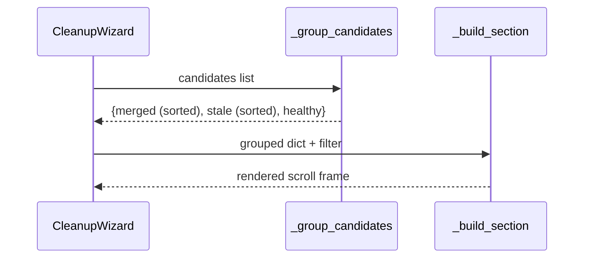
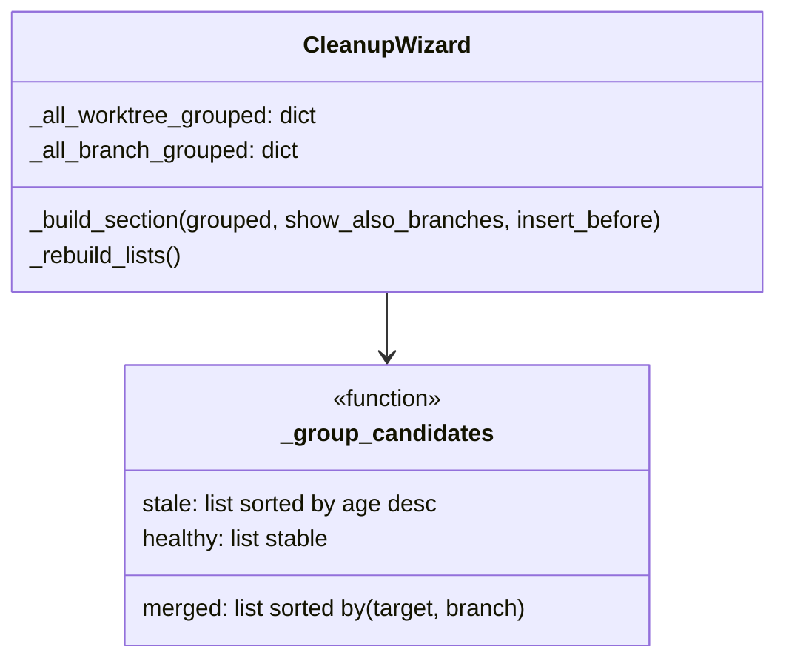

# Cleanup Wizard — Three-Category Grouping with Merged Sort

## Overview

Replace the current two-group layout (priority / healthy) with three fixed, divider-separated
categories: **Merged**, **Stale**, and **Healthy**. Items within each category are sorted
automatically: merged by merge target A→Z then branch name A→Z, stale by age (oldest first),
healthy by stable insertion order. Dividers are always visible between categories. No sort
buttons or user interaction required.

---

## UI / Flow

### Default state

```
┌─────────────────────────────────────────────────────────────────────┐
│  Cleanup Wizard                                                      │
│  ○ All  ○ Stale  ○ Merged                                           │
│                                                                     │
│  Worktrees                                                           │
│ ┌──────────────────────────────────────────────────────────────┐    │
│ │ Merged:                                                      │    │
│ │ ☑  fix/auth        (merged into develop)                     │    │
│ │ ☑  release/old     (merged into develop)                     │    │
│ │ ☑  hotfix/123      (merged into main)                        │    │
│ │ ────────────────────────────────────────────────────────     │    │
│ │ Stale:                                                       │    │
│ │ ☑  chore/deps      (190d, stale)                             │    │
│ │ ☑  old/api         (45d, stale)                              │    │
│ │ ────────────────────────────────────────────────────────     │    │
│ │ Healthy:                                                     │    │
│ │ ☐  wip/thing       (2d ago)                                  │    │
│ │ ☐  feature/x       (1d ago)                                  │    │
│ └──────────────────────────────────────────────────────────────┘    │
│  ☑ Also delete their branches                                       │
│                                                                     │
│  Branches (no worktree)                                              │
│ ┌──────────────────────────────────────────────────────────────┐    │
│ │ Merged:                                                      │    │
│ │ ☑  old/fix         (merged into main)                        │    │
│ │ ────────────────────────────────────────────────────────     │    │
│ │ Stale:                                                       │    │
│ │ (none)                                                       │    │
│ │ ────────────────────────────────────────────────────────     │    │
│ │ Healthy:                                                     │    │
│ │ ☐  hotfix/patch    (1d ago)                                  │    │
│ └──────────────────────────────────────────────────────────────┘    │
│                                                                     │
│  [Select All] [Deselect All] [Cancel]              [Delete]         │
└─────────────────────────────────────────────────────────────────────┘
```

Merged items are sorted automatically: `develop` before `main` (A→Z), then branch name A→Z within the same target. No user interaction required.

### Filter = Stale (only stale category shown)

```
│  Worktrees                                                           │
│ ┌──────────────────────────────────────────────────────────────┐    │
│ │ Stale:                                                       │    │
│ │ ☑  chore/deps      (190d, stale)                             │    │
│ │ ☑  old/api         (45d, stale)                              │    │
│ └──────────────────────────────────────────────────────────────┘    │
```

When a filter is active only the matching category is shown — other category labels,
dividers, and the Target sort button are hidden entirely.

### Empty category

When a category has no items and no filter is hiding it, show `(none)` under the label with a
divider below, so the structure is always consistent.

---

## Architecture

### Category ordering

Fixed top-to-bottom: **Merged → Stale → Healthy**

### Sort within category

| Category | Sort key |
|----------|----------|
| Merged   | `(merge_target, branch_name)` A→Z — always automatic |
| Stale    | `last_commit_ts` ascending (oldest first) |
| Healthy  | Stable insertion order |

### Merged sort key

```
_merge_sort_key(c) -> tuple[str, str]
    target = (c.merged_into or "main").lower()
    return (target, c.branch.lower())
```

Items with `merged_into=None` sort as if their target is `"main"`.

### Pure functions

```
_group_candidates(candidates) -> dict[str, list]
    Returns {"merged": [...], "stale": [...], "healthy": [...]}
    Merged pre-sorted by (target, branch) A→Z.
    Stale pre-sorted oldest-first.
    A candidate that is both stale AND merged goes into "merged" only.
```

### Data flow



### Component impact



---

## Open Questions

_(none — feature is fully scoped)_

---

## High-Level Steps

1. Add pure function `_merge_sort_key(c)` returning `(target, branch)` tuple for merged items
2. Add pure function `_group_candidates(candidates)` returning `{"merged": [...], "stale": [...], "healthy": [...]}` with merged pre-sorted by `(target, branch)` and stale pre-sorted oldest-first
3. Update `CleanupWizard.__init__` to store `_all_worktree_grouped` and `_all_branch_grouped` using `_group_candidates`
4. Rewrite `_build_section` to render three labelled sub-groups (Merged / Stale / Healthy) with dividers; show `(none)` for empty sub-groups
5. Update `_apply_filter` to return a grouped dict (zeroing irrelevant groups for Stale/Merged filters)
6. Update `_rebuild_lists` to pass grouped dicts to `_build_section`
7. Update `_visible_candidates` to flatten the grouped dict for Select All / Deselect All / Delete
8. Remove `_sort_candidates` (replaced by `_group_candidates`); remove any prior `SortState` / sort-button code

---

## Implementation Phases

### Phase 1 — Pure functions
**What it covers:** `_merge_sort_key` and `_group_candidates` — all pure, no UI.

**Tests (Red) — write these first:**
```python
# tests/test_cleanup_wizard_merged_into.py  (append at bottom)

# ---------------------------------------------------------------------------
# _group_candidates — pure function (Phase 1)
# ---------------------------------------------------------------------------

def test_group_candidates_merged_goes_to_merged():
    import time
    from worktree_manager.ui.cleanup_wizard import _group_candidates
    from worktree_manager.models import CleanupCandidate
    now = int(time.time())
    c = CleanupCandidate("m", None, True, False, now - 5 * 86400)
    result = _group_candidates([c])
    assert c in result["merged"]
    assert c not in result["stale"]
    assert c not in result["healthy"]


def test_group_candidates_stale_goes_to_stale():
    import time
    from worktree_manager.ui.cleanup_wizard import _group_candidates
    from worktree_manager.models import CleanupCandidate
    now = int(time.time())
    c = CleanupCandidate("s", None, False, True, now - 30 * 86400)
    result = _group_candidates([c])
    assert c in result["stale"]
    assert c not in result["merged"]
    assert c not in result["healthy"]


def test_group_candidates_healthy_goes_to_healthy():
    import time
    from worktree_manager.ui.cleanup_wizard import _group_candidates
    from worktree_manager.models import CleanupCandidate
    now = int(time.time())
    c = CleanupCandidate("h", None, False, False, now - 2 * 86400)
    result = _group_candidates([c])
    assert c in result["healthy"]
    assert c not in result["merged"]
    assert c not in result["stale"]


def test_group_candidates_both_merged_and_stale_goes_to_merged_only():
    import time
    from worktree_manager.ui.cleanup_wizard import _group_candidates
    from worktree_manager.models import CleanupCandidate
    now = int(time.time())
    c = CleanupCandidate("both", None, True, True, now - 40 * 86400)
    result = _group_candidates([c])
    assert c in result["merged"]
    assert c not in result["stale"]
    assert c not in result["healthy"]


def test_group_candidates_stale_sorted_oldest_first():
    import time
    from worktree_manager.ui.cleanup_wizard import _group_candidates
    from worktree_manager.models import CleanupCandidate
    now = int(time.time())
    newer = CleanupCandidate("newer", None, False, True, now - 10 * 86400)
    older = CleanupCandidate("older", None, False, True, now - 50 * 86400)
    result = _group_candidates([newer, older])
    assert result["stale"][0].branch == "older"
    assert result["stale"][1].branch == "newer"


def test_group_candidates_merged_sorted_by_target_then_branch():
    import time
    from worktree_manager.ui.cleanup_wizard import _group_candidates
    from worktree_manager.models import CleanupCandidate
    now = int(time.time())
    # same target, different branch names
    b = CleanupCandidate("b-branch", None, True, False, now, merged_into="main")
    a = CleanupCandidate("a-branch", None, True, False, now, merged_into="main")
    # different target
    d = CleanupCandidate("d-branch", None, True, False, now, merged_into="develop")
    result = _group_candidates([b, a, d])
    names = [c.branch for c in result["merged"]]
    # develop < main → d first, then a-branch, then b-branch
    assert names == ["d-branch", "a-branch", "b-branch"]


def test_group_candidates_merged_none_target_sorts_as_main():
    import time
    from worktree_manager.ui.cleanup_wizard import _group_candidates
    from worktree_manager.models import CleanupCandidate
    now = int(time.time())
    no_target = CleanupCandidate("z-branch", None, True, False, now, merged_into=None)
    develop = CleanupCandidate("a-branch", None, True, False, now, merged_into="develop")
    result = _group_candidates([no_target, develop])
    # develop < main → develop first
    assert result["merged"][0].merged_into == "develop"
    assert result["merged"][1].merged_into is None


def test_group_candidates_healthy_preserves_insertion_order():
    import time
    from worktree_manager.ui.cleanup_wizard import _group_candidates
    from worktree_manager.models import CleanupCandidate
    now = int(time.time())
    a = CleanupCandidate("a", None, False, False, now - 5 * 86400)
    b = CleanupCandidate("b", None, False, False, now - 1 * 86400)
    result = _group_candidates([a, b])
    assert result["healthy"] == [a, b]


def test_group_candidates_empty_list_returns_empty_groups():
    from worktree_manager.ui.cleanup_wizard import _group_candidates
    result = _group_candidates([])
    assert result == {"merged": [], "stale": [], "healthy": []}


def test_group_candidates_returns_all_three_keys():
    from worktree_manager.ui.cleanup_wizard import _group_candidates
    result = _group_candidates([])
    assert set(result.keys()) == {"merged", "stale", "healthy"}
```

**Production code (Green):**
```python
# In cleanup_wizard.py — add these functions (no enum needed)

def _merge_sort_key(c) -> tuple:
    target = (c.merged_into or "main").lower()
    return (target, c.branch.lower())


def _group_candidates(candidates: list) -> dict:
    merged = [c for c in candidates if c.is_merged]
    stale = [c for c in candidates if c.is_stale and not c.is_merged]
    healthy = [c for c in candidates if not c.is_stale and not c.is_merged]
    merged.sort(key=_merge_sort_key)
    stale.sort(key=lambda c: c.last_commit_ts)  # oldest timestamp first
    return {"merged": merged, "stale": stale, "healthy": healthy}
```

**Done when:** All pure-function tests pass; no UI changes yet.

---

### Phase 2 — Three-category rendering
**What it covers:** `_build_section` renders Merged / Stale / Healthy with dividers; no sort button; empty sub-groups show `(none)`; filter tabs hide non-matching categories.

**Tests (Red) — write these first:**
```python
# tests/test_cleanup_wizard_merged_into.py  (append after Phase 1 tests)

# ---------------------------------------------------------------------------
# Three-category rendering (Phase 2)
# ---------------------------------------------------------------------------

def test_section_shows_merged_label(root):
    from worktree_manager.ui.cleanup_wizard import CleanupWizard
    from worktree_manager.models import CleanupCandidate
    import time
    now = int(time.time())
    c = CleanupCandidate("m", "/wt/m", True, False, now - 5 * 86400)
    wiz = CleanupWizard(root, candidates=[c], on_delete_selected=lambda s, b: None)
    texts = _collect_text(wiz)
    assert any("Merged" in t for t in texts)
    wiz.destroy()


def test_section_shows_stale_label(root):
    from worktree_manager.ui.cleanup_wizard import CleanupWizard
    from worktree_manager.models import CleanupCandidate
    import time
    now = int(time.time())
    c = CleanupCandidate("s", "/wt/s", False, True, now - 40 * 86400)
    wiz = CleanupWizard(root, candidates=[c], on_delete_selected=lambda s, b: None)
    texts = _collect_text(wiz)
    assert any("Stale" in t for t in texts)
    wiz.destroy()


def test_section_shows_healthy_label(root):
    from worktree_manager.ui.cleanup_wizard import CleanupWizard
    from worktree_manager.models import CleanupCandidate
    import time
    now = int(time.time())
    c = CleanupCandidate("h", "/wt/h", False, False, now - 2 * 86400)
    wiz = CleanupWizard(root, candidates=[c], on_delete_selected=lambda s, b: None)
    texts = _collect_text(wiz)
    assert any("Healthy" in t for t in texts)
    wiz.destroy()


def test_section_shows_none_for_empty_stale_group(root):
    from worktree_manager.ui.cleanup_wizard import CleanupWizard
    from worktree_manager.models import CleanupCandidate
    import time
    now = int(time.time())
    c = CleanupCandidate("h", "/wt/h", False, False, now - 2 * 86400)
    wiz = CleanupWizard(root, candidates=[c], on_delete_selected=lambda s, b: None)
    texts = _collect_text(wiz)
    assert any("none" in t.lower() for t in texts)
    wiz.destroy()


def test_stale_rendered_oldest_first_in_ui(root):
    from worktree_manager.ui.cleanup_wizard import CleanupWizard
    from worktree_manager.models import CleanupCandidate
    import time
    now = int(time.time())
    candidates = [
        CleanupCandidate("newer-stale", "/wt/n", False, True, now - 10 * 86400),
        CleanupCandidate("older-stale", "/wt/o", False, True, now - 50 * 86400),
    ]
    wiz = CleanupWizard(root, candidates=candidates, on_delete_selected=lambda s, b: None)
    texts = _collect_text(wiz)
    combined = " ".join(texts)
    assert combined.index("50d") < combined.index("10d")
    wiz.destroy()


def test_merged_rendered_sorted_by_target_then_branch_in_ui(root):
    from worktree_manager.ui.cleanup_wizard import CleanupWizard
    from worktree_manager.models import CleanupCandidate
    import time
    now = int(time.time())
    candidates = [
        CleanupCandidate("z-branch", "/wt/z", True, False, now, merged_into="main"),
        CleanupCandidate("a-branch", "/wt/a", True, False, now, merged_into="develop"),
    ]
    wiz = CleanupWizard(root, candidates=candidates, on_delete_selected=lambda s, b: None)
    texts = _collect_text(wiz)
    combined = " ".join(texts)
    assert combined.index("develop") < combined.index("main")
    wiz.destroy()


def test_filter_stale_hides_merged_and_healthy_categories(root):
    from worktree_manager.ui.cleanup_wizard import CleanupWizard, _FILTER_STALE
    from worktree_manager.models import CleanupCandidate
    import time
    now = int(time.time())
    candidates = [
        CleanupCandidate("m", "/wt/m", True, False, now - 5 * 86400),
        CleanupCandidate("s", "/wt/s", False, True, now - 30 * 86400),
        CleanupCandidate("h", "/wt/h", False, False, now - 2 * 86400),
    ]
    wiz = CleanupWizard(root, candidates=candidates, on_delete_selected=lambda s, b: None)
    wiz._filter.set(_FILTER_STALE)
    wiz._rebuild_lists()
    texts = _collect_text(wiz)
    assert any("Stale" in t for t in texts)
    assert not any("Merged" in t for t in texts)
    assert not any("Healthy" in t for t in texts)
    wiz.destroy()


def test_filter_merged_hides_stale_and_healthy_categories(root):
    from worktree_manager.ui.cleanup_wizard import CleanupWizard, _FILTER_MERGED
    from worktree_manager.models import CleanupCandidate
    import time
    now = int(time.time())
    candidates = [
        CleanupCandidate("m", "/wt/m", True, False, now - 5 * 86400),
        CleanupCandidate("s", "/wt/s", False, True, now - 30 * 86400),
        CleanupCandidate("h", "/wt/h", False, False, now - 2 * 86400),
    ]
    wiz = CleanupWizard(root, candidates=candidates, on_delete_selected=lambda s, b: None)
    wiz._filter.set(_FILTER_MERGED)
    wiz._rebuild_lists()
    texts = _collect_text(wiz)
    assert any("Merged" in t for t in texts)
    assert not any("Stale" in t for t in texts)
    assert not any("Healthy" in t for t in texts)
    wiz.destroy()
```

**Production code (Green):**
```python
# CleanupWizard.__init__ — replace _sort_candidates calls:
self._all_worktree_grouped = _group_candidates([c for c in candidates if c.path is not None])
self._all_branch_grouped = _group_candidates([c for c in candidates if c.path is None])

# Pre-population loop uses flat list from grouped dict:
all_candidates = (
    self._all_worktree_grouped["merged"] +
    self._all_worktree_grouped["stale"] +
    self._all_worktree_grouped["healthy"] +
    self._all_branch_grouped["merged"] +
    self._all_branch_grouped["stale"] +
    self._all_branch_grouped["healthy"]
)
for c in all_candidates:
    is_priority = c.is_stale or c.is_merged
    var = ctk.BooleanVar(value=False if c.has_uncommitted else is_priority)
    self._all_pairs.append((c, var))

# _apply_filter returns a grouped dict:
def _apply_filter(self, grouped: dict) -> dict:
    f = self._filter.get()
    if f == _FILTER_STALE:
        return {"merged": [], "stale": grouped["stale"], "healthy": []}
    if f == _FILTER_MERGED:
        return {"merged": grouped["merged"], "stale": [], "healthy": []}
    return grouped

# _visible_candidates flattens all three groups:
def _visible_candidates(self) -> list:
    wt = self._apply_filter(self._all_worktree_grouped)
    br = self._apply_filter(self._all_branch_grouped)
    return (wt["merged"] + wt["stale"] + wt["healthy"] +
            br["merged"] + br["stale"] + br["healthy"])

# _rebuild_lists:
def _rebuild_lists(self):
    self._worktree_scroll_frame.destroy()
    self._branch_scroll_frame.destroy()
    self._also_branches_cb.destroy()

    self._worktree_scroll_frame, self._also_branches_cb = self._build_section(
        grouped=self._apply_filter(self._all_worktree_grouped),
        show_also_branches=True,
        insert_before=self._branch_label_frame,
    )
    self._branch_scroll_frame, _ = self._build_section(
        grouped=self._apply_filter(self._all_branch_grouped),
        show_also_branches=False,
        insert_before=self._btn_frame,
    )

# _build_section renders three labelled sub-groups with dividers:
def _build_section(self, grouped: dict, show_also_branches: bool, insert_before=None):
    pack_opts = {"fill": "x", "padx": 24, "pady": (2, 4)}
    if insert_before is not None:
        pack_opts["before"] = insert_before

    container = ctk.CTkFrame(self, fg_color="transparent")
    container.pack(**pack_opts)

    f = self._filter.get()
    all_empty = not any(grouped[k] for k in grouped)
    if all_empty and f != _FILTER_ALL:
        ctk.CTkLabel(
            container, text="(none to show)", text_color="gray", anchor="w"
        ).pack(fill="x", pady=2)
    else:
        scroll = ctk.CTkScrollableFrame(container, height=140)
        scroll.pack(fill="x")
        _bind_mousewheel(scroll)

        if f == _FILTER_STALE:
            groups_to_show = [("Stale:", grouped["stale"])]
        elif f == _FILTER_MERGED:
            groups_to_show = [("Merged:", grouped["merged"])]
        else:
            groups_to_show = [
                ("Merged:", grouped["merged"]),
                ("Stale:",  grouped["stale"]),
                ("Healthy:", grouped["healthy"]),
            ]

        for i, (label_text, items) in enumerate(groups_to_show):
            if i > 0:
                ctk.CTkFrame(scroll, height=1, fg_color="gray50").pack(fill="x", pady=(6, 2))
            ctk.CTkLabel(
                scroll, text=label_text, text_color="gray",
                font=ctk.CTkFont(size=11), anchor="w",
            ).pack(fill="x", padx=4, pady=(0, 2))
            if items:
                for c in items:
                    self._add_item(scroll, c)
            else:
                ctk.CTkLabel(
                    scroll, text="(none)", text_color="gray",
                    font=ctk.CTkFont(size=11), anchor="w",
                ).pack(fill="x", padx=8, pady=(0, 2))

    cb_pack_opts = {"anchor": "w", "padx": 24, "pady": (4, 2)}
    if insert_before is not None:
        cb_pack_opts["before"] = insert_before

    cb_widget = ctk.CTkFrame(self, fg_color="transparent", height=0)
    if show_also_branches:
        has_priority = bool(grouped["merged"] or grouped["stale"])
        self._also_branches = ctk.BooleanVar(value=has_priority)
        cb_widget = ctk.CTkCheckBox(
            self, text="Also delete their branches", variable=self._also_branches
        )
        cb_widget.pack(**cb_pack_opts)

    return container, cb_widget
```

**Done when:** Three categories render with dividers; merged items sorted by target A→Z then branch A→Z automatically; stale oldest-first; healthy stable; filter tabs hide non-matching categories; all existing tests pass.

---

## Feature Acceptance Checklist

- [ ] Each table section shows three fixed groups: Merged, Stale, Healthy — in that order
- [ ] A divider line separates each group
- [ ] Merged items are automatically sorted: merge target A→Z, then branch name A→Z within the same target
- [ ] Items with `merged_into=None` sort as if their target is "main"
- [ ] Stale items are always sorted oldest-first (most days at top)
- [ ] Healthy items remain in stable insertion order
- [ ] Empty groups show `(none)` under their label (in All filter view)
- [ ] Stale filter shows only the Stale group (no Merged/Healthy labels)
- [ ] Merged filter shows only the Merged group (no Stale/Healthy labels)
- [ ] Select All / Deselect All / Delete operate on all visible candidates
- [ ] Uncommitted worktree warning and disabled checkbox still work
- [ ] All existing tests pass
