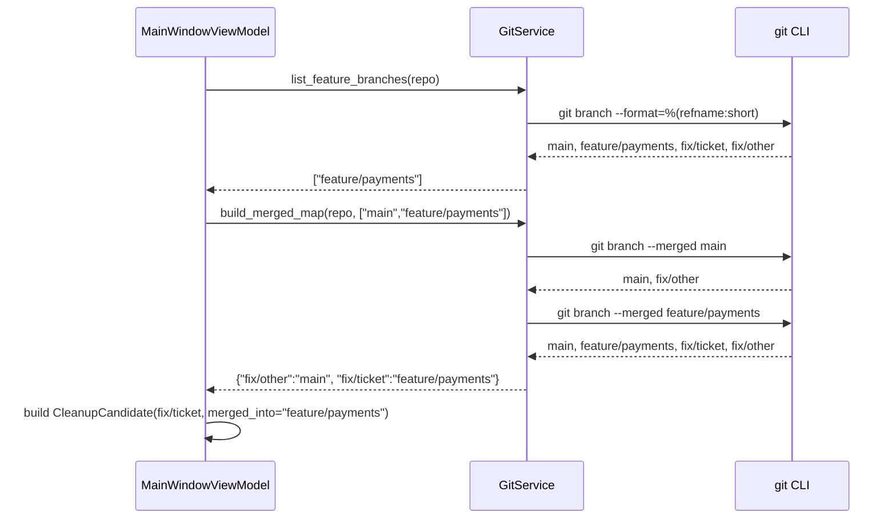

# Cleanup Wizard: Feature Branch Merge Detection Bug

## Overview
The cleanup wizard does not correctly show branches that have been merged into feature branches. When a fix branch (e.g. `fix/ticket`) is merged into a feature branch (e.g. `feature/payments`) but NOT into `main`, the wizard either fails to show `fix/ticket` as merged, or shows the wrong `merged_into` target. The root cause is that `GitService.build_merged_map` iterates merge targets in `["main"] + feature_branches` order — and `git branch --merged <feature-branch>` returns ALL branches reachable from that feature branch, including those already captured by `main`. Combined with the `branch not in result` guard, any branch merged into both `main` and `feature/payments` gets attributed to `main` (first-wins). This is correct in itself, but for branches merged ONLY into a feature branch the logic is correct in theory yet untested against a real git repo. The bug is confirmed by a real integration test that calls `GitService._run` against an actual git repository.

## UI / Flow

### Merged section — correct state
```
Cleanup Wizard
─────────────────────────────────────
Merged:
  → into feature/payments     [Select all]
    ☑ fix/ticket  (merged into feature/payments)
  → into main                 [Select all]
    ☑ fix/other   (merged into main)
Stale:
  (none)
Healthy:
  (none)
```

### Merged section — buggy state (what the user sees)
```
Cleanup Wizard
─────────────────────────────────────
Merged:
  → into main                 [Select all]
    ☑ fix/ticket  (merged into main)    ← WRONG: should be feature/payments
    ☑ fix/other   (merged into main)
Stale:
  (none)
Healthy:
  (none)
```

## Architecture



## Open Questions
(none)

## Iteration Plan

### Iteration 0 — Walking Skeleton
**Delivers:** A real git integration test that creates a repo with a branch merged into a feature branch, calls `GitService.build_merged_map` directly, and confirms `merged_into` is `"feature/payments"` — plus a `create_feature_merge_test_repo.py` script for manual testing.
**Scope:**
- Integration test using a real git repo (via `tmp_path`)
- Script `create_feature_merge_test_repo.py` that creates a real repo with the scenario under `/tmp/wm-feature-merge-test`
- Bug fix in `build_merged_map` if the integration test reveals one
**Explicitly out of scope:**
- UI-level integration tests
- Changes to the cleanup wizard rendering

## ✋ Manual Testing Gate — Iteration 0

> STOP. Do not proceed to Iteration 1 until every item below is checked off by the user.

- [ ] Run `python3.14 create_feature_merge_test_repo.py` — it prints "Done." with no errors
- [ ] Run the worktree-manager app, add the `/tmp/wm-feature-merge-test` repo, open Cleanup Wizard — `fix/ticket` appears under "→ into feature/payments", NOT under "→ into main"
- [ ] `fix/other` appears under "→ into main"
- [ ] Run the new integration test: `python3.14 -m pytest tests/test_git_service_feature_merge.py -xvs` — passes

**How to confirm:** Run the app, perform each action above, and check off each item manually.
Reply "Iteration 0 confirmed" (or describe any failures) before I write the plan for Iteration 1.
