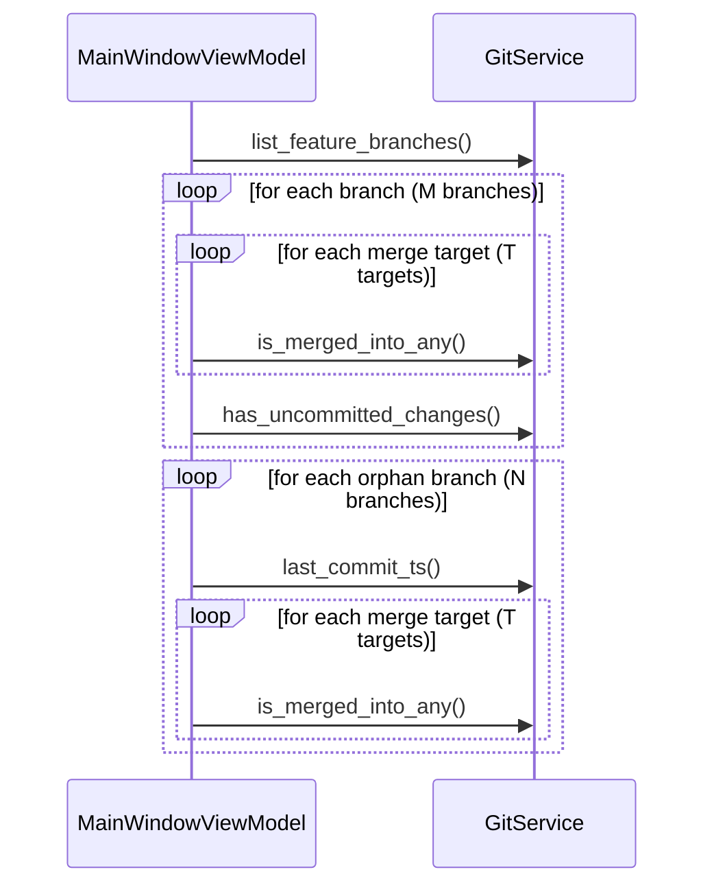
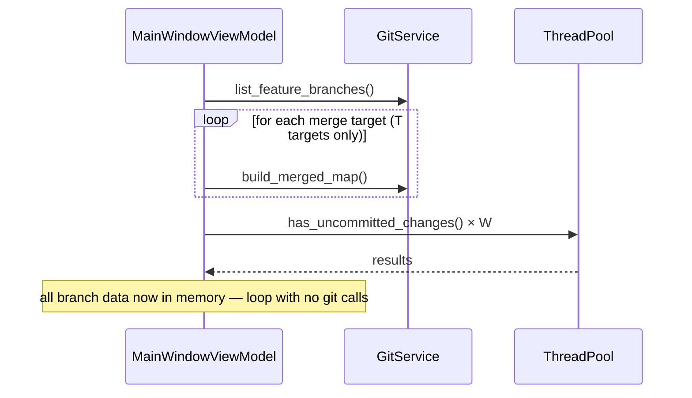
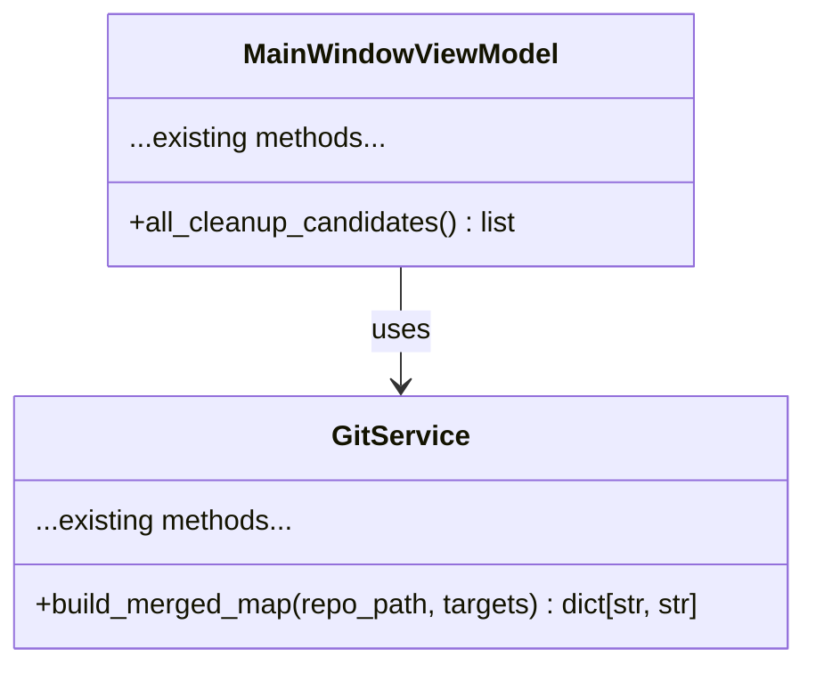

# Cleanup Wizard Performance

## Overview

The Cleanup Wizard takes too long to open because `all_cleanup_candidates()` runs O(branches × merge_targets) serial git subprocesses, plus one `git status` per worktree, all sequentially on the main thread. This feature replaces that with: (1) a single batched merge-check pass per target, and (2) concurrent `git status` calls via a thread pool — reducing startup from seconds to under a second on typical repos.

## UI / Flow

No visual changes. The wizard UI is identical before and after this change.
The only observable difference is time-to-open.

```
Before clicking "Cleanup Wizard":
  [Main Window] → user clicks button

After (current — slow):
  git branch --merged main          ← per branch per target
  git branch --merged feature/x     ← per branch per target
  git branch --merged main          ← repeated for next branch
  ...
  git status                         ← per worktree, sequential
  ...
  [Cleanup Wizard opens] ← seconds later

After (new — fast):
  git branch --merged main          ← once per target
  git branch --merged feature/x     ← once per target
  git status (×N in thread pool)    ← concurrent
  [Cleanup Wizard opens] ← <1s
```

## Architecture

### Current call graph (slow)



### New call graph (fast)



### New method: `GitService.build_merged_map`



`build_merged_map(repo_path, targets) -> dict[str, str]`
- Runs `git branch --merged <target>` once per target (T subprocesses total)
- Returns `{branch_name: first_target_it_merged_into}`
- Branches merged into multiple targets record only the first match (same semantics as current `is_merged_into_any`)

## Open Questions

(none)

## High-Level Steps

1. Add `build_merged_map(repo_path, targets) -> dict[str, str]` to `GitService`
2. Add `build_merged_map` tests to `test_git_service.py`
3. Rewrite `all_cleanup_candidates()` in `MainWindowViewModel` to call `build_merged_map` once instead of `is_merged_into_any` per branch
4. Parallelize `has_uncommitted_changes` calls for worktree candidates using `ThreadPoolExecutor`
5. Update `test_main_window_vm.py` to reflect the new `GitService` mock surface (`build_merged_map` instead of `is_merged_into_any`)

## Implementation Phases

### Phase 1 — `GitService.build_merged_map`
**What it covers:** New batched merge-check method that replaces per-branch `is_merged_into_any` calls.

**Tests (Red) — write these first:**
```python
# tests/test_git_service.py — append these tests

def test_build_merged_map_returns_branch_to_target(svc):
    def fake_run(cmd, cwd=None):
        if "main" in cmd:
            return "  main\n  fix/bug\n"
        return "  main\n"
    with patch.object(svc, "_run", side_effect=fake_run):
        result = svc.build_merged_map("/repos/proj", ["main", "feature/auth"])
    assert result["fix/bug"] == "main"


def test_build_merged_map_records_first_target_only(svc):
    # fix/bug is merged into both main and feature/auth — only main should be recorded
    def fake_run(cmd, cwd=None):
        if "main" in cmd:
            return "  main\n  fix/bug\n"
        if "feature/auth" in cmd:
            return "  main\n  fix/bug\n  feature/auth\n"
        return "  main\n"
    with patch.object(svc, "_run", side_effect=fake_run):
        result = svc.build_merged_map("/repos/proj", ["main", "feature/auth"])
    assert result["fix/bug"] == "main"


def test_build_merged_map_returns_empty_for_no_targets(svc):
    result = svc.build_merged_map("/repos/proj", [])
    assert result == {}


def test_build_merged_map_returns_empty_when_nothing_merged(svc):
    with patch.object(svc, "_run", return_value="  main\n"):
        result = svc.build_merged_map("/repos/proj", ["main"])
    assert result == {}


def test_build_merged_map_multiple_branches(svc):
    def fake_run(cmd, cwd=None):
        if "main" in cmd:
            return "  main\n  fix/a\n  fix/b\n"
        return "  main\n"
    with patch.object(svc, "_run", side_effect=fake_run):
        result = svc.build_merged_map("/repos/proj", ["main", "feature/x"])
    assert result["fix/a"] == "main"
    assert result["fix/b"] == "main"


def test_build_merged_map_runs_once_per_target(svc):
    with patch.object(svc, "_run", return_value="  main\n") as mock_run:
        svc.build_merged_map("/repos/proj", ["main", "feature/auth", "feature/pay"])
    assert mock_run.call_count == 3
```

**Production code (Green):**
```python
# worktree_manager/git_service.py — add this method to GitService

def build_merged_map(self, repo_path: str, targets: list[str]) -> dict[str, str]:
    result: dict[str, str] = {}
    for target in targets:
        out = self._run(["git", "branch", "--merged", target], cwd=repo_path)
        for line in out.splitlines():
            branch = line.strip().lstrip("* ")
            if branch and branch not in result:
                result[branch] = target
    return result
```

**Done when:** All six tests above pass; `is_merged_into_any` still exists and its existing tests still pass.

---

### Phase 2 — Rewrite `all_cleanup_candidates()` + parallel `has_uncommitted_changes`
**What it covers:** VM uses `build_merged_map` (one call per target) and a `ThreadPoolExecutor` for worktree-only uncommitted checks.

**Tests (Red) — write these first:**
```python
# tests/test_main_window_vm.py — replace/update the all_cleanup_candidates fixtures and tests

# Update the `vm` fixture to mock build_merged_map instead of is_merged_into_any:
#
# @pytest.fixture
# def vm(store, git, editor, worktrees):
#     git.list_worktrees.return_value = worktrees
#     git.list_feature_branches.return_value = []
#     git.build_merged_map.return_value = {}          # <-- changed
#     return MainWindowViewModel(...)

# Replace test_all_cleanup_candidates_includes_worktree_candidates:
def test_all_cleanup_candidates_includes_worktree_candidates(vm):
    import time
    now = int(time.time())
    vm.load_worktrees()
    vm._git.list_local_branches.return_value = []
    vm._git.build_merged_map.return_value = {"fix/old-bug": "main"}
    vm._git.has_uncommitted_changes.return_value = False
    candidates = vm.all_cleanup_candidates()
    branches = [c.branch for c in candidates]
    assert "chore/deps" in branches
    assert "fix/old-bug" in branches


def test_all_cleanup_candidates_build_merged_map_called_once(vm):
    vm.load_worktrees()
    vm._git.list_local_branches.return_value = []
    vm._git.build_merged_map.return_value = {}
    vm._git.has_uncommitted_changes.return_value = False
    vm.all_cleanup_candidates()
    vm._git.build_merged_map.assert_called_once()


def test_all_cleanup_candidates_is_merged_into_any_not_called(vm):
    vm.load_worktrees()
    vm._git.list_local_branches.return_value = []
    vm._git.build_merged_map.return_value = {}
    vm._git.has_uncommitted_changes.return_value = False
    vm.all_cleanup_candidates()
    vm._git.is_merged_into_any.assert_not_called()


def test_all_cleanup_candidates_has_uncommitted_only_for_worktrees(vm):
    vm.load_worktrees()
    vm._git.list_local_branches.return_value = ["main", "orphan/branch"]
    vm._git.build_merged_map.return_value = {}
    vm._git.has_uncommitted_changes.return_value = False
    vm._git.last_commit_ts.return_value = int(__import__("time").time()) - 2 * 86400
    vm.all_cleanup_candidates()
    # has_uncommitted_changes must only be called with worktree paths (not None)
    for call in vm._git.has_uncommitted_changes.call_args_list:
        path = call.args[0]
        assert path is not None


def test_all_cleanup_candidates_merged_into_field_populated(vm):
    vm.load_worktrees()
    vm._git.list_local_branches.return_value = []
    vm._git.build_merged_map.return_value = {"fix/old-bug": "main"}
    vm._git.has_uncommitted_changes.return_value = False
    candidates = vm.all_cleanup_candidates()
    merged = [c for c in candidates if c.branch == "fix/old-bug"]
    assert len(merged) == 1
    assert merged[0].merged_into == "main"
    assert merged[0].is_merged is True


def test_all_cleanup_candidates_excludes_main_worktree(vm):
    vm.load_worktrees()
    vm._git.list_local_branches.return_value = []
    vm._git.build_merged_map.return_value = {}
    vm._git.has_uncommitted_changes.return_value = False
    candidates = vm.all_cleanup_candidates()
    assert all(c.branch != "main" for c in candidates)


def test_all_cleanup_candidates_excludes_healthy_worktrees(vm):
    vm.load_worktrees()
    vm._git.list_local_branches.return_value = []
    vm._git.build_merged_map.return_value = {}
    vm._git.has_uncommitted_changes.return_value = False
    candidates = vm.all_cleanup_candidates()
    assert all(c.branch != "feature/auth" for c in candidates)


def test_all_cleanup_candidates_worktree_has_path(vm):
    vm.load_worktrees()
    vm._git.list_local_branches.return_value = []
    vm._git.build_merged_map.return_value = {"fix/old-bug": "main"}
    vm._git.has_uncommitted_changes.return_value = False
    candidates = vm.all_cleanup_candidates()
    wt_candidates = [c for c in candidates if c.path is not None]
    assert all(c.path for c in wt_candidates)


def test_all_cleanup_candidates_includes_orphan_merged_branch(store, git, editor):
    now = int(time.time())
    git.list_worktrees.return_value = [
        WorktreeModel("/repos/proj", "main", True, now, False, False),
    ]
    git.list_local_branches.return_value = ["main", "release/1.0"]
    git.list_feature_branches.return_value = []
    git.build_merged_map.return_value = {"release/1.0": "main"}
    git.last_commit_ts.return_value = now - 5 * 86400
    vm = MainWindowViewModel(
        repo_path="/repos/proj", config_store=store,
        git_service=git, editor_service=editor,
    )
    vm.load_worktrees()
    candidates = vm.all_cleanup_candidates()
    assert "release/1.0" in [c.branch for c in candidates]


def test_all_cleanup_candidates_includes_orphan_stale_branch(store, git, editor):
    now = int(time.time())
    git.list_worktrees.return_value = [
        WorktreeModel("/repos/proj", "main", True, now, False, False),
    ]
    git.list_local_branches.return_value = ["main", "experiment/xyz"]
    git.list_feature_branches.return_value = []
    git.build_merged_map.return_value = {}
    git.last_commit_ts.return_value = now - 40 * 86400
    vm = MainWindowViewModel(
        repo_path="/repos/proj", config_store=store,
        git_service=git, editor_service=editor,
    )
    vm.load_worktrees()
    candidates = vm.all_cleanup_candidates()
    assert "experiment/xyz" in [c.branch for c in candidates]


def test_all_cleanup_candidates_excludes_healthy_orphan_branch(store, git, editor):
    now = int(time.time())
    git.list_worktrees.return_value = [
        WorktreeModel("/repos/proj", "main", True, now, False, False),
    ]
    git.list_local_branches.return_value = ["main", "feature/wip"]
    git.list_feature_branches.return_value = []
    git.build_merged_map.return_value = {}
    git.last_commit_ts.return_value = now - 2 * 86400
    vm = MainWindowViewModel(
        repo_path="/repos/proj", config_store=store,
        git_service=git, editor_service=editor,
    )
    vm.load_worktrees()
    candidates = vm.all_cleanup_candidates()
    assert all(c.branch != "feature/wip" for c in candidates)


def test_all_cleanup_candidates_orphan_has_no_path(store, git, editor):
    now = int(time.time())
    git.list_worktrees.return_value = [
        WorktreeModel("/repos/proj", "main", True, now, False, False),
    ]
    git.list_local_branches.return_value = ["main", "release/1.0"]
    git.list_feature_branches.return_value = []
    git.build_merged_map.return_value = {"release/1.0": "main"}
    git.last_commit_ts.return_value = now - 5 * 86400
    vm = MainWindowViewModel(
        repo_path="/repos/proj", config_store=store,
        git_service=git, editor_service=editor,
    )
    vm.load_worktrees()
    candidates = vm.all_cleanup_candidates()
    orphans = [c for c in candidates if c.branch == "release/1.0"]
    assert len(orphans) == 1
    assert orphans[0].path is None


def test_all_cleanup_candidates_excludes_branch_already_in_worktree(vm):
    vm.load_worktrees()
    vm._git.list_local_branches.return_value = [
        "main", "feature/auth", "chore/deps", "fix/old-bug"
    ]
    vm._git.build_merged_map.return_value = {}
    vm._git.has_uncommitted_changes.return_value = False
    candidates = vm.all_cleanup_candidates()
    matching = [c for c in candidates if c.branch == "chore/deps"]
    assert len(matching) == 1


def test_all_cleanup_candidates_excludes_protected_worktree(vm):
    vm.load_worktrees()
    vm._git.list_local_branches.return_value = []
    vm._git.build_merged_map.return_value = {}
    vm._git.has_uncommitted_changes.return_value = False
    candidates = vm.all_cleanup_candidates()
    assert all(not c.branch.startswith("feature/") for c in candidates)
    assert all(c.branch != "main" for c in candidates)


def test_all_cleanup_candidates_includes_healthy_worktree(vm, store, git, editor):
    now = int(time.time())
    git.list_worktrees.return_value = [
        WorktreeModel("/repos/proj", "main", True, now, False, False),
        WorktreeModel("/repos/proj-wt/wip-thing", "wip/thing", False, now - 2 * 86400, False, False),
    ]
    git.list_local_branches.return_value = []
    git.list_feature_branches.return_value = []
    git.build_merged_map.return_value = {}
    git.has_uncommitted_changes.return_value = False
    local_vm = MainWindowViewModel(
        repo_path="/repos/proj", config_store=store,
        git_service=git, editor_service=editor,
    )
    local_vm.load_worktrees()
    candidates = local_vm.all_cleanup_candidates()
    assert any(c.branch == "wip/thing" for c in candidates)


def test_all_cleanup_candidates_excludes_protected_orphan(store, git, editor):
    now = int(time.time())
    git.list_worktrees.return_value = [
        WorktreeModel("/repos/proj", "main", True, now, False, False),
    ]
    git.list_local_branches.return_value = ["main", "feature/payments", "fix/thing"]
    git.list_feature_branches.return_value = ["feature/payments"]
    git.build_merged_map.return_value = {"fix/thing": "main", "feature/payments": "main"}
    git.last_commit_ts.return_value = now - 5 * 86400
    local_vm = MainWindowViewModel(
        repo_path="/repos/proj", config_store=store,
        git_service=git, editor_service=editor,
    )
    local_vm.load_worktrees()
    candidates = local_vm.all_cleanup_candidates()
    assert all(c.branch != "feature/payments" for c in candidates)
    assert all(c.branch != "main" for c in candidates)


def test_all_cleanup_candidates_includes_healthy_orphan(store, git, editor):
    now = int(time.time())
    git.list_worktrees.return_value = [
        WorktreeModel("/repos/proj", "main", True, now, False, False),
    ]
    git.list_local_branches.return_value = ["main", "hotfix/patch"]
    git.list_feature_branches.return_value = []
    git.build_merged_map.return_value = {}
    git.last_commit_ts.return_value = now - 1 * 86400
    local_vm = MainWindowViewModel(
        repo_path="/repos/proj", config_store=store,
        git_service=git, editor_service=editor,
    )
    local_vm.load_worktrees()
    candidates = local_vm.all_cleanup_candidates()
    assert any(c.branch == "hotfix/patch" for c in candidates)
```

**Production code (Green):**
```python
# worktree_manager/main_window_vm.py — replace all_cleanup_candidates()

def all_cleanup_candidates(self) -> list:
    import time
    from concurrent.futures import ThreadPoolExecutor
    from worktree_manager.models import CleanupCandidate

    cfg = self._store.get_repo(self._repo_path)
    stale_threshold = int(time.time()) - cfg.stale_days * 86400

    feature_branches = self._git.list_feature_branches(self._repo_path)
    merge_targets = ["main"] + feature_branches
    merged_map = self._git.build_merged_map(self._repo_path, merge_targets)

    worktree_branches = {wt.branch for wt in self._worktrees}
    candidates = []

    worktree_wts = [wt for wt in self._worktrees if not wt.is_main and not self.is_protected_branch(wt.branch)]

    with ThreadPoolExecutor() as executor:
        uncommitted_results = list(executor.map(
            lambda wt: self._git.has_uncommitted_changes(wt.path),
            worktree_wts,
        ))

    for wt, has_uncommitted in zip(worktree_wts, uncommitted_results):
        merged_into = merged_map.get(wt.branch)
        stale = wt.last_commit_ts > 0 and wt.last_commit_ts < stale_threshold
        candidates.append(CleanupCandidate(
            branch=wt.branch,
            path=wt.path,
            is_merged=merged_into is not None,
            is_stale=stale,
            last_commit_ts=wt.last_commit_ts,
            merged_into=merged_into,
            has_uncommitted=has_uncommitted,
        ))

    for branch in self._git.list_local_branches(self._repo_path):
        if branch in worktree_branches:
            continue
        if self.is_protected_branch(branch):
            continue
        ts = self._git.last_commit_ts(self._repo_path, branch)
        merged_into = merged_map.get(branch)
        stale = ts > 0 and ts < stale_threshold
        candidates.append(CleanupCandidate(
            branch=branch,
            path=None,
            is_merged=merged_into is not None,
            is_stale=stale,
            last_commit_ts=ts,
            merged_into=merged_into,
        ))

    return candidates
```

**Done when:** All tests pass; `is_merged_into_any` is no longer called from `all_cleanup_candidates()`; `has_uncommitted_changes` is only called with non-`None` paths.

---

## Feature Acceptance Checklist

- [ ] Cleanup Wizard opens noticeably faster on a repo with 10+ branches
- [ ] `build_merged_map` is called exactly once per `all_cleanup_candidates()` invocation
- [ ] `has_uncommitted_changes` is never called for orphan branches (those with `path=None`)
- [ ] `is_merged_into_any` is no longer called from `all_cleanup_candidates()`
- [ ] Merged candidates correctly show `merged_into` target in the wizard UI
- [ ] Stale candidates are still identified and pre-checked in the wizard
- [ ] Uncommitted worktrees remain blocked (unchecked, disabled, warning shown)
- [ ] All existing tests pass with no regressions
