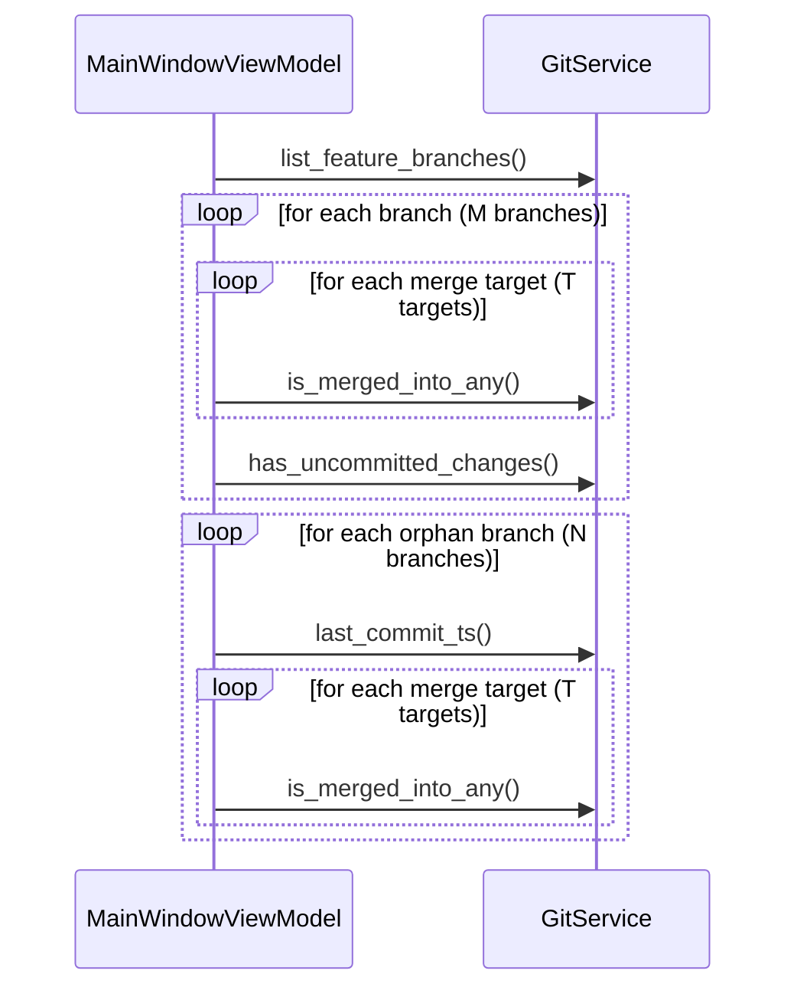
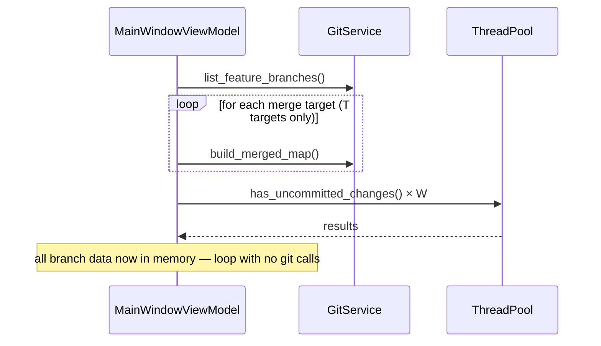
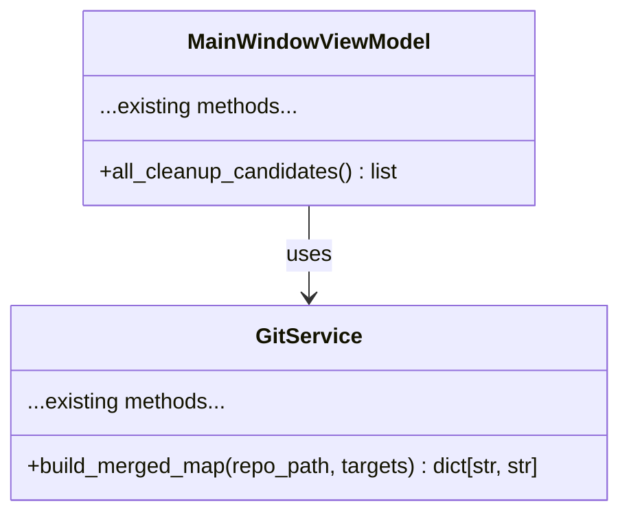

# Cleanup Wizard Performance

## Overview

The Cleanup Wizard takes too long to open because `all_cleanup_candidates()` runs O(branches × merge_targets) serial git subprocesses, plus one `git status` per worktree, all sequentially on the main thread. This feature replaces that with: (1) a single batched merge-check pass per target, and (2) concurrent `git status` calls via a thread pool — reducing startup from seconds to under a second on typical repos.

## UI / Flow

No visual changes. The wizard UI is identical before and after this change.
The only observable difference is time-to-open.

```
Before clicking "Cleanup Wizard":
  [Main Window] → user clicks button

After (current — slow):
  git branch --merged main          ← per branch per target
  git branch --merged feature/x     ← per branch per target
  git branch --merged main          ← repeated for next branch
  ...
  git status                         ← per worktree, sequential
  ...
  [Cleanup Wizard opens] ← seconds later

After (new — fast):
  git branch --merged main          ← once per target
  git branch --merged feature/x     ← once per target
  git status (×N in thread pool)    ← concurrent
  [Cleanup Wizard opens] ← <1s
```

## Architecture

### Current call graph (slow)



### New call graph (fast)



### New method: `GitService.build_merged_map`



`build_merged_map(repo_path, targets) -> dict[str, str]`
- Runs `git branch --merged <target>` once per target (T subprocesses total)
- Returns `{branch_name: first_target_it_merged_into}`
- Branches merged into multiple targets record only the first match (same semantics as current `is_merged_into_any`)

## Open Questions

(none)

## High-Level Steps

1. Add `build_merged_map(repo_path, targets) -> dict[str, str]` to `GitService`
2. Add `build_merged_map` tests to `test_git_service.py`
3. Rewrite `all_cleanup_candidates()` in `MainWindowViewModel` to call `build_merged_map` once instead of `is_merged_into_any` per branch
4. Parallelize `has_uncommitted_changes` calls for worktree candidates using `ThreadPoolExecutor`
5. Update `test_main_window_vm.py` to reflect the new `GitService` mock surface (`build_merged_map` instead of `is_merged_into_any`)
