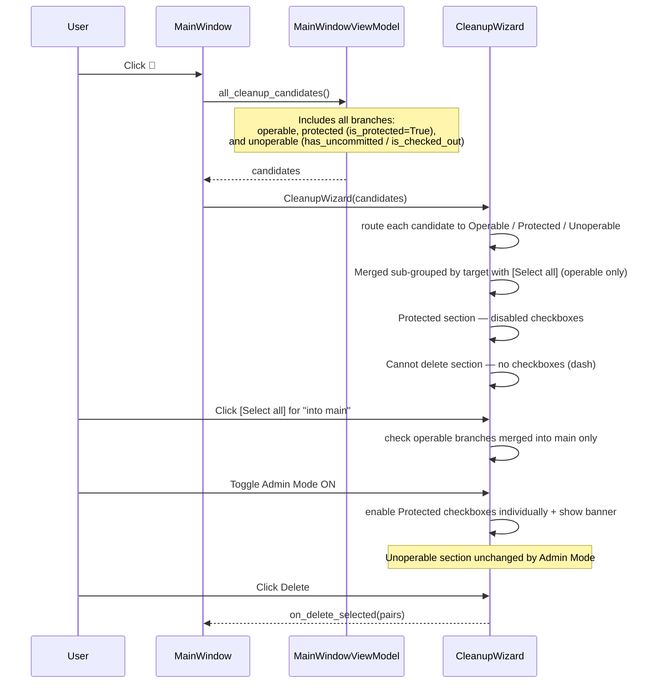

# Cleanup Wizard — Protected Branch Visibility & Admin Mode

## Overview

The Cleanup Wizard currently hides main and feature branches entirely, making it impossible for the user to see or act on them. This feature makes those branches visible in the wizard (greyed out with a warning tag to signal their protected status), and adds an **Admin Mode** toggle that — when enabled — unlocks protected branches for deletion. Admin mode is off by default and carries a prominent warning to avoid accidents.

It also adds **mass selection by merge target**: inside the Merged section, each unique merge target (e.g. `main`, `feature/payments`) gets a `[Select all]` button, letting the user check all branches merged into that target in one click.

Branches that are **unoperable** (currently checked out, or have uncommitted changes) are also moved to their own section and can never be selected or deleted under any circumstances — not even in Admin Mode. Admin Mode is a policy override, not a safety override; git itself would reject or corrupt state for these cases.

## Terminology

| Term | Definition |
|---|---|
| **Operable** | Branch can be safely deleted. Not checked out, no uncommitted changes, not a main/feature branch. |
| **Protected** | Branch is main or feature/*. Policy prevents deletion by default; Admin Mode unlocks individual selection. |
| **Unoperable** | Branch is currently checked out or has uncommitted changes. Can never be selected or deleted regardless of Admin Mode. |

## UI / Flow

### Default state (Admin Mode OFF)

Operable branches appear in Merged / Stale / Healthy sections. The Merged section is sub-grouped by merge target, each with a `[Select all]` button. Protected and Unoperable branches each have their own section at the bottom and are never included in any `[Select all]`.

```
┌──────────────────────────────────────────────────────────────┐
│  Cleanup Wizard                                               │
│                                                              │
│  ┌──────────────────────────────────────────────────────┐   │
│  │ Merged:                                              │   │
│  │  → into main                         [Select all]   │   │
│  │    ☑  fix/old-bug      (merged into main)            │   │
│  │    ☑  chore/stale      (merged into main)            │   │
│  │  → into feature/payments             [Select all]   │   │
│  │    ☑  fix/payment-bug  (merged into feature/payments)│   │
│  │ ──────────────────────────────────────────────────── │   │
│  │ Stale:                                               │   │
│  │  ☑  old/thing          (35d, stale)                  │   │
│  │ ──────────────────────────────────────────────────── │   │
│  │ Healthy:                                             │   │
│  │  ☐  wip/thing          (3d ago)                      │   │
│  │ ──────────────────────────────────────────────────── │   │
│  │ Protected:                                           │   │
│  │  ☐  main               (merged into develop) ⚠ main  │   │
│  │  ☐  feature/payments   (90d, stale)        ⚠ feature │   │
│  │ ──────────────────────────────────────────────────── │   │
│  │ Cannot delete:                                       │   │
│  │  —   dev/active        (3d ago)      ⚠ checked out   │   │
│  │  —   wip/dirty         (1d ago)      ⚠ uncommitted   │   │
│  └──────────────────────────────────────────────────────┘   │
│                                                              │
│  ☐ Admin Mode  ⚠ Enable only if you know what you're doing   │
│                                                              │
│  [Select All]  [Deselect All]  [Cancel]          [Delete]   │
└──────────────────────────────────────────────────────────────┘
```

### Admin Mode ON

Protected section becomes individually selectable (with a warning banner). Unoperable section remains completely locked — no checkbox, just a dash.

```
┌──────────────────────────────────────────────────────────────┐
│  Cleanup Wizard                                               │
│                                                              │
│  ┌────────────────────────────────────────────────────────┐ │
│  │  ⚠ Admin Mode: Protected branches can be deleted.     │ │
│  │    Double-check your selection before deleting.        │ │
│  └────────────────────────────────────────────────────────┘ │
│                                                              │
│  ┌──────────────────────────────────────────────────────┐   │
│  │ Merged / Stale / Healthy: (unchanged)                │   │
│  │ ──────────────────────────────────────────────────── │   │
│  │ Protected:                            ⚠ admin only   │   │
│  │  ☐  main               (merged into develop) ⚠ main  │   │
│  │  ☐  feature/payments   (90d, stale)        ⚠ feature │   │
│  │ ──────────────────────────────────────────────────── │   │
│  │ Cannot delete:                                       │   │
│  │  —   dev/active        (3d ago)      ⚠ checked out   │   │
│  │  —   wip/dirty         (1d ago)      ⚠ uncommitted   │   │
│  └──────────────────────────────────────────────────────┘   │
│                                                              │
│  ☑ Admin Mode  ⚠ Enable only if you know what you're doing   │
│                                                              │
│  [Select All]  [Deselect All]  [Cancel]          [Delete]   │
└──────────────────────────────────────────────────────────────┘
```

**Key behaviours:**
- Operable branches flow into Merged / Stale / Healthy as before
- Merged sub-groups by target; each sub-group gets `[Select all]` for operable branches only
- Protected branches are in their own section — disabled by default, individually selectable in Admin Mode
- Unoperable branches are in a "Cannot delete:" section — no checkbox at all (just a dash), locked permanently regardless of Admin Mode
- No `[Select all]` action (per-group or global) ever touches Protected or Unoperable items
- The `⚠ admin only` label appears next to the Protected header when Admin Mode is ON
- Warning banner shows only while Admin Mode is ON
- Protected branches are never pre-checked, even in Admin Mode ON

## Architecture



**Changes required:**

| File | Change |
|---|---|
| `models.py` | Add `is_protected: bool = False` to `CleanupCandidate` |
| `main_window_vm.py` | Include protected branches with `is_protected=True` instead of skipping; `has_uncommitted` / `is_checked_out` already exist and serve as the unoperable signal |
| `ui/cleanup_wizard.py` | Route candidates into three buckets (operable / protected / unoperable); Merged sub-grouped by target with per-group `[Select all]` (operable only); Protected section with individual checkboxes gated by Admin Mode; Cannot delete section with dash labels only; Admin Mode toggle + banner |

## Open Questions

(none)
