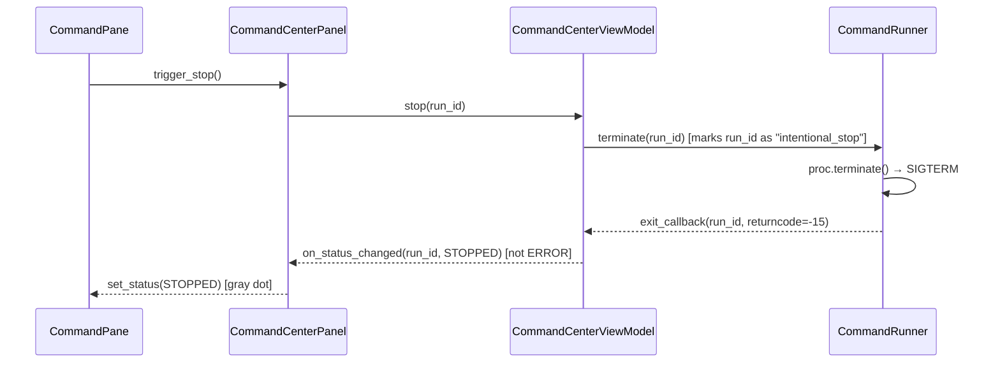
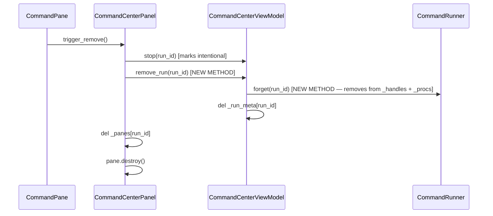
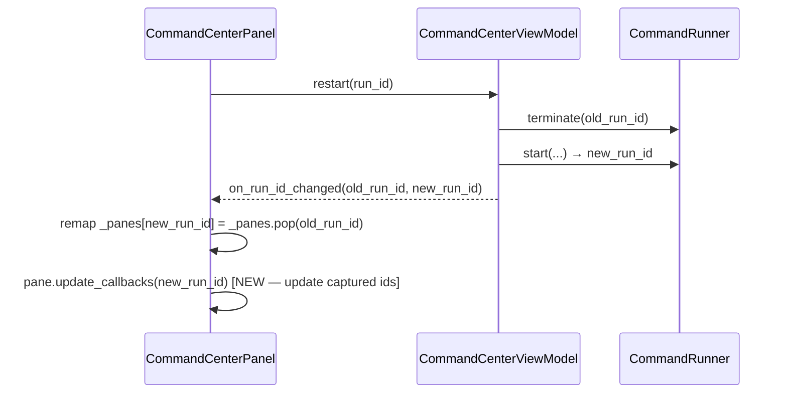
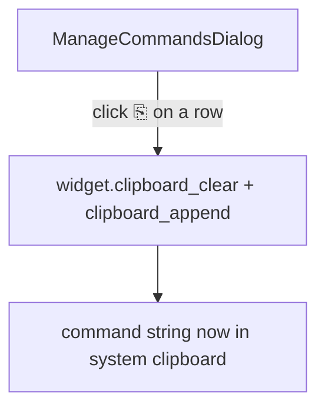

# Command Center Bug Fixes + Project Edit + Copy Commands

## Overview

This feature addresses four known bugs in the Command Center panel plus adds two new capabilities: editing workspace projects after creation and copying saved commands. The bugs cause commands to be un-closeable in certain states, re-appear after being dismissed, fail to stop, and fail to restart. The new capabilities round out the Command Center and Workspace Projects UX so users can manage their configuration without deleting and recreating entries.

## UI / Flow

### Command Center — Current Broken States

**Bug 1: Can't close/remove a command pane (especially with only 1)**
Root cause: `remove_pane` calls `self._vm.stop(run_id)` synchronously, which triggers the background thread's `exit_callback` → `on_status_changed` callback via `after(0, ...)`. If the pane is being destroyed at that moment, the callback tries to call `pane.set_status()` on a widget that has already been destroyed. With only 1 pane this race is more likely to surface visibly.

Fix: Guard `route_status` and `route_output` so they skip if the pane no longer exists in `_panes`.

**Bug 2: Closed commands reappear on re-open**
Root cause: `cli.py` reuses `_cc_panel` via `pack_forget` / re-pack. If the panel already exists it is shown again with its current `_panes` dict. But when the user removes a pane, `_runner._handles` still retains the `RunHandle`. If the panel is ever recreated (e.g. after `winfo_exists()` returns False), `_restore_existing_runs()` repopulates from ALL handles including ones the user dismissed.

Fix: `CommandRunner` needs a way to forget a terminated handle. `CommandCenterViewModel` should remove the handle from `_runner._handles` and `_run_meta` when `remove_pane` calls `stop`. This way `all_runs()` no longer returns dismissed runs.

**Bug 3: Stop button doesn't work visually**
Root cause: `CommandRunner.terminate()` sends SIGTERM. The subprocess exits with a non-zero returncode, so `_stream` sets `status = RunStatus.ERROR` and fires `exit_callback`. The UI updates to red (error) instead of gray (stopped). From the user's perspective the stop button "failed".

Fix: Track intentional stops. When `vm.stop(run_id)` is called, mark the run as "intentionally stopped" so that when the exit callback fires, it sets status to `STOPPED` rather than `ERROR`.

**Bug 4: Restart button doesn't work**
Root cause: `vm.restart()` terminates the old run and launches a new one with a different `run_id`. It fires `on_run_id_changed(old_id, new_id)` to let the panel remap `_panes`. However the pane's internal `_on_stop` and `_on_restart` lambdas captured the old `run_id` at pane creation time — they still reference the old id. After a restart the stop/restart buttons in the pane call `vm.stop(old_id)` which no longer has a live process.

Fix: Update the pane's callbacks after `on_run_id_changed` by passing the new run_id into the pane, or restructure so the pane always delegates to the panel which looks up the current run_id mapping.

### Command Center — Stop / Restart Button States

```
┌─────────────────────────────────────────────────────┐
│ ● my-server · myrepo : main   [⤢][⟳][■][⎘][🔍][✕] │
│ > npm run dev                                        │
│ Server started on port 3000                          │
└─────────────────────────────────────────────────────┘

After Stop:
┌─────────────────────────────────────────────────────┐
│ ○ my-server · myrepo : main   [⤢][⟳][■][⎘][🔍][✕] │
│ > npm run dev                                        │
│ Server started on port 3000                          │
│ [Process stopped]                                    │
└─────────────────────────────────────────────────────┘

After Restart (output cleared, fresh run):
┌─────────────────────────────────────────────────────┐
│ ● my-server · myrepo : main   [⤢][⟳][■][⎘][🔍][✕] │
│ > npm run dev                                        │
│ Server started on port 3000                          │
└─────────────────────────────────────────────────────┘
```

### Copy Command Feature — Manage Commands Dialog

Add a "⎘" (copy) button next to each command in the Manage Commands dialog. Clicking it copies the command string to the system clipboard — the same way the output copy button works in the command pane.

```
┌──────────────────── Manage Commands ────────────────┐
│ Repo: myrepo  (3 commands)                          │
│                                                      │
│ [+ Add Command]                                      │
│                                                      │
│  dev server     npm run dev       [⎘] [✕]           │
│  build          npm run build     [⎘] [✕]           │
│  test           pytest -x         [⎘] [✕]           │
│                                                      │
│                                              [Close] │
└──────────────────────────────────────────────────────┘

After clicking ⎘ on "dev server":
  → "npm run dev" is now in the system clipboard. No dialog opens.
```

### Edit Project Feature — Workspace Projects Panel

Add an "Edit" button next to each project in the project list:

```
Before (current):
▼ my-project                        [Open] [✕]
    main: ~/repos/myrepo
    feat: ~/repos/myrepo-feat

After (new):
▼ my-project                 [Edit] [Open] [✕]
    main: ~/repos/myrepo
    feat: ~/repos/myrepo-feat
```

Edit Project reuses `ProjectOperationsDialog` directly via an optional `existing_project` param. When provided: title changes to "Edit Project", name + entries are pre-populated, confirm button reads "Save Changes", and it routes to `vm.update_project` instead of `vm.create_project`. No new dialog file.

```
┌──────────────────── Edit Project ───────────────────┐
│ Project Name: my-project                             │
│                                                      │
│ Add worktrees:                                       │
│   Repo: [myrepo ▼]  Worktree: [main ▼]  [+ Add]    │
│                                                      │
│ Entries:                                             │
│   ~/repos/myrepo         [✕]                        │
│   ~/repos/myrepo-feat    [✕]                        │
│                                                      │
│                            [Cancel]  [Save Changes]  │
└──────────────────────────────────────────────────────┘
```

## Architecture

### Bug Fix: Intentional Stop Tracking



### Bug Fix: Handle Removal on Dismiss



### Bug Fix: Restart run_id Remapping



### New Feature: Edit Project

```mermaid
graph TD
    A[WorkspaceProjectsPanel] -->|click Edit| B[ProjectOperationsDialog existing_project=project]
    B -->|pre-populated name+entries, title=Edit Project| C[User edits]
    C -->|Save Changes| D[WorkspaceProjectsViewModel.update_project]
    D -->|delete old name if renamed, save new| E[ConfigStore]
    D --> F[WorkspaceService.generate_code_workspace]
    D --> G[Panel.refresh]
```



### New Feature: Copy Command to Clipboard



### New Components / Methods

| Component | Change |
|---|---|
| `CommandRunner` | Add `forget(run_id)` method; add `_intentional_stops: set` |
| `CommandCenterViewModel` | Add `remove_run(run_id)`; mark intentional stops before terminate |
| `CommandCenterPanel` | Guard `route_status`/`route_output` for destroyed panes; call `remove_run` in `remove_pane` |
| `CommandPane` | Add `update_callbacks(on_stop, on_restart)` method |
| `ManageCommandsDialog` | Add ⎘ button per command row — copies command string to clipboard |
| `WorkspaceProjectsViewModel` | Add `update_project(old_name, new_name, entries)` |
| `WorkspaceProjectsPanel` | Add Edit button; open `ProjectOperationsDialog(existing_project=project)` |
| `ProjectOperationsDialog` | Accept optional `existing_project`; change title/button/routing when editing |
| `ConfigStore` | Add `rename_project(old_name, new_name, entries)` for atomic rename+update |

## Test Server

A standalone Python HTTP server lives at `worktree-manager/test_server.py`. It is designed to be launched as a saved command in the Command Center so you can exercise stop/restart/close behaviour against a real long-running process.

**Behaviour:**
- Sleeps for 20 seconds on startup, printing progress dots every 5 s, to simulate a slow-starting service
- After the 120 s warmup, starts an HTTP server on port 18888
- Exposes one GET RPC endpoint: `GET /rpc?method=ping` → `{"ok": true, "method": "ping", "ts": <unix_ts>}`
- Prints a startup banner once the server is ready so you can see it in the Command Center output pane

**Usage after saving as a command:**
1. Save command: name `test-server`, command `python3.14 test_server.py`, repo = any repo
2. Launch it from Command Center — watch the 2-minute warmup in the output pane
3. Once ready, call: `curl "http://localhost:18888/rpc?method=ping"`
4. Use Stop / Restart buttons to verify Command Center fixes

## Iteration Plan

### Iteration 0 — Walking Skeleton: Test Server + Core Bug Fixes
**Delivers:** A working test server you can launch from Command Center, and all four bugs fixed so stop/restart/close/reopen all behave correctly.
**Scope:**
- `test_server.py` — 2-minute startup delay, HTTP server on port 18888, `GET /rpc?method=ping` endpoint
- `CommandRunner`: add `_intentional_stops` set + `forget(run_id)` method; use intentional-stop flag in `_stream` to emit `STOPPED` not `ERROR`
- `CommandCenterViewModel`: add `remove_run(run_id)`; mark intentional stop before terminate in both `stop()` and `remove_pane` path
- `CommandCenterPanel`: call `remove_run` in `remove_pane`; guard `route_status`/`route_output` against destroyed panes
- `CommandPane`: add `update_callbacks(on_stop, on_restart)` method; panel calls it after `on_run_id_changed`

**Explicitly out of scope:** Copy command to clipboard, edit project, rename `new_project_dialog.py`

---

### Iteration 1 — Copy Command to Clipboard
**Delivers:** A ⎘ button on each row of the Manage Commands dialog that copies the command string to the system clipboard.
**Scope:**
- `ManageCommandsDialog`: add ⎘ button per command row; call `clipboard_clear()` + `clipboard_append(cmd.command)` on the dialog widget
**Builds on:** Iteration 0

---

### Iteration 2 — Edit Project + ProjectOperationsDialog
**Delivers:** An Edit button on each project row in Workspace Projects that opens the same dialog used for creation, pre-populated with the existing name and worktrees, and saves changes atomically (including renames).
**Scope:**
- Rename `new_project_dialog.py` → `project_operations_dialog.py`, class `NewProjectDialog` → `ProjectOperationsDialog`
- `ProjectOperationsDialog`: accept optional `existing_project` param; when set, change title/button label/confirm routing
- `WorkspaceProjectsViewModel`: add `update_project(old_name, new_name, entries)`
- `ConfigStore`: add `rename_project(old_name, new_name, entries)` for atomic rename+update
- `WorkspaceProjectsPanel`: add Edit button per project row; update import to use `ProjectOperationsDialog`; update `_open_new_dialog` to pass `on_create`; add `_edit_project` handler
**Builds on:** Iteration 1

## ✋ Manual Testing Gate — Iteration 0

> CONFIRMED by user.

- [x] Launch the app, open Command Center, click "+ Launch", start the test server — confirm the 20-second warmup dots appear in the output pane
- [x] While the server is warming up, click "■" (Stop) — confirm the status dot turns **gray** (not red)
- [x] Launch the test server again, wait for "Server ready" in output, then run `curl "http://localhost:18888/rpc?method=ping"` — confirm JSON response with `"ok": true`
- [x] With the server running, click "⟳" (Restart) — confirm output clears, warmup dots restart, and Stop/Restart buttons still work on the restarted process
- [x] After restarting, click "■" (Stop) on the restarted process — confirm gray dot (not red)
- [x] With one command pane visible, click "✕" on the pane — confirm it is removed cleanly with no crash and the empty state label appears
- [x] Close Command Center (click "×"), then reopen it from the sidebar — confirm no previously-dismissed panes reappear

## Iteration 1 — Copy Command to Clipboard

### Phase 1.1 — ⎘ button in Manage Commands dialog

**What it covers:** A copy button on each command row that writes the command string to the system clipboard.

**Production code (Green):**
Added to `ManageCommandsDialog._build_view_row`: a `⎘` CTkButton that calls `self._copy_command(command)`.
Added `_copy_command(command)`: calls `self.clipboard_clear()` + `self.clipboard_append(command)`.
`copy_btn` is included in `self._all_action_buttons` so it is disabled while another command is being edited.

**Done when:** Clicking ⎘ on any command row copies that command's string to the clipboard; the button is disabled while another row is in edit mode.

## ✋ Manual Testing Gate — Iteration 1

> CONFIRMED by user.

- [x] Open Manage Commands — ⎘ button appears next to Edit and Delete on each command row
- [x] Click ⎘ — command string copied to clipboard
- [x] Click ⎘ on second command — clipboard overwritten
- [x] Enter edit mode — ⎘ buttons disabled
- [x] Cancel edit — ⎘ buttons active again
- [x] Regression: stop still shows gray dot

## Iteration 2 — Edit Project + ProjectOperationsDialog

**Delivers:** An Edit button on each project row in Workspace Projects that opens the same dialog used for creation, pre-populated with the existing name and worktrees, and saves changes atomically (including renames).

**Scope:**
- `project_operations_dialog.py` (new file) — `ProjectOperationsDialog` replaces `NewProjectDialog`; accepts optional `existing_project`; title/button/routing change in edit mode
- `ConfigStore.rename_project(old_name, new_name, entries)` — atomic delete-old + write-new
- `WorkspaceProjectsViewModel.update_project(old_name, new_name, entries)`
- `WorkspaceProjectsPanel` — Edit button per row; `_edit_project`; `_handle_edit`; updated `_open_new_dialog` import

**Done when:** Edit button opens pre-populated dialog; Save Changes calls `update_project`; renamed projects appear under new name; old name is gone; workspace file regenerated.

## ✋ Manual Testing Gate — Iteration 2

> STOP. Do not proceed until every item below is checked off by the user.

- [ ] Open Workspace Projects — confirm an Edit button appears next to Open and ✕ on each project row
- [ ] Click Edit on a project — confirm the dialog opens titled "Edit Project" with the project name and worktrees already filled in
- [ ] Change the project name and click Save Changes — confirm the project appears under the new name and the old name is gone
- [ ] Click Edit, add a new worktree entry, click Save Changes — confirm the updated entry list is reflected in the project row
- [ ] Click Edit, remove a worktree entry, click Save Changes — confirm the entry is no longer listed
- [ ] Click Edit then Cancel — confirm no changes were made
- [ ] Click + New — confirm the dialog still opens titled "New Workspace Project" with empty fields (regression)
- [ ] **Regression:** Open Manage Commands, click ⎘ on a command — confirm clipboard copy still works (Iteration 1 intact)
- [ ] **Regression:** Open Command Center, launch and stop a command — confirm gray dot still appears (Iteration 0 intact)

**How to confirm:** Run the app with `python3.14 -m worktree_manager.cli`, perform each action above, and check off each item manually.
Reply "Iteration 2 confirmed" (or describe any failures) before I declare the feature complete.

## Feature Acceptance Checklist

- [ ] Stop button turns dot **gray** (not red) when a running command is intentionally stopped
- [ ] Restart button clears output and restarts the process; Stop/Restart still work on the restarted process
- [ ] Closing a command pane (✕) removes it cleanly; empty state label appears when last pane is removed
- [ ] Dismissed commands do not reappear when Command Center is closed and reopened
- [ ] Launching the same command on the same repo+worktree while it is running is blocked with a conflict message
- [ ] Launching the same command on the same repo+worktree while it is stopped offers an inline Restart prompt
- [ ] ⎘ button in Manage Commands copies the command string to the clipboard
- [ ] Edit button in Workspace Projects opens pre-populated dialog; changes (name, entries) are saved atomically
- [ ] Renaming a project removes the old name and creates the new one
- [ ] + New in Workspace Projects still opens an empty "New Workspace Project" dialog
- [ ] All automated tests pass with no regressions
- [ ] All three iteration manual testing gates confirmed by user

## Open Questions

(none)
