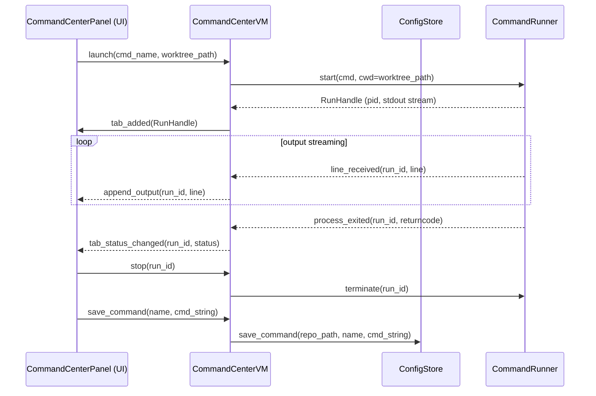
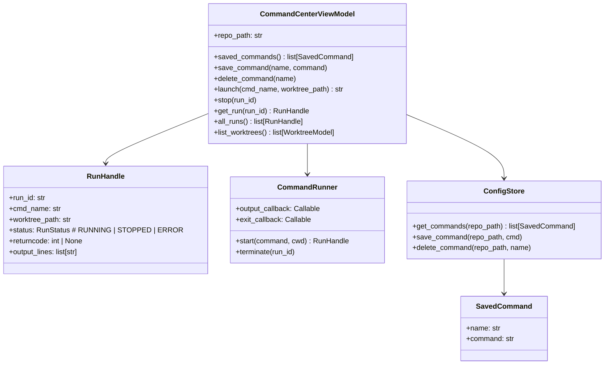

# Command Center

## Overview
The Command Center is a panel within the Worktree Manager app that lets you define named shell commands per-repo (e.g. "frontend", "backend"), then launch them against any worktree — open or closed — and monitor their live output in a tabbed terminal-style interface. Each running command gets its own tab; tabs persist until you stop or close them. Output can be copied in one click.

## UI / Flow

### Main Window — Command Center tab added to header

```
┌─────────────────────────────────────────────────────────────────────┐
│  Git Worktree Manager — my-app                          ⚙  🧹  ▶   │
│──────────────────────────────────────────────────────────────────── │
│  [Worktrees]  [Command Center]                                       │
└─────────────────────────────────────────────────────────────────────┘
```

### Command Center — No commands running (empty state)

```
┌─────────────────────────────────────────────────────────────────────┐
│  Command Center                                    [+ Add Command]   │
│──────────────────────────────────────────────────────────────────── │
│  Saved Commands                                                      │
│  ┌──────────────────────────────────────────────────────────────┐   │
│  │  Name: frontend      Command: npm run dev                    │   │
│  │  Name: backend       Command: python manage.py runserver     │   │
│  └──────────────────────────────────────────────────────────────┘   │
│                                                                      │
│  ┌─────────────────────────────────┐                                 │
│  │  No commands running.           │                                 │
│  │  Select a saved command and a   │                                 │
│  │  worktree to launch one.        │                                 │
│  └─────────────────────────────────┘                                 │
└─────────────────────────────────────────────────────────────────────┘
```

### Add Command dialog

Includes a repo picker pre-filled with the currently active repo, but editable. This lets you add commands to any repo without switching context first.

```
┌────────────────────────────────────────────────────────┐
│  Add Saved Command                                     │
│  Repo:    [my-app                                ▾]   │
│  Name:    [frontend                               ]   │
│  Command:                                             │
│  ┌────────────────────────────────────────────────┐   │
│  │ FLASK_ENV=dev python manage.py runserver       │   │
│  │ --host 0.0.0.0 --port 8000                     │   │
│  └────────────────────────────────────────────────┘   │
│                              [Cancel]  [Save]          │
└────────────────────────────────────────────────────────┘
```

### Command Center — Running commands (tabbed terminal)

```
┌─────────────────────────────────────────────────────────────────────┐
│  Command Center                                    [+ Add Command]   │
│──────────────────────────────────────────────────────────────────── │
│  Saved Commands                                                      │
│  ┌──────────────────────────────────────────────────────────────┐   │
│  │  Name: frontend   Cmd: npm run dev    Worktree: [main    ▾]  │  Run │ │
│  │  Name: backend    Cmd: pyt runserver  Worktree: [feat-x  ▾]  │  Run │ │
│  └──────────────────────────────────────────────────────────────┘   │
│                                                                      │
│  Running                                                             │
│  [● frontend/main] [● backend/feat-x] [+ Launch]                    │
│──────────────────────────────────────────────────────────────────── │
│  frontend — main                                  [Copy] [■ Stop]   │
│  ┌──────────────────────────────────────────────────────────────┐   │
│  │  > npm run dev                                               │   │
│  │  vite v5.0.0  ready on http://localhost:5173                 │   │
│  │  watching for file changes...                                │   │
│  │  █                                                           │   │
│  └──────────────────────────────────────────────────────────────┘   │
└─────────────────────────────────────────────────────────────────────┘
```

### Tab states

```
Active tab:   [● frontend/main  ×]    ← green dot = running, × closes tab
Stopped tab:  [○ backend/feat-x ×]   ← grey dot = process exited / stopped
Error tab:    [✕ build/main     ×]   ← red dot  = process exited non-zero
```

### Launch dialog (inline or via [+ Launch])

Repo picker defaults to the active repo. Selecting a repo refreshes the Worktree dropdown to show only that repo's worktrees, and the Command dropdown to show only that repo's saved commands.

```
┌──────────────────────────────────────┐
│  Launch Command                      │
│  Repo:     [my-app             ▾]   │
│  Command:  [frontend           ▾]   │
│  Worktree: [main               ▾]   │
│            [Cancel]  [Launch]        │
└──────────────────────────────────────┘
```

## Architecture





**Data persistence:** Saved commands stored in existing `config.json` under each repo entry, e.g.:
```json
{
  "repos": {
    "/path/to/repo": {
      "commands": [
        {"name": "frontend", "command": "npm run dev"},
        {"name": "backend",  "command": "python manage.py runserver"}
      ]
    }
  }
}
```

**Process management:** `CommandRunner` uses `subprocess.Popen` with `stdout=PIPE, stderr=STDOUT`, reads lines on a background thread, and pushes them to the VM via a callback. Tkinter's `after()` is used to schedule UI updates on the main thread.

## High-Level Steps

1. Add `SavedCommand` dataclass to `models.py` and extend `RepoConfig` with a `commands` list
2. Extend `ConfigStore` with `get_commands`, `save_command`, and `delete_command` methods persisting to `config.json`
3. Build `CommandRunner` — starts subprocesses via `Popen`, streams stdout on background threads, fires output and exit callbacks
4. Build `CommandCenterViewModel` — owns `CommandRunner` instance, exposes saved-command CRUD and `launch` / `stop` / `all_runs` API
5. Build `CommandCenterPanel` UI — saved commands list with delete button, tabbed running-commands row, output text area with Copy and Stop
6. Build `AddCommandDialog` — Repo picker, Name field, multi-line Command text area, Save action
7. Build `LaunchDialog` — Repo picker, cascading Command and Worktree dropdowns, Launch action
8. Wire `CommandCenterViewModel` as a global singleton in `App` (so runs survive repo switches) and pass it into `CommandCenterPanel`
9. Add `[Command Center]` tab toggle to `MainWindow` header so users can switch between the Worktrees view and Command Center

## Decisions

- **Repo switch:** Running commands keep running when you switch repos. Their tabs are hidden and reappear when you switch back. The `CommandRunner` lifecycle is global, not tied to the UI panel.
- **Output buffer:** Rolling 5,000-line buffer per run. Oldest lines are dropped when the limit is exceeded.
- **One-click copy:** The Copy button copies the full buffered output of the active tab to the clipboard.
- **Command scope:** Saved commands are per-repo, shared across all worktrees. The worktree to run on is chosen at launch time.
