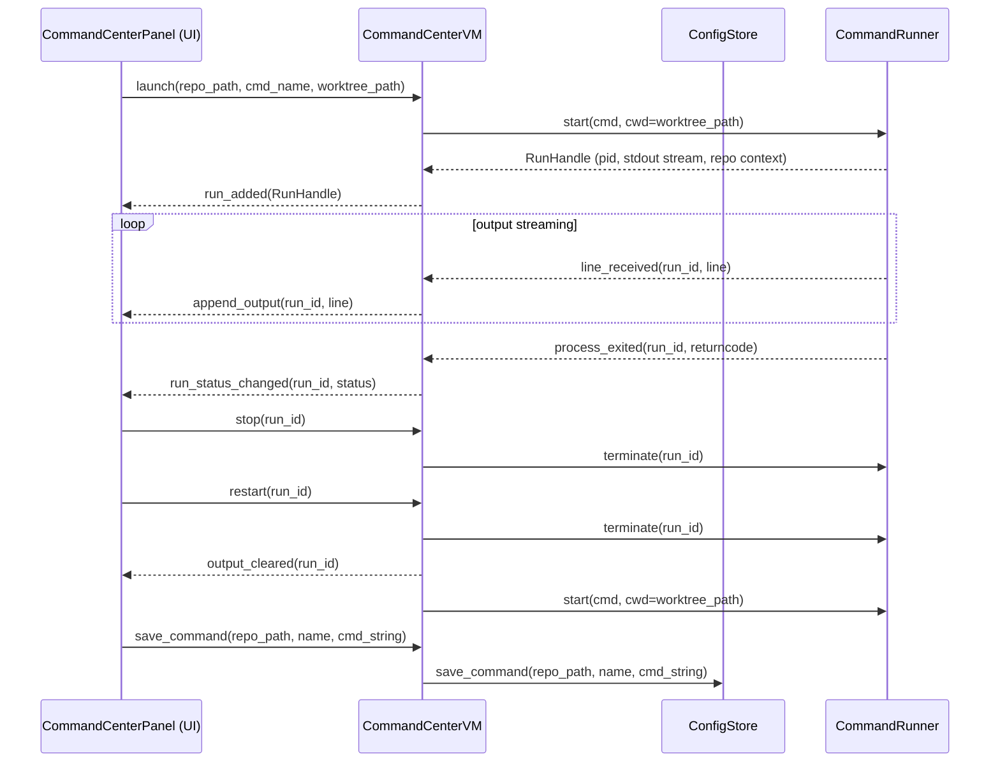
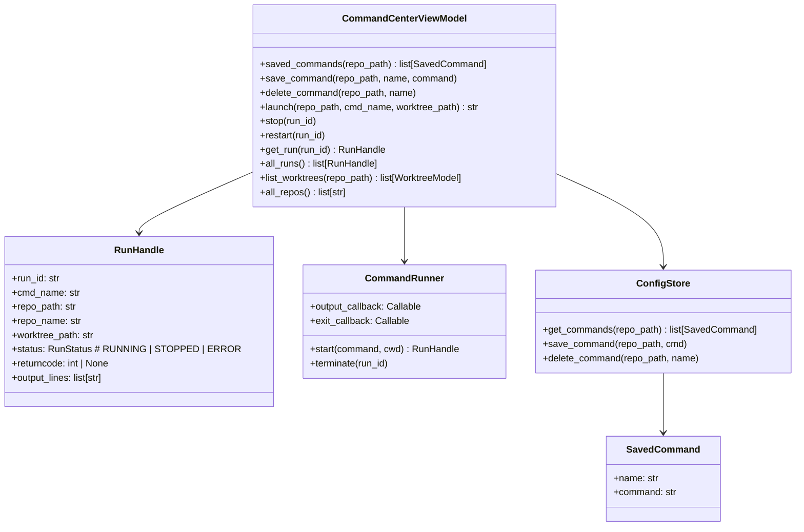

# Command Center

## Overview
The Command Center is a global panel that lets you define named shell commands per-repo and launch them against any worktree across any repo. Running commands are displayed as tiled output panes stacked vertically in a scroll view — like tiled terminals — so you can monitor all of them at once without switching tabs. Any pane can be maximized to fill the available space. The panel is opened via a button in the bottom-left of the sidebar, making it clear it belongs to no single repo.

## UI / Flow

### App layout — Command Center button in sidebar

`[⊞ Command Center]` sits below `[+ Add Repo]` at the bottom of the sidebar. It opens the Command Center as a full overlay over the main content area.

```
┌─────────────────────────────────────────────────────────────────────────┐
│  ┌────────────┐  ┌─────────────────────────────────────────────────┐   │
│  │  REPOS     │  │  Git Worktree Manager — my-app        ⚙  🧹    │   │
│  │────────────│  │─────────────────────────────────────────────────│   │
│  │ ● my-app   │  │  Worktrees                          [+ New]     │   │
│  │   api-svc  │  │                                                 │   │
│  │   infra    │  │  ●  main        2d ago  [OPEN]  [Focus]         │   │
│  │            │  │  ○  feat-auth   1d ago  [OPEN]  [Focus]         │   │
│  │            │  │  ○  feat-api    3d ago          [Switch]        │   │
│  │            │  │                                                 │   │
│  │────────────│  └─────────────────────────────────────────────────┘   │
│  │ + Add Repo │                                                         │
│  │⊞ Cmd Ctr  │                                                         │
│  └────────────┘                                                         │
└─────────────────────────────────────────────────────────────────────────┘
```

---

### Command Center — Empty state

No header tabs. The panel replaces the main content area entirely when open. `[+ Add Command]` and `[+ Launch]` live in the top toolbar. `[×]` closes the panel and returns to the Worktrees view.

```
┌─────────────────────────────────────────────────────────────────────────┐
│  ┌────────────┐  ┌─────────────────────────────────────────────────┐   │
│  │  REPOS     │  │  Command Center          [+ Add Command] [+ Launch] [×] │
│  │────────────│  │─────────────────────────────────────────────────│   │
│  │ ● my-app   │  │                                                 │   │
│  │   api-svc  │  │                                                 │   │
│  │   infra    │  │         No commands running.                    │   │
│  │            │  │         Click [+ Launch] to start one.          │   │
│  │            │  │                                                 │   │
│  │────────────│  └─────────────────────────────────────────────────┘   │
│  │ + Add Repo │                                                         │
│  │⊞ Cmd Ctr  │                                                         │
│  └────────────┘                                                         │
└─────────────────────────────────────────────────────────────────────────┘
```

---

### Command Center — Multiple commands running (tiled view)

Each running command gets its own output pane. Panes are stacked vertically inside a scroll view. Each pane header shows the command identity and its controls on the right: `[⤢]` maximize, `[⟳]` restart, `[■]` stop, `[⎘]` copy.

```
┌─────────────────────────────────────────────────────────────────────────┐
│  ┌────────────┐  ┌─────────────────────────────────────────────────┐   │
│  │  REPOS     │  │  Command Center          [+ Add Command] [+ Launch] [×] │
│  │────────────│  │─────────────────────────────────────────────────│   │
│  │ ● my-app   │  │  ┌───────────────────────────────────────────┐  │   │
│  │   api-svc  │  │  │ ● frontend · my-app : feat-auth  [⤢][⟳][■][⎘] │  │   │
│  │   infra    │  │  │  > npm run dev                            │  │   │
│  │            │  │  │  vite v5.0.0  ready on :5173              │  │   │
│  │            │  │  │  watching for file changes...  █          │  │   │
│  │            │  │  └───────────────────────────────────────────┘  │   │
│  │            │  │  ┌───────────────────────────────────────────┐  │   │
│  │            │  │  │ ● backend · my-app : feat-auth   [⤢][⟳][■][⎘] │  │   │
│  │            │  │  │  > python manage.py runserver             │  │   │
│  │            │  │  │  Starting dev server on :8000             │  │   │
│  │            │  │  │  Watching for changes...  █               │  │   │
│  │            │  │  └───────────────────────────────────────────┘  │   │
│  │            │  │  ┌───────────────────────────────────────────┐  │   │
│  │            │  │  │ ○ server · api-svc : main        [⤢][⟳][■][⎘] │  │   │
│  │            │  │  │  > go run ./cmd/server                    │  │   │
│  │            │  │  │  Process exited (0)                       │  │   │
│  │            │  │  └───────────────────────────────────────────┘  │   │
│  │────────────│  └─────────────────────────────────────────────────┘   │
│  │ + Add Repo │                              ▲ scroll                   │
│  │⊞ Cmd Ctr  │                                                         │
│  └────────────┘                                                         │
└─────────────────────────────────────────────────────────────────────────┘
```

Pane header dot states:
```
●  green  — process running
○  grey   — process exited cleanly (code 0)
✕  red    — process exited with error (non-zero)
```

---

### Command Center — Maximized pane

Clicking `[⤢]` on a pane expands it to fill the entire Command Center content area. All other panes are hidden. `[⤡]` in the same position restores the tiled view.

```
┌─────────────────────────────────────────────────────────────────────────┐
│  ┌────────────┐  ┌─────────────────────────────────────────────────┐   │
│  │  REPOS     │  │  Command Center          [+ Add Command] [+ Launch] [×] │
│  │────────────│  │─────────────────────────────────────────────────│   │
│  │ ● my-app   │  │  ┌───────────────────────────────────────────┐  │   │
│  │   api-svc  │  │  │ ● frontend · my-app : feat-auth  [⤡][⟳][■][⎘] │  │   │
│  │   infra    │  │  │  > npm run dev                            │  │   │
│  │            │  │  │  vite v5.0.0  ready on :5173              │  │   │
│  │            │  │  │  [lots of output...]                      │  │   │
│  │            │  │  │                                           │  │   │
│  │            │  │  │                                           │  │   │
│  │            │  │  │  watching for file changes...  █          │  │   │
│  │            │  │  └───────────────────────────────────────────┘  │   │
│  │────────────│  └─────────────────────────────────────────────────┘   │
│  │ + Add Repo │                                                         │
│  │⊞ Cmd Ctr  │                                                         │
│  └────────────┘                                                         │
└─────────────────────────────────────────────────────────────────────────┘
```

---

### Command palette (Cmd+K) — launch a saved command quickly

Triggered by `Cmd+K` anywhere in the app. A floating dialog appears centered over the content area. Typing filters saved commands across all repos by name. Arrow keys move the selection; `Enter` launches the highlighted result against the last-used worktree for that repo (pre-filled in the Worktree field, but editable). `Esc` dismisses.

```
        ┌─────────────────────────────────────────────┐
        │ 🔍 front__________________________           │
        │─────────────────────────────────────────────│
        │ ▶ frontend · my-app    [feat-auth      ▾]  │  ← selected
        │   frontend · api-svc   [main           ▾]  │
        │─────────────────────────────────────────────│
        │  ↑↓ navigate   Enter launch   Esc dismiss   │
        └─────────────────────────────────────────────┘
```

Each result row has an inline Worktree dropdown so you can change the target without leaving the palette. Launching closes the palette and opens the Command Center panel if not already open.

---

### Per-pane output search (Ctrl+F)

`Ctrl+F` (or clicking a `[🔍]` icon in the pane header) reveals a find bar inside that pane. Matches are highlighted in the output. `↑` / `↓` or `Enter` / `Shift+Enter` step through matches. `Esc` dismisses.

```
  ┌─────────────────────────────────────────────────────┐
  │ ● frontend · my-app : feat-auth  [⤢][⟳][■][⎘][🔍] │
  │─────────────────────────────────────────────────────│
  │  [ 🔍 error____________ ]  match 2 of 4  [↑] [↓] [×]│
  │  > npm run dev                                      │
  │  vite v5.0.0  ready on :5173                        │
  │  Error: cannot find module './foo'    ← highlighted  │
  │  watching for file changes...                       │
  │  Error: failed to resolve import     ← highlighted  │
  └─────────────────────────────────────────────────────┘
```

---

### Add Command dialog

Repo and worktree are both required since saved commands are per-repo but you're not necessarily in that repo's context when adding.

```
┌──────────────────────────────────────────────┐
│  Add Saved Command                           │
│  Repo:     [my-app                     ▾]   │
│  Name:     [frontend                    ]   │
│  Command:                                   │
│  ┌──────────────────────────────────────┐   │
│  │ npm run dev                          │   │
│  └──────────────────────────────────────┘   │
│                        [Cancel]  [Save]      │
└──────────────────────────────────────────────┘
```

---

### Launch dialog (via [+ Launch])

Full cross-repo picker. Selecting a repo refreshes Command and Worktree dropdowns to show only that repo's data.

```
┌──────────────────────────────────────────┐
│  Launch Command                          │
│  Repo:     [my-app               ▾]     │
│  Command:  [frontend             ▾]     │
│  Worktree: [feat-auth            ▾]     │
│                    [Cancel]  [Launch]    │
└──────────────────────────────────────────┘
```

## Architecture





**Data persistence:** Saved commands stored in existing `config.json` under each repo entry, e.g.:
```json
{
  "repos": {
    "/path/to/repo": {
      "commands": [
        {"name": "frontend", "command": "npm run dev"},
        {"name": "backend",  "command": "python manage.py runserver"}
      ]
    }
  }
}
```

**Process management:** `CommandRunner` uses `subprocess.Popen` with `stdout=PIPE, stderr=STDOUT`, reads lines on a background thread, and pushes them to the VM via a callback. Tkinter's `after()` is used to schedule UI updates on the main thread.

## Implementation Phases

### Phase 1 — SavedCommand model + RepoConfig extension

**What it covers:** Adds the `SavedCommand` dataclass and a `commands` field to `RepoConfig`. No persistence yet — pure data model.

**Tests (Red) — write these first:**
```python
# tests/test_command_center_models.py
from worktree_manager.models import SavedCommand, RepoConfig


def test_saved_command_has_name_and_command():
    cmd = SavedCommand(name="frontend", command="npm run dev")
    assert cmd.name == "frontend"
    assert cmd.command == "npm run dev"


def test_repo_config_has_empty_commands_by_default():
    cfg = RepoConfig(
        repo_path="/repos/proj",
        worktree_storage="/repos/proj-wt",
        stale_days=30,
        last_editor="cursor",
        last_editor_mode="reuse",
        last_opened="2026-05-20T10:00:00",
    )
    assert cfg.commands == []


def test_repo_config_accepts_commands_list():
    cmds = [SavedCommand(name="frontend", command="npm run dev")]
    cfg = RepoConfig(
        repo_path="/repos/proj",
        worktree_storage="/repos/proj-wt",
        stale_days=30,
        last_editor="cursor",
        last_editor_mode="reuse",
        last_opened="2026-05-20T10:00:00",
        commands=cmds,
    )
    assert len(cfg.commands) == 1
    assert cfg.commands[0].name == "frontend"
```

**Production code (Green):**
```python
# worktree_manager/models.py  — add SavedCommand, extend RepoConfig

@dataclass
class SavedCommand:
    name: str
    command: str


@dataclass
class RepoConfig:
    repo_path: str
    worktree_storage: str
    stale_days: int
    last_editor: str
    last_editor_mode: str
    last_opened: str
    editor: str = "cursor"
    window_mode: str = "multi"
    cur_open_path: str | None = None
    commands: list = field(default_factory=list)  # list[SavedCommand]
```

**Done when:** `pytest tests/test_command_center_models.py` passes and existing `test_models.py` and `test_config_store.py` are still green.

---

### Phase 2 — ConfigStore commands persistence

**What it covers:** `get_commands`, `save_command`, `delete_command` on `ConfigStore`. Commands round-trip through `config.json`. Loading a repo with no `commands` key in JSON returns an empty list (backwards compatibility).

**Tests (Red) — write these first:**
```python
# tests/test_command_center_config.py
import json
import pytest
from pathlib import Path
from worktree_manager.config_store import ConfigStore
from worktree_manager.models import RepoConfig, SavedCommand


@pytest.fixture
def config_path(tmp_path):
    return tmp_path / "config.json"


@pytest.fixture
def store(config_path):
    return ConfigStore(config_path)


@pytest.fixture
def repo_path(store):
    store.save_repo(RepoConfig(
        repo_path="/repos/proj",
        worktree_storage="/repos/proj-wt",
        stale_days=30,
        last_editor="cursor",
        last_editor_mode="reuse",
        last_opened="2026-05-20T10:00:00",
    ))
    return "/repos/proj"


def test_get_commands_returns_empty_for_new_repo(store, repo_path):
    assert store.get_commands(repo_path) == []


def test_save_command_persists(store, repo_path):
    store.save_command(repo_path, SavedCommand(name="frontend", command="npm run dev"))
    cmds = store.get_commands(repo_path)
    assert len(cmds) == 1
    assert cmds[0].name == "frontend"
    assert cmds[0].command == "npm run dev"


def test_save_multiple_commands(store, repo_path):
    store.save_command(repo_path, SavedCommand(name="frontend", command="npm run dev"))
    store.save_command(repo_path, SavedCommand(name="backend", command="python manage.py runserver"))
    cmds = store.get_commands(repo_path)
    assert len(cmds) == 2
    assert {c.name for c in cmds} == {"frontend", "backend"}


def test_save_command_writes_to_disk(store, repo_path, config_path):
    store.save_command(repo_path, SavedCommand(name="frontend", command="npm run dev"))
    raw = json.loads(config_path.read_text())
    assert raw["repos"][repo_path]["commands"] == [
        {"name": "frontend", "command": "npm run dev"}
    ]


def test_save_command_updates_existing_name(store, repo_path):
    store.save_command(repo_path, SavedCommand(name="frontend", command="npm run dev"))
    store.save_command(repo_path, SavedCommand(name="frontend", command="npm run build"))
    cmds = store.get_commands(repo_path)
    assert len(cmds) == 1
    assert cmds[0].command == "npm run build"


def test_delete_command_removes_by_name(store, repo_path):
    store.save_command(repo_path, SavedCommand(name="frontend", command="npm run dev"))
    store.save_command(repo_path, SavedCommand(name="backend", command="python manage.py runserver"))
    store.delete_command(repo_path, "frontend")
    cmds = store.get_commands(repo_path)
    assert len(cmds) == 1
    assert cmds[0].name == "backend"


def test_delete_command_noop_for_unknown_name(store, repo_path):
    store.save_command(repo_path, SavedCommand(name="frontend", command="npm run dev"))
    store.delete_command(repo_path, "nonexistent")
    assert len(store.get_commands(repo_path)) == 1


def test_get_commands_returns_empty_when_key_missing_from_disk(store, config_path):
    config_path.write_text(json.dumps({
        "repos": {
            "/repos/proj": {
                "worktree_storage": "/repos/proj-wt",
                "stale_days": 30,
                "last_editor": "cursor",
                "last_editor_mode": "reuse",
                "last_opened": "2026-05-20T10:00:00",
            }
        }
    }))
    assert store.get_commands("/repos/proj") == []


def test_get_repo_loads_commands(store, repo_path):
    store.save_command(repo_path, SavedCommand(name="frontend", command="npm run dev"))
    cfg = store.get_repo(repo_path)
    assert len(cfg.commands) == 1
    assert cfg.commands[0].name == "frontend"
```

**Production code (Green):**
```python
# worktree_manager/config_store.py  — add to ConfigStore

def get_commands(self, repo_path: str) -> list:
    data = self._load_raw()
    entry = data["repos"].get(repo_path, {})
    return [
        SavedCommand(name=c["name"], command=c["command"])
        for c in entry.get("commands", [])
    ]

def save_command(self, repo_path: str, cmd: SavedCommand) -> None:
    data = self._load_raw()
    entry = data["repos"].setdefault(repo_path, {})
    commands = entry.get("commands", [])
    commands = [c for c in commands if c["name"] != cmd.name]
    commands.append({"name": cmd.name, "command": cmd.command})
    entry["commands"] = commands
    self._save_raw(data)

def delete_command(self, repo_path: str, name: str) -> None:
    data = self._load_raw()
    entry = data["repos"].get(repo_path, {})
    entry["commands"] = [c for c in entry.get("commands", []) if c["name"] != name]
    self._save_raw(data)
```

Also update `get_repo` and `all_repos` to hydrate `commands`:
```python
# In get_repo, add to the RepoConfig constructor call:
commands=[
    SavedCommand(name=c["name"], command=c["command"])
    for c in entry.get("commands", [])
],

# In all_repos, same addition to each RepoConfig constructor call.
```

Also add `SavedCommand` to the import at the top of `config_store.py`:
```python
from worktree_manager.models import RepoConfig, SavedCommand
```

**Done when:** `pytest tests/test_command_center_config.py` passes and all pre-existing config store tests are still green.

---

### Phase 3 — CommandRunner

**What it covers:** `CommandRunner` launches a subprocess, streams stdout+stderr line-by-line to an `output_callback`, and fires an `exit_callback` with the return code when the process ends. `terminate()` kills the process. All subprocess I/O happens on a background thread; callbacks are called from that thread (the UI layer is responsible for scheduling onto the main thread via `after()`).

**Tests (Red) — write these first:**
```python
# tests/test_command_runner.py
import time
import sys
import pytest
from worktree_manager.command_runner import CommandRunner


@pytest.fixture
def runner():
    r = CommandRunner()
    yield r
    # terminate any still-running handles
    for h in list(r._handles.values()):
        try:
            r.terminate(h.run_id)
        except Exception:
            pass


def _collect(runner, cmd, cwd=None, timeout=3.0):
    """Run a command, collect all output lines and the exit code."""
    lines = []
    result = {}

    def on_output(run_id, line):
        lines.append(line)

    def on_exit(run_id, returncode):
        result["returncode"] = returncode

    runner.output_callback = on_output
    runner.exit_callback = on_exit
    handle = runner.start(cmd, cwd=cwd)

    deadline = time.time() + timeout
    while "returncode" not in result and time.time() < deadline:
        time.sleep(0.05)

    return handle, lines, result.get("returncode")


def test_start_returns_handle_with_run_id(runner):
    handle, _, _ = _collect(runner, [sys.executable, "-c", "print('hi')"])
    assert handle.run_id
    assert isinstance(handle.run_id, str)


def test_output_lines_delivered_via_callback(runner):
    _, lines, _ = _collect(runner, [sys.executable, "-c", "print('hello'); print('world')"])
    assert "hello" in lines
    assert "world" in lines


def test_exit_callback_fires_with_zero_on_clean_exit(runner):
    _, _, returncode = _collect(runner, [sys.executable, "-c", "pass"])
    assert returncode == 0


def test_exit_callback_fires_with_nonzero_on_failure(runner):
    _, _, returncode = _collect(runner, [sys.executable, "-c", "raise SystemExit(1)"])
    assert returncode == 1


def test_handle_status_is_running_immediately_after_start(runner):
    from worktree_manager.command_runner import RunStatus
    handle = runner.start([sys.executable, "-c", "import time; time.sleep(5)"])
    assert handle.status == RunStatus.RUNNING
    runner.terminate(handle.run_id)


def test_handle_status_becomes_stopped_after_clean_exit(runner):
    from worktree_manager.command_runner import RunStatus
    handle, _, _ = _collect(runner, [sys.executable, "-c", "pass"])
    assert handle.status == RunStatus.STOPPED


def test_handle_status_becomes_error_on_nonzero_exit(runner):
    from worktree_manager.command_runner import RunStatus
    handle, _, _ = _collect(runner, [sys.executable, "-c", "raise SystemExit(2)"])
    assert handle.status == RunStatus.ERROR


def test_terminate_stops_long_running_process(runner):
    from worktree_manager.command_runner import RunStatus
    handle = runner.start([sys.executable, "-c", "import time; time.sleep(60)"])
    time.sleep(0.1)
    runner.terminate(handle.run_id)
    time.sleep(0.2)
    assert handle.status != RunStatus.RUNNING


def test_output_lines_stored_on_handle(runner):
    handle, _, _ = _collect(runner, [sys.executable, "-c", "print('stored')"])
    assert "stored" in handle.output_lines


def test_output_buffer_rolls_at_5000_lines(runner):
    # emit 5100 lines, buffer should cap at 5000
    code = "for i in range(5100): print(i)"
    handle, _, _ = _collect(runner, [sys.executable, "-c", code], timeout=10.0)
    assert len(handle.output_lines) == 5000


def test_cwd_is_used_as_working_directory(runner, tmp_path):
    handle, lines, _ = _collect(
        runner,
        [sys.executable, "-c", "import os; print(os.getcwd())"],
        cwd=str(tmp_path),
    )
    assert str(tmp_path) in lines[0]


def test_stderr_merged_into_stdout(runner):
    code = "import sys; sys.stderr.write('err line\\n'); sys.stderr.flush()"
    _, lines, _ = _collect(runner, [sys.executable, "-c", code])
    assert any("err line" in l for l in lines)


def test_run_id_is_unique_across_starts(runner):
    h1 = runner.start([sys.executable, "-c", "pass"])
    h2 = runner.start([sys.executable, "-c", "pass"])
    assert h1.run_id != h2.run_id


def test_terminate_noop_for_already_exited_process(runner):
    handle, _, _ = _collect(runner, [sys.executable, "-c", "pass"])
    runner.terminate(handle.run_id)  # should not raise


def test_get_handle_returns_none_for_unknown_id(runner):
    assert runner.get_handle("nonexistent-id") is None
```

**Production code (Green):**
```python
# worktree_manager/command_runner.py
import enum
import subprocess
import threading
import uuid
from dataclasses import dataclass, field


class RunStatus(enum.Enum):
    RUNNING = "running"
    STOPPED = "stopped"
    ERROR = "error"


@dataclass
class RunHandle:
    run_id: str
    cmd_name: str
    repo_path: str
    repo_name: str
    worktree_path: str
    command: list
    status: RunStatus = RunStatus.RUNNING
    returncode: int | None = None
    output_lines: list = field(default_factory=list)


MAX_OUTPUT_LINES = 5000


class CommandRunner:
    def __init__(self):
        self._handles: dict[str, RunHandle] = {}
        self._procs: dict[str, subprocess.Popen] = {}
        self.output_callback = None  # Callable[[run_id, line], None]
        self.exit_callback = None    # Callable[[run_id, returncode], None]

    def start(
        self,
        command: list[str],
        cwd: str | None = None,
        cmd_name: str = "",
        repo_path: str = "",
        repo_name: str = "",
        worktree_path: str = "",
    ) -> RunHandle:
        run_id = str(uuid.uuid4())
        handle = RunHandle(
            run_id=run_id,
            cmd_name=cmd_name,
            repo_path=repo_path,
            repo_name=repo_name,
            worktree_path=worktree_path,
            command=command,
        )
        proc = subprocess.Popen(
            command,
            cwd=cwd,
            stdout=subprocess.PIPE,
            stderr=subprocess.STDOUT,
            text=True,
            bufsize=1,
        )
        self._handles[run_id] = handle
        self._procs[run_id] = proc
        thread = threading.Thread(target=self._stream, args=(run_id,), daemon=True)
        thread.start()
        return handle

    def _stream(self, run_id: str) -> None:
        handle = self._handles[run_id]
        proc = self._procs[run_id]
        for line in proc.stdout:
            line = line.rstrip("\n")
            handle.output_lines.append(line)
            if len(handle.output_lines) > MAX_OUTPUT_LINES:
                handle.output_lines = handle.output_lines[-MAX_OUTPUT_LINES:]
            if self.output_callback:
                self.output_callback(run_id, line)
        proc.wait()
        handle.returncode = proc.returncode
        handle.status = RunStatus.STOPPED if proc.returncode == 0 else RunStatus.ERROR
        if self.exit_callback:
            self.exit_callback(run_id, proc.returncode)

    def terminate(self, run_id: str) -> None:
        proc = self._procs.get(run_id)
        if proc and proc.poll() is None:
            proc.terminate()

    def get_handle(self, run_id: str) -> RunHandle | None:
        return self._handles.get(run_id)
```

**Done when:** `pytest tests/test_command_runner.py` passes. No UI or ViewModel involved — `CommandRunner` is a pure Python class testable without Tkinter.

---

### Phase 4 — CommandCenterViewModel

**What it covers:** Global singleton ViewModel that owns a `CommandRunner` and a `ConfigStore`. Exposes per-repo saved-command CRUD and a cross-repo `launch` / `stop` / `restart` / `all_runs` API. Pure Python — no Tkinter imports.

**Tests (Red) — write these first:**
```python
# tests/test_command_center_vm.py
import sys
import time
import pytest
from unittest.mock import MagicMock, patch
from worktree_manager.command_center_vm import CommandCenterViewModel
from worktree_manager.models import SavedCommand, WorktreeModel
from worktree_manager.command_runner import RunStatus


@pytest.fixture
def store(tmp_path):
    from worktree_manager.config_store import ConfigStore
    from worktree_manager.models import RepoConfig
    s = ConfigStore(tmp_path / "config.json")
    s.save_repo(RepoConfig(
        repo_path="/repos/proj",
        worktree_storage="/repos/proj-wt",
        stale_days=30,
        last_editor="cursor",
        last_editor_mode="reuse",
        last_opened="2026-05-20T10:00:00",
    ))
    return s


@pytest.fixture
def vm(store):
    return CommandCenterViewModel(config_store=store)


def test_saved_commands_returns_empty_for_new_repo(vm):
    assert vm.saved_commands("/repos/proj") == []


def test_save_and_retrieve_command(vm):
    vm.save_command("/repos/proj", "frontend", "npm run dev")
    cmds = vm.saved_commands("/repos/proj")
    assert len(cmds) == 1
    assert cmds[0].name == "frontend"


def test_delete_command(vm):
    vm.save_command("/repos/proj", "frontend", "npm run dev")
    vm.delete_command("/repos/proj", "frontend")
    assert vm.saved_commands("/repos/proj") == []


def test_launch_returns_run_id(vm, tmp_path):
    run_id = vm.launch(
        repo_path="/repos/proj",
        repo_name="proj",
        cmd_name="echo-hi",
        command_str=f"{sys.executable} -c \"print('hi')\"",
        worktree_path=str(tmp_path),
    )
    assert isinstance(run_id, str) and run_id


def test_all_runs_contains_launched_run(vm, tmp_path):
    run_id = vm.launch(
        repo_path="/repos/proj",
        repo_name="proj",
        cmd_name="echo-hi",
        command_str=f"{sys.executable} -c \"print('hi')\"",
        worktree_path=str(tmp_path),
    )
    ids = [h.run_id for h in vm.all_runs()]
    assert run_id in ids


def test_get_run_returns_handle(vm, tmp_path):
    run_id = vm.launch(
        repo_path="/repos/proj",
        repo_name="proj",
        cmd_name="echo-hi",
        command_str=f"{sys.executable} -c \"print('hi')\"",
        worktree_path=str(tmp_path),
    )
    handle = vm.get_run(run_id)
    assert handle is not None
    assert handle.run_id == run_id


def test_stop_terminates_process(vm, tmp_path):
    run_id = vm.launch(
        repo_path="/repos/proj",
        repo_name="proj",
        cmd_name="sleep",
        command_str=f"{sys.executable} -c \"import time; time.sleep(60)\"",
        worktree_path=str(tmp_path),
    )
    time.sleep(0.1)
    vm.stop(run_id)
    time.sleep(0.3)
    handle = vm.get_run(run_id)
    assert handle.status != RunStatus.RUNNING


def test_restart_creates_new_run_id(vm, tmp_path):
    run_id = vm.launch(
        repo_path="/repos/proj",
        repo_name="proj",
        cmd_name="echo-hi",
        command_str=f"{sys.executable} -c \"print('hi')\"",
        worktree_path=str(tmp_path),
    )
    time.sleep(0.5)
    new_run_id = vm.restart(run_id)
    assert new_run_id != run_id
    assert vm.get_run(new_run_id) is not None


def test_restart_clears_old_run_output(vm, tmp_path):
    run_id = vm.launch(
        repo_path="/repos/proj",
        repo_name="proj",
        cmd_name="echo-hi",
        command_str=f"{sys.executable} -c \"print('hi')\"",
        worktree_path=str(tmp_path),
    )
    time.sleep(0.5)
    vm.restart(run_id)
    old_handle = vm.get_run(run_id)
    assert old_handle.output_lines == []


def test_on_run_added_callback_fires(vm, tmp_path):
    fired = []
    vm.on_run_added = lambda handle: fired.append(handle.run_id)
    run_id = vm.launch(
        repo_path="/repos/proj",
        repo_name="proj",
        cmd_name="echo-hi",
        command_str=f"{sys.executable} -c \"print('hi')\"",
        worktree_path=str(tmp_path),
    )
    assert run_id in fired


def test_on_output_callback_fires(vm, tmp_path):
    lines = []
    vm.on_output = lambda run_id, line: lines.append(line)
    vm.launch(
        repo_path="/repos/proj",
        repo_name="proj",
        cmd_name="echo-hi",
        command_str=f"{sys.executable} -c \"print('hello')\"",
        worktree_path=str(tmp_path),
    )
    deadline = time.time() + 3
    while not lines and time.time() < deadline:
        time.sleep(0.05)
    assert "hello" in lines


def test_on_status_changed_callback_fires(vm, tmp_path):
    statuses = []
    vm.on_status_changed = lambda run_id, status: statuses.append(status)
    vm.launch(
        repo_path="/repos/proj",
        repo_name="proj",
        cmd_name="echo-hi",
        command_str=f"{sys.executable} -c \"pass\"",
        worktree_path=str(tmp_path),
    )
    deadline = time.time() + 3
    while not statuses and time.time() < deadline:
        time.sleep(0.05)
    assert any(s in (RunStatus.STOPPED, RunStatus.ERROR) for s in statuses)


def test_all_repos_delegates_to_store(vm):
    repos = vm.all_repos()
    assert "/repos/proj" in repos


def test_list_worktrees_delegates_to_git(vm):
    mock_git = MagicMock()
    mock_git.list_worktrees.return_value = [
        WorktreeModel(path="/repos/proj", branch="main", is_main=True,
                      last_commit_ts=0, is_merged=False, is_stale=False)
    ]
    vm._git = mock_git
    wts = vm.list_worktrees("/repos/proj")
    assert len(wts) == 1
    mock_git.list_worktrees.assert_called_once()
```

**Production code (Green):**
```python
# worktree_manager/command_center_vm.py
import shlex
from pathlib import Path
from worktree_manager.config_store import ConfigStore
from worktree_manager.command_runner import CommandRunner, RunHandle, RunStatus
from worktree_manager.models import SavedCommand
from worktree_manager.git_service import GitService


class CommandCenterViewModel:
    def __init__(self, config_store: ConfigStore, git_service: GitService | None = None):
        self._store = config_store
        self._git = git_service or GitService()
        self._runner = CommandRunner()
        self._runner.output_callback = self._on_runner_output
        self._runner.exit_callback = self._on_runner_exit
        self._run_meta: dict[str, dict] = {}  # run_id -> {repo_path, repo_name, cmd_name, command_str, worktree_path}

        self.on_run_added = None       # Callable[[RunHandle], None]
        self.on_output = None          # Callable[[run_id, line], None]
        self.on_status_changed = None  # Callable[[run_id, RunStatus], None]

    # --- saved command CRUD ---

    def saved_commands(self, repo_path: str) -> list[SavedCommand]:
        return self._store.get_commands(repo_path)

    def save_command(self, repo_path: str, name: str, command: str) -> None:
        self._store.save_command(repo_path, SavedCommand(name=name, command=command))

    def delete_command(self, repo_path: str, name: str) -> None:
        self._store.delete_command(repo_path, name)

    # --- run lifecycle ---

    def launch(
        self,
        repo_path: str,
        repo_name: str,
        cmd_name: str,
        command_str: str,
        worktree_path: str,
    ) -> str:
        command = shlex.split(command_str)
        handle = self._runner.start(
            command=command,
            cwd=worktree_path,
            cmd_name=cmd_name,
            repo_path=repo_path,
            repo_name=repo_name,
            worktree_path=worktree_path,
        )
        self._run_meta[handle.run_id] = {
            "repo_path": repo_path,
            "repo_name": repo_name,
            "cmd_name": cmd_name,
            "command_str": command_str,
            "worktree_path": worktree_path,
        }
        if self.on_run_added:
            self.on_run_added(handle)
        return handle.run_id

    def stop(self, run_id: str) -> None:
        self._runner.terminate(run_id)

    def restart(self, run_id: str) -> str:
        meta = self._run_meta.get(run_id)
        if not meta:
            raise KeyError(run_id)
        old_handle = self._runner.get_handle(run_id)
        if old_handle:
            self._runner.terminate(run_id)
            old_handle.output_lines.clear()
        return self.launch(**meta)

    def get_run(self, run_id: str) -> RunHandle | None:
        return self._runner.get_handle(run_id)

    def all_runs(self) -> list[RunHandle]:
        return list(self._runner._handles.values())

    # --- repo / worktree helpers ---

    def all_repos(self) -> dict:
        return self._store.all_repos()

    def list_worktrees(self, repo_path: str) -> list:
        cfg = self._store.get_repo(repo_path)
        stale_days = cfg.stale_days if cfg else 30
        return self._git.list_worktrees(repo_path, stale_days=stale_days)

    # --- runner callbacks (background thread) ---

    def _on_runner_output(self, run_id: str, line: str) -> None:
        if self.on_output:
            self.on_output(run_id, line)

    def _on_runner_exit(self, run_id: str, returncode: int) -> None:
        handle = self._runner.get_handle(run_id)
        if handle and self.on_status_changed:
            self.on_status_changed(run_id, handle.status)
```

**Done when:** `pytest tests/test_command_center_vm.py` passes with no Tkinter involved.

---

### Phase 5 — CommandPane widget

**What it covers:** A single `CTkFrame` that renders one running command's output. Contains a header row (status dot, label, `[⤢][⟳][■][⎘][🔍]` buttons) and a selectable `CTkTextbox` for output. Handles its own maximize/restore toggle and a `Ctrl+F` find bar inline. Tests use `unittest.mock` and a fake Tk root — no display required when run headless.

**Tests (Red) — write these first:**
```python
# tests/test_command_pane.py
import pytest
import sys
from unittest.mock import MagicMock, patch, call


# ---------------------------------------------------------------------------
# Headless guard — skip the whole module if no display is available
# ---------------------------------------------------------------------------
@pytest.fixture(scope="module", autouse=True)
def require_display():
    try:
        import tkinter as tk
        r = tk.Tk()
        r.withdraw()
        r.destroy()
    except Exception:
        pytest.skip("no display available")


@pytest.fixture
def root():
    import tkinter as tk
    r = tk.Tk()
    r.withdraw()
    yield r
    r.destroy()


@pytest.fixture
def handle():
    from worktree_manager.command_runner import RunHandle, RunStatus
    return RunHandle(
        run_id="r1",
        cmd_name="frontend",
        repo_path="/repos/proj",
        repo_name="proj",
        worktree_path="/repos/proj-wt/feat",
        command=["npm", "run", "dev"],
        status=RunStatus.RUNNING,
    )


@pytest.fixture
def pane(root, handle):
    from worktree_manager.ui.command_pane import CommandPane
    on_maximize = MagicMock()
    on_stop = MagicMock()
    on_restart = MagicMock()
    p = CommandPane(root, handle=handle,
                    on_maximize=on_maximize,
                    on_stop=on_stop,
                    on_restart=on_restart)
    return p, on_maximize, on_stop, on_restart


def test_pane_header_contains_cmd_and_repo(pane):
    p, _, _, _ = pane
    assert "frontend" in p.header_text()
    assert "proj" in p.header_text()


def test_append_line_adds_to_textbox(pane):
    p, _, _, _ = pane
    p.append_line("hello world")
    content = p.get_output_text()
    assert "hello world" in content


def test_stop_button_calls_on_stop(pane):
    p, _, _, on_stop = pane
    p.trigger_stop()
    on_stop.assert_called_once()


def test_restart_button_calls_on_restart(pane):
    p, _, on_restart, _ = pane
    p.trigger_restart()
    on_restart.assert_called_once()


def test_maximize_button_calls_on_maximize(pane):
    p, on_maximize, _, _ = pane
    p.trigger_maximize()
    on_maximize.assert_called_once_with(p)


def test_set_status_running_shows_green_dot(pane):
    from worktree_manager.command_runner import RunStatus
    p, _, _, _ = pane
    p.set_status(RunStatus.RUNNING)
    assert p.status_dot_color() == "green"


def test_set_status_stopped_shows_grey_dot(pane):
    from worktree_manager.command_runner import RunStatus
    p, _, _, _ = pane
    p.set_status(RunStatus.STOPPED)
    assert p.status_dot_color() == "gray"


def test_set_status_error_shows_red_dot(pane):
    from worktree_manager.command_runner import RunStatus
    p, _, _, _ = pane
    p.set_status(RunStatus.ERROR)
    assert p.status_dot_color() == "red"


def test_copy_copies_output_to_clipboard(pane, root):
    p, _, _, _ = pane
    p.append_line("line one")
    p.append_line("line two")
    p.trigger_copy()
    clipboard = root.clipboard_get()
    assert "line one" in clipboard
    assert "line two" in clipboard


def test_clear_output_empties_textbox(pane):
    p, _, _, _ = pane
    p.append_line("something")
    p.clear_output()
    assert p.get_output_text().strip() == ""


def test_show_find_bar_makes_it_visible(pane):
    p, _, _, _ = pane
    p.show_find_bar()
    assert p.find_bar_visible()


def test_hide_find_bar_makes_it_hidden(pane):
    p, _, _, _ = pane
    p.show_find_bar()
    p.hide_find_bar()
    assert not p.find_bar_visible()


def test_find_highlights_matching_lines(pane):
    p, _, _, _ = pane
    p.append_line("error: something failed")
    p.append_line("info: all good")
    p.append_line("error: another failure")
    count = p.find("error")
    assert count == 2


def test_find_returns_zero_for_no_match(pane):
    p, _, _, _ = pane
    p.append_line("everything is fine")
    count = p.find("error")
    assert count == 0
```

**Production code (Green):**
```python
# worktree_manager/ui/command_pane.py
import customtkinter as ctk
from worktree_manager.command_runner import RunHandle, RunStatus

_STATUS_COLORS = {
    RunStatus.RUNNING: "green",
    RunStatus.STOPPED: "gray",
    RunStatus.ERROR: "red",
}

_STATUS_DOTS = {
    RunStatus.RUNNING: "●",
    RunStatus.STOPPED: "○",
    RunStatus.ERROR: "✕",
}


class CommandPane(ctk.CTkFrame):
    def __init__(self, master, handle: RunHandle, on_maximize, on_stop, on_restart):
        super().__init__(master, corner_radius=6, border_width=1)
        self._handle = handle
        self._on_maximize = on_maximize
        self._on_stop = on_stop
        self._on_restart = on_restart
        self._status = handle.status
        self._find_visible = False
        self._build()

    def _build(self):
        self._header = ctk.CTkFrame(self, corner_radius=0)
        self._header.pack(fill="x", padx=4, pady=(4, 0))

        self._dot_label = ctk.CTkLabel(
            self._header,
            text=_STATUS_DOTS[self._status],
            text_color=_STATUS_COLORS[self._status],
            width=16,
        )
        self._dot_label.pack(side="left", padx=(4, 2))

        label_text = f"{self._handle.cmd_name} · {self._handle.repo_name} : {self._handle.worktree_path.split('/')[-1]}"
        self._label = ctk.CTkLabel(self._header, text=label_text, anchor="w")
        self._label.pack(side="left", fill="x", expand=True)

        ctk.CTkButton(self._header, text="🔍", width=28, command=self.show_find_bar).pack(side="right", padx=1)
        ctk.CTkButton(self._header, text="⎘", width=28, command=self.trigger_copy).pack(side="right", padx=1)
        ctk.CTkButton(self._header, text="■", width=28, command=self.trigger_stop).pack(side="right", padx=1)
        ctk.CTkButton(self._header, text="⟳", width=28, command=self.trigger_restart).pack(side="right", padx=1)
        ctk.CTkButton(self._header, text="⤢", width=28, command=lambda: self.trigger_maximize()).pack(side="right", padx=1)

        self._find_bar = ctk.CTkFrame(self, corner_radius=0)
        self._find_entry = ctk.CTkEntry(self._find_bar, placeholder_text="🔍 search...")
        self._find_entry.pack(side="left", fill="x", expand=True, padx=4, pady=2)
        self._find_count_label = ctk.CTkLabel(self._find_bar, text="", width=80)
        self._find_count_label.pack(side="left")
        ctk.CTkButton(self._find_bar, text="↑", width=28, command=self._find_prev).pack(side="left", padx=1)
        ctk.CTkButton(self._find_bar, text="↓", width=28, command=self._find_next).pack(side="left", padx=1)
        ctk.CTkButton(self._find_bar, text="×", width=28, command=self.hide_find_bar).pack(side="left", padx=1)
        self._find_entry.bind("<Return>", lambda e: self._find_next())
        self._find_entry.bind("<Escape>", lambda e: self.hide_find_bar())
        self._find_entry.bind("<KeyRelease>", lambda e: self._apply_find())

        self._textbox = ctk.CTkTextbox(self, height=140, wrap="none", state="disabled")
        self._textbox.pack(fill="both", expand=True, padx=4, pady=4)
        self._textbox.bind("<Control-f>", lambda e: self.show_find_bar())

        self._find_matches: list[str] = []
        self._find_cursor = 0

    # --- public API ---

    def header_text(self) -> str:
        return self._label.cget("text")

    def append_line(self, line: str) -> None:
        self._textbox.configure(state="normal")
        self._textbox.insert("end", line + "\n")
        self._textbox.configure(state="disabled")
        self._textbox.see("end")
        self._apply_find()

    def get_output_text(self) -> str:
        return self._textbox.get("1.0", "end")

    def clear_output(self) -> None:
        self._textbox.configure(state="normal")
        self._textbox.delete("1.0", "end")
        self._textbox.configure(state="disabled")

    def set_status(self, status: RunStatus) -> None:
        self._status = status
        self._dot_label.configure(
            text=_STATUS_DOTS[status],
            text_color=_STATUS_COLORS[status],
        )

    def status_dot_color(self) -> str:
        return _STATUS_COLORS[self._status]

    def trigger_stop(self) -> None:
        self._on_stop()

    def trigger_restart(self) -> None:
        self._on_restart()

    def trigger_maximize(self) -> None:
        self._on_maximize(self)

    def trigger_copy(self) -> None:
        text = self.get_output_text()
        self.clipboard_clear()
        self.clipboard_append(text)

    def show_find_bar(self) -> None:
        self._find_bar.pack(fill="x", padx=4, after=self._header)
        self._find_visible = True
        self._find_entry.focus_set()

    def hide_find_bar(self) -> None:
        self._find_bar.pack_forget()
        self._find_visible = False
        self._textbox.tag_remove("search_highlight", "1.0", "end")
        self._find_count_label.configure(text="")

    def find_bar_visible(self) -> bool:
        return self._find_visible

    def find(self, query: str) -> int:
        self._textbox.tag_remove("search_highlight", "1.0", "end")
        self._find_matches = []
        if not query:
            return 0
        self._textbox.tag_configure("search_highlight", background="yellow", foreground="black")
        start = "1.0"
        while True:
            pos = self._textbox.search(query, start, stopindex="end", nocase=True)
            if not pos:
                break
            end = f"{pos}+{len(query)}c"
            self._textbox.tag_add("search_highlight", pos, end)
            self._find_matches.append(pos)
            start = end
        return len(self._find_matches)

    # --- private helpers ---

    def _apply_find(self) -> None:
        query = self._find_entry.get() if self._find_visible else ""
        count = self.find(query)
        self._find_cursor = 0
        self._find_count_label.configure(
            text=f"{count} match{'es' if count != 1 else ''}" if query else ""
        )

    def _find_next(self) -> None:
        if not self._find_matches:
            return
        self._find_cursor = (self._find_cursor + 1) % len(self._find_matches)
        self._textbox.see(self._find_matches[self._find_cursor])

    def _find_prev(self) -> None:
        if not self._find_matches:
            return
        self._find_cursor = (self._find_cursor - 1) % len(self._find_matches)
        self._textbox.see(self._find_matches[self._find_cursor])
```

**Done when:** `pytest tests/test_command_pane.py` passes (skipped gracefully when no display is available in CI).

---

### Phase 6 — CommandCenterPanel

**What it covers:** The full panel frame — a toolbar (`[+ Add Command]`, `[+ Launch]`, `[×]`) and a scrollable area that holds `CommandPane` widgets stacked vertically. Subscribes to `CommandCenterViewModel` callbacks to add panes and route output / status updates to the correct pane. Also handles the maximize/restore toggle (hide all other panes when one is maximized).

**Tests (Red) — write these first:**
```python
# tests/test_command_center_panel.py
import pytest
from unittest.mock import MagicMock, patch


@pytest.fixture(scope="module", autouse=True)
def require_display():
    try:
        import tkinter as tk
        r = tk.Tk()
        r.withdraw()
        r.destroy()
    except Exception:
        pytest.skip("no display available")


@pytest.fixture
def root():
    import tkinter as tk
    r = tk.Tk()
    r.withdraw()
    yield r
    r.destroy()


@pytest.fixture
def vm():
    m = MagicMock()
    m.all_runs.return_value = []
    m.all_repos.return_value = {"/repos/proj": MagicMock(repo_path="/repos/proj")}
    return m


@pytest.fixture
def panel(root, vm):
    from worktree_manager.ui.command_center_panel import CommandCenterPanel
    on_close = MagicMock()
    p = CommandCenterPanel(root, vm=vm, on_close=on_close)
    return p, on_close


def test_panel_registers_vm_callbacks(vm, panel):
    assert vm.on_run_added is not None
    assert vm.on_output is not None
    assert vm.on_status_changed is not None


def test_close_button_calls_on_close(panel):
    p, on_close = panel
    p.trigger_close()
    on_close.assert_called_once()


def test_add_pane_creates_widget(panel):
    from worktree_manager.command_runner import RunHandle, RunStatus
    p, _ = panel
    handle = RunHandle(
        run_id="r1", cmd_name="frontend", repo_path="/repos/proj",
        repo_name="proj", worktree_path="/repos/proj-wt/feat",
        command=["npm", "run", "dev"], status=RunStatus.RUNNING,
    )
    p.add_pane(handle)
    assert p.pane_count() == 1


def test_route_output_appends_to_correct_pane(panel):
    from worktree_manager.command_runner import RunHandle, RunStatus
    p, _ = panel
    handle = RunHandle(
        run_id="r2", cmd_name="backend", repo_path="/repos/proj",
        repo_name="proj", worktree_path="/repos/proj-wt/feat",
        command=["python"], status=RunStatus.RUNNING,
    )
    p.add_pane(handle)
    p.route_output("r2", "hello from backend")
    text = p.get_pane("r2").get_output_text()
    assert "hello from backend" in text


def test_route_status_updates_pane_dot(panel):
    from worktree_manager.command_runner import RunHandle, RunStatus
    p, _ = panel
    handle = RunHandle(
        run_id="r3", cmd_name="server", repo_path="/repos/proj",
        repo_name="proj", worktree_path="/repos/proj-wt/main",
        command=["go", "run"], status=RunStatus.RUNNING,
    )
    p.add_pane(handle)
    p.route_status("r3", RunStatus.STOPPED)
    assert p.get_pane("r3").status_dot_color() == "gray"


def test_maximize_hides_other_panes(panel):
    from worktree_manager.command_runner import RunHandle, RunStatus
    p, _ = panel
    h1 = RunHandle(run_id="m1", cmd_name="a", repo_path="/repos/proj",
                   repo_name="proj", worktree_path="/wt", command=[], status=RunStatus.RUNNING)
    h2 = RunHandle(run_id="m2", cmd_name="b", repo_path="/repos/proj",
                   repo_name="proj", worktree_path="/wt", command=[], status=RunStatus.RUNNING)
    p.add_pane(h1)
    p.add_pane(h2)
    p.maximize_pane("m1")
    assert p.is_maximized("m1")
    assert not p.is_visible("m2")


def test_restore_shows_all_panes(panel):
    from worktree_manager.command_runner import RunHandle, RunStatus
    p, _ = panel
    h1 = RunHandle(run_id="v1", cmd_name="a", repo_path="/repos/proj",
                   repo_name="proj", worktree_path="/wt", command=[], status=RunStatus.RUNNING)
    h2 = RunHandle(run_id="v2", cmd_name="b", repo_path="/repos/proj",
                   repo_name="proj", worktree_path="/wt", command=[], status=RunStatus.RUNNING)
    p.add_pane(h1)
    p.add_pane(h2)
    p.maximize_pane("v1")
    p.restore_tiled()
    assert p.is_visible("v1")
    assert p.is_visible("v2")
    assert not p.is_maximized("v1")


def test_empty_state_label_shown_when_no_panes(panel):
    p, _ = panel
    assert p.empty_state_visible()


def test_empty_state_hidden_when_pane_added(panel):
    from worktree_manager.command_runner import RunHandle, RunStatus
    p, _ = panel
    handle = RunHandle(run_id="e1", cmd_name="x", repo_path="/repos/proj",
                       repo_name="proj", worktree_path="/wt", command=[], status=RunStatus.RUNNING)
    p.add_pane(handle)
    assert not p.empty_state_visible()
```

**Production code (Green):**
```python
# worktree_manager/ui/command_center_panel.py
import customtkinter as ctk
from worktree_manager.command_runner import RunHandle, RunStatus
from worktree_manager.ui.command_pane import CommandPane


class CommandCenterPanel(ctk.CTkFrame):
    def __init__(self, master, vm, on_close):
        super().__init__(master)
        self._vm = vm
        self._on_close = on_close
        self._panes: dict[str, CommandPane] = {}
        self._maximized_id: str | None = None
        self._build()
        self._wire_vm()
        self._restore_existing_runs()

    def _build(self):
        toolbar = ctk.CTkFrame(self, corner_radius=0)
        toolbar.pack(fill="x", padx=8, pady=(8, 4))
        ctk.CTkLabel(
            toolbar,
            text="Command Center",
            font=ctk.CTkFont(size=15, weight="bold"),
        ).pack(side="left")
        ctk.CTkButton(toolbar, text="×", width=32, command=self.trigger_close).pack(side="right", padx=2)
        ctk.CTkButton(toolbar, text="+ Launch", command=self._open_launch_dialog).pack(side="right", padx=2)
        ctk.CTkButton(toolbar, text="+ Add Command", command=self._open_add_command_dialog).pack(side="right", padx=2)

        self._scroll = ctk.CTkScrollableFrame(self)
        self._scroll.pack(fill="both", expand=True, padx=8, pady=4)

        self._empty_label = ctk.CTkLabel(
            self._scroll,
            text="No commands running.\nClick [+ Launch] to start one.",
            text_color="gray",
            justify="center",
        )
        self._empty_label.pack(pady=40)

    def _wire_vm(self):
        self._vm.on_run_added = self._on_run_added
        self._vm.on_output = self._on_output
        self._vm.on_status_changed = self._on_status_changed

    def _restore_existing_runs(self):
        for handle in self._vm.all_runs():
            self.add_pane(handle)
            for line in handle.output_lines:
                self._panes[handle.run_id].append_line(line)
            self._panes[handle.run_id].set_status(handle.status)

    def _on_run_added(self, handle: RunHandle) -> None:
        self.after(0, lambda: self.add_pane(handle))

    def _on_output(self, run_id: str, line: str) -> None:
        self.after(0, lambda: self.route_output(run_id, line))

    def _on_status_changed(self, run_id: str, status: RunStatus) -> None:
        self.after(0, lambda: self.route_status(run_id, status))

    def add_pane(self, handle: RunHandle) -> None:
        if handle.run_id in self._panes:
            return
        pane = CommandPane(
            self._scroll,
            handle=handle,
            on_maximize=lambda p: self.maximize_pane(p._handle.run_id),
            on_stop=lambda: self._vm.stop(handle.run_id),
            on_restart=lambda: self._do_restart(handle.run_id),
        )
        pane.pack(fill="x", pady=4)
        self._panes[handle.run_id] = pane
        self._empty_label.pack_forget()

    def _do_restart(self, run_id: str) -> None:
        old_pane = self._panes.get(run_id)
        if old_pane:
            old_pane.clear_output()
        new_run_id = self._vm.restart(run_id)
        if old_pane and new_run_id != run_id:
            del self._panes[run_id]
            self._panes[new_run_id] = old_pane

    def route_output(self, run_id: str, line: str) -> None:
        pane = self._panes.get(run_id)
        if pane:
            pane.append_line(line)

    def route_status(self, run_id: str, status: RunStatus) -> None:
        pane = self._panes.get(run_id)
        if pane:
            pane.set_status(status)

    def trigger_close(self) -> None:
        self._on_close()

    def pane_count(self) -> int:
        return len(self._panes)

    def get_pane(self, run_id: str) -> CommandPane | None:
        return self._panes.get(run_id)

    def maximize_pane(self, run_id: str) -> None:
        self._maximized_id = run_id
        for rid, pane in self._panes.items():
            if rid != run_id:
                pane.pack_forget()

    def restore_tiled(self) -> None:
        self._maximized_id = None
        for pane in self._panes.values():
            pane.pack(fill="x", pady=4)

    def is_maximized(self, run_id: str) -> bool:
        return self._maximized_id == run_id

    def is_visible(self, run_id: str) -> bool:
        pane = self._panes.get(run_id)
        if pane is None:
            return False
        return pane.winfo_ismapped()

    def empty_state_visible(self) -> bool:
        return self._empty_label.winfo_ismapped()

    def _open_add_command_dialog(self) -> None:
        from worktree_manager.ui.add_command_dialog import AddCommandDialog
        AddCommandDialog(self, vm=self._vm)

    def _open_launch_dialog(self) -> None:
        from worktree_manager.ui.launch_dialog import LaunchDialog
        LaunchDialog(self, vm=self._vm)
```

**Done when:** `pytest tests/test_command_center_panel.py` passes (skipped headless). All existing tests remain green.

---

### Phase 7 — AddCommandDialog

**What it covers:** A `CTkToplevel` dialog with a Repo dropdown, Name entry, and multi-line Command textbox. Saving calls `vm.save_command(repo_path, name, command)` and closes the dialog.

**Tests (Red) — write these first:**
```python
# tests/test_add_command_dialog.py
import pytest
from unittest.mock import MagicMock


@pytest.fixture(scope="module", autouse=True)
def require_display():
    try:
        import tkinter as tk
        r = tk.Tk()
        r.withdraw()
        r.destroy()
    except Exception:
        pytest.skip("no display available")


@pytest.fixture
def root():
    import tkinter as tk
    r = tk.Tk()
    r.withdraw()
    yield r
    r.destroy()


@pytest.fixture
def vm():
    m = MagicMock()
    m.all_repos.return_value = {
        "/repos/proj": MagicMock(repo_path="/repos/proj"),
        "/repos/api":  MagicMock(repo_path="/repos/api"),
    }
    return m


@pytest.fixture
def dialog(root, vm):
    from worktree_manager.ui.add_command_dialog import AddCommandDialog
    d = AddCommandDialog(root, vm=vm)
    return d


def test_dialog_populates_repo_dropdown(dialog, vm):
    repos = dialog.repo_choices()
    assert "/repos/proj" in repos or "proj" in repos


def test_save_calls_vm_save_command(dialog, vm):
    dialog.set_repo("/repos/proj")
    dialog.set_name("frontend")
    dialog.set_command("npm run dev")
    dialog.trigger_save()
    vm.save_command.assert_called_once_with("/repos/proj", "frontend", "npm run dev")


def test_save_with_empty_name_does_not_call_vm(dialog, vm):
    dialog.set_repo("/repos/proj")
    dialog.set_name("")
    dialog.set_command("npm run dev")
    dialog.trigger_save()
    vm.save_command.assert_not_called()


def test_save_with_empty_command_does_not_call_vm(dialog, vm):
    dialog.set_repo("/repos/proj")
    dialog.set_name("frontend")
    dialog.set_command("")
    dialog.trigger_save()
    vm.save_command.assert_not_called()


def test_cancel_closes_dialog_without_saving(dialog, vm):
    dialog.trigger_cancel()
    vm.save_command.assert_not_called()
```

**Production code (Green):**
```python
# worktree_manager/ui/add_command_dialog.py
from pathlib import Path
import customtkinter as ctk


class AddCommandDialog(ctk.CTkToplevel):
    def __init__(self, master, vm):
        super().__init__(master)
        self.title("Add Saved Command")
        self.resizable(False, False)
        self._vm = vm
        self._build()
        self.grab_set()

    def _build(self):
        ctk.CTkLabel(self, text="Add Saved Command",
                     font=ctk.CTkFont(size=14, weight="bold")).pack(pady=(16, 8), padx=24, anchor="w")

        repos = self._vm.all_repos()
        repo_labels = list(repos.keys())
        self._repo_map = {Path(p).name: p for p in repo_labels}
        display_names = [Path(p).name for p in repo_labels]

        row1 = ctk.CTkFrame(self)
        row1.pack(fill="x", padx=24, pady=4)
        ctk.CTkLabel(row1, text="Repo:", width=70, anchor="w").pack(side="left")
        self._repo_var = ctk.StringVar(value=display_names[0] if display_names else "")
        ctk.CTkOptionMenu(row1, variable=self._repo_var, values=display_names, width=200).pack(side="left")

        row2 = ctk.CTkFrame(self)
        row2.pack(fill="x", padx=24, pady=4)
        ctk.CTkLabel(row2, text="Name:", width=70, anchor="w").pack(side="left")
        self._name_entry = ctk.CTkEntry(row2, width=200)
        self._name_entry.pack(side="left")

        ctk.CTkLabel(self, text="Command:", anchor="w").pack(fill="x", padx=24, pady=(8, 2))
        self._cmd_text = ctk.CTkTextbox(self, height=80, width=320)
        self._cmd_text.pack(padx=24, pady=(0, 8))

        btns = ctk.CTkFrame(self)
        btns.pack(fill="x", padx=24, pady=(4, 16))
        ctk.CTkButton(btns, text="Cancel", fg_color="transparent",
                      border_width=1, command=self.trigger_cancel).pack(side="left", padx=4)
        ctk.CTkButton(btns, text="Save", command=self.trigger_save).pack(side="right", padx=4)

    # --- public API for tests ---

    def repo_choices(self) -> list[str]:
        return list(self._repo_map.values())

    def set_repo(self, repo_path: str) -> None:
        name = Path(repo_path).name
        self._repo_var.set(name)

    def set_name(self, name: str) -> None:
        self._name_entry.delete(0, "end")
        self._name_entry.insert(0, name)

    def set_command(self, cmd: str) -> None:
        self._cmd_text.delete("1.0", "end")
        self._cmd_text.insert("1.0", cmd)

    def trigger_save(self) -> None:
        name = self._name_entry.get().strip()
        cmd = self._cmd_text.get("1.0", "end").strip()
        repo_name = self._repo_var.get()
        repo_path = self._repo_map.get(repo_name, "")
        if not name or not cmd or not repo_path:
            return
        self._vm.save_command(repo_path, name, cmd)
        self.destroy()

    def trigger_cancel(self) -> None:
        self.destroy()
```

**Done when:** `pytest tests/test_add_command_dialog.py` passes.

---

### Phase 8 — LaunchDialog

**What it covers:** A `CTkToplevel` with a Repo dropdown, a cascading Command dropdown (populated from that repo's saved commands), and a Worktree dropdown (populated from that repo's git worktrees). Selecting a new repo refreshes the other two dropdowns. Launching calls `vm.launch(...)`.

**Tests (Red) — write these first:**
```python
# tests/test_launch_dialog.py
import pytest
from unittest.mock import MagicMock
from worktree_manager.models import SavedCommand, WorktreeModel


@pytest.fixture(scope="module", autouse=True)
def require_display():
    try:
        import tkinter as tk
        r = tk.Tk()
        r.withdraw()
        r.destroy()
    except Exception:
        pytest.skip("no display available")


@pytest.fixture
def root():
    import tkinter as tk
    r = tk.Tk()
    r.withdraw()
    yield r
    r.destroy()


@pytest.fixture
def vm():
    m = MagicMock()
    m.all_repos.return_value = {
        "/repos/proj": MagicMock(repo_path="/repos/proj"),
    }
    m.saved_commands.return_value = [
        SavedCommand(name="frontend", command="npm run dev"),
        SavedCommand(name="backend",  command="python manage.py runserver"),
    ]
    m.list_worktrees.return_value = [
        WorktreeModel(path="/repos/proj-wt/main", branch="main",
                      is_main=True, last_commit_ts=0, is_merged=False, is_stale=False),
        WorktreeModel(path="/repos/proj-wt/feat", branch="feat-auth",
                      is_main=False, last_commit_ts=0, is_merged=False, is_stale=False),
    ]
    return m


@pytest.fixture
def dialog(root, vm):
    from worktree_manager.ui.launch_dialog import LaunchDialog
    return LaunchDialog(root, vm=vm)


def test_command_dropdown_populated_from_vm(dialog, vm):
    choices = dialog.command_choices()
    assert "frontend" in choices
    assert "backend" in choices


def test_worktree_dropdown_populated_from_vm(dialog, vm):
    choices = dialog.worktree_choices()
    assert any("main" in c for c in choices)
    assert any("feat-auth" in c for c in choices)


def test_launch_calls_vm_launch(dialog, vm):
    dialog.set_command("frontend")
    dialog.set_worktree("/repos/proj-wt/main")
    dialog.trigger_launch()
    vm.launch.assert_called_once()
    kwargs = vm.launch.call_args[1]
    assert kwargs["repo_path"] == "/repos/proj"
    assert kwargs["cmd_name"] == "frontend"
    assert kwargs["worktree_path"] == "/repos/proj-wt/main"
    assert kwargs["command_str"] == "npm run dev"


def test_launch_with_no_command_does_not_call_vm(dialog, vm):
    dialog.set_command("")
    dialog.trigger_launch()
    vm.launch.assert_not_called()


def test_cancel_closes_without_launching(dialog, vm):
    dialog.trigger_cancel()
    vm.launch.assert_not_called()
```

**Production code (Green):**
```python
# worktree_manager/ui/launch_dialog.py
from pathlib import Path
import customtkinter as ctk
from worktree_manager.models import SavedCommand, WorktreeModel


class LaunchDialog(ctk.CTkToplevel):
    def __init__(self, master, vm):
        super().__init__(master)
        self.title("Launch Command")
        self.resizable(False, False)
        self._vm = vm
        self._commands: list[SavedCommand] = []
        self._worktrees: list[WorktreeModel] = []
        self._build()
        self.grab_set()

    def _build(self):
        ctk.CTkLabel(self, text="Launch Command",
                     font=ctk.CTkFont(size=14, weight="bold")).pack(pady=(16, 8), padx=24, anchor="w")

        repos = self._vm.all_repos()
        self._repo_paths = list(repos.keys())
        self._repo_map = {Path(p).name: p for p in self._repo_paths}
        display_names = [Path(p).name for p in self._repo_paths]

        row1 = ctk.CTkFrame(self)
        row1.pack(fill="x", padx=24, pady=4)
        ctk.CTkLabel(row1, text="Repo:", width=70, anchor="w").pack(side="left")
        self._repo_var = ctk.StringVar(value=display_names[0] if display_names else "")
        ctk.CTkOptionMenu(row1, variable=self._repo_var, values=display_names,
                          command=self._on_repo_changed, width=200).pack(side="left")

        row2 = ctk.CTkFrame(self)
        row2.pack(fill="x", padx=24, pady=4)
        ctk.CTkLabel(row2, text="Command:", width=70, anchor="w").pack(side="left")
        self._cmd_var = ctk.StringVar()
        self._cmd_menu = ctk.CTkOptionMenu(row2, variable=self._cmd_var, values=[], width=200)
        self._cmd_menu.pack(side="left")

        row3 = ctk.CTkFrame(self)
        row3.pack(fill="x", padx=24, pady=4)
        ctk.CTkLabel(row3, text="Worktree:", width=70, anchor="w").pack(side="left")
        self._wt_var = ctk.StringVar()
        self._wt_menu = ctk.CTkOptionMenu(row3, variable=self._wt_var, values=[], width=200)
        self._wt_menu.pack(side="left")

        btns = ctk.CTkFrame(self)
        btns.pack(fill="x", padx=24, pady=(8, 16))
        ctk.CTkButton(btns, text="Cancel", fg_color="transparent",
                      border_width=1, command=self.trigger_cancel).pack(side="left", padx=4)
        ctk.CTkButton(btns, text="Launch", command=self.trigger_launch).pack(side="right", padx=4)

        if display_names:
            self._on_repo_changed(display_names[0])

    def _on_repo_changed(self, repo_name: str) -> None:
        repo_path = self._repo_map.get(repo_name, "")
        self._commands = self._vm.saved_commands(repo_path)
        cmd_names = [c.name for c in self._commands]
        self._cmd_menu.configure(values=cmd_names)
        self._cmd_var.set(cmd_names[0] if cmd_names else "")

        self._worktrees = self._vm.list_worktrees(repo_path)
        wt_labels = [f"{wt.branch}  ({wt.path})" for wt in self._worktrees]
        self._wt_menu.configure(values=wt_labels)
        self._wt_var.set(wt_labels[0] if wt_labels else "")

    def _current_repo_path(self) -> str:
        return self._repo_map.get(self._repo_var.get(), "")

    def _current_worktree_path(self) -> str:
        label = self._wt_var.get()
        for wt in self._worktrees:
            if wt.path in label:
                return wt.path
        return label

    # --- public API for tests ---

    def command_choices(self) -> list[str]:
        return [c.name for c in self._commands]

    def worktree_choices(self) -> list[str]:
        return [f"{wt.branch}  ({wt.path})" for wt in self._worktrees]

    def set_command(self, name: str) -> None:
        self._cmd_var.set(name)

    def set_worktree(self, path: str) -> None:
        for wt in self._worktrees:
            if wt.path == path:
                self._wt_var.set(f"{wt.branch}  ({wt.path})")
                return
        self._wt_var.set(path)

    def trigger_launch(self) -> None:
        cmd_name = self._cmd_var.get().strip()
        if not cmd_name:
            return
        cmd_obj = next((c for c in self._commands if c.name == cmd_name), None)
        if cmd_obj is None:
            return
        repo_path = self._current_repo_path()
        worktree_path = self._current_worktree_path()
        repo_name = Path(repo_path).name
        self._vm.launch(
            repo_path=repo_path,
            repo_name=repo_name,
            cmd_name=cmd_name,
            command_str=cmd_obj.command,
            worktree_path=worktree_path,
        )
        self.destroy()

    def trigger_cancel(self) -> None:
        self.destroy()
```

**Done when:** `pytest tests/test_launch_dialog.py` passes.

---

### Phase 9 — CommandPalette (Cmd+K)

**What it covers:** A floating `CTkToplevel` dialog, triggered by `Cmd+K`. A search entry filters all saved commands across all repos as you type. Each result row shows the command name, repo name, and an inline Worktree `CTkOptionMenu`. `Enter` launches the highlighted result; `Esc` dismisses. Launching calls `vm.launch(...)` and closes the palette.

**Tests (Red) — write these first:**
```python
# tests/test_command_palette.py
import pytest
from unittest.mock import MagicMock
from worktree_manager.models import SavedCommand, WorktreeModel


@pytest.fixture(scope="module", autouse=True)
def require_display():
    try:
        import tkinter as tk
        r = tk.Tk()
        r.withdraw()
        r.destroy()
    except Exception:
        pytest.skip("no display available")


@pytest.fixture
def root():
    import tkinter as tk
    r = tk.Tk()
    r.withdraw()
    yield r
    r.destroy()


@pytest.fixture
def vm():
    m = MagicMock()
    m.all_repos.return_value = {
        "/repos/proj": MagicMock(repo_path="/repos/proj"),
        "/repos/api":  MagicMock(repo_path="/repos/api"),
    }
    def _saved(repo_path):
        if repo_path == "/repos/proj":
            return [SavedCommand(name="frontend", command="npm run dev"),
                    SavedCommand(name="backend",  command="python manage.py runserver")]
        return [SavedCommand(name="server", command="go run ./cmd/server")]
    m.saved_commands.side_effect = _saved

    def _wts(repo_path):
        return [WorktreeModel(path=f"{repo_path}-wt/main", branch="main",
                              is_main=True, last_commit_ts=0, is_merged=False, is_stale=False)]
    m.list_worktrees.side_effect = _wts
    return m


@pytest.fixture
def palette(root, vm):
    from worktree_manager.ui.command_palette import CommandPalette
    p = CommandPalette(root, vm=vm)
    return p


def test_palette_shows_all_commands_initially(palette):
    results = palette.result_count()
    assert results == 3  # frontend, backend, server


def test_filter_narrows_results(palette):
    palette.set_query("front")
    assert palette.result_count() == 1


def test_filter_is_case_insensitive(palette):
    palette.set_query("FRONT")
    assert palette.result_count() == 1


def test_clear_filter_restores_all_results(palette):
    palette.set_query("front")
    palette.set_query("")
    assert palette.result_count() == 3


def test_enter_launches_selected_result(palette, vm):
    palette.set_query("frontend")
    palette.trigger_enter()
    vm.launch.assert_called_once()
    kwargs = vm.launch.call_args[1]
    assert kwargs["cmd_name"] == "frontend"
    assert kwargs["command_str"] == "npm run dev"


def test_esc_dismisses_palette(palette):
    palette.trigger_esc()
    assert not palette.winfo_exists() or not palette.winfo_ismapped()


def test_launch_passes_worktree_from_inline_dropdown(palette, vm):
    palette.set_query("server")
    palette.trigger_enter()
    kwargs = vm.launch.call_args[1]
    assert kwargs["repo_path"] == "/repos/api"
```

**Production code (Green):**
```python
# worktree_manager/ui/command_palette.py
from pathlib import Path
import customtkinter as ctk
from worktree_manager.models import SavedCommand, WorktreeModel


class _ResultRow(ctk.CTkFrame):
    def __init__(self, master, cmd: SavedCommand, repo_path: str, worktrees: list[WorktreeModel]):
        super().__init__(master, corner_radius=4)
        self._cmd = cmd
        self._repo_path = repo_path
        self._worktrees = worktrees
        wt_labels = [f"{wt.branch}  ({wt.path})" for wt in worktrees]
        ctk.CTkLabel(self, text=f"{cmd.name}  ·  {Path(repo_path).name}", anchor="w").pack(side="left", padx=8, fill="x", expand=True)
        self._wt_var = ctk.StringVar(value=wt_labels[0] if wt_labels else "")
        if wt_labels:
            ctk.CTkOptionMenu(self, variable=self._wt_var, values=wt_labels, width=180).pack(side="right", padx=4, pady=2)

    def selected_worktree_path(self) -> str:
        label = self._wt_var.get()
        for wt in self._worktrees:
            if wt.path in label:
                return wt.path
        return label

    def cmd(self) -> SavedCommand:
        return self._cmd

    def repo_path(self) -> str:
        return self._repo_path


class CommandPalette(ctk.CTkToplevel):
    def __init__(self, master, vm):
        super().__init__(master)
        self.title("")
        self.resizable(False, False)
        self._vm = vm
        self._all_results: list[tuple[SavedCommand, str, list[WorktreeModel]]] = []
        self._rows: list[_ResultRow] = []
        self._selected_idx = 0
        self._build()
        self._load_all()
        self._render_rows(self._all_results)
        self.grab_set()

    def _build(self):
        self._search_entry = ctk.CTkEntry(self, placeholder_text="🔍 search commands...", width=440)
        self._search_entry.pack(padx=16, pady=(16, 4))
        self._search_entry.bind("<KeyRelease>", lambda e: self._on_query_change())
        self._search_entry.bind("<Return>", lambda e: self.trigger_enter())
        self._search_entry.bind("<Escape>", lambda e: self.trigger_esc())
        self._search_entry.bind("<Down>", lambda e: self._move_selection(1))
        self._search_entry.bind("<Up>", lambda e: self._move_selection(-1))
        self._search_entry.focus_set()

        self._results_frame = ctk.CTkScrollableFrame(self, height=220, width=460)
        self._results_frame.pack(padx=16, pady=(4, 8))

        ctk.CTkLabel(self, text="↑↓ navigate   Enter launch   Esc dismiss",
                     text_color="gray", font=ctk.CTkFont(size=11)).pack(pady=(0, 8))

    def _load_all(self):
        self._all_results = []
        for repo_path in self._vm.all_repos():
            cmds = self._vm.saved_commands(repo_path)
            wts = self._vm.list_worktrees(repo_path)
            for cmd in cmds:
                self._all_results.append((cmd, repo_path, wts))

    def _render_rows(self, results: list) -> None:
        for row in self._rows:
            row.destroy()
        self._rows = []
        self._selected_idx = 0
        for cmd, repo_path, wts in results:
            row = _ResultRow(self._results_frame, cmd=cmd, repo_path=repo_path, worktrees=wts)
            row.pack(fill="x", pady=1)
            self._rows.append(row)
        self._highlight_selected()

    def _on_query_change(self) -> None:
        query = self._search_entry.get().lower()
        filtered = [
            (cmd, rp, wts) for cmd, rp, wts in self._all_results
            if query in cmd.name.lower() or query in Path(rp).name.lower()
        ]
        self._render_rows(filtered)

    def _highlight_selected(self) -> None:
        for i, row in enumerate(self._rows):
            row.configure(fg_color=("gray25" if i == self._selected_idx else "transparent"))

    def _move_selection(self, delta: int) -> None:
        if not self._rows:
            return
        self._selected_idx = (self._selected_idx + delta) % len(self._rows)
        self._highlight_selected()

    # --- public API for tests ---

    def result_count(self) -> int:
        return len(self._rows)

    def set_query(self, query: str) -> None:
        self._search_entry.delete(0, "end")
        self._search_entry.insert(0, query)
        self._on_query_change()

    def trigger_enter(self) -> None:
        if not self._rows:
            return
        row = self._rows[self._selected_idx]
        cmd = row.cmd()
        repo_path = row.repo_path()
        worktree_path = row.selected_worktree_path()
        self._vm.launch(
            repo_path=repo_path,
            repo_name=Path(repo_path).name,
            cmd_name=cmd.name,
            command_str=cmd.command,
            worktree_path=worktree_path,
        )
        self.destroy()

    def trigger_esc(self) -> None:
        self.destroy()
```

**Done when:** `pytest tests/test_command_palette.py` passes.

---

### Phase 10 — Wire into App (sidebar button + global singleton)

**What it covers:** Creates `CommandCenterViewModel` as a singleton on `App.__init__`. Adds `[⊞ Command Center]` to the bottom of `_show_sidebar`. Clicking the button shows `CommandCenterPanel` over the main content area (replacing `_current_frame`); `[×]` restores the previous main frame (the worktrees panel). Binds `Cmd+K` globally to open `CommandPalette`.

**Tests (Red) — write these first:**
```python
# tests/test_app_command_center_wiring.py
import pytest
from unittest.mock import MagicMock, patch


@pytest.fixture(scope="module", autouse=True)
def require_display():
    try:
        import tkinter as tk
        r = tk.Tk()
        r.withdraw()
        r.destroy()
    except Exception:
        pytest.skip("no display available")


@pytest.fixture
def app(tmp_path):
    from worktree_manager.config_store import ConfigStore
    from worktree_manager.models import RepoConfig
    cfg_path = tmp_path / "config.json"
    store = ConfigStore(cfg_path)
    store.save_repo(RepoConfig(
        repo_path=str(tmp_path),
        worktree_storage=str(tmp_path / "wt"),
        stale_days=30,
        last_editor="cursor",
        last_editor_mode="reuse",
        last_opened="2026-05-20T10:00:00",
    ))
    import customtkinter as ctk
    ctk.set_appearance_mode("system")
    from worktree_manager.cli import App
    with patch("worktree_manager.cli.ConfigStore", return_value=store):
        a = App(repo_path=None)
    yield a
    a._root.destroy()


def test_app_has_command_center_vm(app):
    from worktree_manager.command_center_vm import CommandCenterViewModel
    assert isinstance(app._cc_vm, CommandCenterViewModel)


def test_sidebar_contains_command_center_button(app):
    app._show_sidebar(active_repo_path=None)
    texts = [w.cget("text") for w in app._sidebar_frame.winfo_children()
             if hasattr(w, "cget")]
    assert any("Command Center" in t or "⊞" in t for t in texts)


def test_show_command_center_replaces_main_frame(app):
    app._show_command_center()
    from worktree_manager.ui.command_center_panel import CommandCenterPanel
    assert isinstance(app._current_frame, CommandCenterPanel)


def test_close_command_center_returns_to_empty_main(app):
    app._show_command_center()
    app._close_command_center()
    from worktree_manager.ui.command_center_panel import CommandCenterPanel
    assert not isinstance(app._current_frame, CommandCenterPanel)


def test_cmd_k_binding_exists(app):
    bindings = app._root.bind_all()
    assert "<Command-k>" in bindings or "<<CommandK>>" in bindings
```

**Production code (Green):**
```python
# worktree_manager/cli.py  — changes to App class

# In App.__init__, after self._store / self._git / self._editor setup:
from worktree_manager.command_center_vm import CommandCenterViewModel
self._cc_vm = CommandCenterViewModel(config_store=self._store, git_service=self._git)
self._cc_panel = None  # lazily created

# Bind Cmd+K globally
self._root.bind_all("<Command-k>", lambda e: self._open_command_palette())

# In _show_sidebar, add after the existing "+ Add Repo" button:
ctk.CTkButton(
    sidebar, text="⊞ Command Center", fg_color="transparent",
    border_width=1, text_color=("gray10", "gray90"),
    command=self._show_command_center,
).pack(fill="x", padx=4, pady=(0, 4))

# New methods on App:
def _show_command_center(self) -> None:
    from worktree_manager.ui.command_center_panel import CommandCenterPanel
    self._clear_main()
    if self._cc_panel is None or not self._cc_panel.winfo_exists():
        self._cc_panel = CommandCenterPanel(
            self._root, vm=self._cc_vm,
            on_close=self._close_command_center,
        )
    self._cc_panel.pack(side="left", fill="both", expand=True)
    self._current_frame = self._cc_panel

def _close_command_center(self) -> None:
    if self._cc_panel:
        self._cc_panel.pack_forget()
    self._show_empty_main()

def _open_command_palette(self) -> None:
    from worktree_manager.ui.command_palette import CommandPalette
    CommandPalette(self._root, vm=self._cc_vm)
```

**Done when:** `pytest tests/test_app_command_center_wiring.py` passes. Run the full suite (`python3.14 -m pytest`) to confirm no regressions.

---

### Feature Acceptance Checklist

- [ ] Saved commands survive app restart (persisted in `config.json`)
- [ ] Adding a command for repo A does not affect repo B's command list
- [ ] Updating a command by the same name replaces it (no duplicates)
- [ ] Deleting a command removes it from disk
- [ ] Old `config.json` files without a `commands` key load without error
- [ ] A launched command streams output live into its pane
- [ ] Stopping a command turns its pane dot grey (clean exit) or red (error)
- [ ] Restarting a command clears the pane and streams fresh output
- [ ] Output buffer never exceeds 5,000 lines per run
- [ ] All phases green with no regressions in existing tests

## High-Level Steps

1. Add `SavedCommand` dataclass to `models.py` and extend `RepoConfig` with a `commands` list
2. Extend `ConfigStore` with `get_commands`, `save_command`, and `delete_command` methods persisting to `config.json`
3. Build `CommandRunner` — starts subprocesses via `Popen`, streams stdout on background threads, fires output and exit callbacks
4. Build `CommandCenterViewModel` — global singleton, owns `CommandRunner`, exposes per-repo saved-command CRUD and cross-repo `launch` / `stop` / `restart` / `all_runs` API
5. Build `CommandPane` — a single output pane widget with a selectable `CTkTextbox`, status dot, header label, and `[⤢][⟳][■][⎘][🔍]` controls; handles its own maximize/restore toggle and `Ctrl+F` find bar
6. Build `CommandCenterPanel` — scrollable container of `CommandPane` widgets; subscribes to VM callbacks to add/update panes; toolbar with `[+ Add Command]`, `[+ Launch]`, `[×]`
7. Build `AddCommandDialog` — Repo dropdown, Name field, multi-line Command text area, Save action
8. Build `LaunchDialog` — Repo picker with cascading Command and Worktree dropdowns, Launch action
9. Build `CommandPalette` — floating `Cmd+K` dialog, filters all saved commands as you type, inline Worktree dropdown per result, `Enter` to launch
10. Wire `CommandCenterViewModel` as a global singleton in `App`; add `[⊞ Command Center]` button to the bottom of the sidebar that shows/hides `CommandCenterPanel` over the main content area

## Decisions

- **Tiled panes, not tabs:** Running commands are stacked vertically in a scroll view. Every active run is visible at once with no tab switching.
- **Maximize per pane:** `[⤢]` expands a single pane to fill the content area; `[⤡]` returns to the tiled view. Only one pane can be maximized at a time.
- **Sidebar button, not header tab:** The `[⊞ Command Center]` button lives at the bottom of the sidebar, below `[+ Add Repo]`, making it clear the panel is cross-repo and not tied to the active repo context.
- **Global panel:** `CommandCenterPanel` is a singleton mounted once in `App`. It does not re-render when the user switches repos in the sidebar. All running panes from all repos stay visible.
- **Add Command includes repo picker:** Since the panel is global and not scoped to an active repo, the Add Command dialog always includes a repo dropdown.
- **Launch dialog is cross-repo:** Full repo picker with cascading Command and Worktree dropdowns.
- **Pane header labels include repo:** `frontend · my-app : feat-auth` so you can distinguish runs across repos at a glance.
- **RunHandle carries repo context:** `repo_path` and `repo_name` stored on the run for display without a separate lookup.
- **Command palette (`Cmd+K`):** Floating dialog triggered from anywhere in the app. Filters saved commands across all repos as you type. Each result has an inline Worktree dropdown. `Enter` launches; `Esc` dismisses. Launching auto-opens the Command Center panel.
- **Per-pane output search (`Ctrl+F`):** Find bar inside a specific pane. Highlights all matches in the buffered output and steps through them with `↑↓`. `Esc` dismisses.
- **Restart button:** `[⟳]` terminates the current process, clears the pane output, and re-launches it in the same worktree with the same command.
- **Output buffer:** Rolling 5,000-line buffer per run. Oldest lines are dropped when the limit is exceeded.
- **Copy:** `[⎘]` copies the full buffered output of that pane to the clipboard. Text in the output area is also selectable — click and drag to select, then copy with `Cmd+C`.
- **Command scope:** Saved commands are per-repo, shared across all worktrees of that repo. The worktree to run on is chosen at launch time.
