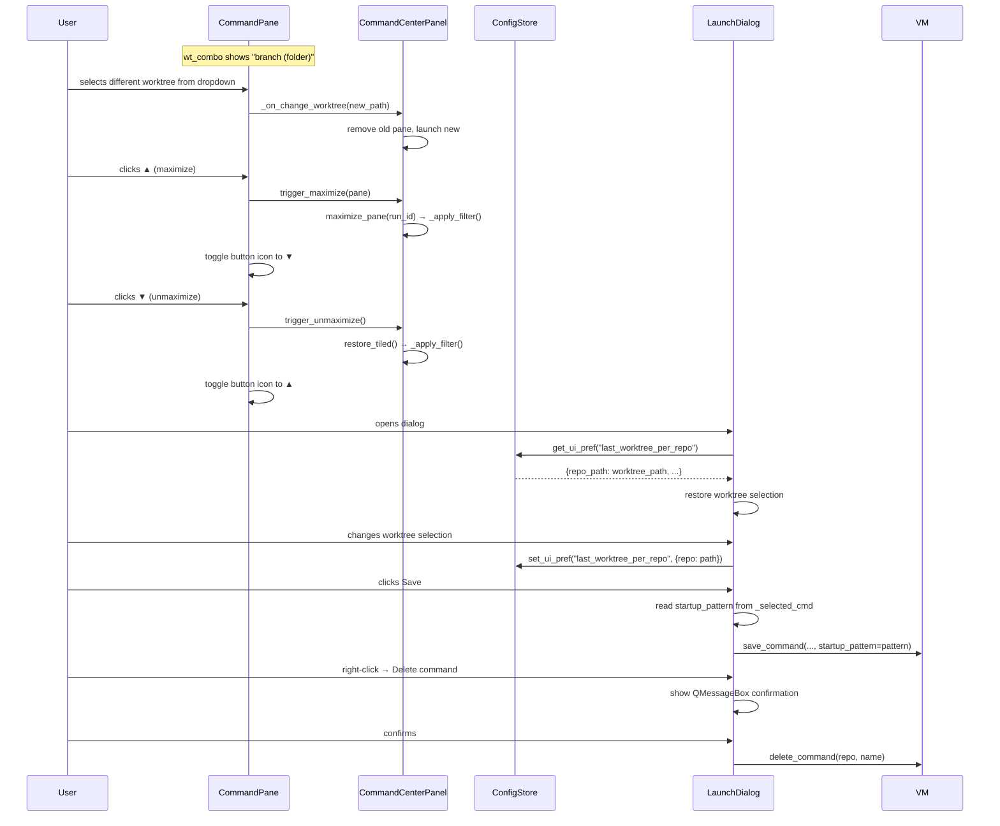

# Command Pane UX Overhaul

## Overview

A set of focused UX improvements to the command center and launch dialog:
1. ~~**Branch dropdown in command pane**~~ — removed (YAGNI).
2. **Maximize-in-place** — replace the "pop out to new window" button with a maximize button that expands a single pane to fill the entire command center area; an unmaximize button restores the tiled view.
3. **Persist worktree selection per repo** — the launch dialog remembers which worktree was last selected for each repo and restores it on next open.
4. **Bug fix: save blanks startup pattern** — clicking "Save" in the launch dialog currently drops the startup pattern; the fix passes the saved command's pattern through.
5. **Delete confirmations everywhere** — all destructive delete actions (saved commands, worktrees, runs) must show a confirmation prompt before proceeding.

---

## UI / Flow

### Command Pane Header — Branch + Worktree Dropdowns

Two dropdowns sit side by side in the header:

```
┌──────────────────────────────────────────────────────────────────────┐
│ ● my-server · my-repo : [feature-login ▼] [feature/login ▼]  ⟳  ■  Copy Find ×  ▲ │
└──────────────────────────────────────────────────────────────────────┘
                              ↑ worktree       ↑ branch
```

- **Worktree dropdown** (`_wt_combo`) — unchanged; shows folder name; switching restarts the command in the chosen worktree.
- **Branch dropdown** (`_branch_combo`) — new; shows branch names for every worktree in the repo. Selecting a branch switches to the worktree whose branch matches (i.e. restarts the command in that worktree). Both dropdowns always stay in sync: when one changes, the other updates to reflect the new worktree.

Each worktree maps 1-to-1 with a branch, so both dropdowns index into the same `self._worktrees` list — selecting index `i` in either combo selects the same worktree.

---

### Command Pane Header — Maximize Button

The existing `SP_TitleBarMaxButton` icon triggers a popout window. This button is **replaced** by a maximize-in-place button (▲ / ▼ icon). No more separate window is created.

```
Tiled view (2 panes visible):
┌──────────────────────────────────────────────────────────────────┐
│ Command Center                                🔔  + Launch  ×    │
│ Filter…                                                          │
├──────────────────────────────────────────────────────────────────┤
│ ● server · repo : [main ▼] [main ▼]  ⟳  ■  Copy Find ×  ▲      │
│ [output…]                                                        │
├──────────────────────────────────────────────────────────────────┤
│ ● worker · repo : [main ▼] [main ▼]  ⟳  ■  Copy Find ×  ▲      │
│ [output…]                                                        │
└──────────────────────────────────────────────────────────────────┘

Maximized view (one pane fills entire scroll area):
┌──────────────────────────────────────────────────────────────────┐
│ Command Center                                🔔  + Launch  ×    │
│ Filter…                                                          │
├──────────────────────────────────────────────────────────────────┤
│ ● server · repo : [main ▼] [main ▼]  ⟳  ■  Copy Find ×  ▼      │
│                                                                  │
│  [full-height output area]                                       │
│                                                                  │
└──────────────────────────────────────────────────────────────────┘
```

- ▲ = "Maximize" — hides all other panes, this pane expands to fill scroll area.
- ▼ = "Unmaximize" — restores tiled layout. The button label/icon toggles.
- Only one pane can be maximized at a time.
- The existing `maximize_pane` / `restore_tiled` methods on `CommandCenterPanel` already implement the hide/show logic; we just need to wire them to this in-place button and remove the popout path.

---

### Launch Dialog — Persistent Worktree Selection

```
Launch Command
──────────────────────────────────────────
Repo:     [ my-repo            ▼ ]
Worktree: [ feature/login  (feature-login) ▼ ]   ← restored from last session
```

On switching repos, the worktree combo is populated and the **last selected worktree path for that repo** is restored if still present. The selection is saved to `config.json` under `ui.last_worktree_per_repo` (a dict keyed by repo path).

---

### Bug Fix: Save Blanks Startup Pattern

In `launch_dialog.py`, `_trigger_save()` currently calls:

```python
self._vm.save_command(repo_path, name, cmd_text)  # drops startup_pattern!
```

It must also pass through the startup pattern from `self._selected_cmd` when a saved command is selected:

```python
pattern = getattr(self._selected_cmd, "startup_pattern", None) if self._selected_cmd else None
self._vm.save_command(repo_path, name, cmd_text, startup_pattern=pattern)
```

---

### Delete Confirmations — All Destructive Actions

Every "Delete" action will show a small inline confirmation before proceeding. The pattern is a **two-step button**: first click turns the button into a "Really delete?" confirmation prompt; clicking anywhere else or pressing Escape cancels.

Alternatively, a small modal `QMessageBox` with "Delete" / "Cancel" is acceptable and simpler.

Locations that need confirmation:
1. **Launch dialog** — "Delete" in the context menu for a saved command (`_delete_cmd`)
2. **Manage Commands dialog** — "Delete" button per command row (`_delete`)
3. **Command pane** — "×" Remove button on a running command pane (`trigger_remove` → `remove_pane`)

The existing worktree delete already has a full `DeleteDialog` confirmation; that path is unchanged.

---

## Architecture



### Components Changed

| File | Change |
|---|---|
| `ui/command_pane.py` | Add `_branch_combo` alongside existing `_wt_combo`; keep both in sync; replace popout btn with toggle maximize/unmaximize btn; add `on_unmaximize` callback |
| `ui/command_center_panel.py` | Wire new maximize toggle; remove popout logic |
| `ui/launch_dialog.py` | Fix `_trigger_save` startup_pattern bug; persist/restore worktree selection; add delete confirmation |
| `ui/manage_commands_dialog.py` | Add delete confirmation |
| `config_store.py` | No changes needed — `get_ui_pref` / `set_ui_pref` already handle arbitrary dicts |

---

## Open Questions

None.

---

## Iteration Plan

### Iteration 0 — Walking Skeleton
**Delivers:** Branch is shown in the command pane dropdown and the maximize button replaces the popout button (wiring only — no persistence, no confirmations yet).
**Scope:**
- Add `_branch_combo` to `CommandPane` header, sitting immediately after the existing `_wt_combo`
- `_branch_combo` is populated from the same `_worktrees` list, showing branch names; selecting one calls the same `_on_change_worktree` path
- Both combos stay in sync: changing one updates the other without triggering a second restart
- Replace the popout button in `CommandPane` with a maximize/unmaximize toggle button
- Wire the toggle to the existing `maximize_pane` / `restore_tiled` on `CommandCenterPanel`
- The `show_popout_btn` parameter and `CommandPopout` class are left in place (unused)
**Explicitly out of scope:** Persisting worktree selection, delete confirmations, save bug fix.

### Iteration 1 — Save Bug Fix + Worktree Persistence
**Delivers:** Saving a command in the launch dialog no longer blanks the startup pattern, and the last-selected worktree is remembered per repo.
**Scope:**
- Fix `_trigger_save` to pass `startup_pattern` through
- On worktree combo change in launch dialog, persist selection to `config.json` via `set_ui_pref("last_worktree_per_repo", ...)`
- On dialog open / repo change, restore saved worktree selection from `get_ui_pref`
**Builds on:** Iteration 0.

---

---

## ✋ Manual Testing Gate — Iteration 2

> STOP. Do not proceed until every item below is checked off by the user.

- [ ] Right-click a saved command in the launch dialog → "Delete" → confirm a dialog appears asking to confirm deletion
- [ ] Click **Cancel** on that dialog — confirm the command is NOT deleted
- [ ] Click **Delete** on that dialog — confirm the command is removed from the list
- [ ] Click "×" Remove on a running command pane — confirm a dialog appears asking to confirm removal
- [ ] Click **Cancel** on that dialog — confirm the pane remains
- [ ] Click **Remove** on that dialog — confirm the pane is removed
- [ ] Regression: worktree deletion (from the main window) still shows its existing confirmation dialog unchanged
- [ ] Regression: startup pattern save fix still works (Iteration 1 behaviour)
- [ ] Regression: worktree selection persistence still works (Iteration 1 behaviour)

**How to confirm:** Run the app, perform each action above, and check off each item manually.
Reply "Iteration 2 confirmed" (or describe any failures) before I declare the feature complete.

## ✋ Manual Testing Gate — Iteration 1

> STOP. Do not proceed to Iteration 2 until every item below is checked off by the user.

- [ ] Open the launch dialog, pick a saved command that has a startup pattern, click **Save** — reopen the command's edit dialog and confirm the startup pattern is still present (not blank)
- [ ] Open the launch dialog for a repo, note which worktree is selected, close the dialog, reopen it — confirm the same worktree is pre-selected
- [ ] Switch to a different repo in the launch dialog, select a worktree, close and reopen — confirm each repo independently restores its last-selected worktree
- [ ] With a locked worktree (dialog opened from a context that pins the worktree) — confirm the locked path is still used and persistence does not override it
- [ ] Regression: launching a saved command still works end-to-end (startup pattern fires, output appears)
- [ ] Regression: maximize/unmaximize still works correctly

**How to confirm:** Run the app, perform each action above, and check off each item manually.
Reply "Iteration 1 confirmed" (or describe any failures) before I write the plan for Iteration 2.

### Iteration 2 — Delete Confirmations
**Delivers:** All delete actions show a confirmation prompt before removing anything.
**Scope:**
- Launch dialog context menu "Delete" → `QMessageBox` confirmation
- Command pane "×" Remove button → `QMessageBox` confirmation
- `ManageCommandsDialog` deleted (dead code — inaccessible)
**Builds on:** Iteration 1.

---

## ✋ Manual Testing Gate — Iteration 0

> STOP. Do not proceed to Iteration 1 until every item below is checked off by the user.

- [ ] Launch the app, open the Command Center, and start any command — confirm the pane header shows **two** dropdowns side by side (worktree folder name, then branch name)
- [ ] Confirm the branch dropdown shows the correct branch for the running command's worktree
- [ ] If the repo has multiple worktrees: select a different entry in the **worktree** dropdown — confirm the command restarts in the new worktree and both dropdowns update to reflect it
- [ ] If the repo has multiple worktrees: select a different entry in the **branch** dropdown — confirm the command restarts in the matching worktree and both dropdowns update to reflect it
- [ ] Confirm there is **no** popout/window button in the pane header; the only expand-related button is the maximize toggle (▲)
- [ ] Click ▲ on a pane — confirm that pane expands to fill the full command center scroll area and all other panes disappear; the button changes to ▼
- [ ] Click ▼ — confirm all panes are restored to the tiled layout and the button reverts to ▲
- [ ] With two panes running: maximize one, then start a search in the filter bar — confirm the maximized pane remains the only one visible
- [ ] Regression: start/stop/restart a command — confirm status dot, output, and stdin bar all still behave correctly

**How to confirm:** Run the app, perform each action above, and check off each item manually.
Reply "Iteration 0 confirmed" (or describe any failures) before I write the plan for Iteration 1.
