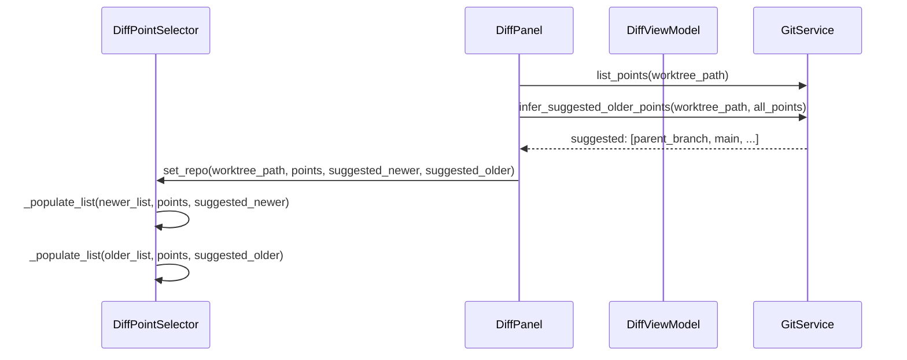
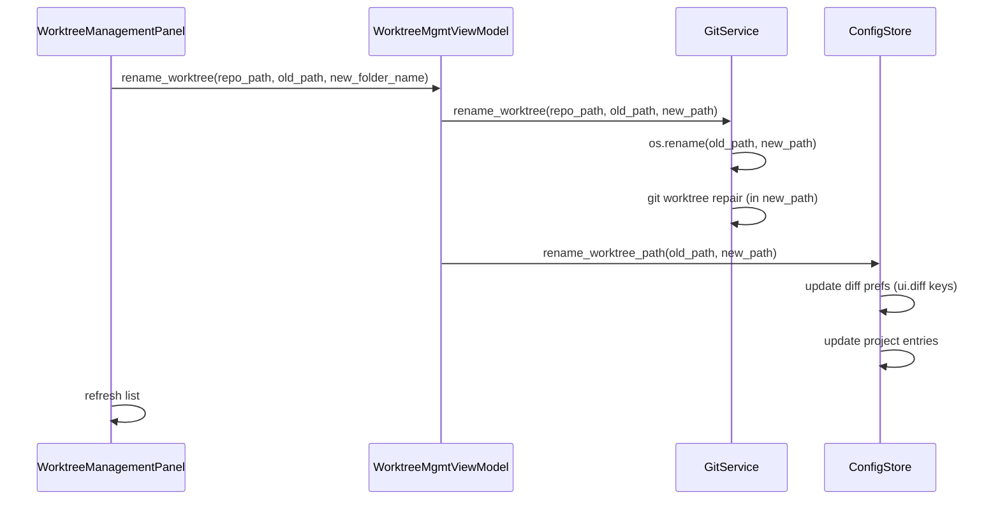
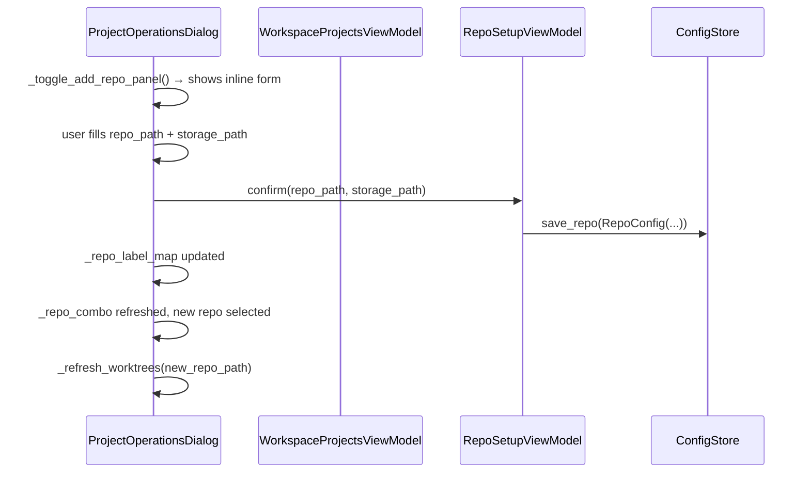

# Diff Smart Suggestions, Worktree Rename, and Self-Contained Project Dialog

## Overview

Three connected UX improvements:

1. **Diff smart branch suggestions** — When the user selects a worktree in the diff view, the app infers which branches are the most likely comparison targets (parent branch, main, recently-visited prefs) and surfaces them as a suggested section at the top of both point lists. The terminology also shifts: "FROM" becomes "Older Point (base)" and "TO" becomes "Newer Point (HEAD / working changes)" — making the directionality more intuitive. The layout also flips so the Newer Point (what you're looking at) is on top and the Older Point (what you're comparing against) is on the bottom, since users select the newer side first.

2. **Worktree rename** — Users can rename a worktree folder (and update its git registration) via an inline rename control in the worktree list. On rename, all stored references (project entries, diff prefs, config) that reference the old path are atomically updated in config.json.

3. **Self-contained project dialog with inline repo add** — The project operations dialog gains a "Add repo…" action so a user can register a brand-new repo without leaving the dialog. The new-repo flow lives inline using the same panel pattern already used for "Create new worktree".

---

## UI / Flow

### 1 — Diff Point Selector (redesigned)

**Current layout (before):**
```
┌─────────────────────────────────────────┐
│ FROM (base — restore destination)        │
│ [🔍 Search...]                           │
│ ┌─────────────────────────────────────┐ │
│ │ Working tree (unstaged)             │ │
│ │ Working tree (staged)               │ │
│ │ main          abc1234  "init"       │ │
│ │ feature/foo   def5678  "add foo"    │ │
│ └─────────────────────────────────────┘ │
│                                         │
│ TO (target — what to diff against)      │
│ [🔍 Search...]                           │
│ ┌─────────────────────────────────────┐ │
│ │ Working tree (unstaged)             │ │
│ │ ...                                 │ │
│ └─────────────────────────────────────┘ │
│                            [Compare →]  │
└─────────────────────────────────────────┘
```

**Redesigned layout (after) — Newer Point on top, Older Point on bottom:**
```
┌─────────────────────────────────────────┐
│ NEWER POINT  ─── what you have now ───  │
│ [🔍 Search...]                           │
│ ┌─────────────────────────────────────┐ │
│ │ ★ Suggested                         │ │ ← smart suggestions section
│ │   Working tree (unstaged)           │ │
│ │   feature/foo   def5678  "add foo"  │ │ ← current worktree branch first
│ │ ─────────────────────────────────── │ │
│ │ Working tree (staged)               │ │
│ │ main          abc1234  "init"       │ │
│ └─────────────────────────────────────┘ │
│                                         │
│ OLDER POINT  ─── compare against ───   │
│ [🔍 Search...]                           │
│ ┌─────────────────────────────────────┐ │
│ │ ★ Suggested                         │ │ ← smart suggestions section
│ │   main          abc1234  "init"     │ │ ← parent/main inferred
│ │   origin/main   abc1234             │ │
│ │ ─────────────────────────────────── │ │
│ │ Working tree (unstaged)             │ │
│ └─────────────────────────────────────┘ │
│ ⚠ "main" resolved to merge-base abc123 │ ← existing merge-base note
│                            [Compare →]  │
└─────────────────────────────────────────┘
```

**Suggestion logic for NEWER POINT:**
- The current worktree's branch (working tree unstaged/staged) goes first
- Then everything else as normal

**Suggestion logic for OLDER POINT:**
Up to three distinct suggestions are pinned at the top (any that are the same ref are deduplicated):
1. **Inferred parent branch** — the nearest branch in `git log --simplify-by-decoration` history that differs from the current branch (label: e.g. `main  [parent]`)
2. **Nearest feature/main branch** — the nearest branch in the same log walk that is `main` or starts with `feature/` (only shown if it differs from the parent branch above; label: e.g. `feature/base  [feature branch]`)
3. **Last-used** from `get_diff_pref` (only shown if it differs from the two above)
- Separator, then all other points in normal order

**Auto-selection when opening diff from the worktree area:**
When the diff view is opened with a specific worktree pre-selected (e.g. via "Diff" button in the worktree management panel), the app automatically:
1. Selects **Working tree (unstaged)** in the NEWER POINT list
2. Selects the **inferred parent branch** (suggestion #1) in the OLDER POINT list

This means the user can click "Diff" from any worktree and immediately hit "Compare →" without making any selections — the most useful comparison is already chosen.

**Summary bar (after compare is clicked):**
```
  OLDER: main abc1234  →  NEWER: Working tree (unstaged)   [← Change]
```

---

### 2 — Worktree Rename (in Worktree Management Panel)

**Current row:**
```
  feature/foo    [Open]  [Delete]
```

**After — inline rename:**
```
  feature/foo    [✏ Rename]  [Open]  [Delete]
```

**On clicking ✏ Rename:**
```
  ┌─────────────────────────────────────────────────┐
  │  Rename worktree                                │
  │  Current path: /path/to/worktrees/feature-foo   │
  │  New folder name: [feature-foo          ]       │
  │                                                 │
  │  ⚠ Git will re-register the worktree and all   │
  │    project entries pointing to the old path     │
  │    will be updated.                             │
  │                                                 │
  │  [Cancel]                        [Rename]       │
  └─────────────────────────────────────────────────┘
```

---

### 3 — Project Operations Dialog — Add Repo Inline

**Header area (new "Add repo…" button alongside repo picker):**
```
  Add worktrees:
  Repo:  [my-repo ▾]   [+ Add repo…]

  Worktrees:                     [+ Create new worktree ▾]
  ...
```

**On clicking "+ Add repo…" — inline panel slides in below the repo row:**
```
  Repo:  [my-repo ▾]   [+ Add repo…]     ← button greys out
  ┌────────────────────────────────────────────────────────┐
  │  Repo path:   [/Users/me/projects/new-repo  ] [Browse] │
  │  Worktree storage: [/Users/me/projects/new-repo-worktrees] [Browse] │
  │                                                        │
  │  [Cancel]                                   [Add Repo] │
  └────────────────────────────────────────────────────────┘
  Worktrees:                     [+ Create new worktree ▾]
  ...
```

After "Add Repo" is confirmed, the repo dropdown updates and selects the newly-added repo automatically.

---

## Architecture

### Data flow for smart suggestions



New method on [`GitService`](../worktree_manager/git_service.py):
- `infer_branch_suggestions(repo_path, current_branch) -> tuple[str | None, str | None]` — runs `git log --first-parent --simplify-by-decoration --format="%D"` and walks backwards from HEAD. `--first-parent` ensures only the mainline ancestry is followed, so merged-in branches (e.g. a hotfix merged into main before the current branch was created) are never mistakenly surfaced as the parent. Returns `(parent_branch, nearest_feature_or_main_branch)` where `parent_branch` is the first decorated branch that isn't the current branch, and `nearest_feature_or_main_branch` is the first branch in that same walk that is `main` or starts with `feature/` (may be the same as `parent_branch`, in which case the second value is `None` to signal deduplication). Falls back to `("main", None)` if nothing is found.

New helpers on [`DiffViewModel`](../worktree_manager/diff_vm.py):
- `suggested_newer_refs(worktree_path) -> list[str]` — returns the worktree branch + working tree refs
- `suggested_older_refs(worktree_path, all_points) -> list[str]` — calls `git_service.infer_branch_suggestions()` to get `(parent, feature_or_main)`, deduplicates against each other and the last-used pref, returns up to three refs in priority order
- `default_newer_ref(worktree_path) -> str` — returns `"working_tree_unstaged"` (the auto-selected NEWER point)
- `default_older_ref(worktree_path) -> str | None` — returns the inferred parent branch ref (first result of `infer_branch_suggestions`) if one can be determined, else `None`

[`DiffPanel`](../worktree_manager/ui/diff_panel.py) `_load_worktree()` calls `vm.default_newer_ref()` and `vm.default_older_ref()` and passes them to `point_selector.pre_select()` so the selections are applied immediately when a worktree is loaded — no user action required.

### Data flow for worktree rename



New method on [`GitService`](../worktree_manager/git_service.py):
- `rename_worktree(repo_path, old_path, new_path)` — renames the directory on disk, then runs `git worktree repair` so git re-registers the path.

New method on [`ConfigStore`](../worktree_manager/config_store.py):
- `rename_worktree_path(old_path: str, new_path: str)` — atomically updates `ui.diff` (keyed by repo_path, but values contain `from_ref`/`to_ref` which reference working tree paths), and all `projects[*].entries[*].worktree_path` that match `old_path`.

New method on [`WorktreeMgmtViewModel`](../worktree_manager/worktree_mgmt_vm.py):
- `rename_worktree(repo_path, old_path, new_folder_name) -> str` — orchestrates the above, returns new_path.

### Data flow for inline repo add



[`ProjectOperationsDialog`](../worktree_manager/ui/project_operations_dialog.py) gains:
- `_add_repo_panel` widget (inline, hidden by default)
- `_toggle_add_repo_panel()` — shows/hides the panel
- `_submit_add_repo()` — validates path, calls `RepoSetupViewModel.confirm()`, refreshes the repo combo

---

## Open Questions

*(none — all resolved by design above)*

---

## Iteration Plan

### Iteration 0 — Walking Skeleton: Renamed Labels + Layout Flip
**Delivers:** The diff point selector shows "NEWER POINT" on top and "OLDER POINT" on the bottom with updated label copy, and the summary bar uses the new terminology — no suggestions yet, no auto-selection.
**Scope:**
- Rename `FROM (base — restore destination)` → `NEWER POINT  ─── what you have now ───` in [`ui/diff_point_selector.py`](../worktree_manager/ui/diff_point_selector.py)
- Rename `TO (target — what to diff against)` → `OLDER POINT  ─── compare against ───` in [`ui/diff_point_selector.py`](../worktree_manager/ui/diff_point_selector.py)
- Swap the layout so NEWER POINT list is rendered first (top), OLDER POINT list second (bottom) in [`ui/diff_point_selector.py`](../worktree_manager/ui/diff_point_selector.py)
- Update the summary bar text in [`ui/diff_panel.py`](../worktree_manager/ui/diff_panel.py) from `FROM: {base_ref}  →  TO: {target_ref}` to `OLDER: {base_ref}  →  NEWER: {target_ref}`
- Update the merge-base note to reference the new "OLDER POINT" label in [`ui/diff_point_selector.py`](../worktree_manager/ui/diff_point_selector.py)
- The internal variable names `base_ref` / `target_ref` and the `from_ref` / `to_ref` keys in config/diff prefs are **not** renamed — only the display labels change
**Explicitly out of scope:** Smart suggestions, auto-selection, worktree rename, inline repo add.

### Iteration 1 — Smart Suggestions + Auto-Selection
**Delivers:** The OLDER POINT list shows a pinned "★ Suggested" section with inferred parent branch and nearest feature/main branch; opening a worktree pre-selects Working tree (unstaged) + the inferred parent automatically.
**Scope:**
- Add `infer_branch_suggestions(repo_path, current_branch) -> tuple[str | None, str | None]` to [`git_service.py`](../worktree_manager/git_service.py)
- Add `suggested_newer_refs()`, `suggested_older_refs()`, `default_newer_ref()`, `default_older_ref()` helpers to [`diff_vm.py`](../worktree_manager/diff_vm.py)
- Update `DiffPointSelector.set_repo()` to accept `suggested_newer` and `suggested_older` ref lists and render a visually-separated "★ Suggested" section at the top of each list in [`ui/diff_point_selector.py`](../worktree_manager/ui/diff_point_selector.py)
- Update [`ui/diff_panel.py`](../worktree_manager/ui/diff_panel.py) `_load_worktree()` to call VM helpers and pass suggestions + defaults to the selector
- Last-used pref from `get_diff_pref` included in OLDER suggestions if different from the inferred branches
**Builds on:** Iteration 0.

### Iteration 2 — Worktree Rename
**Delivers:** Each worktree row in the worktree management panel has a "✏ Rename" button that opens an inline panel; on confirm the folder is renamed on disk, git re-registers it, and all config references are updated atomically.
**Scope:**
- Add `rename_worktree(repo_path, old_path, new_path)` to [`git_service.py`](../worktree_manager/git_service.py)
- Add `rename_worktree_path(old_path, new_path)` to [`config_store.py`](../worktree_manager/config_store.py) — updates all project entries and diff prefs
- Add `rename_worktree(repo_path, old_path, new_folder_name) -> str` to [`worktree_mgmt_vm.py`](../worktree_manager/worktree_mgmt_vm.py)
- Add "✏ Rename" button + inline rename panel to each worktree row in [`ui/worktree_management_panel.py`](../worktree_manager/ui/worktree_management_panel.py)
**Explicitly out of scope:** Renaming the git branch itself (folder rename only).
**Builds on:** Iteration 0.

### Iteration 3 — Inline Repo Add in Project Operations Dialog
**Delivers:** The project operations dialog has an "[+ Add repo…]" button next to the repo dropdown; clicking it reveals an inline form to register a new repo without leaving the dialog; on success the dropdown updates and selects the new repo.
**Scope:**
- Add `_add_repo_panel` inline widget, `_toggle_add_repo_panel()`, and `_submit_add_repo()` to [`ui/project_operations_dialog.py`](../worktree_manager/ui/project_operations_dialog.py)
- `_submit_add_repo()` instantiates `RepoSetupViewModel` and calls `confirm()` directly — no separate dialog opened
- After success: rebuild `_repo_label_map`, repopulate `_repo_combo`, select the new repo, call `_refresh_worktrees()`
- The dialog's constructor must accept a reference to `git_service` so `RepoSetupViewModel` can be instantiated inline
**Builds on:** Iteration 0.
