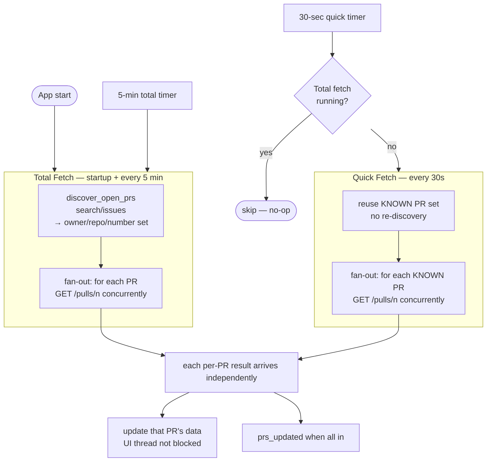
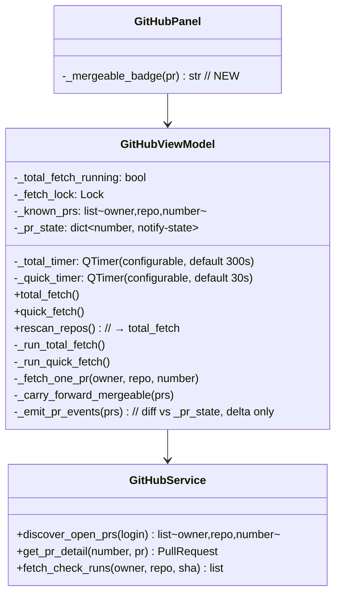

# GitHub Refresh Rework

## Overview

The GitHub panel's refresh logic in [github_vm.py](worktree_manager/github_vm.py) has grown into a tangle: a single `QTimer` fires `_on_poll` on one fixed interval, and that one poll does *everything* — discover repos, list PRs, fetch CI checks, fetch mergeable per-PR, and (separately) re-fetch the selected PR's detail with a 2-second `singleShot` retry for `mergeable`. The `mergeable` write-back logic (`prev_mergeable`, `_refetch_mergeable`, `_write_mergeable_to_prs`) is scattered to paper over GitHub's `mergeable` computation, and the cheap PR-list endpoint doesn't even return `mergeable`, so the value is unreliable and flickers.

This rework does three things:

1. **Removes the `GET /repos/{owner}/{repo}/pulls` list endpoint entirely.** PRs are discovered via `search/issues` (which yields each PR's number *and* repo *and* direct API URL) and then fetched **one PR at a time** via `GET /repos/{owner}/{repo}/pulls/{number}`, which is the only endpoint that returns a reliable `mergeable`. No more list-then-enrich two-step.
2. **Splits refresh into two cadences** — a **total fetch** (startup + every 5 min: re-discover repos/PR set, then fetch each PR) and a **quick fetch** (every 30s: re-fetch each *already-known* PR, skip re-discovery). A quick fetch is skipped entirely if a total fetch is running.
3. **Surfaces mergeability in the PR list UX** with explicit 🟢 / 🔴 / ⚪ badges, where ⚪ "Checking…" is shown while a PR's `mergeable` is still being fetched.

The per-PR fetches run **concurrently and out-of-band** — they do not block the UI thread, and each PR's row updates as its detail arrives. There is **no `singleShot` delayed retry**; the per-PR detail call is simply part of the fetch.

### Verified GitHub API behaviour (run against a live PR during design)

Confirmed with `gh api` against `ahmedhhw/Orchestrator#2`:

| Endpoint | Returns `mergeable`? | Role in new design |
|---|---|---|
| `GET /search/issues?q=is:pr is:open author:{login}` | ❌ No | **Discovery.** Each item gives `number`, `repository_url`, `html_url`, and the direct `pull_request.url` (`…/repos/{o}/{r}/pulls/{n}`). This is the full PR set in one call. |
| `GET /repos/{owner}/{repo}/pulls?state=open` (list) | ❌ `mergeable` key absent | **DROPPED.** No longer used anywhere in the fetch path. |
| `GET /repos/{owner}/{repo}/pulls/{number}` (single) | ✅ Yes | **The source of truth** for every PR. Returns branches, head SHA, draft, and `mergeable`. |

**On `mergeable: null`:** the per-PR endpoint can return `mergeable: null` / `mergeable_state: "unknown"` while GitHub recomputes after a change (observed: `null` then `false` ~2s later). The new design does **not** add a delayed retry for this. Instead the row shows ⚪ "Checking mergeability…" whenever `mergeable is None`, and the value naturally refines on the next fetch cycle (the next quick fetch 30s later, or total fetch). The last-known non-null value is carried forward so a transient `null` doesn't flicker the badge back to "Checking…".

---

## UI / Flow

### PR list — mergeability made explicit

Each PR row gains an explicit mergeability indicator next to the existing CI badge. Three states: mergeable, not mergeable (conflicts), and unknown (still computing / not yet fetched).

```
┌─ My Pull Requests ──────────────────────────────────  [🔔]  [↻ 30s] ─┐
│                                                                       │
│  #2  Add retry to worker pool        ✅ ready to merge      [↗ View]  │
│      feature/retry → main            🟢 Mergeable                     │
│  ─────────────────────────────────────────────────────────────────  │
│  #7  Refactor config loader          ✅ checks passed       [↗ View]  │
│      refactor/config → main          🔴 Conflicts                     │
│  ─────────────────────────────────────────────────────────────────  │
│  #9  WIP new dashboard               ⏳ checks running      [↗ View]  │
│      feat/dashboard → develop        ⚪ Checking mergeability…        │
│                                                                       │
├───────────────────────────────────────────────────────────────────  │
│  Tracking: ahmedhhw/Orchestrator  myorg/api          [↺ Rescan]       │
└───────────────────────────────────────────────────────────────────  │
```

Badge is driven by `mergeable_state` (newly captured — see below), not the overloaded `mergeable` bool:

- 🟢 **Mergeable** — `mergeable_state` in {`clean`, `has_hooks`, `unstable`} (mergeable; `unstable` = mergeable but a non-required check is failing)
- 🔴 **Conflicts** — `mergeable_state == "dirty"`
- 🟠 **Behind base** — `mergeable_state == "behind"` (base moved; needs update)
- 🔒 **Blocked** — `mergeable_state == "blocked"` (branch protection: required checks/reviews)
- ⚪ **Checking mergeability…** — `mergeable is None` / `mergeable_state` in {`unknown`, `""`} (not yet fetched, or GitHub still computing)

> **Why `mergeable_state`, not just `mergeable`:** GitHub returns `mergeable: false` for *every* non-mergeable reason — conflicts, behind-base, and branch-protection-blocked all look identical through the bool. `mergeable_state` is the only field that distinguishes them. Verified on [PR #2](https://github.com/ahmedhhw/Orchestrator/pull/2): `{mergeable: false, mergeable_state: "dirty"}`. We already fetch the per-PR endpoint for every PR, so this field is free.

### Fetch-status footer — distinguishes the two fetch types

**Total fetch in progress (startup / every 5 min):**
```
│  Scanning repos & fetching all PRs…  ahmedhhw/Orchestrator ✅  myorg/api ⏳   │
```

**Quick fetch in progress (every 30s):**
```
│  Refreshing PRs…                                                              │
```

**Idle:**
```
│  Tracking: ahmedhhw/Orchestrator  myorg/api                    [↺ Rescan]     │
```

### PR detail view — mergeability shown explicitly

The detail view ([github_panel.py:520](worktree_manager/ui/github_panel.py#L520) area) gains a mergeability line using the same badge vocabulary, so a conflicted PR explains *why* there's no merge button:

```
┌─ #2  Add retry to worker pool ──────────────────────────────────────┐
│  feature/retry → main                                                │
│                                                                      │
│  Mergeability:  🔴 Conflicts — resolve conflicts with main first     │
│  Checks:        ✅ all checks passed                                 │
│                                                                      │
│  (no merge button — PR is not mergeable)                             │
│  ...                                                                 │
```

When `mergeable_state == "clean"`/`unstable` the line reads 🟢 Mergeable and the existing merge button shows as today. Merge-attempt error handling itself is unchanged (raw GitHub message on failure) — only the mergeability *state* is newly surfaced.

_(The app's global refresh button is intentionally **not** wired to the GitHub panel — the dedicated **↺ Rescan** button already covers a full re-discovery.)_

---

## Architecture

### Two-tier fetch model

Both fetches end in the same per-PR step (`GET .../pulls/{n}`). The **only** difference is whether the PR set is re-discovered first.



### Per-PR fetch is the single source of truth

`search/issues` is used **only** to learn *which* PRs exist (number + owner/repo, available directly in each search item's `pull_request.url`). The actual PR data — title, branches, head SHA, draft, and **`mergeable`** — comes exclusively from `GET /repos/{o}/{r}/pulls/{n}`. CI checks (`fetch_check_runs`) attach to that same per-PR result. This collapses the old "list, then separately enrich mergeable + checks" two-step into one coherent per-PR fetch and removes `list_prs_for_repo` from the fetch path entirely.

Because each per-PR call is independent, they fan out across a thread pool and complete **out of order** — a slow PR doesn't hold up the others, and the UI thread never blocks.

### Quick vs total — the only difference is discovery

- **Total fetch** re-runs `discover_open_prs` (the `search/issues` sweep) to pick up newly-opened or newly-closed PRs, then fetches each.
- **Quick fetch** reuses the PR set from the last total fetch and just re-fetches each known PR (refreshing `mergeable`, CI status, comments).

A PR closed between total fetches will 404 on its per-PR call during a quick fetch — that PR is dropped from the list (handled gracefully, no error surfaced); the next total fetch reconciles the set.

### `mergeable` handling (no delayed retry)

- `GET /pulls/{n}` returns `mergeable` directly. If it's `null` (GitHub still computing), the row shows ⚪ **Checking mergeability…**.
- The **last-known non-null** value is carried forward across fetches so a transient `null` never flickers a 🟢/🔴 badge back to "Checking…".
- It refines on the next cadence (quick fetch 30s later). **No `singleShot` 2s retry** — the old `_refetch_mergeable` / `prev_mergeable` scaffolding is removed.

### Notifications — diff against persisted state, never re-notify

Because every fetch now pulls **full per-PR detail (comments, reviews, checks, mergeable)** on the 30s cadence, the notification logic must only fire on a genuine *transition*, or the user gets spammed every cycle. The fix is to persist a compact "last-notified state" per PR and compare each fetch's result against it — emitting only the delta.

Per-PR persisted state (held in the VM, survives across fetches):

```
_pr_state[pr_number] = {
    "ci": "passed" | "failed" | "running" | "unknown",
    "mergeable_state": "clean" | "dirty" | "behind" | "blocked" | "unknown" | ...,
    "notified_comment_ids": set[int],
    "notified_review_keys": set[(author, state)],
}
```

Rules:
- **CI / mergeability:** emit only when the *category* changes from the persisted value (e.g. `running → failed`), then write the new value back. A repeated `failed → failed` across cycles emits nothing.
- **Comments:** emit only for comment IDs **not in** `notified_comment_ids`; add them on emit. A comment seen on cycle 1 is never re-notified on cycle 2.
- **Reviews:** same, keyed on `(author, state)` in `notified_review_keys`.
- **First time a PR is seen** (`pr_number not in _pr_state`): record its current state as the baseline and emit **nothing** — appearing in the list is not an event. (This matches the existing `prev is None → continue` guard at [github_vm.py:83](worktree_manager/github_vm.py#L83), now made robust against the new always-populated comments/reviews.)

This replaces the current `_pr_snapshots` approach, which stored whole `PullRequest` objects that were also mutated in place elsewhere (`_write_mergeable_to_prs`, `select_pr` reseeding `selected_pr` from `get_pr_detail`) — making `prev` and `curr` occasionally the same object and the diff unreliable. The new `_pr_state` holds only immutable scalars/ID-sets, so the comparison can't be corrupted by later mutation.

### Concurrency guard

A boolean flag `_total_fetch_running` (guarded by a `threading.Lock`) gates the cadences:
- Total fetch sets the flag for its duration, clears it on completion.
- Quick fetch checks the flag at entry; if a total fetch is running, it returns immediately (no-op), satisfying *"if total fetch is running this one is skipped"*.

### Component view



The detail-view path ([github_vm.py:214](worktree_manager/github_vm.py#L214) `select_pr`) keeps using `get_pr_detail` for reviews/comments, but the ad-hoc list-side `mergeable` write-back (`_refetch_mergeable`, `prev_mergeable`, the 2s `singleShot`) is deleted — the list now gets `mergeable` straight from each per-PR fetch.

### Capturing `mergeable_state`

[github_models.py](worktree_manager/github_models.py) `PullRequest` gains one field: `mergeable_state: str = ""`. It's populated from the per-PR endpoint's `mergeable_state`. A new helper `mergeability() -> str` returns a category (`"mergeable" | "conflicts" | "behind" | "blocked" | "checking"`) that both the list badge and the detail view consume.

> **`is_ready_to_merge()` is NOT touched.** Per the explicit in-code instruction at [github_models.py:64](worktree_manager/github_models.py#L64), it must continue to depend solely on `mergeable`. The merge button keeps gating on `is_ready_to_merge()`; `mergeable_state` only drives the *informational* badge/detail text.

### Files involved

- [github_models.py](worktree_manager/github_models.py) — add `mergeable_state: str = ""` field and a `mergeability()` category helper. **Do not modify `is_ready_to_merge()`.**
- [github_vm.py](worktree_manager/github_vm.py) — replace single `_on_poll`/`_do_refresh_prs` with `total_fetch`/`quick_fetch`; two `QTimer`s; `_total_fetch_running` flag + lock; per-PR fan-out; delete `_refetch_mergeable` and the `singleShot` retry. Replace `_pr_snapshots` (whole mutated objects) with `_pr_state` (immutable scalars + ID-sets) and rewrite `_emit_pr_events` ([github_vm.py:80](worktree_manager/github_vm.py#L80)) to diff against it and emit only deltas — fixes the every-30s notification spam.
- [github_service.py](worktree_manager/github_service.py) — add `discover_open_prs(login) -> list[(owner, repo, number)]` (search/issues → numbers); populate `mergeable_state` from the per-PR response in `get_pr_detail`/`_pr_from_dict`. `list_prs_for_repo` removed from the fetch path (kept only if other call sites need it — verified in Iteration plan). Reuse existing `fetch_check_runs`.
- [github_panel.py](worktree_manager/ui/github_panel.py) — add `_mergeable_badge(pr)`; render the mergeability line in the list (`_on_prs_updated` [github_panel.py:402](worktree_manager/ui/github_panel.py#L402)) and in the detail view ([github_panel.py:520](worktree_manager/ui/github_panel.py#L520)).
- [config_store.py:181](worktree_manager/config_store.py#L181) — add `get_github_total_fetch_interval` / `save_…` (default 300) alongside existing `get_github_poll_interval` (default 30).

---

## Resolved Decisions

1. **Total-fetch interval — configurable.** Stored as a UI pref `github_total_fetch_interval_seconds` (default 300) alongside the existing `github_poll_interval_seconds` (default 30) in [config_store.py:181](worktree_manager/config_store.py#L181).

2. **Drop the list endpoint; per-PR is the source of truth.** `GET /repos/{o}/{r}/pulls` is removed from the fetch path. PRs are discovered via `search/issues` (numbers only) and each is fetched individually via `GET /pulls/{n}`, giving a reliable `mergeable`. These per-PR calls are part of **both** total and quick fetches, run concurrently/out-of-order, and never block the UI. While `mergeable is None` the row shows ⚪ "Checking mergeability…"; the **last-known non-null value is carried forward** to avoid badge flicker. **No delayed `singleShot` retry** — `mergeable` refines naturally on the next fetch cycle.

3. **Global refresh button — out of scope.** Not wiring the GitHub panel to the app's global refresh button; the dedicated **↺ Rescan** button already triggers a full re-discovery.

4. **Conflict / non-mergeable reasons surfaced via `mergeable_state`.** Capture `mergeable_state` on the model and render granular badges (🟢 Mergeable / 🔴 Conflicts / 🟠 Behind base / 🔒 Blocked / ⚪ Checking) in **both** the PR list and the detail view. `is_ready_to_merge()` is left untouched per its in-code instruction; merge-attempt error handling is unchanged.

5. **Notifications fire on transitions only — no per-cycle spam.** Persist a compact per-PR notify-state (`_pr_state`: last CI category, last `mergeable_state`, set of already-notified comment IDs and review keys) and emit a notification only when the new fetch differs from the persisted value. First sighting of a PR seeds the baseline silently. This is required because the new design fetches full per-PR detail (comments/reviews) every 30s, which would otherwise re-notify every cycle.

_No open questions remain._

---

## Iteration Plan

### Iteration 0 — Full GitHub refresh rework (single iteration)

**Delivers:** A working GitHub panel where PRs are discovered via `search/issues` and fetched one-at-a-time via `GET /pulls/{n}`; a total fetch (startup + every 5 min) re-discovers and a quick fetch (every 30s) re-fetches the known set, skipping while a total runs; each PR row and the detail view show a granular mergeability badge (🟢/🔴/🟠/🔒/⚪); and notifications fire only on genuine transitions (no per-cycle spam).

**Scope:**
- **Service:** add `discover_open_prs(login) -> list[tuple[str, str, int]]` to [github_service.py](worktree_manager/github_service.py) (`search/issues` → `(owner, repo, number)`); populate `mergeable_state` from the per-PR response in `_pr_from_dict` / `get_pr_detail` ([github_service.py:138](worktree_manager/github_service.py#L138)). Drop `list_prs_for_repo` from the fetch path.
- **Model:** add `mergeable_state: str = ""` field + `mergeability()` category helper to [github_models.py](worktree_manager/github_models.py). **Do NOT change `is_ready_to_merge()`** ([github_models.py:64](worktree_manager/github_models.py#L64)).
- **Config:** add `get_github_total_fetch_interval` / `save_…` (default 300) to [config_store.py:181](worktree_manager/config_store.py#L181).
- **VM:** replace `_do_refresh_prs`/`_on_poll` ([github_vm.py:122](worktree_manager/github_vm.py#L122)) with `_run_total_fetch` (discover + per-PR fan-out) and `_run_quick_fetch` (reuse `_known_prs` + per-PR fan-out); two `QTimer`s; `_total_fetch_running` flag + `Lock`; per-PR fan-out via `ThreadPoolExecutor`; carry-forward of last-known `mergeable`/`mergeable_state`; graceful 404 drop for closed PRs; delete `_refetch_mergeable` + 2s `singleShot` ([github_vm.py:224-236](worktree_manager/github_vm.py#L224-L236)); replace `_pr_snapshots` with `_pr_state` and rewrite `_emit_pr_events` ([github_vm.py:80](worktree_manager/github_vm.py#L80)) to diff against it and emit deltas only.
- **Panel:** add `_mergeable_badge(pr)`; render the mergeability line in the list (`_on_prs_updated` [github_panel.py:402](worktree_manager/ui/github_panel.py#L402)) and the detail view ([github_panel.py:520](worktree_manager/ui/github_panel.py#L520)).

**Explicitly out of scope:** Wiring the app's global refresh button to the panel; changes to the merge-attempt flow / merge error handling; changes to `is_ready_to_merge()`.

---

## Iteration 0 — Walking Skeleton

### Phase 0.1 — Model: `mergeable_state` + `mergeability()`

**What it covers:** Capture GitHub's `mergeable_state` on the PR model and expose a category helper that the badges consume.

**Files touched:** [github_models.py](worktree_manager/github_models.py); [tests/test_github_models.py](tests/test_github_models.py)

**Tests (Red) — write these first:**
```python
# tests/test_github_models.py  (add to existing file)
from worktree_manager.github_models import PullRequest


def _pr(mergeable=None, mergeable_state=""):
    return PullRequest(
        number=1, title="t", body="", html_url="https://github.com/o/r/pull/1",
        head_branch="f", base_branch="main", state="open", draft=False,
        mergeable=mergeable, mergeable_state=mergeable_state,
    )


def test_mergeability_clean_is_mergeable():
    assert _pr(mergeable=True, mergeable_state="clean").mergeability() == "mergeable"


def test_mergeability_unstable_is_mergeable():
    assert _pr(mergeable=True, mergeable_state="unstable").mergeability() == "mergeable"


def test_mergeability_dirty_is_conflicts():
    assert _pr(mergeable=False, mergeable_state="dirty").mergeability() == "conflicts"


def test_mergeability_behind():
    assert _pr(mergeable=False, mergeable_state="behind").mergeability() == "behind"


def test_mergeability_blocked():
    assert _pr(mergeable=False, mergeable_state="blocked").mergeability() == "blocked"


def test_mergeability_unknown_when_none():
    assert _pr(mergeable=None, mergeable_state="unknown").mergeability() == "checking"
    assert _pr(mergeable=None, mergeable_state="").mergeability() == "checking"


def test_mergeable_state_defaults_to_empty_string():
    assert _pr().mergeable_state == ""


def test_is_ready_to_merge_unchanged_depends_only_on_mergeable():
    # Guard: is_ready_to_merge must still be exactly `mergeable`.
    assert _pr(mergeable=True, mergeable_state="dirty").is_ready_to_merge() is True
    assert _pr(mergeable=False, mergeable_state="clean").is_ready_to_merge() is False
```

**Production code (Green):**
```python
# worktree_manager/github_models.py — add field to PullRequest (after head_sha/owner/repo fields)
    mergeable_state: str = field(default="")

    # add method (do NOT touch is_ready_to_merge):
    def mergeability(self) -> str:
        """Return 'mergeable' | 'conflicts' | 'behind' | 'blocked' | 'checking'.

        GitHub overloads mergeable=false for every non-mergeable reason, so the
        category is driven by mergeable_state, not the bool.
        """
        if self.mergeable is None:
            return "checking"
        state = self.mergeable_state
        if state in ("clean", "has_hooks", "unstable", ""):
            return "mergeable" if self.mergeable else "checking"
        if state == "dirty":
            return "conflicts"
        if state == "behind":
            return "behind"
        if state == "blocked":
            return "blocked"
        if state in ("unknown",):
            return "checking"
        # Unrecognised state: fall back to the bool.
        return "mergeable" if self.mergeable else "conflicts"
```

**Done when:** All Phase 0.1 tests pass and the existing `test_github_models.py` / `test_github_models_ready_to_merge.py` suites still pass.

---

### Phase 0.2 — Service: `discover_open_prs` + populate `mergeable_state`

**What it covers:** A discovery call that returns `(owner, repo, number)` triples from `search/issues`, and `mergeable_state` flowing from the per-PR API response into the model.

**Files touched:** [github_service.py](worktree_manager/github_service.py); [tests/test_github_service.py](tests/test_github_service.py)

**Tests (Red) — write these first:**
```python
# tests/test_github_service.py  (add to existing file)

def test_discover_open_prs_returns_owner_repo_number(service):
    search_resp = MagicMock(status_code=200)
    search_resp.ok = True
    search_resp.json.return_value = {
        "items": [
            {"number": 2, "html_url": "https://github.com/ahmedhhw/Orchestrator/pull/2",
             "pull_request": {"url": "https://api.github.com/repos/ahmedhhw/Orchestrator/pulls/2"}},
            {"number": 9, "html_url": "https://github.com/myorg/api/pull/9",
             "pull_request": {"url": "https://api.github.com/repos/myorg/api/pulls/9"}},
        ]
    }
    with patch("requests.get", return_value=search_resp) as mock_get:
        result = service.discover_open_prs("ahmedhhw")
    assert ("ahmedhhw", "Orchestrator", 2) in result
    assert ("myorg", "api", 9) in result
    assert len(result) == 2
    call_args = mock_get.call_args
    assert call_args[0][0] == "https://api.github.com/search/issues"
    assert "is:pr is:open author:ahmedhhw" in call_args[1]["params"]["q"]


def test_discover_open_prs_raises_permission_error_on_401(service):
    resp = MagicMock(status_code=401)
    resp.raise_for_status.side_effect = Exception("401")
    with patch("requests.get", return_value=resp):
        with pytest.raises(PermissionError):
            service.discover_open_prs("ahmedhhw")


def test_pr_from_dict_captures_mergeable_state(service):
    data = {
        "number": 2, "title": "t", "body": "", "html_url": "https://github.com/o/r/pull/2",
        "head": {"ref": "f", "sha": "abc"}, "base": {"ref": "main"},
        "state": "open", "draft": False, "mergeable": False, "mergeable_state": "dirty",
    }
    pr = service._pr_from_dict(data)
    assert pr.mergeable is False
    assert pr.mergeable_state == "dirty"


def test_get_pr_detail_populates_mergeable_state(service):
    pr = _make_pr(2)
    pr.head_sha = "abc"  # take the fast path that reuses the passed-in pr
    pr_resp = MagicMock(status_code=200)
    pr_resp.json.return_value = {"mergeable": False, "mergeable_state": "dirty",
                                 "head": {"sha": "abc"}}
    other = MagicMock(status_code=200)
    other.json.return_value = []
    with patch("requests.get", side_effect=[pr_resp, other, other]):
        detail = service.get_pr_detail(2, pr=pr)
    assert detail.mergeable is False
    assert detail.mergeable_state == "dirty"
```

**Production code (Green):**
```python
# worktree_manager/github_service.py

# 1. discover_open_prs — add near discover_open_pr_repos:
def discover_open_prs(self, login: str) -> list[tuple[str, str, int]]:
    resp = requests.get(
        "https://api.github.com/search/issues",
        headers=self._headers,
        params={"q": f"is:pr is:open author:{login}", "per_page": 100},
    )
    if resp.status_code == 401:
        raise PermissionError("GitHub token is invalid or expired")
    resp.raise_for_status()
    out: list[tuple[str, str, int]] = []
    for item in resp.json().get("items", []):
        parts = urlparse(item["html_url"]).path.strip("/").split("/")
        if len(parts) >= 4:  # owner / repo / "pull" / number
            out.append((parts[0], parts[1], int(item["number"])))
    return out

# 2. _pr_from_dict — add mergeable_state (after the mergeable= line):
        mergeable=data.get("mergeable"),
        mergeable_state=data.get("mergeable_state", "") or "",
        head_sha=data["head"].get("sha", ""),

# 3. get_pr_detail fast path — set mergeable_state when reusing the passed-in pr:
        if pr.head_sha:
            detail = pr
            detail.mergeable = pr_data.get("mergeable")
            detail.mergeable_state = pr_data.get("mergeable_state", "") or ""
```

**Done when:** All Phase 0.2 tests pass; existing `test_github_service*.py` suites still pass.

---

### Phase 0.3 — Config: total-fetch interval

**What it covers:** A stored, defaulted total-fetch interval alongside the existing quick interval.

**Files touched:** [config_store.py](worktree_manager/config_store.py); [tests/test_settings_github_polling_qt.py](tests/test_settings_github_polling_qt.py) (or a small new config test)

**Tests (Red) — write these first:**
```python
# tests/test_github_config.py  (add to existing file)
from worktree_manager.config_store import ConfigStore


def test_total_fetch_interval_defaults_to_300(tmp_path):
    store = ConfigStore(path=tmp_path / "c.json")
    assert store.get_github_total_fetch_interval() == 300


def test_total_fetch_interval_roundtrips(tmp_path):
    store = ConfigStore(path=tmp_path / "c.json")
    store.save_github_total_fetch_interval(120)
    assert store.get_github_total_fetch_interval() == 120
```

**Production code (Green):**
```python
# worktree_manager/config_store.py — add after save_github_poll_interval:
    def get_github_total_fetch_interval(self) -> int:
        return int(self.get_ui_pref("github_total_fetch_interval_seconds", 300))

    def save_github_total_fetch_interval(self, seconds: int) -> None:
        self.set_ui_pref("github_total_fetch_interval_seconds", seconds)
```

**Done when:** Both Phase 0.3 tests pass.

---

### Phase 0.4 — VM: per-PR fan-out fetch (total + quick) with carry-forward & 404 drop

**What it covers:** The core fetch rework — discover PRs (total) or reuse the known set (quick), fan out `get_pr_detail` per PR concurrently, carry forward last-known mergeable, drop PRs that 404.

**Files touched:** [github_vm.py](worktree_manager/github_vm.py); [tests/test_github_vm.py](tests/test_github_vm.py)

**Tests (Red) — write these first:**
```python
# tests/test_github_vm.py  (add to existing file)
from PySide6.QtWidgets import QApplication


def _vm_with(svc, store):
    with patch("worktree_manager.github_vm.GitHubService") as MockSvc:
        MockSvc.return_value = svc
        vm = GitHubViewModel(store=store)
        vm._total_timer.stop()
        vm._quick_timer.stop()
    QApplication.processEvents()
    return vm


def test_total_fetch_discovers_then_fetches_each_pr(store, qtbot):
    svc = MagicMock()
    svc.get_authenticated_user.return_value = "me"
    svc.discover_open_prs.return_value = [("o", "r", 1), ("o", "r", 2)]
    svc.get_pr_detail.side_effect = lambda n, pr=None: _make_pr(n)
    vm = _vm_with(svc, store)
    with qtbot.waitSignal(vm.prs_updated, timeout=2000):
        vm.total_fetch()
    assert sorted(p.number for p in vm.prs) == [1, 2]
    svc.discover_open_prs.assert_called_once()
    vm.deleteLater()


def test_quick_fetch_reuses_known_set_without_discovery(store, qtbot):
    svc = MagicMock()
    svc.get_authenticated_user.return_value = "me"
    svc.get_pr_detail.side_effect = lambda n, pr=None: _make_pr(n)
    vm = _vm_with(svc, store)
    vm._login = "me"
    vm._known_prs = [("o", "r", 5)]
    with qtbot.waitSignal(vm.prs_updated, timeout=2000):
        vm.quick_fetch()
    assert [p.number for p in vm.prs] == [5]
    svc.discover_open_prs.assert_not_called()
    vm.deleteLater()


def test_fetch_drops_pr_that_404s(store, qtbot):
    import requests
    svc = MagicMock()
    svc.get_authenticated_user.return_value = "me"
    svc.discover_open_prs.return_value = [("o", "r", 1), ("o", "r", 2)]

    def _detail(n, pr=None):
        if n == 2:
            raise requests.HTTPError("404")
        return _make_pr(n)
    svc.get_pr_detail.side_effect = _detail
    vm = _vm_with(svc, store)
    with qtbot.waitSignal(vm.prs_updated, timeout=2000):
        vm.total_fetch()
    assert [p.number for p in vm.prs] == [1]
    vm.deleteLater()


def test_fetch_carries_forward_last_known_mergeable(store, qtbot):
    svc = MagicMock()
    svc.get_authenticated_user.return_value = "me"
    svc.discover_open_prs.return_value = [("o", "r", 1)]
    good = _make_pr(1)
    good.mergeable = True
    good.mergeable_state = "clean"
    svc.get_pr_detail.side_effect = lambda n, pr=None: good
    vm = _vm_with(svc, store)
    with qtbot.waitSignal(vm.prs_updated, timeout=2000):
        vm.total_fetch()
    # next fetch returns mergeable=None (GitHub recomputing)
    nullp = _make_pr(1)
    nullp.mergeable = None
    nullp.mergeable_state = "unknown"
    svc.get_pr_detail.side_effect = lambda n, pr=None: nullp
    with qtbot.waitSignal(vm.prs_updated, timeout=2000):
        vm.total_fetch()
    assert vm.prs[0].mergeable is True            # carried forward
    assert vm.prs[0].mergeable_state == "clean"
    vm.deleteLater()


def test_total_fetch_on_401_sets_expired_state(store, qtbot):
    svc = MagicMock()
    svc.get_authenticated_user.return_value = "me"
    svc.discover_open_prs.side_effect = PermissionError("401")
    vm = _vm_with(svc, store)
    with qtbot.waitSignal(vm.token_state_changed, timeout=2000):
        vm.total_fetch()
    assert vm.token_state == TokenState.EXPIRED
    vm.deleteLater()
```

**Production code (Green):** Rewrite the fetch core in `github_vm.py`. Replace `_do_refresh_prs` and add the helpers:
```python
import requests  # at top

def total_fetch(self) -> None:
    if self._svc is None:
        return
    if not self._initial_load_done:
        self.loading_started.emit()
    threading.Thread(target=self._run_total_fetch, daemon=True).start()

def quick_fetch(self) -> None:
    if self._svc is None:
        return
    with self._fetch_lock:
        if self._total_fetch_running:
            return
    threading.Thread(target=self._run_quick_fetch, daemon=True).start()

def _run_total_fetch(self) -> None:
    with self._fetch_lock:
        self._total_fetch_running = True
    try:
        if not self._login:
            self._login = self._svc.get_authenticated_user()
        self.fetch_status_changed.emit("Scanning repos & fetching all PRs…")
        self._known_prs = self._svc.discover_open_prs(self._login)
        self._fetch_known_prs()
    except PermissionError:
        self._token_state = TokenState.EXPIRED
        self._stop_timers()
        self.token_state_changed.emit()
    except Exception as exc:
        log.error("total_fetch failed: %s", exc, exc_info=True)
        self.refresh_error.emit(str(exc))
    finally:
        with self._fetch_lock:
            self._total_fetch_running = False

def _run_quick_fetch(self) -> None:
    try:
        self.fetch_status_changed.emit("Refreshing PRs…")
        self._fetch_known_prs()
    except PermissionError:
        self._token_state = TokenState.EXPIRED
        self._stop_timers()
        self.token_state_changed.emit()
    except Exception as exc:
        log.error("quick_fetch failed: %s", exc, exc_info=True)
        self.refresh_error.emit(str(exc))

def _fetch_known_prs(self) -> None:
    if not self._known_prs:
        self.prs = []
        self._emit_pr_events(self.prs)
        self._initial_load_done = True
        self.prs_updated.emit()
        self.fetch_status_changed.emit("Tracking: no open PRs found")
        return
    prev_mergeable = {p.number: (p.mergeable, p.mergeable_state)
                      for p in self.prs if p.mergeable is not None}
    results: list[PullRequest] = []
    with concurrent.futures.ThreadPoolExecutor(max_workers=8) as pool:
        futures = {
            pool.submit(self._fetch_one_pr, owner, repo, number): number
            for owner, repo, number in self._known_prs
        }
        for fut in concurrent.futures.as_completed(futures):
            pr = fut.result()
            if pr is not None:
                results.append(pr)
    for pr in results:
        if pr.mergeable is None and pr.number in prev_mergeable:
            pr.mergeable, pr.mergeable_state = prev_mergeable[pr.number]
    results.sort(key=lambda p: p.number)
    self.prs = results
    self._emit_pr_events(self.prs)
    self._initial_load_done = True
    self.prs_updated.emit()
    repos = sorted({f"{o}/{r}" for o, r, _ in self._known_prs})
    self.fetch_status_changed.emit("Tracking: " + "  ".join(repos))

def _fetch_one_pr(self, owner: str, repo: str, number: int) -> PullRequest | None:
    seed = PullRequest(
        number=number, title="", body="",
        html_url=f"https://github.com/{owner}/{repo}/pull/{number}",
        head_branch="", base_branch="", state="open", draft=False, mergeable=None,
    )
    try:
        return self._svc.get_pr_detail(number, pr=seed)
    except PermissionError:
        raise
    except requests.HTTPError as exc:
        if getattr(exc.response, "status_code", None) == 404 or "404" in str(exc):
            log.info("PR #%d 404 — dropping (closed?)", number)
            return None
        raise
```
Also add to `__init__` (replacing the old single-timer/`_known_repos` setup):
```python
        self._known_prs: list[tuple[str, str, int]] = []
        self._total_fetch_running = False
        self._fetch_lock = threading.Lock()
```
Keep `rescan_repos` working by pointing it at the total fetch:
```python
def rescan_repos(self) -> None:
    self._known_prs = []
    self._login = ""
    self.total_fetch()
```

**Done when:** All Phase 0.4 tests pass.

---

### Phase 0.5 — VM: two timers + skip-while-total guard

**What it covers:** Startup fires a total fetch; a 5-min timer fires total fetches; a 30s timer fires quick fetches; a quick fetch is a no-op while a total fetch is running.

**Files touched:** [github_vm.py](worktree_manager/github_vm.py); [tests/test_github_vm.py](tests/test_github_vm.py)

**Tests (Red) — write these first:**
```python
# tests/test_github_vm.py  (add)

def test_two_timers_use_configured_intervals(store, qtbot):
    store.save_github_poll_interval(30)
    store.save_github_total_fetch_interval(300)
    svc = MagicMock()
    svc.get_authenticated_user.return_value = "me"
    svc.discover_open_prs.return_value = []
    vm = _vm_with(svc, store)
    assert vm._quick_timer.interval() == 30 * 1000
    assert vm._total_timer.interval() == 300 * 1000
    vm.deleteLater()


def test_quick_fetch_skipped_while_total_running(store, qtbot):
    svc = MagicMock()
    svc.get_authenticated_user.return_value = "me"
    vm = _vm_with(svc, store)
    vm._total_fetch_running = True
    started = []
    vm._run_quick_fetch = lambda: started.append(1)  # type: ignore
    vm.quick_fetch()
    QApplication.processEvents()
    import time as _t; _t.sleep(0.05); QApplication.processEvents()
    assert started == []          # skipped
    vm.deleteLater()


def test_startup_triggers_total_fetch(store, qtbot):
    svc = MagicMock()
    svc.get_authenticated_user.return_value = "me"
    svc.discover_open_prs.return_value = []
    with patch("worktree_manager.github_vm.GitHubService") as MockSvc:
        MockSvc.return_value = svc
        with qtbot.waitSignal(vm_holder_signal(), raising=False):
            pass
        vm = GitHubViewModel(store=store)
    with qtbot.waitSignal(vm.prs_updated, timeout=2000):
        QApplication.processEvents()
    svc.discover_open_prs.assert_called()
    vm._total_timer.stop(); vm._quick_timer.stop(); vm.deleteLater()
```
*(If `vm_holder_signal` helper is awkward, the startup assertion can simply construct the VM and `qtbot.waitSignal(vm.prs_updated)` — the `singleShot(0, self.total_fetch)` fires on the event loop.)*

**Production code (Green):** In `__init__`, replace the single timer with two:
```python
        self._quick_timer = QTimer(self)
        self._quick_timer.timeout.connect(self.quick_fetch)
        self._total_timer = QTimer(self)
        self._total_timer.timeout.connect(self.total_fetch)
        if self._token_state == TokenState.CONFIGURED:
            self._start_timers()
            QTimer.singleShot(0, self.total_fetch)

def _start_timers(self) -> None:
    self._quick_timer.start(self._store.get_github_poll_interval() * 1000)
    self._total_timer.start(self._store.get_github_total_fetch_interval() * 1000)

def _stop_timers(self) -> None:
    self._quick_timer.stop()
    self._total_timer.stop()
```
Update `save_token`, `pause_polling`, `resume_polling`, and `_on_poll` callers to use `_start_timers`/`_stop_timers` and `total_fetch`/`quick_fetch`. Remove the old `_on_poll`. (`select_pr` refresh on poll, if still desired, can be re-fetched inside quick fetch — see Phase 0.6.)

**Done when:** All Phase 0.5 tests pass.

---

### Phase 0.6 — VM: `_pr_state` notification de-dup

**What it covers:** Notifications fire only on genuine transitions; first sighting seeds baseline silently; repeated identical states emit nothing.

**Files touched:** [github_vm.py](worktree_manager/github_vm.py); [tests/test_github_vm_events.py](tests/test_github_vm_events.py)

**Tests (Red) — write these first:**
```python
# tests/test_github_vm_events.py  (add)

def test_no_event_on_first_sighting(store, qtbot):
    svc = MagicMock()
    vm = _vm_with(svc, store)
    events = []
    vm.pr_event.connect(lambda n, t, m: events.append(t))
    vm._emit_pr_events([_make_pr(1, checks=[CICheck("b", "completed", "failure")])])
    assert events == []     # baseline only
    vm.deleteLater()


def test_no_repeat_event_when_state_unchanged(store, qtbot):
    svc = MagicMock()
    vm = _vm_with(svc, store)
    events = []
    vm.pr_event.connect(lambda n, t, m: events.append(t))
    pr = _make_pr(1, checks=[CICheck("b", "completed", "failure")])
    vm._emit_pr_events([pr])              # baseline
    vm._emit_pr_events([pr])              # same → silent
    vm._emit_pr_events([pr])              # same → silent
    assert events == []
    vm.deleteLater()


def test_event_fires_on_ci_transition(store, qtbot):
    svc = MagicMock()
    vm = _vm_with(svc, store)
    events = []
    vm.pr_event.connect(lambda n, t, m: events.append(t))
    vm._emit_pr_events([_make_pr(1, checks=[CICheck("b", "in_progress", None)])])  # running baseline
    vm._emit_pr_events([_make_pr(1, checks=[CICheck("b", "completed", "failure")])])  # → failed
    assert "ci_failed" in events
    vm.deleteLater()


def test_comment_notified_once(store, qtbot):
    svc = MagicMock()
    vm = _vm_with(svc, store)
    events = []
    vm.pr_event.connect(lambda n, t, m: events.append(t))
    c = PRComment(id=7, author="bob", body="hi", created_at="t")
    vm._emit_pr_events([_make_pr(1, comments=[c])])   # baseline, no event
    vm._emit_pr_events([_make_pr(1, comments=[c])])   # same comment, silent
    assert events.count("new_comment") == 0
    # a NEW comment fires once
    c2 = PRComment(id=8, author="al", body="yo", created_at="t")
    vm._emit_pr_events([_make_pr(1, comments=[c, c2])])
    assert events.count("new_comment") == 1
    vm.deleteLater()
```

**Production code (Green):** Replace `_pr_snapshots` usage with `_pr_state` and rewrite `_emit_pr_events`:
```python
# __init__:
        self._pr_state: dict[int, dict] = {}

def _emit_pr_events(self, new_prs: list[PullRequest]) -> None:
    for pr in new_prs:
        state = self._pr_state.get(pr.number)
        curr_ci = pr.ci_status()
        curr_merge = pr.mergeable_state
        if state is None:
            self._pr_state[pr.number] = {
                "ci": curr_ci,
                "mergeable_state": curr_merge,
                "comment_ids": {c.id for c in pr.comments},
                "review_keys": {(r.author, r.state) for r in pr.reviews},
            }
            continue

        if state["ci"] != curr_ci:
            if curr_ci == "failed":
                self.pr_event.emit(pr.number, "ci_failed", f'❌ "{pr.title}" — checks failed')
            elif curr_ci == "passed":
                self.pr_event.emit(pr.number, "ci_passed", f'✅ "{pr.title}" — all checks passed')
            state["ci"] = curr_ci

        if state["mergeable_state"] != curr_merge and pr.mergeability() == "conflicts":
            self.pr_event.emit(pr.number, "pr_conflicts", f'⚠️ "{pr.title}" has merge conflicts')
        state["mergeable_state"] = curr_merge

        for comment in pr.comments:
            if comment.id not in state["comment_ids"]:
                self.pr_event.emit(pr.number, "new_comment",
                                   f'💬 {comment.author} commented on "{pr.title}"')
                state["comment_ids"].add(comment.id)
                self._unseen_comment_ids_by_pr.setdefault(pr.number, set()).add(comment.id)

        for review in pr.reviews:
            key = (review.author, review.state)
            if key not in state["review_keys"]:
                if review.state == "APPROVED":
                    self.pr_event.emit(pr.number, "review_approved", f'✅ {review.author} approved "{pr.title}"')
                elif review.state == "CHANGES_REQUESTED":
                    self.pr_event.emit(pr.number, "review_changes_requested", f'🔄 {review.author} requested changes on "{pr.title}"')
                state["review_keys"].add(key)
```
Delete `_pr_snapshots`, `_refetch_mergeable`, `_write_mergeable_to_prs`, and the 2s `singleShot` in `select_pr`.

**Done when:** All Phase 0.6 tests pass; existing `test_github_vm_events.py` / `test_github_notifications_qt.py` still pass (update any that relied on the old snapshot behaviour).

---

### Phase 0.7 — Panel: mergeability badge in list + detail

**What it covers:** The PR list row shows a mergeability badge, and the detail view shows a mergeability line.

**Files touched:** [github_panel.py](worktree_manager/ui/github_panel.py); [tests/test_github_panel_pr_list_rows_qt.py](tests/test_github_panel_pr_list_rows_qt.py)

**Tests (Red) — write these first:**
```python
# tests/test_github_panel_pr_list_rows_qt.py  (add)

def test_mergeable_badge_text():
    from worktree_manager.ui.github_panel import GitHubPanel
    from worktree_manager.github_models import PullRequest

    def pr(m, s):
        return PullRequest(number=1, title="t", body="", html_url="https://github.com/o/r/pull/1",
                           head_branch="f", base_branch="main", state="open", draft=False,
                           mergeable=m, mergeable_state=s)

    badge = GitHubPanel._mergeable_badge
    assert "Mergeable" in badge(None, pr(True, "clean"))
    assert "Conflicts" in badge(None, pr(False, "dirty"))
    assert "Behind" in badge(None, pr(False, "behind"))
    assert "Blocked" in badge(None, pr(False, "blocked"))
    assert "Checking" in badge(None, pr(None, "unknown"))
```

**Production code (Green):**
```python
# worktree_manager/ui/github_panel.py

@staticmethod
def _mergeable_badge(pr) -> str:
    return {
        "mergeable": "🟢 Mergeable",
        "conflicts": "🔴 Conflicts",
        "behind":    "🟠 Behind base",
        "blocked":   "🔒 Blocked",
        "checking":  "⚪ Checking mergeability…",
    }.get(pr.mergeability(), "⚪ Checking mergeability…")
```
In `_on_prs_updated`, append the badge to each row's second line:
```python
            merge_badge = self._mergeable_badge(pr)
            label_text = (f"#{pr.number}  {pr.title}   {badge_prefix}{badge}\n"
                          f"{pr.head_branch} → {pr.base_branch}    {merge_badge}")
```
In the detail view (`_on_pr_detail_updated`, near [github_panel.py:525](worktree_manager/ui/github_panel.py#L525)), set a mergeability label (add `self._mergeability_label` to the detail layout in `__init__`):
```python
        self._mergeability_label.setText("Mergeability:  " + self._mergeable_badge(pr))
```

**Done when:** Phase 0.7 test passes and, running the app, list rows + the detail view both show the mergeability badge.

---

## ✋ Manual Testing Gate — Iteration 0

> STOP. Do not declare the feature complete until every item below is checked off by the user.

- [ ] Launch the app, open the GitHub panel — your open PRs load (footer briefly shows "Scanning repos & fetching all PRs…", then "Tracking: …").
- [ ] Each PR row shows a mergeability badge: a clean PR shows 🟢 Mergeable; [PR #2 (Orchestrator)](https://github.com/ahmedhhw/Orchestrator/pull/2), which has conflicts, shows 🔴 Conflicts.
- [ ] Click ↗ View on a PR — the detail view shows a "Mergeability:" line matching the row's badge (🔴 Conflicts for PR #2).
- [ ] Leave the panel open for ~2 minutes — you do **NOT** get repeated notifications every 30s for PRs whose state hasn't changed (the spam is gone).
- [ ] A genuine change still notifies once: e.g. a new comment on a PR, or a CI status flip, produces exactly one notification.
- [ ] Click ↺ Rescan — PRs reload (re-discovery runs).
- [ ] A PR that is still computing mergeability (or a brand-new PR) shows ⚪ Checking mergeability… and resolves to a real badge on a later refresh, without flickering back to ⚪ once resolved.

**How to confirm:** Run the app, perform each action above, and check off each item manually.
Reply "Iteration 0 confirmed" (or describe any failures) before I declare the feature complete.
