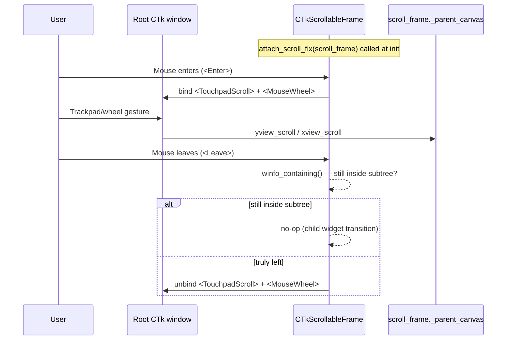

# Hover-Scoped Scroll Fix

## Overview

`CTkScrollableFrame` in customtkinter doesn't receive `<TouchpadScroll>` events on Tk 9.0/macOS because those events are delivered as a new event type that the widget doesn't bind. The current workaround — `attach_scroll_fix(window, scroll_frame)` — binds the events at the root window level, which makes *any* scroll gesture anywhere in the app scroll the target frame. This feature replaces that approach with a hover-scoped version: scroll events at the root only route to a given frame while the mouse is physically over it, so multiple scroll frames in the same app work independently and correctly.

## UI / Flow

No visible UI change — this is a behaviour fix. The observable difference:

```
Before fix:
┌──────────────────────────────────────────────────┐
│ Sidebar (repo list)  │  Main (worktree list)      │
│                      │                            │
│  [repo A]  ▲scroll   │  [worktree 1]              │
│  [repo B]  │ fires   │  [worktree 2]              │
│  [repo C]  │ even    │  [worktree 3]              │
│            │ here ──►│◄── cursor here, but BOTH  │
│                      │    scroll frames scroll    │
└──────────────────────────────────────────────────┘

After fix:
┌──────────────────────────────────────────────────┐
│ Sidebar (repo list)  │  Main (worktree list)      │
│                      │                            │
│  [repo A]            │  [worktree 1]  ▲scroll     │
│  [repo B]            │  [worktree 2]  │ fires     │
│  [repo C]            │  [worktree 3]  │ only      │
│                      │               │ here ──►  │
│  ← cursor here:      │  ← cursor here:            │
│    only sidebar      │    only worktree list      │
│    scrolls           │    scrolls                 │
└──────────────────────────────────────────────────┘
```

## Architecture



**API change:** `attach_scroll_fix(scroll_frame)` — the `window` parameter is removed. The function resolves the root via `scroll_frame.winfo_toplevel()` internally. All call sites updated accordingly.

**Call sites that need updating:**
- `cli.py` — `attach_scroll_fix(self._sidebar_frame, repo_scroll)` → `attach_scroll_fix(repo_scroll)`
- `main_window.py` — `attach_scroll_fix(self, self._list_frame)` → `attach_scroll_fix(self._list_frame)`
- `command_center_panel.py` — `attach_scroll_fix(self, self._scroll)` → `attach_scroll_fix(self._scroll)`
- `workspace_projects_panel.py` — `attach_scroll_fix(self, self._scroll)` → `attach_scroll_fix(self._scroll)`
- Dialogs (`CleanupWizard`, `LaunchDialog`, etc.) — `attach_scroll_fix(self, self._list_frame)` → `attach_scroll_fix(self._list_frame)` *(these pass a CTkToplevel as `self` so they technically worked, but the API is simplified)*

## Open Questions

*(none)*

## Iteration Plan

### Iteration 0 — Walking Skeleton
**Delivers:** `attach_scroll_fix` takes only `scroll_frame`, resolves the root internally, and hover-gates the root bindings via `<Enter>`/`<Leave>` — all existing call sites updated.
**Scope:**
- Rewrite `attach_scroll_fix(window, scroll_frame)` → `attach_scroll_fix(scroll_frame)`
- Resolve root via `scroll_frame.winfo_toplevel()`
- Bind `<Enter>` on scroll_frame to register `<TouchpadScroll>` + `<MouseWheel>` on root
- Bind `<Leave>` on scroll_frame to unregister only when mouse truly left the subtree (`winfo_containing` check)
- Bind `<Destroy>` on scroll_frame to unregister root bindings as cleanup
- Update all call sites: `cli.py`, `main_window.py`, `command_center_panel.py`, `workspace_projects_panel.py`, all dialog files

**Explicitly out of scope:**
- Any visual changes
- Supporting non-macOS platforms differently

## ✋ Manual Testing Gate — Iteration 0

> STOP. Do not proceed until every item below is checked off by the user.

- [ ] Launch the app with two scroll frames visible (e.g. sidebar repo list + main worktree list). Hover over the **sidebar** and scroll — only the sidebar scrolls, the main list does not move.
- [ ] Hover over the **main worktree list** and scroll — only the worktree list scrolls, the sidebar does not move.
- [ ] Open a dialog that has a scrollable list (e.g. Cleanup Wizard, Launch Dialog). Scroll while hovering over the list — the list scrolls normally.
- [ ] While a dialog is open, move the mouse **outside** the scroll frame and scroll — nothing scrolls (root bindings are unregistered on leave).
- [ ] Close a dialog and re-open it — scroll still works correctly (no stale bindings).
- [ ] Scroll using both trackpad gesture and mouse wheel in each case above — both input methods work.

**How to confirm:** Run the app, perform each action above, and check off each item manually.
Reply "Iteration 0 confirmed" (or describe any failures) before I declare the feature complete.
