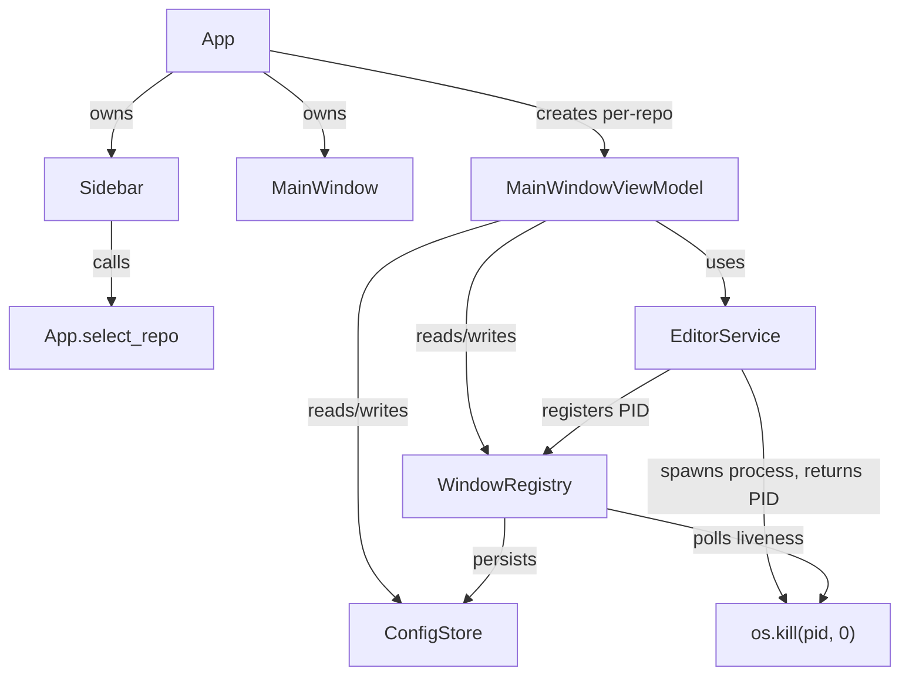
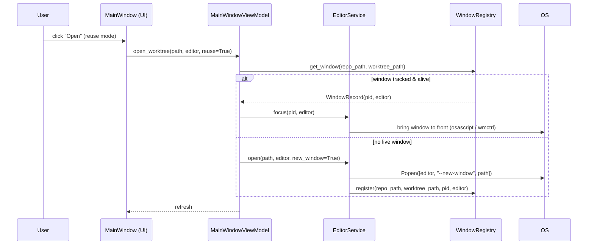

# Multi-Repo Management & Per-Repo Window Tracking

## Overview

The app currently manages one repository per session and has no memory of which editor
windows it opened. This feature adds a sidebar that lets the user switch between multiple
repos in a single app window, and introduces a PID-based window registry so the app can
show which worktrees are currently open, focus the right window instead of duplicating it,
warn before deleting a worktree with a live editor, and close the right window on delete —
all without cross-repo window pollution (reuse-window only reuses windows belonging to the
currently active repo).

---

## UI / Flow

### Main window — with sidebar

```
┌─────────────────────────────────────────────────────────────────────┐
│  Git Worktree Manager                                    ⚙  🧹      │
├──────────────┬──────────────────────────────────────────────────────┤
│ REPOS        │  my-api  (main)                              ⚙  🧹  │
│              │─────────────────────────────────────────────────────│
│ ● my-api     │  ●  main          3d ago                     Open ▾  │
│   frontend   │  ○  feat/auth     1h ago    [OPEN]           Open ▾  │
│   infra      │  ○  fix/login     2d ago  ⚠stale             Open ▾  │
│              │                                                       │
│ [+ Add Repo] │                          [+ New Worktree]            │
└──────────────┴──────────────────────────────────────────────────────┘
```

- The sidebar lists every repo that has been configured.
- The selected repo (●) shows its worktrees in the main panel.
- `[OPEN]` badge appears on any worktree that has a live tracked editor window.

### Landing state — no repos configured yet

```
┌─────────────────────────────────────────────────────────┐
│  Git Worktree Manager                                    │
│                                                          │
│         No repos configured.                             │
│                                                          │
│         [ + Add Repo ]                                   │
└─────────────────────────────────────────────────────────┘
```

### Open menu — worktree already open

```
  VS Code — new window
  VS Code — focus existing window    ← shown when a window for this
  ──────────────────────────────       worktree is already tracked
  Cursor — new window
  Cursor — focus existing window
```

### Delete dialog — worktree has a live window

```
┌────────────────────────────────────────────────────┐
│  Delete worktree                                    │
│                                                     │
│  ⚠ "feat/auth" is currently open in Cursor.        │
│  The editor window will be closed automatically.   │
│                                                     │
│  ☐ Also delete branch                              │
│                                                     │
│              [Cancel]   [Delete & Close]            │
└────────────────────────────────────────────────────┘
```

---

## Architecture

### Component diagram



### Data flow — opening a worktree



### New models

```
WindowRecord:
  repo_path:    str       # which repo this window belongs to
  worktree_path: str      # which worktree directory
  editor:       str       # "cursor" | "vscode"
  pid:          int       # OS process ID

WindowRegistry:
  _windows: dict[(repo_path, worktree_path) -> WindowRecord]
  register(repo_path, worktree_path, pid, editor) -> None
  get_window(repo_path, worktree_path) -> WindowRecord | None
  is_alive(record) -> bool          # os.kill(pid, 0)
  close(record) -> None             # os.kill(pid, SIGTERM)
  prune() -> None                   # remove dead PIDs
  all_for_repo(repo_path) -> list[WindowRecord]
```

`WindowRegistry` is an in-memory singleton shared across all `MainWindowViewModel`
instances via the `App` object. It is NOT persisted to disk — PIDs are ephemeral.

### Changes to existing types

- `RepoConfig` — no changes needed.
- `EditorService.open` — returns the spawned `Popen` object (so the caller can read `.pid`).
- `MainWindowViewModel` — gains a `window_registry` constructor parameter.
- `App` — gains a `_sidebar` panel and a `_window_registry` singleton; `_show_main` passes
  the registry to each `MainWindowViewModel`.

---

## Open Questions

_(none — all resolved during design)_

Resolved decisions:
- **Multi-repo UI**: Single app window with a left sidebar (not separate windows per repo).
- **Window detection**: PID tracking only — we only track windows we opened ourselves.
- **Reuse-window scope**: "Reuse window" is scoped per repo; switching repos never reuses
  a window from a different repo.
- **Focus mechanism**: macOS — `osascript` to bring a PID's window to front;
  Linux — `wmctrl -ip <pid>`. Falls back to opening a new window if focus fails.
- **Window liveness**: `os.kill(pid, 0)` — zero-signal probe; no actual signal sent.

---

## High-Level Steps

1. Add `WindowRecord` dataclass to `models.py`
2. Add `WindowRegistry` class to a new `window_registry.py` module
3. Update `EditorService.open` to return the spawned `Popen` object and accept a `WindowRegistry` parameter to register the PID
4. Update `MainWindowViewModel` to accept a `WindowRegistry` parameter and use it in `open_worktree` and `delete_worktree`
5. Add `is_open` / `get_window` helpers to `MainWindowViewModel` for badge and warn logic
6. Refactor `App` to own a single `WindowRegistry` instance and pass it to each `MainWindowViewModel`
7. Build `RepoSidebar` UI widget (left panel listing repos, `+ Add Repo` button, selection highlight)
8. Refactor `App._show_main` to render the sidebar + main panel layout instead of full-frame replacement
9. Update `MainWindow` worktree rows to show `[OPEN]` badge when `vm.is_open(worktree_path)` is true
10. Update `MainWindow` open menu to show "focus existing window" option when a live window is tracked
11. Update `DeleteDialog` to warn and offer "Delete & Close" when a live window is tracked for the worktree
---

## Implementation Phases

### Phase 1 — WindowRecord & WindowRegistry models
**What it covers:** The core data model and in-memory registry with liveness probing.

**Tests (Red) — write these first:**
```python
# tests/test_window_registry.py
import os
import signal
import pytest
from unittest.mock import patch, MagicMock
from worktree_manager.models import WindowRecord
from worktree_manager.window_registry import WindowRegistry


def test_window_record_fields():
    rec = WindowRecord(
        repo_path="/repos/proj",
        worktree_path="/repos/proj-wt/feat",
        editor="cursor",
        pid=12345,
    )
    assert rec.repo_path == "/repos/proj"
    assert rec.worktree_path == "/repos/proj-wt/feat"
    assert rec.editor == "cursor"
    assert rec.pid == 12345


def test_register_and_get_window():
    reg = WindowRegistry()
    reg.register("/repos/proj", "/repos/proj-wt/feat", pid=42, editor="cursor")
    rec = reg.get_window("/repos/proj", "/repos/proj-wt/feat")
    assert rec is not None
    assert rec.pid == 42
    assert rec.editor == "cursor"


def test_get_window_returns_none_for_unknown():
    reg = WindowRegistry()
    assert reg.get_window("/repos/proj", "/repos/proj-wt/unknown") is None


def test_is_alive_true_when_process_exists():
    reg = WindowRegistry()
    reg.register("/repos/proj", "/repos/proj-wt/feat", pid=42, editor="cursor")
    rec = reg.get_window("/repos/proj", "/repos/proj-wt/feat")
    with patch("os.kill") as mock_kill:
        mock_kill.return_value = None  # signal 0 success = alive
        assert reg.is_alive(rec) is True
        mock_kill.assert_called_once_with(42, 0)


def test_is_alive_false_when_process_gone():
    reg = WindowRegistry()
    reg.register("/repos/proj", "/repos/proj-wt/feat", pid=99999, editor="cursor")
    rec = reg.get_window("/repos/proj", "/repos/proj-wt/feat")
    with patch("os.kill", side_effect=OSError):
        assert reg.is_alive(rec) is False


def test_prune_removes_dead_entries():
    reg = WindowRegistry()
    reg.register("/repos/proj", "/repos/proj-wt/feat", pid=42, editor="cursor")
    reg.register("/repos/proj", "/repos/proj-wt/fix", pid=43, editor="vscode")
    def fake_kill(pid, sig):
        if pid == 43:
            raise OSError
    with patch("os.kill", side_effect=fake_kill):
        reg.prune()
    assert reg.get_window("/repos/proj", "/repos/proj-wt/feat") is not None
    assert reg.get_window("/repos/proj", "/repos/proj-wt/fix") is None


def test_all_for_repo_returns_only_that_repo():
    reg = WindowRegistry()
    reg.register("/repos/proj", "/repos/proj-wt/feat", pid=1, editor="cursor")
    reg.register("/repos/other", "/repos/other-wt/fix", pid=2, editor="vscode")
    with patch("os.kill", return_value=None):
        results = reg.all_for_repo("/repos/proj")
    assert len(results) == 1
    assert results[0].pid == 1


def test_all_for_repo_excludes_dead_entries():
    reg = WindowRegistry()
    reg.register("/repos/proj", "/repos/proj-wt/feat", pid=1, editor="cursor")
    reg.register("/repos/proj", "/repos/proj-wt/fix", pid=2, editor="vscode")
    def fake_kill(pid, sig):
        if pid == 2:
            raise OSError
    with patch("os.kill", side_effect=fake_kill):
        results = reg.all_for_repo("/repos/proj")
    assert len(results) == 1
    assert results[0].pid == 1


def test_register_overwrites_existing_entry():
    reg = WindowRegistry()
    reg.register("/repos/proj", "/repos/proj-wt/feat", pid=1, editor="cursor")
    reg.register("/repos/proj", "/repos/proj-wt/feat", pid=2, editor="vscode")
    rec = reg.get_window("/repos/proj", "/repos/proj-wt/feat")
    assert rec.pid == 2
    assert rec.editor == "vscode"


def test_close_sends_sigterm():
    reg = WindowRegistry()
    reg.register("/repos/proj", "/repos/proj-wt/feat", pid=42, editor="cursor")
    rec = reg.get_window("/repos/proj", "/repos/proj-wt/feat")
    with patch("os.kill") as mock_kill:
        reg.close(rec)
        mock_kill.assert_called_once_with(42, signal.SIGTERM)


def test_close_ignores_already_dead_process():
    reg = WindowRegistry()
    reg.register("/repos/proj", "/repos/proj-wt/feat", pid=42, editor="cursor")
    rec = reg.get_window("/repos/proj", "/repos/proj-wt/feat")
    with patch("os.kill", side_effect=OSError):
        reg.close(rec)  # must not raise
```

**Production code (Green):**
```python
# worktree_manager/models.py  — add WindowRecord dataclass
from dataclasses import dataclass


@dataclass
class WindowRecord:
    repo_path: str
    worktree_path: str
    editor: str
    pid: int
```

```python
# worktree_manager/window_registry.py  — new file
import os
import signal
from worktree_manager.models import WindowRecord


class WindowRegistry:
    def __init__(self):
        self._windows: dict[tuple[str, str], WindowRecord] = {}

    def register(self, repo_path: str, worktree_path: str, pid: int, editor: str) -> None:
        key = (repo_path, worktree_path)
        self._windows[key] = WindowRecord(
            repo_path=repo_path,
            worktree_path=worktree_path,
            editor=editor,
            pid=pid,
        )

    def get_window(self, repo_path: str, worktree_path: str) -> WindowRecord | None:
        return self._windows.get((repo_path, worktree_path))

    def is_alive(self, record: WindowRecord) -> bool:
        try:
            os.kill(record.pid, 0)
            return True
        except OSError:
            return False

    def prune(self) -> None:
        dead = [key for key, rec in self._windows.items() if not self.is_alive(rec)]
        for key in dead:
            del self._windows[key]

    def all_for_repo(self, repo_path: str) -> list[WindowRecord]:
        return [
            rec for rec in self._windows.values()
            if rec.repo_path == repo_path and self.is_alive(rec)
        ]

    def close(self, record: WindowRecord) -> None:
        try:
            os.kill(record.pid, signal.SIGTERM)
        except OSError:
            pass
```

**Done when:** All registry tests pass; `WindowRecord` and `WindowRegistry` importable from their modules.

---

### Phase 2 — EditorService returns PID and accepts WindowRegistry
**What it covers:** `EditorService.open` returns the spawned process and registers the PID.

**Tests (Red) — write these first:**
```python
# tests/test_editor_service.py — add these new tests (keep all existing ones)

def test_open_returns_popen_object(svc):
    mock_proc = MagicMock()
    mock_proc.pid = 77
    with patch("subprocess.Popen", return_value=mock_proc) as mock_popen:
        result = svc.open(
            "/repos/proj-wt/feat", editor="cursor",
            reuse_window=False, repo_path="/repos/proj",
        )
    assert result is mock_proc


def test_open_registers_pid_in_registry(store):
    from worktree_manager.window_registry import WindowRegistry
    reg = WindowRegistry()
    svc = EditorService(store, window_registry=reg)
    mock_proc = MagicMock()
    mock_proc.pid = 99
    with patch("subprocess.Popen", return_value=mock_proc):
        svc.open(
            "/repos/proj-wt/feat", editor="cursor",
            reuse_window=False, repo_path="/repos/proj",
        )
    rec = reg.get_window("/repos/proj", "/repos/proj-wt/feat")
    assert rec is not None
    assert rec.pid == 99
    assert rec.editor == "cursor"


def test_open_without_registry_does_not_crash(svc):
    mock_proc = MagicMock()
    mock_proc.pid = 55
    with patch("subprocess.Popen", return_value=mock_proc):
        result = svc.open(
            "/repos/proj-wt/feat", editor="vscode",
            reuse_window=True, repo_path="/repos/proj",
        )
    assert result is mock_proc
```

**Production code (Green):**
```python
# worktree_manager/editor_service.py
import subprocess
from worktree_manager.config_store import ConfigStore


class EditorService:
    def __init__(self, config_store: ConfigStore, window_registry=None):
        self._store = config_store
        self._registry = window_registry

    def open(self, path: str, editor: str, reuse_window: bool, repo_path: str):
        cmd = "cursor" if editor == "cursor" else "code"
        window_flag = "--reuse-window" if reuse_window else "--new-window"
        proc = subprocess.Popen([cmd, window_flag, path])

        if self._registry is not None:
            self._registry.register(repo_path, path, proc.pid, editor)

        cfg = self._store.get_repo(repo_path)
        if cfg is not None:
            cfg.last_editor = editor
            cfg.last_editor_mode = "reuse" if reuse_window else "new"
            self._store.save_repo(cfg)

        return proc
```

**Done when:** All existing `test_editor_service.py` tests still pass; three new tests pass; `open` returns the `Popen` object and registers in the registry when one is provided.

---

### Phase 3 — MainWindowViewModel gains window-awareness
**What it covers:** VM exposes `is_open`, `get_window`, and window-aware `open_worktree` / `delete_worktree`.

**Tests (Red) — write these first:**
```python
# tests/test_main_window_vm_windows.py  — new file
import pytest
import time
from unittest.mock import MagicMock, patch
from worktree_manager.config_store import ConfigStore
from worktree_manager.git_service import GitService
from worktree_manager.editor_service import EditorService
from worktree_manager.window_registry import WindowRegistry
from worktree_manager.models import RepoConfig, WindowRecord, WorktreeModel
from worktree_manager.main_window_vm import MainWindowViewModel


@pytest.fixture
def store(tmp_path):
    s = ConfigStore(tmp_path / "config.json")
    s.save_repo(RepoConfig(
        repo_path="/repos/proj",
        worktree_storage="/repos/proj-wt",
        stale_days=30,
        last_editor="cursor",
        last_editor_mode="reuse",
        last_opened="2026-05-19T10:00:00",
    ))
    return s


@pytest.fixture
def git():
    g = MagicMock(spec=GitService)
    now = int(time.time())
    g.list_worktrees.return_value = [
        WorktreeModel("/repos/proj", "main", True, now, False, False),
        WorktreeModel("/repos/proj-wt/feat", "feature/auth", False, now - 3600, False, False),
    ]
    g.list_local_branches.return_value = ["main", "feature/auth"]
    return g


@pytest.fixture
def registry():
    return WindowRegistry()


@pytest.fixture
def editor(store, registry):
    svc = EditorService(store, window_registry=registry)
    return svc


@pytest.fixture
def vm(store, git, editor, registry):
    m = MainWindowViewModel(
        repo_path="/repos/proj",
        config_store=store,
        git_service=git,
        editor_service=editor,
        window_registry=registry,
    )
    m.load_worktrees()
    return m


def test_is_open_false_when_no_window_tracked(vm):
    assert vm.is_open("/repos/proj-wt/feat") is False


def test_is_open_true_when_window_tracked_and_alive(vm, registry):
    registry.register("/repos/proj", "/repos/proj-wt/feat", pid=42, editor="cursor")
    with patch("os.kill", return_value=None):
        assert vm.is_open("/repos/proj-wt/feat") is True


def test_is_open_false_when_window_tracked_but_dead(vm, registry):
    registry.register("/repos/proj", "/repos/proj-wt/feat", pid=42, editor="cursor")
    with patch("os.kill", side_effect=OSError):
        assert vm.is_open("/repos/proj-wt/feat") is False


def test_get_window_returns_record(vm, registry):
    registry.register("/repos/proj", "/repos/proj-wt/feat", pid=42, editor="cursor")
    rec = vm.get_window("/repos/proj-wt/feat")
    assert rec is not None
    assert rec.pid == 42


def test_get_window_returns_none_when_untracked(vm):
    assert vm.get_window("/repos/proj-wt/feat") is None


def test_open_worktree_without_registry_still_works(store, git):
    editor = MagicMock(spec=EditorService)
    vm = MainWindowViewModel(
        repo_path="/repos/proj",
        config_store=store,
        git_service=git,
        editor_service=editor,
    )
    vm.load_worktrees()
    vm.open_worktree("/repos/proj-wt/feat", editor="cursor", reuse_window=False)
    editor.open.assert_called_once()


def test_delete_worktree_closes_live_window(vm, registry):
    registry.register("/repos/proj", "/repos/proj-wt/feat", pid=42, editor="cursor")
    with patch("os.kill") as mock_kill:
        vm.delete_worktree(
            path="/repos/proj-wt/feat",
            branch="feature/auth",
            also_delete_branch=False,
        )
    calls = [str(c) for c in mock_kill.call_args_list]
    import signal
    assert any(str(signal.SIGTERM) in c for c in calls)


def test_delete_worktree_without_live_window_does_not_crash(vm):
    vm.delete_worktree(
        path="/repos/proj-wt/feat",
        branch="feature/auth",
        also_delete_branch=False,
    )


def test_vm_without_registry_is_open_always_false(store, git):
    editor = MagicMock(spec=EditorService)
    vm = MainWindowViewModel(
        repo_path="/repos/proj",
        config_store=store,
        git_service=git,
        editor_service=editor,
    )
    assert vm.is_open("/repos/proj-wt/feat") is False
```

**Production code (Green):**
```python
# worktree_manager/main_window_vm.py  — updated
from worktree_manager.config_store import ConfigStore
from worktree_manager.git_service import GitService
from worktree_manager.editor_service import EditorService
from worktree_manager.models import WorktreeModel, WindowRecord


class MainWindowViewModel:
    def __init__(
        self,
        repo_path: str,
        config_store: ConfigStore,
        git_service: GitService,
        editor_service: EditorService,
        window_registry=None,
    ):
        self._repo_path = repo_path
        self._store = config_store
        self._git = git_service
        self._editor = editor_service
        self._registry = window_registry
        self._worktrees: list = []

    def load_worktrees(self) -> list:
        cfg = self._store.get_repo(self._repo_path)
        self._worktrees = self._git.list_worktrees(self._repo_path, stale_days=cfg.stale_days)
        return self._worktrees

    def cleanup_candidates(self) -> list:
        return [wt for wt in self._worktrees if not wt.is_main and (wt.is_stale or wt.is_merged)]

    def branch_to_folder_name(self, branch: str) -> str:
        return branch.replace("/", "-")

    def worktree_path_for_branch(self, branch: str) -> str:
        cfg = self._store.get_repo(self._repo_path)
        return cfg.worktree_storage + "/" + self.branch_to_folder_name(branch)

    def is_open(self, worktree_path: str) -> bool:
        if self._registry is None:
            return False
        rec = self._registry.get_window(self._repo_path, worktree_path)
        if rec is None:
            return False
        return self._registry.is_alive(rec)

    def get_window(self, worktree_path: str) -> WindowRecord | None:
        if self._registry is None:
            return None
        return self._registry.get_window(self._repo_path, worktree_path)

    def open_worktree(self, path: str, editor: str, reuse_window: bool) -> None:
        self._editor.open(path, editor=editor, reuse_window=reuse_window, repo_path=self._repo_path)

    def default_editor(self) -> tuple:
        cfg = self._store.get_repo(self._repo_path)
        return cfg.last_editor, cfg.last_editor_mode

    def create_worktree(self, branch: str, base_branch: str) -> None:
        path = self.worktree_path_for_branch(branch)
        self._git.create_worktree(
            repo_path=self._repo_path,
            worktree_path=path,
            branch=branch,
            base_branch=base_branch,
        )

    def delete_worktree(self, path: str, branch: str, also_delete_branch: bool) -> None:
        if self._registry is not None:
            rec = self._registry.get_window(self._repo_path, path)
            if rec is not None and self._registry.is_alive(rec):
                self._registry.close(rec)
        self._git.delete_worktree(repo_path=self._repo_path, worktree_path=path)
        if also_delete_branch:
            self._git.delete_branch(repo_path=self._repo_path, branch=branch)

    def all_cleanup_candidates(self) -> list:
        import time
        from worktree_manager.models import CleanupCandidate
        cfg = self._store.get_repo(self._repo_path)
        stale_threshold = int(time.time()) - cfg.stale_days * 86400

        worktree_branches = {wt.branch for wt in self._worktrees}
        candidates = []

        for wt in self._worktrees:
            if not wt.is_main and (wt.is_stale or wt.is_merged):
                candidates.append(CleanupCandidate(
                    branch=wt.branch,
                    path=wt.path,
                    is_merged=wt.is_merged,
                    is_stale=wt.is_stale,
                    last_commit_ts=wt.last_commit_ts,
                ))

        for branch in self._git.list_local_branches(self._repo_path):
            if branch in worktree_branches:
                continue
            ts = self._git.last_commit_ts(self._repo_path, branch)
            merged = self._git.is_merged(self._repo_path, branch, "main")
            stale = ts > 0 and ts < stale_threshold
            if merged or stale:
                candidates.append(CleanupCandidate(
                    branch=branch,
                    path=None,
                    is_merged=merged,
                    is_stale=stale,
                    last_commit_ts=ts,
                ))

        return candidates

    def list_local_branches(self) -> list:
        return self._git.list_local_branches(self._repo_path)

    def delete_cleanup_candidates(self, candidates: list, also_delete_branches: bool) -> None:
        for c in candidates:
            if c.path is not None:
                self._git.delete_worktree(repo_path=self._repo_path, worktree_path=c.path)
                if also_delete_branches:
                    self._git.delete_branch(repo_path=self._repo_path, branch=c.branch)
            else:
                self._git.delete_branch(repo_path=self._repo_path, branch=c.branch)
```

**Done when:** All existing VM tests still pass; new `test_main_window_vm_windows.py` tests pass.

---

### Phase 4 — App wires up WindowRegistry and sidebar layout
**What it covers:** `App` owns a single `WindowRegistry` singleton, creates a sidebar, and passes the registry to each VM. This is the structural refactor of `cli.py`.

**Tests (Red) — write these first:**
```python
# tests/test_cli.py — add these new tests (keep all existing ones)

def test_app_creates_window_registry():
    import worktree_manager.cli as cli_mod
    from unittest.mock import patch, MagicMock
    with patch("customtkinter.CTk"), \
         patch("worktree_manager.cli.ConfigStore"), \
         patch("worktree_manager.cli.GitService"), \
         patch("worktree_manager.cli.EditorService"):
        app = object.__new__(cli_mod.App)
        app._ctk = MagicMock()
        app._root = MagicMock()
        app._store = MagicMock()
        app._git = MagicMock()
        app._editor = MagicMock()
        app._current_frame = None
        app._sidebar_frame = None
        from worktree_manager.window_registry import WindowRegistry
        app._window_registry = WindowRegistry()
    assert isinstance(app._window_registry, WindowRegistry)


def test_show_main_passes_registry_to_vm():
    import worktree_manager.cli as cli_mod
    from unittest.mock import patch, MagicMock
    from worktree_manager.window_registry import WindowRegistry
    from worktree_manager.models import RepoConfig

    store = MagicMock()
    store.get_repo.return_value = RepoConfig(
        repo_path="/repos/proj",
        worktree_storage="/repos/proj-wt",
        stale_days=30,
        last_editor="cursor",
        last_editor_mode="reuse",
        last_opened="2026-05-19T10:00:00",
    )
    registry = WindowRegistry()

    captured = {}

    def fake_vm_init(self, repo_path, config_store, git_service, editor_service, window_registry=None):
        captured["window_registry"] = window_registry

    with patch("worktree_manager.main_window_vm.MainWindowViewModel.__init__", fake_vm_init), \
         patch("worktree_manager.ui.main_window.MainWindow"):
        app = object.__new__(cli_mod.App)
        app._ctk = MagicMock()
        app._root = MagicMock()
        app._store = store
        app._git = MagicMock()
        app._editor = MagicMock()
        app._current_frame = None
        app._sidebar_frame = None
        app._window_registry = registry
        app._show_main("/repos/proj")

    assert captured["window_registry"] is registry
```

**Production code (Green):**
```python
# worktree_manager/cli.py  — updated App class
import argparse
import sys
from pathlib import Path


def parse_args(argv: list) -> argparse.Namespace:
    parser = argparse.ArgumentParser(description="Git Worktree Manager")
    parser.add_argument(
        "repo_path", nargs="?", default=None,
        help="Path to the main git worktree",
    )
    return parser.parse_args(argv)


def resolve_repo_path(path, git):
    if path is None:
        return None
    if not git.is_valid_repo(path):
        print(f"Error: '{path}' is not a git repository.", file=sys.stderr)
        sys.exit(1)
    return path


class App:
    def __init__(self, repo_path):
        import customtkinter as ctk
        from worktree_manager.config_store import ConfigStore
        from worktree_manager.git_service import GitService
        from worktree_manager.editor_service import EditorService
        from worktree_manager.window_registry import WindowRegistry

        self._ctk = ctk
        self._root = ctk.CTk()
        self._root.title("Git Worktree Manager")
        self._root.geometry("900x520")

        self._store = ConfigStore()
        self._git = GitService()
        self._window_registry = WindowRegistry()
        self._editor = EditorService(self._store, window_registry=self._window_registry)
        self._current_frame = None
        self._sidebar_frame = None

        if repo_path:
            self._load_repo(repo_path)
        else:
            self._show_landing()

    def run(self):
        self._root.mainloop()

    def _clear_main(self):
        if self._current_frame:
            self._current_frame.destroy()
            self._current_frame = None

    def _clear(self):
        self._clear_main()
        if self._sidebar_frame:
            self._sidebar_frame.destroy()
            self._sidebar_frame = None

    def _show_landing(self):
        self._clear()
        from worktree_manager.landing_screen import LandingScreenViewModel
        from worktree_manager.ui.landing_screen import LandingScreen
        vm = LandingScreenViewModel(config_store=self._store, git_service=self._git)
        self._current_frame = LandingScreen(
            self._root, vm=vm, on_repo_chosen=self._load_repo
        )
        self._current_frame.pack(fill="both", expand=True)

    def _show_sidebar(self, active_repo_path: str):
        import customtkinter as ctk
        from tkinter import filedialog

        if self._sidebar_frame:
            self._sidebar_frame.destroy()

        sidebar = ctk.CTkFrame(self._root, width=180, corner_radius=0)
        sidebar.pack(side="left", fill="y")
        sidebar.pack_propagate(False)
        self._sidebar_frame = sidebar

        ctk.CTkLabel(sidebar, text="REPOS", font=ctk.CTkFont(weight="bold"),
                     text_color="gray").pack(pady=(12, 4), padx=8, anchor="w")

        repos = self._store.all_repos()
        for path, cfg in repos.items():
            name = Path(path).name
            is_active = path == active_repo_path
            btn = ctk.CTkButton(
                sidebar,
                text=("● " if is_active else "  ") + name,
                anchor="w",
                fg_color=("gray30" if is_active else "transparent"),
                hover_color="gray25",
                command=lambda p=path: self._switch_repo(p),
            )
            btn.pack(fill="x", padx=4, pady=1)

        ctk.CTkButton(
            sidebar, text="+ Add Repo", fg_color="transparent",
            border_width=1, command=self._pick_and_add_repo,
        ).pack(fill="x", padx=4, pady=(8, 4))

    def _pick_and_add_repo(self):
        from tkinter import filedialog
        path = filedialog.askdirectory(title="Select git repo")
        if not path:
            return
        if not self._git.is_valid_repo(path):
            import tkinter.messagebox as mb
            mb.showerror("Error", f"'{path}' is not a git repository.")
            return
        self._load_repo(path)

    def _switch_repo(self, repo_path: str):
        self._load_repo(repo_path)

    def _load_repo(self, repo_path: str):
        cfg = self._store.get_repo(repo_path)
        if cfg is None:
            self._show_setup(repo_path)
        else:
            self._show_main(repo_path)

    def _show_setup(self, repo_path: str):
        self._clear()
        from worktree_manager.setup_settings_vm import RepoSetupViewModel
        from worktree_manager.ui.repo_setup_dialog import RepoSetupDialog
        vm = RepoSetupViewModel(repo_path=repo_path, config_store=self._store)
        self._current_frame = self._ctk.CTkFrame(self._root)
        self._current_frame.pack(fill="both", expand=True)
        RepoSetupDialog(
            self._root, vm=vm,
            on_confirm=lambda: self._show_main(repo_path),
        )

    def _show_main(self, repo_path: str):
        from datetime import datetime, timezone
        from worktree_manager.main_window_vm import MainWindowViewModel
        from worktree_manager.ui.main_window import MainWindow

        cfg = self._store.get_repo(repo_path)
        cfg.last_opened = datetime.now(timezone.utc).isoformat()
        self._store.save_repo(cfg)

        self._clear_main()
        self._show_sidebar(repo_path)

        vm = MainWindowViewModel(
            repo_path=repo_path,
            config_store=self._store,
            git_service=self._git,
            editor_service=self._editor,
            window_registry=self._window_registry,
        )
        repo_name = Path(repo_path).name
        self._current_frame = MainWindow(
            self._root, vm=vm, repo_name=repo_name,
            on_settings=lambda: self._show_settings(repo_path),
            on_cleanup=lambda: self._show_cleanup(vm),
        )
        self._current_frame.pack(side="left", fill="both", expand=True)

    def _show_settings(self, repo_path: str):
        from worktree_manager.setup_settings_vm import SettingsViewModel
        from worktree_manager.ui.settings_panel import SettingsPanel
        vm = SettingsViewModel(repo_path=repo_path, config_store=self._store)
        SettingsPanel(self._root, vm=vm)

    def _show_cleanup(self, main_vm):
        import tkinter.messagebox as mb
        from worktree_manager.ui.cleanup_wizard import CleanupWizard
        candidates = main_vm.all_cleanup_candidates()
        if not candidates:
            mb.showinfo("Cleanup", "Nothing to clean up.")
            return

        def _on_delete(selected, also_branches):
            main_vm.delete_cleanup_candidates(selected, also_branches)
            if self._current_frame and hasattr(self._current_frame, "refresh"):
                self._current_frame.refresh()

        CleanupWizard(self._root, candidates=candidates, on_delete_selected=_on_delete)


def main():
    from worktree_manager.git_service import GitService
    import customtkinter as ctk

    args = parse_args(sys.argv[1:])
    git = GitService()
    repo_path = resolve_repo_path(args.repo_path, git)

    ctk.set_appearance_mode("system")
    ctk.set_default_color_theme("blue")

    app = App(repo_path)
    app.run()


if __name__ == "__main__":
    main()
```

**Done when:** `test_app_creates_window_registry` and `test_show_main_passes_registry_to_vm` pass; all existing `test_cli.py` tests still pass; app launches with a sidebar visible.

---

### Phase 5 — [OPEN] badge and focus-existing-window in MainWindow
**What it covers:** The worktree list row shows an `[OPEN]` badge when tracked; the open dropdown adds a "focus existing" option when alive.

**Tests (Red) — write these first:**
```python
# tests/test_main_window_open_badge.py  — new file
import pytest
import time
from unittest.mock import MagicMock, patch
from worktree_manager.models import WorktreeModel, WindowRecord


def _ctk_available():
    try:
        import customtkinter
        return True
    except ImportError:
        return False

pytestmark = pytest.mark.skipif(not _ctk_available(), reason="customtkinter not installed")


@pytest.fixture
def root():
    import customtkinter as ctk
    r = ctk.CTk()
    r.withdraw()
    yield r
    r.destroy()


def _make_vm(is_open_for=None):
    vm = MagicMock()
    now = int(time.time())
    vm.load_worktrees.return_value = [
        WorktreeModel("/repos/proj", "main", True, now, False, False),
        WorktreeModel("/repos/proj-wt/feat", "feature/auth", False, now - 3600, False, False),
    ]
    vm.default_editor.return_value = ("cursor", "reuse")
    vm.is_open.side_effect = lambda path: path == is_open_for
    vm.get_window.side_effect = lambda path: (
        WindowRecord("/repos/proj", path, "cursor", 42) if path == is_open_for else None
    )
    return vm


def test_open_badge_visible_when_window_tracked(root):
    from worktree_manager.ui.main_window import MainWindow
    vm = _make_vm(is_open_for="/repos/proj-wt/feat")
    win = MainWindow(root, vm=vm, repo_name="proj", on_settings=MagicMock(), on_cleanup=MagicMock())
    labels = _collect_labels(win)
    assert any("[OPEN]" in str(getattr(lbl, "_text", "")) for lbl in labels)
    win.destroy()


def test_open_badge_absent_when_no_window(root):
    from worktree_manager.ui.main_window import MainWindow
    vm = _make_vm(is_open_for=None)
    win = MainWindow(root, vm=vm, repo_name="proj", on_settings=MagicMock(), on_cleanup=MagicMock())
    labels = _collect_labels(win)
    assert not any("[OPEN]" in str(getattr(lbl, "_text", "")) for lbl in labels)
    win.destroy()


def _collect_labels(widget):
    import customtkinter as ctk
    result = []
    if isinstance(widget, ctk.CTkLabel):
        result.append(widget)
    for child in widget.winfo_children():
        result.extend(_collect_labels(child))
    return result
```

**Production code (Green):**
```python
# worktree_manager/ui/main_window.py — update _add_row and _show_open_menu

# In _add_row, replace the open-button block with:

    def _add_row(self, wt: WorktreeModel):
        row = ctk.CTkFrame(self._list_frame)
        row.pack(fill="x", pady=2)

        dot = "●" if wt.is_main else "○"
        ctk.CTkLabel(row, text=dot, width=20).pack(side="left")
        ctk.CTkLabel(row, text=wt.branch, anchor="w", width=180).pack(side="left")
        ctk.CTkLabel(
            row, text=_fmt_age(wt.last_commit_ts), text_color="gray", width=80
        ).pack(side="left")

        if wt.is_stale:
            ctk.CTkLabel(row, text="⚠ stale", text_color="orange", width=70).pack(side="left")
        else:
            ctk.CTkLabel(row, text="", width=70).pack(side="left")

        if self._vm.is_open(wt.path):
            ctk.CTkLabel(row, text="[OPEN]", text_color="#2ecc71", width=60).pack(side="left")
        else:
            ctk.CTkLabel(row, text="", width=60).pack(side="left")

        if not wt.is_main:
            ctk.CTkButton(
                row, text="✕", width=28, fg_color="#c0392b",
                command=lambda w=wt: self._open_delete(w)
            ).pack(side="right", padx=(0, 4))

        arrow_btn = ctk.CTkButton(
            row, text="▾", width=28,
            command=lambda w=wt: self._show_open_menu(w)
        )
        arrow_btn.pack(side="right", padx=(0, 2))

        ed, mode = self._vm.default_editor()
        reuse = mode == "reuse"
        open_label = "Focus" if self._vm.is_open(wt.path) else "Open"
        ctk.CTkButton(
            row, text=open_label, width=55,
            command=lambda p=wt.path: self._vm.open_worktree(p, ed, reuse)
        ).pack(side="right", padx=(0, 2))

# In _show_open_menu, add focus options when window is tracked:

    def _show_open_menu(self, wt: WorktreeModel):
        menu = tk.Menu(self, tearoff=0)
        has_window = self._vm.is_open(wt.path)
        rec = self._vm.get_window(wt.path) if has_window else None

        if has_window and rec:
            menu.add_command(
                label=f"{rec.editor.title()} — focus existing window",
                command=lambda: self._vm.focus_window(wt.path),
            )
            menu.add_separator()

        menu.add_command(
            label="VS Code — new window",
            command=lambda: self._vm.open_worktree(wt.path, "vscode", False),
        )
        menu.add_command(
            label="VS Code — reuse window",
            command=lambda: self._vm.open_worktree(wt.path, "vscode", True),
        )
        menu.add_separator()
        menu.add_command(
            label="Cursor — new window",
            command=lambda: self._vm.open_worktree(wt.path, "cursor", False),
        )
        menu.add_command(
            label="Cursor — reuse window",
            command=lambda: self._vm.open_worktree(wt.path, "cursor", True),
        )
        x = self.winfo_pointerx()
        y = self.winfo_pointery()
        menu.tk_popup(x, y)
```

Also add `focus_window` to `MainWindowViewModel`:

```python
# worktree_manager/main_window_vm.py — add method

    def focus_window(self, worktree_path: str) -> None:
        if self._registry is None:
            return
        rec = self._registry.get_window(self._repo_path, worktree_path)
        if rec is None or not self._registry.is_alive(rec):
            return
        self._editor.focus(rec)
```

And add `focus` to `EditorService`:

```python
# worktree_manager/editor_service.py — add method

    def focus(self, record) -> None:
        import platform
        import subprocess
        if platform.system() == "Darwin":
            script = f'tell application "System Events" to set frontmost of (first process whose unix id is {record.pid}) to true'
            try:
                subprocess.run(["osascript", "-e", script], check=True)
            except subprocess.CalledProcessError:
                pass
        else:
            try:
                subprocess.run(["wmctrl", "-ip", str(record.pid)], check=True)
            except (subprocess.CalledProcessError, FileNotFoundError):
                pass
```

**Done when:** `[OPEN]` badge appears on worktree rows when a tracked window is alive; "Focus" replaces "Open" label; dropdown shows "focus existing window" entry; all existing tests pass.

---

### Phase 6 — Delete dialog warns about live windows
**What it covers:** `DeleteDialog` checks the VM for a live window and shows a warning; the confirm button reads "Delete & Close".

**Tests (Red) — write these first:**
```python
# tests/test_delete_dialog_window_warning.py  — new file
import pytest
import time
from unittest.mock import MagicMock
from worktree_manager.models import WorktreeModel, WindowRecord


def _ctk_available():
    try:
        import customtkinter
        return True
    except ImportError:
        return False

pytestmark = pytest.mark.skipif(not _ctk_available(), reason="customtkinter not installed")


@pytest.fixture
def root():
    import customtkinter as ctk
    r = ctk.CTk()
    r.withdraw()
    yield r
    r.destroy()


def _make_wt():
    return WorktreeModel(
        path="/repos/proj-wt/feat",
        branch="feature/auth",
        is_main=False,
        last_commit_ts=int(time.time()) - 3600,
        is_merged=False,
        is_stale=False,
    )


def test_delete_dialog_shows_warning_when_window_open(root):
    from worktree_manager.ui.delete_dialog import DeleteDialog
    wt = _make_wt()
    rec = WindowRecord("/repos/proj", wt.path, "cursor", 42)
    dlg = DeleteDialog(root, wt=wt, on_delete=MagicMock(), live_window=rec)
    texts = _collect_text(dlg)
    assert any("open" in t.lower() or "cursor" in t.lower() for t in texts)
    dlg.destroy()


def test_delete_dialog_confirm_button_says_delete_and_close_when_window_open(root):
    from worktree_manager.ui.delete_dialog import DeleteDialog
    wt = _make_wt()
    rec = WindowRecord("/repos/proj", wt.path, "cursor", 42)
    dlg = DeleteDialog(root, wt=wt, on_delete=MagicMock(), live_window=rec)
    buttons = _collect_buttons(dlg)
    labels = [getattr(b, "_text", "") for b in buttons]
    assert any("close" in lbl.lower() for lbl in labels)
    dlg.destroy()


def test_delete_dialog_no_warning_when_no_window(root):
    from worktree_manager.ui.delete_dialog import DeleteDialog
    wt = _make_wt()
    dlg = DeleteDialog(root, wt=wt, on_delete=MagicMock(), live_window=None)
    texts = _collect_text(dlg)
    assert not any("open in" in t.lower() for t in texts)
    dlg.destroy()


def test_delete_dialog_confirm_button_says_delete_when_no_window(root):
    from worktree_manager.ui.delete_dialog import DeleteDialog
    wt = _make_wt()
    dlg = DeleteDialog(root, wt=wt, on_delete=MagicMock(), live_window=None)
    buttons = _collect_buttons(dlg)
    labels = [getattr(b, "_text", "") for b in buttons]
    assert any(lbl.lower() in ("delete", "delete worktree") for lbl in labels)
    dlg.destroy()


def _collect_text(widget):
    import customtkinter as ctk
    result = []
    if isinstance(widget, (ctk.CTkLabel,)):
        result.append(getattr(widget, "_text", ""))
    for child in widget.winfo_children():
        result.extend(_collect_text(child))
    return result


def _collect_buttons(widget):
    import customtkinter as ctk
    result = []
    if isinstance(widget, ctk.CTkButton):
        result.append(widget)
    for child in widget.winfo_children():
        result.extend(_collect_buttons(child))
    return result
```

Also update `MainWindow._open_delete` to pass the live window to the dialog:

```python
# tests/test_main_window_open_badge.py — add this test

def test_open_delete_passes_live_window_to_dialog(root):
    from unittest.mock import patch
    from worktree_manager.ui.main_window import MainWindow
    vm = _make_vm(is_open_for="/repos/proj-wt/feat")
    win = MainWindow(root, vm=vm, repo_name="proj", on_settings=MagicMock(), on_cleanup=MagicMock())
    wt = WorktreeModel("/repos/proj-wt/feat", "feature/auth", False, int(time.time()), False, False)
    captured = {}
    with patch("worktree_manager.ui.delete_dialog.DeleteDialog") as MockDlg:
        win._open_delete(wt)
        _, kwargs = MockDlg.call_args
        captured["live_window"] = kwargs.get("live_window")
    assert captured["live_window"] is not None
    win.destroy()
```

**Production code (Green):**

Read the existing delete dialog first, then update it:

```python
# worktree_manager/ui/delete_dialog.py — full updated file
import customtkinter as ctk
from worktree_manager.models import WorktreeModel


class DeleteDialog(ctk.CTkToplevel):
    def __init__(self, master, wt: WorktreeModel, on_delete, live_window=None):
        super().__init__(master)
        self.title("Delete Worktree")
        self.geometry("420x260")
        self.resizable(False, False)
        self.grab_set()
        self._wt = wt
        self._on_delete = on_delete
        self._live_window = live_window
        self._also_branch = ctk.BooleanVar(value=False)
        self._build()

    def _build(self):
        ctk.CTkLabel(
            self,
            text=f'Delete worktree "{self._wt.branch}"?',
            font=ctk.CTkFont(size=14, weight="bold"),
        ).pack(pady=(20, 8), padx=20)

        if self._live_window is not None:
            editor_name = self._live_window.editor.title()
            ctk.CTkLabel(
                self,
                text=f'⚠ "{self._wt.branch}" is currently open in {editor_name}.\nThe editor window will be closed automatically.',
                text_color="orange",
                justify="center",
            ).pack(pady=(0, 8), padx=20)

        ctk.CTkCheckBox(
            self, text="Also delete branch", variable=self._also_branch
        ).pack(pady=4, padx=20, anchor="w")

        btn_frame = ctk.CTkFrame(self, fg_color="transparent")
        btn_frame.pack(pady=16)

        ctk.CTkButton(
            btn_frame, text="Cancel", fg_color="gray40",
            command=self.destroy,
        ).pack(side="left", padx=8)

        confirm_label = "Delete & Close" if self._live_window is not None else "Delete"
        ctk.CTkButton(
            btn_frame, text=confirm_label, fg_color="#c0392b",
            command=self._confirm,
        ).pack(side="left", padx=8)

    def _confirm(self):
        self._on_delete(self._wt, self._also_branch.get())
        self.destroy()
```

Update `MainWindow._open_delete` to pass the live window:

```python
# worktree_manager/ui/main_window.py — update _open_delete

    def _open_delete(self, wt: WorktreeModel):
        from worktree_manager.ui.delete_dialog import DeleteDialog
        live = self._vm.get_window(wt.path)
        DeleteDialog(self, wt=wt, on_delete=self._handle_delete, live_window=live)
```

**Done when:** Delete dialog shows the warning and "Delete & Close" button when a live window is registered; no warning when none; all existing delete tests pass.

---

## Feature Acceptance Checklist

- [ ] App window shows a left sidebar listing all configured repos; clicking a repo switches the main panel to that repo's worktrees
- [ ] "+ Add Repo" button in sidebar lets the user pick a new git repo and loads it
- [ ] Worktree row shows `[OPEN]` badge (green) when that worktree has a live tracked editor window
- [ ] "Open" button changes to "Focus" when a live window is tracked; clicking it brings the window to front instead of opening a duplicate
- [ ] Open dropdown shows "focus existing window" option only when a live window is tracked
- [ ] "Reuse window" never focuses or reuses a window that belongs to a different repo
- [ ] Deleting a worktree with a live window closes that editor window automatically
- [ ] Delete dialog warns the user and shows "Delete & Close" when the worktree has a live window
- [ ] Switching repos does not close editor windows belonging to the repo you switched away from
- [ ] All phases green (tests pass, no regressions)