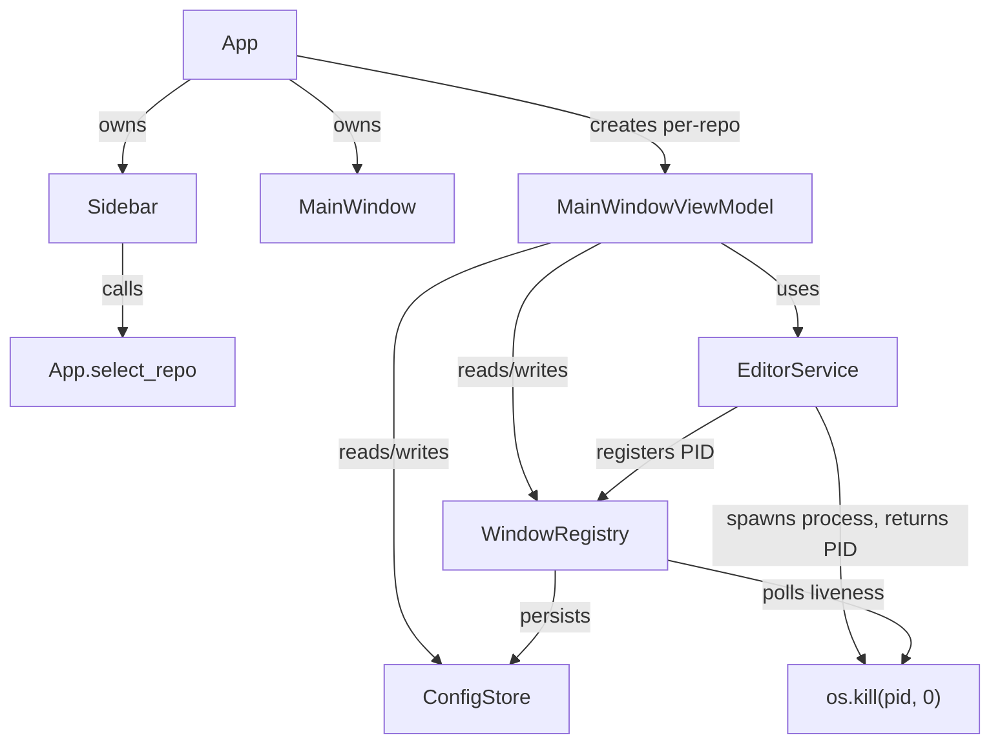
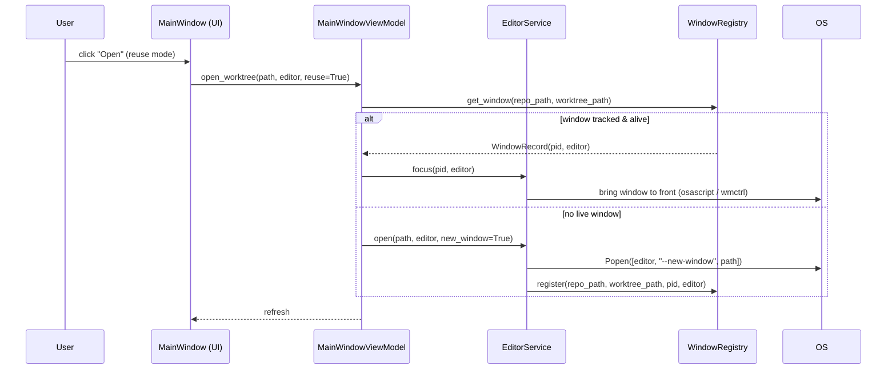

# Multi-Repo Management & Per-Repo Window Tracking

## Overview

The app currently manages one repository per session and has no memory of which editor
windows it opened. This feature adds a sidebar that lets the user switch between multiple
repos in a single app window, and introduces a PID-based window registry so the app can
show which worktrees are currently open, focus the right window instead of duplicating it,
warn before deleting a worktree with a live editor, and close the right window on delete —
all without cross-repo window pollution (reuse-window only reuses windows belonging to the
currently active repo).

---

## UI / Flow

### Main window — with sidebar

```
┌─────────────────────────────────────────────────────────────────────┐
│  Git Worktree Manager                                    ⚙  🧹      │
├──────────────┬──────────────────────────────────────────────────────┤
│ REPOS        │  my-api  (main)                              ⚙  🧹  │
│              │─────────────────────────────────────────────────────│
│ ● my-api     │  ●  main          3d ago                     Open ▾  │
│   frontend   │  ○  feat/auth     1h ago    [OPEN]           Open ▾  │
│   infra      │  ○  fix/login     2d ago  ⚠stale             Open ▾  │
│              │                                                       │
│ [+ Add Repo] │                          [+ New Worktree]            │
└──────────────┴──────────────────────────────────────────────────────┘
```

- The sidebar lists every repo that has been configured.
- The selected repo (●) shows its worktrees in the main panel.
- `[OPEN]` badge appears on any worktree that has a live tracked editor window.

### Landing state — no repos configured yet

```
┌─────────────────────────────────────────────────────────┐
│  Git Worktree Manager                                    │
│                                                          │
│         No repos configured.                             │
│                                                          │
│         [ + Add Repo ]                                   │
└─────────────────────────────────────────────────────────┘
```

### Open menu — worktree already open

```
  VS Code — new window
  VS Code — focus existing window    ← shown when a window for this
  ──────────────────────────────       worktree is already tracked
  Cursor — new window
  Cursor — focus existing window
```

### Delete dialog — worktree has a live window

```
┌────────────────────────────────────────────────────┐
│  Delete worktree                                    │
│                                                     │
│  ⚠ "feat/auth" is currently open in Cursor.        │
│  The editor window will be closed automatically.   │
│                                                     │
│  ☐ Also delete branch                              │
│                                                     │
│              [Cancel]   [Delete & Close]            │
└────────────────────────────────────────────────────┘
```

---

## Architecture

### Component diagram



### Data flow — opening a worktree



### New models

```
WindowRecord:
  repo_path:    str       # which repo this window belongs to
  worktree_path: str      # which worktree directory
  editor:       str       # "cursor" | "vscode"
  pid:          int       # OS process ID

WindowRegistry:
  _windows: dict[(repo_path, worktree_path) -> WindowRecord]
  register(repo_path, worktree_path, pid, editor) -> None
  get_window(repo_path, worktree_path) -> WindowRecord | None
  is_alive(record) -> bool          # os.kill(pid, 0)
  close(record) -> None             # os.kill(pid, SIGTERM)
  prune() -> None                   # remove dead PIDs
  all_for_repo(repo_path) -> list[WindowRecord]
```

`WindowRegistry` is an in-memory singleton shared across all `MainWindowViewModel`
instances via the `App` object. It is NOT persisted to disk — PIDs are ephemeral.

### Changes to existing types

- `RepoConfig` — no changes needed.
- `EditorService.open` — returns the spawned `Popen` object (so the caller can read `.pid`).
- `MainWindowViewModel` — gains a `window_registry` constructor parameter.
- `App` — gains a `_sidebar` panel and a `_window_registry` singleton; `_show_main` passes
  the registry to each `MainWindowViewModel`.

---

## Open Questions

_(none — all resolved during design)_

Resolved decisions:
- **Multi-repo UI**: Single app window with a left sidebar (not separate windows per repo).
- **Window detection**: PID tracking only — we only track windows we opened ourselves.
- **Reuse-window scope**: "Reuse window" is scoped per repo; switching repos never reuses
  a window from a different repo.
- **Focus mechanism**: macOS — `osascript` to bring a PID's window to front;
  Linux — `wmctrl -ip <pid>`. Falls back to opening a new window if focus fails.
- **Window liveness**: `os.kill(pid, 0)` — zero-signal probe; no actual signal sent.

---

## High-Level Steps

1. Add `WindowRecord` dataclass to `models.py`
2. Add `WindowRegistry` class to a new `window_registry.py` module
3. Update `EditorService.open` to return the spawned `Popen` object and accept a `WindowRegistry` parameter to register the PID
4. Update `MainWindowViewModel` to accept a `WindowRegistry` parameter and use it in `open_worktree` and `delete_worktree`
5. Add `is_open` / `get_window` helpers to `MainWindowViewModel` for badge and warn logic
6. Refactor `App` to own a single `WindowRegistry` instance and pass it to each `MainWindowViewModel`
7. Build `RepoSidebar` UI widget (left panel listing repos, `+ Add Repo` button, selection highlight)
8. Refactor `App._show_main` to render the sidebar + main panel layout instead of full-frame replacement
9. Update `MainWindow` worktree rows to show `[OPEN]` badge when `vm.is_open(worktree_path)` is true
10. Update `MainWindow` open menu to show "focus existing window" option when a live window is tracked
11. Update `DeleteDialog` to warn and offer "Delete & Close" when a live window is tracked for the worktree
