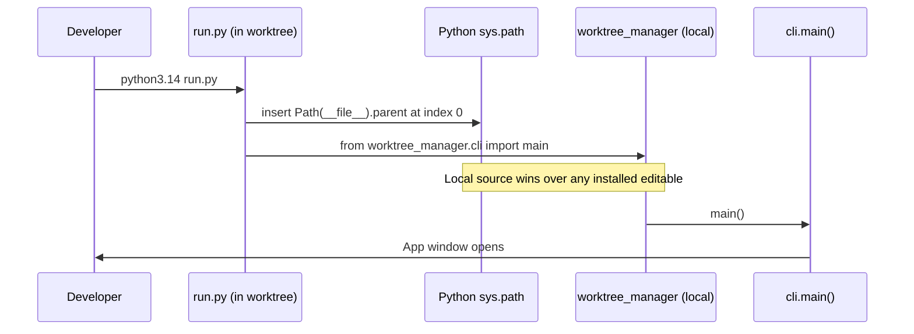

# Portable Launcher

## Overview
The worktree manager is currently installed as an editable package pointing at the main checkout (`/repos/dev-tools/worktree-manager`). When working in a different git worktree (e.g. `small_improvements`), running `worktree-manager` or `python3.14 -m worktree_manager.cli` silently executes the main branch's code — not the worktree's code. This feature adds a `run.py` launcher script to the repo that forces Python to use the local worktree's source, making the app runnable from any checkout without any install step. The README is also updated to document this.

## UI / Flow

### Normal launch (current — broken for worktrees)
```
$ worktree-manager
  → resolves via editable install → /repos/dev-tools/worktree-manager  ← WRONG in a worktree
```

### Portable launch (new)
```
$ python3.14 run.py
  → run.py inserts its own directory first on sys.path
  → worktree_manager package resolves to the local worktree  ← CORRECT
  → App opens normally
```

### README — updated "Running" section
```
## Running

From any worktree checkout:

    python3.14 run.py

Or, if the editable install is active and you want the installed version:

    worktree-manager
    python3.14 -m worktree_manager.cli
```

## Architecture



The only new artefact is `worktree-manager/run.py` — a 4-line script. No new modules, no new dependencies, no changes to existing source files (except README.md).

## Open Questions

_None._

## Iteration Plan

### Iteration 0 — Walking Skeleton
**Delivers:** A `run.py` script exists in `worktree-manager/` and, when run with `python3.14 run.py` from any directory, launches the app using the local worktree's source code. The README documents this as the canonical way to run from a worktree.

**Scope:**
- Add `worktree-manager/run.py` that prepends its own parent directory to `sys.path` then calls `worktree_manager.cli.main()`
- Update `README.md` to add a "Running from a worktree" section with `python3.14 run.py` as the primary command

**Explicitly out of scope:**
- Any changes to `cli.py`, `pyproject.toml`, or other source files
- Shell scripts, Makefiles, or other launcher formats
- Auto-detection of which worktree is active

## ✋ Manual Testing Gate — Iteration 0

> STOP. Do not proceed until every item below is checked off by the user.

- [ ] From the `worktree-manager/` directory, run `python3.14 run.py` — the app window opens
- [ ] From a completely different directory (e.g. `/tmp`), run `python3.14 /path/to/worktree-manager/run.py` — the app window opens
- [ ] Confirm the app that opened is loading code from the worktree: make a trivial visible change (e.g. change the window title string in `cli.py`), rerun `python3.14 run.py`, and confirm the change is reflected — proving local source is used, not the installed editable
- [ ] README.md contains a "Running from a worktree" (or equivalent) section with `python3.14 run.py` as the primary command

**How to confirm:** Perform each action above and check off each item manually.
Reply "Iteration 0 confirmed" (or describe any failures) before we wrap up.
