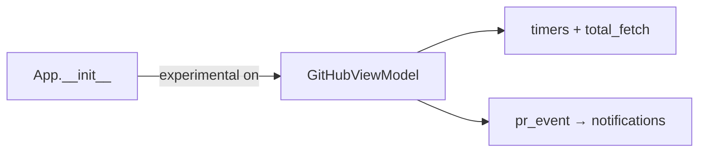
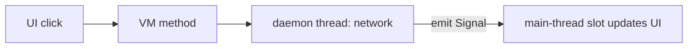

<!-- autobot-status
stage: 6
iteration: 3
gate: confirmed
updated: 2026-06-20
-->

# Autobot — Pull Requests / GitHub tab responsiveness

The GitHub ("Pull Requests") tab is slow, freezes during push/merge, doesn't start fetching
until the tab is clicked (missing notifications), and shows "Loading pull requests…" every time
despite a working on-disk cache. This run fixes all of those.

## Problem & Root Causes

| # | Reported symptom | Root cause | Where |
|---|------------------|-----------|-------|
| 1 | Slow / unresponsive across **all** operations | Per-PR and per-action network calls run **synchronously on the Qt main thread** — `select_pr` (PR detail = 4 HTTP calls), `merge_pr`, `retry_*` POSTs. Only the list fetch is threaded. | [github_vm.py](worktree_manager/github_vm.py) `select_pr`, `merge_pr`, `retry_*`; [github_panel.py](worktree_manager/ui/github_panel.py) call sites |
| 2 | "Push & Open PR" **freezes the app** before completing | `_on_push_open_pr` runs `push_branch` (git subprocess) **and** `create_pull_request` (HTTP POST) inline on the UI thread, then a `time.sleep` countdown. No event-loop yield during the blocking calls → hard freeze. | [github_panel.py:866](worktree_manager/ui/github_panel.py#L866) |
| 3 | Doesn't start fetching at app launch, only when the PR tab is clicked → **missed notifications** | `GitHubViewModel` (which starts the timers, kicks the first `total_fetch`, and owns the `pr_event` notification stream) is **lazily constructed inside `_show_github_panel`**. Nothing exists until the user clicks the tab. | [cli.py:796](worktree_manager/cli.py#L796) |
| 4 | "Loading pull requests…" shown **every time**, even though data is cached | The panel's `__init__` unconditionally shows the loading label whenever a token is configured, ignoring that `vm.prs` is already populated from the on-disk cache. | [github_panel.py:352](worktree_manager/ui/github_panel.py#L352) |
| 5 | "Initial fetch is not cached properly" | The VM emits `prs_updated` from its **constructor** (after loading the cache) **before the panel is created and connected** — so the panel never receives the cached-data signal and falls back to the loading state in (4). The cache is fine on disk; it just never reaches the view. | [github_vm.py:52](worktree_manager/github_vm.py#L52) + ordering in [cli.py:799](worktree_manager/cli.py#L799) |

**Themes:** (A) the VM must be **bootstrapped at app startup**, not on first tab click; (B) the panel
must **render from cache instantly** and only show "loading" when there is genuinely nothing to show;
(C) every **user-triggered network/subprocess op must run off the UI thread** using the threaded +
Qt-signal pattern the VM already uses for `total_fetch`/`quick_fetch`.

## API Verification — GraphQL (live-probed against ahmedhhw, 2026-06-19)

A single GraphQL query was run against the real API with the stored token and **returned every
field the notification engine, detail view, and CI-rerun feature need**, at a cost of **1
rate-limit point** (vs `1 + 4×N` REST calls today).

- `search(query:"is:pr is:open author:@me", type:ISSUE)` → PR nodes with `number, isDraft, state,
  mergeable, mergeStateStatus, headRefName, baseRefName, headRefOid, repository.nameWithOwner`.
- `reviews(first:50){ author.login, state }`, `comments(first:100){ databaseId, author.login, createdAt }`.
- `commits(last:1).commit.statusCheckRollup.contexts(first:100)` → `CheckRun{ name, status, conclusion,
  checkSuite.databaseId, checkSuite.workflowRun.databaseId }` (live result: name="Run Unit Tests",
  status=COMPLETED, conclusion=FAILURE, run_id resolved directly — **no `details_url` regex needed**).

**Verified enum spaces** (introspected live): `MergeableState{MERGEABLE,CONFLICTING,UNKNOWN}`,
`MergeStateStatus{DIRTY,UNKNOWN,BLOCKED,BEHIND,UNSTABLE,HAS_HOOKS,CLEAN}`,
`CheckStatusState{REQUESTED,QUEUED,IN_PROGRESS,COMPLETED,WAITING,PENDING}`,
`CheckConclusionState{ACTION_REQUIRED,TIMED_OUT,CANCELLED,FAILURE,SUCCESS,NEUTRAL,SKIPPED,STARTUP_FAILURE,STALE}`,
`PullRequestReviewState{PENDING,COMMENTED,APPROVED,CHANGES_REQUESTED,DISMISSED}`.

**Drop-in mapping:** lowercase GraphQL status/conclusion/mergeStateStatus and map the `mergeable`
enum to bool/None → exact parity with the existing REST-shaped `CICheck`/`PullRequest` model, so
`ci_status`, `_emit_pr_events`, and the re-run logic work unchanged.

**Not exercised live** (only 1 open PR, all-CheckRun): legacy `StatusContext` rollup nodes and
multi-check/review/comment pagination — field resolves; both node types will be mapped.

## Frontend Design

The visible surface barely changes — the fixes are about *when* states appear, not new screens.
The four states below are the ones whose behaviour changes.

### My PRs — opening the tab when a cache exists (NEW behaviour)
PRs render **immediately** from cache; no "Loading…" flash. A background refresh runs silently,
surfaced only by the existing grey footer status line.

```
┌───────────────────────────────────────────────────────────┐
│ ⬡  Pull Requests              🔔   ↻ 30s   ⚿ Token         │
├───────────────────────────────────────────────────────────┤
│ [ Search PRs…                                            ]  │
│ ▾  ahmedhhw/dev-tools  (2)                            ⚙     │
│   #41  Fix scroll on Tk9        ✅ checks passed            │
│        tk9-scroll → main        🟢 Mergeable                │
│   #38  PR list grouping         ⏳ checks running           │
│        pr-grouping → main       ⚪ Checking mergeability…   │
├───────────────────────────────────────────────────────────┤
│ Refreshing PRs…                              ↺ Rescan      │  ← silent bg refresh
└───────────────────────────────────────────────────────────┘
```

### My PRs — first ever load, no cache (loading state, unchanged look)
Only shown when there is genuinely no cached data yet.

```
┌───────────────────────────────────────────────────────────┐
│ ⬡  Pull Requests              🔔   ↻ 30s   ⚿ Token         │
├───────────────────────────────────────────────────────────┤
│                                                            │
│                ⏳ Loading pull requests…                   │
│                                                            │
├───────────────────────────────────────────────────────────┤
│ Scanning GitHub for repos with your open PRs…  ↺ Rescan   │
└───────────────────────────────────────────────────────────┘
```

### Open PR — Push & Open PR (NEW: async, app stays responsive)
The button shows progress and disables; the **rest of the app stays interactive** (you can switch
tabs / scroll). On success it jumps to My PRs; on failure the inline red error shows.

```
   Branch:  [ tk9-scroll                       ▾ ]
   Title:   [ Tk9 scroll                          ]
   Base:    [ main                             ▾ ]
   Description: [ … ]
   [ ] Draft PR
   ┌─────────────────────────────┐
   │  ⏳ Pushing & creating PR…  │   ← disabled; UI not frozen
   └─────────────────────────────┘
   (on error)  ⚠ git push failed: …            (red, inline)
```

### My PRs detail — opening a PR (NEW: instant from cache)
The detail (checks/reviews/comments) is **already fetched and held in memory** for every PR by the
list refresh, so clicking **↗ View** renders it **instantly with no network call**. A silent
background refresh of just that one PR runs after, swapping in place when it lands. The window
never freezes. If a refresh is in flight, the **previously shown detail stays visible** until the
new data arrives — no placeholder.

```
┌───────────────────────────────────────────────────────────┐
│ ← Back                                                     │
│ #41  Fix scroll on Tk9    ← appears instantly from cache   │
│  CI Checks  · Reviews · Comments … (rendered from memory)  │
│  (silent bg refresh swaps in fresher data when it lands)   │
└───────────────────────────────────────────────────────────┘
```

### Resolved design decisions (from clarifying questions)
1. **Detail pane:** keep the previous PR's detail (or the list) visible until the new PR's data
   arrives — no loading placeholder. Swap in place.
2. **Push/Merge "sleep before refresh":** the delay exists for GitHub eventual-consistency. Keep the
   delay but make it **non-blocking** — schedule the refresh via `QTimer.singleShot` (reusing the
   VM's existing `_schedule_quick_fetch` idiom) so the UI never freezes. The **merge notification**
   (`pr_merged` event) is kept so the user is told when a merge lands.
3. **Background polling:** stays continuously active (even when the window is inactive) so
   notifications keep firing — no change.
4. **Efficiency scope (chosen):** (a) **Instant View from in-memory detail** — render the
   already-loaded PR object on click with zero network, then silent bg refresh of that one PR;
   (b) **Persist full detail to the cache** — save reviews + comments + `run_id` alongside checks so
   View is instant *and* re-run works on cold start (on-disk cache format change → before→after diff
   shown first).
5. **GraphQL consolidation — in scope as its own later iteration** (verified safe above). Lands after
   the small fixes are green; collapses the `1 + 4×N` REST poll to a single 1-point query.

## Backend Design

Five concerns. Each reuses the VM's existing **daemon-thread + Qt-Signal** idiom (already used by
[`total_fetch`/`quick_fetch`](worktree_manager/github_vm.py#L104)) — no new concurrency primitive.

### 1. Bootstrap the VM at app startup (fixes: no fetch until tab click, missed notifications)

The VM — which owns the poll timers, the first `total_fetch`, and the `pr_event` notification
stream — must exist from launch, not be lazily built inside
[`_show_github_panel`](worktree_manager/cli.py#L796). Construct it in [`App.__init__`](worktree_manager/cli.py#L64)
whenever experimental features are on; the panel just **attaches** to the already-running VM.

```
App.__init__:
    ...
    if store.get_experimental_features():
        self._github_vm = GitHubViewModel(store)          # starts timers + first total_fetch
        self._github_vm.pr_event.connect(self._on_pr_event)   # notifications live from launch

_show_github_panel:
    if "github" not in panel_cache:
        panel_cache["github"] = GitHubPanel(vm=self._github_vm)   # VM already exists
    set_panel(...); show()
```



### 2. Render from cache on attach (fixes: "Loading…" every time, cached data never shown)

Root cause: the VM emits `prs_updated` from its constructor *before* the panel connects, so the
panel misses it and falls back to the loading label. Fix: the panel **pulls current VM state on
construction** instead of waiting for a signal, and only shows "Loading…" when there is genuinely
nothing cached.

```
GitHubPanel.__init__:
    connect vm.prs_updated → _on_prs_updated
    if vm.prs:                      # cache already populated
        _render_pr_list()           # instant, no loading flash
    elif vm.token_state == CONFIGURED:
        show loading_label          # only when truly empty + a fetch is coming
```

### 3. Async user-triggered ops (fixes: freezes / slowness on View, Merge, Re-try, Push)

Every op that does network/subprocess work moves off the UI thread. Pattern: VM method spawns a
daemon thread, emits a result Signal; the panel's slot updates the UI on the main thread. Replace
the **blocking `time.sleep` countdowns** in [`_on_merge_pr`](worktree_manager/ui/github_panel.py#L738)
and [`_on_push_open_pr`](worktree_manager/ui/github_panel.py#L866) with the non-blocking
`QTimer.singleShot` delayed refresh already used by
[`_schedule_quick_fetch`](worktree_manager/github_vm.py#L462).



New/changed VM methods (all non-blocking): `merge_pr` (thread the PUT; on success emit existing
`pr_merged` event + `QTimer.singleShot` total_fetch), `retry_failed_cis`/`retry_all_cis` (thread the
POSTs), and a new `open_pull_request(title, body, base, branch, draft, repo_path)` that threads
`push_branch` + `create_pull_request` and emits success/error signals.

### 4. Instant View from in-memory detail (fixes: View freeze / slowness)

The list refresh already fetches full detail for every PR into `self.prs`, so
[`select_pr`](worktree_manager/github_vm.py#L383) re-fetching is pure waste. New behaviour:
render the in-memory object immediately, then refresh just that one PR in the background.

```
select_pr(pr):
    self.selected_pr = pr            # already has checks/reviews/comments from the poll
    pr_detail_updated.emit()         # instant render, no network
    spawn thread: refreshed = svc.get_pr_detail(pr.number, pr)
                  self.selected_pr = refreshed
                  pr_detail_updated.emit()    # swap in fresher data when it lands
```

Panel keeps the previous detail visible until the swap (per frontend decision 1).

### 5. Persist full detail to the cache (fixes: cold-start View incomplete, re-run broken from cache)

Bump the cache to `{ "version": 1, "prs": [...] }`; each row gains `head_sha`, checks gain
`run_id`, and rows gain `reviews` + `comments`. [`_save_pr_cache`](worktree_manager/github_vm.py#L257)
/ [`_load_pr_cache`](worktree_manager/github_vm.py#L289) updated symmetrically; loader tolerates a
missing/old (list-shaped) file by starting empty (existing behaviour). **Stored-data guardrail:** a
real before→after diff of `github_pr_cache.json` is shown for ack before any write.

### 6. GraphQL consolidation (own iteration — verified in API Verification above)

Replace per-PR REST detail with one `search`-based GraphQL query mapped into the existing
[`PullRequest`/`CICheck`](worktree_manager/github_models.py) model (lowercase status/conclusion/
mergeStateStatus, map `mergeable` enum→bool/None, `workflowRun.databaseId`→`run_id`). The VM's
fetch internals change; `_emit_pr_events`, `ci_status`, the cache, and the UI are untouched because
the model shape is preserved.

## Iteration Plan

- Iteration 0 — Fetch & show at startup (walking skeleton)
- Iteration 1 — Instant, non-freezing PR detail (View)
- Iteration 2 — Non-freezing actions (Merge / Re-try / Push & Open PR)
- Iteration 3 — Persist full PR detail to cache
- Iteration 4 — GraphQL poll consolidation

### Iteration 0 — Fetch & show at startup (walking skeleton)
**Context file:** [Iteration 0 context](autobot-pr-tab-responsiveness-ctx-iter-0-fetch-show-at-startup-2026-06-19.md)

## ✋ Manual Testing Gate — Iteration 0

> STOP. Do not proceed to Iteration 1 until every item is confirmed.

- [x] With experimental on + token set, launching the app starts background fetching immediately (footer status changes / fetch logged) before the PR tab is clicked.
- [x] A PR event (e.g. CI fail) fires a desktop notification **without** opening the Pull Requests tab.
- [x] Opening the Pull Requests tab shows cached PRs instantly with **no** "Loading pull requests…" flash.
- [x] With no cache yet, opening the tab shows the loading label until the first fetch completes.
- [x] With experimental off, no GitHub VM is created (no background GitHub network activity).

**Confirmed by user:** 2026-06-20
**How to confirm:** Check every box, then reply "Iteration 0 confirmed" or describe what failed.

### Iteration 1 — Instant, non-freezing PR detail (View)
**Context file:** [Iteration 1 context](autobot-pr-tab-responsiveness-ctx-iter-1-instant-pr-detail-2026-06-19.md)

### Implementation Ledger — Iteration 1
- select_pr emits detail-updated immediately without network: red → green ✓
- select_pr background refresh emits updated signal: red → green ✓
- select_pr background refresh failure surfaces error and keeps detail: red → green ✓
- select_pr selected_pr never cleared between instant and refresh: red → green ✓

## ✋ Manual Testing Gate — Iteration 1

> STOP. Do not proceed to Iteration 2 until every item is confirmed.

- [x] Clicking **↗ View** opens the detail pane **instantly** (no spinner, no freeze), even on a slow connection.
- [x] Shortly after, the detail visibly updates if something changed server-side (silent background refresh).
- [x] The app stays interactive (scroll / switch tabs) the whole time a PR detail is opening.
- [x] Opening a second PR right after the first does not leave stale data once both refreshes settle.
- [x] Regression: PR list still renders at startup from cache with no loading flash.

**Confirmed by user:** 2026-06-20
**How to confirm:** Check every box, then reply "Iteration 1 confirmed" or describe what failed.

### Iteration 2 — Non-freezing actions (Merge / Re-try / Push & Open PR)
**Context file:** [Iteration 2 context](autobot-pr-tab-responsiveness-ctx-iter-2-non-freezing-actions-2026-06-19.md)

### Implementation Ledger — Iteration 2
- merge_pr does not call service on calling thread: red → green ✓
- merge_pr emits merge_finished on success: red → green ✓
- merge_pr emits pr_event on success: red → green ✓
- merge_pr schedules delayed refresh not sleep: red → green ✓
- merge_pr emits merge_failed on error: red → green ✓
- merge_pr does not emit merge_finished on error: red → green ✓
- retry_failed_cis rerun POSTs run off UI thread: red → green ✓
- retry_failed_cis still optimistically marks running on UI thread: red → green ✓
- retry_failed_cis still schedules quick fetch: red → green ✓
- retry_all_cis rerun POSTs run off UI thread: red → green ✓
- retry_all_cis still schedules quick fetch: red → green ✓
- open_pull_request does not call push on calling thread: red → green ✓
- open_pull_request emits open_pr_finished on success: red → green ✓
- open_pull_request calls push then create: red → green ✓
- open_pull_request schedules delayed refresh on success: red → green ✓
- open_pull_request emits open_pr_failed on push error: red → green ✓
- open_pull_request emits open_pr_failed on create error: red → green ✓
- open_pull_request does not emit finished on error: red → green ✓
- merge_finished signal navigates back to list: red → green ✓
- merge_finished signal hides merge button: red → green ✓
- merge_finished signal hides squash checkbox: red → green ✓
- merge_failed signal shows error label: red → green ✓
- merge_failed signal re-enables merge button: red → green ✓
- merge_failed signal does not navigate back: red → green ✓
- on_merge_pr calls vm.merge_pr not svc directly: red → green ✓
- on_merge_pr disables button before vm call: red → green ✓
- open_pr_finished switches to My PRs tab: red → green ✓
- open_pr_finished re-enables push button: red → green ✓
- open_pr_failed shows error label: red → green ✓
- open_pr_failed re-enables push button: red → green ✓
- open_pr_failed does not switch tab: red → green ✓
- on_push_open_pr calls vm.open_pull_request: red → green ✓
- on_push_open_pr disables button immediately: red → green ✓

## ✋ Manual Testing Gate — Iteration 2

> STOP. Do not proceed to Iteration 3 until every item is confirmed.

- [x] Clicking **Push & Open PR** never freezes the app — the window stays interactive while pushing/creating.
- [x] On push/create failure, the inline red error shows and the button re-enables (no stuck "Pushing…").
- [x] Clicking **Merge PR** never freezes; on success it returns to the list and the merge notification fires.
- [x] Clicking **Re-try failed/all CIs** never freezes; checks flip to running immediately and refresh shortly after.
- [x] Regression: View still opens instantly; list still renders from cache at startup.

**Confirmed by user:** 2026-06-20
**How to confirm:** Check every box, then reply "Iteration 2 confirmed" or describe what failed.

### Iteration 3 — Persist full PR detail to cache
**Context file:** [Iteration 3 context](autobot-pr-tab-responsiveness-ctx-iter-3-persist-detail-cache-2026-06-19.md)

### Implementation Ledger — Iteration 3
- save_pr_cache writes versioned envelope: red → green ✓
- check run_id round-trips through cache: red → green ✓
- head_sha round-trips through cache: red → green ✓
- reviews and comments round-trip through cache: red → green ✓
- loading old flat-list cache returns empty without raising: red → green ✓

## ✋ Manual Testing Gate — Iteration 3

> STOP. Do not proceed to Iteration 4 until every item is confirmed.

- [x] After a normal session, `github_pr_cache.json` is the `{ "version": 1, "prs": [...] }` shape with `run_id`, `reviews`, `comments` present.
- [x] Cold start (relaunch): opening a PR shows its reviews/comments immediately from cache (before any fresh fetch).
- [x] Cold start: **Re-try failed CIs** is available immediately on a cached PR with a failed Actions check.
- [x] An old (pre-change) cache file does not crash the app — list starts empty and repopulates on fetch.
- [x] Regression: startup-from-cache, instant View, and non-freezing actions all still work.

**Confirmed by user:** 2026-06-20
**How to confirm:** Check every box, then reply "Iteration 3 confirmed" or describe what failed.

### Iteration 4 — GraphQL poll consolidation
**Context file:** [Iteration 4 context](autobot-pr-tab-responsiveness-ctx-iter-4-graphql-poll-consolidation-2026-06-19.md)

## ✋ Manual Testing Gate — Iteration 4

> STOP. This is the final iteration; do not declare done until every item is confirmed.

- [ ] A poll fetches all PRs with one GraphQL request (verify via logging / `rateLimit.cost` vs the old per-PR count).
- [ ] PR list, CI badges, mergeable badges, reviews, and comments show the same data as before.
- [ ] CI pass/fail, new-comment, review, conflict, and ready-to-merge **notifications** still fire correctly.
- [ ] **Re-try failed/all CIs** still works (run_id came through from `workflowRun.databaseId`).
- [ ] Regression: startup-from-cache, instant View, non-freezing actions, and persisted detail all still work.

**Confirmed by user:** —
**How to confirm:** Check every box, then reply "Iteration 4 confirmed" or describe what failed.

---
📁 **Autobot files** · [main doc](autobot-pr-tab-responsiveness-2026-06-19.md) · [iter 0 ctx](autobot-pr-tab-responsiveness-ctx-iter-0-fetch-show-at-startup-2026-06-19.md) · [iter 1 ctx](autobot-pr-tab-responsiveness-ctx-iter-1-instant-pr-detail-2026-06-19.md) · [iter 2 ctx](autobot-pr-tab-responsiveness-ctx-iter-2-non-freezing-actions-2026-06-19.md) · [iter 3 ctx](autobot-pr-tab-responsiveness-ctx-iter-3-persist-detail-cache-2026-06-19.md) · [iter 4 ctx](autobot-pr-tab-responsiveness-ctx-iter-4-graphql-poll-consolidation-2026-06-19.md)
